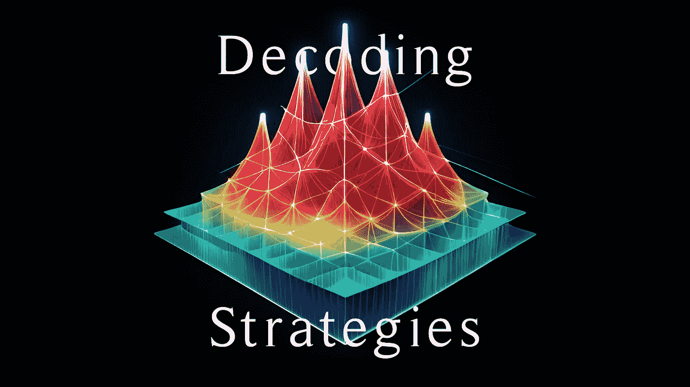
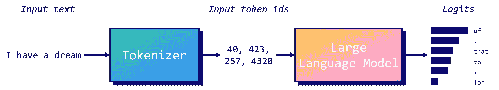
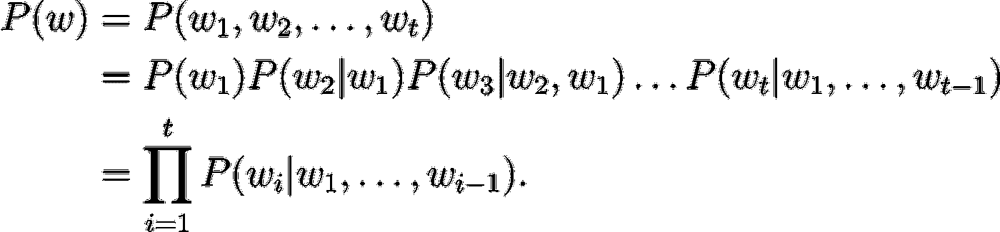
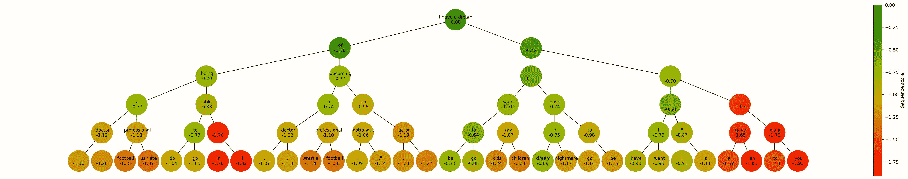
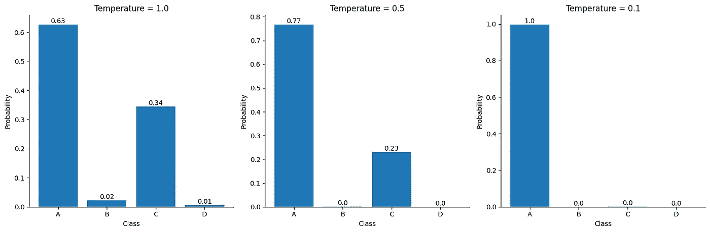
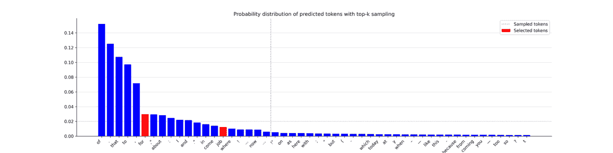
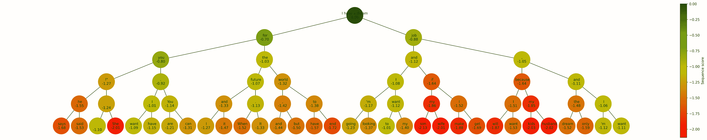
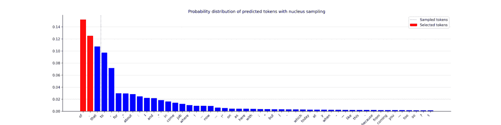
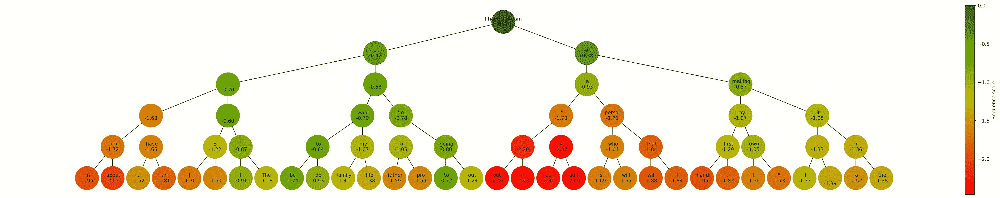

# 大型语言模型中的解码策略

> 原文：[`towardsdatascience.com/decoding-strategies-in-large-language-models-9733a8f70539`](https://towardsdatascience.com/decoding-strategies-in-large-language-models-9733a8f70539)

## 从束搜索到核采样的文本生成指南

[](https://medium.com/@mlabonne?source=post_page-----9733a8f70539--------------------------------)[](https://towardsdatascience.com/?source=post_page-----9733a8f70539--------------------------------) [马克西姆·拉博讷](https://medium.com/@mlabonne?source=post_page-----9733a8f70539--------------------------------)

·发表于 [Towards Data Science](https://towardsdatascience.com/?source=post_page-----9733a8f70539--------------------------------) ·阅读时间 15 分钟·2023 年 6 月 4 日

--



图片由作者提供。

在大型语言模型（LLM）的迷人世界中，很多关注都集中在模型架构、数据处理和优化上。然而，像束搜索这样的解码策略，在文本生成中发挥着至关重要的作用，却常常被忽视。在本文中，我们将探讨 LLM 如何生成文本，通过深入了解贪婪搜索和束搜索的机制，以及使用 top-k 和 nucleus 采样的采样技术。

到本文结束时，你不仅会彻底理解这些解码策略，还会熟悉如何处理重要的超参数，如温度、num_beams、top_k 和 top_p。

本文的代码可以在 [GitHub](https://github.com/mlabonne/llm-course/blob/main/Decoding_Strategies_in_Large_Language%C2%A0Models.ipynb) 和 [Google Colab](https://colab.research.google.com/drive/19CJlOS5lI29g-B3dziNn93Enez1yiHk2?usp=sharing) 上找到，以供参考和进一步探索。

# 📚 背景

为了开始，让我们从一个例子开始。我们将“我有一个梦想”这个文本输入到 GPT-2 模型中，并要求它生成接下来的五个标记（单词或子单词）。

```py
from transformers import GPT2LMHeadModel, GPT2Tokenizer
import torch

device = 'cuda' if torch.cuda.is_available() else 'cpu'
model = GPT2LMHeadModel.from_pretrained('gpt2').to(device)
tokenizer = GPT2Tokenizer.from_pretrained('gpt2')
model.eval()

text = "I have a dream"
input_ids = tokenizer.encode(text, return_tensors='pt').to(device)

outputs = model.generate(input_ids, max_length=len(input_ids.squeeze())+5)
generated_text = tokenizer.decode(outputs[0], skip_special_tokens=True)
print(f"Generated text: {generated_text}")
```

```py
Generated text: I have a dream of being a doctor.
```

句子“我有一个成为医生的梦想”似乎是由 GPT-2 生成的。然而，GPT-2 并没有*准确*生成这个句子。

有一种普遍的误解是，像 GPT-2 这样的 LLM **直接生成文本**。事实并非如此。相反，LLM 计算 logits，即分配给其词汇表中每个可能标记的分数。为了简化，这里有一个说明性过程分解：



图片由作者提供。

分词器，[字节对编码](https://en.wikipedia.org/wiki/Byte_pair_encoding) 在这个实例中，将输入文本中的每个词翻译成对应的词 ID。然后，GPT-2 使用这些词 ID 作为输入并尝试预测下一个最可能的词。最后，模型生成 logits，这些 logits 通过 softmax 函数转换为概率。

例如，该模型为“of”作为 “I have a dream” 之后的下一个词分配了 17% 的概率。这个输出本质上表示了潜在下一个词的排名列表。更正式地，我们将这个概率表示为 *P(of | I have a dream) = 17%*。

自回归模型如 GPT 会基于前面的词预测序列中的下一个词。考虑一个词序列 *w = (w*₁*, w*₂*, …, w*ₜ*)*。这个序列的联合概率 *P(w)* 可以被分解为：



对于序列中的每个词 *wᵢ*，*P(wᵢ | w₁, w₂, …, wᵢ₋₁)* 表示在给定所有前面的词（*w₁, w₂, …, wᵢ₋₁*）的情况下 *wᵢ* 的条件概率。GPT-2 为其词汇表中的每一个 50,257 个词计算这个条件概率。

这就引出了一个问题：我们如何利用这些概率生成文本？这就是解码策略（如贪婪搜索和束搜索）发挥作用的地方。

# 🏃‍♂️ 贪婪搜索

贪婪搜索是一种解码方法，它在每一步都选择最可能的词作为序列中的下一个词。简单来说，它只保留每个阶段中最可能的词，丢弃所有其他潜在的选项。以我们的例子为例：

+   **步骤 1**：输入：“I have a dream” → 最可能的词： “ of”

+   **步骤 2**：输入：“I have a dream of” → 最可能的词： “ being”

+   **步骤 3**：输入：“I have a dream of being” → 最可能的词： “ a”

+   **步骤 4**：输入：“I have a dream of being a” → 最可能的词： “ doctor”

+   **步骤 5**：输入：“I have a dream of being a doctor” → 最可能的词： “.”

尽管这种方法听起来直观，但需要注意的是，贪婪搜索具有短视性：它只考虑每一步中最可能的词，而不考虑对整个序列的总体影响。这一特性使得它快速且高效，因为它不需要跟踪多个序列，但也意味着它可能错过了那些通过稍微不那么可能的下一个词可能出现的更好序列。

接下来，让我们使用 graphviz 和 networkx 来说明贪婪搜索的实现。我们选择得分最高的 ID，计算其对数概率（我们取对数以简化计算），并将其添加到树中。我们将为五个词重复这个过程。

```py
import matplotlib.pyplot as plt
import networkx as nx
import numpy as np
import time

def get_log_prob(logits, token_id):
    # Compute the softmax of the logits
    probabilities = torch.nn.functional.softmax(logits, dim=-1)
    log_probabilities = torch.log(probabilities)

    # Get the log probability of the token
    token_log_probability = log_probabilities[token_id].item()
    return token_log_probability

def greedy_search(input_ids, node, length=5):
    if length == 0:
        return input_ids

    outputs = model(input_ids)
    predictions = outputs.logits

    # Get the predicted next sub-word (here we use top-k search)
    logits = predictions[0, -1, :]
    token_id = torch.argmax(logits).unsqueeze(0)

    # Compute the score of the predicted token
    token_score = get_log_prob(logits, token_id)

    # Add the predicted token to the list of input ids
    new_input_ids = torch.cat([input_ids, token_id.unsqueeze(0)], dim=-1)

    # Add node and edge to graph
    next_token = tokenizer.decode(token_id, skip_special_tokens=True)
    current_node = list(graph.successors(node))[0]
    graph.nodes[current_node]['tokenscore'] = np.exp(token_score) * 100
    graph.nodes[current_node]['token'] = next_token + f"_{length}"

    # Recursive call
    input_ids = greedy_search(new_input_ids, current_node, length-1)

    return input_ids

# Parameters
length = 5
beams = 1

# Create a balanced tree with height 'length'
graph = nx.balanced_tree(1, length, create_using=nx.DiGraph())

# Add 'tokenscore', 'cumscore', and 'token' attributes to each node
for node in graph.nodes:
    graph.nodes[node]['tokenscore'] = 100
    graph.nodes[node]['token'] = text

# Start generating text
output_ids = greedy_search(input_ids, 0, length=length)
output = tokenizer.decode(output_ids.squeeze().tolist(), skip_special_tokens=True)
print(f"Generated text: {output}")
```

```py
Generated text: I have a dream of being a doctor.
```

我们的贪婪搜索生成的文本与 transformers 库中的文本相同：“I have a dream of being a doctor。”让我们可视化我们创建的树。

```py
import matplotlib.pyplot as plt
import networkx as nx
import matplotlib.colors as mcolors
from matplotlib.colors import LinearSegmentedColormap

def plot_graph(graph, length, beams, score):
    fig, ax = plt.subplots(figsize=(3+1.2*beams**length, max(5, 2+length)), dpi=300, facecolor='white')

    # Create positions for each node
    pos = nx.nx_agraph.graphviz_layout(graph, prog="dot")

    # Normalize the colors along the range of token scores
    if score == 'token':
        scores = [data['tokenscore'] for _, data in graph.nodes(data=True) if data['token'] is not None]
    elif score == 'sequence':
        scores = [data['sequencescore'] for _, data in graph.nodes(data=True) if data['token'] is not None]
    vmin = min(scores)
    vmax = max(scores)
    norm = mcolors.Normalize(vmin=vmin, vmax=vmax)
    cmap = LinearSegmentedColormap.from_list('rg', ["r", "y", "g"], N=256) 

    # Draw the nodes
    nx.draw_networkx_nodes(graph, pos, node_size=2000, node_shape='o', alpha=1, linewidths=4, 
                          node_color=scores, cmap=cmap)

    # Draw the edges
    nx.draw_networkx_edges(graph, pos)

    # Draw the labels
    if score == 'token':
        labels = {node: data['token'].split('_')[0] + f"\n{data['tokenscore']:.2f}%" for node, data in graph.nodes(data=True) if data['token'] is not None}
    elif score == 'sequence':
        labels = {node: data['token'].split('_')[0] + f"\n{data['sequencescore']:.2f}" for node, data in graph.nodes(data=True) if data['token'] is not None}
    nx.draw_networkx_labels(graph, pos, labels=labels, font_size=10)
    plt.box(False)

    # Add a colorbar
    sm = plt.cm.ScalarMappable(cmap=cmap, norm=norm)
    sm.set_array([])
    if score == 'token':
        fig.colorbar(sm, ax=ax, orientation='vertical', pad=0, label='Token probability (%)')
    elif score == 'sequence':
        fig.colorbar(sm, ax=ax, orientation='vertical', pad=0, label='Sequence score')
    plt.show()

# Plot graph
plot_graph(graph, length, 1.5, 'token')
```


作者提供的图片。

在此图中，顶级节点存储输入令牌（因此概率为 100%），而所有其他节点表示生成的令牌。虽然这个序列中的每个令牌在预测时都是最可能的，但“being”和“doctor”被分配了相对较低的概率，分别为 9.68%和 2.86%。这表明“of”，我们的第一个预测令牌，可能不是最合适的选择，因为它导致了“being”，这是相当不可能的。

在接下来的部分中，我们将探讨光束搜索如何解决这个问题。

# ⚖️ Beam Search

与仅考虑下一个最可能令牌的贪婪搜索不同，光束搜索考虑了*n*个最可能的令牌，其中*n*代表光束的数量。这个过程会重复，直到达到预定义的最大长度或出现序列结束令牌。此时，具有最高总体分数的序列（或“光束”）被选为输出。

我们可以调整之前的函数，以考虑*n*个最可能的令牌，而不仅仅是一个。在这里，我们将保持序列分数日志*P(w)*，它是光束中每个令牌对数概率的累积和。我们通过序列长度来归一化此分数，以防止对较长序列的偏倚（这个因子可以调整）。我们将生成五个额外的令牌来完成句子“I have a dream.”

```py
from tqdm.notebook import tqdm

def greedy_sampling(logits, beams):
    return torch.topk(logits, beams).indices

def beam_search(input_ids, node, bar, length, beams, sampling, temperature=0.1):
    if length == 0:
        return None

    outputs = model(input_ids)
    predictions = outputs.logits

    # Get the predicted next sub-word (here we use top-k search)
    logits = predictions[0, -1, :]

    if sampling == 'greedy':
        top_token_ids = greedy_sampling(logits, beams)
    elif sampling == 'top_k':
        top_token_ids = top_k_sampling(logits, temperature, 20, beams)
    elif sampling == 'nucleus':
        top_token_ids = nucleus_sampling(logits, temperature, 0.5, beams)

    for j, token_id in enumerate(top_token_ids):
        bar.update(1)

        # Compute the score of the predicted token
        token_score = get_log_prob(logits, token_id)
        cumulative_score = graph.nodes[node]['cumscore'] + token_score

        # Add the predicted token to the list of input ids
        new_input_ids = torch.cat([input_ids, token_id.unsqueeze(0).unsqueeze(0)], dim=-1)

        # Add node and edge to graph
        token = tokenizer.decode(token_id, skip_special_tokens=True)
        current_node = list(graph.successors(node))[j]
        graph.nodes[current_node]['tokenscore'] = np.exp(token_score) * 100
        graph.nodes[current_node]['cumscore'] = cumulative_score
        graph.nodes[current_node]['sequencescore'] = 1/(len(new_input_ids.squeeze())) * cumulative_score
        graph.nodes[current_node]['token'] = token + f"_{length}_{j}"

        # Recursive call
        beam_search(new_input_ids, current_node, bar, length-1, beams, sampling, 1)

# Parameters
length = 5
beams = 2

# Create a balanced tree with height 'length' and branching factor 'k'
graph = nx.balanced_tree(beams, length, create_using=nx.DiGraph())
bar = tqdm(total=len(graph.nodes))

# Add 'tokenscore', 'cumscore', and 'token' attributes to each node
for node in graph.nodes:
    graph.nodes[node]['tokenscore'] = 100
    graph.nodes[node]['cumscore'] = 0
    graph.nodes[node]['sequencescore'] = 0
    graph.nodes[node]['token'] = text

# Start generating text
beam_search(input_ids, 0, bar, length, beams, 'greedy', 1)
```

该函数计算 63 个令牌的分数和 beams^length = 5² = 25 个可能序列。在我们的实现中，所有信息都存储在图表中。我们的下一步是提取最佳序列。

首先，我们确定具有最高序列分数的叶节点。接下来，我们找到从根到这个叶子节点的最短路径。沿着这条路径的每个节点都包含了最优序列中的一个令牌。以下是我们如何实现它：

```py
def get_best_sequence(G):
    # Create a list of leaf nodes
    leaf_nodes = [node for node in G.nodes() if G.out_degree(node)==0]

    # Get the leaf node with the highest cumscore
    max_score_node = None
    max_score = float('-inf')
    for node in leaf_nodes:
        if G.nodes[node]['sequencescore'] > max_score:
            max_score = G.nodes[node]['sequencescore']
            max_score_node = node

    # Retrieve the sequence of nodes from this leaf node to the root node in a list
    path = nx.shortest_path(G, source=0, target=max_score_node)

    # Return the string of token attributes of this sequence
    sequence = "".join([G.nodes[node]['token'].split('_')[0] for node in path])

    return sequence, max_score

sequence, max_score = get_best_sequence(graph)
print(f"Generated text: {sequence}")
```

```py
Generated text: I have a dream. I have a dream
```

最佳序列似乎是“I have a dream. I have a dream”，这是 GPT-2 的常见响应，尽管这可能令人惊讶。为了验证这一点，让我们绘制图表。

在这个可视化中，我们将显示每个节点的序列分数，这代表了到该点为止的序列分数。如果函数 get_best_sequence()是正确的，则序列“I have a dream. I have a dream”中的“dream”节点应该在所有叶节点中具有最高分数。

```py
# Plot graph
plot_graph(graph, length, beams, 'sequence')
```



确实，“dream”令牌具有**最高序列分数**，值为-0.69。令人感兴趣的是，我们可以看到左侧贪婪序列“I have a dream of being a doctor.”的分数值为-1.16。

正如预期的那样，贪婪搜索导致了次优结果。但是，老实说，我们的新结果也没有特别引人注目。为了生成更多样化的序列，我们将实现两种采样算法：top-k 和 nucleus。

# 🎲 Top-k 采样

Top-k 采样是一种利用语言模型生成的概率分布来**从最可能的*k*个选项中随机选择一个令牌**的技术。

举例来说，假设我们有*k = 3*和四个 token：A、B、C 和 D，分别的概率为：*P(A) = 30%*、*P(B) = 15%*、*P(C) = 5%*和*P(D) = 1%*。在 top-k 采样中，token D 被忽略，算法会在 60%的时间内输出 A，在 30%的时间内输出 B，在 10%的时间内输出 C。这种方法确保我们优先考虑最可能的 token，同时在选择过程中引入一定的随机性。

引入随机性的另一种方式是温度的概念。温度*T*是一个范围从 0 到 1 的参数，它影响 softmax 函数生成的概率，使最可能的 token 更具影响力。在实际操作中，它简单地包括将输入 logits 除以我们称之为温度的值：


这里是一个图表，展示了温度对给定输入 logits [1.5, -1.8, 0.9, -3.2] 生成的概率的影响。我们绘制了三种不同的温度值来观察差异。



温度为 1.0 相当于没有温度的默认 softmax。另一方面，低温设置（0.1）会显著改变概率分布。这在文本生成中常用于控制生成输出的“创造性”水平。通过调整温度，我们可以影响模型生成更具多样性或更可预测的响应的程度。

现在让我们实现 top-k 采样算法。我们将在 beam_search()函数中使用“top_k”参数。为了说明算法的工作原理，我们还将绘制 top_k = 20 的概率分布。

```py
def plot_prob_distribution(probabilities, next_tokens, sampling, potential_nb, total_nb=50):
    # Get top k tokens
    top_k_prob, top_k_indices = torch.topk(probabilities, total_nb)
    top_k_tokens = [tokenizer.decode([idx]) for idx in top_k_indices.tolist()]

    # Get next tokens and their probabilities
    next_tokens_list = [tokenizer.decode([idx]) for idx in next_tokens.tolist()]
    next_token_prob = probabilities[next_tokens].tolist()

    # Create figure
    plt.figure(figsize=(0.4*total_nb, 5), dpi=300, facecolor='white')
    plt.rc('axes', axisbelow=True)
    plt.grid(axis='y', linestyle='-', alpha=0.5)
    if potential_nb < total_nb:
        plt.axvline(x=potential_nb-0.5, ls=':', color='grey', label='Sampled tokens')
    plt.bar(top_k_tokens, top_k_prob.tolist(), color='blue')
    plt.bar(next_tokens_list, next_token_prob, color='red', label='Selected tokens')
    plt.xticks(rotation=45, ha='right', va='top')
    plt.gca().spines['top'].set_visible(False)
    plt.gca().spines['right'].set_visible(False)
    if sampling == 'top_k':
        plt.title('Probability distribution of predicted tokens with top-k sampling')
    elif sampling == 'nucleus':
        plt.title('Probability distribution of predicted tokens with nucleus sampling')
    plt.legend()
    plt.savefig(f'{sampling}_{time.time()}.png', dpi=300)
    plt.close()

def top_k_sampling(logits, temperature, top_k, beams, plot=True):
    assert top_k >= 1
    assert beams <= top_k

    indices_to_remove = logits < torch.topk(logits, top_k)[0][..., -1, None]
    new_logits = torch.clone(logits)
    new_logits[indices_to_remove] = float('-inf')

    # Convert logits to probabilities
    probabilities = torch.nn.functional.softmax(new_logits / temperature, dim=-1)

    # Sample n tokens from the resulting distribution
    next_tokens = torch.multinomial(probabilities, beams)

    # Plot distribution
    if plot:
        total_prob = torch.nn.functional.softmax(logits / temperature, dim=-1)
        plot_prob_distribution(total_prob, next_tokens, 'top_k', top_k)

    return next_tokens

# Start generating text
beam_search(input_ids, 0, bar, length, beams, 'top_k', 1)
```



图片由作者提供。

这些图给出了 top-k 采样如何工作的良好直观印象，所有可能选择的 token 在水平条的左侧。虽然最可能的 token（红色）大多数时间被选择，但它也允许选择可能性较低的 token。这提供了一个有趣的权衡，可以使序列趋向于一个更不可预测但更自然的句子。现在让我们打印它生成的文本。

```py
sequence, max_score = get_best_sequence(graph)
print(f"Generated text: {sequence}")
```

```py
Generated text: I have a dream job and I want to
```

top-k 采样找到了一个新序列：“我有一个梦想工作，我想要”，这比“我有一个梦想。我有一个梦想”显得自然得多。我们在取得进展！

让我们看看这个决策树与之前的有何不同。

```py
# Plot graph
plot_graph(graph, length, beams, 'sequence')
```



你可以看到节点与之前的迭代相比有显著不同，做出了更多样的选择。虽然这一新结果的序列分数可能不是最高的（-1.01，而之前为-0.69），但要记住，更高的分数并不总是能导致更现实或有意义的序列。

现在我们引入了 top-k 采样，我们必须介绍另一种最受欢迎的采样技术：核心采样。

# 🔬 核心采样

核采样，也称为 top-p 采样，与 top-k 采样采取了不同的方法。核采样不是选择前*k*个最可能的标记，而是选择一个截止值*p*，使得**选择的标记的概率总和超过*p***。这形成了一个从中随机选择下一个标记的“核心”。

换句话说，模型按概率从高到低检查其最可能的标记，并不断将它们添加到列表中，直到总概率超过阈值*p*。与 top-k 采样不同，核中包含的标记数量可能在每一步变化。这种变化通常导致更具多样性和创造性的输出，使得核采样在文本生成等任务中颇受欢迎。

为了实现核采样方法，我们可以在`beam_search()`函数中使用“nucleus”参数。在这个示例中，我们将*p*的值设置为 0.5。为了简化操作，我们将包括一个最小的标记数，等于光束的数量。我们还将考虑累计概率低于*p*的标记，而不是高于的标记。值得注意的是，虽然细节可能有所不同，但核采样的核心思想保持不变。

```py
def nucleus_sampling(logits, temperature, p, beams, plot=True):
    assert p > 0
    assert p <= 1

    # Sort the probabilities in descending order and compute cumulative probabilities
    sorted_logits, sorted_indices = torch.sort(logits, descending=True)
    probabilities = torch.nn.functional.softmax(sorted_logits / temperature, dim=-1)
    cumulative_probabilities = torch.cumsum(probabilities, dim=-1)

    # Create a mask for probabilities that are in the top-p
    mask = cumulative_probabilities < p

    # If there's not n index where cumulative_probabilities < p, we use the top n tokens instead
    if mask.sum() > beams:
        top_p_index_to_keep = torch.where(mask)[0][-1].detach().cpu().tolist()
    else:
        top_p_index_to_keep = beams

    # Only keep top-p indices
    indices_to_remove = sorted_indices[top_p_index_to_keep:]
    sorted_logits[indices_to_remove] = float('-inf')

    # Sample n tokens from the resulting distribution
    probabilities = torch.nn.functional.softmax(sorted_logits / temperature, dim=-1)
    next_tokens = torch.multinomial(probabilities, beams)

    # Plot distribution
    if plot:
        total_prob = torch.nn.functional.softmax(logits / temperature, dim=-1)
        plot_prob_distribution(total_prob, next_tokens, 'nucleus', top_p_index_to_keep)

    return next_tokens

# Start generating text
beam_search(input_ids, 0, bar, length, beams, 'nucleus', 1)
```



作者提供的图片。

在这个图中，你可以看到核中的标记数量（垂直条的左侧）波动很大。生成的概率分布变化很大，导致选择的标记不总是最可能的。这为生成独特而多样化的序列打开了大门。现在，让我们观察它生成的文本。

```py
sequence, max_score = get_best_sequence(graph)
print(f"Generated text: {sequence}")
```

```py
Generated text: I have a dream. I'm going to
```

核采样算法生成的序列是：“I have a dream. I’m going to”，与贪婪采样相比，显示了语义一致性的显著提升。

为了比较决策路径，让我们可视化新生成的树核采样。

```py
# Plot graph
plot_graph(graph, length, beams, 'sequence')
```



与 top-k 采样一样，这棵树与贪婪采样生成的树非常不同，展示了更多的多样性。top-k 和核采样在生成文本时都提供了独特的优势，增强了多样性，并在输出中引入了创造力。你对这两种方法（甚至是贪婪搜索）的选择将取决于你项目的具体要求和限制。

# 结论

在这篇文章中，我们深入探讨了 LLM（尤其是 GPT-2）使用的各种解码方法。我们从简单的**贪婪搜索**开始，这种方法会立即（但往往不是最佳的）选择最可能的下一个标记。接下来，我们介绍了**光束搜索**技术，这种方法在每一步考虑几个最可能的标记。尽管它提供了更为细致的结果，但光束搜索有时在生成多样化和富有创造性的序列方面表现不佳。

为了引入更多的变异性，我们接着使用了**top-k 采样**和**nucleus 采样**。Top-k 采样通过在*最可能的 k 个*标记中随机选择来多样化文本生成，而 nucleus 采样则通过基于累计概率动态地形成一个标记的核心来采取不同的方法。这些方法各自具有独特的优点和潜在的缺点，具体的选择将主要取决于你项目的要求。

最终，理解这些技术及其权衡将帮助你更好地引导 LLMs 生成越来越真实、细致和引人入胜的文本输出。

如果你对更多关于 LLMs 的技术内容感兴趣，可以在 Twitter 上关注我 [@maximelabonne](https://twitter.com/maximelabonne)。
