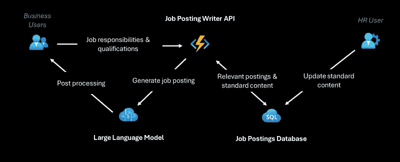

# **生成式 AI 中的任务概念**：智能系统的构建模块

> 原文：[`towardsdatascience.com/decoding-tasks-in-generative-ai-the-building-blocks-of-intelligent-systems-f677e8e2ee22`](https://towardsdatascience.com/decoding-tasks-in-generative-ai-the-building-blocks-of-intelligent-systems-f677e8e2ee22)

## 大型企业的生成式 AI：从治理到汇聚 API，第一部分

[](https://eavanvalkenburg.medium.com/?source=post_page-----f677e8e2ee22--------------------------------)[](https://towardsdatascience.com/?source=post_page-----f677e8e2ee22--------------------------------) [Eduard van Valkenburg](https://eavanvalkenburg.medium.com/?source=post_page-----f677e8e2ee22--------------------------------)

·发表于 [Towards Data Science](https://towardsdatascience.com/?source=post_page-----f677e8e2ee22--------------------------------) ·阅读时长 8 分钟·2023 年 9 月 7 日

--

欢迎，亲爱的科技爱好者和商业领袖们！我很高兴开始一系列关于**生成式 AI**的博客文章，这个话题正在世界上引起广泛关注。

在我深入探讨企业生成式 AI 的迷人世界时，我将不仅探讨治理、安全和可审计等高层次概念，还会提供关于汇聚 API 和理解生成式 AI 架构等主题的实用指导。


图片由 OpenAI 的 DALL-E 模型创建，提示：一位模仿维米尔风格的写作机器人

无论你是 AI 领域的资深专家还是好奇的新手，这个系列旨在阐明大型企业如何利用生成式 AI 的力量推动创新、效率和价值。我将深入探讨复杂问题，破解术语，并提供可操作的见解，帮助你自信地应对 AI 领域。因此，系好安全带，加入我这段激动人心的商业技术未来之旅吧。让我们一起揭开 AI 的神秘面纱！

***免责声明***：本文提供了一些建筑概念的概述，这些概念并不特定于 Azure，但由于我是微软的解决方案架构师，因此有时会用 Azure 服务进行说明。

# **任务**

我们的第一个中途站是“任务”。在 AI 的宏大体系中，任务是那些小而强大的齿轮，保持着轮子的运转。它们是语言模型（LLM）可以为你执行的明确工作单元，作为你更广泛（AI）系统的构建块。

当我谈论任务时，我指的是具有指定输入和输出的操作。每次任务执行都是独立的，这意味着它不依赖于过去或未来的执行。它是一个在其自身范围内运行的独立操作。

这些任务中内置了提示以引导 LLM。这有点像给朋友提供一套指示——你需要明确且简洁，这样他们就知道该怎么做。有时这可能涉及添加几个示例（few-shots 是输入和预期输出的示例），但提示的构造方式有很多，这超出了本文的范围。

需要考虑的其他事项包括如何在将输出返回给发起用户或应用程序之前进行检查，这时日志记录、监控和其他常规 DevOps 过程就派上用场了。

但对于生成型 AI，还有其他需要考虑的技术。这通常表现为围绕你正在构建的服务的包装器，根据特定的过滤器捕获不同的内容，例如使用[Azure AI Content Safety](https://azure.microsoft.com/en-us/products/ai-services/ai-content-safety)，但这也可能包括用一个人类参与的设置来包装执行，以确保输出在范围内，因为人们检查部分或全部生成的输出。

最后，另一种值得考虑的方法是使用像[Prompt Flow](https://learn.microsoft.com/en-us/azure/machine-learning/prompt-flow/overview-what-is-prompt-flow?view=azureml-api-2)这样的工具来编写不同的输入和输出变体，并持续测试这些变体是否仍能产生预期的结果。这对于评估升级的模型（例如当 GPT-35-Turbo 从版本 0301 升级到 0613 时）很有用，但它也可以用来验证并选择适合特定任务的模型，测试一个任务用较小（因此更便宜且更快）的模型，比如 Meta 的 Llama 模型，以及像 GPT-35-Turbo 和 GPT4 这样的较大模型，甚至是微调后的模型，并根据指标自动决定哪些模型应被用于优化成本、延迟和准确性。

# 集成与示例

所有这一切的美妙之处在于它通过一个文档齐全的 API 暴露出来。这意味着密钥、账单和日志记录通过某种 API 管理系统进行管理，使过程无缝且用户友好，同时以不同的方式将 LLM 的强大功能提供给许多应用程序。

为了让这个概念更具体，我们来看几个例子。假设你需要从文本中导出销售订单，或者用特定领域的重点来总结文本。这些都是 LLM 可以有效且高效完成的任务。

## 示例 1：根据要求列表和现有职位发布编写职位发布

这个任务是由 HR 部门创建的解决方案，但可能会被公司中的经理使用，最好嵌入到支持职位发布或职业网站的应用程序中（并从那里集成到 LinkedIn 等职位板）。

这种任务的用户输入包括职位名称、职责和资格要求，还包括部门和级别等内容。

使用这个输入，任务会加载相关的可比职位发布作为示例。它可能在提示中包含类似“始终以此文本结束：…”的语言，这作为 HR 在所有职位发布中执行强制性语言的一种方式。

最后，它会实际调用 LLM 来生成新的文本并将其返回给用户。在这个阶段，输出可能会检查某些术语或文本，以确保模型的幻觉不会妨碍结果。也可能会进行一些后处理，例如默认将文本翻译成多种语言。

返回的结果会提供给请求者以进行验证和批准，在进行任何更改或调整后，之前提到的检查和后处理也可能会在此之后触发，以确保用户不会删除强制性措辞，并且翻译是在最终产品上完成的。



示例 1 的流程示意图 — 图片由作者提供

## 示例 2：将来自电子邮件或电话的订单解析为 JSON

第二个示例专注于自动化那些难以编程的任务。在这个案例中，销售订单，例如来自零售商的订单，通过电话或电子邮件发送过来。

为了从这些自由文本格式中获取“技术”描述，大多数情况下，人工劳动是唯一的解决方法，即使你可能能用复杂的正则表达式和大量代码拼凑出一些东西，但这种工作是 LLM 真正擅长处理人类制造的“混乱”的地方。

对于电话消息，第一步是将其转录出来，目前有许多 API 和模型可以做到这一点，因此在这里我不会详细说明。输出结果与电子邮件相同。

电子邮件或转录的文本会发送到此任务的 API 端点，该任务有一个提示，其中包含指示，例如“从以下文本生成一个 json 对象，总结订单，包含以下字段：customer_name、product、SKU、amount 等…”，某些字段可能包括允许的值，如品牌或产品名称，而其他字段可能指定默认值，所有这些都是提示的一部分。

例如，提示可能如下所示：

```py
*You must extract the following information from the user question below:

1\. Customer (key: customer)
2\. Location (key: location)
3\. Products and orders in a array (key: order_items)

Each order item should have the following information:
1\. Brand, can be Contoso, AdventureWorks (key: brand)
2\. Product, can be Soda, Water, Sparkling Water, default is 'Water' (key: product)
3\. Number of items (key: amount)
4\. Package type, i.e. bottle, can, crate, carton (key: type)

Make sure fields 1 to 3 are answered very short, e.g. for location just say the location name
Please answer in JSON machine-readable format, using the keys from above.

User question:
{{ email or phone transcription }}

JSON:*
```

使用 LLM 处理输入时，*早上好，我在西雅图第 1 大道南的 AW Bar 工作，我想订购 5 箱 Contoso 气泡酒、2 箱 AW 苏打水和 4 瓶 AdventureWorks* 的输出可能如下所示：

```py
{
    "customer": "AW Bar",
    "location": "Seattle, WA",
    "order_items": [
        {
            "brand": "Contoso",
            "product": "Sparkling",
            "amount": 5,
            "type": "Crate"
        },
        {
            "brand": "AdventureWorks",
            "product": "Soda",
            "amount": 2,
            "type": "Carton"
        },
        {
            "brand": "AdventureWorks",
            "product": "Water",
            "amount": 4,
            "type": "Bottle"
        }
    ]
}
```

接下来，对该 JSON 对象进行后处理以验证这些值，检查品牌或产品名称、SKU、订购数量等。如果发现错误，将使用第二个提示请求 LLM 对该特定字段进行更正，如果仍然无法通过验证，则整个任务会被放入某种队列中，交由销售订单处理部门的人员手动修复遗漏或联系客户验证订单，这也可以用于向任务开发者提供反馈，以便他们能随时间捕捉到新的遗漏。

最后，如果订单正确，将其录入订单处理系统，根据情况，订单要么被处理，要么要求客户签字确认后再继续（这也可以依赖于订单，例如如果总订单金额超过某个阈值，客户需要确认，这个阈值可以通过与客户之前的订单进行比较来动态调整）。


图像由 OpenAI 的 DALL-E 模型生成，提示：一个写作机器人以维米尔风格创建销售订单

总之，将提示和 LLM 封装在 RESTful API 中以支持特定任务是一种非常有用的模式，确保不同的团队和应用程序可以重用组织中其他人和团队的智能思维，而无需重新开发所有逻辑，它还使企业能够确保满足某些标准，无论是输出，如第一个示例，还是结构和字段名称，如第二个示例。通过使这些 API 可用并添加 API 聚合层，可以使企业以可扩展、可预测和有价值的方式使用和利用 LLM。

所以，这就是本系列关于生成式 AI 在企业中应用的第一篇博客文章总结。我计划讨论的其他主题包括聊天机器人、治理，最后我将提出一个模型，如何将这些内容结合起来，使其在大型企业中有效运作。

请关注我的下一篇文章，我将深入探讨企业生成式 AI 的世界。在那之前，祝任务愉快！下一篇文章创建并发布时，我会用链接更新这篇文章。
