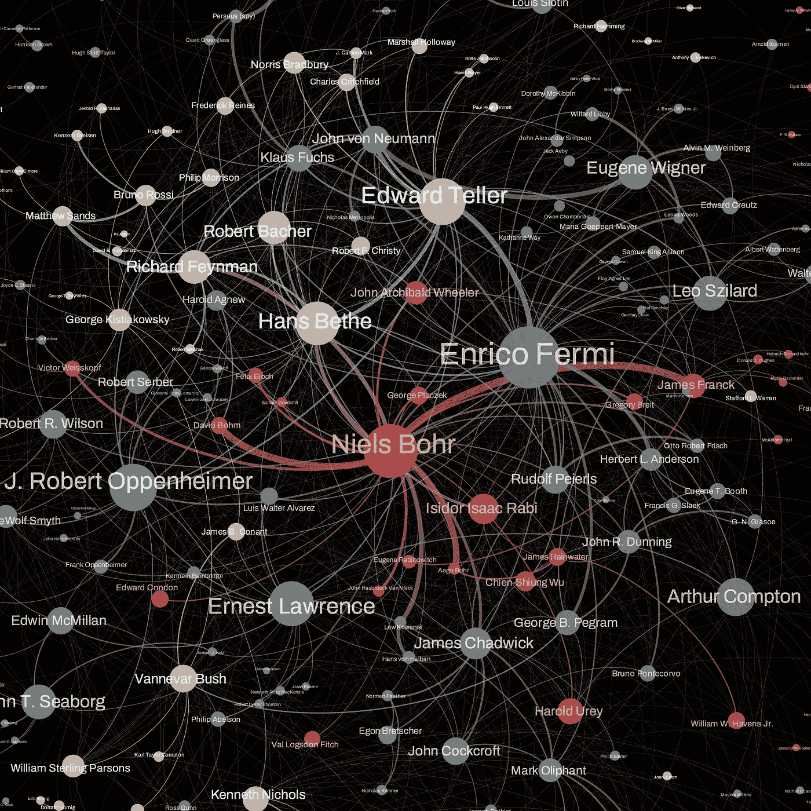
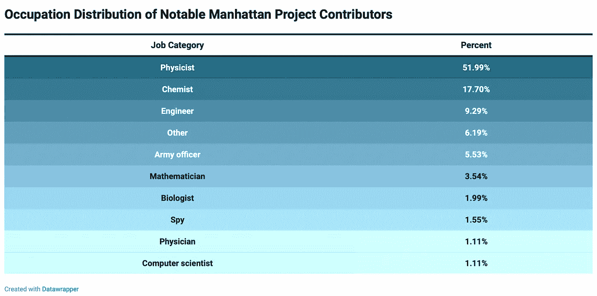
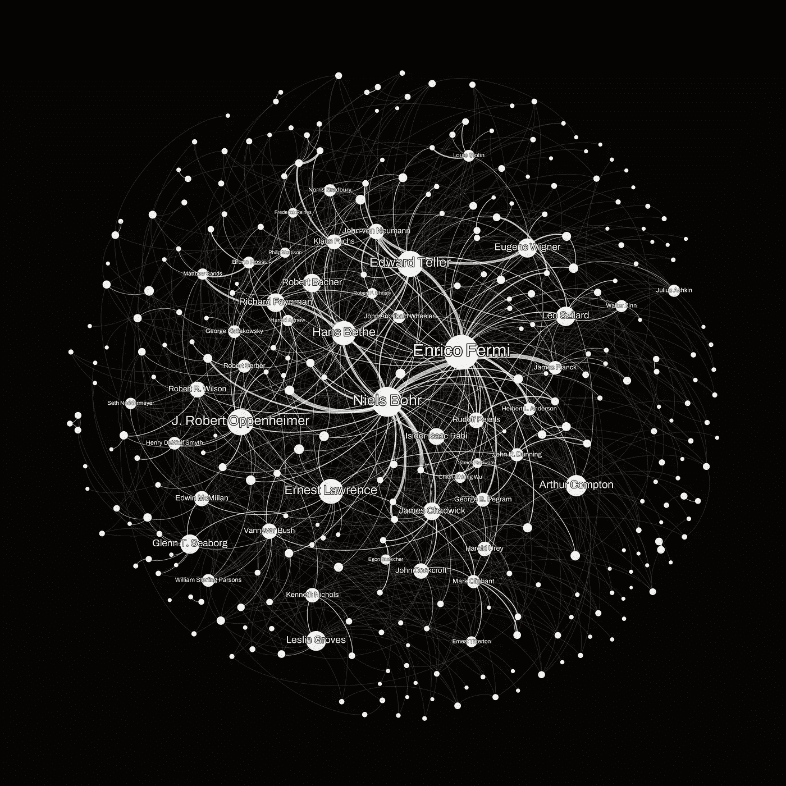
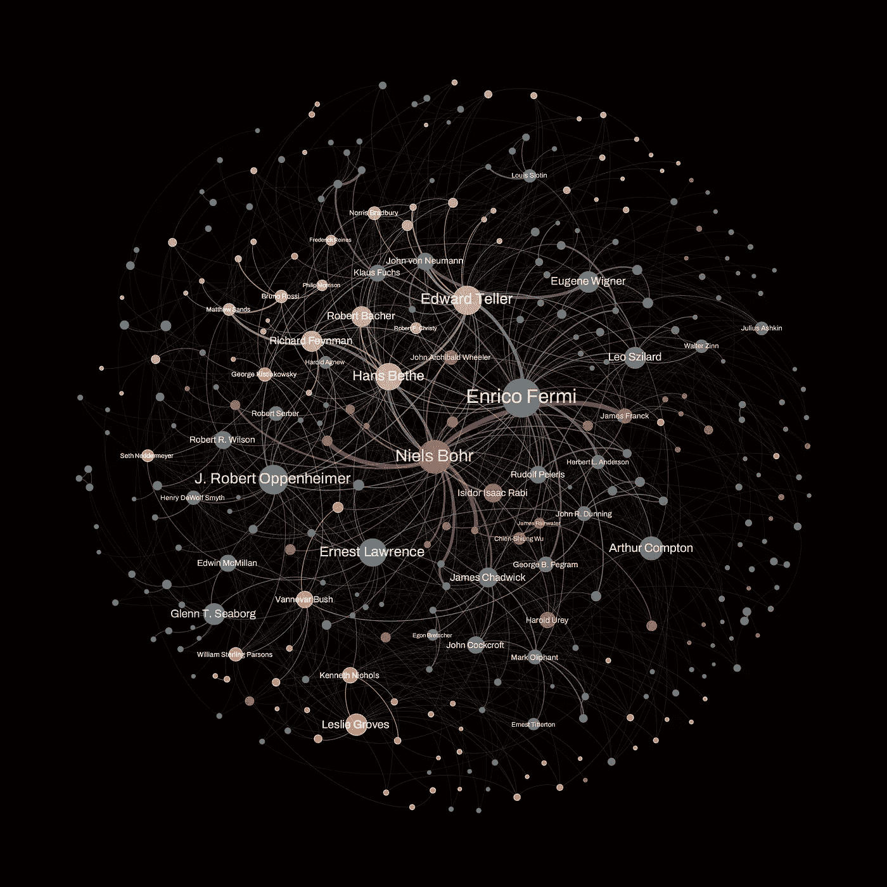
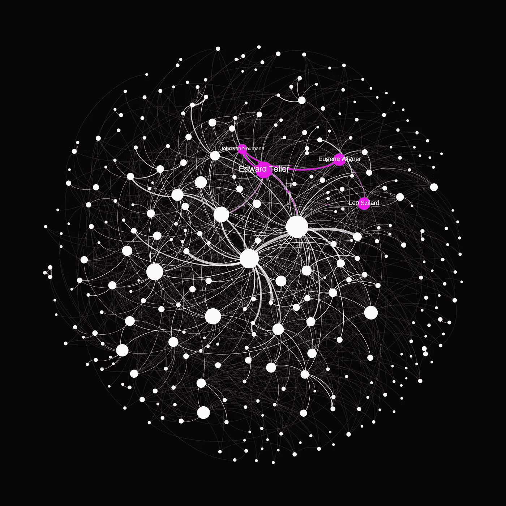

# 解码曼哈顿计划的网络：揭示科学、合作与人类遗产

> 原文：[`towardsdatascience.com/decoding-the-manhattan-projects-network-unveiling-science-collaboration-and-human-legacy-418164a2b416`](https://towardsdatascience.com/decoding-the-manhattan-projects-network-unveiling-science-collaboration-and-human-legacy-418164a2b416)

 [米兰·贾诺索夫](https://medium.com/@janosovm?source=post_page-----418164a2b416--------------------------------)

·发表于 [Towards Data Science](https://towardsdatascience.com/?source=post_page-----418164a2b416--------------------------------) ·阅读时长 7 分钟·2023 年 10 月 2 日

--

*发表于《夜莺》数据可视化学会期刊，2023 年 9 月 12 日。编辑：凯瑟琳·赫奇拉。*

曼哈顿计划是历史上最大规模的科学合作之一。它通过一张由杰出头脑组成的复杂社会网络运作，毫无疑问成为了人类历史上最显著的智力努力之一。然而，它在广岛和长崎原子弹爆炸期间及之后也产生了毁灭性的后果。尽管在轰炸及随后的事件中失去了数十万条人命，但科学之旅本身仍然证明了人类的成就，正如克里斯托弗·诺兰对奥本海默的电影描绘所强调的那样。

关于合作的科学文献，特别是网络连接在成功中所扮演的角色，已经非常丰富，并且在当前的数据爆炸中得到了进一步的丰富。这些数据的丰富性，如数以百万计的科学论文，就体现在像 D. Wang 和 A. L. Barabási 的《科学的科学》这样的著作中。利用网络分析来揭示曼哈顿计划中的复杂联系与我从物理学家转行到网络科学家的视角不谋而合。话不多说，这就是我如何将曼哈顿计划映射到数据中，并用这些数据创建该历史性合作项目的网络可视化。

# 收集数据

与许多数据科学项目一样，第一个问题涉及数据选择。虽然科学出版数据看起来很有逻辑，鉴于项目的科学性质，但这种方法证明是不足够的。主要原因有两个：首先，一些最重要的文档和论文可能仍然是机密；其次，并非所有人都活跃于科学领域，因为该操作也与政治和军事密切相关。因此，依靠集体智慧，我的重点转向了维基百科，一个全球众包的百科全书和潜在的数据源。维基百科提供了与该项目相关的显著人员名单 [2]，包括来自各个领域的 400 多名贡献者。我使用了简单的网页抓取技术从维基百科收集数据——共 452 个可用的个人资料。然后我手动根据职业对每个人进行分类，得出了以下表格所示的分布情况。

不足为奇的是，列表的首位是物理学家，其次是化学家和工程师。然而，探索科学领域，尤其是那些在计划前沿的人物，仍待展开。让我们看看“其他”类别中的故事。这个组汇集了那些出现频率较低且似乎与专注于武器开发的科学项目无关的主要职业贡献者。其中不寻常的贡献者包括美国鸟类学家沃尔夫里德·鲁迪耶德·鲍尔顿，他也负责监控来自比利时刚果的铀矿供应，以及在洛斯阿拉莫斯经营茶室的伊迪丝·华纳，她的角色被认为对研究人员的士气产生了深远的影响。

其他一些显著的“其他”人物包括夏洛特·瑟伯，一位记者、统计学家、图书管理员，以及洛斯阿拉莫斯唯一的女性实验室组长。班·波特也难以归类，他既是艺术家、作家、出版商、表演者，又是物理学家——后来在纽约现代艺术博物馆展出了作品。选择的最后是詹姆斯·爱德华·韦斯科特，一位著名的曼哈顿计划摄影师，以及唐纳德·林德利·哈维，一位职业篮球运动员转为军人并参与了该项目。

# 构建网络

在掌握数据后，我选择了网络科学 [3]，这种连接科学非常适合优雅地解码复杂结构，如曼哈顿计划的协作模式。每个网络由节点（实体）和链接（参考）组成，这些节点和链接编织了协作人员复杂的社会网络。在这个背景下，每个节点象征着曼哈顿计划的贡献者，链接则形成于那些互相引用维基百科页面的个人之间。共享参考的数量决定了链接的强度。利用这个简单的框架，我得到了一个由 316 名个体通过 1099 条不同强度的联系连接而成的网络。

图 1\. 曼哈顿计划背后的协作网络。每个节点代表一个贡献者，当两个节点的维基百科页面相互引用时，它们会连接。标记了前 50 个连接最多的节点。

# 将颜色融入洞察力

下一阶段通过引入颜色丰富了网络可视化 —— 每种颜色代表一个不同的网络社区或群集。定义这些社区依赖于方法论，但总体前提不变：社区由节点组成，这些节点之间的内部链接密度高于外部链接[4, 5]。换句话说，节点主要彼此连接 —— 而不是与网络的其余部分连接 —— 便属于一个社区。所得到的视觉效果，如图 2 所示，揭示了贡献者如何在广泛的曼哈顿计划中组织成紧密相连的群集。在此图中，每种颜色编码不同的社区。

图 2\. 曼哈顿计划背后的协作网络，如图 1 所示，其中每个节点的颜色基于其所属的网络社区。

# 解读网络叙事

有了图 2 中的生动可视化，我们可以开始解读协作网络。现代物理学的关键人物立刻显现，包括诺贝尔奖得主阿瑟·康普顿、恩里科·费米、尼尔斯·玻尔和欧内斯特·劳伦斯，还有像 J·罗伯特·奥本海默和爱德华·泰勒这样的天才。然而，这个故事及其背后的连接模式远不止是几个重要的节点。

在这个网络图的核心是由传奇人物尼尔斯·玻尔中心的红色社区。在这里，玻尔的联系揭示了他在第二次世界大战期间支持难民科学家的重要作用，这些科学家也参与了该计划，包括费利克斯·布洛赫、詹姆斯·弗兰克和乔治·普拉切克，他们都被标记为红色。与玻尔的领域相邻的是一个绿色群集，由意大利物理学家恩里科·费米突出显示。费米与他的合作者如安德森、塞拉德、康普顿和津恩一起，达到了使用铀进行自持链式反应的里程碑，并创造了第一个核反应堆——芝加哥堆-1。

图 3\. 曼哈顿计划背后的协作网络的特写图，根据图 2 中的网络社区着色，其中每个节点都被标记。

尽管尤金·维格纳以对芝加哥堆 1 号的贡献而闻名，但他的联系将他与似乎散布在网络中的紫色社区更紧密地联系在一起。维格纳在网络的右上角显著可见。这个更加分散的社区，除了奥本海默没有其他关键人物，还将著名数学家约翰·冯·诺依曼与紫色联系在一起，位于图 3 的顶部中心部分。他（和维格纳一起，不幸的是被诺兰的大片电影遗漏了）和紫色社区中的其他几位杰出科学家一起出现在网络中，例如位于底部中心的詹姆斯·查德维克，他领导了英国团队；紧挨着奥本海默的罗伯特·威尔逊，他成为了其回旋加速器小组的负责人；以及位于奥本海默正上方的美国物理学家罗伯特·瑟伯，他为所有三个设计项目和原子弹创建了代号，如“小男孩”和“胖子”。最后，简要提及灰色群体，这被发现是理论部，其中明星如爱德华·泰勒位于中心，诺贝尔奖得主理查德·费曼（我个人最喜欢的科学家）位于左上方，汉斯·贝特位于中心。

最后一个个人观察：乍一看，匈牙利移民火星人[6]泰勒、维格纳、西拉德和诺依曼之间的联系很难发现，尽管他们在原子时代初期和无数共同项目中扮演了基础性角色。然而，一旦我在网络上突出显示他们，我的预期很快得到了确认。他们彼此紧密联系，尽管并非唯一，这意味着他们当时也深深嵌入了美国科学界。这一点通过所谓的爱因斯坦-西拉德信件得到最好的说明，这封信由西拉德撰写，并咨询了泰勒和维格纳，最终由爱因斯坦签署并发送给罗斯福总统。这封信的一个有趣事实是：在那些日子里，爱因斯坦正在海滩度假，所以西拉德就在那儿拜访了他。而由于西拉德没有驾驶执照，泰勒则负责开车[7]。

图 4. 图 2 的一个变体，突出显示火星人——爱德华·泰勒、尤金·维格纳、利奥·西拉德和约翰·冯·诺依曼。

# 结尾

超越历史的篇章，这个项目体现了人类努力的汇聚——来自各个学科的杰出思想者为共同目标团结在一起。这项分析揭示了使这些伟大思想者能够互相联系、协作并在如此宏大的规模上取得成功的复杂合作模式和共同努力。此外，我建立这个网络的方式展示了网络科学如何应用于几乎任何社会系统，通过定量捕捉看不见的关系，并帮助解释其背后的隐藏模式。

# 免责声明

本文的几个部分由 AI 工具升级，即 Grammarly 和 ChatGPT 3.5，而整篇文本最初由人类作者草拟并随后更新。

## 参考文献

[1] 《科学的科学》，[王大顺](https://www.amazon.com/s/ref=dp_byline_sr_book_1?ie=UTF8&field-author=Dashun+Wang&text=Dashun+Wang&sort=relevancerank&search-alias=books)，[Albert-László Barabási](https://www.amazon.com/Albert-L%C3%A1szl%C3%B3-Barab%C3%A1si/e/B001IGQIYW/ref=dp_byline_cont_book_2)，剑桥大学出版社，2021 年。

[2] [`en.wikipedia.org/w/index.php?title=Category:Manhattan_Project_people`](https://en.wikipedia.org/w/index.php?title=Category%3AManhattan_Project_people)

[3] [Albert-László Barabási 的《网络科学》](http://networksciencebook.com/)，剑桥大学出版社，2015 年。

[4] 《巫师的网络地图》，米兰·雅诺索夫，[`nightingaledvs.com/a-network-map-of-the-witcher/`](https://nightingaledvs.com/a-network-map-of-the-witcher/)

[5] Blondel, Vincent D., 等人。“大型网络中的社区快速展开。” *统计力学期刊：理论与实验* 2008 年。

[6] [`en.wikipedia.org/wiki/The_Martians_(scientists)`](https://en.wikipedia.org/wiki/The_Martians_(scientists)#:~:text=%22The%20Martians%22%20(Hungarian%3A,half%20of%20the%2020th%20century.)

[7] [Marx György：火星人的声音](https://bookline.hu/product/home.action?_v=Marx_Gyorgy_The_voice_of_the_Martians&type=22&id=86798)
