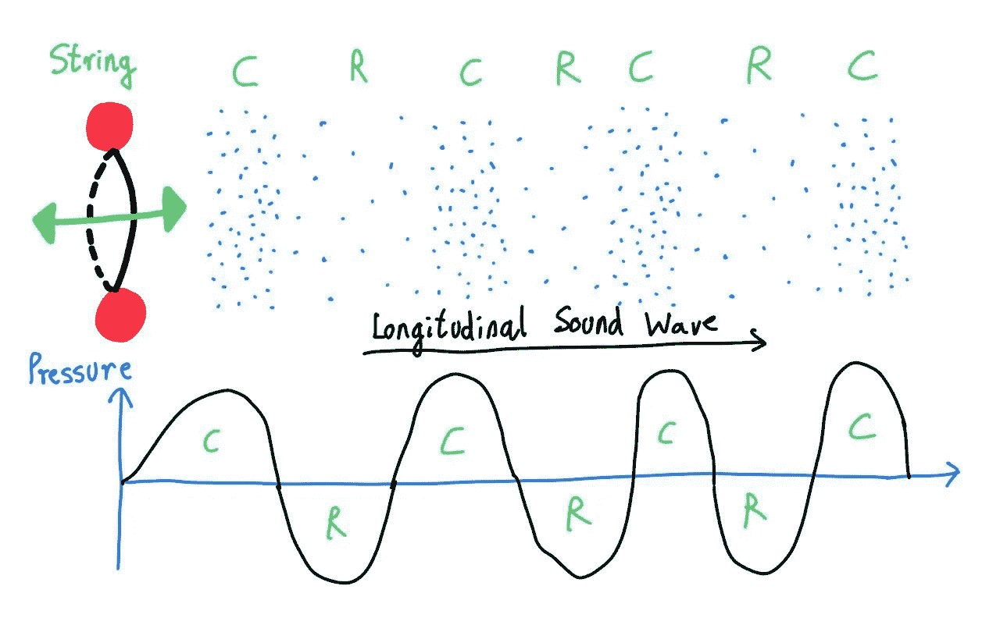
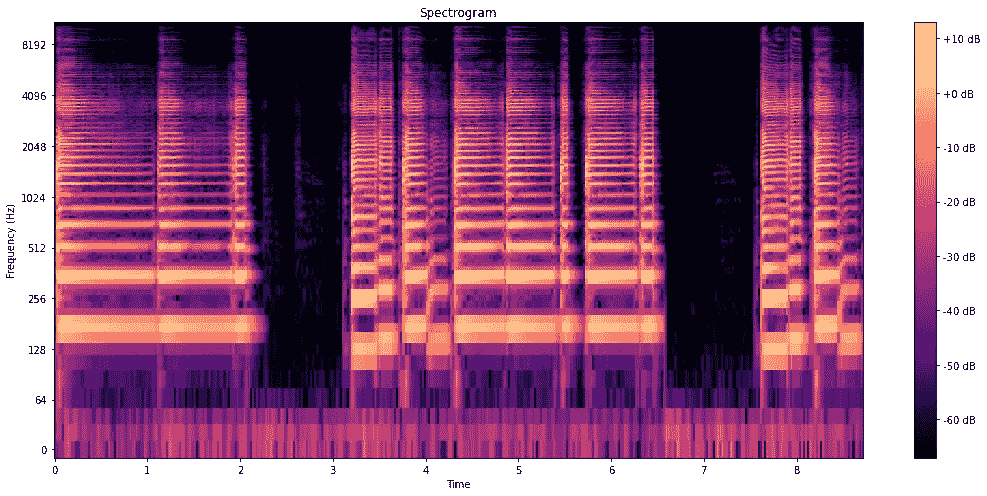
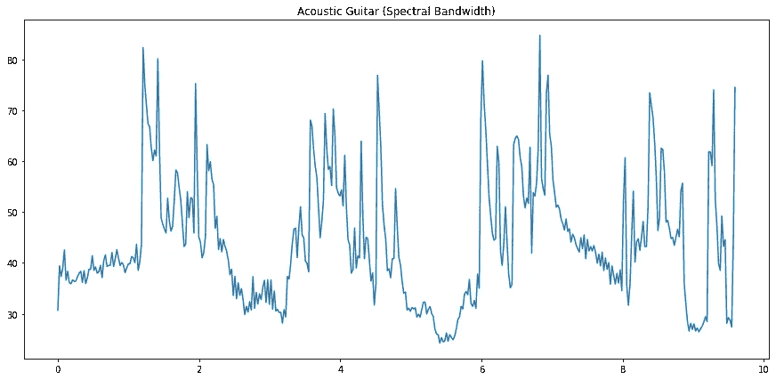

# 解码声音交响曲：用于音乐工程的音频信号处理

> 原文：[`towardsdatascience.com/decoding-the-symphony-of-sound-audio-signal-processing-for-musical-engineering-c66f09a4d0f5?source=collection_archive---------0-----------------------#2023-08-08`](https://towardsdatascience.com/decoding-the-symphony-of-sound-audio-signal-processing-for-musical-engineering-c66f09a4d0f5?source=collection_archive---------0-----------------------#2023-08-08)

## 使用 Python 进行时间和频率域音频特征提取的终极指南

[](https://namanagr03.medium.com/?source=post_page-----c66f09a4d0f5--------------------------------)[](https://towardsdatascience.com/?source=post_page-----c66f09a4d0f5--------------------------------) [Naman Agrawal](https://namanagr03.medium.com/?source=post_page-----c66f09a4d0f5--------------------------------)

·

[关注](https://medium.com/m/signin?actionUrl=https%3A%2F%2Fmedium.com%2F_%2Fsubscribe%2Fuser%2F5bbb90aa727&operation=register&redirect=https%3A%2F%2Ftowardsdatascience.com%2Fdecoding-the-symphony-of-sound-audio-signal-processing-for-musical-engineering-c66f09a4d0f5&user=Naman+Agrawal&userId=5bbb90aa727&source=post_page-5bbb90aa727----c66f09a4d0f5---------------------post_header-----------) 发表在 [Towards Data Science](https://towardsdatascience.com/?source=post_page-----c66f09a4d0f5--------------------------------) ·38 分钟阅读·2023 年 8 月 8 日[](https://medium.com/m/signin?actionUrl=https%3A%2F%2Fmedium.com%2F_%2Fvote%2Ftowards-data-science%2Fc66f09a4d0f5&operation=register&redirect=https%3A%2F%2Ftowardsdatascience.com%2Fdecoding-the-symphony-of-sound-audio-signal-processing-for-musical-engineering-c66f09a4d0f5&user=Naman+Agrawal&userId=5bbb90aa727&source=-----c66f09a4d0f5---------------------clap_footer-----------)

--

[](https://medium.com/m/signin?actionUrl=https%3A%2F%2Fmedium.com%2F_%2Fbookmark%2Fp%2Fc66f09a4d0f5&operation=register&redirect=https%3A%2F%2Ftowardsdatascience.com%2Fdecoding-the-symphony-of-sound-audio-signal-processing-for-musical-engineering-c66f09a4d0f5&source=-----c66f09a4d0f5---------------------bookmark_footer-----------)

图片由 [OpenClipart-Vectors](https://pixabay.com/users/openclipart-vectors-30363/?utm_source=link-attribution&utm_medium=referral&utm_campaign=image&utm_content=153212) 提供，来自 [Pixabay](https://pixabay.com//?utm_source=link-attribution&utm_medium=referral&utm_campaign=image&utm_content=153212)

# 内容

1.  介绍

1.  时间域特征提取

    2.1 音频信号处理基础：帧大小和跳步长度

    2.2 特征 1：幅度包络

    2.3 特征 2：均方根能量

    2.4 特征 3：峰值因子

    2.5 特征 4：零交叉率

1.  频域特征提取

    3.1 特征 5：带能量比

    3.2 特征 6：谱质心

    3.3 特征 7：谱带宽

    3.4 特征 8：谱平坦度

1.  结论

1.  参考文献

# 介绍

处理和分析不同类型数据以获得实际见解的能力是信息时代最重要的技能之一。数据无处不在：从我们阅读的书籍到观看的电影，从我们喜欢的 Instagram 帖子到我们听的音乐。在这篇文章中，我们将尝试理解音频信号处理的基础知识：

1.  计算机如何读取音频信号

1.  时域和频域特征是什么？

1.  如何提取这些特征？

1.  为什么需要提取这些特征？

特别是，我们将详细介绍以下特征：

+   时域特征：幅度包络、均方根能量、峰值因子（以及峰值与平均功率比）、零交叉率。

+   频域特征：带能量比、谱质心、谱带宽（扩展）、谱平坦度。

我们将描述理论并从头编写 Python 代码，以从三种不同的乐器（声学吉他、铜管乐器和鼓组）中提取这些特征。使用的样本音频数据文件可以在这里下载：[`github.com/namanlab/Audio-Signal-Processing-Feature-Extraction`](https://github.com/namanlab/Audio-Signal-Processing-Feature-Extraction)

完整的代码文件也可以在上述仓库中获取，或通过以下链接访问：[`github.com/namanlab/Audio-Signal-Processing-Feature-Extraction/blob/main/Audio_Signal_Extraction.ipynb`](https://github.com/namanlab/Audio-Signal-Processing-Feature-Extraction/blob/main/Audio_Signal_Extraction.ipynb)

# 时域特征提取

让我们开始回顾什么是声音以及我们是如何感知它的。正如你们中的一些人可能记得的高中课程中所讲，声音是通过介质传播的振动。声音的产生使得周围的空气分子发生振动，这表现为交替的压缩（高压）和稀疏（低压）区域。这些压缩和稀疏通过介质传播并到达我们的耳朵，让我们感知声音。声音的传播涉及这些压力变化随时间的传递。声音的时域表示涉及在不同时间间隔捕获和分析这些压力变化，通过在离散时间点（通常使用数字音频录制技术）对声波进行采样。每个样本代表特定时刻的声音压力水平。通过绘制这些样本，我们获得一个波形，展示声音压力水平随时间的变化。横轴表示时间，而纵轴表示声音的振幅或强度，通常在 -1 和 1 之间缩放，其中正值表示压缩，负值表示稀疏。这有助于我们给出声音波形特征的视觉表现，如其振幅、频率和持续时间。



声音传播基础 [作者图像]

为了使用 Python 提取给定音频的波形，我们首先需要加载所需的包：

```py
import numpy as np
import matplotlib.pyplot as plt

import librosa
import librosa.display
import IPython.display as ipd
import scipy as spp
```

NumPy 是一个流行的 Python 包，用于处理和操作数组和矩阵。它包含从线性代数到简化许多任务的广泛工具！

librosa 是 Python 的音频处理和分析包，包含多个函数和工具，使得利用不同的音频特征变得相当简单。如前所述，我们将分析三种不同乐器的波形：原声吉他、铜管乐器和鼓组。你可以从之前分享的链接下载音频文件并上传到你的本地库。为了听取音频文件，我们使用 IPython.display。代码如下：

```py
# Listen to the audio files
# Ensure correct relative / absolute path to the sound files.

acoustic_guitar_path = "acoustic_guitar.wav"
ipd.Audio(acoustic_guitar_path)

brass_path = "brass.wav"
ipd.Audio(brass_path)

# Keep volume low!
drum_set_path = "drum_set.wav"
ipd.Audio(drum_set_path)
```

接下来，我们使用函数 *librosa.load()* 在 *librosa* 中加载音乐文件。这个函数允许我们解析音频文件并返回两个对象：

1.  *y*（NumPy 数组）：包含不同时间间隔的振幅值。试着打印数组看看！

1.  *sr*（数字 > 0）：采样率

采样率指的是在将模拟信号转换为数字表示时每单位时间内采样的数量。如上所述，介质中的压力变化构成了一个模拟信号，这个信号的波形在时间上不断变化。理论上，存储连续数据需要无限的空间。因此，为了数字处理和存储这些模拟信号，它们需要被转换为离散的表示。这就是采样发挥作用的地方，采样在离散（均匀间隔）的时间间隔下捕捉声音波形的快照。这些间隔之间的间距由采样率的倒数来捕获。

> 采样率决定了从模拟信号中采样的频率，因此以每秒采样数或赫兹（Hz）来测量。更高的采样率意味着每秒采样的数量更多，从而更准确地表示原始模拟信号，但需要更多的内存资源。相比之下，更低的采样率意味着每秒采样的数量较少，从而对原始模拟信号的表示不够准确，但需要更少的内存资源。

通常的默认采样率是 22050。然而，根据应用程序/内存，用户可以选择较低或较高的采样率，这可以通过*librosa.load()*的*sr*参数来指定。在选择适当的模拟到数字转换采样率时，了解奈奎斯特-香农采样定理可能很重要，该定理指出，为了准确捕捉和重建模拟信号，采样率必须至少是音频信号中最高频率成分的两倍（称为奈奎斯特率/频率）。


通过以高于奈奎斯特频率的频率进行采样，我们可以避免一种称为混叠的现象，这种现象可能会扭曲原始信号。讨论混叠现象对于本文的目的并不特别相关。如果你想了解更多内容，可以参考这个优秀的来源：[`thewolfsound.com/what-is-aliasing-what-causes-it-how-to-avoid-it/`](https://thewolfsound.com/what-is-aliasing-what-causes-it-how-to-avoid-it/.)

以下是读取音频信号的代码：

```py
# Load music in librosa
sr = 22050
acoustic_guitar, sr = librosa.load(acoustic_guitar_path, sr = sr)
brass, sr = librosa.load(brass_path, sr = sr)
drum_set, sr = librosa.load(drum_set_path, sr = sr)
```

在上述示例中，采样率为 22050（这也是默认值）。执行上述代码会返回 3 个数组，每个数组存储在离散时间间隔（由采样率指定）下的振幅值。接下来，我们使用*librosa.display.waveshow()*可视化 3 个音频样本的波形。为了更清晰地显示振幅在时间上的密度，添加了一些透明度（通过设置 alpha = 0.5）。

```py
def show_waveform(signal, name=""):
    # Create a new figure with a specific size
    plt.figure(figsize=(15, 7))
    # Display the waveform of the signal using librosa
    librosa.display.waveshow(signal, alpha=0.5)
    # Set the title of the plot
    plt.title("Waveform for " + name)
    # Show the plot
    plt.show()

show_waveform(acoustic_guitar, "Acoustic Guitar")
show_waveform(brass, "Brass")
show_waveform(drum_set, "Drum Set")
```


原声吉他的波形 [图片来源：作者]


铜管乐器的波形 [图片来源：作者]


鼓组的波形 [作者提供的图像]

花些时间查看上述图表。思考一下你看到的模式。在原声吉他的波形中，我们可以识别出一个周期性模式，其特点是振幅的规律性波动，这反映了吉他声音的丰富谐波特性。这些波动对应于弹拨弦产生的振动，生成了一个复杂的波形，包含了多个谐波，贡献了吉他的特征音色和音质。

同样，铜管乐器的波形也表现出周期性模式，从而产生一致的音高和音色。铜管乐器通过演奏者的嘴唇在吹嘴中发出振动产生声音。这种振动动作生成了具有明显谐波和规律的振幅变化模式的波形。

相比之下，鼓组的波形并没有显示出明显的周期性模式，因为鼓的声音是通过鼓槌或手击打鼓皮或其他打击表面产生的，形成了复杂且不规则的波形，具有不同的振幅和持续时间。缺乏明显的周期性模式反映了鼓声音的打击性和非音调特性。

## 音频信号处理基础：帧大小和跳跃长度

在讨论重要的时域音频特征之前，必须讨论两个重要的特征提取参数：帧大小和跳跃长度。通常，一旦信号经过数字处理，它会被拆分成帧（可能重叠也可能不重叠的一组离散时间间隔）。帧长度描述了这些帧的大小，而跳跃长度则封装了有关帧重叠的多少的信息。但是，为什么帧处理如此重要呢？

帧的目的是捕捉信号中不同特征的时间变化。通常的特征提取方法给出的是输入信号的单一数字总结（例如，均值、最小值或最大值）。直接使用这些特征提取方法的问题在于，这完全消除了与时间相关的信息。例如，如果你想计算信号的均值振幅，你得到的是一个单一的数字总结，比如 x。然而，自然地，均值有时会较低，有时会较高。获取单一数字总结会消除有关均值时间变化的信息。解决方案是将信号拆分为帧，例如，[0 ms, 10 ms)、[10 ms, 20 ms) 等。然后，计算每个时间帧中信号的均值，这一集合特征给出了最终提取的特征向量，即时间依赖的特征总结，这不是很酷吗！

现在，让我们详细讨论这两个参数：

+   **框架大小（Frame Size）：** 描述了每个框架的大小。例如，如果框架大小是 1024，那么每个框架中包含 1024 个样本，并计算这些 1024 个样本集合所需的特征。一般推荐将框架大小设置为 2 的幂。这背后的原因对于本文的目的并不重要。但如果你感兴趣，这是因为快速傅里叶变换（一个非常高效的将信号从时间域转换到频率域的算法）要求框架大小是 2 的幂。我们将在后续部分更多地讨论傅里叶变换。

+   **跳跃长度（Hop Length）：** 指的是在数据序列中，每一步框架前进的样本数量，即生成新框架前我们向右移动的样本数。可以将框架视为一个在信号上滑动的窗口，滑动的步长由跳跃长度定义。在每一步，窗口会应用到信号或序列的新部分，并在该段上进行特征提取。因此，跳跃长度决定了连续音频框架之间的重叠情况。跳跃长度等于框架大小意味着没有重叠，因为每个框架恰好在前一个框架结束的地方开始。然而，为了减轻将信号从时间域转换到频率域时发生的一个现象称为谱泄漏的影响，应用了一个窗口函数，导致每个框架边缘附近的数据丢失（技术解释超出了本文的目的，但如果你感兴趣，可以查看这个链接：[`dspillustrations.com/pages/posts/misc/spectral-leakage-zero-padding-and-frequency-resolution.html`](https://dspillustrations.com/pages/posts/misc/spectral-leakage-zero-padding-and-frequency-resolution.html)）。因此，通常选择中间跳跃长度以保留边缘样本，从而导致框架之间的重叠程度不同。

> 一般来说，较小的跳跃长度提供了更高的时间分辨率，使我们能够捕捉信号中的更多细节和快速变化。然而，它也增加了内存需求。相反，较大的跳跃长度降低了时间分辨率，但也有助于减少空间复杂度。


框架大小和跳跃长度 [作者提供的图片]

注意：为了更清晰的可视化，以上图像中的框架大小显示得相当大。实际上，选择的框架大小要小得多（可能是几千个样本，约 20-40 毫秒）。

在继续讨论时间域不同特征提取方法之前，让我们澄清一些数学符号。我们将在本文中使用以下符号：

+   **xᵢ:** 第 i 个样本的幅度

+   **K:** 框架大小

+   **H:** 跳跃长度

## 特征 1：幅度包络

首先，我们来讨论包络线。这是时间域分析中最容易计算（但相当有用）的特征之一。音频信号一帧的包络线简单来说就是该帧内幅度的最大值。在数学上，第 k 帧的包络线（对于不重叠的帧）由下式给出：


一般而言，对于包含样本 xⱼ₁ , xⱼ₂ , · · · , xⱼₖ 的任意帧 k，包络线是：


下面是计算给定信号包络线的 Python 代码：

```py
FRAME_SIZE = 1024
HOP_LENGTH = 512

def amplitude_envelope(signal, frame_size=1024, hop_length=512):
    """
    Computes the Amplitude Envelope of a signal using a sliding window.

    Args:
        signal (array): The input signal.
        frame_size (int): The size of each frame in samples.
        hop_length (int): The number of samples between consecutive frames.

    Returns:
        np.array: An array of Amplitude Envelope values.
    """
    res = []
    for i in range(0, len(signal), hop_length):
        # Get a portion of the signal
        cur_portion = signal[i:i + frame_size]  
        # Compute the maximum value in the portion
        ae_val = max(cur_portion)  
        # Store the amplitude envelope value
        res.append(ae_val)  
    # Convert the result to a NumPy array
    return np.array(res)

def plot_amplitude_envelope(signal, name, frame_size=1024, hop_length=512):
    """
    Plots the waveform of a signal with the overlay of Amplitude Envelope values.

    Args:
        signal (array): The input signal.
        name (str): The name of the signal for the plot title.
        frame_size (int): The size of each frame in samples.
        hop_length (int): The number of samples between consecutive frames.
    """
    # Compute the amplitude envelope
    ae = amplitude_envelope(signal, frame_size, hop_length)
    # Generate the frame indices
    frames = range(0, len(ae))  
    # Convert frames to time
    time = librosa.frames_to_time(frames, hop_length=hop_length)  
    # Create a new figure with a specific size
    plt.figure(figsize=(15, 7))  
    # Display the waveform of the signal
    librosa.display.waveshow(signal, alpha=0.5)  
    # Plot the amplitude envelope over time
    plt.plot(time, ae, color="r") 
    # Set the title of the plot
    plt.title("Waveform for " + name + " (Amplitude Envelope)")  
    # Show the plot
    plt.show()  

plot_amplitude_envelope(acoustic_guitar, "Acoustic Guitar")
plot_amplitude_envelope(brass, "Brass")
plot_amplitude_envelope(drum_set, "Drum Set")
```

在上述代码中，我们定义了一个名为 *amplitude_envelope* 的函数，该函数接受输入信号数组（由 *librosa.load()* 生成）、帧大小 (K) 和跳步长度 (H)，并返回一个大小等于帧数的数组。数组中的第 k 个值对应于第 k 帧的包络线值。计算通过一个简单的 for 循环完成，该循环以跳步长度为步长遍历整个信号。定义了一个列表 (*res*) 来存储这些值，并在返回之前将其转换为 NumPy 数组。另一个名为 *plot_amplitude* 的函数被定义，它接受相同的一组输入（以及一个名称参数），并在原始帧上叠加包络线图。为了绘制波形，使用了传统的 *librosa.display.waveform()*，如前一节所述。

要绘制包络线，我们需要时间值和对应的包络线值。时间值通过非常有用的函数 *librosa.frames_to_times()* 获取，该函数接受两个输入：一个对应帧数的可迭代对象（由 *range* 函数定义），以及跳步长度）以生成每帧的平均时间。随后，使用 *matplotlib.pyplot* 来叠加红色图。上述描述的过程将一致用于所有时间域特征提取方法。

以下图显示了每种乐器计算出的包络线。它们以红线的形式叠加在原始波形上，并倾向于近似波形的上边界。包络线不仅保留了周期性模式，还显示了音频幅度的一般差异，如铜管乐器与原声吉他和鼓组相比的低强度所反映的那样。


原声吉他的包络线 [作者提供的图像]


铜管乐器的包络线 [作者提供的图像]


鼓组的包络线 [作者提供的图像]

## 特征 2：均方根能量

接下来，让我们谈谈均方根能量（RMSE），这是时域分析中的另一个重要特征。音频信号帧的均方根能量是通过对帧内所有振幅值的平方均值开方得到的。数学上，k 帧的均方根能量（对于非重叠帧）表示为：


一般来说，对于包含样本 xⱼ₁ , xⱼ₂ , · · · , xⱼₖ 的任意帧 k，均方根误差为：


均方根能量通过考虑波形的正负偏移，提供了声音信号的整体强度或力度的表征，比起峰值振幅等其他度量提供了更准确的信号功率测量。计算给定信号均方根误差的 Python 代码如下。代码结构与生成振幅包络的代码相同。唯一的变化在于提取特征所用的函数。通过对信号当前部分的平方值取平均后再开方来计算均方根误差值，而不是取最大值。

```py
def RMS_energy(signal, frame_size=1024, hop_length=512):
    """
    Computes the RMS (Root Mean Square) energy of a signal using a sliding window.

    Args:
        signal (array): The input signal.
        frame_size (int): The size of each frame in samples.
        hop_length (int): The number of samples between consecutive frames.

    Returns:
        np.array: An array of RMS energy values.
    """
    res = []
    for i in range(0, len(signal), hop_length):
        # Extract a portion of the signal
        cur_portion = signal[i:i + frame_size]  
        # Compute the RMS energy for the portion
        rmse_val = np.sqrt(1 / len(cur_portion) * sum(i**2 for i in cur_portion))  
        res.append(rmse_val)
    # Convert the result to a NumPy array
    return np.array(res)

def plot_RMS_energy(signal, name, frame_size=1024, hop_length=512):
    """
    Plots the waveform of a signal with the overlay of RMS energy values.

    Args:
        signal (array): The input signal.
        name (str): The name of the signal for the plot title.
        frame_size (int): The size of each frame in samples.
        hop_length (int): The number of samples between consecutive frames.
    """
    # Compute the RMS Energy
    rmse = RMS_energy(signal, frame_size, hop_length)
    # Generate the frame indices
    frames = range(0, len(rmse))  
    # Convert frames to time
    time = librosa.frames_to_time(frames, hop_length=hop_length) 
    # Create a new figure with a specific size
    plt.figure(figsize=(15, 7))
    # Display the waveform as a spectrogram-like plot
    librosa.display.waveshow(signal, alpha=0.5)  
    # Plot the RMS energy values
    plt.plot(time, rmse, color="r") 
    # Set the title of the plot
    plt.title("Waveform for " + name + " (RMS Energy)")
    plt.show()

plot_RMS_energy(acoustic_guitar, "Acoustic Guitar")
plot_RMS_energy(brass, "Brass")
plot_RMS_energy(drum_set, "Drum Set")
```

以下图展示了每个乐器计算的均方根能量。它们被添加为原始波形上的红线，趋近于波形的质心。正如之前一样，这一度量不仅保留了周期模式，还近似了声波的整体强度水平。


声学吉他的均方根误差 [作者提供的图片]


铜管乐器的均方根误差 [作者提供的图片]


鼓组的均方根误差 [作者提供的图片]

## 特征 3：峰值因子

现在，让我们谈谈峰值因子，它是波形峰值极端程度的度量。音频信号帧的峰值因子是通过将峰值振幅（振幅的最大绝对值）除以均方根能量来获得的。数学上，k 帧的峰值因子（对于非重叠帧）表示为：


一般来说，对于包含样本 xⱼ₁ , xⱼ₂ , · · · , xⱼₖ 的任意帧 k，峰值因子为：


峰值因子表示波形的最高峰值水平与平均强度水平的比率。计算给定信号峰值因子的 Python 代码如下。结构与上述相同，涉及计算均方根误差值（分母）和最高峰值（分子），然后用来获得所需的分数（峰值因子！）。

```py
def crest_factor(signal, frame_size=1024, hop_length=512):
    """
    Computes the crest factor of a signal using a sliding window.

    Args:
        signal (array): The input signal.
        frame_size (int): The size of each frame in samples.
        hop_length (int): The number of samples between consecutive frames.

    Returns:
        np.array: An array of crest factor values.
    """
    res = []
    for i in range(0, len(signal), hop_length):
        # Get a portion of the signal
        cur_portion = signal[i:i + frame_size]  
        # Compute the RMS energy for the portion
        rmse_val = np.sqrt(1 / len(cur_portion) * sum(i ** 2 for i in cur_portion))  
        # Compute the crest factor
        crest_val = max(np.abs(cur_portion)) / rmse_val  
        # Store the crest factor value
        res.append(crest_val)  
    # Convert the result to a NumPy array
    return np.array(res)  

def plot_crest_factor(signal, name, frame_size=1024, hop_length=512):
    """
    Plots the crest factor of a signal over time.

    Args:
        signal (array): The input signal.
        name (str): The name of the signal for the plot title.
        frame_size (int): The size of each frame in samples.
        hop_length (int): The number of samples between consecutive frames.
    """
    # Compute the crest factor
    crest = crest_factor(signal, frame_size, hop_length)  
    # Generate the frame indices
    frames = range(0, len(crest))  
    # Convert frames to time
    time = librosa.frames_to_time(frames, hop_length=hop_length)  
    # Create a new figure with a specific size
    plt.figure(figsize=(15, 7))  
    # Plot the crest factor over time
    plt.plot(time, crest, color="r")  
    # Set the title of the plot
    plt.title(name + " (Crest Factor)")  
    # Show the plot
    plt.show()  

plot_crest_factor(acoustic_guitar, "Acoustic Guitar")
plot_crest_factor(brass, "Brass")
plot_crest_factor(drum_set, "Drum Set")
```

以下图展示了每个乐器的计算峰值因子：


声学吉他的峰值因子 [作者提供的图片]


铜管乐器的峰值因子 [图片作者]


铜管乐器组的峰值因子 [图片作者]

更高的峰值因子，如在声学吉他和铜管乐器中所见，表示峰值水平和平均水平之间的差异较大，表明信号更具动态性或峰值特征，振幅变化较大。较低的峰值因子，如在鼓组中所见，表明信号更均匀或压缩，振幅变化较小。峰值因子在需要考虑系统头间隙或可用动态范围的情况下尤为重要。例如，在音乐录音中，高峰值因子可能需要仔细考虑，以防在有限头间隙的设备上播放时发生失真或削波。

> 实际上，还有一个特性叫做峰值与平均功率比（PAPR），它与峰值因子密切相关。PAPR 只是峰值因子的平方值，通常转换为分贝功率比。一般来说，对于任何包含样本 xⱼ₁ 、xⱼ₂ 、· · · 、xⱼₖ 的帧 k，峰值与平均功率比为：


作为一个有趣的挑战，尝试修改上述代码以生成每种音乐乐器的 PAPR 图，并分析你的发现。

## 特性 4：零交叉率

最后，我们将讨论零交叉率（ZCR）。音频信号的一帧的零交叉率就是信号穿过零点（x/时间轴）的次数。数学上，第 k 帧的 ZCR（对于非重叠帧）定义为：


如果连续的值具有相同的符号，则绝对值内部的表达式将抵消，结果为 0。如果它们具有相反的符号（表示信号已穿过时间轴），这些值相加将得到 2（取绝对值后）。由于每个零交叉给出的值为 2，我们将结果乘以半的系数以获得所需的计数。一般来说，对于任何包含样本 xⱼ₁ 、xⱼ₂ 、· · · 、xⱼₖ 的帧 k，ZCR 为：


请注意，在上述表达式中，零交叉率是通过简单地将信号交叉轴的次数相加来计算的。然而，根据应用需求，也可以对这些值进行归一化（通过除以帧的长度）。计算给定信号的峰值因子的 Python 代码如下。其结构与上述相似，并定义了一个名为 num sign changes 的函数，用于确定信号中符号变化的次数。

```py
def ZCR(signal, frame_size=1024, hop_length=512):
    """
    Computes the Zero Crossing Rate (ZCR) of a signal using a sliding window.

    Args:
        signal (array): The input signal.
        frame_size (int): The size of each frame in samples.
        hop_length (int): The number of samples between consecutive frames.

    Returns:
        np.array: An array of ZCR values.
    """
    res = []
    for i in range(0, len(signal), hop_length):
        # Get a portion of the signal
        cur_portion = signal[i:i + frame_size]  
         # Compute the number of sign changes in the portion
        zcr_val = num_sign_changes(cur_portion) 
        # Store the ZCR value
        res.append(zcr_val)  
    # Convert the result to a NumPy array
    return np.array(res)  

def num_sign_changes(signal):
    """
    Computes the number of sign changes in a signal.

    Args:
        signal (array): The input signal.

    Returns:
        int: The number of sign changes.
    """
    res = 0
    for i in range(0, len(signal) - 1):
        # Check if there is a sign change between consecutive samples
        if (signal[i] * signal[i + 1] < 0):  
            res += 1
    return res

def plot_ZCR(signal, name, frame_size=1024, hop_length=512):
    """
    Plots the Zero Crossing Rate (ZCR) of a signal over time.

    Args:
        signal (array): The input signal.
        name (str): The name of the signal for the plot title.
        frame_size (int): The size of each frame in samples.
        hop_length (int): The number of samples between consecutive frames.
    """
    # Compute the ZCR
    zcr = ZCR(signal, frame_size, hop_length)  
    # Generate the frame indices
    frames = range(0, len(zcr)) 
    # Convert frames to time
    time = librosa.frames_to_time(frames, hop_length=hop_length)  
     # Create a new figure with a specific size
    plt.figure(figsize=(15, 7)) 
    # Plot the ZCR over time
    plt.plot(time, zcr, color="r")  
    # Set the title of the plot
    plt.title(name + " (Zero Crossing Rate)")  
    # Show the plot
    plt.show()  

plot_ZCR(acoustic_guitar, "Acoustic Guitar")
plot_ZCR(brass, "Brass")
plot_ZCR(drum_set, "Drum Set")
```

下图显示了各音乐乐器计算出的零交叉率。


声学吉他的零交叉率 [图片作者]


铜管乐器的零交叉率 [图片来源：作者]


鼓组的零交叉率 [图片来源：作者]

> 较高的零交叉率表明信号经常改变方向，暗示存在更高频率成分或更动态的波形。相反，较低的零交叉率则表示波形相对平滑或恒定。

零交叉率在语音和音乐分析中特别有用，因为它能够提供有关音色和节奏模式等属性的见解。例如，在语音分析中，零交叉率有助于区分有声和无声声音，因为有声声音由于声带的振动，往往具有更高的零交叉率。需要注意的是，虽然零交叉率是一个简单且计算高效的特征，但它可能无法捕捉信号复杂性的所有方面（如上图所示，周期性完全丢失）。因此，它通常与其他特征一起使用，以便对音频信号进行更全面的分析。

# 频率域特征提取

频率域提供了音频波形的另一种表示方式。与时间域不同，在频率域中，信号被分解为其组成的频率，揭示了与每个频率相关的幅度和相位信息，即信号作为频率的函数表示。我们不是查看信号在不同时间点的幅度，而是检查构成信号的不同频率分量的幅度。每个频率分量代表一个特定频率的正弦波，通过组合这些分量，我们可以在时间域中重建原始信号。

将信号从时间域转换到频率域的（最常见的）数学工具是傅里叶变换。傅里叶变换以信号为输入，将其分解为不同频率的正弦波和余弦波的总和，这些波具有各自的幅度和相位。得到的表示就是频率谱。数学上，连续信号在其时间域 g(t)的傅里叶变换定义如下：


其中 i = √−1 是虚数。是的，傅里叶变换会产生复杂的输出，其中相位和幅度对应于组成的正弦波！然而，对于大多数应用，我们只关心变换的幅度，而简单地忽略相关的相位。由于数字处理的声音是离散的，我们可以定义类似的离散傅里叶变换（DFT）：


其中 T 是一个样本的持续时间。在采样率方面：


由于频率表示也是连续的，我们在离散化的频率区间上评估傅里叶变换，以获得音频波的离散频率域表示。这称为短时傅里叶变换。数学上，


不要紧张！让我们仔细复习一下。函数 hat-h(k) 是将整数 k ∈ {0, 1, · · · , N − 1} 映射到频率 k · Sᵣ/N 的幅度。注意，我们只考虑 Sᵣ/N 的整数倍的离散频率区间，其中 N 是信号中的样本数。如果你对这个如何运作仍然不确定，这里有一个关于傅里叶变换的优秀解释：[`www.youtube.com/watch?v=spUNpyF58BY&t=393s`](https://www.youtube.com/watch?v=spUNpyF58BY&t=393s)

傅里叶变换是最美丽的数学创新之一，因此值得了解，尽管讨论内容与本文的目的并不特别相关。在 Python 中，你可以轻松地使用 *librosa.stft()* 获得短时傅里叶变换。

> 注：对于大型音频数据，有一种更高效的傅里叶变换计算方法，称为快速傅里叶变换（FFT），如果你感兴趣的话可以查阅一下！

如前所述，我们不仅仅对哪些频率更为主导感兴趣：我们还希望展示这些频率何时主导。因此，我们寻求一种同时的频率-时间表示，显示哪些频率在何时占主导地位。这就是帧的作用：我们将信号分成时间帧，并在每个帧中获得傅里叶变换的幅度。这给我们一个值矩阵，其中行数由频率区间的数量（Φ，通常等于 K/2 + 1，其中 K 是帧大小）给出，列数由帧数给出。由于傅里叶变换给出的是复值输出，生成的矩阵是复值的。在 Python 中，帧大小和跳跃长度参数可以轻松指定为参数，并且结果矩阵可以使用*librosa.stft(signal, n fft=frame size, hop length=hop length)*简单计算。由于我们只关心幅度，我们可以使用 *numpy.abs()* 将复值矩阵转换为实值矩阵。绘制获得的矩阵是相当方便的，它提供了信号的视觉吸引力表现，并提供了对给定声音的频率内容和时间特征的宝贵见解。所谓的表示称为谱图。

> 谱图通过在 x 轴上绘制时间帧，在 y 轴上绘制频率箱来获得。然后使用颜色表示给定时间帧的频率强度或幅度。通常，频率轴被转换为对数尺度（因为人类在对数转换下的感知较好），幅度以分贝表示。

生成谱图的 Python 代码如下：

```py
FRAME_SIZE = 1024
HOP_LENGTH = 512

def plot_spectrogram(signal, sample_rate, frame_size=1024, hop_length=512):
    """
    Plots the spectrogram of an audio signal.

    Args:
        signal (array-like): The input audio signal.
        sample_rate (int): The sample rate of the audio signal.
        frame_size (int): The size of each frame in samples.
        hop_length (int): The number of samples between consecutive frames.
    """
    # Compute the STFT
    spectrogram = librosa.stft(signal, n_fft=frame_size, hop_length=hop_length)  
    # Convert the STFT to dB scale
    spectrogram_db = librosa.amplitude_to_db(np.abs(spectrogram))  
    # Create a new figure with a specific size
    plt.figure(figsize=(15, 7))  
    # Display the spectrogram
    librosa.display.specshow(spectrogram_db, sr=sample_rate, hop_length=hop_length, x_axis='time', y_axis='log') 
    # Add a colorbar to show the magnitude scale
    plt.colorbar(format='%+2.0f dB') 
    # Set the title of the plot
    plt.title('Spectrogram')  
    # Set the label for the x-axis
    plt.xlabel('Time') 
    # Set the label for the y-axis
    plt.ylabel('Frequency (Hz)')  
    # Adjust the layout of the plot
    plt.tight_layout()  
    # Show the plot
    plt.show()  

plot_spectrogram(acoustic_guitar, sr)
plot_spectrogram(brass, sr)
plot_spectrogram(drum_set, sr)
```

在上述代码中，我们定义了一个名为 plot spectrogram 的函数，该函数接受 4 个参数：输入信号数组、采样率、帧大小和跳跃长度。首先，*librosa.stft()* 用于获取谱图矩阵。随后，*np.abs()* 用于提取幅度，然后通过 *librosa.amplitude_to_db()* 函数将幅度值转换为分贝。最后，*librosa.display.specshow()* 函数用于绘制谱图。该函数接受转换后的谱图矩阵、采样率、跳跃长度以及 x 轴和 y 轴的规格。可以使用 y-axis = ‘log’ 参数指定对数转换的 y 轴。还可以使用 *plt.colorbar()* 添加一个可选的颜色条。以下是 3 种乐器的谱图：


原声吉他的谱图 [作者提供的图片]



铜管乐器的谱图 [作者提供的图片]


鼓组的谱图 [作者提供的图片]

> 谱图提供了一种独特的时间-频率折衷可视化方式。时间域为我们提供了信号随时间演变的精确表示，而频率域则让我们看到不同频率下的能量分布。这使我们不仅能够识别特定频率的存在，还能掌握它们的持续时间和时间变化。谱图是表示声音的最有用的方式之一，并且常用于音频信号的机器学习应用（例如，将声音波形的谱图输入深度卷积神经网络进行预测）。

在继续进行不同频率域特征提取方法之前，让我们澄清一些数学符号。我们将在后续部分使用以下符号：

+   mₖ(i)：第 k 帧的第 i 个频率的幅度。

+   K：帧大小

+   H：跳跃长度

+   Φ：频率箱的数量（= K/2 + 1）

## 特征 5：带能量比

首先，让我们谈谈带能量比。带能量比是用于量化给定时间帧中低频能量与高频能量之比的指标。从数学上讲，对于任何帧 k，带能量比为：


其中 σբ 表示分割频率 bin：一个区分低频和高频的参数。在计算频带能量比时，所有值低于 σբ（即分割频率）的频率被视为低频。低频的能量平方和决定了分子。类似地，所有值高于分割频率的频率被视为高频，高频的能量平方和决定了分母。计算信号频带能量比的 Python 代码如下所示：

```py
def find_split_freq_bin(spec, split_freq, sample_rate, frame_size=1024, hop_length=512):
    """
    Calculate the bin index corresponding to a given split frequency.

    Args:
        spec (array): The spectrogram.
        split_freq (float): The split frequency in Hz.
        sample_rate (int): The sample rate of the audio.
        frame_size (int, optional): The size of each frame in samples. Default is 1024.
        hop_length (int, optional): The number of samples between consecutive frames. Default is 512.

    Returns:
        int: The bin index corresponding to the split frequency.
    """
    # Calculate the range of frequencies
    range_of_freq = sample_rate / 2
    # Calculate the change in frequency per bin
    change_per_bin = range_of_freq / spec.shape[0]
    # Calculate the bin corresponding to the split frequency
    split_freq_bin = split_freq / change_per_bin
    return int(np.floor(split_freq_bin))

def band_energy_ratio(signal, split_freq, sample_rate, frame_size=1024, hop_length=512):
    """
    Compute the band energy ratio (BER) of a signal.

    Args:
        signal (array): The input signal.
        split_freq (float): The split frequency in Hz.
        sample_rate (int): The sample rate of the audio.
        frame_size (int, optional): The size of each frame in samples. Default is 1024.
        hop_length (int, optional): The number of samples between consecutive frames. Default is 512.

    Returns:
        ndarray: The band energy ratios for each frame of the signal.
    """
    # Compute the spectrogram of the signal
    spec = librosa.stft(signal, n_fft=frame_size, hop_length=hop_length)
    # Find the bin corresponding to the split frequency
    split_freq_bin = find_split_freq_bin(spec, split_freq, sample_rate, frame_size, hop_length)
    # Extract the magnitude and transpose it
    modified_spec = np.abs(spec).T
    res = []
    for sub_arr in modified_spec:
        # Compute the energy in the low-frequency range
        low_freq_density = sum(i ** 2 for i in sub_arr[:split_freq_bin])
        # Compute the energy in the high-frequency range
        high_freq_density = sum(i ** 2 for i in sub_arr[split_freq_bin:])
        # Compute the band energy ratio
        ber_val = low_freq_density / high_freq_density
        res.append(ber_val)
    return np.array(res)

def plot_band_energy_ratio(signal, split_freq, sample_rate, name, frame_size=1024, hop_length=512):
    """
    Plot the band energy ratio (BER) of a signal over time.

    Args:
        signal (ndarray): The input signal.
        split_freq (float): The split frequency in Hz.
        sample_rate (int): The sample rate of the audio.
        name (str): The name of the signal for the plot title.
        frame_size (int, optional): The size of each frame in samples. Default is 1024.
        hop_length (int, optional): The number of samples between consecutive frames. Default is 512.
    """
    # Compute the band energy ratio (BER)
    ber = band_energy_ratio(signal, split_freq, sample_rate, frame_size, hop_length)
    # Generate the frame indices
    frames = range(0, len(ber))
    # Convert frames to time
    time = librosa.frames_to_time(frames, hop_length=hop_length)
    # Create a new figure with a specific size
    plt.figure(figsize=(15, 7))
    # Plot the BER over time
    plt.plot(time, ber)
    # Set the title of the plot
    plt.title(name + " (Band Energy Ratio)")
    # Show the plot
    plt.show()

plot_band_energy_ratio(acoustic_guitar, 2048, sr, "Acoustic Guitar")
plot_band_energy_ratio(brass, 2048, sr, "Brass")
plot_band_energy_ratio(drum_set, 2048, sr, "Drum Set")
```

上述代码的结构与时域提取的结构非常相似。第一步是定义一个名为 *split_freq_bin()* 的函数，该函数接受谱图、分割频率的值和采样率，确定与分割频率对应的分割频率 bin (σբ)。这个过程相当简单。它涉及到查找频率范围（如前所述，即 Nyquist 频率，Sᵣ/2）。频率 bin 的数量由谱图的行数给出，提取为 *spec.shape[0]*。通过将频率的总范围除以频率 bin 的数量，我们可以计算每个 bin 的频率变化，然后用给定的分割频率除以这个变化值，以确定分割频率 bin。

接下来，我们使用这个函数来计算频带能量比向量。函数 *band_energy_ratio()* 接收输入信号、分割频率、采样率、帧大小和跳跃长度作为参数。首先，它使用 *librosa.stft()* 提取谱图，然后计算分割频率 bin。接着，使用 *np.abs()* 计算谱图的幅度，并进行转置以便于遍历每一帧。在遍历过程中，使用定义的公式和找到的分割频率 bin 计算每帧的频带能量比。计算值存储在列表 *res* 中，最后作为 NumPy 数组返回。最后，使用 *plot_band_energy_ratio()* 函数绘制这些值。

下面显示了这三种乐器的频带能量比图。对于这些图，分割频率选择为 2048 Hz，即低于 2048 Hz 的频率被认为是低能量频率，而高于 2048 Hz 的频率则被视为高能量频率。


适用于吉他的频带能量比 [作者提供的图片]


适用于铜管乐器的频带能量比 [作者提供的图片]


适用于鼓组的频带能量比 [作者提供的图片]

高频带能量比（对于铜管乐器）表明低频成分相对于高频成分的存在量较大。因此，我们观察到铜管乐器在低频带产生的能量远大于高频带。声学吉他的 BER 相较于铜管乐器较低，表明在低频带的能量贡献相对较少。总体而言，声学吉他在频率谱上的能量分布较为均衡，相较于其他乐器，对低频的强调较少。最后，鼓组在三者中具有最低的 BER，表明与其他乐器相比，在低频带的能量贡献相对较低。

## 特征 6：谱质心

接下来，我们将讨论谱质心，这是一个量化信号在给定时间范围内的质心或平均频率的信息的度量。数学上，对于任何帧 k，谱质心为：


可以将其视为频率箱索引的加权和，其中权重由给定时间范围内箱的能量贡献决定。归一化通过将加权和除以所有权重的总和来完成，以便在不同信号之间进行均匀比较。计算信号谱质心的 Python 代码如下所示：

```py
def spectral_centroid(signal, sample_rate, frame_size=1024, hop_length=512):
    """
    Compute the Spectral Centroid of a signal.

    Args:
        signal (array): The input signal.
        sample_rate (int): The sample rate of the audio.
        frame_size (int, optional): The size of each frame in samples. Default is 1024.
        hop_length (int, optional): The number of samples between consecutive frames. Default is 512.

    Returns:
        ndarray: The spectral centroids for each frame of the signal.
    """
    # Compute the spectrogram of the signal
    spec = librosa.stft(signal, n_fft=frame_size, hop_length=hop_length)
    # Extract the magnitude and transpose it
    modified_spec = np.abs(spec).T
    res = []
    for sub_arr in modified_spec:
        # Compute the spectral centroid
        sc_val = sc(sub_arr)
        # Store the value of spectral centroid for current frame
        res.append(sc_val)
    return np.array(res)

def sc(arr):
    """
    Computes the spectral centroid in a signal.

    Args:
        arr (array): Frequency domain array for current frame.

    Returns:
        float: The spectral centroid value for current frame.
    """
    res = 0
    for i in range(0, len(arr)):
        # Compute weighted sum
        res += i*arr[i]
    return res/sum(arr)

def bin_to_freq(spec, bin_val, sample_rate, frame_size=1024, hop_length=512):
    """
    Calculate the frequency corresponding to a given bin value

    Args:
        spec (array): The spectrogram.
        bin_val (): The bin value.
        sample_rate (int): The sample rate of the audio.
        frame_size (int, optional): The size of each frame in samples. Default is 1024.
        hop_length (int, optional): The number of samples between consecutive frames. Default is 512.

    Returns:
        int: The bin index corresponding to the split frequency.
    """
    # Calculate the range of frequencies
    range_of_freq = sample_rate / 2
    # Calculate the change in frequency per bin
    change_per_bin = range_of_freq / spec.shape[0]
    # Calculate the frequency corresponding to the bin
    split_freq = bin_val*change_per_bin
    return split_freq

def plot_spectral_centroid(signal, sample_rate, name, frame_size=1024, hop_length=512, col = "black"):
    """
    Plot the spectral centroid of a signal over time.

    Args:
        signal (ndarray): The input signal.
        sample_rate (int): The sample rate of the audio.
        name (str): The name of the signal for the plot title.
        frame_size (int, optional): The size of each frame in samples. Default is 1024.
        hop_length (int, optional): The number of samples between consecutive frames. Default is 512.
    """
    # Compute the STFT
    spectrogram = librosa.stft(signal, n_fft=frame_size, hop_length=hop_length)  
    # Convert the STFT to dB scale
    spectrogram_db = librosa.amplitude_to_db(np.abs(spectrogram)) 
    # Compute the Spectral Centroid
    sc_arr = spectral_centroid(signal, sample_rate, frame_size, hop_length)
    # Compute corresponding frequencies:
    sc_freq_arr = bin_to_freq(spectrogram_db, sc_arr, sample_rate, frame_size, hop_length)
    # Generate the frame indices
    frames = range(0, len(sc_arr))
    # Convert frames to time
    time = librosa.frames_to_time(frames, hop_length=hop_length)
    # Create a new figure with a specific size
    plt.figure(figsize=(15, 7))
    # Display the Spectrogram
    librosa.display.specshow(spectrogram_db, sr=sample_rate, hop_length=hop_length, x_axis='time', y_axis='log') 
    # Add a colorbar to show the magnitude scale
    plt.colorbar(format='%+2.0f dB')  
    # Plot the Spectral Centroid over time
    plt.plot(time, sc_freq_arr, color=col)
    # Set the title of the plot
    plt.title(name + " (Spectral Centroid)")
    # Show the plot
    plt.show()

plot_spectral_centroid(acoustic_guitar, sr, "Acoustic Guitar")
plot_spectral_centroid(brass, sr, "Brass", col = "white")
plot_spectral_centroid(drum_set, sr, "Drum Set")
```

在上述代码中，定义了谱质心函数，以生成所有时间帧的谱质心数组。随后，定义了*sc()*函数，通过简单的迭代过程计算一个帧的谱质心，该过程将索引值与幅度相乘，然后进行归一化以获得平均频率箱。在绘制由*spectral_centroid()*返回的谱质心值之前，定义了一个名为 bin to freq 的附加函数，作为绘图的辅助函数。该函数将平均箱值转换为相应的频率值，可以在原始谱图上绘制，以便对谱质心在时间上的变化有一致的了解。输出图（带有谱质心变化的叠加）如下所示：


对于声学吉他的谱质心 [图片由作者提供]


铜管乐器的谱质心 [图片由作者提供]


对于鼓组的谱质心 [图片由作者提供]

> 频谱质心与时间域分析中的 RMSE 度量非常类似，通常用作声音音色和亮度的描述符。具有较高频谱质心的声音往往具有更明亮或偏向高音的特质，而较低质心值则与较暗或偏向低音的特质相关联。频谱质心是音频机器学习中最重要的特征之一，常用于音频/音乐类型分类的应用中。

## 特征 7: 频谱带宽

现在，我们将讨论频谱带宽/扩展，它是量化信号频谱在给定时间框架内能量分布的信息的度量。可以这样理解：如果频谱质心是均值/平均值，那么频谱带宽就是它围绕质心的扩展/方差的度量。数学上，对于任何帧 k，频谱带宽为：


其中 SCₖ 表示第 k 帧的频谱质心。如前所述，通过将加权和除以所有权重的总和来进行归一化，以便在不同信号之间进行统一比较。用于计算信号频谱带宽的 Python 代码如下所示：

```py
def spectral_bandwidth(signal, sample_rate, frame_size=1024, hop_length=512):
    """
    Compute the Spectral Bandwidth of a signal.

    Args:
        signal (array): The input signal.
        sample_rate (int): The sample rate of the audio.
        frame_size (int, optional): The size of each frame in samples. Default is 1024.
        hop_length (int, optional): The number of samples between consecutive frames. Default is 512.

    Returns:
        ndarray: The spectral bandwidths for each frame of the signal.
    """
    # Compute the spectrogram of the signal
    spec = librosa.stft(signal, n_fft=frame_size, hop_length=hop_length)
    # Extract the magnitude and transpose it
    modified_spec = np.abs(spec).T
    res = []
    for sub_arr in modified_spec:
        # Compute the spectral bandwidth
        sb_val = sb(sub_arr)
        # Store the value of spectral bandwidth for current frame
        res.append(sb_val)
    return np.array(res)

def sb(arr):
    """
    Computes the spectral bandwidth in a signal.

    Args:
        arr (array): Frequency domain array for current frame.

    Returns:
        float: The spectral bandwidth value for current frame.
    """
    res = 0
    sc_val = sc(arr)
    for i in range(0, len(arr)):
        # Compute weighted sum
        res += (abs(i - sc_val))*arr[i]
    return res/sum(arr)

def plot_spectral_bandwidth(signal, sample_rate, name, frame_size=1024, hop_length=512):
    """
    Plot the spectral bandwidth of a signal over time.

    Args:
        signal (ndarray): The input signal.
        sample_rate (int): The sample rate of the audio.
        name (str): The name of the signal for the plot title.
        frame_size (int, optional): The size of each frame in samples. Default is 1024.
        hop_length (int, optional): The number of samples between consecutive frames. Default is 512.
    """
    # Compute the Spectral bandwidth
    sb_arr = spectral_bandwidth(signal, sample_rate, frame_size, hop_length)
    # Generate the frame indices
    frames = range(0, len(sb_arr))
    # Convert frames to time
    time = librosa.frames_to_time(frames, hop_length=hop_length)
    # Create a new figure with a specific size
    plt.figure(figsize=(15, 7))
    # Plot the Spectral Bandwidth over time
    plt.plot(time, sb_arr)
    # Set the title of the plot
    plt.title(name + " (Spectral Bandwidth)")
    # Show the plot
    plt.show()

plot_spectral_bandwidth(acoustic_guitar, sr, "Acoustic Guitar")
plot_spectral_bandwidth(brass, sr, "Brass")
plot_spectral_bandwidth(drum_set, sr, "Drum Set")
```

与之前一样，在上述代码中，频谱带宽函数被定义为使用 sb 辅助函数生成所有时间帧的频谱扩展数组，该函数迭代地计算一个帧的带宽。最后，使用绘图频谱带宽函数绘制这些带宽值。输出的图示如下：



原声吉他的频谱带宽 [图像来源：作者]


铜管乐器的频谱带宽 [图像来源：作者]


鼓组的频谱带宽 [图像来源：作者]

频谱带宽可以用于各种音频分析/分类任务，因为它能够提供关于信号中频率分布或宽度的信息。较高的频谱带宽（如铜管乐器和鼓组所示）表示频率范围较宽，暗示信号更为多样或复杂。另一方面，较低的带宽则表示频率范围较窄，指示信号更集中或音调更纯。

## 特征 8: 频谱平坦度

最后，我们将讨论频谱平坦度（又称为维纳熵），这是一种衡量音频信号功率谱平坦度或均匀度的度量。它帮助我们了解音频信号距离纯音（与噪声相比）有多近，因此也被称为音调系数。对于任何帧 k，频谱平坦度是其几何均值与算术均值的比率。数学上，


用于计算信号频谱平坦度的 Python 代码如下所示：

```py
def spectral_flatness(signal, sample_rate, frame_size=1024, hop_length=512):
    """
    Compute the Spectral Flatness of a signal.

    Args:
        signal (array): The input signal.
        sample_rate (int): The sample rate of the audio.
        frame_size (int, optional): The size of each frame in samples. Default is 1024.
        hop_length (int, optional): The number of samples between consecutive frames. Default is 512.

    Returns:
        ndarray: The spectral flatness for each frame of the signal.
    """
    # Compute the spectrogram of the signal
    spec = librosa.stft(signal, n_fft=frame_size, hop_length=hop_length)
    # Extract the magnitude and transpose it
    modified_spec = np.abs(spec).T
    res = []
    for sub_arr in modified_spec:
        # Compute the geometric mean
        geom_mean = np.exp(np.log(sub_arr).mean())
        # Compute the arithmetic mean
        ar_mean = np.mean(sub_arr)
        # Compute the spectral flatness
        sl_val = geom_mean/ar_mean
        # Store the value of spectral flatness for current frame
        res.append(sl_val)
    return np.array(res)

def plot_spectral_flatness(signal, sample_rate, name, frame_size=1024, hop_length=512):
    """
    Plot the spectral flatness of a signal over time.

    Args:
        signal (ndarray): The input signal.
        sample_rate (int): The sample rate of the audio.
        name (str): The name of the signal for the plot title.
        frame_size (int, optional): The size of each frame in samples. Default is 1024.
        hop_length (int, optional): The number of samples between consecutive frames. Default is 512.
    """
    # Compute the Spectral bandwidth
    sl_arr = spectral_flatness(signal, sample_rate, frame_size, hop_length)
    # Generate the frame indices
    frames = range(0, len(sl_arr))
    # Convert frames to time
    time = librosa.frames_to_time(frames, hop_length=hop_length)
    # Create a new figure with a specific size
    plt.figure(figsize=(15, 7))
    # Plot the Spectral Flatness over time
    plt.plot(time, sl_arr)
    # Set the title of the plot
    plt.title(name + " (Spectral Flatness)")
    # Show the plot
    plt.show()

plot_spectral_flatness(acoustic_guitar, sr, "Acoustic Guitar")
plot_spectral_flatness(brass, sr, "Brass")
plot_spectral_flatness(drum_set, sr, "Drum Set")
```

上述代码的结构与其他频域提取方法相同。唯一的区别在于 for 循环内的特征提取函数，它使用 NumPy 函数计算算术和几何均值，并计算其比率以生成每个时间帧的频谱平坦度值。输出图如下：


声学吉他的频谱平坦度 [作者提供的图片]


铜管乐器的频谱平坦度 [作者提供的图片]


鼓组的频谱平坦度 [作者提供的图片]

高频谱平坦度值（即接近 1 的值）表示信号中能量在不同频率上的分布更均匀或平衡。这在鼓组中表现得尤为明显，表明这种声音更具“噪声性”或宽频带，没有显著的峰值或对特定频率的强调（如之前从缺乏周期性中观察到的）。

另一方面，低频谱平坦度值（特别是对于声学吉他以及某程度上对于铜管乐器）表示功率谱更不均匀，能量集中在几个特定频率周围。这表明声音中存在音调或谐波成分（如其周期性时间域结构所反映的）。一般来说，具有明确音高/频率的音乐往往具有较低的频谱平坦度值，而噪声（以及非音调）声音则表现出较高的频谱平坦度值。

# 结论

在这篇文章中，我们深入探讨了构成音乐工程中音频信号处理的重要部分的特征提取的不同策略和技术。我们从学习声音产生和传播的基本知识开始，这些知识可以有效地转化为随时间变化的压力变化，从而产生其时间域表示。我们讨论了声音的数字表示及其重要参数，包括采样率、帧大小和跳跃长度。我们从理论上讨论了时间域特征，如振幅包络、均方根能量、峰值因子、峰值功率比和零交叉率，并在三种乐器上进行了计算评估：原声吉他、铜管乐器和鼓组。随后，我们介绍并分析了声音的频域表示，通过对傅里叶变换和谱图的各种理论讨论。这为包括带能量比、谱质心、带宽和音调系数在内的各种频域特征铺平了道路，每个特征都可以有效地用于评估输入音频的特定特征。信号处理应用还包括梅尔谱图、倒谱系数、噪声控制、音频合成等。我希望这篇解释能为进一步探索该领域的高级概念奠定基础。

希望你喜欢阅读这篇文章！如果你有任何疑问或建议，请在评论框中回复。

如有需要，请随时通过 邮件 联系我。

如果你喜欢我的文章并希望阅读更多，请关注我。

**注意：** 所有图片（封面图片除外）均由作者制作。

# 参考文献

峰值因子。（2023）。在 *维基百科*。[`en.wikipedia.org/w/index.php?title=Crest_factor&oldid=1158501578`](https://en.wikipedia.org/w/index.php?title=Crest_factor&oldid=1158501578)

*librosa — Librosa 0.10.1dev 文档*。（无日期）。检索于 2023 年 6 月 5 日，[`librosa.org/doc/main/index.html`](https://librosa.org/doc/main/index.html)

谱平坦度。（2022）。在 *维基百科*。[`en.wikipedia.org/w/index.php?title=Spectral_flatness&oldid=1073105086`](https://en.wikipedia.org/w/index.php?title=Spectral_flatness&oldid=1073105086)

AI 的声音。（2020 年 8 月 1 日）。*Valerio Velardo*。[`valeriovelardo.com/the-sound-of-ai/`](https://valeriovelardo.com/the-sound-of-ai/)
