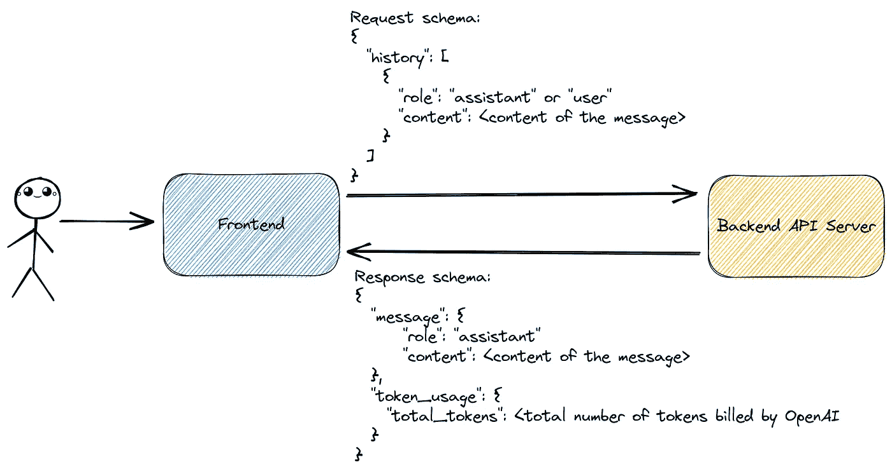
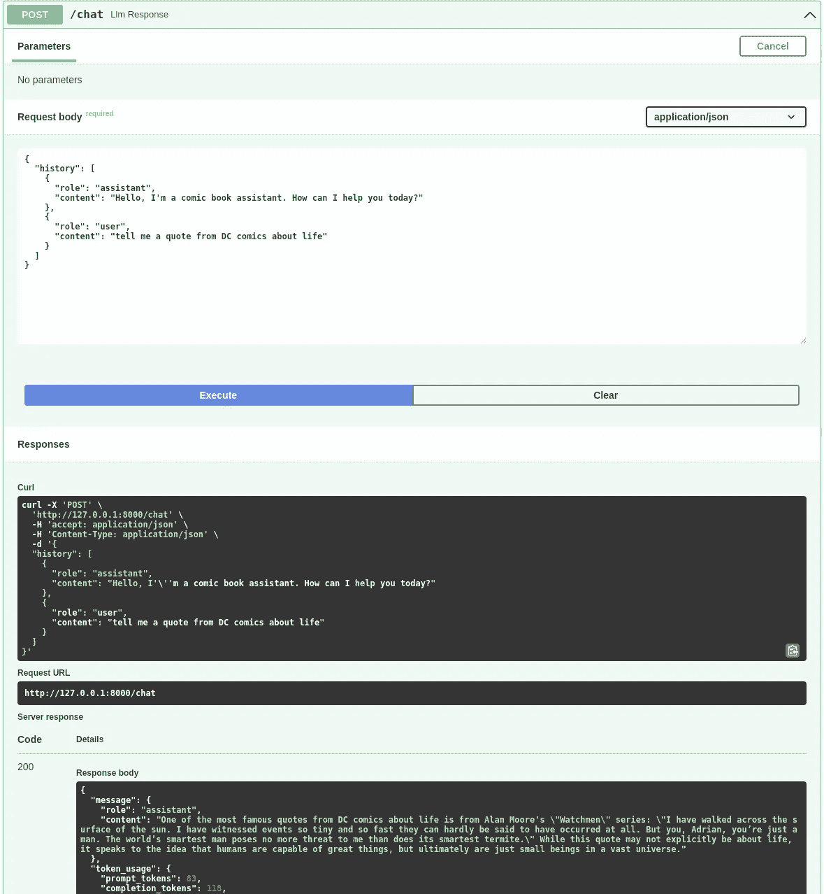

# 面向 ChatGPT 的 LLM 聊天机器人解耦前端——后端微服务架构

> 原文：[`towardsdatascience.com/decoupled-frontend-backend-microservices-architecture-for-chatgpt-based-llm-chatbot-61637dc5c7ea`](https://towardsdatascience.com/decoupled-frontend-backend-microservices-architecture-for-chatgpt-based-llm-chatbot-61637dc5c7ea)

## **使用 Streamlit、FastAPI 和 OpenAI API 构建无头 ChatGPT 应用程序的实用指南**

[](https://stephen-leo.medium.com/?source=post_page-----61637dc5c7ea--------------------------------)[](https://towardsdatascience.com/?source=post_page-----61637dc5c7ea--------------------------------) [Marie Stephen Leo](https://stephen-leo.medium.com/?source=post_page-----61637dc5c7ea--------------------------------)

·发表于[Towards Data Science](https://towardsdatascience.com/?source=post_page-----61637dc5c7ea--------------------------------) ·阅读时间 8 分钟·2023 年 5 月 24 日

--


图片由作者使用 Midjourney V5.1 生成，提示词：“解耦前端后端软件应用”

在[我之前的文章](https://medium.com/towards-data-science/anatomy-of-llm-based-chatbot-applications-monolithic-vs-microservice-architectural-patterns-77796216903e)中，我讨论了基于 LLM 的聊天机器人应用程序的单体与微服务架构模式之间的差异。选择微服务架构模式的一个显著优势是，它允许前端代码与数据科学逻辑分离，使得数据科学家可以专注于数据科学逻辑，而不必担心前端代码。在这篇文章中，我将向你展示如何使用 Streamlit、FastAPI 和 OpenAI API 构建微服务聊天机器人应用程序。我们将前端和后端代码解耦，以便可以轻松地将前端替换为其他前端框架，如 React、Swift、Dash、Gradio 等。

首先，创建一个新的 conda 环境并安装所需的库。

```py
# Create and activate a conda environment
conda create -n openai_chatbot python=3.10
conda activate openai_chatbot

# Install the necessary libraries
pip install ipykernel streamlit "fastapi[all]" openai
```

# **后端：数据科学逻辑**

像我之前的博客文章一样，我们将使用 FastAPI 构建后端。任何 API 中最关键的部分是 API 契约，它定义了 API 接受的输入格式和 API 将发送回客户端的输出格式。定义并遵循一个健全的 API 契约可以使前端开发人员独立于 API 开发人员进行工作，只要双方都尊重契约。这就是将前端与后端解耦的好处。FastAPI 允许我们使用 Pydantic 模型轻松地指定和验证 API 契约。我们的后端 API 契约如下：



API 合同细节。图片由作者提供

后端将负责以下任务：

1.  首先，我们初始化一个新的 FastAPI 应用，加载 OpenAI API 密钥，并定义一个系统提示，以告知 ChatGPT 我们希望它扮演的角色。在这种情况下，我们希望 ChatGPT 扮演漫画书助手的角色，因此我们这样提示它。可以随意“设计”不同的提示，并查看 ChatGPT 的回应！

1.  接下来，我们创建两个 Pydantic 模型，`Conversation` 和 `ConversationHistory`，用于验证 API 负载。`Conversation` 模型将验证对话历史记录中的每条消息，而 `ConversationHistory` 模型只是一个对话列表，用于验证整个对话历史记录。OpenAI ChatGPT API 只接受 `assistant` 或 `user` 作为 `role` 参数，因此我们在 `Conversation` 模型中指定了这个限制。如果尝试在 `role` 参数中发送其他值，API 将返回错误。使用 Pydantic 模型与 FastAPI 配合使用的好处之一就是验证。

1.  接下来，我们为健康检查保留根路由。

1.  最后，我们定义一个 `/chat` 路由，该路由接受一个 `POST` 请求。该路由将接收一个 `ConversationHistory` 负载，这是一系列对话。然后，该路由将负载转换为 Python 字典，使用系统提示和负载中的消息列表初始化对话历史记录，使用 OpenAI ChatGPT API 生成响应，并将生成的响应和令牌使用情况返回给 API 调用者。

```py
# %%writefile backend.py
import os
from typing import Literal

import openai
from fastapi import FastAPI
from pydantic import BaseModel, Field

app = FastAPI()

# Load your API key from an environment variable or secret management service
openai.api_key = os.getenv("OPENAI_API_KEY")

system_prompt = "You are a comic book assistant. You reply to the user's question strictly from the perspective of a comic book assistant. If the question is not related to comic books, you politely decline to answer."

class Conversation(BaseModel):
    role: Literal["assistant", "user"]
    content: str

class ConversationHistory(BaseModel):
    history: list[Conversation] = Field(
        example=[
            {"role": "user", "content": "tell me a quote from DC comics about life"},
        ]
    )

@app.get("/")
async def health_check():
    return {"status": "OK!"}

@app.post("/chat")
async def llm_response(history: ConversationHistory) -> dict:
    # Step 0: Receive the API payload as a dictionary
    history = history.dict()

    # Step 1: Initialize messages with a system prompt and conversation history
    messages = [{"role": "system", "content": system_prompt}, *history["history"]]

    # Step 2: Generate a response
    llm_response = openai.ChatCompletion.create(
        model="gpt-3.5-turbo", messages=messages
    )

    # Step 3: Return the generated response and the token usage
    return {
        "message": llm_response.choices[0]["message"],
        "token_usage": llm_response["usage"],
    }
```

就这样！我们现在可以使用 `uvicorn backend:app — reload` 在本地机器上运行后端，并通过 [`127.0.0.1:8000/docs.`](http://127.0.0.1:8000/docs.) 使用 Swagger UI 进行测试。



FastAPI 后端文档。图片由作者提供

# **前端：用户界面**

我们将构建前端，使其完全独立于后端。我们只需要遵守后端使用的 API 合同。在构建前端用户界面之前，让我们定义一些辅助函数。

1.  `display_conversation()` 将帮助我们使用 [原生 streamlit 聊天元素](https://docs.streamlit.io/library/api-reference/chat) 显示对话历史记录。我们可以使用表情符号或文件路径为用户和助手消息选择独特的头像。

1.  `clear_conversation()` 将帮助我们清除对话历史记录。它还将初始化 `conversation_history` 会话状态变量以存储对话历史记录，以及 `total_cost` 会话状态变量以保存总对话成本。

1.  `download_conversation()` 将允许我们将对话历史记录下载为 CSV 文件。

1.  `calc_cost()`: 将帮助我们根据使用的令牌数量计算对话成本。[OpenAI API 对每 1000 个输出令牌收费 $0.002，对每 1000 个输入令牌收费 $0.0015](https://openai.com/pricing#chat)，所以我们将使用这些费用来计算对话成本。

```py
# %%writefile utils.py
from datetime import datetime

import pandas as pd
import streamlit as st

user_avatar = "😃"
assistant_avatar = "🦸"

def display_conversation(conversation_history):
    """Display the conversation history"""

    # Loop over all messages in the conversation
    for message in conversation_history:
        # Change avatar based on the role
        avatar = user_avatar if message["role"] == "user" else assistant_avatar

        # Display the message content
        with st.chat_message(message["role"], avatar=avatar):
            st.markdown(message["content"])

            if "api_call_cost" in message:
                st.caption(f"Cost: US${message['api_call_cost']:.5f}")

def clear_conversation():
    """Clear the conversation history."""
    if (
        st.button("🧹 Clear conversation", use_container_width=True)
        or "conversation_history" not in st.session_state
    ):
        st.session_state.conversation_history = []
        st.session_state.total_cost = 0

def download_conversation():
    """Download the conversation history as a CSV file."""
    conversation_df = pd.DataFrame(
        st.session_state.conversation_history, columns=["role", "content"]
    )
    csv = conversation_df.to_csv(index=False)

    st.download_button(
        label="💾 Download conversation",
        data=csv,
        file_name=f"conversation_{datetime.now().strftime('%Y%m%d%H%M%S')}.csv",
        mime="text/csv",
        use_container_width=True,
    )

def calc_cost(token_usage):
    # https://openai.com/pricing

    return (token_usage["prompt_tokens"] * 0.0015 / 1000) + (
        token_usage["completion_tokens"] * 0.002 / 1000
    )
```

现在我们拥有了使用 Streamlit 构建用户界面所需的一切。让我们创建一个 frontend.py 文件并导入我们之前定义的助手函数。

1.  首先，我们将定义我们 FastAPI 后端的 URL。

1.  `openai_llm_response()` 将使用 `user` 角色将最新的用户输入附加到 `conversation_history` 会话状态变量中。然后，我们将创建一个符合我们后端 FastAPI 应用程序期望的格式的有效负载，包含 `history` 字段。最后，我们将有效负载发送到后端，并将生成的响应及单次 API 调用的成本附加到 `conversation_history` 会话状态变量中。我们还将用生成响应的成本增加总成本。

1.  `main()`: 是 UI 设计的主要部分。在标题下方，我们使用 utils.py 中的助手函数添加了清除和下载对话的按钮。接着我们有一个聊天输入框，用户可以在其中输入问题。按下回车将把输入框中输入的文本发送到后端。最后，我们展示对话的成本和对话历史。

```py
# %%writefile frontend.py
import requests
import streamlit as st
import utils

# Replace with the URL of your backend
app_url = "http://127.0.0.1:8000/chat"

@st.cache_data(show_spinner="🤔 Thinking...")
def openai_llm_response(user_input):
    """Send the user input to the LLM API and return the response."""

    # Append user question to the conversation history
    st.session_state.conversation_history.append(
        {"role": "user", "content": user_input}
    )

    # Send the entire conversation history to the backend
    payload = {"history": st.session_state.conversation_history}
    response = requests.post(app_url, json=payload).json()

    # Generate the unit api call cost and add it to the response
    api_call_cost = utils.calc_cost(response["token_usage"])
    api_call_response = response["message"]
    api_call_response["api_call_cost"] = api_call_cost

    # Add everything to the session state
    st.session_state.conversation_history.append(api_call_response)
    st.session_state.total_cost += api_call_cost

def main():
    st.title("🦸 ChatGPT Comic Book Assistant")

    col1, col2 = st.columns(2)
    with col1:
        utils.clear_conversation()

    # Get user input
    if user_input := st.chat_input("Ask me any comic book question!", max_chars=50):
        openai_llm_response(user_input)

    # Display the total cost
    st.caption(f"Total cost of this session: US${st.session_state.total_cost:.5f}")

    # Display the entire conversation on the frontend
    utils.display_conversation(st.session_state.conversation_history)

    # Download conversation code runs last to ensure the latest messages are captured
    with col2:
        utils.download_conversation()

if __name__ == "__main__":
    main()
```

就这样！我们已完成前端应用程序。现在我们可以使用 `streamlit run frontend.py` 进行测试。


Streamlit App 界面。图像来源：作者

# **结论**

使用 OpenAI API 构建一个聊天机器人，采用微服务架构通过将前端与后端解耦是很简单的。以下是一些考虑何时采用解耦架构的想法：

1.  你的应用相对复杂或需要支持中到大规模的流量。解耦架构允许前端和后端独立扩展，以处理大规模流量。

1.  你有专门的前端开发资源来构建 UI，或者需要为外部客户提供高度精致的 UI。在本教程中，我们使用了 Streamlit 构建了一个简单的用户界面，但构建更复杂的 UI 可能会变得困难甚至不可能。最好使用像 React、Swift 等专业 UI 框架来构建面向客户的应用程序。

1.  你想独立于前端改进数据科学逻辑。例如，你可以更新提示词或添加多个微服务，所有这些都由 API 服务器入口点进行协调，只要你遵守与前端工程师达成的相同 API 合同，就无需担心前端代码。

然而，可能会有一些情况下，解耦不是你应用的最佳架构选择。以下是一些关于何时不使用解耦架构的想法：

1.  你的应用很简单或流量较低。你可以使用单体应用程序，因为扩展不是问题。

1.  你没有专门的前端开发资源来构建用户界面，或者你的应用程序仅服务于内部客户，这些客户可能对粗糙的用户界面设计更为宽容。尤其是在构建最小可行产品或原型时，这一点尤为明显。

1.  你是一个想要同时提升数据科学逻辑和前端界面的独角兽！
