# 深度确定性策略梯度（DDPG）解释

> 原文：[`towardsdatascience.com/deep-deterministic-policy-gradients-explained-4643c1f71b2e`](https://towardsdatascience.com/deep-deterministic-policy-gradients-explained-4643c1f71b2e)

## 一种基于梯度的强化学习算法，用于学习连续动作空间中的确定性策略

 [Wouter van Heeswijk, PhD](https://wvheeswijk.medium.com/?source=post_page-----4643c1f71b2e--------------------------------)

·发表于 [Towards Data Science](https://towardsdatascience.com/?source=post_page-----4643c1f71b2e--------------------------------) ·阅读时间 11 分钟·2023 年 4 月 5 日

--

图片由 [Jonathan Ford](https://unsplash.com/@jonfordphotos?utm_source=medium&utm_medium=referral) 提供，来源于 [Unsplash](https://unsplash.com/?utm_source=medium&utm_medium=referral)

本文介绍了深度确定性策略梯度（DDPG）——一种适用于**连续动作空间中的确定性策略**的强化学习算法。通过将演员-评论家范式与深度神经网络结合，可以在不依赖随机策略的情况下处理连续动作空间。

尤其适用于动作中的随机性不受欢迎的连续控制任务——例如，机器人技术或导航——DDPG 可能正是你需要的算法。

# DDPG 在强化学习领域中适合什么位置？

DDPG 结合了基于策略的方法和基于价值的方法，形成了一种混合策略类。

 ## 强化学习的四种策略类别

[towardsdatascience.com

**策略梯度方法**如[REINFORCE](https://medium.com/towards-data-science/policy-gradients-in-reinforcement-learning-explained-ecec7df94245)、[TRPO](https://medium.com/towards-data-science/trust-region-policy-optimization-trpo-explained-4b56bd206fc2)和 PPO 使用随机策略 *π:a~P(a|s)* 来探索和比较动作。这些方法从可微分分布 *P_θ(a|s)* 中提取动作，从而能够计算相对于 *θ* 的梯度。这些决策中的固有随机性可能在实际应用中不受欢迎。DDPG 消除了这种随机性，产生了更简单和更可预测的策略。

**基于价值的方法**如 SARSA、[蒙特卡罗学习](https://medium.com/towards-data-science/cliff-walking-with-monte-carlo-reinforcement-learning-587e9d3bc4e7)和深度 Q 学习基于确定性策略，该策略始终根据输入状态返回一个单一的动作。然而，这些方法假设动作的数量是有限的，这使得在具有无限多个动作的连续动作空间中评估它们的价值函数和选择最有回报的动作变得困难。

正如你猜测的那样，深度确定性策略梯度（DDPG）填补了这一空白，结合了**深度 Q 学习和策略梯度方法的元素**。DDPG 有效地处理连续动作空间，并已成功应用于机器人控制和游戏任务中。

> 如果你不熟悉策略梯度算法（特别是 REINFORCE）或基于价值的方法（特别是 DQN），建议在探讨 DDPG 之前先了解它们。

# DDPG: 评论者

DDPG 与深度 Q 学习**非常接近**，共享了符号和概念。让我们快速了解一下。

## DQN 对连续动作空间的适用性？

在普通（即，表格）Q 学习中，我们使用 Q 值来逼近贝尔曼价值函数 *V*。Q 值为每个状态-动作对定义，因此用 *Q(s,a)* 表示。表格 Q 学习需要一个**查找表**来包含每对的 Q 值，因此需要离散的状态空间和离散的动作空间。

是时候将 *‘深度’* 融入深度强化学习中了。与查找表相比，引入**神经网络**有两个优点：（i）它为整个状态空间提供了一个通用表达式，（ii）因此，它还可以处理连续的 *状态* 空间。

当然，我们需要处理连续的 *动作* 空间；因此我们不能为每个动作输出 Q 值。相反，我们提供一个动作作为 *输入* 并计算**状态-动作对的 Q 值**（这个过程也称为*简单 DQN*）。用数学术语来说，我们可以将网络表示为 Q*:(s,a)→Q(s,a)*，即为给定的状态-动作对输出一个单一的 Q 值。

相应的评论员网络如下所示。

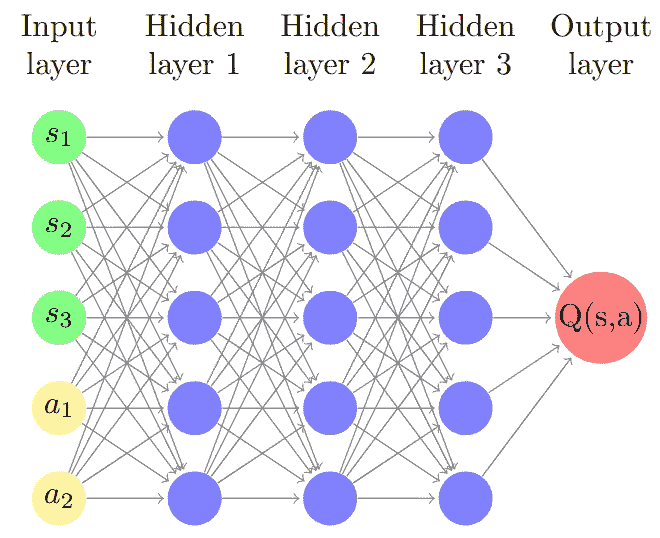

DDPG 中的评论员网络 Q:(s,a)示例。网络同时接受状态向量和动作向量作为输入，并输出一个 Q 值[图片由作者提供]

尽管提供了泛化能力，神经网络也引入了一些稳定性问题。作为*所有*状态的单一表示，每次更新也会影响*所有* Q 值。由于观察元组*(s,a,r,s’)*是顺序收集的，它们之间往往存在**高时间相关性**，使得过拟合变得非常可能。在这里不深入细节，正确训练价值网络需要以下三种技术：

+   **经验回放**：从经验缓冲区中采样观察数据*(s,a,r,s’)*，打破随后收集的元组之间的相关性。

+   **批量学习**：用观察数据批次训练价值网络，使更新更可靠且有影响力。

+   **目标网络**：使用不同的网络来计算*Q(s’,a’)*与*Q(s,a)*，减少期望与观察之间的相关性。

[如何建模经验回放、批量学习和目标网络](https://towardsdatascience.com/how-to-model-experience-replay-batch-learning-and-target-networks-c1350db93172?source=post_page-----4643c1f71b2e--------------------------------) [## 如何建模经验回放、批量学习和目标网络

### 关于稳定且成功的深度 Q 学习的三个基本技巧的快速教程，使用 TensorFlow 2.0

[如何建模经验回放、批量学习和目标网络](https://towardsdatascience.com/how-to-model-experience-replay-batch-learning-and-target-networks-c1350db93172?source=post_page-----4643c1f71b2e--------------------------------)

## 评论员网络更新

现在基础知识已经更新，让我们将上述概念与 DDPG 结合起来。我们定义一个**评论员网络 Q_ϕ**，如前所述，由ϕ（代表网络权重）参数化。

我们设定了一个损失函数，目标是最小化，这对于有 Q 学习经验的人应该是熟悉的：

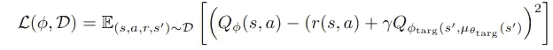

与 DQN 相比，关键区别在于对于* s’*对应的动作——而不是在动作空间中最大化——**我们通过目标演员网络*μ_{θ_targ}*确定动作*a’***（稍后会详细讲解）。在这个旁道之后，我们像往常一样更新评论员网络。

除了更新主评论员网络，我们还必须更新目标评论员网络。在深度 Q 学习中，这通常是主价值网络的周期性副本（例如，每 100 集复制一次）。在 DDPG 中，通常使用**滞后目标网络**进行 Polyak 平均，使目标网络落后于主价值网络：

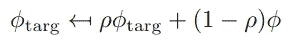

由于ρ通常接近 1，**目标网络适应非常缓慢**，这逐渐提高了训练稳定性。

# DDPG：演员

在 DDPG 中，actor 和 critic 以离策略的方式紧密相连。我们首先探索算法的离策略特性，然后再讨论动作生成和 actor 网络更新。

## 离策略训练

在纯策略梯度方法中，我们直接更新策略 *μ_θ*（由*θ* 参数化）以最大化期望奖励，而不依赖于显式的价值函数来捕捉这些奖励。DDPG 是一种混合方法，它还使用 Q 值，但从 actor 的角度来看，**最大化目标** *J(θ)* 表面上看是相似的：

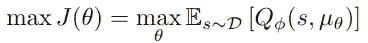

然而，仔细观察期望值会发现 DDPG 是一种**离策略方法**，而典型的 actor-critic 方法是同策略的。大多数 actor-critic 模型最大化期望值 *E_{τ~π_θ}*，其中*τ* 是由策略 *π_θ* 生成的状态-动作轨迹。相对而言，DDPG 对从经验缓冲区中抽取的样本状态进行期望值优化（*E_{s~D}*）。由于 DDPG 使用不同策略生成的经验来优化策略，因此它是一种**离策略算法**。

在这种离策略背景下，重放缓冲区的作用需要一些关注。为什么*可以*重用旧经验，为什么*应该*这样做？

首先，让我们探讨为什么缓冲区*可以*包含与当前策略不同的经验。随着策略的不断更新，重放缓冲区保存了**源自过时策略的经验**。由于最优 Q 值适用于*任何*过渡，因此生成这些经验的策略并不重要。

其次，重放缓冲区*应该*包含**多样化的经验**的原因在于我们部署的是确定性策略。如果算法是同策略的，我们可能会有有限的探索。通过借鉴过去的经验，我们还会在当前策略下不太可能遇到的观察值上进行训练。

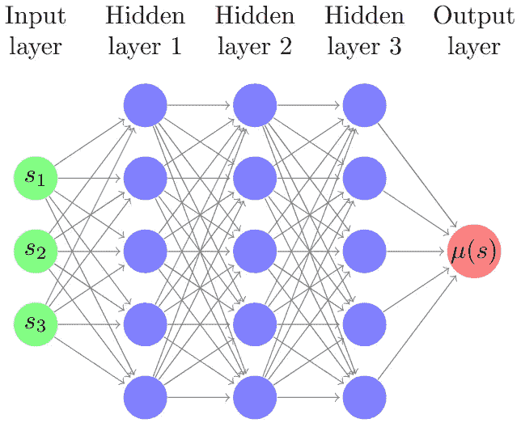

DDPG 中的 actor 网络 μ_θ:s 示例。该网络将状态向量作为输入，并输出确定性动作 μ(s)。在训练过程中，通常会添加一个单独的随机噪声 ϵ [图像由作者提供]

## 动作探索

那么，政策梯度方法中著名的探索机制如何呢？毕竟，我们现在部署的是确定性策略而非随机策略，对吧？DDPG 通过在训练过程中**添加一些噪声** ***ϵ*** 来解决这个问题，在部署策略时去除这些噪声。

早期的 DDPG 实现使用了相当复杂的噪声结构（例如，时间相关的奥恩斯坦-乌伦贝克噪声），但后来的实验证明，**普通高斯噪声** *ϵ~N(0,σ²)* 的效果同样良好。噪声可能会随着时间的推移逐渐减少，但不像随机策略中的*σ_θ*那样是一个可训练的组件。最后一点是，我们可能会**裁剪动作范围**。显然，探索过程中涉及一些调优工作。

总之，**演员生成动作**如下。它以状态作为输入，输出一个确定的值，并添加一些随机噪声：

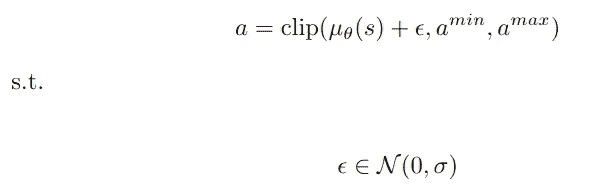

## 演员网络更新

关于策略更新的最终说明，这并不一定是简单的。我们根据评论家网络（由 *ϕ* 参数化）返回的 Q 值来更新演员网络参数 *θ*。因此，我们保持 Q 值不变——即，我们在这一步不更新 *ϕ*——并通过改变动作来最大化预期奖励。这意味着我们 **假设评论家网络对动作是可微的**，以便我们可以在一个最大化 Q 值的方向上更新动作：

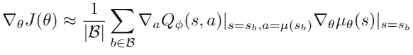

尽管第二个梯度 *∇_θ* 常常为了可读性而省略，但它提供了一些说明。我们训练演员网络以 **输出更好的动作**，从而改进获得的 Q 值。如果愿意，你可以通过应用链式法则来详细说明这个过程。

**演员目标网络**使用 Polyak 平均进行更新，与评论家目标网络类似。

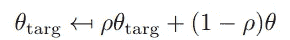

# 综合整理

我们有一个演员，也有一个评论家，因此现在没有什么可以阻止我们完成算法！

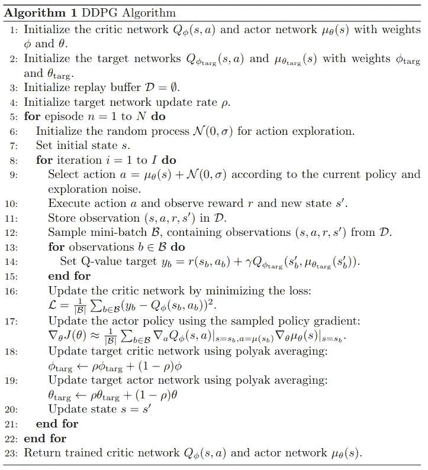

DDPG 大纲 [作者提供的图像，初步大纲由 ChatGPT 生成]

让我们一步一步地进行详细说明。

## 初始化 [第 1–4 行]

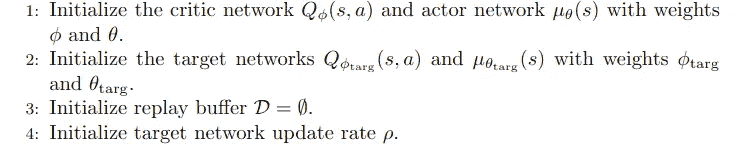

DDPG 初始化 [作者提供的图像]

我们从以下四个网络开始：

**演员网络 μ_**θ

+   由 θ 参数化

+   基于输入 *s* 输出确定性动作

**演员目标网络 μ_{θ_targ}**

+   由 *θ_targ* 参数化

+   在训练评论家网络时提供 *s’* 的动作

**评论家网络 Q_**ϕ**(s,a)**

+   由 *ϕ* 参数化

+   基于输入 *(s,a)* 输出 Q 值 *Q(s,a)*（期望）

**评论家目标网络 μ**

+   由 *ϕ_tar* 参数化

+   在训练评论家网络时输出 Q 值 *Q(s’,a’)*（目标）

我们从一个空的重放缓冲区 *D* 开始。与策略方法不同，我们 **在更新策略后不会清空缓冲区，** 因为我们会重复使用旧的过渡。

最后，我们将学习率 *ρ* 设置为 **更新目标网络。** 为了简单起见，我们假设两个目标网络的学习率相同。请记住，*ρ* 应设置接近 1（例如，0.995），以便网络更新缓慢，目标保持相对稳定。

## 数据收集 [第 9–11 行]

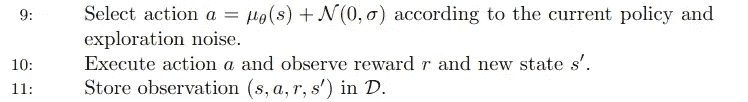

DDPG 数据收集 [作者提供的图像]

动作通过演员网络生成，演员网络输出确定性动作。为了增加探索，向这些动作中添加噪声。生成的观测元组存储在重放缓冲区中。

## 更新演员和评论家网络 [第 12–17 行]

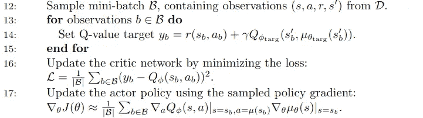

DDPG 主网络更新 [作者提供的图片]

从重放缓冲区中采样一个随机小批量 *B⊆D*（包括源自较旧策略的观察值）。

要更新评论者，我们**最小化平方误差**，即观察值（通过目标网络获得）和期望值（通过主网络获得）之间的误差。

为了更新演员，我们计算**样本策略梯度**，同时保持 Q 值固定。在神经网络设置中，我们计算伪损失，即生成动作的累积 Q 值。

**训练过程**可以通过下面的 Keras 代码片段进行澄清：

## 更新目标网络 [第 18–19 行]

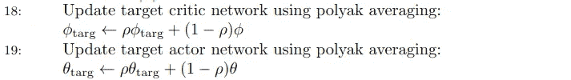

DDPG 目标网络更新 [作者提供的图片]

演员目标网络和评论者目标网络使用**Polyak 平均**进行更新，它们的权重略微靠近更新后的主网络。

## 返回训练后的网络 [第 23 行]

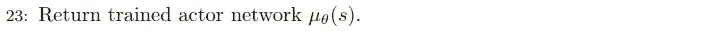

DDPG 训练后的演员网络 [作者提供的图片]

尽管我们经历了一些麻烦，但结果策略看起来非常干净。与 DQN 不同，我们不对动作空间进行显式最大化，因此**不再需要 Q 值** [注意我们从未用它们来做决策，只是用来改进它们]。

我们**不再需要目标网络**，这些网络只是为了稳定训练和防止振荡。理想情况下，主网络和目标网络将会收敛，从而使得我们有*μ_θ=μ_{θ_targ}*（以及 *Q_ϕ=Q_{ϕ_targ}*）。这样，我们知道我们的策略确实已经收敛。

最后，我们去掉了探索噪声 *ϵ*，它从未是策略的一个核心部分。我们得到一个**接受状态作为输入并输出确定性动作的演员网络**，这在许多应用中正是我们所希望的简单性。

# 什么使 DDPG 与其他算法不同？

我们确定 DDPG 是一种混合类方法，结合了策略梯度方法和基于值的方法。这适用于所有演员-评论者方法，那么究竟是什么使 DDPG 独特呢？

+   **DDPG 处理连续动作空间：** 该算法专门设计用于处理连续动作空间，而不依赖于随机策略。确定性策略可能更容易学习，并且在实际应用中没有固有随机性的策略通常是更可取的。

+   **DDPG 是离线策略的。** 与常见的演员-评论者算法不同，经验来自于包括较旧策略的观察值的重放缓冲区。离线策略的性质对于充分探索是必要的（因为动作是确定性生成的）。它还提供了更高的样本效率和更好的稳定性。

+   **DDPG 在概念上非常接近 DQN：** 从本质上讲，DDPG 是 DQN 的一个变体，适用于连续动作空间。为了避免明确地在所有动作上进行最大化——DQN 通过枚举整个动作空间来识别最高的 Q(s,a) 值——动作由一个单独优化的演员网络提供。

+   **DDPG 输出一个演员网络：** 尽管在训练上接近 DQN，但在部署过程中我们只需要训练好的演员网络。这个网络将状态作为输入，并确定性地输出一个动作。

尽管乍一看可能不那么明显，**DDPG 的确定性特性往往简化了训练**，比在线方法更稳定、更高效。输出是一个全面的演员网络，该网络确定性地生成动作。由于这些特性，它已成为连续控制任务中的重要工具。

*想了解更多关于 DDPG 构建模块的背景？查看以下文章。*

*深度 Q 学习（DQN）：*

[## TensorFlow 2.0 中深度 Q 学习的最小工作示例](https://towardsdatascience.com/a-minimal-working-example-for-deep-q-learning-in-tensorflow-2-0-e0ca8a944d5e?source=post_page-----4643c1f71b2e--------------------------------)

### 一个多臂赌博机的例子，用于训练 Q 网络。更新过程只需要几行代码，使用 TensorFlow。

[## 深度 Q 学习在悬崖行走问题中的应用](https://towardsdatascience.com/deep-q-learning-for-the-cliff-walking-problem-b54835409046?source=post_page-----4643c1f71b2e--------------------------------) [## 深度 Q 学习在悬崖行走问题中的应用](https://towardsdatascience.com/deep-q-learning-for-the-cliff-walking-problem-b54835409046?source=post_page-----4643c1f71b2e--------------------------------) [## 深度 Q 学习在悬崖行走问题中的应用

### 一个完整的 Python 实现，使用 TensorFlow 2.0 进行悬崖导航。

[## 深度 Q 学习在悬崖行走问题中的应用](https://towardsdatascience.com/deep-q-learning-for-the-cliff-walking-problem-b54835409046?source=post_page-----4643c1f71b2e--------------------------------)

*策略梯度方法：*

[## 强化学习中的策略梯度解释](https://towardsdatascience.com/policy-gradients-in-reinforcement-learning-explained-ecec7df94245?source=post_page-----4643c1f71b2e--------------------------------) [## 强化学习中的策略梯度解释](https://towardsdatascience.com/policy-gradients-in-reinforcement-learning-explained-ecec7df94245?source=post_page-----4643c1f71b2e--------------------------------) [## 强化学习中的策略梯度解释

### 了解基于似然比的策略梯度算法（REINFORCE）：直觉、推导…

[## 深度策略梯度用于悬崖行走](https://towardsdatascience.com/deep-policy-gradient-for-cliff-walking-37d5014fd4bc?source=post_page-----4643c1f71b2e--------------------------------) [## 深度策略梯度用于悬崖行走](https://towardsdatascience.com/deep-policy-gradient-for-cliff-walking-37d5014fd4bc?source=post_page-----4643c1f71b2e--------------------------------) [## 深度策略梯度用于悬崖行走

### 一个用 Python 实现的 TensorFlow 2.0 解决方案。在这个方案中，演员由一个神经网络表示，该网络…

[## 深度策略梯度用于悬崖行走](https://towardsdatascience.com/deep-policy-gradient-for-cliff-walking-37d5014fd4bc?source=post_page-----4643c1f71b2e--------------------------------)

# 参考文献

OpenAI (2018). 深度确定性策略梯度。 [`spinningup.openai.com/en/latest/algorithms/ddpg.html`](https://spinningup.openai.com/en/latest/algorithms/ddpg.html)

Keras (2020). 深度确定性策略梯度（DDPG）由 amifunny 制作。 [`keras.io/examples/rl/ddpg_pendulum/`](https://keras.io/examples/rl/ddpg_pendulum/)

Lillicrap, T. P., Hunt, J. J., Pritzel, A., Heess, N., Erez, T., Tassa, Y., … & Wierstra, D. (2015). 基于深度强化学习的连续控制。 *arXiv 预印本 arXiv:1509.02971*。

Yang, A. & Philion, J. (2020). *深度强化学习中的连续控制*。 [`www.pair.toronto.edu/csc2621-w20/assets/slides/lec3_ddpg.pdf`](https://www.pair.toronto.edu/csc2621-w20/assets/slides/lec3_ddpg.pdf)
