# 深入了解 ESA 的哨兵 API

> 原文：[`towardsdatascience.com/deep-dive-into-esas-sentinel-api-e6ff4f9d0730`](https://towardsdatascience.com/deep-dive-into-esas-sentinel-api-e6ff4f9d0730)

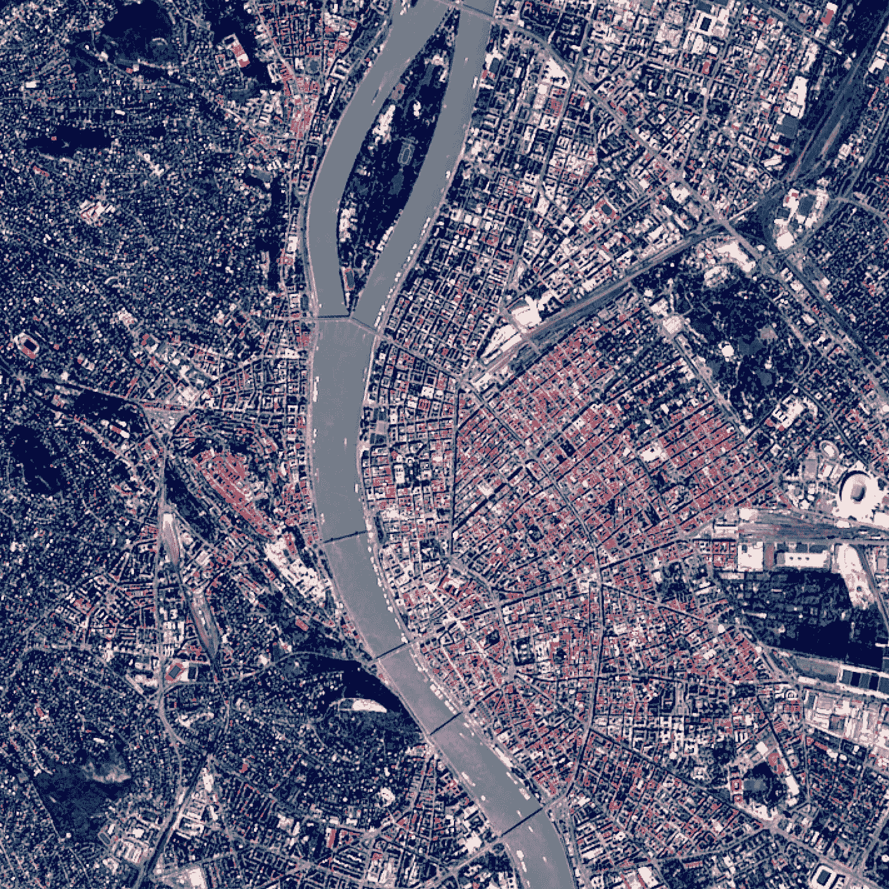

基于 10 米分辨率哨兵数据的布达佩斯 RGB 卫星地图片段。

## 如何使用 Python 获取、分析和可视化卫星图像

[](https://medium.com/@janosovm?source=post_page-----e6ff4f9d0730--------------------------------)[](https://towardsdatascience.com/?source=post_page-----e6ff4f9d0730--------------------------------) [Milan Janosov](https://medium.com/@janosovm?source=post_page-----e6ff4f9d0730--------------------------------)

·发表于[Towards Data Science](https://towardsdatascience.com/?source=post_page-----e6ff4f9d0730--------------------------------) ·13 分钟阅读·2023 年 10 月 26 日

--

*本文中的所有图像均由作者创建。*

欧洲航天局一直在运行其[哨兵任务](https://www.esa.int/Applications/Observing_the_Earth/Copernicus/The_Sentinel_missions#:~:text=These%20missions%20carry%20a%20range,for%20land%20and%20ocean%20services.)，支持哥白尼，即欧盟空间计划的地球观测组件，提供各种类型的遥感数据，如雷达和多光谱成像仪器，用于陆地、海洋和大气监测。

目前有六个进行中的哨兵任务，其中三个可以通过它们的[Python API](https://sentinelsat.readthedocs.io/en/latest/api_overview.html)轻松访问。这些任务，引用[官方来源](https://www.esa.int/Applications/Observing_the_Earth/Copernicus/The_Sentinel_missions#:~:text=These%20missions%20carry%20a%20range,for%20land%20and%20ocean%20services.)：

> **哨兵-1**是一个极轨、全天候、昼夜雷达成像任务，用于陆地和海洋服务。哨兵-1A 于 2014 年 4 月 3 日发射，哨兵-1B 于 2016 年 4 月 25 日发射。两者均通过苏联运载火箭从欧洲法属圭亚那的航天发射场送入轨道。哨兵-1B 任务于 2022 年结束，并计划尽快发射哨兵-1C。
> 
> **哨兵-2**是一个极轨、多光谱高分辨率成像任务，专用于陆地监测，例如提供植被、土壤和水体覆盖、内陆水道和沿海地区的图像。哨兵-2 还可以提供紧急服务的信息。哨兵-2A 于 2015 年 6 月 23 日发射，哨兵-2B 则于 2017 年 3 月 7 日发射。
> 
> **Sentinel-3** 是一个多仪器任务，用于高端准确性和可靠性地测量海表地形、海洋和陆地表面温度、海洋颜色和陆地颜色。该任务支持海洋预测系统以及环境和气候监测。Sentinel-3A 于 2016 年 2 月 16 日发射，Sentinel-3B 于 2018 年 4 月 25 日与其双胞胎一起进入轨道。

经过一些额外的挖掘，我们可以了解到[Sentinel-1](https://sentinels.copernicus.eu/web/sentinel/user-guides/sentinel-1-sar/resolutions/level-1-single-look-complex)的数据在空间分辨率方面可以达到几米。而[Sentinel-2](https://sentinels.copernicus.eu/web/sentinel/user-guides/sentinel-2-msi/resolutions/spatial)的视觉数据最高分辨率为 10 米，[Sentinel-3](https://sentinels.copernicus.eu/web/sentinel/user-guides/sentinel-2-msi/resolutions/spatial)则根据传感器类型在 100 公里的规模上运行。

好的，所以我们知道如何获取卫星数据，看起来还有很多的源（传感器）和空间分辨率可以选择。有人可能会指出，这仅仅是冰山一角，正如这[卫星数据源列表](https://gisgeography.com/satellite-maps/)所概述的那样。那么，我们将这些不同类型的卫星数据用于什么呢？首先，[这里有 50 多个用例的选择](https://www.linkedin.com/feed/update/urn:li:activity:7115972452437884929/)。

一般来说，我认为用例、问题的具体细节以及目标区域的地理空间特征和地形都是确定适合的数据源的重要因素。然而，在实际操作中，根据我的经验，这些是主要的驱动因素：

+   价格（最好是免费探索，适用于 Sentinel）

+   具有几米的空间分辨率，甚至较小的城市结构也可以被捕捉到。

+   至少具有几个波段，例如可见光和近红外。

+   时间频率

这些方面使得 Sentinel-2 可能是地理空间数据社区中使用最广泛的卫星数据源。基于这些组件，在这篇文章中，我将向你展示如何获取 Sentinel 数据以及下载时应该期待什么。我还将深入探讨不同的可能性以及图像记录和存储的信息的时间演变。

[*在这篇文章中，使用了 2023 年的 Copernicus Sentinel 数据，因为欧盟法律允许免费访问 Copernicus Sentinel 数据和服务信息。*](https://sentinels.copernicus.eu/documents/247904/690755/Sentinel_Data_Legal_Notice)

# 1\. **数据获取**

首先，我将按照官方文档和示例代码设置 [API](https://sentinelsat.readthedocs.io/en/latest/api_overview.html) 连接。此外，我还需要一个目标区域来下载图像。为了方便调试，我选择了我的家乡布达佩斯。我将使用 [OSMNx](https://osmnx.readthedocs.io/en/stable/) 下载其行政边界。

```py
import osmnx as ox # version: 1.0.1
import matplotlib.pyplot as plt # version: 3.7.1

city = 'Budapest'
admin = ox.geocode_to_gdf(city)
admin.plot()
```

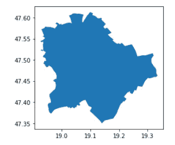

布达佩斯的行政边界。

现在点击 Sentinel API：

```py
from sentinelsat import SentinelAPI, read_geojson, geojson_to_wkt # version 0.14

# to get an account, sign up here: https://apihub.copernicus.eu/apihub
user = <add your user name 
password = < add your password >
api = SentinelAPI(user, password, 'https://apihub.copernicus.eu/apihub') 
```

为了进行查询，最好有一个平滑的多边形来指定位置。为此，我创建了布达佩斯行政区的凸包：

```py
# to simplify the query, I extract the convex hull of the input polygon
admin_polygon = admin.convex_hull.geometry.to_list()[0]
admin_polygon
```

输出：

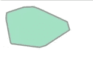

布达佩斯的凸包。

在我们选择的平台和给定的时间框架内搜索卫星图像。后者应为 Sentinel-A。此外，我们还可以根据云覆盖进行筛选——这意味着如果图像过于多云，我们将立即丢弃它。

```py
# here we can specifcy the location (based on a polygon)
# the time frame
# the space probe
# and the level of cloud-coverage accepted 

products = api.query(admin_polygon,
                     date=('20150623', '20231006'),
                     platformname='Sentinel-2',
                     cloudcoverpercentage=(0, 100))

len(products)
```

正如这些单元的输出所示，遵循 Sentinel 文档，结果显示在 2015 年 6 月 23 日（任务开始）和 2023 年 10 月 6 日（我撰写本文时），总共记录了 3876 张与布达佩斯行政边界重叠的卫星图像。我将云覆盖百分比设置为 100，这意味着没有基于云覆盖的筛选。因此，我们应该拥有过去八年的所有图像标识符。

我还注意到，结果产品列表包含了所有卫星图像的标识符和元数据，但不包含图像本身。此外，如果我用 Sentinel-3 重复相同的操作，结果将得到近 2 万条图像记录——尽管分辨率要低得多。

# **2\. 探索元数据**

让我们将产品列表转换为 Pandas DataFrame 并开始分析吧！

```py
import pandas as pd # version: 1.4.2

products_gdf = api.to_geodataframe(products)
products_gdf = products_gdf.sort_values(['beginposition'], ascending=[True])
print(products_gdf.keys())
print(len(products_gdf.keys()))
products_gdf.head(3)
```

此块的结果：

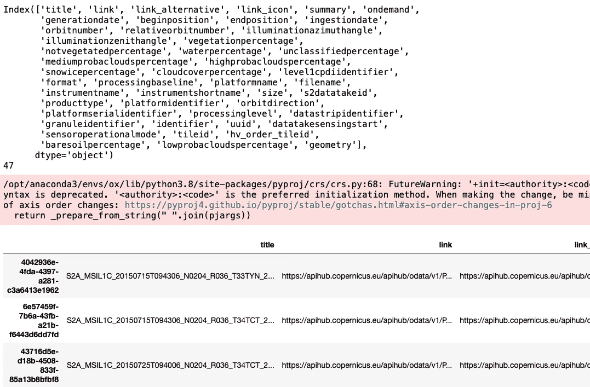

查询结果预览。

通过计算表中由卫星图像标识符索引的键的数量，人们可以感受到这些数据有多丰富，其中包含 41 个特征列。

虽然这些领域中有很多技术信息，但我希望仔细查看几个特征。一方面，空间和时间维度编码在生成日期和开始位置（作为日期时间信息）以及几何形状（作为多边形、GIS、数据类型）中。另一方面，有几个有趣的指标基于图像描述土地覆盖类型：*cloudcoverpercentage*（我们在查询中已经看到过），*vegetationpercentage*，*waterpercentage* 和 *snowicepercentage*。这些环境指数是从不同材料的光谱特性中得出的。注意：这些值都是汇总得分，捕捉了整个瓦片的总体平均值。更多信息请见 [这里](http://www.eo4geo.eu/training/sentinel-2-data-and-vegetation-indices/)。

# 3\. 空间维度

由于我们有几何维度，让我们看看这在地图上的样子！我将通过可视化一组随机图块来做到这一点，这些图块在几次运行后完全具有代表性。为了可视化，我使用了带有 CartoDB Dark_Matter 基础地图的 Folium。

```py
import folium
import geopandas as gpd

x, y = admin_polygon.centroid.xy
m = folium.Map(location=[y[0], x[0]], zoom_start=8, tiles='CartoDB Dark_Matter')

# visualize a set of random tiles
polygon_style = { 'fillColor': '#39FF14', 'color': 'black',  'weight': 3, 'opacity': 0}
geojson_data = products_gdf[['geometry']].sample(10).to_json()
folium.GeoJson(
    geojson_data,
    style_function=lambda feature: polygon_style
).add_to(m)

# add the admin boundaries on top
admin_style = {'fillColor': '#00FFFF',  'color': 'black','weight': 3, 'opacity': 100.0  }
admin_geojson_data = admin[['geometry']].to_json()
folium.GeoJson(
    admin_geojson_data,
    style_function=lambda feature: admin_style
).add_to(m)

# show the map
m
```

该代码块的输出：

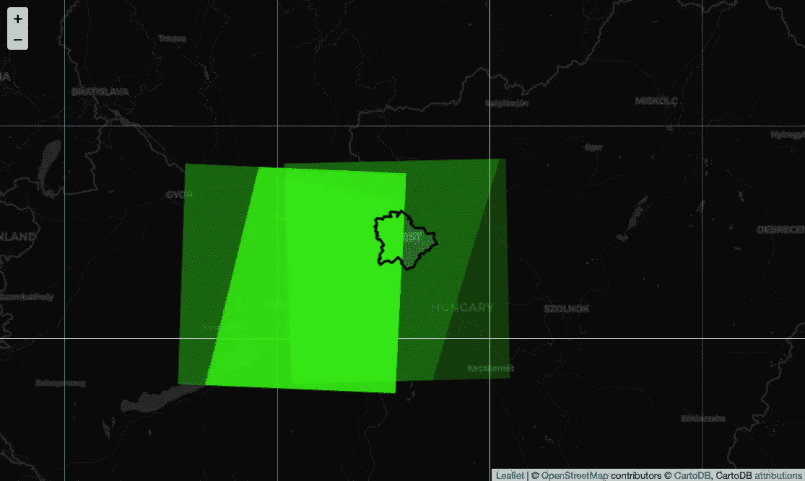

与布达佩斯行政区重叠或交叉的卫星图块的随机样本。

从这幅可视图可以看出，几部分图块不断重复。同时也明显有些图块将城市的行政边界分成了两半。这可能导致无法避免的情况，即你想分析完全覆盖你目标区域的数据，却发现它被分成了两半。一种可能的解决方法是过滤掉那些没有完全覆盖所需行政区域的图块：

```py
def compute_overlapping_area(tile, admin):
    return tile.intersection(admin_polygon).area / admin_polygon.area

products_gdf['overlapping_area_fraction'] = products_gdf.geometry.apply(lambda x: compute_overlapping_area(x, admin_polygon))
products_gdf_f = products_gdf[products_gdf.overlapping_area_fraction==1]
print(len(products_gdf))
print(len(products_gdf_f))
products_gdf_f.head(3)
```

该单元格的结果：

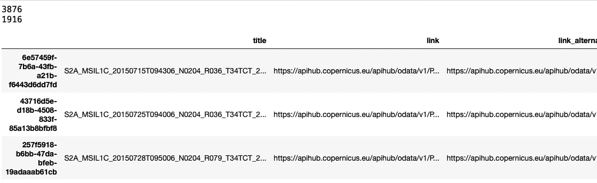

过滤后的卫星图像产品数据集预览

通过应用此过滤器，我去掉了大约一半的图块。现在让我们看看地图，看看它们与城市边界的重叠情况，以及没有图块将城市分成两半的情况：

```py
import folium
import geopandas as gpd

x, y = admin_polygon.centroid.xy
m = folium.Map(location=[y[0], x[0]], zoom_start=8, tiles='CartoDB Dark_Matter')

# visualize a set of random tiles
polygon_style = { 'fillColor': '#39FF14', 'color': 'black',  'weight': 3, 'opacity': 0}
geojson_data = products_gdf_f[['geometry']].sample(10).to_json()
folium.GeoJson(
    geojson_data,
    style_function=lambda feature: polygon_style
).add_to(m)

# add the admin boundaries on top
admin_style = {'fillColor': '#00FFFF',  'color': 'black','weight': 3, 'opacity': 100.0  }
admin_geojson_data = admin[['geometry']].to_json()
folium.GeoJson(
    admin_geojson_data,
    style_function=lambda feature: admin_style
).add_to(m)

# show the map
m
```

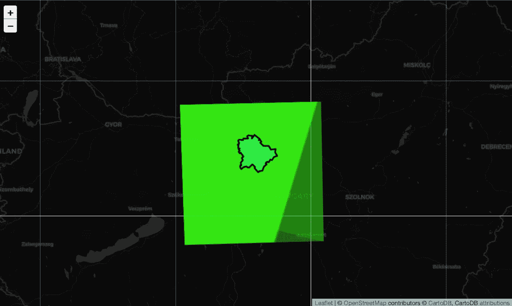

完全覆盖布达佩斯行政区的卫星图块的随机样本。

# **4\. 数据集的时间维度**

首先，让我们查看每天、每周和每月覆盖布达佩斯的图像数量。为了测量时间，我将依赖字段*beginposition*。

```py
# Assuming 'beginposition' is a Timestamp column in your GeoDataFrame
# You can convert it to a DateTime index
products_gdf_f_cntr = products_gdf_f.copy()
products_gdf_f_cntr['beginposition'] = pd.to_datetime(products_gdf_f_cntr['beginposition'])
products_gdf_f_cntr.set_index('beginposition', inplace=True)

# Resample the data to count rows per day, week, and month
daily_counts = products_gdf_f_cntr.resample('D').count()
weekly_counts = products_gdf_f_cntr.resample('W').count()
monthly_counts = products_gdf_f_cntr.resample('M').count()

fig, ax = plt.subplots(1, 3, figsize=(15, 5))
for idx, (count_name, count_val) in enumerate([('Daily Counts', daily_counts), ('Weekly Counts', weekly_counts), ('Monthly Counts', monthly_counts), ]): 

    ax[idx].plot(count_val.index[0:250], count_val['geometry'].to_list()[0:250])
    ax[idx].set_xlabel('Date')
    ax[idx].set_ylabel('Count')
    ax[idx].set_title(count_name)

plt.tight_layout()
plt.suptitle('Number of satellite images taken in various time-frames', fontsize = 20, y = 1.15)
plt.show()
```

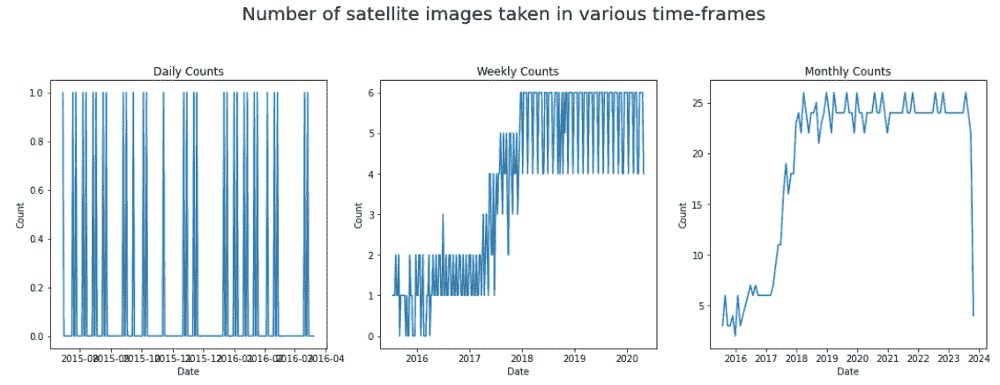

每天、每周和每月在布达佩斯目标区域捕获的卫星图像数量。

这些图形展示了 Sentinel-2 探测器的前 250 天、前 250 周和前 250 个月（整个时间跨度）。第一幅图显示了每隔一天拍摄一次快照。第二幅图显示了对前一幅图的每周平均值的计算，显示在前两年中，卫星每周拍摄布达佩斯一次或两次，然后从 2017 年到 2018 年，拍摄次数增加到每周 5-6 张。最后一幅图展示了整个时间跨度，显示了相同的趋势以及在工作了 3 年后，这 25 张每月图像成为了标准水平。

# 5\. 土地覆盖变量的时间维度

现在，来看一下*植被百分比*、*水体百分比*、*雪冰百分比*和*云量百分比*的时间演变。如前图所示，早期年份可能会显示不同的，可能是噪声结果，所以我们要保持谨慎。在这里，我不会丢弃那些年份的数据，因为我们总共有八年，去掉其中 3 年可能会丢失太多信息。首先，只需查看随时间变化的原始值，并进行每周聚合：

```py
import pandas as pd
import matplotlib.pyplot as plt

# Assuming 'beginposition' is a Timestamp column in your GeoDataFrame
# You can convert it to a DateTime index
products_gdf_f_cntr = products_gdf_f.copy()
products_gdf_f_cntr['beginposition'] = pd.to_datetime(products_gdf_f_cntr['beginposition'])
products_gdf_f_cntr.set_index('beginposition', inplace=True)

# Resample the data to calculate weekly averages
weekly_averages = products_gdf_f_cntr[['vegetationpercentage', 'waterpercentage', 'snowicepercentage', 'cloudcoverpercentage']].resample('W').mean()

# Create a multi-plot figure with four subplots
fig, (ax1, ax2, ax3, ax4) = plt.subplots(4, 1, figsize=(10, 15))

# Plot 'vegetationpercentage' with a green line
ax1.plot(weekly_averages.index, weekly_averages['vegetationpercentage'], color='green', label='Weekly Average Vegetation Percentage')
ax1.set_xlabel('Date')
ax1.set_ylabel('Percentage')
ax1.set_title('Weekly Average Vegetation Percentage')
ax1.legend()

# Plot 'waterpercentage' with a blue line
ax2.plot(weekly_averages.index, weekly_averages['waterpercentage'], color='blue', label='Weekly Average Water Percentage')
ax2.set_xlabel('Date')
ax2.set_ylabel('Percentage')
ax2.set_title('Weekly Average Water Percentage')
ax2.legend()

# Plot 'snowicepercentage' with a cyan line
ax3.plot(weekly_averages.index, weekly_averages['snowicepercentage'], color='cyan', label='Weekly Average Snow/Ice Percentage')
ax3.set_xlabel('Date')
ax3.set_ylabel('Percentage')
ax3.set_title('Weekly Average Snow/Ice Percentage')
ax3.legend()

# Plot 'cloudcoverpercentage' with a gray line
ax4.plot(weekly_averages.index, weekly_averages['cloudcoverpercentage'], color='gray', label='Weekly Average Cloud Cover Percentage')
ax4.set_xlabel('Date')
ax4.set_ylabel('Percentage')
ax4.set_title('Weekly Average Cloud Cover Percentage')
ax4.legend()

plt.tight_layout()
plt.show() 
```

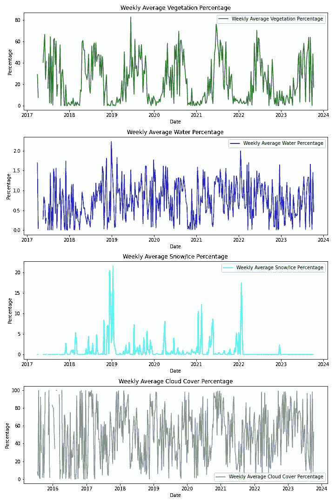

植被、水、雪和云量百分比的时间演变，以周为单位进行聚合。

以及月度聚合的结果：

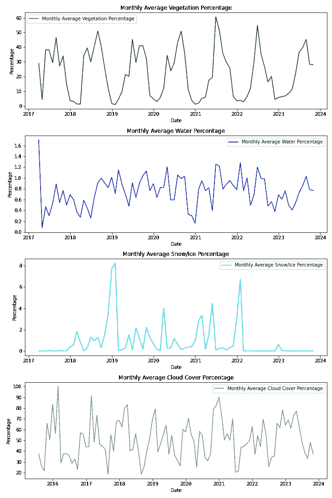

植被、水、雪和云量百分比的时间演变，以月度聚合为单位。

这些时间序列告诉我们一些有趣的事情：

+   植被百分比清楚地显示了季节性的变化，每年春天一切变绿，然后在秋天这种绿意逐渐消退，从 50-60%降到接近零。

+   相比之下，水的百分比在全年和整个观察期间波动在 0.8%左右。这是因为研究区域的地表水量非常小。尽管如此，冬季的降水似乎更频繁，这意味着一些淡水体结冰。

+   关于雪，最突出的峰值——大约 4-8%出现在冬季。尽管如此，基于个人经验，我可以说我们没有很多雪。因此，测量值仅为 1-2%，尤其是在非冬季，可能会导致一些噪声甚至云的错误分类。

+   关于云层，我们看到它们大多与植被同步，遵循季节性模式。

一些观察结果在这些指标的相关性中也很明显：

```py
products_gdf_f_cntr[['vegetationpercentage', 'waterpercentage', 'snowicepercentage', 'cloudcoverpercentage']].corr()
```

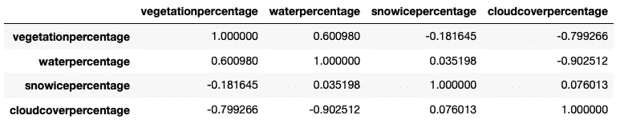

环境变量随时间变化的相关性。

# 6. 下载卫星图像

首先，对 Sentinel-2 和 Sentinel-3 进行查询，选择今年八月的同一周，并尽可能限制云覆盖。查看可用的快照数量：

```py
# query tile product ids
products_sent = api.query(admin_polygon, date=('20230806', '20230813'), platformname='Sentinel-2', cloudcoverpercentage=(0, 1))
products_sent = api.to_geodataframe(products_sent)

f, ax = plt.subplots(1,1,figsize=(6,4))
admin.plot(ax=ax, color = 'none', edgecolor = 'k')
ax.set_title('Sentinel-2, number of tiles = ' + str(len(products_sent)))
products_sent.plot(ax=ax, alpha = 0.3)

# filter out the tiles not fully overlapping with Budapest
products_sent['overlapping_area_fraction'] = products_sent.geometry.apply(lambda x: compute_overlapping_area(x, admin_polygon))
products_sent = products_sent[products_sent.overlapping_area_fraction==1]

f, ax = plt.subplots(1,1,figsize=(6,4))
admin.plot(ax=ax, color = 'none', edgecolor = 'k')
ax.set_title('Sentinel-2, number of tiles = ' + str(len(products_sent)))
products_sent.plot(ax=ax, alpha = 0.3)

len(products_sent)
```

这个代码块的结果：

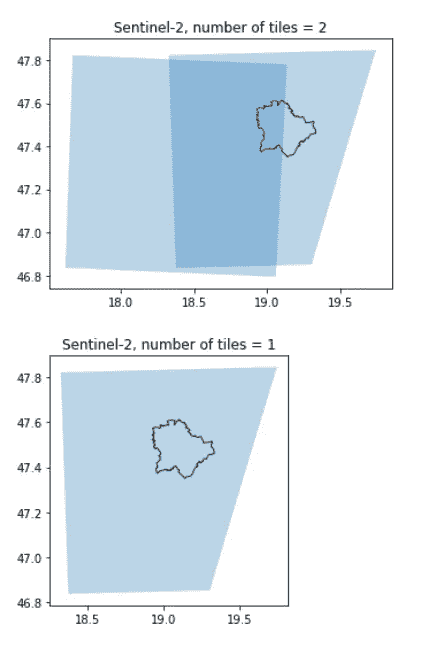

查询的瓷砖。

现在根据

```py
# download the first tiles as sat images
product_ids = products_sent.index.to_list()

for prod in product_ids:
    api.download(prod)
```

注意 — 在这里你可能会收到这个通知，这种情况下只需等待几个小时，然后再次运行下载器。

```py
Product a3c61497-d77d-48da-9a4d-394986d2fe1d is not online. Triggering retrieval from long term archive.
```

# 7. 打开并可视化下载的图像

[这里](https://sentinels.copernicus.eu/web/sentinel/user-guides/sentinel-2-msi/data-formats)你可以找到关于数据格式的详细描述，以及关于文件夹结构的漂亮可视化图像。打开图像目录后，可以找到不同的波段。每个波段的含义以及其空间分辨率在[这篇](https://gisgeography.com/sentinel-2-bands-combinations/)文章中有很好的总结，13 个波段的空间分辨率范围从 10 到 60 米。几个亮点：

+   蓝色（B2）、绿色（B3）、红色（B4）和近红外（B8）频道具有 10 米分辨率。

+   然后，其植被红边（B5）、近红外（B6、B7 和 B8A）以及短波红外（B11 和 B12）具有 10 米分辨率。

+   最终，其海岸气溶胶（B1）和短波红外气溶胶（B10）的像素大小为 60 米。

这就是它

```py
# after unzipping the downloaded folder:
import os
image_path = 'S2B_MSIL1C_20230810T094549_N0509_R079_T34TCT_20230810T124346.SAFE/GRANULE/L1C_T34TCT_A033567_20230810T095651/IMG_DATA'
sorted(os.listdir(image_path))
```

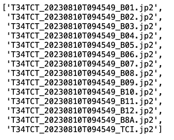

存储在 .jp2 格式中的卫星图像波段列表。

这是一整张瓦片在使用[rasterio](https://rasterio.readthedocs.io)可视化 B4 红色波段时的样子：

```py
import rasterio
from rasterio.plot import show

image_file = 'T34TCT_20230810T094549_B04.jp2'

with rasterio.open(image_path + '/' + image_file) as src:

    image = src.read(1)  # Change the band index as needed
    plt.figure(figsize=(10, 10))
    plt.imshow(image, cmap='Reds')  # You can change the colormap
    plt.title(image_file)
    plt.colorbar()
    plt.show()
```

输出：

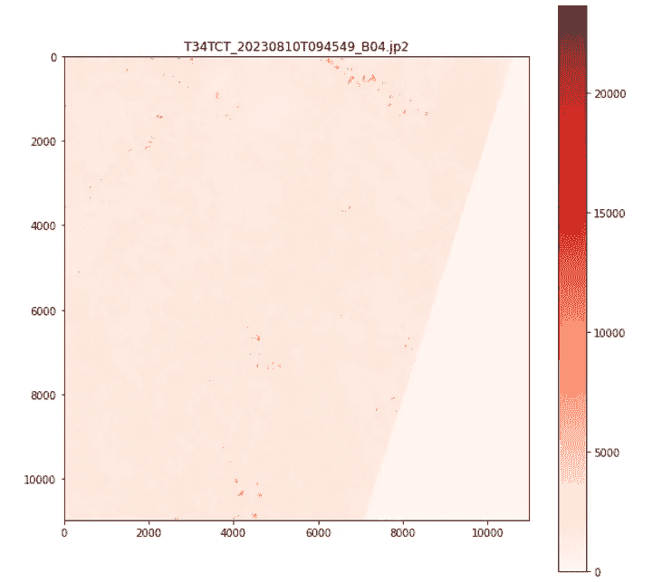

该瓦片的红色波段包含

现在集中在布达佩斯，并按城市的行政边界分别对 R、G 和 B 波段进行掩膜处理：

```py
from rasterio import mask

f, ax = plt.subplots(1,3,figsize=(15,5))

for idx, (band_name, band_num, color_map) in enumerate([('Blue', 'B02', 'Blues'), ('Green', 'B03', 'Greens'), ('Red', 'B04', 'Reds')]):

    raster_path = image_path + '/T34TCT_20230810T094549_' + band_num + '.jp2'

    with rasterio.open(raster_path) as src:
        polygons = admin.copy().to_crs(src.crs)
        geom = polygons.geometry.iloc[0]
        masked_image, _ = mask.mask(src, [geom], crop=True)

    ax[idx].imshow(masked_image[0], cmap=color_map)
    ax[idx].set_title('Budapest Sentinel 2 - ' + band_name + ' band')
```

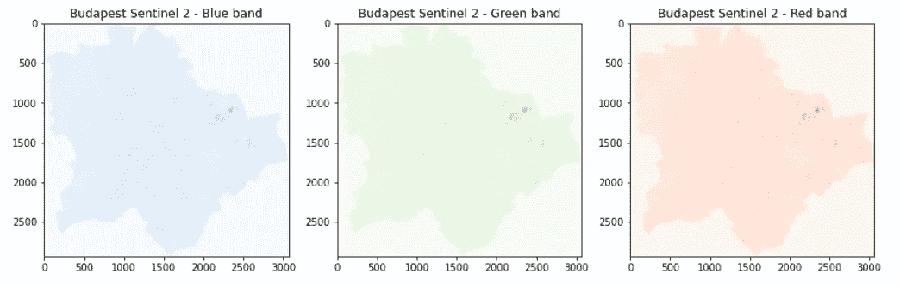

布达佩斯的三种可视化卫星波段。

最后，我们将这些图像拼接成一张布达佩斯的 RGB 图像。首先，我将完整的瓦片拼接成 RGB 图像，然后读取它，按照官方[说明](https://fire.trainhub.eumetsat.int/docs/figure5678_Sentinel-2.html)进行直方图均衡化，最后得到最终的图像。

```py
# Get the band locations
band_blue = '/T34TCT_20230810T094549_B02.jp2'
band_green = '/T34TCT_20230810T094549_B03.jp2'
band_red = '/T34TCT_20230810T094549_B04.jp2'

# Read in the bands and create the full RGB tile
b2   = rasterio.open(image_path + '/' + band_blue)
b3   = rasterio.open(image_path + '/' + band_green)
b4   = rasterio.open(image_path + '/' + band_red)

# export the full tile as a tif file
meta = b4.meta
meta.update({"count": 3})
prefire_rgb_path = 'budapest_rgb.tif'
with rasterio.open(prefire_rgb_path, 'w', **meta) as dest:
    dest.write(b2.read(1),1)
    dest.write(b3.read(1),2)
    dest.write(b4.read(1),3)

# crop and save it to the admin boundaries of budapest
with rasterio.open('budapest_rgb.tif') as src:
    polygons = admin.copy().to_crs(src.crs)
    geom = polygons.geometry.iloc[0]
    out_image, out_transform  = mask.mask(src, [geom], crop=True)
    out_meta = src.meta.copy()
    out_meta.update({"driver": "GTiff",
                     "height": out_image.shape[1],
                     "width" : out_image.shape[2],
                     "transform": out_transform})

with rasterio.open('budapest_rgb_cropped.tif', "w", **out_meta) as dest:
    dest.write(out_image)

# read and show the cropped version
import numpy as np
from skimage import exposure

img = rasterio.open('budapest_rgb_cropped.tif')
image = np.array([img.read(3), img.read(2), img.read(1)])
image = image.transpose(1,2,0)

# do the histogram equalization
p2, p98 = np.percentile(image, (2,98))
image = exposure.rescale_intensity(image, in_range=(p2, p98)) / 100000

f, ax = plt.subplots(1,1,figsize=(15,15))
rasterio.plot.show(image.transpose(2,0,1), transform=img.transform, ax = ax)
ax.axis('off')
plt.savefig('budapest_rgb_cropped_2.png', dpi = 100, bbox_inches = 'tight')
```

输出：

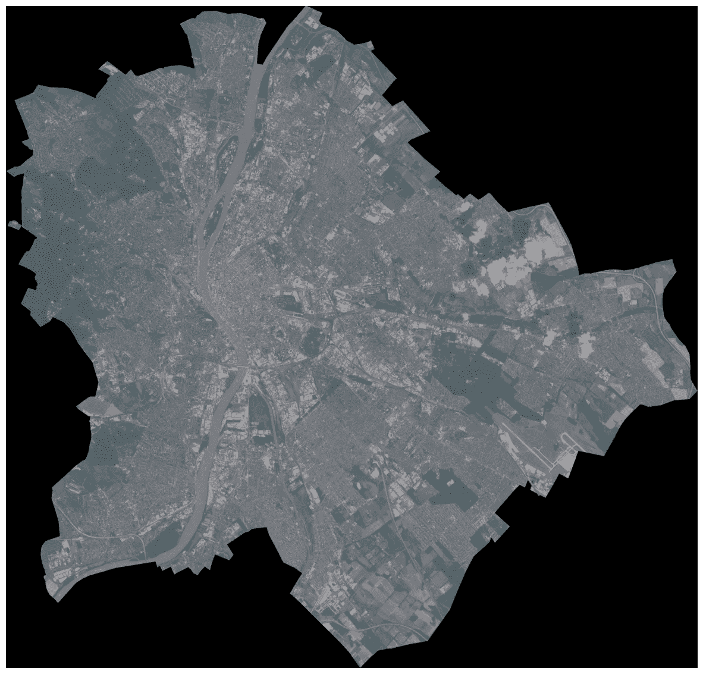

基于 10 米分辨率 Sentinel 数据的布达佩斯 RGB 卫星图像。

# 结论

快速总结一下，看看这篇文章中发生了什么：

+   Sentinel 卫星平台的快速概述

+   查询多个图像标识符及其元数据的示例

+   如何仅基于瓦片的汇总信息在元数据中进行时间分析

+   如何下载、存储和可视化单张图像

所有这些步骤的目的是将卫星图像处理和分析添加到你每天使用的地理空间数据科学工具中，这可以涵盖从城市规划到环境监测和农业等众多应用场景。
