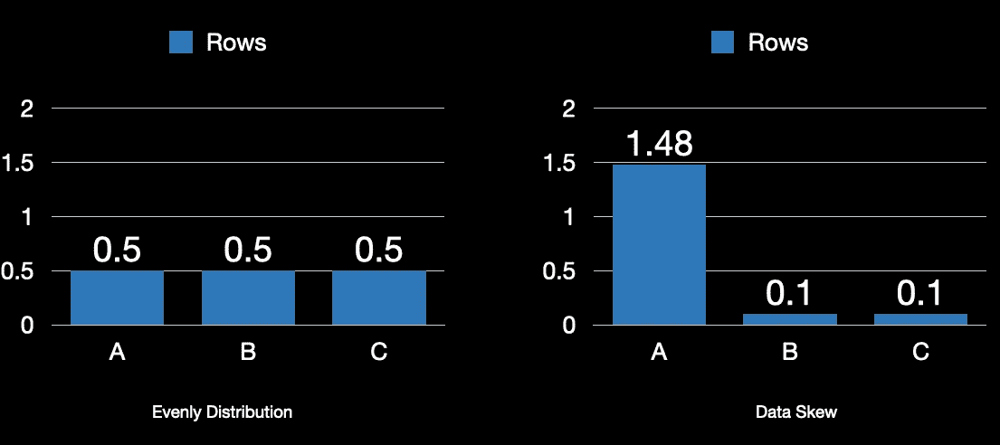
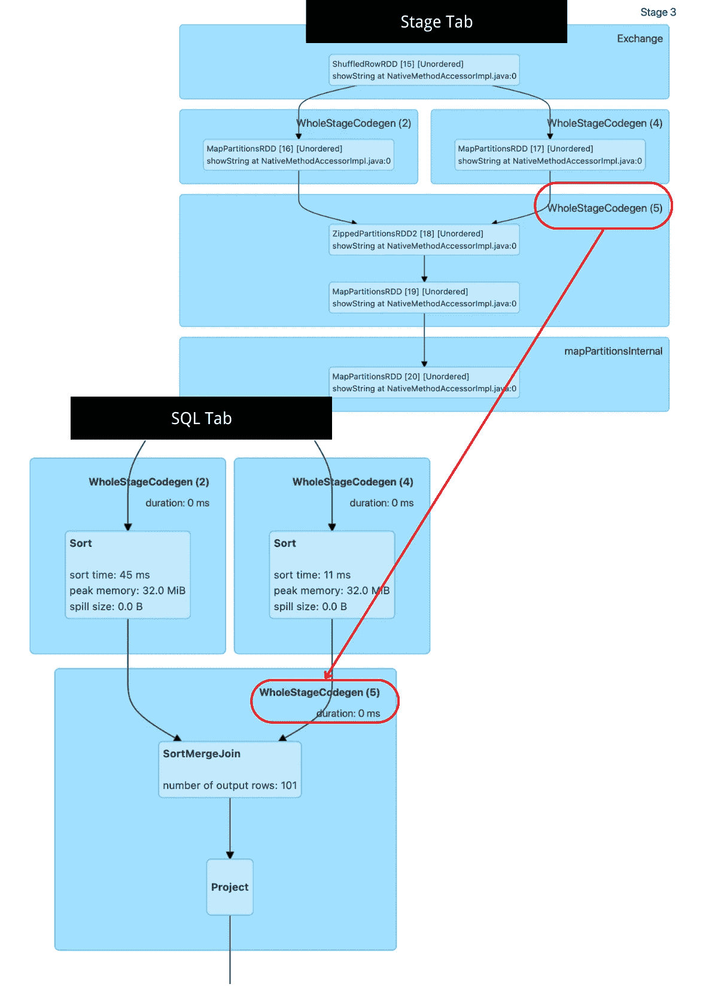
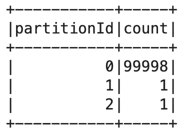

# 深入探讨 Apache Spark 数据倾斜的处理方法

> 原文：[`towardsdatascience.com/deep-dive-into-handling-apache-spark-data-skew-57ce0d94ee38`](https://towardsdatascience.com/deep-dive-into-handling-apache-spark-data-skew-57ce0d94ee38)

## 分布式计算中处理数据倾斜的终极指南

[](https://chengzhizhao.medium.com/?source=post_page-----57ce0d94ee38--------------------------------)[](https://towardsdatascience.com/?source=post_page-----57ce0d94ee38--------------------------------) [Chengzhi Zhao](https://chengzhizhao.medium.com/?source=post_page-----57ce0d94ee38--------------------------------)

·发表于 [Towards Data Science](https://towardsdatascience.com/?source=post_page-----57ce0d94ee38--------------------------------) ·阅读时间 10 分钟·2023 年 1 月 3 日

--


图片由 [Lizzi Sassman](https://unsplash.com/@okaylizzi?utm_source=unsplash&utm_medium=referral&utm_content=creditCopyText) 提供，来源于 [Unsplash](https://unsplash.com/s/photos/data?utm_source=unsplash&utm_medium=referral&utm_content=creditCopyText)

**“*为什么我的 Spark 作业运行很慢？*”** 是使用 Apache Spark 时一个不可避免的问题。关于 Apache Spark 性能调优的常见场景之一是 **数据倾斜**。在本文中，我们将讨论如何识别 Spark 作业的慢速是否由数据倾斜引起，并深入探讨如何通过代码处理 Apache Spark 数据倾斜，解释包括“加盐”技术在内的三种处理数据倾斜的方法。

## 如何识别 Spark 中的数据倾斜

在 Spark 性能调优方面，有许多因素需要考虑。鉴于分布式计算的复杂性，如果你能将问题缩小到瓶颈位置，那么你已经成功了一半。

数据倾斜通常发生在分区需要处理的数据不均匀时。假设我们在 Spark 中有三个分区来处理 150 万条记录。理想情况下，每个分区均匀地处理 50 万条记录（图片 1 左侧）。然而，也可能出现某个分区处理的数据远多于其他分区的情况（图片 1 右侧）。



图片 1 | 作者提供的图片

**为什么一个分区会处理比其他分区更多的数据？** 这与分布系统的工作方式有关。在许多数据处理框架中，数据倾斜是由于数据洗牌引起的，即将数据从一个分区移动到另一个分区。数据洗牌需要在性能调优时加以关注，因为它涉及在集群中的节点之间转移数据。这可能会导致数据管道中出现不必要的延迟，并且难以发现。

数据洗牌很昂贵，但有时执行 [宽操作](https://www.databricks.com/glossary/what-are-transformations)（如 groupBy 和 joins）是不可避免的。这些操作通常是基于键的，即键被哈希后映射到分区。相同的哈希值会被保证洗牌到相同的分区。在上述示例中，许多键被哈希到体量巨大的分区 A 中，分区 A 成为处理近 99% 数据的“热点”。这就是为什么整个作业运行缓慢的原因——数据分布不均，分区 B 和 C 大部分时间闲置，而分区 A 成为处理重负荷的“试验品”。

**如何识别 Spark 中的数据倾斜？** 我们不能将所有的慢速归咎于数据倾斜。[Spark Web UI](https://spark.apache.org/docs/latest/web-ui.html) 是识别 Spark 作业中数据倾斜的最佳本地解决方案。当你在 Spark UI 的 Stages 标签页时，倾斜的分区会在一个阶段内停滞，几乎没有进展。如果我们查看摘要指标，最大列的值通常远大于中位数，并且记录数更多。那么我们就知道我们遇到了数据倾斜问题。

**如何知道代码中的哪个部分导致了数据倾斜？** Spark UI 中的阶段详情页面只给我们 DAG 的可视化表示。

你怎么知道 Spark 中的哪个部分代码运行缓慢？这在 Spark 官方文档中提到：“[*整个阶段代码生成操作也会标注* ***代码生成 ID****。对于 Spark DataFrame 或 SQL 执行的阶段，这允许将阶段执行详情与 Web-UI SQL 标签页中报告的 SQL 计划图和执行计划相关联。*](https://spark.apache.org/docs/latest/web-ui.html#stage-detail)”

在以下情况下，我们可以使用 WholeStageCodegen IDs：2、4 或 5。我们可以前往 Spark Data Frame 标签页找到代码，并在 SQL 计划图上悬停以了解代码中正在运行的详细信息。



代码生成 ID 示例 | 图片由作者提供

## 数据倾斜示例设置

我们首先通过设置具有数据倾斜的 Spark 环境来演示问题。我们将只为`spark.executor.memory`设置 1G，并设置一个具有三个核心的执行器，`spark.sql.shuffle.partitions`也设置为三，因此最终我们将得到三个分区。我们可以使用[spark_partition_id](https://spark.apache.org/docs/3.1.1/api/python/reference/api/pyspark.sql.functions.spark_partition_id.html)来确定记录属于哪个分区，以验证数据分布。为了确保 Spark 不会自作聪明地进行更多优化，比如增加分区数量或将物理计划转换为广播连接，我们将通过将`spark.sql.adaptive.enabled`设置为 false 来关闭自适应查询执行（[AQE](https://spark.apache.org/docs/3.0.2/sql-performance-tuning.html#adaptive-query-execution)）。

我们不需要导入额外的数据源来设置示例。我们可以创建随机数据并在本文中作为示例进行操作。

**案例 1：均匀分布情况**

我们将在 Spark 中创建一个包含 1,000,000 行的数据框。在这种情况下，从 0 到 999,999 的值是被哈希和洗牌的键。请注意，这里的键是唯一的，这意味着没有任何重复。**这些确保了键是非确定性的。不能保证两个不同的键总是位于同一个分区。**

```py
df_evenly = spark.createDataFrame([i for i in range(1000000)], IntegerType())
df_evenly = df_evenly.withColumn("partitionId", spark_partition_id())
```

你可以通过使用[getNumPartitions](https://www.google.com/search?client=safari&rls=en&q=getNumPartitions&ie=UTF-8&oe=UTF-8&safari_group=9)来验证分区数量，在这种情况下，它应该是三，因为我们只有一个执行器和三个核心。

```py
df_evenly.rdd.getNumPartitions()
//output 3
```

如果一切均匀分布，我们将得到一个良好分布的计数，如果按 partitionId 分组。这是我们上面提到的完美情况*图片 1 左*。

```py
df_evenly.groupby([df_evenly.partitionId]).count().sort(df_evenly.partitionId).show()
```


按 PartitionId 平均分区的数据 | 图像由作者提供

然后我们可以执行自连接来查看计划是什么样的，我们期望会看到[SortMergJoin](https://jaceklaskowski.gitbooks.io/mastering-spark-sql/content/spark-sql-SparkPlan-SortMergeJoinExec.html)，这是当两个数据集同等重要时通常能做到的最优计划。

```py
df_evenly.alias(“left”).join(df_evenly.alias(“right”),”value”, “inner”).count()
```

在以下结果中，我们可以看到数据总大小在三个分区之间分布良好，如果查看每个分区所需的时间，它们似乎没有显著的差距。


按照 Spark 物理计划平均分区的数据 | 图像由作者提供

**案例 2：倾斜情况**

现在，让我们走极端来展示*图片 1 右*所示的情况，其中我们有一个极度倾斜的数据集。

我们仍将在 Spark 中创建一个包含 1000000 行的数据框。然而，我们不会让所有键都有不同的值，而是将大多数键设为相同。这确保了我们创建一个**“热”键，无论我们尝试多少个哈希函数，都可能成为问题。它保证会在同一个分区中。**

```py
df0 = spark.createDataFrame([0] * 999998, IntegerType()).repartition(1)
df1 = spark.createDataFrame([1], IntegerType()).repartition(1)
df2 = spark.createDataFrame([2], IntegerType()).repartition(1)
df_skew = df0.union(df1).union(df2)
df_skew = df_skew.withColumn("partitionId", spark_partition_id())
## If we apply the same function call again, we get what we want to see for the one partition with much more data than the other two.
df_skew.groupby([df_skew.partitionId]).count().sort(df_skew.partitionId).show()
```



数据倾斜按 PartitionId| 作者提供的图像

在这种情况下，99.99%的数据在一个分区中。让我们用均匀分布的数据集进行连接，以检查计划是什么样的。在运行连接之前，让我们将倾斜数据集以轮询方式重新分区为三个分区，以模拟实际使用情况中的数据读取方式。

```py
//simulate reading to first round robin distribute the key
df_skew = df_skew.repartition(3)

df_skew.join(df_evenly.select(“value”),”value”, “inner”).count() 
```

检查 Spark 物理计划，我们可以看到在一个分区中分布不均的大量数据（最大时间），而连接时间是指数级的。


数据分区倾斜| 作者提供的图像

## 如何解决数据倾斜问题

数据倾斜会导致 Spark 性能缓慢，作业会被卡在几个分区中而永远挂起。有多种策略可以解决倾斜问题。如今，借助 Spark 的自适应查询执行（AQE），Spark 更容易找到优化的方式。在极端情况下，AQE 并不能 100%提供最佳优化。此时，我们仍需介入，并熟悉需要使用的方法。

## 1\. 利用分区数量

`spark.sql.shuffle.partitions`可能是 Spark 中最关键的配置之一。[*它配置了在洗牌数据用于连接或聚合时使用的分区数量。*](https://spark.apache.org/docs/3.0.2/sql-performance-tuning.html#adaptive-query-execution) *配置这个* 值并不总是意味着可以解决倾斜问题，但它可能是对 Spark 作业的一般优化。默认值为 200，这对于许多大数据项目在过去是合适的，现在仍然适用于小型/中型数据项目。

将其视为在数据在洗牌阶段被处理时的箱子数量。是否有过多的数据需要单个箱子处理，或者它们是否几乎已满？

## 2\. 广播连接

广播连接可能是避免倾斜的最快连接类型。通过提供`BROADCAST`提示，我们明确向 Spark 提供了需要将哪个数据框发送到每个执行器的信息。

广播连接通常适用于较小的数据框，例如维度表或具有元数据的数据。它不适合具有百万行的事务表。

```py
df_skew.join(**broadcast**(df_evenly.select(“value”)),”value”, “inner”).count()
```

## 3\. Salting

来自密码学的 SALT 理念引入了随机性到密钥中，而无需了解数据集的上下文。这个理念是，对于给定的热点键，如果它与不同的随机数结合，我们将不会在单个分区中处理所有的该键的数据。SALT 的一个重要好处是它与任何键无关，你不必担心某些具有相似上下文的键再次出现相同的值。

我已经在[Skewed Data in Spark? Add SALT to Compensate](https://medium.com/towards-data-science/skewed-data-in-spark-add-salt-to-compensate-16d44404088b)上发布了另一篇文章。你可以阅读更多内容了解详细信息。

[](/skewed-data-in-spark-add-salt-to-compensate-16d44404088b?source=post_page-----57ce0d94ee38--------------------------------) ## Spark 中的数据倾斜？添加 SALT 进行补偿

### 逐步指南：使用 SALT 技术处理数据倾斜

[towardsdatascience.com

然而，在上述文章中，我仅提供了聚合操作中的加盐代码。仍然没有提及如何在连接操作中执行加盐，这留下了一些问题：“*我明白我们可以对键进行加盐以均匀分布数据，但这改变了我的连接键。加盐后如何将数据连接回原始键？*” 我将在这篇文章中提供一些代码示例。

利用键加盐的核心思想是考虑空间与时间的权衡。

+   **将盐键作为新列的一部分添加到键中**。我们还称原始键和盐键为复合键。新增的键迫使 Spark 对新键进行哈希处理，从而生成不同的哈希值，使数据被打乱到不同的分区。请注意，我们也可以通过从 `spark.sql.shuffle.partitions` 中获取值来动态获取盐键的随机性数量。

```py
df_left = df_skew.withColumn(“salt”, (rand() * spark.conf.get(“spark.sql.shuffle.partitions”)).cast(“int”))
```

如下所示，尽管值和 partitionId 相同，我们还是创建了一个额外的“salt”列，以提供更多指导给 Spark 进行连接。


将盐键作为新列的一部分添加到键中 | 图片来源：作者

+   **将所有潜在盐键的数组作为新列添加**。你可以选择一个行数较少的数据框（如果行数相同，随机选择一个），并且

```py
df_right = df_evenly.withColumn(“salt_temp”, array([lit(i) for i in range(int(spark.conf.get(“spark.sql.shuffle.partitions”)))]))
```


将所有潜在盐键的数组作为新列添加 | 图片来源：作者

+   **使用该数组探索数据框**。这将现有行复制 n 次（n=你选择的盐的数量）。当两个数据框连接时，由于我们已经在一侧（通常是右侧）有了复制的数据框，连接依然会被验证。这会产生与使用原始键相同的结果。

我们还可以在连接后验证最终分布。相同键“0”的连接数据框在三个分区中均匀分布。这种均匀分布展示了键加盐的技术。


连接后的最终 PartitionId | 图片来源：作者

从物理计划来看，数据分布均匀，并且在百分位指标上的处理时间类似。如果选择一个更大的数据集，我们可以明显看出差异。


键加盐以提高 Spark 性能物理计划 | 图片来源：作者

## **最终思考**

在 Apache Spark 中，数据倾斜可以通过多种方式处理。它可以通过 Spark 配置、Spark 计划优化，或者通过“盐”键引导 Spark 平均分配数据来解决。识别 Spark 作业变慢的原因是任何 Spark 调优的基础。在这些原因中，数据倾斜是常见的罪魁祸首之一。

我写这篇文章是为了帮助大家更好地理解 Spark 中的数据倾斜及其潜在解决方案。然而，当涉及到 Spark 性能优化时，并没有万灵药。你需要投入更多精力查看查询计划，并弄清楚代码中发生了什么。更多知识是通过反复试验获得的。

我希望这篇文章对你有所帮助。这篇文章是**我工程与数据科学故事系列的一部分**，目前包括以下内容：


[程志赵](https://chengzhizhao.medium.com/?source=post_page-----57ce0d94ee38--------------------------------)

## 数据工程与数据科学故事

[查看列表](https://chengzhizhao.medium.com/list/data-engineering-data-science-stories-ddab37f718e7?source=post_page-----57ce0d94ee38--------------------------------)53 篇故事！[](../Images/8b5085966553259eef85cc643e6907fa.png)

你也可以[**订阅我的新文章**](https://chengzhizhao.medium.com/subscribe)或成为[**推荐的 Medium 会员**](https://chengzhizhao.medium.com/membership)，享受 Medium 上所有故事的无限访问权限。

如有疑问/评论，请**随时在本文评论区留言**或**直接通过[Linkedin](https://www.linkedin.com/in/chengzhizhao/)**或[Twitter](https://twitter.com/ChengzhiZhao)联系我。
