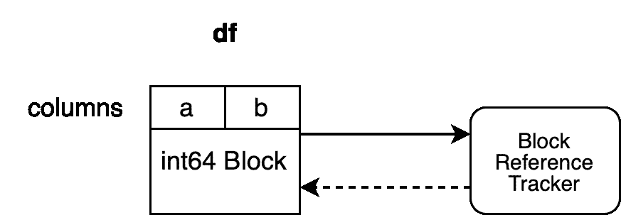
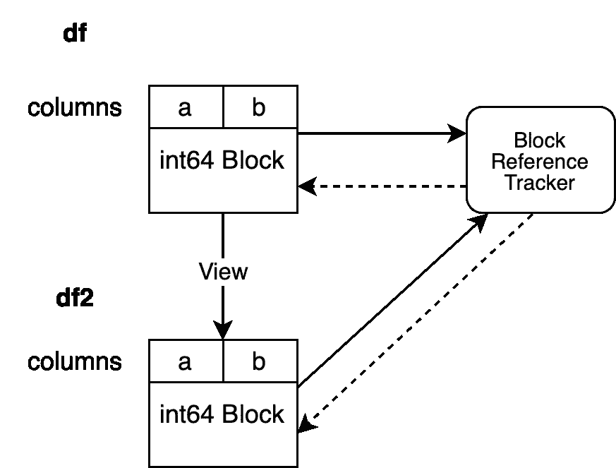
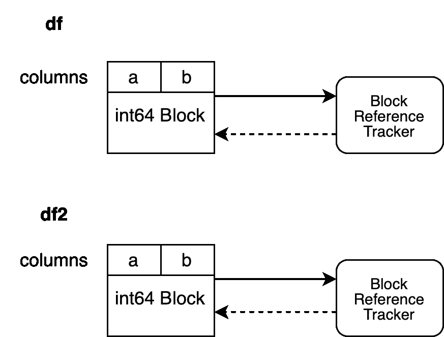
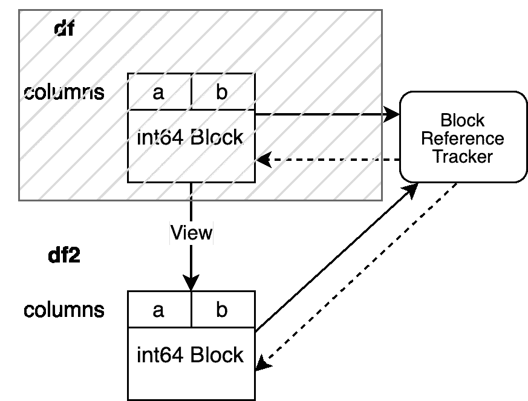
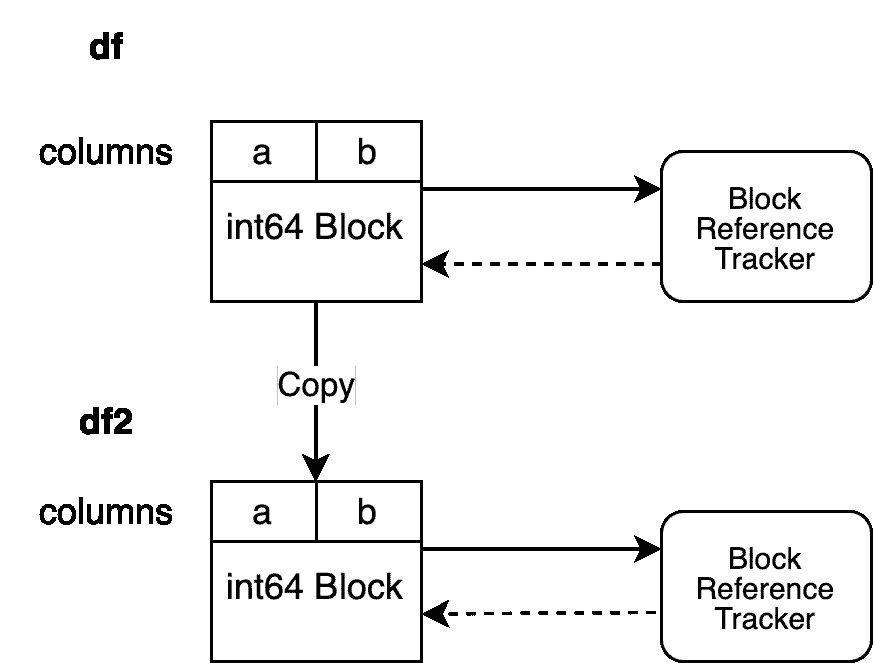

# 深入探讨 pandas Copy-on-Write 模式：第一部分

> 原文：[`towardsdatascience.com/deep-dive-into-pandas-copy-on-write-mode-part-i-26982e7408c6?source=collection_archive---------5-----------------------#2023-08-09`](https://towardsdatascience.com/deep-dive-into-pandas-copy-on-write-mode-part-i-26982e7408c6?source=collection_archive---------5-----------------------#2023-08-09)

## *解释 Copy-on-Write 内部是如何工作的*

[](https://medium.com/@patrick_hoefler?source=post_page-----26982e7408c6--------------------------------)[](https://towardsdatascience.com/?source=post_page-----26982e7408c6--------------------------------) [Patrick Hoefler](https://medium.com/@patrick_hoefler?source=post_page-----26982e7408c6--------------------------------)

·

[关注](https://medium.com/m/signin?actionUrl=https%3A%2F%2Fmedium.com%2F_%2Fsubscribe%2Fuser%2F103b3417e0f5&operation=register&redirect=https%3A%2F%2Ftowardsdatascience.com%2Fdeep-dive-into-pandas-copy-on-write-mode-part-i-26982e7408c6&user=Patrick+Hoefler&userId=103b3417e0f5&source=post_page-103b3417e0f5----26982e7408c6---------------------post_header-----------) 发表在 [Towards Data Science](https://towardsdatascience.com/?source=post_page-----26982e7408c6--------------------------------) ·8 分钟阅读·2023 年 8 月 9 日[](https://medium.com/m/signin?actionUrl=https%3A%2F%2Fmedium.com%2F_%2Fvote%2Ftowards-data-science%2F26982e7408c6&operation=register&redirect=https%3A%2F%2Ftowardsdatascience.com%2Fdeep-dive-into-pandas-copy-on-write-mode-part-i-26982e7408c6&user=Patrick+Hoefler&userId=103b3417e0f5&source=-----26982e7408c6---------------------clap_footer-----------)

--

[](https://medium.com/m/signin?actionUrl=https%3A%2F%2Fmedium.com%2F_%2Fbookmark%2Fp%2F26982e7408c6&operation=register&redirect=https%3A%2F%2Ftowardsdatascience.com%2Fdeep-dive-into-pandas-copy-on-write-mode-part-i-26982e7408c6&source=-----26982e7408c6---------------------bookmark_footer-----------)

照片由 [Clint Adair](https://unsplash.com/@clintadair?utm_source=unsplash&utm_medium=referral&utm_content=creditCopyText) 在 [Unsplash](https://unsplash.com/photos/BW0vK-FA3eg?utm_source=unsplash&utm_medium=referral&utm_content=creditCopyText) 提供

## 介绍

[pandas 2.0](https://medium.com/gitconnected/welcoming-pandas-2-0-194094e4275b)于四月初发布，并带来了许多对新 Copy-on-Write (CoW) 模式的改进。该功能预计将成为 pandas 3.0 的默认模式，计划于 2024 年四月发布。目前没有遗留或非 CoW 模式的计划。

这一系列文章将解释 Copy-on-Write 如何在内部工作，以帮助用户了解发生了什么，展示如何有效使用它，并说明如何调整你的代码。这将包括如何利用机制以获得最有效的性能的示例，同时展示一些会导致不必要瓶颈的反模式。我几个月前写了一篇[简短的介绍](https://medium.com/towards-data-science/a-solution-for-inconsistencies-in-indexing-operations-in-pandas-b76e10719744) 介绍 Copy-on-Write。

我写了[一篇简短的文章](https://medium.com/better-programming/pandas-internals-explained-545f14a941c1)，解释了 pandas 的数据结构，这将帮助你理解 CoW 所需的一些术语。

我是 pandas 核心团队的一员，至今参与了 CoW 的实施和改进。我是[Coiled](https://www.coiled.io)的开源工程师，负责 Dask，包括改进 pandas 集成并确保 Dask 符合 CoW 标准。

# Copy-on-Write 如何改变 pandas 行为

你们中的许多人可能已经熟悉 pandas 中的以下注意事项：

```py
import pandas as pd

df = pd.DataFrame({"student_id": [1, 2, 3], "grade": ["A", "C", "D"]})
```

让我们选择 grade 列并用 `"E"` 覆盖第一行。

```py
grades = df["grade"]
grades.iloc[0] = "E"
df

   student_id grade
0           1     E
1           2     C
2           3     D
```

不幸的是，这也更新了`df`而不仅仅是`grades`，这可能会引入难以发现的错误。CoW 将不允许这种行为，并确保仅更新`grades`。我们还看到一个无用的`SettingWithCopyWarning`，对我们没有帮助。

让我们看一个`ChainedIndexing`的示例，这个示例没有做任何事情：

```py
df[df["student_id"] > 2]["grades"] = "F"
df

   student_id grade
0           1     A
1           2     C
2           3     D
```

我们再次得到`SettingWithCopyWarning`，但在这个示例中`df` 没有发生任何变化。所有这些问题都归结于 NumPy 中的复制和视图规则，这是 pandas 在底层使用的。pandas 用户必须了解这些规则以及它们如何应用于 pandas DataFrame，以理解类似的代码模式为何会产生不同的结果。

**CoW 清理了所有这些不一致性**。启用 CoW 时，用户只能一次更新一个对象，例如，在第一个示例中，`df` 将保持不变，因为那时只更新了`grades`，而第二个示例会引发`ChainedAssignmentError`，而不是什么都不做。一般来说，不可能一次更新两个对象，例如，每个对象的行为都像是前一个对象的副本。

还有更多这样的情况，但在这里讨论所有这些超出了范围。

# 如何工作

让我们更详细地探讨 Copy-on-Write，并突出一些值得了解的事实。这是本文的主要部分，相当技术性。

Copy-on-Write 承诺**任何从其他 DataFrame 或 Series 派生的** **对象始终表现为副本**。这意味着不可能通过单个操作修改多个对象，例如我们上面的第一个示例仅会修改`grades`。

为了保证这一点，采取非常防御性的方式是每次操作时复制 DataFrame 及其数据，这样可以完全避免 pandas 中的视图。这将保证 CoW 语义，但也会带来巨大的性能损失，因此这不是一个可行的选项。

我们现在将深入了解确保不会有两个对象通过单次操作更新 **且** 我们的数据不会不必要地被复制的机制。第二部分是使实现变得有趣的部分。

我们必须准确知道何时触发复制，以避免不必要的复制。只有在尝试改变一个 pandas 对象的值而不复制其数据时，潜在的复制才是必要的。如果这个对象的数据与另一个 pandas 对象共享，我们必须触发一个复制。这意味着我们必须跟踪是否一个 NumPy 数组被两个 DataFrame 引用（通常，我们需要知道一个 NumPy 数组是否被两个 pandas 对象引用，但为了简单起见，我将使用 DataFrame 这个术语）。

```py
df = pd.DataFrame({"student_id": [1, 2, 3], "grade": [1, 2, 3]})
df2 = df[:]
```

这个语句创建了一个 DataFrame `df` 和这个 DataFrame `df2` 的视图。视图意味着这两个 DataFrame 是由相同的底层 NumPy 数组支撑的。当我们用 CoW 看待这个问题时，`df` 必须知道 `df2` 也引用了它的 NumPy 数组。但这还不够。`df2` 也必须知道 `df` 引用了它的 NumPy 数组。如果两个对象都知道另一个 DataFrame 引用相同的 NumPy 数组，我们可以在其中一个被修改时触发一个复制，例如：

```py
df.iloc[0, 0] = 100
```

`df` 在这里被就地修改。`df` 知道有另一个对象引用相同的数据，例如，它触发了一个复制。它不知道哪个对象引用相同的数据，只是知道外面有另一个对象。

让我们看看如何实现这一点。我们创建了一个内部类 `BlockValuesRefs`，用于存储这些信息，它指向所有引用给定 NumPy 数组的 DataFrames。

创建 DataFrame 可以通过三种不同类型的操作：

+   DataFrame 是从外部数据创建的，例如通过 `pd.DataFrame(...)` 或通过任何 I/O 方法。

+   通过一个 pandas 操作创建一个新的 DataFrame，这个操作会触发对原始数据的复制，例如 `dropna` 在几乎所有情况下都会创建一个复制。

+   通过一个 pandas 操作创建一个新的 DataFrame，这个操作 **不会** 触发对原始数据的复制，例如 `df2 = df.reset_index()`。

前两个案例很简单。当创建 DataFrame 时，支撑它的 NumPy 数组会连接到一个新的 `BlockValuesRefs` 对象。这些数组仅被新对象引用，因此我们不必跟踪任何其他对象。该对象创建一个 `weakref`，指向包裹 NumPy 数组的 `Block` 并在内部存储这个引用。Blocks 的概念在[这里](https://medium.com/better-programming/pandas-internals-explained-545f14a941c1)进行了解释。

> [weakref](https://docs.python.org/3/library/weakref.html)创建对任何 Python 对象的引用。它不会在对象通常超出作用域时保持该对象存活。

```py
import weakref

class Dummy:
    def __init__(self, a):
        self.a = a

In[1]: obj = Dummy(1)
In[2]: ref = weakref.ref(obj)
In[3]: ref()
Out[3]: <__main__.Dummy object at 0x108187d60>
In[4]: obj = Dummy(2)
```

> 这个示例创建了一个 Dummy 对象及其弱引用。随后，我们将另一个对象赋给相同的变量，例如初始对象超出作用域并被垃圾回收。弱引用不会干扰这一过程。如果你解析弱引用，它将指向`None`而不是原始对象。

```py
In[5]: ref()
Out[5]: None
```

> 这确保了我们不会保留任何本应被垃圾回收的数组。

让我们来看看这些对象是如何组织的：



作者提供的图片

我们的示例有两列`"a"`和`"b"`，它们的 dtype 都是`"int64"`。它们由一个 Block 支持，该 Block 保存这两列的数据。Block 持有对引用跟踪对象的硬引用，确保只要 Block 没有被垃圾回收，它就会保持活跃。引用跟踪对象持有对 Block 的弱引用。这使得该对象能够跟踪此 Block 的生命周期，但不会阻止垃圾回收。引用跟踪对象尚未持有对任何其他 Block 的弱引用。

这些是简单的场景。我们知道没有其他 pandas 对象共享相同的 NumPy 数组，因此我们可以简单地实例化一个新的引用跟踪对象。

第三种情况更复杂。新对象查看的数据与原始对象相同。这意味着两个对象指向相同的内存。我们的操作将创建一个新的 Block，该 Block 引用相同的 NumPy 数组，这称为浅拷贝。我们现在必须在我们的引用跟踪机制中注册这个新的`Block`。我们将使用与旧对象连接的引用跟踪对象来注册我们的新`Block`。

```py
df2 = df.reset_index(drop=True)
```



作者提供的图片

我们的`BlockValuesRefs`现在指向支持初始`df`的 Block 和支持`df2`的新增 Block。这确保了我们始终了解所有指向相同内存的 DataFrame。

我们现在可以询问引用跟踪对象有多少个指向相同 NumPy 数组的 Block 仍然存在。引用跟踪对象评估弱引用，并告诉我们有多个对象引用相同的数据。这使我们能够在其中一个对象在原地修改时内部触发复制。

```py
df2.iloc[0, 0] = 100
```

`df2`中的 Block 通过深拷贝进行复制，创建了一个新的 Block，该 Block 拥有自己的数据和引用跟踪对象。原始的 Block 现在可以被垃圾回收，这确保了`df`和`df2`所支持的数组不会共享任何内存。



作者提供的图片

让我们看一个不同的场景。

```py
df = None
df2.iloc[0, 0] = 100
```

在我们修改`df2`之前，`df`已被失效。因此，我们引用跟踪对象的弱引用，指向支持`df`的 Block，评估结果为`None`。这使我们能够在不触发复制的情况下修改`df2`。



作者提供的图像

我们的引用跟踪对象仅指向一个 DataFrame，这使我们能够在不触发复制的情况下进行就地操作。

上述`reset_index`创建了一个视图。如果我们有一个内部触发复制的操作，机制会简单一些。

```py
df2 = df.copy()
```

这立即为我们的 DataFrame `df2` 实例化了一个新的引用跟踪对象。



作者提供的图像

## 结论

我们已经研究了 Copy-on-Write 跟踪机制是如何工作的以及何时触发复制。该机制尽可能推迟 pandas 中的复制，这与非 CoW 行为有很大不同。引用跟踪机制跟踪所有共享内存的 DataFrame，从而在 pandas 中实现更一致的行为。

本系列的下一部分将解释用于提高此机制效率的技术。

感谢阅读。如有意见和反馈，请随时联系以分享您对 Copy-on-Write 的看法。
