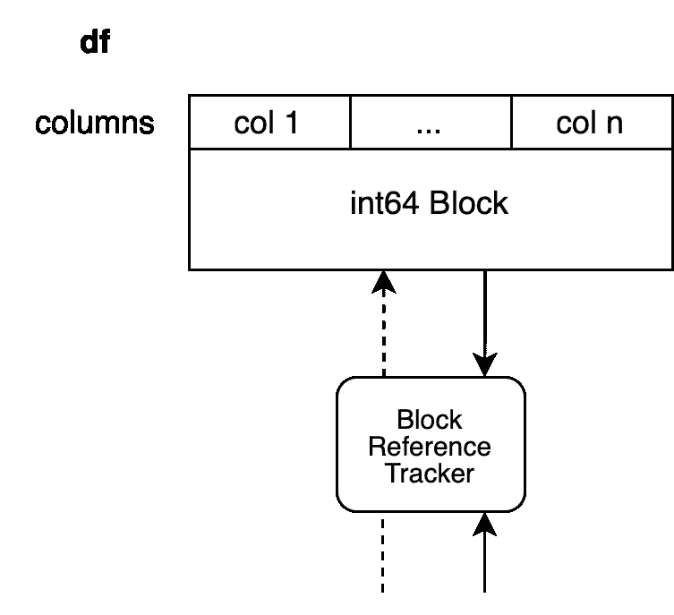
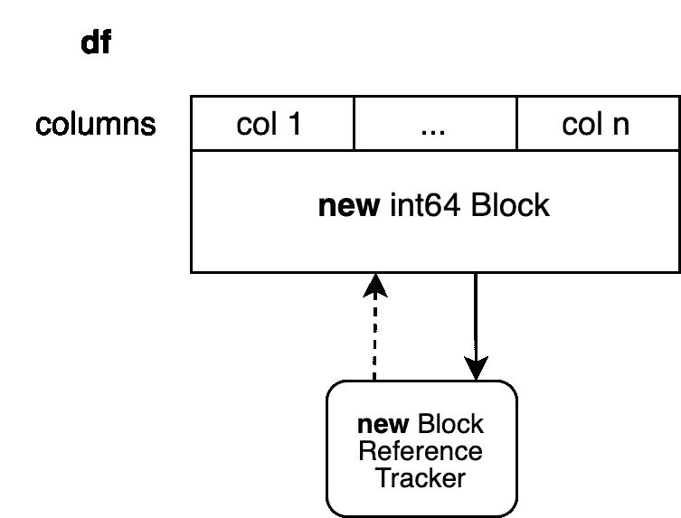
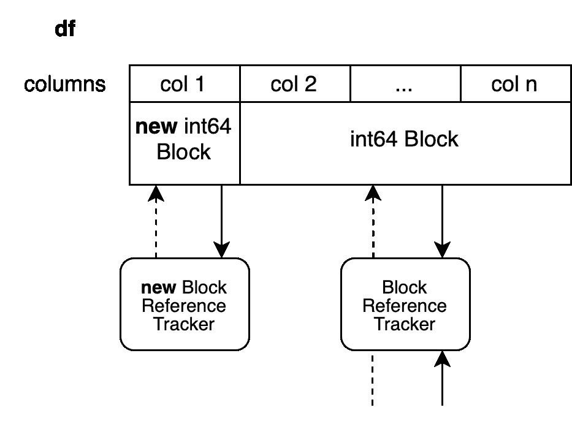
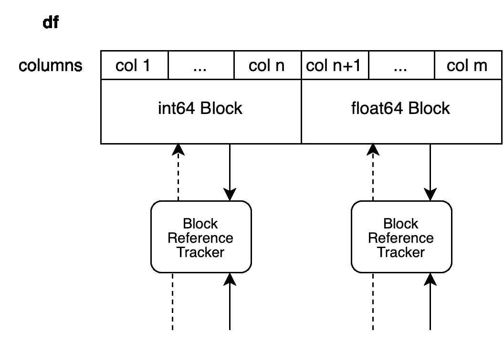
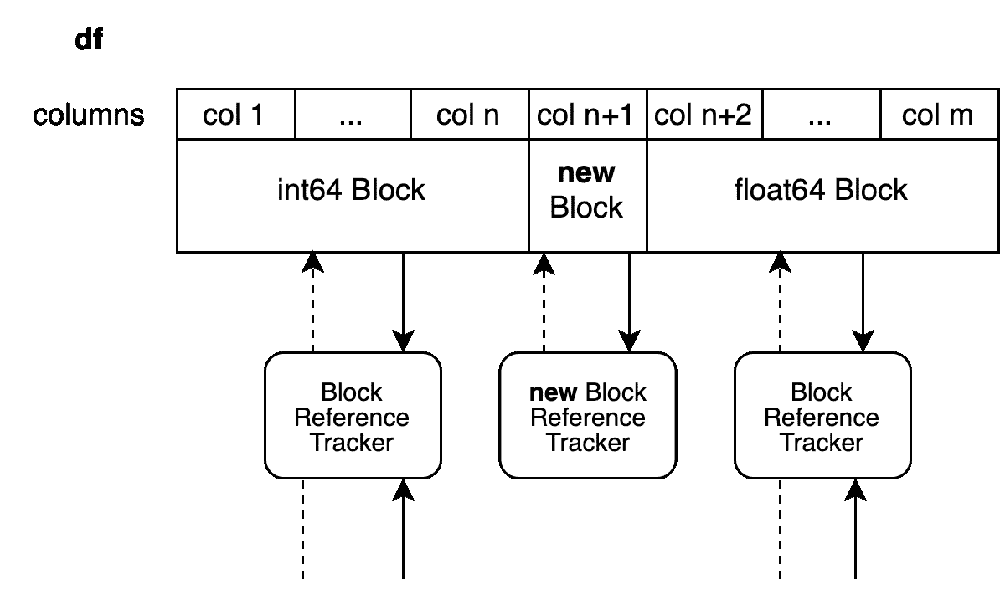

# 深入探讨 pandas Copy-on-Write 模式—第 II 部分

> 原文：[`towardsdatascience.com/deep-dive-into-pandas-copy-on-write-mode-part-ii-b023432a5334?source=collection_archive---------6-----------------------#2023-08-17`](https://towardsdatascience.com/deep-dive-into-pandas-copy-on-write-mode-part-ii-b023432a5334?source=collection_archive---------6-----------------------#2023-08-17)

## *解释 Copy-on-Write 如何优化性能*

[](https://medium.com/@patrick_hoefler?source=post_page-----b023432a5334--------------------------------)[](https://towardsdatascience.com/?source=post_page-----b023432a5334--------------------------------) [Patrick Hoefler](https://medium.com/@patrick_hoefler?source=post_page-----b023432a5334--------------------------------)

·

[跟进](https://medium.com/m/signin?actionUrl=https%3A%2F%2Fmedium.com%2F_%2Fsubscribe%2Fuser%2F103b3417e0f5&operation=register&redirect=https%3A%2F%2Ftowardsdatascience.com%2Fdeep-dive-into-pandas-copy-on-write-mode-part-ii-b023432a5334&user=Patrick+Hoefler&userId=103b3417e0f5&source=post_page-103b3417e0f5----b023432a5334---------------------post_header-----------) 发表在 [Towards Data Science](https://towardsdatascience.com/?source=post_page-----b023432a5334--------------------------------) ·6 分钟阅读·2023 年 8 月 17 日

--

[](https://medium.com/m/signin?actionUrl=https%3A%2F%2Fmedium.com%2F_%2Fbookmark%2Fp%2Fb023432a5334&operation=register&redirect=https%3A%2F%2Ftowardsdatascience.com%2Fdeep-dive-into-pandas-copy-on-write-mode-part-ii-b023432a5334&source=-----b023432a5334---------------------bookmark_footer-----------)

照片由 [Joshua Brown](https://unsplash.com/@joshbrown?utm_source=unsplash&utm_medium=referral&utm_content=creditCopyText) 拍摄于 [Unsplash](https://unsplash.com/photos/73YJpOGgi4E?utm_source=unsplash&utm_medium=referral&utm_content=creditCopyText)

## 介绍

第一篇文章 [first post](https://medium.com/towards-data-science/deep-dive-into-pandas-copy-on-write-mode-part-i-26982e7408c6) 解释了 Copy-on-Write 机制的工作原理。它重点介绍了在工作流程中引入副本的一些领域。本文将专注于确保这些优化不会减慢平均工作流程的优化。

我们利用了 pandas 内部使用的一种技术，以避免在不必要时复制整个 DataFrame，从而提高性能。

我是 pandas 核心团队的一员，并且在实现和改进 CoW 方面参与了很多。我是 [Coiled](https://www.coiled.io) 的开源工程师，主要负责 Dask 的相关工作，包括改进 pandas 集成，并确保 Dask 符合 CoW 标准。

## 防御性复制的移除

从最具影响力的改进开始。许多 pandas 方法进行防御性复制以避免副作用，从而保护后续的就地修改。

```py
df = pd.DataFrame({"a": [1, 2, 3], "b": [4, 5, 6]})
df2 = df.reset_index()
df2.iloc[0, 0] = 100
```

在 `reset_index` 中不需要复制数据，但返回视图在修改结果时会引入副作用，例如 `df` 也会被更新。因此，在 `reset_index` 中执行了防御性复制。

启用 Copy-on-Write 后，这些防御性复制将不再存在。这影响了许多方法。完整列表可以在[这里](https://pandas.pydata.org/docs/user_guide/copy_on_write.html#copy-on-write-optimizations)找到。

此外，选择 DataFrame 的列子集现在总是返回视图，而不是像之前那样返回复制。

让我们看看当我们结合这些方法时，性能方面会有什么变化：

```py
import pandas as pd
import numpy as np

N = 2_000_000
int_df = pd.DataFrame(
    np.random.randint(1, 100, (N, 10)), 
    columns=[f"col_{i}" for i in range(10)],
)
float_df = pd.DataFrame(
    np.random.random((N, 10)), 
    columns=[f"col_{i}" for i in range(10, 20)],
)
str_df = pd.DataFrame(
    "a", 
    index=range(N), 
    columns=[f"col_{i}" for i in range(20, 30)],
)

df = pd.concat([int_df, float_df, str_df], axis=1)
```

这会创建一个具有 30 列、3 种不同数据类型和 200 万行的 DataFrame。让我们在这个 DataFrame 上执行以下方法链：

```py
%%timeit
(
    df.rename(columns={"col_1": "new_index"})
    .assign(sum_val=df["col_1"] + df["col_2"])
    .drop(columns=["col_10", "col_20"])
    .astype({"col_5": "int32"})
    .reset_index()
    .set_index("new_index")
)
```

启用 CoW 前，所有这些方法都会执行防御性复制。

**没有 CoW 的性能：**

```py
2.45 s ± 293 ms per loop (mean ± std. dev. of 7 runs, 1 loop each)
```

**启用 CoW 的性能：**

```py
13.7 ms ± 286 µs per loop (mean ± std. dev. of 7 runs, 100 loops each)
```

大约提升了 200 倍。我特意选择了这个例子来说明 CoW 的潜在好处，并不是每个方法的速度都会提升这么多。

## 优化因就地修改触发的复制

上一部分展示了许多方法在不再需要防御性复制的情况下。CoW 保证你不能同时修改两个对象。这意味着当两个 DataFrame 参考相同数据时，我们必须引入复制。让我们来看看如何使这些复制尽可能高效。

上一篇文章展示了以下情况可能会触发复制：

```py
df.iloc[0, 0] = 100
```

如果 `df` 的数据被另一个 DataFrame 参考，则会触发复制。我们假设我们的 DataFrame 有 `n` 个整数列，例如由一个 Block 支持。



作者提供的图片

我们的参考跟踪对象也引用了另一个 Block，因此我们不能在不修改其他对象的情况下就地修改 DataFrame。一个简单的方法是复制整个块然后完成。



作者提供的图片

这将设置一个新的引用跟踪对象，并创建一个由新的 NumPy 数组支持的新块。这个块没有任何其他引用，因此另一个操作将能够再次原地修改它。这种方法复制了`n-1`列，而我们不一定需要复制这些列。我们利用一种称为块拆分的技术来避免这种情况。



图片由作者提供

内部只复制了第一列。所有其他列都作为对先前数组的视图。新块与其他列没有共享引用。旧块仍与其他对象共享引用，因为它只是对先前值的视图。

这种技术有一个缺点。初始数组有`n`列。我们创建了从列`2`到`n`的视图，但这会保持整个数组的存在。我们还添加了一个只有一列的新数组用于第一列。这将比必要时多占用一点内存。

这个系统直接转换为具有不同数据类型的 DataFrames。所有未被修改的块会原样返回，只有被原地修改的块才会被拆分。



图片由作者提供

我们现在在列`n+1`的浮点块中设置一个新值，以创建对列`n+2`到`m`的视图。新块将只支持列`n+1`。

```py
df.iloc[0, n+1] = 100.5
```



图片由作者提供

## 可以原地操作的方法

我们查看的索引操作通常不会创建新对象；它们会原地修改现有对象，包括该对象的数据。另一组 pandas 方法则完全不涉及 DataFrame 的数据。一个显著的例子是`rename`。Rename 只会更改标签。这些方法可以利用上述提到的惰性复制机制。

还有第三组方法实际上可以原地操作，如`replace`或`fillna`。这些方法将始终触发复制。

```py
df2 = df.replace(...)
```

修改数据时如果不触发复制，则会修改`df`和`df2`，这违反了 CoW 规则。这是我们考虑保留这些方法的`inplace`关键字的原因之一。

```py
df.replace(..., inplace=True)
```

这将解决这个问题。这仍然是一个开放提案，可能会朝不同的方向发展。也就是说，这仅涉及实际被更改的列；所有其他列仍然以视图形式返回。这意味着，如果你的值只出现在一列中，则只会复制一列。

## 结论

我们研究了 CoW 如何改变 pandas 的内部行为，以及这将如何转化为代码的改进。许多方法在使用 CoW 时会变得更快，而我们会看到一些与索引相关的操作变慢。以前，这些操作总是原地进行的，这可能产生副作用。这些副作用在 CoW 中消失了，对一个 DataFrame 对象的修改将永远不会影响另一个对象。

本系列的下一篇文章将解释如何更新你的代码以符合 CoW 标准。此外，我们还将说明未来应该避免哪些模式。

感谢阅读。如有任何关于写时复制（Copy-on-Write）的想法和反馈，请随时联系我们。
