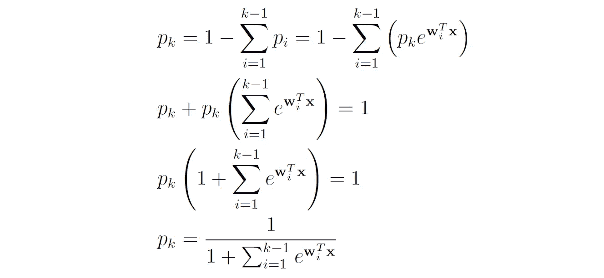
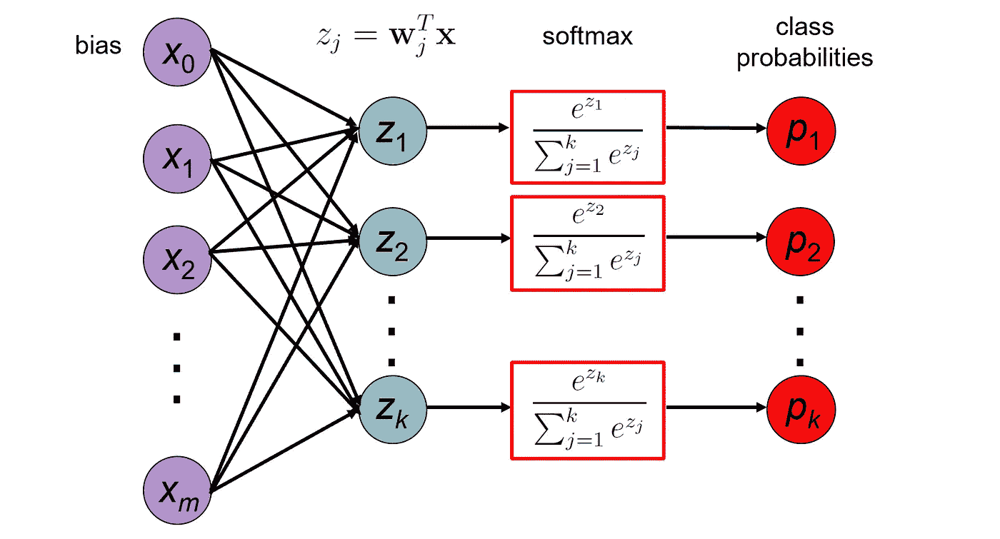
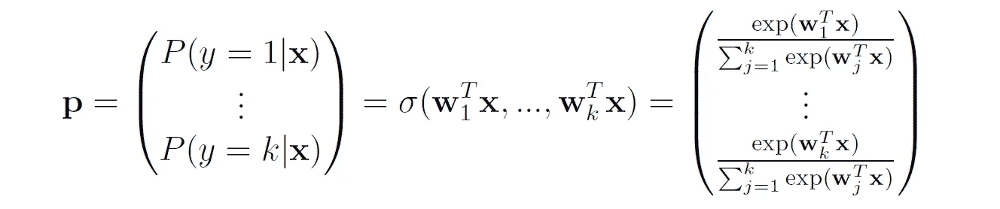
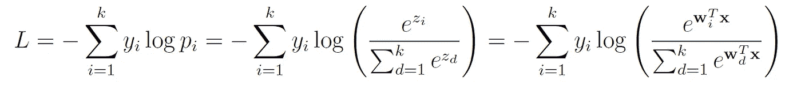
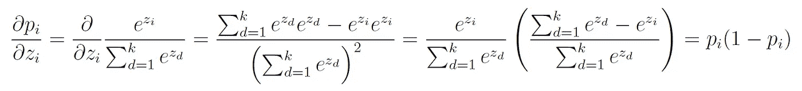
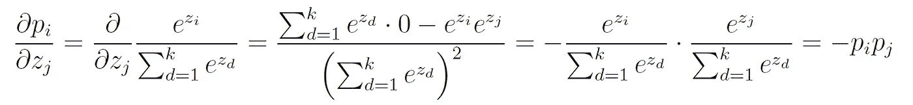
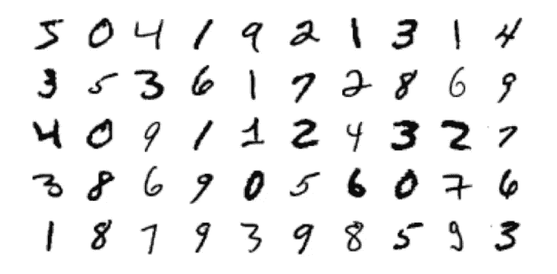
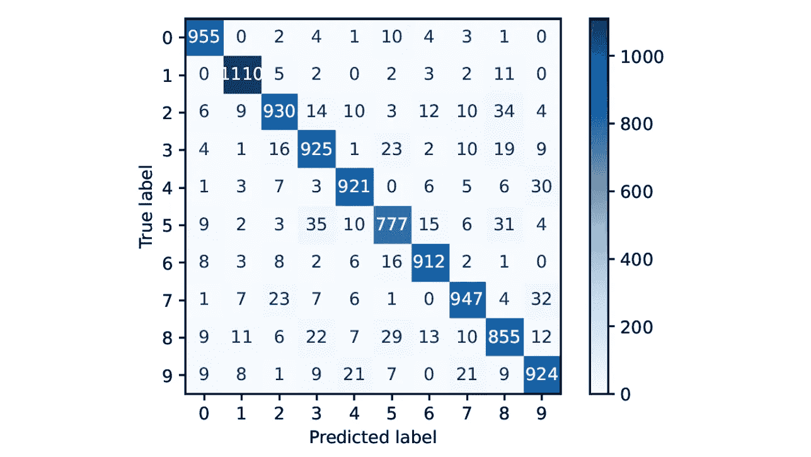
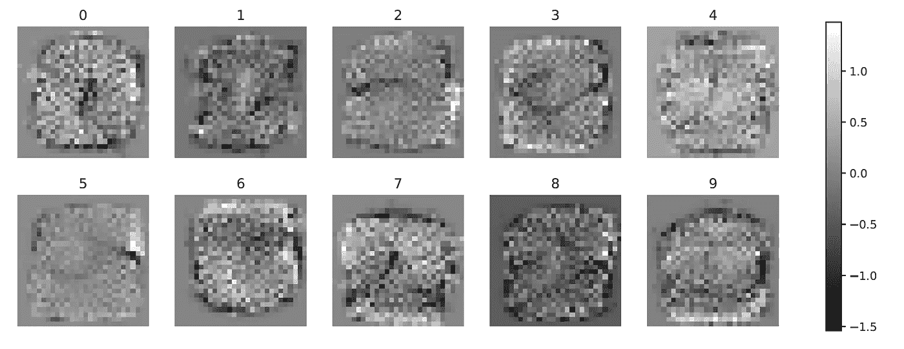

# 深入研究 Softmax 回归

> 原文：[`towardsdatascience.com/deep-dive-into-softmax-regression-62deea103cb8`](https://towardsdatascience.com/deep-dive-into-softmax-regression-62deea103cb8)

## 理解 softmax 回归背后的数学原理以及如何用它解决图像分类任务

[](https://medium.com/@roiyeho?source=post_page-----62deea103cb8--------------------------------)[](https://towardsdatascience.com/?source=post_page-----62deea103cb8--------------------------------) [Roi Yehoshua 博士](https://medium.com/@roiyeho?source=post_page-----62deea103cb8--------------------------------)

·发表于 [Towards Data Science](https://towardsdatascience.com/?source=post_page-----62deea103cb8--------------------------------) ·阅读时间 13 分钟·2023 年 5 月 25 日

--

Softmax 回归（或**多项式逻辑回归**）是逻辑回归在多类问题上的一种推广。

它可以用来预测某个事件不同可能结果的概率，例如，根据患者的特征（性别、年龄、血压、各种测试结果等），预测患者是否会患上某种特定疾病。

在这篇文章中，我们将从基本原理推导 softmax 回归模型，并展示如何用它解决图像分类任务。

在阅读这篇文章之前，我强烈推荐你阅读我之前关于逻辑回归的文章：

[](/mastering-logistic-regression-3e502686f0ae?source=post_page-----62deea103cb8--------------------------------) ## 精通逻辑回归

### 从理论到 Python 实现

towardsdatascience.com

# 背景：多类分类问题

回顾一下，在[监督式机器学习](https://medium.com/@roiyeho/introduction-to-supervised-machine-learning-313730eb5aa2)问题中，我们给定一个包含*n*个标记样本的训练集：*D* = {(**x**₁, *y*₁), (**x**₂, *y*₂), … , (**x***ₙ, yₙ*)}，其中**x***ᵢ* 是一个*m*维向量，包含了样本*i* 的**特征**，而 *yᵢ* 表示该样本的**标签**。我们的目标是构建一个模型，使其预测尽可能接近真实标签。

在**多类分类问题**中，目标标签可以是 *k* 个类别中的任何一个，即 *y* ∈ {1, …, *k*}。例如，在手写数字识别任务中，*k* = 10，因为有 10 个可能的数字（0–9）。

如同在二分类问题中，我们区分两种分类器：

1.  **确定性分类器**为每个样本输出一个**硬标签**，而不提供类别的概率估计。此类分类器的示例包括 [K-近邻](https://medium.com/@roiyeho/k-nearest-neighbors-knn-a-comprehensive-guide-7add717806ad)、[决策树](https://medium.com/@roiyeho/decision-trees-part-1-da4e613d2369) 和 SVM。

1.  **概率分类器**输出 *k* 个类别的概率估计，然后基于这些概率分配标签（通常是概率最高的类别的标签）。此类分类器的示例包括 softmax 回归，[朴素贝叶斯分类器](https://medium.com/towards-data-science/naive-bayes-classification-41d1fe802a1e) 和在输出层使用 softmax 的 [神经网络](https://medium.com/towards-data-science/multi-layer-perceptrons-8d76972afa2b)。

# Softmax 回归模型

给定一个样本（**x**，*y*），softmax 回归模型输出一个概率向量 **p** = (*p*₁, …, *pₖ*)*ᵗ*，其中 *pᵢ* 表示样本属于类别 *i:* 的概率。


向量中的概率之和必须为 1：


在（二分类）逻辑回归中，我们假设 **对数几率**（*p* 和 1 − *p* 之间的比率的对数）是输入特征（向量 **x**）的线性组合。

在 softmax 回归中，我们选择一个概率作为参考（假设为 *pₖ*），并假设每个概率 *pᵢ* 和 *pₖ* 之间的对数几率比是输入特征的线性组合。

换句话说，我们可以将 *pᵢ* 和 *pₖ* 之间的对数几率表示为某个权重向量**w***ᵢ* 和特征向量**x**的点积：


对数几率作为特征的线性组合

请注意，在 softmax 回归中，我们为每个类别 *i* 拥有一个单独的参数向量 **w***ᵢ*。模型的所有参数集合通常存储在一个大小为 (*m* + 1) × *k* 的矩阵 *W* 中，通过将 **w**₁, …, **w***ₖ* 连接成列获得：


参数矩阵

通过对对数几率方程的两边取指数，我们得到：


由于所有 *k* 个概率之和为 1，我们可以写成：



我们现在可以使用 *pₖ* 的表达式来找到所有其他概率：


由于所有 *k* 个概率之和必须为 1，一旦知道了其他所有概率，概率 *pₖ* 就完全确定。因此，我们只有 *k* − 1 个可以单独识别的系数向量。这意味着我们可以任意选择 **w***ₖ* = 0 来确保 exp(**w***ₖᵗ*) = 1。这样，我们可以更紧凑地写出上述方程：


将线性函数**w***ᵗ***x** 转换为概率的函数称为**softmax**，接下来将对此进行描述。

## 软最大函数

软最大函数，*σ*(**z**):ℝ*ᵏ* → ℝ*ᵏ,* 将一个包含*k*个实数的向量**z** = (*z*₁, …, *zₖ*)*ᵗ* 转换为一个概率向量 (*σ*(*z*₁), …, *σ*(*zₖ*))*ᵗ*：


软最大函数

可以很容易地验证所有*σ*(**z**)的分量都在(0,1)范围内，并且它们的和为 1。

“softmax”这个名字源于该函数是 argmax 函数的平滑近似。例如，向量(1, 2, 6)的 softmax 大约为(0.007, 0.018, 0.976)，这几乎将所有的权重集中在向量的最大元素上。

软最大函数是**sigmoid**（逻辑）函数在多类情况中的扩展。换句话说，可以证明当只有两个类别时，softmax 变成 sigmoid 函数（留给读者作为练习）。

软最大函数也常用于[神经网络](https://medium.com/towards-data-science/multi-layer-perceptrons-8d76972afa2b)中，将网络最后一层的输出转换为概率。

以下图表总结了软最大回归模型的计算过程：



软最大回归模型

从数学角度来看，这个过程可以写作如下：



# 交叉熵损失

我们的目标是找到一组参数*W*，使得模型的预测**p** = *σ*(**w**₁*ᵗ***x**,…**, w***ₖᵗ***x**) 尽可能接近真实标签 *y*。

请注意，我们模型的输出是一个概率向量，而真实标签是一个标量。为了使它们可比，我们使用**独热编码**对标签进行编码，即，我们将每个标签*y* 转换为一个二进制向量**y** = (*y*₁, …, *yₖ*)*ᵗ*，其中 *yᵢ* = 1 表示真实类别 *i*，其他位置为 0。

损失函数用于衡量我们模型的预测与真实标签之间的差距。软最大回归中使用的损失函数称为**交叉熵损失**，这是对多类情况的对数损失的扩展。它的定义如下：


交叉熵损失

例如，假设在一个三类问题中（*k* = 3），我们有一个真实类别为第 2 类的样本（即**y** = (0, 1, 0)*ᵗ*），并且我们模型对该样本的预测是**p** = (0.3, 0.6, 0.1)*ᵗ*。那么由该样本引起的交叉熵损失是：


类似于对数损失，我们可以证明交叉熵损失是模型对数似然的负值，前提是标签是从一个[分类分布](https://en.wikipedia.org/wiki/Categorical_distribution)中抽取的（这是伯努利分布对*k*种可能结果的一种推广）。

**证明**：

给定一个数据（标签）的模型作为具有概率**p** = (*p*₁, …, *pₖ*)*ᵗ*的分类分布，则一个给定样本属于类别*i*的概率是*pᵢ*：


因此，样本的真实标签为**y**的概率是：


> 解释：如果给定样本的正确类别是 i，则 yᵢ = *1*，对于所有 j ≠ i，yⱼ = *0*。因此，P*(****y***|***p****)* = pᵢ，这就是样本属于类别 i 的概率。

因此，我们模型的对数似然是：


交叉熵损失正好是这个函数的负值。因此，最小化交叉熵损失等价于最大化模型的对数似然。

# 梯度下降

与逻辑回归一样，没有解析解可以找到最小化交叉熵损失的最佳*W*。因此，我们需要使用迭代优化方法，如梯度下降，来寻找最小损失。

幸运的是，交叉熵损失的梯度非常简单（尽管其推导并不简单……）。交叉熵损失对每个参数向量**w***ⱼ*的梯度是：


**证明**：

我们首先将交叉熵损失写成权重的显式函数：



使用链式法则，我们有：


我们从计算第一个偏导数开始。利用导数的加法规则、对数的导数规则和链式法则，我们得到：


接下来，我们使用商法则计算偏导数 ∂*pᵢ*/∂*zⱼ*（即 softmax 函数的导数）。我们区分两种情况：

+   如果*i* = *j*，则：



+   如果*i* ≠ *j*，则：



结合这两个方程，我们得到 softmax 函数的导数：


利用这一结果，我们可以完成对*L*的导数计算：


由于恰好一个*yᵢ*是 1，其他都是 0，我们可以进一步简化这个导数为：


*zⱼ*关于**w***ⱼ*的偏导数就是输入向量**x**：


（参见 [这篇文章](https://medium.com/@roiyeho/a-gentle-introduction-to-matrix-calculus-14584f2c4f60) 了解矩阵微积分的基本规则）。

因此，交叉熵损失相对于每个权重向量的导数是：


利用这些梯度，我们可以使用（随机）梯度下降来最小化给定训练集上的损失函数。

# 练习题

给定一组图像，你需要将它们分类为狗/猫和户外/室内。你应该实现两个逻辑回归分类器还是一个 softmax 回归分类器？

解决方案可以在文章末尾找到。

# Scikit-Learn 中的 softmax 回归

类别 [LogisticRegression](https://scikit-learn.org/stable/modules/generated/sklearn.linear_model.LogisticRegression.html) 可以处理二分类和多分类问题。它有一个名为 *multi_class* 的参数，默认设置为‘auto’。这个选项的意思是，当 Scikit-Learn 检测到问题是多分类且选择的求解器支持多项式损失的优化时（所有求解器都支持，除了‘liblinear’），它将自动应用 softmax 回归。

## 示例：分类手写数字

例如，我们在 [MNIST 数据集](https://en.wikipedia.org/wiki/MNIST_database) 上训练一个 softmax 回归模型，这是一个广泛使用的图像分类任务数据集。

数据集包含 60,000 张训练图像和 10,000 张手写数字测试图像。每张图像的大小为 28 × 28 像素，通常由一个范围为 [0, 255] 的 784 个数字组成。任务是将这些图像分类为十个数字（0–9）之一。

## 加载数据集

我们首先使用 [fetch_openml()](https://scikit-learn.org/stable/modules/generated/sklearn.datasets.fetch_openml.html) 函数获取 MNIST 数据集：

```py
from sklearn.datasets import fetch_openml

X, y = fetch_openml('mnist_784', return_X_y=True, as_frame=False)
```

让我们检查一下 *X* 的形状：

```py
print(X.shape)
```

```py
(70000, 784)
```

*X* 由 70,000 个向量组成，每个向量有 784 个像素。

让我们显示数据集中前 50 个数字：

```py
fig, axes = plt.subplots(5, 10, figsize=(10, 5))
i = 0
for ax in axes.flat:
    ax.imshow(X[i].reshape(28, 28), cmap='binary')
    ax.axis('off')    
    i += 1
```



MNIST 数据集中的前 50 个数字

接下来，我们将输入数据缩放到 [0, 1] 的范围，而不是 [0, 255]：

```py
X = X / 255
```

特征缩放在你使用迭代优化方法（如梯度下降）来训练模型时非常重要。

现在我们将数据分为训练集和测试集。请注意，MNIST 中的前 60,000 张图像已被指定用于训练，因此我们可以仅使用简单的切片来进行分割：

```py
train_size = 60000
X_train, y_train = X[:train_size], y[:train_size]
X_test, y_test = X[train_size:], y[train_size:]
```

## 构建模型

现在我们创建一个具有默认设置的 LogisticRegression 分类器，并将其拟合到训练集上：

```py
from sklearn.linear_model import LogisticRegression

clf = LogisticRegression()
clf.fit(X_train, y_train)
```

我们收到一条警告信息，表明已经达到最大迭代次数：

```py
ConvergenceWarning: lbfgs failed to converge (status=1):
STOP: TOTAL NO. of ITERATIONS REACHED LIMIT.

Increase the number of iterations (max_iter) or scale the data as shown in:
    https://scikit-learn.org/stable/modules/preprocessing.html
Please also refer to the documentation for alternative solver options:
    https://scikit-learn.org/stable/modules/linear_model.html#logistic-regression
  n_iter_i = _check_optimize_result(
```

让我们将 *max_iter* 增加到 1000（而不是默认的 100）：

```py
clf = LogisticRegression(max_iter=1000)
clf.fit(X_train, y_train)
```

这次学习在达到最大迭代次数之前已经收敛。我们实际上可以通过检查 *n_iter_* 属性来查看收敛所需的迭代次数：

```py
print(clf.n_iter_)
```

```py
[795]
```

学习收敛花费了 795 次迭代。

## 模型评估

模型在训练集和测试集上的准确率为：

```py
print('Training set accuracy: ', np.round(clf.score(X_train, y_train), 4))
print('Test set accuracy:' , np.round(clf.score(X_test, y_test), 4))
```

```py
Training set accuracy: 0.9393
Test set accuracy: 0.9256
```

这些结果很好，但最近的深度神经网络在这个数据集上可以取得更好的结果（测试准确率高达 99.91%）。Softmax 回归模型大致相当于一个使用 softmax 激活函数的单层感知机神经网络。因此，深度网络能够取得比我们的模型更好的结果并不令人惊讶。

为了更好地理解我们模型的错误，让我们显示其在测试集上的混淆矩阵：

```py
from sklearn.metrics import confusion_matrix, ConfusionMatrixDisplay

y_test_pred = clf.predict(X_test)
cm = confusion_matrix(y_test, y_test_pred)
disp = ConfusionMatrixDisplay(confusion_matrix=cm, display_labels=clf.classes_)
disp.plot(cmap='Blues')
```



测试集上的混淆矩阵

我们可以看到模型的主要混淆是在数字 5⇔8 和 4⇔9 之间。这是合理的，因为这些数字在手写时常常互相类似。为了帮助我们的模型区分这些数字，我们可以增加这些数字的更多示例（例如，通过数据增强）或从图像中提取额外特征（例如，数字中的闭环数量）。

我们还可以打印分类报告，以获取每个类别的精确度、召回率和 F1 分数：

```py
from sklearn.metrics import classification_report

print(classification_report(y_test, y_test_pred))
```

```py
 precision    recall  f1-score   support

           0       0.95      0.97      0.96       980
           1       0.96      0.98      0.97      1135
           2       0.93      0.90      0.91      1032
           3       0.90      0.92      0.91      1010
           4       0.94      0.94      0.94       982
           5       0.90      0.87      0.88       892
           6       0.94      0.95      0.95       958
           7       0.93      0.92      0.93      1028
           8       0.88      0.88      0.88       974
           9       0.91      0.92      0.91      1009

    accuracy                           0.93     10000
   macro avg       0.92      0.92      0.92     10000
weighted avg       0.93      0.93      0.93     10000
```

如预期，模型得分最低的数字是 5 和 8。

## 权重可视化

Softmax 回归的一个优势是高度可解释（与神经网络等“黑箱”模型不同）。每个特征相关的权重表示该特征的重要性。

例如，我们可以绘制每个数字类别中每个像素相关的权重（**w***ⱼ* 对于每个 *j* ∈ {1, …, 10}）。这将展示用于检测每个数字的图像中的重要区域。

模型的权重矩阵存储在名为 *coef_* 的属性中：

```py
print(clf.coef_.shape)
```

```py
(10, 784)
```

该矩阵的 *i* 行包含了模型对类别 *i* 的学习权重。我们可以将每一行显示为 28 × 28 像素的图像，以检查每个类别中与每个像素相关的权重：

```py
fig, axes = plt.subplots(2, 5, figsize=(15, 5))

digit = 0
for coef, ax in zip(clf.coef_, axes.flat):
    im = ax.imshow(coef.reshape(28, 28), cmap='gray')
    ax.axis('off')
    ax.set_title(str(digit))
    digit += 1

fig.colorbar(im, ax=axes.flat)
```



亮色像素对预测有正面影响，而暗色像素有负面影响。灰色级别接近 0 的像素对预测没有影响（如图像边缘附近的像素）。

# 总结

Softmax 回归与其他多类分类模型相比的优缺点是：

**优点**：

+   提供类别概率估计

+   高度可扩展，需要的参数数量与特征数量线性相关

+   高度可解释（每个特征相关的权重表示其重要性）

+   能处理冗余特征（通过将其权重分配接近 0）

**缺点**：

+   只能找到类别之间的线性决策边界

+   通常被更复杂的模型超越

+   无法处理缺失值

## 练习题的解答

由于类别之间并非完全互斥（所有四种狗/猫与户外/室内的组合都是可能的），你应该训练两个逻辑回归模型。这是一个多标签问题，一个 softmax 分类器无法处理。

## 最终说明

你可以在我的 GitHub 上找到本文的代码示例：[`github.com/roiyeho/medium/tree/main/softmax_regression`](https://github.com/roiyeho/medium/tree/main/softmax_regression)

除非另有说明，所有图像均为作者提供。

MNIST 数据集信息：

+   **引用:** Deng, L., 2012\. 用于机器学习研究的手写数字图像的 mnist 数据库。*IEEE 信号处理杂志*, 29(6), 第 141–142 页。

+   **许可:** Yann LeCun 和 Corinna Cortes 拥有 MNIST 数据集的版权，该数据集在*知识共享署名-相同方式共享 4.0 国际许可协议*下提供 ([CC BY-SA](https://creativecommons.org/licenses/by-sa/4.0/))。

感谢阅读！
