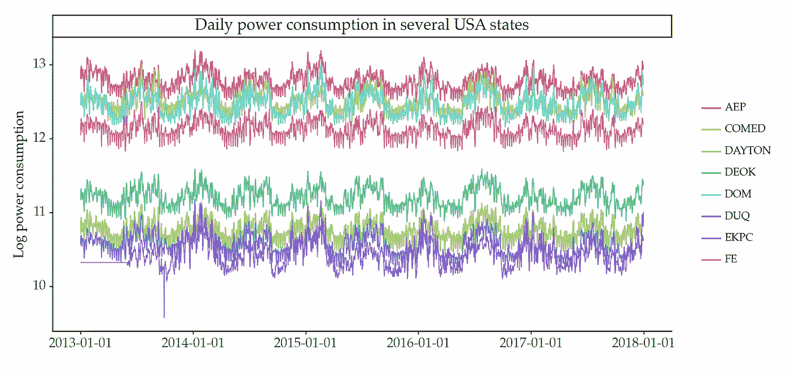
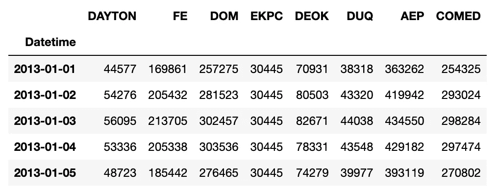
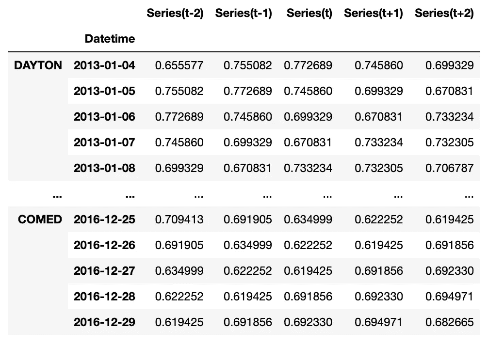

# 深度学习用于预测：数据预处理和训练

> 原文：[`towardsdatascience.com/deep-learning-for-forecasting-preprocessing-and-training-49d2198fc0e2`](https://towardsdatascience.com/deep-learning-for-forecasting-preprocessing-and-training-49d2198fc0e2)

## 如何使用多个时间序列训练深度神经网络

[](https://vcerq.medium.com/?source=post_page-----49d2198fc0e2--------------------------------)[](https://towardsdatascience.com/?source=post_page-----49d2198fc0e2--------------------------------) [Vitor Cerqueira](https://vcerq.medium.com/?source=post_page-----49d2198fc0e2--------------------------------)

·发表于[Towards Data Science](https://towardsdatascience.com/?source=post_page-----49d2198fc0e2--------------------------------) ·8 分钟阅读·2023 年 3 月 22 日

--


图片由[Tamara Malaniy](https://unsplash.com/de/@tamarushphotos?utm_source=medium&utm_medium=referral)拍摄，来源于[Unsplash](https://unsplash.com/?utm_source=medium&utm_medium=referral)

这篇文章是对[上一篇文章](https://medium.com/towards-data-science/how-to-transform-time-series-for-deep-learning-3b6abbbb3726)的后续。在那里，我们学习了如何为深度学习转换时间序列。

我们继续探索深度神经网络在预测中的应用。在这篇文章中，我们将：

+   学习如何使用深度学习训练全球预测模型，包括基本的预处理步骤；

+   探索 keras 回调函数以推动神经网络的训练过程。

# 深度学习用于预测

深度神经网络通过自回归解决预测问题。[自回归是一种建模技术，涉及使用过去的观察值来预测未来的观察值](https://medium.com/towards-data-science/machine-learning-for-forecasting-transformations-and-feature-extraction-bbbea9de0ac2)。

深度神经网络可以设计成不同的结构，如递归网络或卷积网络。递归神经网络通常更适合处理时间序列数据。除此之外，这种网络在建模长期依赖关系方面表现出色。这一特性对预测性能有着强大的影响。

这里介绍了一种特定类型的递归神经网络，称为 LSTM（长短期记忆）。注释提供了每个模型元素的简要描述。

```py
from keras.models import Sequential
from keras.layers import (Dense,
                          LSTM,
                          TimeDistributed,
                          RepeatVector,
                          Dropout)

# Number of variables in the time series. 
# 1 means the time series is univariate
N_FEATURES = 1
# Number of lags in the auto-regressive model
N_LAGS = 24
# Number of future steps to be predicted
HORIZON = 12

# 'Sequential' instance is used to create a linear stack of layers 
# ... each layer feeds into the next one.
model = Sequential()
# Adding an LSTM layer with 32 units and relu activation
model.add(LSTM(32, activation='relu', input_shape=(N_LAGS, N_FEATURES)))
# Using dropout to avoid overfitting 
model.add(Dropout(.2))
# Repeating the input vector HORIZON times to match the shape of the output.
model.add(RepeatVector(HORIZON))
# Another LSTM layer, this time with 16 units
# Also returning the output of each time step (return_sequences=True)
model.add(LSTM(16, activation='relu', return_sequences=True))
# Using dropout again with 0.2 dropout rate
model.add(Dropout(.2))
# Adding a standard fully connected neural network layer
# And distributing the layer to each time step
model.add(TimeDistributed(Dense(N_FEATURES)))

# Compiling the model using ADAM and setting the objective to minimize MSE
model.compile(optimizer='adam', loss='mse')
```

之前，我们学习了[如何转换时间序列以训练此模型](https://medium.com/towards-data-science/how-to-transform-time-series-for-deep-learning-3b6abbbb3726)。但是，有时你会有多个时间序列可用。

如何处理这些情况？

# 使用多时间序列进行深度学习

## 全球方法的兴起

预测模型通常是使用时间序列的历史数据创建的。这些模型可以被称为局部模型。相比之下，全球方法则通过汇总多个时间序列的历史数据来建立模型。

当一种称为 ES-RNN 的方法赢得 M4 竞赛——一个包含 100000 个不同时间序列的预测竞赛——时，对全球模型的兴趣激增。

## 何时以及为何使用全球模型

全球模型在涉及多个时间序列的预测问题中可以提供相当大的价值。例如，在零售领域，目标是预测多种产品的销售量。

另一个使用这种方法的动机是获得更多的数据。机器学习算法在训练集更大时表现更好。这一点在具有大量参数的方法中尤为明显，如深度神经网络。这些[已知为数据需求大](https://medium.com/towards-data-science/machine-learning-for-forecasting-size-matters-b5271ec784dc)。

全球预测模型不假设基础时间序列是相关的。也就是说，一个序列的滞后值可以用来预测另一个序列的未来值。

相反，这些技术利用来自多个时间序列的信息来估计模型的参数。在预测时间序列的未来时，模型的主要输入是该序列的过去近期滞后值。

# 实践操作

在本文的其余部分，我们将探讨如何使用多个时间序列训练深度神经网络。

## 数据

我们将使用关于美国 8 个地区电力消耗的数据集：



美国 8 个地区的日常电力消耗（对数）。数据来源于参考文献[1]。图像由作者提供。

目标是预测未来几天的电力消耗。这一问题对电力系统操作员至关重要。准确的预测有助于平衡能源的供需。

我们可以按如下方式读取数据：

```py
import pandas as pd

# https://github.com/vcerqueira/blog/tree/main/data
data = pd.read_csv('data/daily_energy_demand.csv', 
                   parse_dates=['Datetime'], 
                   index_col='Datetime')

print(data.head())
```



## 预处理步骤

在训练多个时间序列的深度神经网络时，需要应用一些预处理步骤。在这里，我们将探讨以下两种方法：

+   均值缩放

+   对数变换

可用的时间序列集可能具有不同的尺度。因此，将每个序列归一化到一个共同的值范围是很重要的。对于全球预测模型，这通常是通过将每个观测值除以相应序列的均值来完成的。

```py
from sklearn.model_selection import train_test_split

# leaving last 20% of observations for testing
train, test = train_test_split(data, test_size=0.2, shuffle=False)

# computing the average of each series in the training set
mean_by_series = train.mean()

# mean-scaling: dividing each series by its mean value
train_scaled = train / mean_by_series
test_scaled = test / mean_by_series
```

在均值缩放之后，对数变换也可以是有帮助的。

[在上一篇文章中](https://medium.com/towards-data-science/3-ways-to-deal-with-heteroskedasticity-in-time-series-831f6499e688)，我们探讨了如何通过对时间序列取对数来处理异方差性。对数变换还可以帮助避免神经网络的饱和区域。饱和发生在神经网络对不同输入变得不敏感时。这会阻碍学习过程，导致模型效果不佳。

```py
import numpy as np

class LogTransformation:

    @staticmethod
    def transform(x):
        xt = np.sign(x) * np.log(np.abs(x) + 1)

        return xt

    @staticmethod
    def inverse_transform(xt):
        x = np.sign(xt) * (np.exp(np.abs(xt)) - 1)

        return x

# log transformation
train_scaled_log = LogTransformation.transform(train_scaled)
test_scaled_log = LogTransformation.transform(test_scaled)
```

## 自回归

在预处理每个时间序列之后，我们需要将它们从序列转换为观测数据集。对于单个时间序列，你可以[查看之前的文章](https://medium.com/towards-data-science/how-to-transform-time-series-for-deep-learning-3b6abbbb3726)以了解此过程的详细信息。

对于多个时间序列，思路类似。我们为每个序列分别创建一组观测数据。然后，这些数据被连接成一个单一的数据集。

这是你可以做到的方法：

```py
# src module here: https://github.com/vcerqueira/blog/tree/main/src
from src.tde import time_delay_embedding

N_FEATURES = 1 # time series is univariate
N_LAGS = 3 # number of lags
HORIZON = 2 # forecasting horizon

# transforming time series for supervised learning
train_by_series, test_by_series = {}, {}
# iterating over each time series
for col in data:
    train_series = train_scaled_log[col]
    test_series = test_scaled_log[col]

    train_series.name = 'Series'
    test_series.name = 'Series'

    # creating observations using a sliding window method
    train_df = time_delay_embedding(train_series, n_lags=N_LAGS, horizon=HORIZON)
    test_df = time_delay_embedding(test_series, n_lags=N_LAGS, horizon=HORIZON)

    train_by_series[col] = train_df
    test_by_series[col] = test_df
```

之后，你通过按行连接的方式将每个时间序列的数据组合在一起。

```py
train_df = pd.concat(train_by_series, axis=0)

print(train_df)
```



最后，我们将目标变量与解释变量分开，[如前所述](https://medium.com/towards-data-science/how-to-transform-time-series-for-deep-learning-3b6abbbb3726)：

```py
# defining target (Y) and explanatory variables (X)
predictor_variables = train_df.columns.str.contains('\(t\-|\(t\)')
target_variables = train_df.columns.str.contains('\(t\+')
X_tr = train_df.iloc[:, predictor_variables]
Y_tr = train_df.iloc[:, target_variables]

# transforming the data from matrix into a 3-d format for deep learning
X_tr_3d = from_matrix_to_3d(X_tr)
Y_tr_3d = from_matrix_to_3d(Y_tr)

# defining the neural network
model = Sequential()
model.add(LSTM(32, activation='relu', input_shape=(N_LAGS, N_FEATURES)))
model.add(Dropout(.2))
model.add(RepeatVector(HORIZON))
model.add(LSTM(16, activation='relu', return_sequences=True))
model.add(Dropout(.2))
model.add(TimeDistributed(Dense(N_FEATURES)))
model.compile(optimizer='adam', loss='mse')

# spliting training into a development and validation set
X_train, X_valid, Y_train, Y_valid = \
    train_test_split(X_tr_3d, Y_tr_3d, test_size=.2, shuffle=False)

# training the neural network
model.fit(X_train, Y_train, validation_data=(X_valid,Y_valid), epochs=100)
```

# 使用回调函数训练深度神经网络


图片由[Jack B](https://unsplash.com/@nervum?utm_source=medium&utm_medium=referral)提供，来自[Unsplash](https://unsplash.com/?utm_source=medium&utm_medium=referral)

深度神经网络是迭代方法。它们在训练数据集上循环多次，称为周期。

在上面的例子中，我们运行了 100 个周期。但不清楚应该运行多少个周期来训练一个网络。周期太少可能导致欠拟合；周期太多则可能导致过拟合。

处理这个问题的一种方法是监控每个周期后神经网络的性能。每当模型性能提高时，你会在继续训练过程之前保存它。然后，在训练结束后，你将得到保存的最佳模型。

在 keras 中，你可以使用回调函数来处理这个过程。回调函数是一个在训练过程中执行某些操作的函数。你可以查看[keras 文档](https://keras.io/api/callbacks/)以获取完整的回调函数列表，或者学习如何编写你自己的回调函数！

用于在训练过程中保存模型的回调函数称为 ModelCheckPoint：

```py
from keras.callbacks import ModelCheckpoint

model_checkpoint = ModelCheckpoint(
    filepath='best_model_weights.h5',
    save_weights_only=True,
    monitor='val_loss',
    mode='min',
    save_best_only=True)

model = Sequential()
model.add(LSTM(32, activation='relu', input_shape=(N_LAGS, N_FEATURES)))
model.add(Dropout(.2))
model.add(RepeatVector(HORIZON))
model.add(LSTM(16, activation='relu', return_sequences=True))
model.add(Dropout(.2))
model.add(TimeDistributed(Dense(N_FEATURES)))
model.compile(optimizer='adam', loss='mse')

history = model.fit(X_train, Y_train,
                    epochs=300,
                    validation_data=(X_valid,Y_valid),
                    callbacks=[model_checkpoint])
```

另一个有趣的回调函数是[EarlyStopping](https://keras.io/api/callbacks/early_stopping/)。它可以在性能停止改善时停止训练。

## 做出预测

训练后，我们可以检索最佳模型并对测试集进行预测。

```py
# The best model weights are loaded into the model.
model.load_weights('best_model_weights.h5')

# Inference on DAYTON region
test_dayton = test_by_series['DAYTON']

# spliting target variables from explanatory ones
X_ts = test_df.iloc[:, predictor_variables]
Y_ts = test_df.iloc[:, target_variables]
X_ts_3d = from_matrix_to_3d(X_ts)

# predicting on normalized data
preds = model.predict_on_batch(X_ts_3d)
preds_df = from_3d_to_matrix(preds, Y_ts.columns)

# reverting log transformation
preds_df = LogTransformation.inverse_transform(preds_df)
# reverting mean scaling
preds_df *= mean_by_series['DAYTON']
```

# 关键要点

+   许多预测问题涉及多个时间序列，例如零售领域。在这种情况下，全球方法通常更适合构建模型；

+   在训练神经网络之前，预处理时间序列很重要。均值缩放有助于将所有序列带入一个共同的值范围。取对数可以稳定方差，避免饱和区域；

+   使用回调函数来驱动神经网络的训练过程。

感谢阅读，下次故事见！

## 参考文献

[1] [每小时能源消耗时间序列](https://www.kaggle.com/datasets/robikscube/hourly-energy-consumption?resource=download)（许可证： [CC0: 公共领域](https://creativecommons.org/publicdomain/zero/1.0/)）

[2] Hewamalage, Hansika, Christoph Bergmeir 和 Kasun Bandara. “用于时间序列预测的递归神经网络：现状与未来方向。” *国际预测学杂志* 37.1 (2021)：388–427。

[3] Slawek Smyl, Jai Ranganathan 和 Andrea Pasqua. M4 预测竞赛：介绍一种新的混合 ES-RNN 模型，2018\. URL [`eng.uber.com/`](https://eng.uber.com/) m4-forecasting-competition/。
