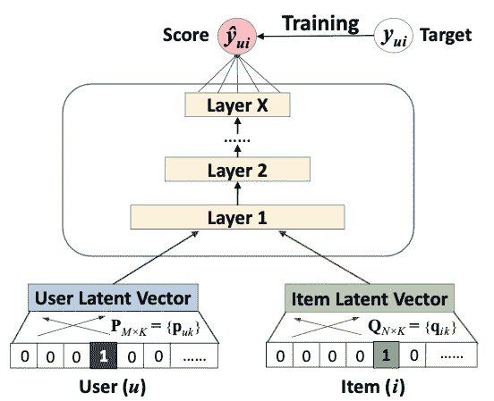
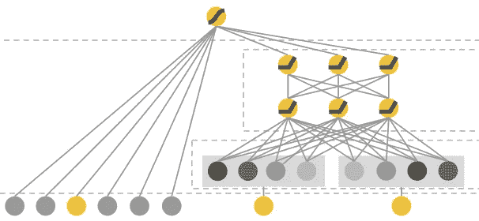
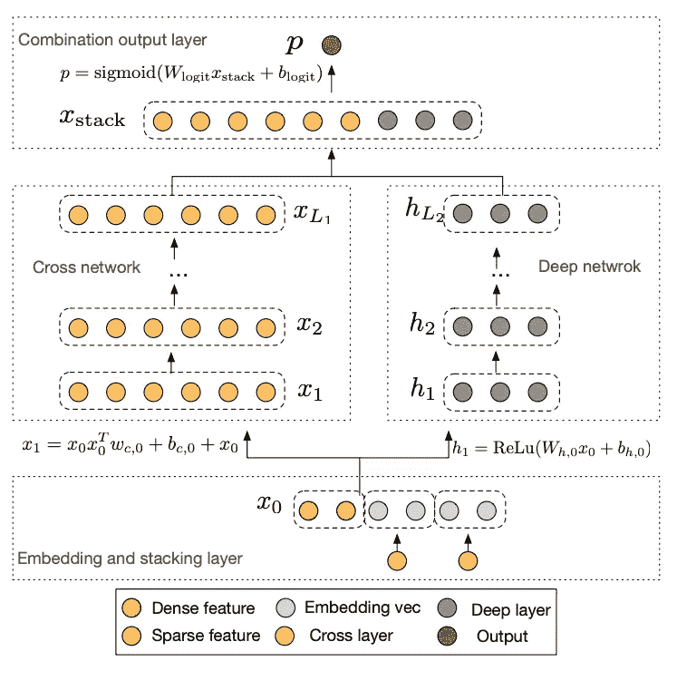
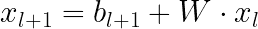
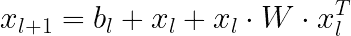
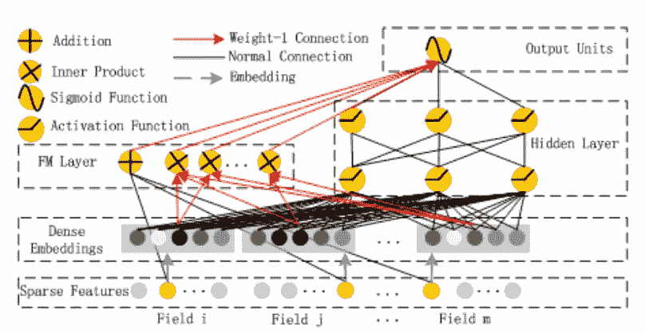
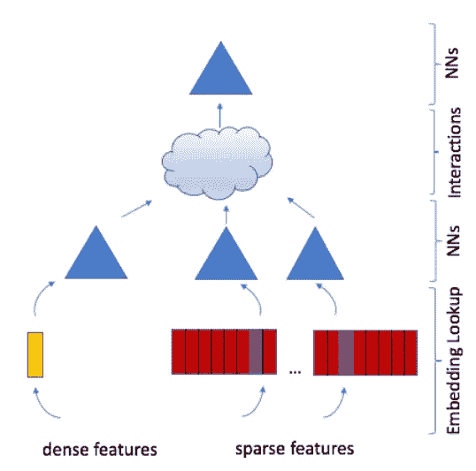
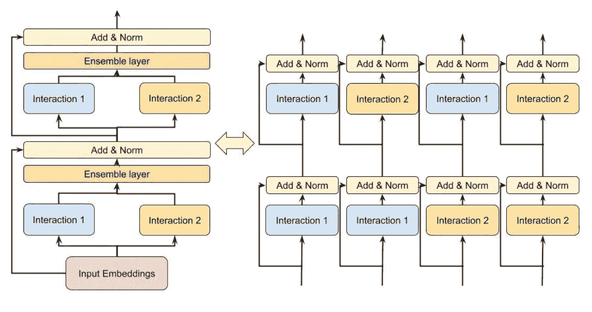
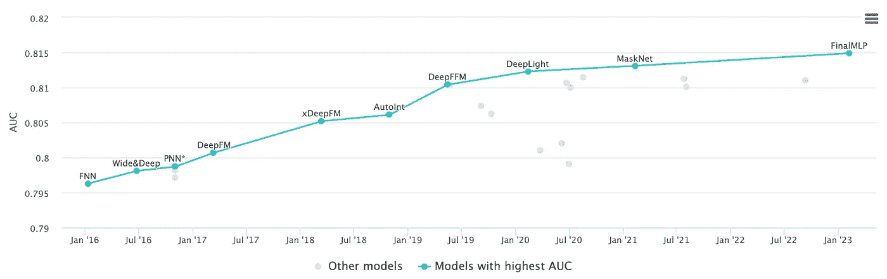

# 推荐系统中的深度学习：入门指南

> 原文：[`towardsdatascience.com/deep-learning-in-recommender-systems-a-primer-96e4b07b54ca`](https://towardsdatascience.com/deep-learning-in-recommender-systems-a-primer-96e4b07b54ca)

## 现代工业推荐系统背后最重要的技术突破概述

[](https://medium.com/@samuel.flender?source=post_page-----96e4b07b54ca--------------------------------)[](https://towardsdatascience.com/?source=post_page-----96e4b07b54ca--------------------------------) [Samuel Flender](https://medium.com/@samuel.flender?source=post_page-----96e4b07b54ca--------------------------------)

·发表于 [Towards Data Science](https://towardsdatascience.com/?source=post_page-----96e4b07b54ca--------------------------------) ·阅读时间 9 分钟·2023 年 6 月 26 日

--


图片来源：[Pixabay](https://pixabay.com/illustrations/network-cloud-computing-data-4851119/)

推荐系统是目前发展最快的工业机器学习应用之一。从商业角度来看，这并不奇怪：更好的推荐带来更多的用户。就是这么简单。

然而，基础技术远非简单。自从深度学习的兴起——由 GPU 的商品化驱动——推荐系统变得越来越复杂。

在这篇文章中，我们将回顾过去十年中一些最重要的建模突破，粗略重建标志着深度学习在推荐系统中崛起的关键点。这是一个关于技术突破、科学探索，以及跨越大陆和合作的军备竞赛的故事。

准备好吧。我们的旅程从 2017 年的新加坡开始。

# NCF（新加坡大学，2017 年）



图片来源：[He 等（2017 年）](https://arxiv.org/abs/1708.05031)

任何关于推荐系统中深度学习的讨论，如果不提到该领域最重要的突破之一——神经协作过滤（NCF），都将是不完整的。这个突破由[He 等（2017 年）](https://arxiv.org/abs/1708.05031)在新加坡大学提出。

在 NCF 之前，推荐系统的黄金标准是矩阵分解，其中我们为用户和项目学习潜在向量（也称为嵌入），然后通过计算用户向量和项目向量之间的点积来生成用户的推荐。正如我们在线性代数中所知，点积越接近 1，预测的匹配度就越高。因此，矩阵分解可以简单地被视为潜在因素的线性模型。

NCF 中的关键理念是用神经网络替代矩阵分解中的内积。在实践中，这通过首先将用户和项目的嵌入连接起来，然后将它们传递到一个具有单一任务头的多层感知器（MLP）中，任务头预测用户参与度，如点击量。然后，通过反向传播损失梯度，在模型训练期间学习 MLP 权重和嵌入权重（将 ID 映射到相应的嵌入）。

NCF 背后的假设是用户/项目的互动并非线性，如矩阵分解中假设的那样，而是非线性的。如果这一点成立，我们应该会看到随着 MLP 层数的增加，性能会有所提升。正如 He 等人发现的那样，使用 4 层，他们能够在 Movielens 和 Pinterest 基准数据集上比当时最好的矩阵分解算法高出约 5% 的命中率。

He 等人证明了深度学习在推荐系统中的巨大价值，标志着从矩阵分解到深度推荐系统的关键过渡。

# Wide & Deep (Google, 2016)



图片来源：[Cheng et al (2016)](https://arxiv.org/abs/1606.07792)

我们的行程从新加坡继续到加州的山景城。

虽然 NCF 革新了推荐系统领域，但它缺乏一个对推荐系统成功至关重要的成分：交叉特征。交叉特征的理念在 Google 的 2016 年论文 “[Wide & Deep Learning for Recommender Systems](https://arxiv.org/abs/1606.07792)” 中得到了普及。

什么是交叉特征？它是通过“交叉”两个原始特征创建的二阶特征。例如，在 Google Play Store 中，一阶特征包括所需的应用或用户安装的应用列表。这两个特征可以结合起来创建强大的交叉特征，例如

```py
AND(user_installed_app='netflix', impression_app='hulu')
```

如果用户安装了 Netflix 且所需的应用是 Hulu，则值为 1。

交叉特征也可以更为广泛，例如

```py
AND(user_installed_category='video', impression_category='music')
```

诸如此类。作者认为，添加不同粒度的交叉特征能够实现记忆（来自更细粒度的交叉）和泛化（来自较少粒度的交叉）。

Wide&Deep 的关键架构选择是同时拥有一个宽模块，这是一个直接将所有交叉特征作为输入的线性层，以及一个深度模块，本质上是一个 NCF，然后将两个模块合并为一个单一的输出任务头，从用户/应用参与度中学习。

确实，Wide&Deep 的效果非常好：作者发现通过从仅深度模型转向宽度加深度，在线应用获取的提升达到 1%。考虑到谷歌每年从 Play Store 中获得数十亿的收入，很容易看出 Wide&Deep 的影响力。

# DCN（谷歌，2017）



图片来源：[Wang et al (2017)](https://arxiv.org/pdf/1708.05123.pdf)

Wide&Deep 证明了交叉特征的重要性，但它有一个巨大的缺点：交叉特征需要手动工程，这是一项繁琐的过程，需要工程资源、基础设施和领域专长。Wide&Deep 式的交叉特征成本高昂，不具备扩展性。

进入“[深度和交叉神经网络](https://arxiv.org/pdf/1708.05123.pdf)”（DCN），这是 2017 年谷歌的一篇论文中介绍的。DCN 的核心思想是用“交叉神经网络”替代 Wide&Deep 中的宽度组件，这是一种专门学习任意高阶交叉特征的神经网络。

交叉神经网络与标准 MLP 有何不同？作为提醒，在 MLP 中，下一层的每个神经元都是前一层所有神经元的线性组合：



相比之下，在交叉神经网络中，下一层是通过形成第一层与自身的二阶组合来构建的：



因此，深度为 L 的交叉神经网络将以最高 L 次的多项式形式学习交叉特征。神经网络越深，学习的高阶交互作用也越高。

实验确实确认了 DCN 的有效性。与仅有深度组件的模型相比，DCN 在 Criteo 展示广告基准数据集上的 logloss 低了 0.1%（这被认为是统计显著的）。而且这是没有任何手动特征工程的，如同 Wide&Deep!

（如果能看到 DCN 与 Wide&Deep 之间的比较就好了。可惜的是，DCN 的作者没有找到合适的方法来手动创建 Criteo 数据集的交叉特征，因此跳过了这个比较。）

# DeepFM（华为，2017）



图片来源：[Guo et al (2017)](https://arxiv.org/abs/1703.04247)

接下来，我们的旅程将从 2017 年的谷歌转向 2017 年的华为。

华为的深度推荐解决方案“[DeepFM](https://arxiv.org/abs/1703.04247)”同样用一个专门学习交叉特征的神经网络替代了 Wide&Deep 中的手动特征工程。然而，与 DCN 不同，宽度组件不是交叉神经网络，而是所谓的 FM（“矩阵分解机”）层。

FM 层的作用是什么？它只是计算所有嵌入对的点积。例如，如果电影推荐系统使用 4 个 id 特征作为输入，比如用户 id、电影 id、演员 id 和导演 id，那么模型将学习所有这些 id 特征的嵌入，FM 层计算 6 个点积，分别对应用户-电影、用户-演员、用户-导演、电影-演员、电影-导演和演员-导演。这是矩阵分解思想的回归。然后，FM 层的输出与深度组件的输出结合，通过一个 sigmoid 激活的输出，产生模型的预测结果。

的确，正如你可能猜到的，DeepFM 已经被证明有效。作者展示了 DeepFM 在公司内部数据上比一系列竞争者（包括 Google 的 Wide&Deep）在 AUC 和 Logloss 上分别高出 0.37%和 0.42%。

# DLRM（Meta，2019）



图片来源：[Naumov et al (2019)](https://arxiv.org/abs/1906.00091)

让我们暂时搁置 Google 和华为。我们的下一站是 2019 年的 Meta。

Meta 的 DLRM（“用于推荐系统的深度学习”）架构，如[Naumov et al (2019)](https://arxiv.org/abs/1906.00091)所述，工作原理如下：所有类别特征通过嵌入表转换为嵌入。所有稠密特征也被传递到一个 MLP 中，该 MLP 为这些特征计算嵌入。重要的是，所有嵌入具有相同的维度。然后，我们简单地计算所有嵌入对的点积，将它们连接成一个单一的向量，并通过一个最终的 MLP，该 MLP 有一个 sigmoid 激活的任务头，生成预测。

DLRM，几乎可以看作是 DeepFM 的简化版：如果你取下 DeepFM 的深度组件（仅保留 FM 组件），你会得到类似 DLRM 的东西，但没有 DLRM 的稠密 MLP。

在实验中，Naumov 等人展示了 DLRM 在 Criteo 展示广告基准数据集上的训练和验证准确率上都优于 DCN。这一结果表明，DCN 中的深度组件可能确实是多余的，而我们真正需要的只是特征交互，在 DLRM 中，这些交互通过点积来捕获。

# DHEN（Meta，2022）



图片来源：[Zhang et al (2022)](https://arxiv.org/abs/2203.11014)

与 DCN 相比，DLRM 中的特征交互仅限于二阶：它们只是所有嵌入对的点积。回到电影的例子（特征包括用户、电影、演员、导演），二阶交互包括用户-电影、用户-演员、用户-导演、电影-演员、电影-导演以及演员-导演。三阶交互可能是用户-电影-导演、演员-演员-用户、导演-演员-用户，等等。某些用户可能是斯蒂文·斯皮尔伯格执导、汤姆·汉克斯主演电影的粉丝，应该有一个交叉特征！然而，在标准的 DLRM 中，没有。这是一个主要的限制。

进入[DHEN](https://arxiv.org/abs/2203.11014)，这是我们现代推荐系统巡演中的最后一篇地标论文。DHEN 代表“深度层次集成网络”，其关键思想是创建一个交叉特征的“层次结构”，随着 DHEN 层数的增加而变得更深。

最容易理解 DHEN 的方法是先用一个简单的例子。假设我们有两个输入特征进入 DHEN，我们用 A 和 B 来表示它们（例如可以是用户 ID 和视频 ID）。一个 2 层的 DHEN 模块会创建到二阶的整个交叉特征层次结构，即：

```py
A, AxA, AxB, B, BxB,
```

其中“x”可以是以下 5 种交互中的一种或多种组合：

+   点积，

+   自注意力，

+   卷积，

+   线性：y = Wx，或者

+   来自 DCN 的交叉模块。

DHEN 是一只猛兽，其计算复杂度（由于其递归特性）令人头疼。为了使其正常工作，DHEN 论文的作者不得不发明一种新的分布式训练范式，称为“混合分片数据并行”，其吞吐量比（当时的）最先进技术高出 1.2 倍。

但最重要的是，这只猛兽确实有效：在他们对内部点击率数据的实验中，作者使用了一堆 8 (!) DHEN 层，相较于 DLRM，NE 提升了 0.27%。

# 总结



Criteo 展示广告竞赛排行榜的演变。截图来自 [paperswithcode.com](https://paperswithcode.com/sota/click-through-rate-prediction-on-criteo)。

这就结束了我们的巡演。请允许我用一个标题总结这些地标：

+   **NCF**：我们只需要用户和项目的嵌入。MLP 会处理其余的。

+   **Wide&Deep**：交叉特征很重要。实际上，它们如此重要，我们将它们直接输入到任务头中。

+   **DCN**：交叉特征很重要，但不应手动工程化。让交叉神经网络来处理这些特征。

+   **DeepFM**：让我们在 FM 层生成交叉特征，同时保留 Wide&Deep 的深度组件。

+   **DRLM**：FM 就是我们需要的一切——还有一个专门的 MLP 用于密集特征。

+   **DHEN**：FM 还不够。我们需要一个更高阶的（超越二阶）的层次结构特征交互。还有一系列优化以确保它在实践中有效。

旅程其实才刚刚开始。在撰写本文时，DCN 已经演变成了 DCN-M，DeepFM 也演变成了 xDeepFM，而 Criteo 比赛的排行榜已经被华为最新的发明 FinalMLP 占据。

鉴于对更好推荐的巨大经济激励，未来可预见的时间里我们一定会继续看到这一领域的新突破。敬请关注。
