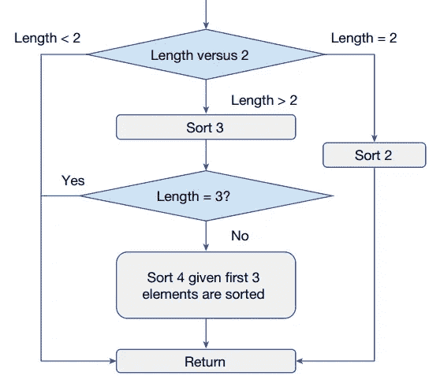
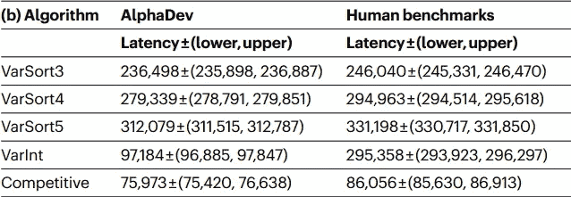

# 深度强化学习改进了排序算法

> 原文：[`towardsdatascience.com/deep-reinforcement-learning-improved-sorting-algorithms-2f6a1969e3af?source=collection_archive---------13-----------------------#2023-06-13`](https://towardsdatascience.com/deep-reinforcement-learning-improved-sorting-algorithms-2f6a1969e3af?source=collection_archive---------13-----------------------#2023-06-13)

## 谷歌 DeepMind 如何创建出更高效的排序算法

 [Jonathan Bogerd](https://medium.com/@jonathanbogerd?source=post_page-----2f6a1969e3af--------------------------------)

·

[关注](https://medium.com/m/signin?actionUrl=https%3A%2F%2Fmedium.com%2F_%2Fsubscribe%2Fuser%2F3863776b2716&operation=register&redirect=https%3A%2F%2Ftowardsdatascience.com%2Fdeep-reinforcement-learning-improved-sorting-algorithms-2f6a1969e3af&user=Jonathan+Bogerd&userId=3863776b2716&source=post_page-3863776b2716----2f6a1969e3af---------------------post_header-----------) 发表在 [数据科学前沿](https://towardsdatascience.com/?source=post_page-----2f6a1969e3af--------------------------------) · 8 分钟阅读 · 2023 年 6 月 13 日 

--

上周，Google DeepMind 在《自然》杂志上发表了一篇论文，声称通过使用深度强化学习（DLR）发现了一种更高效的排序算法。DeepMind 以推动强化学习（RL）的边界而闻名。几年前，他们利用类似程序击败了围棋游戏中的最佳选手 AlphaGo，之后又用相似的程序战胜了现有的国际象棋引擎。在 2022 年，DeepMind 推出了 AlphaTensor，这是一种利用 DLR 找到更高效矩阵乘法算法的程序。所使用的技术类似于 DeepMind 最新的成就：改进标准排序算法。在本文中，我将讨论他们如何通过引入强化学习、蒙特卡洛树搜索以及 DeepMind 的方法和代理 AlphaDev 的细节来实现这一点。

图片由 [AltumCode](https://unsplash.com/@altumcode?utm_source=medium&utm_medium=referral) 提供，来源于 [Unsplash](https://unsplash.com/?utm_source=medium&utm_medium=referral)

## **排序**

编写排序算法很简单：逐个比较所有值以找到最低（或最高）值，将此值保存在返回列表的第一个元素中，然后继续处理下一个值，直到没有更多值为止。虽然这个算法有效，但远非高效。由于排序在计算机程序中非常常见，因此高效的排序算法受到深入研究。DeepMind 专注于两种排序变体：固定排序和变量排序。固定排序涉及对具有固定预定义长度的值序列进行排序。在变量排序中，值列表的大小没有预先定义。只提供了列表的最大大小。这两种排序变体在最先进的排序算法中广泛使用。通常，通过反复排序列表的小部分来对大列表进行排序。

目前，最先进的算法在固定排序和变量排序中都使用了所谓的排序网络。在本文中，我不会讨论排序网络的详细信息。你可以在[这里](https://dl.acm.org/doi/pdf/10.1145/1468075.1468121)找到更多信息。

## **强化学习**

在这一部分，我将介绍强化学习的主要概念。强化学习是机器学习的一个分支，其中一个智能体被任务赋予在环境中找到最佳行动，基于当前状态。环境的状态包含了所有可能影响所采取行动的相关方面。最佳行动定义为最大化（折扣）累积奖励的行动。行动是依次进行的，在每次行动后，获得的奖励和新状态都会被记录。通常，环境有一些终止标准，在这些标准之后，下一个回合开始。早期版本的 RL 使用表格来跟踪某些状态和行动的值，目的是总是采取具有最高值的行动。深度神经网络常常替代这些表格，因为它们能够更好地泛化，而列举所有状态通常是不可能的。当深度神经网络用于强化学习时，称之为深度强化学习。

## **蒙特卡洛树搜索**

AlphaDev 使用深度强化学习和蒙特卡洛树搜索进行训练，这是一种在给定初始状态下寻找最佳行动的搜索算法。它通常与 DRL 结合使用，例如在 AlphaZero 和 AlphaGo 中。它值得拥有自己的一篇文章，但这里提供了一个摘要。

蒙特卡洛树搜索（MCTS）构建了一个可能结果状态的树，其中当前状态是根节点。对于给定数量的模拟，将探索这棵树以找出采取某些行动的后果。在每次模拟中，使用回放（有时称为游戏过程）来扩展一个节点为子节点，如果游戏在此时没有结束。采取哪种行动基于选择标准。在我们的案例中，选择某个行动的概率由策略网络提供，下面将讨论这一点。节点的值是衡量该节点状态好坏的指标。它由值网络确定，这也将在未来的部分中讨论。如果达到终止状态，则该值会被环境的真实奖励值所替代。

值在搜索树中向上传播。通过这种方式，当前状态的值依赖于从当前状态可以到达的状态的值。

## **DeepMind 的方法**

由 DeepMind 训练的 DRL 代理，旨在改进排序算法实现，称为 AlphaDev。AlphaDev 的任务是编写一个更高效的汇编排序算法。汇编语言是高层语言（如 C++、Java 和 Python）与机器代码之间的桥梁。如果你在 C++ 中使用 sort，编译器会将你的程序编译成汇编代码。汇编器随后将这些代码转换为机器代码。AlphaDev 的任务是选择一系列汇编指令，以创建一个既正确又快速的排序算法。这是一个困难的任务，因为添加一条指令可能会使程序完全错误，即使之前是正确的。

AlphaDev 通过创建并解决 AssemblyGame 来寻找高效的排序算法。在每一轮中，它必须选择一个与 CPU 指令对应的动作。通过将这个问题表述为一个游戏，它可以轻松适应标准的强化学习框架。

## **强化学习公式**

标准的 RL 公式包含状态、动作、奖励和终止标准。

## **状态**

AssemblyGame 的状态由两部分组成。首先是当前程序的表示。AlphaDev 使用 Transformer 的输出，Transformer 是一种神经网络架构，用于表示当前算法。最近 Transformer 在大规模语言模型中取得了很大成功，并且由于算法是基于文本的，Transformer 也非常适合对当前算法进行编码。状态的第二部分是运行当前算法后内存和寄存器状态的表示。这通过传统的深度神经网络来完成。

## **动作**

AssemblyGame 的动作是将合法的汇编指令附加到程序中。AlphaDev 可以选择添加任何合法的指令。DeepMind 为合法动作创建了以下六条规则：

1.  内存位置总是按递增顺序读取

1.  寄存器按递增顺序分配

1.  每个内存位置读取和写入一次

1.  不允许连续比较指令

1.  不允许将比较或条件移动到内存中

1.  未初始化的寄存器不能使用

从编程角度来看，最后两个动作是非法的，其他的则是被强制执行的，因为它们不会改变程序。通过删除这些动作，搜索空间被限制而不影响算法。

## **奖励**

AssemblyGame 的奖励由两部分组成。奖励的第一个元素是正确性分数。根据一系列测试序列，提供的算法会被评估。算法越接近正确排序测试序列，正确性的奖励就越高。奖励的第二个元素是程序的速度或延迟。这通过程序的行数来衡量，如果没有条件分支的话。在实践中，这意味着程序的长度用于固定排序，因为该程序不需要条件。对于可变排序，算法必须根据序列的实际长度进行条件判断。由于排序时并非所有部分的算法都会被使用，因此测量的是程序的实际延迟，而不是行数。

## **终止和目标**

根据 DeepMind 发布的论文，他们在“有限步骤”后终止 AssemblyGame。这具体意味着什么不清楚，但我猜他们是根据当前的人工基准限制步骤数量。游戏的目标是找到一个正确且快速的算法。如果 AlphaDev 提供了一个错误或慢速的算法，游戏就会失败。

## **策略和价值网络**

使用蒙特卡罗树搜索（Monte Carlo Tree Search）时，需要一个策略网络和一个价值网络。策略网络设置每个动作的概率，而价值网络则训练用于评估状态。策略网络根据特定状态的访问次数进行更新。这创建了一个迭代过程，其中策略用于执行 MCTS，策略网络则根据 MCTS 中状态的访问次数进行更新。

价值网络输出两个值，一个是算法的正确性，一个是算法的延迟。根据 DeepMind 的说法，这比通过网络将这些值组合成一个分数的结果更好。价值网络根据获得的奖励进行更新。

## **结果**

在训练 AlphaDev 后，它找到了一些长度为 3 和 5 的固定排序的更短算法。对于长度为 4 的固定排序，它找到了当前的实现，因此没有改进。在固定排序中，AlphaDev 通过应用两个新想法实现了这些结果。这些新想法被称为交换（swap）和复制移动（copy move），它们减少了值之间的比较次数，从而使算法更快。对于长度为 3 的固定排序，DeepMind 通过穷举所有较短程序长度的选项证明了没有更短的程序存在。对于较长的程序，这种方法不可行，因为搜索空间呈指数级增长。

对于可变排序，AlphaDev 提出了算法的新设计。例如，对于长度最多为 4 的可变排序序列，AlphaDev 建议先对 3 个值进行排序，然后对最后剩余的元素执行简化版本的排序。下图展示了 AlphaDev 提供的 Varsort(4)的算法设计。

图片由 D. Mankowitz 等人提供，《使用深度强化学习发现更快的排序算法》（2023），《自然》

-   总体而言，为固定和可变排序发现了更快的算法，证明了深度强化学习可以用于实现高效的算法。C++中的排序实现已经更新为使用这些新算法。有关 AlphaDev 实现的性能提升的详细信息，请参见下表。

表格由 D. Mankowitz 等人提供，《使用深度强化学习发现更快的排序算法》（2023），《自然》

-   为了测试这种方法是否可以推广到其他编程实现，DeepMind 还在一个竞争性编码挑战和 Google 使用的协议缓冲区上测试了 AlphaDev。在这两个案例中，AlphaDev 能够提出更高效的实现，证明了使用蒙特卡洛树搜索的深度强化学习是一种找到常见算法高效实现的有效方法。

## **结论**

-   深度强化学习在许多不同的环境中取得了成功，从围棋和国际象棋等游戏到算法实现（如本文所示）。尽管该领域具有挑战性，通常取决于低级实现细节和超参数选择，但这些成功展示了这一强大概念能够取得的成果。

-   我希望这篇文章让你对强化学习的最新成就有了一些了解。如果你想要更详细的蒙特卡洛树搜索或我讨论的其他算法的解释，请告诉我！

## **来源**

[1] K. Batcher，《排序网络及其应用》（1968），《1968 年 4 月 30 日至 5 月 2 日春季联合计算机会议论文集》（第 307–314 页）

[2] D. Mankowitz 等人，《使用深度强化学习发现更快的排序算法》（2023），《自然》618.7964: 257–263

[3] D. Silver 等人，《通过自我对弈掌握国际象棋和将棋的通用强化学习算法》（2017），arXiv 预印本 arXiv:1712.01815

[4] D. Silver 等人，《通过深度神经网络和树搜索掌握围棋》（2016），《自然》529.7587: 484–489

[5] A. Fawzi 等人，《通过强化学习发现更快的矩阵乘法算法》（2022），《自然》610.7930: 47–53

[6] C. Browne 等人，《蒙特卡洛树搜索方法概述》（2012），《IEEE 计算智能与游戏中的人工智能》4.1: 1–43。
