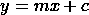
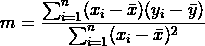
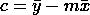

# 对简单线性回归的深刻理解

> 原文：[`towardsdatascience.com/deep-understanding-of-simple-linear-regression-3776afe34473`](https://towardsdatascience.com/deep-understanding-of-simple-linear-regression-3776afe34473)

## 从零开始的线性回归：详细解释

[](https://zubairhossain.medium.com/?source=post_page-----3776afe34473--------------------------------)[](https://towardsdatascience.com/?source=post_page-----3776afe34473--------------------------------) [Md. Zubair](https://zubairhossain.medium.com/?source=post_page-----3776afe34473--------------------------------)

·发表于[数据科学之路](https://towardsdatascience.com/?source=post_page-----3776afe34473--------------------------------) ·阅读时间 6 分钟·2023 年 1 月 10 日

--


作者提供的图片

## 动机

机器学习是一个过程，通过它，机器可以从数据中学习，并在没有明确编程的情况下对新数据做出合理决策。这些模型的基础是数学和统计学。线性回归是其中一种简单且广泛使用的回归算法。回归算法预测连续值。

例如，我们想预测价格、年龄、体重等。这些值是不可计数的。因此，它们被称为连续值。如果你仍然感到困惑，我建议你阅读[**这篇文章**](https://medium.com/towards-data-science/get-familiar-with-the-most-important-weapon-of-data-science-variables-48cc7cd85dc5)。

## 目录

1.  `**机器学习中的回归问题是什么？**`

1.  `**我们何时使用简单线性回归？**`

1.  `**简单线性回归详解**`

1.  `**使用 Python 的实践实现**`

## 机器学习中的回归问题是什么？

在数据科学中，机器学习算法用于自动化系统。在实践中，主要有两种问题——***i. 监督学习和 ii. 无监督学习。***

在监督学习问题中，训练数据集是有标签的。这意味着算法有一个目标值。监督学习算法尝试预测类似目标值的值，并相应地优化其参数。但在无监督学习问题中，训练数据集没有目标值。无监督学习算法尝试找出数据之间的相似性，并相应地训练模型。

监督问题可以进一步分为两类——***i. 分类和 ii. 回归。* 分类**问题是那些需要预测分类值的问题。相反，**回归**问题处理的是连续值。

## 我们何时使用简单线性回归？

我想在简单线性回归之前介绍线性回归。线性回归是通过拟合回归线来找到回归输出的过程。它仅在我们的数据呈线性分布时有效。

`简单或单变量线性回归是在只有一个自变量或特征时的回归过程。` *还有多变量线性回归。我将在接下来的文章中讨论它。*

**何时使用——**

当数据线性分布且仅包含一个特征或自变量时，简单线性回归最为合适。

## 详细的简单线性回归

简单线性回归只接受一个自变量。*看一下直线的简单方程。*



`在线性回归中，方程被称为*回归线方程*。这里，m 和 c 是系数。m 表示回归线的斜率，c 是表示回归线与 y 轴交点的常数值。x 表示自变量，y 是因变量。` 让我们用下面的图示更清楚地说明。


简单线性回归（作者图像）

简单线性回归处理一个自变量（x）和一个因变量（y）。自变量是输入值，因变量是输出值或目标值。

看一下图片，让我逐步解释这个过程。`**x 轴**`代表自变量的值，`**y 轴**`代表因变量的值。黑点是训练数据点的散点图，数据似乎呈线性分布。这些数据将用于训练回归模型的参数。为此，我们将通过散点图拟合一条直线，并使回归线的累计距离尽可能最小。如果我们找到最佳回归线，我们可以通过输入`**x**`值轻松获得预测值。对于一个新的数据点，绘制一条垂直直线将与回归线相交。预测值将是从回归线交点绘制的水平线在`y`轴上的交点。为了拟合最佳回归线，找出上述方程的`**m**`和`**c**`的系数值是我们的主要挑战。

再次说明，回归线方程是`***y=mx+c***`***。*** 我们将从数据集中获取`x`的值，但***m***和***c***是未知的。`***m***`和`***c***`的最佳值可以产生`***y***`的最佳预测值。

对于简单线性回归，我们可以用以下公式找到斜率`**m**`。



将`**m**`的值代入以下方程中，我们将找到`**c**`的最佳值。



*[在这个过程中存在一个限制。如果自变量多于一个，我们不能通过这个手动公式找到系数值。在这种情况下，我们使用梯度下降和代价函数来找到最佳值。我将在即将到来的文章中讨论它。]*

## 使用 Python 进行实践操作

导入所需的 Python 库。

对于任何机器学习模型，数据集是主要的燃料。`*我们使用的是* [*波士顿房价*](https://www.cs.toronto.edu/~delve/data/boston/bostonDetail.html) *数据集，该数据集公开可用，并且在公有领域许可下。*` 从[这里](https://www.kaggle.com/code/prasadperera/the-boston-housing-dataset/data)下载数据集。

*让我们加载数据集。*

由于主数据集中没有列名，所以需要设置列名。

寻找皮尔逊相关性以选择相关性最高的特征作为自变量。

我们的目标值是`‘MEDV’`。从上述相关性图中，`‘RM’`变量的相关性最高，为`0.7`。因此，我们选择了变量`‘RM’`。该变量的全称如下 []。

```py
MEDV - Median value of owner-occupied homes in $1000's.
RM   - Average number of rooms per dwelling.
```

*定义 x 和 y。*

*拆分训练集和测试集。*

*定义计算`***m 和 c***`系数值的函数。*

*绘制回归线。*

预测函数。

我们数据集的实际值与预测值。

我们的模型在某些值上存在显著误差。这是因为我们的数据集有许多特征，而我们仅考虑了一个特征进行演示，因为我们处理的是简单线性回归。

*让我们计算模型的平均绝对误差。*

## 结论

实际上，有许多库和简单的方法可以实现线性回归。但我更喜欢从最基础的知识学习，因为这对绝对初学者很有益。我相信如果我们的基础足够坚固，我们可以在基础上构建高楼，否则可能会出现结构不稳定的问题。

这篇文章将对初学者非常有帮助，并将提供一个坚实的基础。读者将了解到简单线性回归是如何工作的。

*完整的笔记本可以在* [***这里***](https://github.com/Zubair063/ML_articles/tree/main/Simple%20Linear%20Regression)*获取。*

`*[我正在编写一系列关于从零实现的机器学习算法的文章。你可以通过下面的链接阅读之前关于 KNN 和 K-means 聚类的文章。]*`

[](/knn-algorithm-from-scratch-37febe0c15b3?source=post_page-----3776afe34473--------------------------------) ## 从零实现 KNN 算法

### KNN 算法的实现和详细解释

[towardsdatascience.com [](/unsupervised-learning-and-k-means-clustering-from-scratch-f4e5e9947c39?source=post_page-----3776afe34473--------------------------------) ## 从零开始的 K-means 聚类

### K-means：最佳的 ML 算法来聚类数据

towardsdatascience.com

## 参考文献

1.  [波士顿数据集 (toronto.edu)](https://www.cs.toronto.edu/~delve/data/boston/bostonDetail.html)
