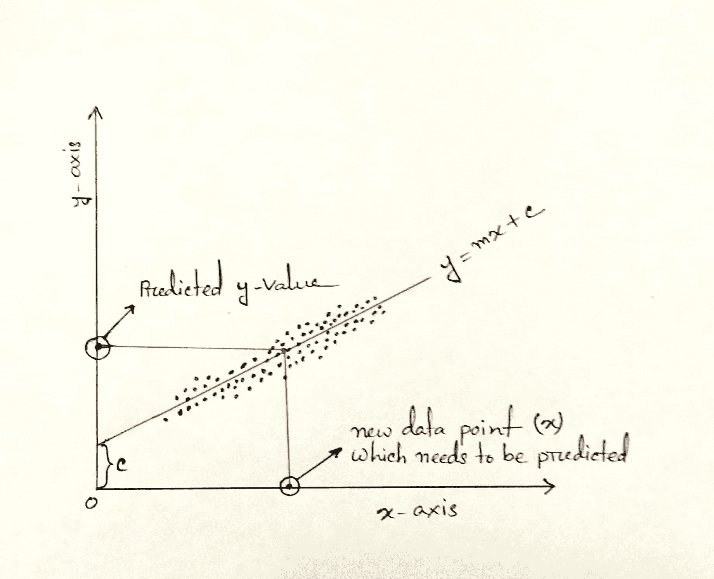

# 深入理解简单线性回归

> 原文：[`towardsdatascience.com/deep-understanding-of-simple-linear-regression-3776afe34473?source=collection_archive---------19-----------------------#2023-01-10`](https://towardsdatascience.com/deep-understanding-of-simple-linear-regression-3776afe34473?source=collection_archive---------19-----------------------#2023-01-10)

## 从零开始的线性回归：详细解释

 [Md. Zubair](https://zubairhossain.medium.com/?source=post_page-----3776afe34473--------------------------------)

·

[关注](https://medium.com/m/signin?actionUrl=https%3A%2F%2Fmedium.com%2F_%2Fsubscribe%2Fuser%2F2fdaeaeeea52&operation=register&redirect=https%3A%2F%2Ftowardsdatascience.com%2Fdeep-understanding-of-simple-linear-regression-3776afe34473&user=Md.+Zubair&userId=2fdaeaeeea52&source=post_page-2fdaeaeeea52----3776afe34473---------------------post_header-----------) 发表在 [Towards Data Science](https://towardsdatascience.com/?source=post_page-----3776afe34473--------------------------------) ·6 min read·2023 年 1 月 10 日

--

作者图片

## 动机

机器学习是一个过程，通过这个过程，机器可以从数据中学习，并在没有明确编程的情况下对新数据做出理性决策。这些模型的基础是数学和统计学。线性回归是一种简单且广泛使用的回归算法。回归算法用于预测连续值。

比如，我们想预测价格、年龄、体重等。这些类型的值是不可计数的，因此被称为连续值。如果你仍然感到困惑，我建议你阅读一下[**这篇文章**](https://medium.com/towards-data-science/get-familiar-with-the-most-important-weapon-of-data-science-variables-48cc7cd85dc5)。

## 目录

1.  `**机器学习中的回归问题是什么？**`

1.  `**我们什么时候使用简单线性回归？**`

1.  `**详细的简单线性回归**`

1.  `**使用 Python 的实战实现**`

## 什么是机器学习中的回归问题？

在数据科学中，机器学习算法用于自动化系统。实际上，主要有两种类型的问题 — ***i. 监督学习，ii. 无监督学习。***
