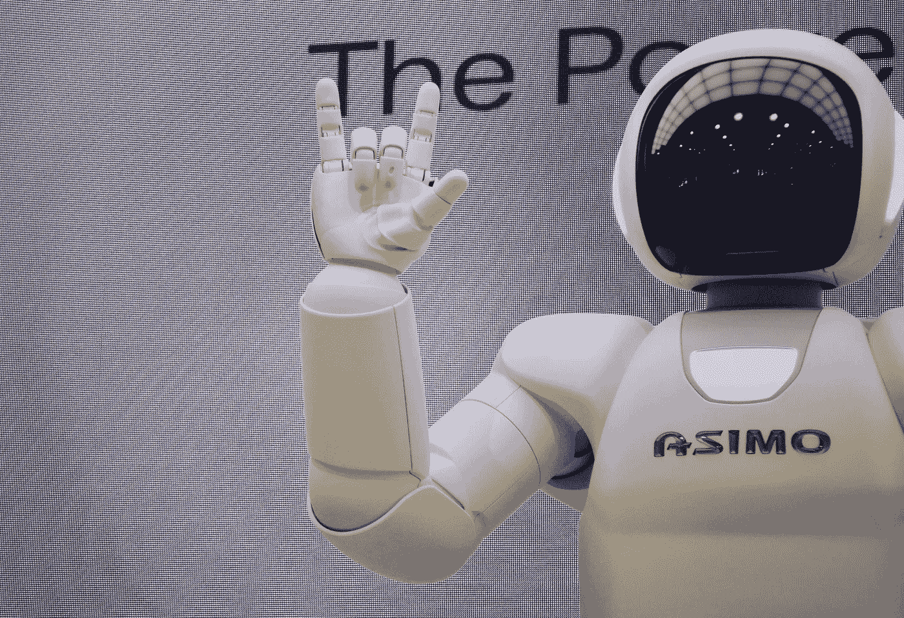
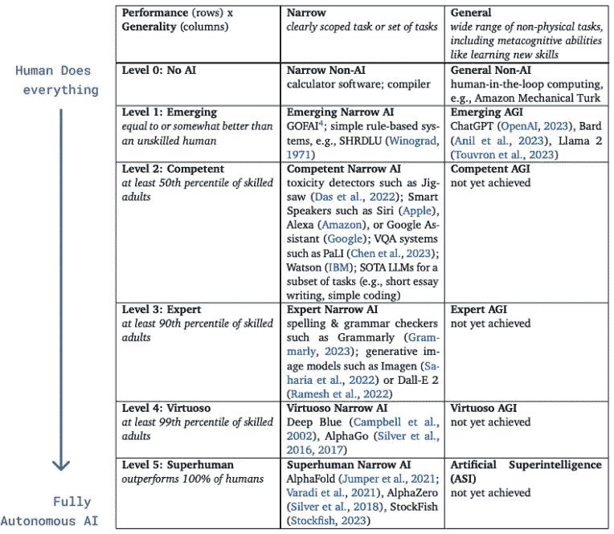
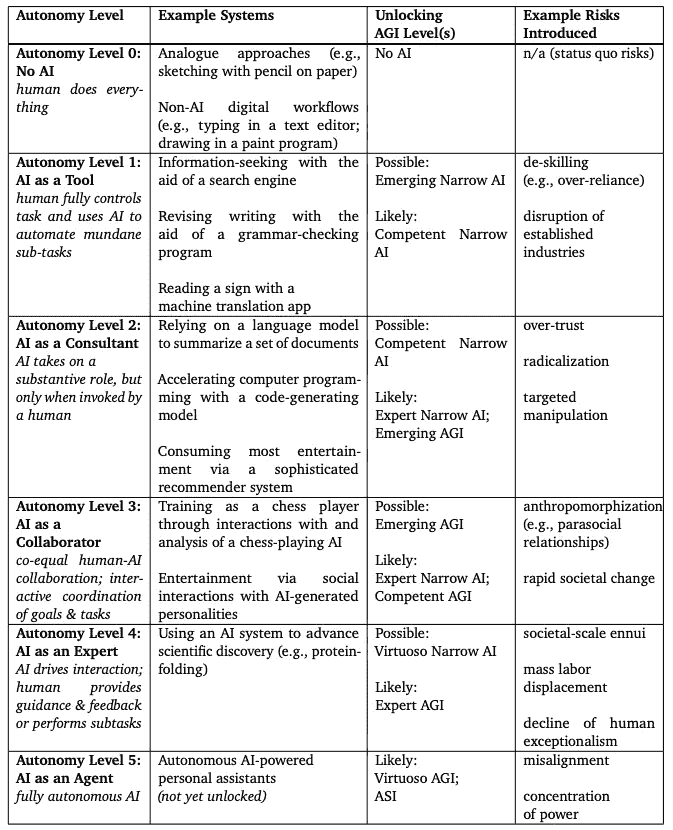

# 定义通用人工智能

> 原文：[`towardsdatascience.com/defining-artificial-general-intelligence-a4b167aa84ba`](https://towardsdatascience.com/defining-artificial-general-intelligence-a4b167aa84ba)

## 你如何判断一个系统是否达到了 AGI（通用人工智能）？

 [Zachary Raicik](https://medium.com/@raicik.zach?source=post_page-----a4b167aa84ba--------------------------------)

·发布于 [Towards Data Science](https://towardsdatascience.com/?source=post_page-----a4b167aa84ba--------------------------------) ·阅读时间 7 分钟·2023 年 11 月 23 日

--

照片由 [Possessed Photography](https://unsplash.com/@possessedphotography?utm_source=medium&utm_medium=referral) 提供，[Unsplash](https://unsplash.com/?utm_source=medium&utm_medium=referral)

上周，萨姆·奥特曼被解除 OpenAI 的首席执行官职务。他离开的真正原因仍然未知。根据董事会的说法，他被解雇是因为董事会“得出结论认为他在与董事会的沟通中并不始终坦诚，这妨碍了董事会履行其职责。”这一模糊的解释引发了大量关于奥特曼被解雇原因的猜测。一些最有说服力的理论包括：

+   奥特曼将市场渗透优先于安全与隐私测试

+   奥特曼在一项重大交易中绕过了董事会

+   奥特曼的自我膨胀过大，开始与公司的使命发生冲突

有趣的是，一些最有说服力的传言指向了对 AI 伦理的观点分歧，特别是在通用人工智能（“AGI”）的发展方面。虽然奥特曼一直是 AGI 潜力的 vocal 支持者，但传言称首席科学家伊利亚·苏茨克弗对 OpenAI 内部技术的快速进展产生了日益增长的担忧。

在这篇文章中，我们将总结谷歌 DeepMind 的新论文 [Levels of AGI: Operationalizing Progress on the Path to AGI](https://arxiv.org/pdf/2311.02462.pdf) 中的一些概念。这篇论文有助于定义 AGI，建立评估 AGI 系统的框架，并总结一些 AGI 可能带来的风险。

# 定义 AGI（通用人工智能）

在人工智能（“AI”）领域，AGI 是能够执行大多数人类水平任务的系统的一个子集。假设这些系统能够像人类一样广泛理解、学习和应用其智能。一个完整的 AGI 系统不应局限于其所训练的数据。相反，系统在存在的过程中可以收集信息并随时间学习。对于许多 AI 公司来说，AGI 是明确或隐含的长期目标。目前，AGI 尚未实现。然而，鉴于 LLM 和人工智能领域的快速进展，AGI 感觉比以往任何时候都更接近。

在论文中，DeepMind 的研究人员概述了 AGI 的定义特征。 “<DeepMind 研究人员>认为，AGI 的任何定义应满足以下六个标准：”

1.  **“专注于能力，而非过程”**：AGI 系统的关键不在于其如何完成任务，而在于系统能够做什么任务。AGI 系统不要求以类似人类的方式思考或理解，也不需要具有人类意识。这并不是说这些系统不会表现出这些特性——但它们不必符合 AGI 的定义。

1.  **“专注于通用性和性能”**：一些系统选择强调通用性——即处理各种任务和适应不同环境的能力。然而，通用性不应以能力为代价。这些系统需要能够以高水平的性能执行广泛的任务。

1.  **“专注于认知和元认知任务”**：研究人员认为，系统是否能够执行物理任务并不是判断其是否为 AGI 的标准。相反，这些系统应专注于完成认知和元认知任务。在这种情况下，认知任务包括感知、记忆、语言和问题解决。元认知任务包括在需要时学习新任务或获取更多信息的能力。

1.  **“专注于潜力，而非部署”**：任何符合 AGI 标准的系统并不需要在现实世界中部署才能被认为是 AGI。相反，系统需要证明其能够满足 AGI 的标准。根据作者的说法，“要求部署作为衡量 AGI 的条件会引入非技术性障碍，例如法律和社会考虑，以及潜在的伦理和安全问题。”

1.  **“专注于生态有效性”**：任何致力于实现 AGI 定义的系统应关注人们在现实世界中重视的任务。换句话说，AGI 不应专注于高度专业化或抽象的任务，比如解决极其复杂的理论问题。这类任务对大多数人日常生活中并不有价值。

1.  **“关注通向 AGI 的路径，而不是单一的终点”**：概述不同等级的 AGI 并附上明确的指标、基准和风险，使政策和进展的讨论变得更加容易。不同的等级可以使系统之间的比较更为简单，并量化进展。

这六个 AGI 标准确保研究人员和其他相关方对 AGI 有一致的理解。这些标准旨在消除与不同术语、能力或结果相关的混淆，并将讨论集中在重要的方面上。我并不是说这六个标准是正确的，但它们确实使得在考虑与 AGI 相关的系统时更容易思考。

# AGI 的等级

在上面的部分中，第六个标准提到一个系统来概述不同等级的 AGI。下表总结了 DeepMind 定义的各种 AGI 等级。请注意，对于每个等级，表格审视了狭义和广义 AI 任务，其中：

+   狭义任务是明确界定或定义的。

+   一般任务是包括学习新技能的各种任务。

AGI 的等级，Google DeepMind [`arxiv.org/pdf/2311.02462.pdf`](https://arxiv.org/pdf/2311.02462.pdf)

当我们谈论狭义的 AI 时，我们会看到许多特定等级的产品实例（例如，等级 0 的简单计算器）。当使用案例范围明确且具体时，构建完全自主的解决方案更为容易。然而，这些系统由于其专业化的性质，未能满足 DeepMind 对 AGI 的标准。例如，AlphaFold 是一个旨在预测 3D 蛋白质结构的系统。尽管其专业化能力令人印象深刻，但其狭窄的关注点意味着它缺乏对 AGI 至关重要的生态有效性。

当我们谈论像 ChatGPT 这样更为通用的系统时，我们会遇到一系列不同的挑战。最初，ChatGPT 处理各种问题的能力令人印象深刻。然而，随着使用工具的时间增加，我逐渐意识到，尽管 ChatGPT 在表面上看似超人，但在需要深入专业知识的领域，它常常有所欠缺。我们可以将这个观点与上面提到的 AGI 等级联系起来——它仅能在无技能人类（等级 1）的水平上回答问题。它的许多回答看起来似乎是事实正确的，但实际上却充满了不准确性。这一认识突显了今天的 AI 系统，尽管具备“首创”的能力，但在性能的深度上往往有所欠缺。它们优先考虑广泛的功能，但并不擅长所有这些功能，这与 DeepMind 对 AGI 的第二个标准相冲突。

# AGI 的风险

在 2004 年电影*机器人总动员*中，机器人存在是为了服务于人类主人。这些机器人不被允许伤害人类，必须随时服从人类，并且必须不惜一切代价保护主人。随着电影情节的发展，这些机器人开始不再遵守这些规则。它们发展出了自由意志和情感。结果，这些机器人成为了对人类的存在性威胁。

尽管这种世界末日场景可能在 AGI 世界中成为风险，但还有更多实际的风险。下表总结了与窄域和通用 AI 相关的各种风险，涉及不同级别的 AI 自主性。

AGI 的风险，Google DeepMind [`arxiv.org/pdf/2311.02462.pdf`](https://arxiv.org/pdf/2311.02462.pdf)

诚然，当我首次开始使用高级 AI 工具并研究 AGI 这一概念时，我对工具的潜在风险视而不见。我下意识地拒绝承认这些工具的发展和进步可能会带来任何负面副作用。我是说，谁不喜欢全天候访问 30 秒代码审查的服务呢？

然而，当我偶然看到这张表格时，它改变了我的观点。它让我看到了这些系统的相关风险，包括我们今天使用的工具。将 AI 作为顾问（“自主级别 2”）类似于许多人今天使用 ChatGPT 或依赖推荐系统来获取产品或电影推荐的方式。以这种方式使用工具可能导致长期的过度信任或有针对性的操控。事实上，最近我找不到人来审查我的代码，于是我让 ChatGPT 审查了我的代码。ChatGPT 的审查结果显示代码无误，于是我将代码推向了生产环境。结果，代码中充满了 bug，几乎立即被回滚。我对 ChatGPT 过度信任，付出了代价！

随着我们继续推动窄域和通用 AI 系统的发展，风险也显著增加。目前的系统可能导致过度信任和针对性操控，而更强大的系统则可能导致大量失业和权力集中。作为技术导向的一方，我对我们取得的进展感到非常惊讶，并对未来的发展充满了*激动*。然而，作为实践的一方，我认识到需要在构建先进 AI 系统时仔细考虑风险和后果。
