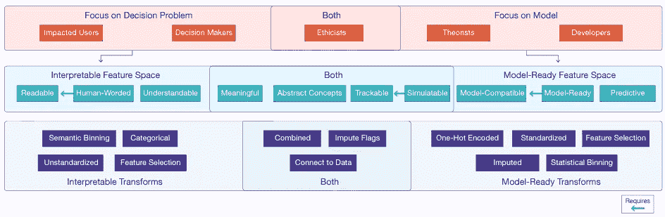

# 定义可解释的特征

> 原文：[`towardsdatascience.com/defining-interpretable-features-ebd7ed94897?source=collection_archive---------4-----------------------#2023-01-14`](https://towardsdatascience.com/defining-interpretable-features-ebd7ed94897?source=collection_archive---------4-----------------------#2023-01-14)

照片由 [Kevin Ku](https://unsplash.com/@ikukevk?utm_source=medium&utm_medium=referral) 提供，发布在 [Unsplash](https://unsplash.com/?utm_source=medium&utm_medium=referral)

## 这是 MIT 研究人员总结的发现和开发的分类法。

 [Nakul Upadhya](https://medium.com/@upadhyan?source=post_page-----ebd7ed94897--------------------------------)

·

[关注](https://medium.com/m/signin?actionUrl=https%3A%2F%2Fmedium.com%2F_%2Fsubscribe%2Fuser%2F4d9dddc62a80&operation=register&redirect=https%3A%2F%2Ftowardsdatascience.com%2Fdefining-interpretable-features-ebd7ed94897&user=Nakul+Upadhya&userId=4d9dddc62a80&source=post_page-4d9dddc62a80----ebd7ed94897---------------------post_header-----------) 发表在 [数据科学前沿](https://towardsdatascience.com/?source=post_page-----ebd7ed94897--------------------------------) ·9 分钟阅读·2023 年 1 月 14 日

--

在 2022 年 2 月，麻省理工学院[数据到人工智能（DAI）小组](https://dai.lids.mit.edu/)的研究人员发布了一篇名为《可解释特征的必要性：动机和分类法》的论文[1]。在这篇文章中，我旨在总结这些作者的一些主要观点和贡献，并讨论他们工作的潜在影响和批评。如果你对这些内容感兴趣，我强烈推荐阅读[原始论文](https://arxiv.org/abs/2202.11748)。此外，如果你对可解释机器学习不太熟悉，我强烈推荐[Christopher Molnar 的免费书籍](https://christophm.github.io/interpretable-ml-book/) [2]。虽然可解释性/解释性的定义在不同的出版物中常常变化[1]，但这本书提供了理解该领域的坚实基础。

论文的核心发现是**即使是像线性回归这样高度可解释的模型，非可解释的特征也可能导致难以理解的解释**（例如，特征 x12 的权重为 4 对大多数人来说毫无意义）。鉴于此，论文提供了利益相关者的分类、可解释特征的现实世界应用场景、各种特征质量的分类，以及可能的可解释特征转换，这些都帮助数据科学家开发易于理解的特征。

# 利益相关者的定义

论文的第一个贡献是扩展了 Preece 等人提出的可能受益于机器学习解释的主要用户类型，并定义了一些他们的兴趣。虽然 Preece 等人提出了 4 种主要的利益相关者类型，但本文的作者将该列表扩展到 5 种：

+   开发者：那些训练、测试和部署机器学习模型的人，他们关注特征以提高模型性能。

+   理论家：那些对推进机器学习理论感兴趣的人，他们关注特征，以了解其对模型内部机制的影响。

+   伦理学家：那些对模型的公平性感兴趣的人，他们关注特征，以确保模型的伦理使用。

+   决策者：那些获取模型结果以完成任务和决策的人。他们对特征本身不感兴趣，但需要解释以确保他们的决策基于可靠的信息。

+   受影响的用户：这些是受模型及其使用影响的个人，但不会直接与模型互动，除非是为了理解对他们自身的影响。

各种用户在特征工程方面有不同的需求，这些需求往往相互冲突。决策者可能希望模型中的特征越简单越好，以便更好地解释，而开发者可能会选择复杂的转换，以使特征具有极高的预测能力。

# 现实世界应用场景

除了介绍利益相关者之外，作者还介绍了 5 个实际领域，在这些领域中，他们在试图解释自己开发的模型时遇到了障碍。

## 案例研究

**儿童福利**

在这项案例研究中，DAI 团队与社会工作者和科学家（担任决策者和伦理学家）合作，开发了一个解释性 LASSO 模型，该模型拥有超过 400 个特征，并输出潜在儿童虐待案件的风险评分。在此过程中，DAI 团队发现模型的大多数不信任来源于特征而非机器学习算法。一个突出的问题是关于一热编码分类特征（例如`role of child is sibling == False`）的措辞。此外，许多社会工作者和科学家对他们认为与预测任务无关的特征表示担忧，基于他们的主题领域专业知识。

**教育**

在在线教育领域，作者致力于为大规模开放在线课程（例如 Coursera、edX 等免费课程）相关的各种决策任务添加可解释性。在与各种课程开发者和讲师合作时，作者发现，最有用的特征是那些将数据组合成对用户有意义的抽象概念（例如将工作完成情况和互动结合成`参与`特征）的特征。此外，研究人员发现，当这些抽象概念的数据来源易于追溯时，利益相关者的反应更好。

**网络安全**

在第三个领域，研究人员致力于开发检测领域生成算法的模型，以帮助安全分析师应对潜在的攻击。虽然为识别这些攻击工程了许多特征，但构建这些特征的原始 DNS 日志对用户的帮助更大，作者面临的挑战是如何将特征值追溯到相关日志。

**医疗记录**

在医疗保健领域，研究人员与六位临床医生合作开发了一个预测手术后并发症的模型。在这项案例研究中，作者使用了 SHAP 值来解释特征贡献，但很快发现仅靠 SHAP 解释是不够的。延续网络安全领域的趋势，作者发现基于聚合函数的特征不如原始信号数据那样易于解释。

**卫星监测**

在这项案例研究中，作者旨在可视化时间序列异常检测解决方案的结果，并与六位领域专家一起开发了一个工具。作者随后进行了两项用户研究，分别使用领域专家和普通终端用户的股票价格数据来评估该工具。在这项工作中，作者发现对插补过程的透明度需求更高，大多数问题集中在哪些值是插补的而非真实的。

## 经验教训

从所有案例中总结了三个关键经验：

1.  文献中大多数关注点在于选择和工程化特性以最大化模型性能，但与人类用户和决策者接口的模型需要一个可解释的特性空间才有用。

1.  为了具有可解释性，特性需要具备多种属性（稍后将在分类法中讨论）。

1.  虽然将特性转换为模型准备状态的重要性不言而喻，但也需要有方法来撤销这些转换以保持可解释性。

# 特性分类法

作者结合他们工作的领域和大量文献搜索，开发了一种特性质量的分类法，识别了用户。作者将这些特性组织为两个主要质量——模型准备性和可解释性——其中一些特性同时具备这两个质量。

模型准备属性使特性在模型中表现良好，是**开发者**、**理论家**和**伦理学家**关注的重点。

可解释属性是使特性对用户更易理解的属性。这些属性主要惠及**决策者**、**用户**和**伦理学家**。

## **模型准备特性属性**

1.  *预测性*：特性与预测目标的相关性。这并不意味着直接的因果关系，因为特性可能是混淆变量或[虚假相关性](https://www.tylervigen.com/spurious-correlations)。

1.  *模型兼容性*：特性由模型架构支持，但可能不具备预测性或实用性。

1.  *模型准备性*：特性与模型兼容，能够帮助生成准确预测。模型准备特性还包括通过标准化和归一化等方法转换过的特性。

## **可解释特性属性**

1.  *可读性*：特性以普通文本书写，用户无需查看代码即可理解所指内容。

1.  *人性化*：该特性既可读又以自然、友好的方式描述。作者发现，儿童福利领域的利益相关者特别受益于这一特性。

1.  *可理解性*：特性指代用户理解的现实世界指标。这个属性在很大程度上依赖于用户的专业知识，但通常是那些没有经过复杂数学操作的特性（例如，年龄是可理解的，但`log(humidity)`可能不是）。

## **模型准备性和可解释性属性兼具**

1.  *有意义*：特性是学科专家认为与目标变量相关的特性。一些特性可能具有预测性，但由于虚假相关性而不具意义。类似地，一些特性可能有意义，但预测性不强。然而，最好还是尽量使用有意义的特性。

1.  *抽象概念*：特性通过某些领域专家定义的原始特性的组合计算而得，通常是通用概念（例如，参与和成就）。

1.  *可追踪*：该特征可以与其计算原始数据准确关联。

1.  *可模拟*：如果需要，可以从原始数据中准确重新计算该特征。所有可模拟的特征都是可追踪的，但并非所有可追踪的特征都是可模拟的。例如，`test grade over time` 可能是可追踪的（它来自原始测试成绩），但不能模拟，因为这可能指的是每月或每年的平均成绩或成绩变化。

# 可解释变换

除了可解释特征的各种属性，作者还提出了一些特征工程方法及其可能对特征可解释性的贡献。虽然有些数据变换可以帮助特征准备模型，但这并不常见。可解释性变换旨在帮助弥补这一差距，但往往会撤销模型准备变换。这可能会降低模型的预测能力，但会引入可解释的特征属性，使其更受决策者、用户和伦理学家的信任。

+   *转换为分类变量*：在解释特征时，将独热编码变量转换回其分类形式。

+   *语义分箱*：在对数值数据进行分箱时，尽量基于现实世界的区别而不是统计区别进行分箱。例如，将 `age` 按 `child`、`young-adult`、`adult` 和 `senior` 分类，比按四分位数进行分箱更具可解释性。

+   *标记插补*：如果使用数据插补，添加一个额外的特征来识别包含插补数据的点，可以大大增加对模型的信任。

+   *汇总数值特征*：当数据中存在许多紧密相关的指标时，将它们汇总为一个特征可能有利于防止数据过载。例如，作者发现将各种身体和情感虐待的推荐汇总为一个单一的推荐计量，有助于决策者。

+   *修改分类粒度*：当许多类别彼此相关时，通过选择变量的适当总结（例如，将 [森林覆盖类型](https://archive.ics.uci.edu/ml/datasets/covertype) 数据集中的土壤区划汇总为主要的 8 种地质土壤区）可以提高可解释性和性能。

+   *转换为抽象概念*：应用数值汇总和分类粒度变换器，开发一个手工制作的公式，以生成主题专家可以理解的抽象概念。

+   *反向缩放和特征工程*：如果应用了标准化、归一化或数学变换，在分析特征之前反转这些变换可以提高可解释性。例如，报告 `age` 的特征权重比报告 `sqrt(age)` 的权重更有帮助。

+   *原始数据链接*：此转换扩展了反向缩放和特征工程。如果可能，请明确展示如何从原始数据计算工程特征。

虽然这不是所有可能转换的详尽列表，但它确实为数据科学家提供了一个很好的起点，介绍了一些简单的步骤，以确保他们拥有一个可解释的特征空间。

# 讨论与结论

图 1：Zytek 等人提出的特征分类总结 [1]（图源自论文）

阅读这篇论文时，我确实有一些批评。首先，尽管作者开发了各种利益相关者，但他们从未提供过 **受影响用户** 和 **决策者** 不同的示例。虽然我们可以做出一些有根据的猜测（例如，学生在教育案例中可能是受影响的用户，而患者在医疗案例中可能是受影响的用户），但并没有提出解释性特征如何帮助这个群体的理由。

作者们自己也提出了一些可解释特征的风险。在他们的例子中，开发者可能会恶意地将种族特征包含到社会经济因素的抽象概念中，从而有效地掩盖了种族在模型中的预测作用。此外，作者承认，许多提出的可解释性转换可能会降低模型性能。一些可解释特征属性（如可读性）在数据隐私重要时也不适用。

尽管有这些批评，但不可否认的是，Zytek 等人 [1] 提供了很多关于特征如何变得可解释、如何实现可解释性以及为何这很重要的信息。此外，提出的转换相对容易实现，使其对初学者数据科学家更为友好。他们的分类在上面的图 1 中总结，可能是大多数数据科学家需要随时备份在桌上的图像。

# 资源与参考文献

[1] A. Zytek, I. Arnaldo, D. Liu, L. Berti-Equille, K. Veeramachaneni. [对可解释特征的需求：动机与分类](https://arxiv.org/abs/2202.11748)（2022）。SIGKDD Explorations。

[2] C. Molnar. [可解释的机器学习](https://christophm.github.io/interpretable-ml-book/)（2020）。LeanPub

[3] A. Preece, D. Harborne, D. Braines, R. Tomsett, S. Chakraborty. [可解释 AI 中的利益相关者](https://arxiv.org/abs/1810.00184)（2018）。《政府与公共部门的人工智能》第 6 页。

[3] S. Lundberg, S.I. Lee. [对模型预测的统一解释方法](https://arxiv.org/abs/1705.07874)（2017）。《神经信息处理进展》第 31 卷第 10 页。
