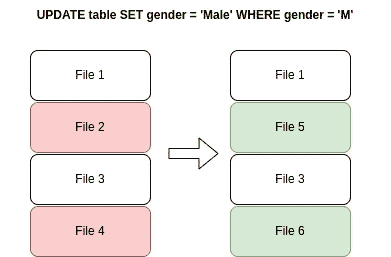
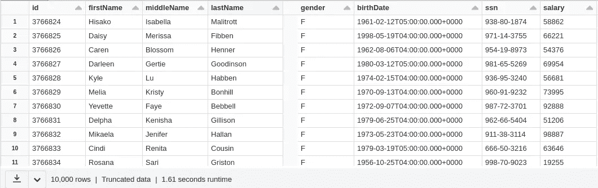
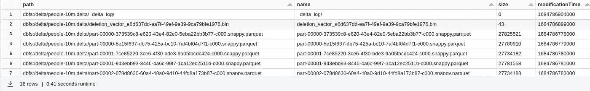
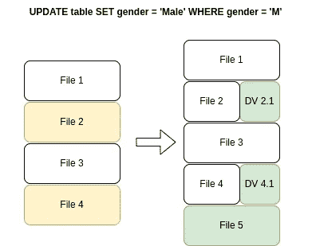
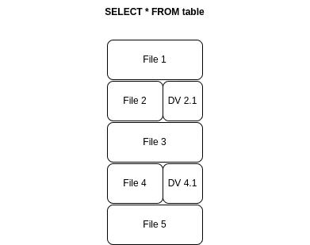
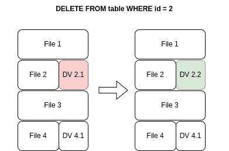
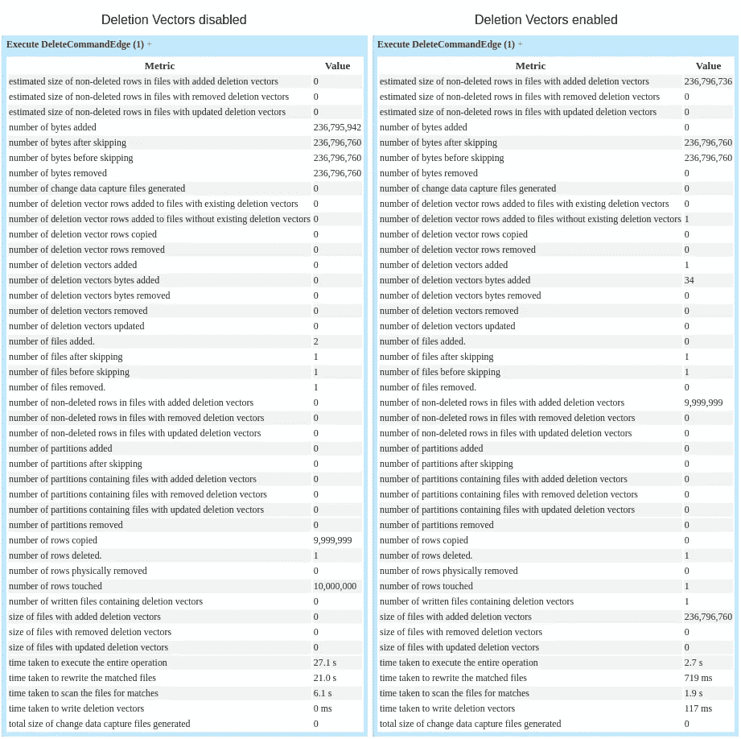

# Delta Lake：删除向量

> 原文：[`towardsdatascience.com/delta-lake-deletion-vectors-65bc9dc90b63`](https://towardsdatascience.com/delta-lake-deletion-vectors-65bc9dc90b63)

## 删除向量与 DML 命令有何关联，它们如何改善写入性能？

 [维托·特谢拉](https://medium.com/@vitorf24?source=post_page-----65bc9dc90b63--------------------------------)

·发表于 [Towards Data Science](https://towardsdatascience.com/?source=post_page-----65bc9dc90b63--------------------------------) ·9 分钟阅读·2023 年 5 月 25 日

--

[Sam Pak](https://unsplash.com/@melocokr?utm_source=medium&utm_medium=referral) 提供的照片，来源于 [Unsplash](https://unsplash.com/?utm_source=medium&utm_medium=referral)

能够更新和删除记录是从传统数据仓库过渡到数据湖时失去的一个功能。虽然数据湖在解决规模和成本问题上表现出色，但它们牺牲了更新和删除记录的能力。数据湖由许多文件组成，这些文件很快会变成数据沼泽，这正是问题出现的地方，而湖仓架构则解决了这一问题。

湖仓架构是一种结合了数据仓库和数据湖的混合型架构，旨在解决它们各自的问题。其中一个问题是数据仓库中备受喜爱的缺乏 DML 支持的 ACID 事务，而这正是 Delta Lake 的亮点。然而，由于 Delta 的 ACID 保证，文件的原地修改是不可能的。

在这篇文章中，我将讨论 Delta 如何支持 DML 命令、删除向量如何工作以及它们作为性能改进的重要性。

# Delta Lake — DML 背后的实现

在 [事务日志](https://www.databricks.com/blog/2019/08/21/diving-into-delta-lake-unpacking-the-transaction-log.html) 的帮助下，Delta Lake 支持如 *Update*、*Delete* 和 *Merge* 的 DML 命令。为了简便起见，我们将专注于 *Update* 和 *Delete* 命令，因为它们更简单，并且在底层的工作方式相同。

那么，当执行以下查询时会发生什么？

更新前后的文件 — 图片来源于作者

涉及三个步骤：

+   查找谓词 *gender = ‘M’* 匹配的文件

+   对于找到的每个文件，重写文件并更新记录

+   从事务日志中删除文件 2 和文件 4，并添加文件 5 和文件 6

相同的逻辑也适用于*删除*命令。将文件重写为所需更新的过程称为**写时复制**。

通过复制包含更新记录的整个文件，我们避免了就地修改，并能够同时浏览事务日志和构成 Delta 表最新状态的多个不同版本（时间旅行）。

对于上述查询，这种策略似乎没有问题，因为有很高比例的记录会被更新，但那这个呢？

在这种情况下，包含特定 id 的文件必须被没有该记录的新文件完全替换。对于小文件，这不应成为问题，但假设我们有几百 MB 的文件，这种做法是非常低效的。

总之，写时复制对于快速读取非常好，因为所有数据始终存在于同一个文件中，并且在 DML 操作不多的情况下表现良好。相反，写入操作成本高，当更新操作很多时，这种策略是不理想的，如上所述。

# 删除向量

Delta 删除向量（DVs）是一种机制，用于在由于写时复制而只更新文件中很小百分比的记录时，提高写入性能。

简单来说，它们是 [RoaringBitmaps](https://github.com/RoaringBitmap/RoaringBitmap) 的数组，直接映射到 Parquet 文件的行中（32 位整数的默认实现不足以覆盖可能的行数）。DVs 由删除或更新现有数据的命令创建，作为标记用于在扫描数据时过滤行。在删除的情况下，它们充当删除标记，正如名称所示；在更新的情况下，它们充当行无效标记，我将在下面进一步详细说明。

## 设置

让我们使用之前 Delta Lake 文章中使用的 [people10m 公共数据集](https://learn.microsoft.com/en-us/azure/databricks/dbfs/databricks-datasets#create-a-table-based-on-a-databricks-dataset) 并分析 DVs 实际上是如何工作的。

我们应该有这样的表：

Delta Table people10m — 作者提供的图片

我们需要做的第一件事是通过运行以下命令启用该功能：

设置删除向量标志

**注意：** 请注意，通过启用此功能，表协议会更新为*readerVersion=3* 和 *writerVersion=7*，可能会与旧版本的读取器/写入器不兼容。

让我们通过从表中删除一个 id 来强制创建一个删除向量：

没有 DVs 的话，我们应该在事务日志中有一个新文件，包含原始文件中的所有 id，除了 id 1。让我们通过检查事务日志来看看发生了什么。

## 解包事务日志

**CommitInfo**

*commitInfo* 条目包含有关 DELETE 操作的信息。

事务中的提交信息条目

在这里我们看到 *numDeletionVectorsAdded:”1"* 和 *numAddedFiles:”0"*，这意味着我们避免了重写文件。

**移除**

你可能会觉得奇怪，因为它包括一个 *remove* 条目，这种行为类似于标准的写时复制行为，上述指标表明没有文件被移除 *numRemovedFiles:”0"*。

在事务日志中移除条目

**添加**

*add* 条目解释了启用 DVs 后发生的所有事情。

在事务日志中添加条目

在这里我们看到，添加的文件的 *path* 与移除的文件相同，但现在包含了删除向量。添加和移除条目现在可以选择性地包含一个 *deletionVector* 字段，其中包含与文件关联的 DVs 信息。

在支持 DVs 的版本中，文件通过文件路径和唯一删除向量 id 唯一标识，当未使用 DVs 时，默认值为 NULL。

**这个 id 是如何定义的？新的 DV 结构提供了什么信息？**

它主要取决于存储类型。在我们的例子中，存储类型是“*u*”。对于这种存储类型，*pathOrInlineDv* 是 `<random prefix — optional><base85 encoded uuid>`。它用于存储在相对于 Delta 表路径的路径中的 DVs。DV 文件名可以从 UUID 派生（[见详细信息](https://github.com/delta-io/delta/pull/1487/files)）。

Delta 表路径中的删除向量

在我们的例子中，我们可以看到删除向量与表文件一起存储。请注意，如果表具有分区值，DV 文件不会保存在分区目录中，而是保存在 Delta 表根目录中，因为 DV 可以跨多个分区。

存储类型可以采用其他值，例如 *“i”*，其中向量内联，因此 *pathOrInlineDv* 是 `<base85 encoded bytes>`，以及 *“p”*，其中文件存储在由 *pathOrInlineDv* 提供的绝对路径中。

*Offset* 是一个可选字段，表示数据在由文件支持的存储类型中的起始位置。当 DV 内联（存储类型 *“i”*）时，该字段不存在。

*SizeInBytes* 是 DV 的字节大小。

*Cardinality* 是 DV 逻辑上删除的行数。

# 启用删除向量的 DML

启用 DVs 后，DML 命令的工作方式有所不同，以利用新的信息。

## 更新时没有现有的 DVs

启用 DVs 的更新 — 作者提供的图像

启用 DVs 后，更新命令逻辑如下：

+   扫描所有满足条件并需要更新的文件（File 2, File 4）

+   为需要失效的行写入 DVs（DV 2.1，DV 4.1）

+   写入更新后的行的新文件（File 5）

+   将 (File 5, NULL) 添加到事务日志中，移除 (File 2, NULL) 和 (File 4, NULL)，并添加 (File 2, DV 2.1) 和 (File 4, DV 4.1) 文件

**注意：** 在写作时，DVs 不支持 *UPDATE* 和 *MERGE* 命令，只支持 *DELETE*。不过，它们将在 [未来支持](https://github.com/delta-io/delta/issues/1367#issuecomment-1485345562)。

## 带有 DVs 的表的读取

带有 DVs 的表的读取 — 作者提供的图像

当文件有相关的 DVs 时，扫描将隐式读取 DV，并根据向量过滤匹配的结果行。没有 DVs 时，我们读取单个文件以获得一组结果，而有 DVs 时，我们必须同时读取文件和 DV 才能找到正确的结果集，这可能会影响读取性能。

## 删除现有的 DVs

带有 DVs 的删除 — 作者提供的图像

在这种情况下，我们将执行一个删除操作，这会影响一个已经有相关 DV 文件的文件。由于我们只是删除，不需要写入任何包含更新行的新文件，只需更新现有 DV。

+   扫描 (File 2, DV 2.1) 以查找最新的行集

+   写一个新的 DV，包含删除旧 DV 的行以及新的行。

+   从事务日志中移除 (File 2, DV 2.1) 并添加 (File 2, DV 2.2)

# 带有 DVs 的清理和压缩

## *VACUUM*

随着不断的更新，DVs 可能会不断被替换，留下许多旧文件。*VACUUM* 也会像处理常规文件一样处理 DVs。

## *OPTIMIZE*

在没有 DVs 的情况下，*OPTIMIZE* 使用 *minFileSize* 属性选择应该进行压缩的文件。由于某些文件可能有大量行被作废，因此选择那些超出某个阈值的文件也是有意义的。*maxDeletedRowsRatio* 属性定义了文件被选择进行压缩并删除其 DV 的最大允许比例。

## Z-ORDER OPTIMIZE

这个 *OPTIMIZE* 策略不是幂等的，每次执行时都会尝试生成一组新的有序文件，这意味着这个操作不会生成 DVs，所有以前的 DVs 和文件都标记为待删除。

# 性能差异

理论已经涵盖，但让我们通过运行一个简单的 *DELETE* 查询来查看实际中的改进。

为了模拟一个写入密集型应用程序的真实场景，并考虑平均目标文件大小，我将数据集压缩到一个大约 236 MB 和 1000 万条记录的单一文件中，并比较了启用和未启用 DVs 的情况下查询的性能。

两种方法的作业统计信息 — 作者提供的图像

我们首先注意到左侧的字节数增加，这与原始文件的字节数相同，减去刚刚删除的行。有两个文件被添加，总计 9,999,999 行，运行整个操作（包括扫描文件和重写更新后的文件）花费了 27.1 秒。

在右侧，我们可以看到 DVs 的实际应用。没有新增字节，因为没有新文件。我们看到一个包含一行（34 字节）的新 DV 被添加到一个仍包含 9,999,999 个有效行的现有文件中。**总体而言，该操作耗时 2.7 秒，相比之前的方法写入速度提高了大约十倍！** 通过写入一个耗时 117 毫秒的 DV，我们避免了为了在一个拥有 1000 万行的数据集中删除一行而重新写入整个文件。

# 总结

在这篇文章中，我们看到 DVs 在写入密集型用例中表现得非常好，尤其是在需要进行大量小的更新或删除时。虽然读取时间可能会受到读取更多文件的影响，但通过自动压缩作业或计划的*OPTIMIZE*作业，这些时间损失可以得到有效弥补。总的来说，这是写入性能和读取性能之间的权衡，因此在决定启用此功能之前，分析你所运行的工作负载类型至关重要。

如果你希望了解更多关于 Delta Lake 的信息，请务必阅读我之前的文章：

[## Delta Lake — 自动模式演进](https://towardsdatascience.com/delta-lake-automatic-schema-evolution-11d32bd1aa99?source=post_page-----65bc9dc90b63--------------------------------)

### 在合并演进型 DataFrame 时会发生什么，你可以/不能做什么

[## Delta Lake—保持高效和清洁](https://towardsdatascience.com/delta-lake-keeping-it-fast-and-clean-3c9d4f9e2f5e?source=post_page-----65bc9dc90b63--------------------------------)

### 曾经想过如何提升你的 Delta 表的性能吗？实践如何保持 Delta 表的高效和清洁。

[## Delta Lake — 自动模式演进](https://towardsdatascience.com/delta-lake-automatic-schema-evolution-11d32bd1aa99?source=post_page-----65bc9dc90b63--------------------------------)
