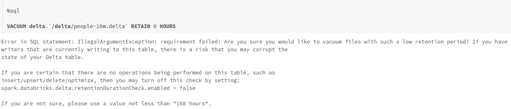
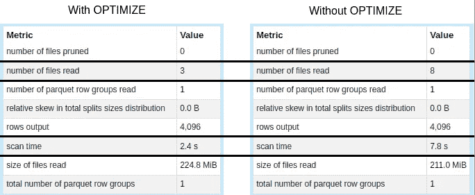

# Delta Lake：保持快速和清洁

> 原文：[`towardsdatascience.com/delta-lake-keeping-it-fast-and-clean-3c9d4f9e2f5e`](https://towardsdatascience.com/delta-lake-keeping-it-fast-and-clean-3c9d4f9e2f5e)

## 曾经想过如何提高 Delta 表的性能吗？亲身体验如何保持 Delta 表的快速和清洁。

[](https://medium.com/@vitorf24?source=post_page-----3c9d4f9e2f5e--------------------------------)[](https://towardsdatascience.com/?source=post_page-----3c9d4f9e2f5e--------------------------------) [Vitor Teixeira](https://medium.com/@vitorf24?source=post_page-----3c9d4f9e2f5e--------------------------------)

·发布于[数据科学前沿](https://towardsdatascience.com/?source=post_page-----3c9d4f9e2f5e--------------------------------)·阅读时间 11 分钟·2023 年 2 月 15 日

--


如何保持 Delta 表快速和清洁的简化流程图（作者提供的图片）

保持 Delta 表的快速和清洁对维护数据管道的效率非常重要。Delta 表可能会随着时间的推移变得非常庞大，导致查询性能下降和存储成本增加。然而，有几种操作和权衡可以积极影响表的速度。

在这篇博客文章中，我们将使用[people10m 公共数据集](https://learn.microsoft.com/en-us/azure/databricks/dbfs/databricks-datasets#create-a-table-based-on-a-databricks-dataset)，该数据集在 Databricks Community Edition 上可用，展示如何利用 Delta 操作保持表的快速和清洁，同时解释幕后发生的情况。

# 分析 delta 日志

我们将从检查数据集的内容开始。默认情况下，它在 Databricks 上可用，你可以[在这里](https://learn.microsoft.com/en-us/azure/databricks/dbfs/databricks-datasets#sql)访问它。


数据集的小样本


来自原始 Delta 表的文件

我们有 16 个 parquet 条目和一个*_*delta_log*文件夹，其中包含所有交易日志，这些日志堆积在一起形成我们的 delta 表。

如果我们检查日志的内容，可以看到一个 JSON 文件，描述了 Databricks 创建这个 Delta 表时写入的第一次交易。


从分析中，我们可以看到这个交易包括几个操作：

## **提交信息**

```py
{
    "commitInfo": {
        "timestamp": 1602173340340,
        "userId": "360903564160648",
        "userName": "stephanie.bodoff@databricks.com",
        "operation": "WRITE",
        "operationParameters": {
            "mode": "ErrorIfExists",
            "partitionBy": "[]"
        },
        "notebook": {
            "notebookId": "1607762315395537"
        },
        "clusterId": "1008-160338-oil232",
        "isolationLevel": "WriteSerializable",
        "isBlindAppend": true,
        "operationMetrics": {
            "numFiles": "8",
            "numOutputBytes": "221245652",
            "numOutputRows": "10000000"
        }
    }
}
```

`commitInfo` 包含有关提交的所有信息：执行了什么操作、由谁执行、在哪里执行以及在什么时间。`operationMetrics` 字段显示写入了 8 个文件，总共 1000000 条记录。

## **Protocol**

```py
{
    "protocol": {
        "minReaderVersion": 1,
        "minWriterVersion": 2
    }
}
```

`protocol` 操作用于增加读取或写入给定表所需的 Delta 协议版本。这允许排除那些使用旧协议的读者/写者，因为旧协议可能缺少正确解释事务日志所需的功能。

## **Metadata**

```py
{
    "metaData": {
        "id": "ee2db204-0e38-4962-92b0-83e5570d7cd5",
        "format": {
            "provider": "parquet",
            "options": {}
        },
        "schemaString": "{\"type\":\"struct\",\"fields\":[{\"name\":\"id\",\"type\":\"integer\",\"nullable\":true,\"metadata\":{}},{\"name\":\"firstName\",\"type\":\"string\",\"nullable\":true,\"metadata\":{}},{\"name\":\"middleName\",\"type\":\"string\",\"nullable\":true,\"metadata\":{}},{\"name\":\"lastName\",\"type\":\"string\",\"nullable\":true,\"metadata\":{}},{\"name\":\"gender\",\"type\":\"string\",\"nullable\":true,\"metadata\":{}},{\"name\":\"birthDate\",\"type\":\"timestamp\",\"nullable\":true,\"metadata\":{}},{\"name\":\"ssn\",\"type\":\"string\",\"nullable\":true,\"metadata\":{}},{\"name\":\"salary\",\"type\":\"integer\",\"nullable\":true,\"metadata\":{}}]}",
        "partitionColumns": [],
        "configuration": {},
        "createdTime": 1602173313568
    }
}
```

`metadata` 操作包含所有表的元数据。它在表的第一个操作中是必需的，因为它包含了表的定义。对表元数据的后续修改将产生新的操作。

## **Add**

```py
{
    "add": {
        "path": "part-00000-373539c8-e620-43e4-82e0-5eba22bb3b77-c000.snappy.parquet",
        "partitionValues": {},
        "size": 27825521,
        "modificationTime": 1602173334000,
        "dataChange": true,
        "stats": "{\"numRecords\":1249744,\"minValues\":{\"id\":3766824,\"firstName\":\"Aaron\",\"middleName\":\"Aaron\",\"lastName\":\"A'Barrow\",\"gender\":\"F\",\"birthDate\":\"1951-12-31T05:00:00.000Z\",\"ssn\":\"666-10-1008\",\"salary\":-20858},\"maxValues\":{\"id\":5016567,\"firstName\":\"Zulma\",\"middleName\":\"Zulma\",\"lastName\":\"Zywicki\",\"gender\":\"M\",\"birthDate\":\"2000-01-30T05:00:00.000Z\",\"ssn\":\"999-98-9985\",\"salary\":180841},\"nullCount\":{\"id\":0,\"firstName\":0,\"middleName\":0,\"lastName\":0,\"gender\":0,\"birthDate\":0,\"ssn\":0,\"salary\":0}}"
    }
}
{
    "add": {
        "path": "part-00001-943ebb93-8446-4a6c-99f7-1ca12ec2511b-c000.snappy.parquet",
        "partitionValues": {},
        "size": 27781558,
        "modificationTime": 1602173334000,
        "dataChange": true,
        "stats": "{\"numRecords\":1249537,\"minValues\":{\"id\":1267751,\"firstName\":\"Abbey\",\"middleName\":\"Abbey\",\"lastName\":\"A'Barrow\",\"gender\":\"F\",\"birthDate\":\"1951-12-31T05:00:00.000Z\",\"ssn\":\"666-10-1005\",\"salary\":-20925},\"maxValues\":{\"id\":2517287,\"firstName\":\"Zulma\",\"middleName\":\"Zulma\",\"lastName\":\"Zywicki\",\"gender\":\"F\",\"birthDate\":\"2000-01-30T05:00:00.000Z\",\"ssn\":\"999-98-9981\",\"salary\":165757},\"nullCount\":{\"id\":0,\"firstName\":0,\"middleName\":0,\"lastName\":0,\"gender\":0,\"birthDate\":0,\"ssn\":0,\"salary\":0}}"
    }
}
...
```

`add` 操作，顾名思义，是通过添加单个 *逻辑文件* 来修改表中的数据。它包含相应文件的元数据以及一些可以用于优化的数据统计信息，我们将在文章的进一步部分讨论这些优化。

日志包含 8 个 `add` 条目，从 part-00000 到 part-00007，为简化起见已被截断。

如果你希望了解更多关于 Delta 协议的信息，请参阅：[`github.com/delta-io/delta/blob/master/PROTOCOL.md`](https://github.com/delta-io/delta/blob/master/PROTOCOL.md)

# Setup

现在我们已经分析了事务日志和数据集，我们将其复制到自己的目录中，以便我们可以修改表。


# 保持清洁

## Vacuum

第一个明显的答案是 `VACUUM` 命令。它的作用是删除不再影响我们的 Delta 表的文件，前提是配置了 `delta.deletedFileRetentionDuration`，默认为 7 天。

在分析数据集和 Delta 日志后，我们发现有 16 个文件，所有文件都比默认保留时间间隔要旧，但日志中仅引用了 8 个文件。这意味着理论上，如果我们运行命令，另外 8 个文件将被清理。


让我们检查一下底层文件系统中的结果。


运行 VACUUM 后的文件，使用默认设置

令人惊讶的是，文件并没有被清理。发生了什么事？

我发现令人惊讶的是，`VACUUM` 内部使用的时间戳不是 `add` 操作中的事务日志文件中引用的时间戳，而是文件的 `modificationTime`。这样做的原因是为了避免读取大量 JSON 文件以查找应选择删除的文件。也就是说，在复制/迁移 Delta 表时，请确保保持 `modificationTime` 不变。

鉴于我们刚刚复制了整个数据集，`modificationTime` 现在的时间，因此不会被选择删除，至少在 7 天内不会。如果我们尝试删除，将会收到以下警告：



出于测试目的，我们将`delta.retentionDurationCheck.enable=false`，以便我们可以演示命令的实际效果，但这应该谨慎使用，因为如果其他活动的读取器或写入器依赖于被删除的数据，可能会导致表损坏。


VACUUM 后的文件

看，这样一来，一切看起来都更整洁了。那么事务日志呢？现在有 4 个新的 JSON 文件，每个文件代表一个新的事务。

每次请求`VACUUM`时，事务日志中会生成两个新的提交，分别包含`VACUUM START`和`VACUUM END`操作。

```py
{
    "commitInfo": {
        "timestamp": 1676202617353,
        "userId": "8019820830300763",
        "userName": "vitor",
        "operation": "VACUUM START",
        "operationParameters": {
            "retentionCheckEnabled": true,
            "defaultRetentionMillis": 604800000
        },
        "notebook": {
            "notebookId": "1087108890280137"
        },
        "clusterId": "0102-173902-b3a5lq4t",
        "readVersion": 0,
        "isolationLevel": "SnapshotIsolation",
        "isBlindAppend": true,
        "operationMetrics": {
            "numFilesToDelete": "0"
        },
        "engineInfo": "Databricks-Runtime/11.3.x-scala2.12",
        "txnId": "6b875d5e-4c0e-4724-a87b-a0a6bbfd8419"
    }
}
```

第一个没有影响任何文件，因此`numFilesToDelete`为 0。

```py
{
    "commitInfo": {
        "timestamp": 1676206833338,
        "userId": "8019820830300763",
        "userName": "vitor",
        "operation": "VACUUM START",
        "operationParameters": {
            "retentionCheckEnabled": false,
            "specifiedRetentionMillis": 0,
            "defaultRetentionMillis": 604800000
        },
        "notebook": {
            "notebookId": "1087108890280137"
        },
        "clusterId": "0102-173902-b3a5lq4t",
        "readVersion": 2,
        "isolationLevel": "SnapshotIsolation",
        "isBlindAppend": true,
        "operationMetrics": {
            "numFilesToDelete": "8"
        },
        "engineInfo": "Databricks-Runtime/11.3.x-scala2.12",
        "txnId": "42f93d56-8739-46d5-a8f9-c2c1daffe0ec"
    }
}
```

第二个标记了 8 个文件进行删除，因此`numFilesToDelete`为 8。

总之，`VACUUM`作业对于减少存储成本是必不可少的。然而，我们需要确保定期安排这些作业（它们不会影响任何正在运行的作业），因为它们默认不会被安排。此外，我们还需要确保调整保留值，以便我们希望进行时间旅行时考虑`modificationTime`，并在迁移 Delta 表时加以考虑。

## 优化

我们需要注意的下一个命令是`OPTIMIZE`。这个命令的作用是将小文件压缩成较大的文件，同时保持所有数据完整，并重新计算增量统计信息。它可以显著提高查询性能，特别是当数据是通过流式作业写入时，根据触发间隔，可能会生成很多小文件。

目标文件大小可以通过调整`delta.targetFileSize`来改变。请记住，设置此值并不能保证所有文件都达到指定大小。该操作将尽最大努力接近目标大小，但这在很大程度上取决于我们处理的数据量以及并行性。

在这个例子中，我们将其设置为 80MB，因为数据集远小于默认大小 1GB。


让我们在运行命令后分析一下事务日志的提交情况：

```py
{
    "commitInfo": {
        "timestamp": 1676215176645,
        "userId": "8019820830300763",
        "userName": "vitor",
        "operation": "OPTIMIZE",
        "operationParameters": {
            "predicate": "[]",
            "zOrderBy": "[]",
            "batchId": "0",
            "auto": false
        },
        "notebook": {
            "notebookId": "1087108890280137"
        },
        "clusterId": "0102-173902-b3a5lq4t",
        "readVersion": 2,
        "isolationLevel": "SnapshotIsolation",
        "isBlindAppend": false,
        "operationMetrics": {
            "numRemovedFiles": "8",
            "numRemovedBytes": "221245652",
            "p25FileSize": "59403028",
            "minFileSize": "59403028",
            "numAddedFiles": "3",
            "maxFileSize": "88873012",
            "p75FileSize": "88873012",
            "p50FileSize": "87441438",
            "numAddedBytes": "235717478"
        },
        "engineInfo": "Databricks-Runtime/11.3.x-scala2.12",
        "txnId": "55389d3e-4dd5-43a9-b5e1-de67cde8bb72"
    }
}
```

总共删除了 8 个文件，添加了 3 个。我们的新目标文件大小为 80MB，因此所有文件都被压缩成三个新文件。正如提交信息所示，日志中还包含了 8 个`remove`操作和 3 个`add`操作，为了简化起见，这些操作被省略了。


你可能会想知道`OPTIMIZE`命令在这个特定数据集上是否真的做了有用的事情，所以让我们尝试运行一个简单的查询。



使用`OPTIMIZE`后，我们改善了扫描时间，因为我们读取了更少的文件。然而，我们仍然在尝试查找薪资大于 80000 的记录时读取了整个数据集。我们将在文章的下一部分解决这个问题。

总结来说，应该定期安排`OPTIMIZE`任务，因为查询读取可以从减少读取文件数量中获益。Databricks 建议每天运行，但实际上这取决于更新的频率。请注意，`OPTIMIZE`可能需要一些时间，并会增加处理成本。

## Z-Order 优化

[Z-Ordering](https://en.wikipedia.org/wiki/Z-order_curve)是一种用于将相关信息放置在同一组文件中的技术。

当文件被写入 Delta 表时，最小值、最大值和计数统计数据会自动添加到 add action 中的`stats`字段，如前所述。这些统计数据用于在查询表时进行数据跳过。数据跳过是一种优化，旨在优化包含`WHERE`子句的查询。默认情况下，数据集的前 32 列会收集统计数据。可以通过调整`delta.dataSkippingNumIndexedCols`到所需的数字来更改这一点。请注意，这可能会影响写入性能，特别是对于长字符串，建议将其移动到模式的末尾，并将属性设置为低于其索引的数字。

在`OPTIMIZE`示例中，我们看到即使收集了这些统计数据，我们也不能真正利用它们，仍然会读取所有文件。这是因为我们没有任何明确的排序，薪资在所有文件之间基本是随机的。

通过在`OPTIMIZE`中添加`ZORDER-BY`列，我们可以轻松解决这个问题：


让我们分析事务日志：

```py
{
    "commitInfo": {
        "timestamp": 1676217320722,
        "userId": "8019820830300763",
        "userName": "vitor",
        "operation": "OPTIMIZE",
        "operationParameters": {
            "predicate": "[]",
            "zOrderBy": "[\"salary\"]",
            "batchId": "0",
            "auto": false
        },
        "notebook": {
            "notebookId": "1087108890280137"
        },
        "clusterId": "0102-173902-b3a5lq4t",
        "readVersion": 2,
        "isolationLevel": "SnapshotIsolation",
        "isBlindAppend": false,
        "operationMetrics": {
            "numRemovedFiles": "8",
            "numRemovedBytes": "221245652",
            "p25FileSize": "113573613",
            "minFileSize": "113573613",
            "numAddedFiles": "2",
            "maxFileSize": "123467314",
            "p75FileSize": "123467314",
            "p50FileSize": "123467314",
            "numAddedBytes": "237040927"
        },
        "engineInfo": "Databricks-Runtime/11.3.x-scala2.12",
        "txnId": "0e9b6467-9385-42fa-bc1a-df5486fc997f"
    }
}
```

两个`OPTIMIZE`命令之间存在一些差异。我们首先注意到的是，如预期的那样，现在在`operationParameters`中有一个`zOrderBy`列。此外，尽管我们指定了相同的目标文件大小，但由于列的统计数据，`OPTIMIZE`结果为 2 个文件而不是 3 个文件。

以下是第一个文件的`add`操作。统计数据显示该文件包含所有薪资在-26884 和 73676 之间的记录。因此，我们的查询应该完全跳过这个文件，因为薪资值超出了我们`WHERE`子句的范围。

```py
{
    "add": {
        "path": "part-00000-edb01f4d-18f1-4c82-ac18-66444343df9b-c000.snappy.parquet",
        "partitionValues": {},
        "size": 123467314,
        "modificationTime": 1676217320000,
        "dataChange": false,
        "stats": "{\"numRecords\":5206176,\"minValues\":{\"id\":1,\"firstName\":\"Aaron\",\"middleName\":\"Aaron\",\"lastName\":\"A'Barrow\",\"gender\":\"F\",\"birthDate\":\"1951-12-31T05:00:00.000Z\",\"ssn\":\"666-10-1010\",\"salary\":-26884},\"maxValues\":{\"id\":9999999,\"firstName\":\"Zulma\",\"middleName\":\"Zulma\",\"lastName\":\"Zywicki\",\"gender\":\"M\",\"birthDate\":\"2000-01-30T05:00:00.000Z\",\"ssn\":\"999-98-9989\",\"salary\":73676},\"nullCount\":{\"id\":0,\"firstName\":0,\"middleName\":0,\"lastName\":0,\"gender\":0,\"birthDate\":0,\"ssn\":0,\"salary\":0}}",
        "tags": {
            "INSERTION_TIME": "1602173334000000",
            "ZCUBE_ZORDER_CURVE": "hilbert",
            "ZCUBE_ZORDER_BY": "[\"salary\"]",
            "ZCUBE_ID": "493cfedf-fdaf-4d34-a911-b4663adefec7",
            "OPTIMIZE_TARGET_SIZE": "83886080"
        }
    }
}
```

通过在 Z-Ordering 文件后再次运行查询，我们可以看到只读取了一个文件，另一个文件被修剪掉了。


尽管 Z-Ordering 在数据跳过方面看起来是一个改变游戏规则的技术，但必须正确使用才能提高效率。下面我们将列出使用 Z-Ordering 时必须考虑的一些关键点：

1.  Z-Ordering 仅适用于高基数的列，如果列的基数较低，我们无法从数据跳过中受益。

1.  我们可以在 Z-Order 上指定多个列，但每增加一列，其数据跳过的效果会降低。

1.  确保仅在有统计数据的列上进行 Z-Order 操作。记住列的索引，只有前 32 列会被分析。

## 分区

另一种可以使用的技术是物理分区。虽然 Z-ordering 将具有相似值的数据分组到同一文件中，但分区将数据文件分组到同一文件夹下。

与 Z-Ordering 相反，分区在低基数列上效果最佳。如果我们选择其他列，可能会导致无限的分区，最终生成大量小文件，从而引发性能问题。

我们将使用性别作为分区列，因为它是数据集中唯一具有低基数的列。


通过这样做，我们最终得到了两个文件夹，每个文件夹对应一个性别。这种类型的分隔对于具有低基数并且在大表中经常用于`WHERE`子句的列非常有用。


假设我们现在希望能够根据性别和薪资提取见解。


`OPTIMIZE` 可以与分区列配对使用，如果我们只想优化数据的一个子集。下面我们将分析 Z-Ordered 表中有无分区的数据跳过，以展示如何同时利用这两种方法。我们已经减少了目标文件大小，以展示我们的数据在不同文件下按性别拆分后的差异。


如上所示，如果没有分区，我们必须读取两个文件才能获得结果。通过根据薪资进行 Z-Order，我们能够跳过 3 个文件，但必须完全读取这些文件以提取请求的性别。使用分区后，我们能够跳过整个分区，基本上“免费”过滤性别，并且由于 Z-Ordering 跳过了 3 个文件。

正如我们所见，同时使用这两种方法有其好处，但需要经过仔细考虑，因为它可能只对非常大的表格产生显著差异。

# 结论

总之，保持 Delta 表的清洁对于维持数据管道的性能和效率至关重要。清理和优化 Delta 表有助于回收存储空间并提高查询执行时间。深入了解每个操作的细节对于正确的微调非常重要，否则可能会导致不必要的存储和处理成本。

# 参考文献

[`docs.databricks.com/delta/vacuum.html`](https://docs.databricks.com/delta/vacuum.html)

[`docs.databricks.com/delta/optimize.html`](https://docs.databricks.com/delta/optimize.html)

[`docs.databricks.com/delta/data-skipping.html`](https://docs.databricks.com/delta/data-skipping.html)

[`docs.databricks.com/tables/partitions.html`](https://docs.databricks.com/tables/partitions.html)

[`docs.databricks.com/delta/best-practices.html`](https://docs.databricks.com/delta/best-practices.html)

[`www.databricks.com/blog/2018/07/31/processing-petabytes-of-data-in-seconds-with-databricks-delta.html`](https://www.databricks.com/blog/2018/07/31/processing-petabytes-of-data-in-seconds-with-databricks-delta.html)
