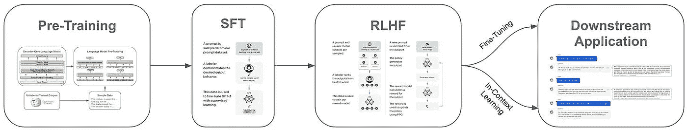

# 人工智能的民主化：MosaicML 对开源 LLM 运动的影响

> 原文：[`towardsdatascience.com/democratizing-ai-mosaicmls-impact-on-the-open-source-llm-movement-7972ff12dd92?source=collection_archive---------5-----------------------#2023-10-15`](https://towardsdatascience.com/democratizing-ai-mosaicmls-impact-on-the-open-source-llm-movement-7972ff12dd92?source=collection_archive---------5-----------------------#2023-10-15)

## 高质量的基础模型如何为整个行业开启新的可能性……

 [Cameron R. Wolfe, Ph.D.](https://wolfecameron.medium.com/?source=post_page-----7972ff12dd92--------------------------------)

·

[关注](https://medium.com/m/signin?actionUrl=https%3A%2F%2Fmedium.com%2F_%2Fsubscribe%2Fuser%2F28aa6026c553&operation=register&redirect=https%3A%2F%2Ftowardsdatascience.com%2Fdemocratizing-ai-mosaicmls-impact-on-the-open-source-llm-movement-7972ff12dd92&user=Cameron+R.+Wolfe%2C+Ph.D.&userId=28aa6026c553&source=post_page-28aa6026c553----7972ff12dd92---------------------post_header-----------) 发表于 [Towards Data Science](https://towardsdatascience.com/?source=post_page-----7972ff12dd92--------------------------------) ·13 分钟阅读·2023 年 10 月 15 日

--

（照片由 [Raimond Klavins](https://unsplash.com/@raimondklavins?utm_content=creditCopyText&utm_medium=referral&utm_source=unsplash) 提供，来源于 [Unsplash](https://unsplash.com/photos/Ql6JhGdbQg0?utm_content=creditCopyText&utm_medium=referral&utm_source=unsplash)）

最近，我们回顾了许多关于创建开源大语言模型（LLMs）的当前研究。在所有这些工作中，模型都是使用一个通用框架和一些简单的组件创建的；见下文。

创建和优化 LLM 的多步骤过程（来自 [12, 13]）

尽管这个框架有几个步骤，但第一步无疑是最重要的。通过广泛的、高质量的预训练来创建一个更强大的基础模型，可以在通过监督微调（SFT）和来自人类反馈的强化学习（RLHF）来优化 LLM 时实现更好的结果。然后，由于使用了改进后的模型，下游应用程序的效果也会更好。预训练（基础）模型是任何 LLM 应用程序的共同起点。

直到最近，开源基础模型要么表现不佳，与其专有模型相比差距较大，要么只能用于研究。然而，这种情况在 MosaicML 发布了 MPT-7B 和 MPT-30B [1, 2]之后发生了变化。这些开源基础模型达到了令人印象深刻的性能水平，且免费提供…
