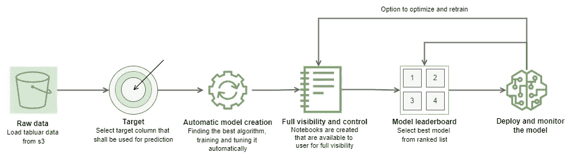
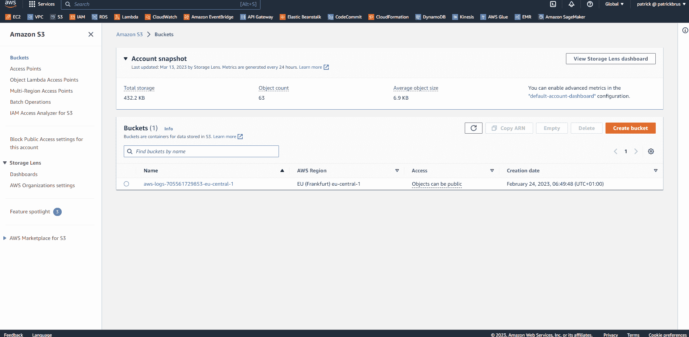
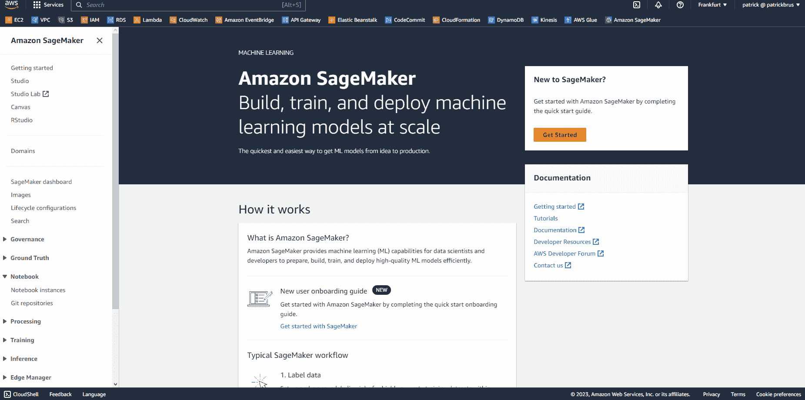
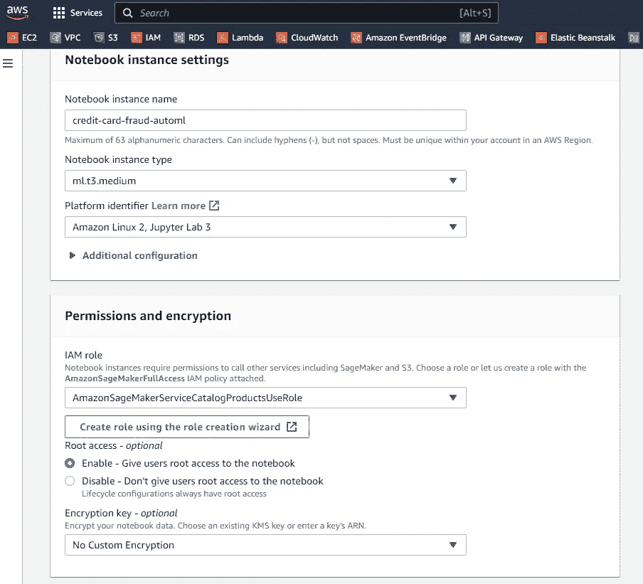

# 使用 AWS SageMaker AutoML 实现机器学习的民主化

> 原文：[`towardsdatascience.com/democratizing-machine-learning-with-aws-sagemaker-automl-150299c70396`](https://towardsdatascience.com/democratizing-machine-learning-with-aws-sagemaker-automl-150299c70396)

## 概述

[](https://brus-patrick63.medium.com/?source=post_page-----150299c70396--------------------------------)[](https://towardsdatascience.com/?source=post_page-----150299c70396--------------------------------) [Patrick Brus](https://brus-patrick63.medium.com/?source=post_page-----150299c70396--------------------------------)

·发表于 [Towards Data Science](https://towardsdatascience.com/?source=post_page-----150299c70396--------------------------------) ·16 分钟阅读·2023 年 4 月 25 日

--


图片由 [Joshua Sortino](https://unsplash.com/@sortino?utm_source=medium&utm_medium=referral) 提供，来源于 [Unsplash](https://unsplash.com/?utm_source=medium&utm_medium=referral)

# 介绍

AI 目前仍然是最热门的话题之一，尤其是随着 ChatGPT 的崛起。许多公司现在正尝试利用 AI 从数据中提取有用的见解，以优化他们的流程或开发更好的产品。

然而，构建有效的 AI 模型需要在不同领域具备大量专业知识，如数据预处理、模型选择、超参数调优等。所有这些领域都可能耗时且需要专业知识。

这就是 AutoML 发挥作用的地方。AutoML 自动化了构建 AI 模型所需的许多领域。

AutoML 正迅速成为企业和数据科学家们喜爱的解决方案。它使组织能够利用 ML 和 AI 做出明智的决策，而无需成为数据科学专家。随着企业对 ML 需求的增加，AutoML 提供了一种简单高效的方式来创建准确的模型，无论个人的专业知识水平如何。

在本文中，我们将考察市场上一个非常流行的 AutoML 工具——AWS SageMaker AutoML，并展示如何利用它解决复杂的 ML 使用案例。

我将用传统的手动方法训练一个模型，并将其结果与 AWS SageMaker AutoML 产生的结果进行比较。

我将使用 Kaggle 上的信用卡欺诈检测数据集进行对比 [1]。你可以在[这里](https://www.kaggle.com/datasets/mlg-ulb/creditcardfraud)找到数据集。

在本文结束时，你将清楚了解 AutoML 如何帮助利用 ML 驱动有意义的见解并做出明智的决策。

# AWS SageMaker AutoML



图 1：AWS SageMaker AutoML 概述（作者提供的图像，基于 [2]）。

图 1 展示了 AWS SageMaker AutoML 解决的不同步骤概述。

其包含以下步骤：

1.  **数据准备：** 你可以轻松地将数据上传到 Amazon S3。一旦数据上传完毕，SageMaker AutoML 会自动分析数据，以检测任何缺失值、异常值或需要转换的数据类型。

1.  **自动模型创建：** AWS SageMaker AutoML 自动训练多个机器学习模型，使用不同的超参数和算法，以确定最适合你数据的模型。它还提供了自动模型调优，调整所选模型的超参数以进一步优化其性能。它还为你创建运行模型选择的笔记本，以便你可以全面了解在此过程中执行了什么。

1.  **模型部署：** 一旦选择了最佳模型，AWS SageMaker 提供将模型部署到 SageMaker 端点或批处理转换作业的选项，在那里它可以用于对新数据进行预测。此外，AWS SageMaker Model Monitor 可以用于在出现问题（如数据漂移、概念漂移等）时发出警报。它还提供了重新训练模型的新数据、更新模型的超参数或算法以提升性能的工具。

AWS SageMaker AutoML 提供了一个 [Python SDK](https://sagemaker.readthedocs.io/en/stable/api/training/automl.html)，可以用于启动 AutoML 作业，并且有一个 [GitHub 仓库](https://github.com/aws/amazon-sagemaker-examples/tree/main/autopilot)，其中包含了各种不同的笔记本示例，展示了如何利用 AutoML SDK 处理具体的机器学习用例。

市场上还提供了其他强大且知名的 AutoML 工具，如 Google Cloud AutoML 和 H2O.ai，它们也有各自独特的优势和劣势。

Google Cloud AutoML 以其易用性和直观的界面而闻名，这使其非常适合机器学习新手，并且对编码要求不高。Google Cloud AutoML 支持图像数据、视频数据、文本数据和表格数据。你可以在 [这里](https://cloud.google.com/vertex-ai/docs/training-overview?hl=en#automl) 了解更多信息。

H2O.ai 以其速度和可扩展性而闻名，使其成为处理大数据集和复杂模型的良好选择。H2O.ai 提供 R、Python 或网页 GUI 的接口。你可以在 [这里](https://h2o.ai/platform/h2o-automl/) 了解更多关于其功能的信息。

# 手动训练方法

在使用 AWS SageMaker AutoML 来生成信用卡数据集的分类器之前，我首先以传统方式训练一个模型：从头开始做所有事情。

这将有助于我建立一个基准，并将我的方法与 AWS 的 AutoML 方法进行比较，期望 AWS SageMaker AutoML 能超越我的手动半优化方法。

对于手动方法，我使用了 Scikit-learn，并将通过下一章中强调的步骤进行操作。

你也可以在我的 GitHub 仓库中找到完整的笔记本 [这里](https://github.com/patrickbrus/aws-auto-ml-credit-fraud/blob/master/manual-approach/credit-fraud-ml.ipynb)。

## **数据准备**

我从 CSV 文件中加载数据集，首先检查数据集的分布。这显示数据集高度不平衡，只有**0.17%**的样本是正例。

数据集本身不包含任何缺失值。

然后我将数据集按 80/20 的比例拆分为训练集和测试集，并将数据缩放到 0–1 的范围内，同时标准化器仅在训练集上进行训练，以避免一些过于乐观的结果。

下面可以找到这些步骤的代码。

```py
import sys
import os
import numpy as np
import seaborn as sns
import pandas as pd
import matplotlib.pyplot as plt
from sklearn.model_selection import train_test_split
from sklearn.preprocessing import StandardScaler

# step 1: Load the dataset from the csv file. 
# You can download the dataset from Kaggle
filepath = os.path.join("data", "creditcard.csv")
df = pd.read_csv(filepath)

# step 2: check data imbalance on target
count_neg_class = np.sum(df["Class"] == 0)
count_pos_class = np.sum(df["Class"] == 1)

print(f"There are {count_neg_class} negative samples ({np.round(100 * count_neg_class / num_samples, 2)} % of total data).")
print(f"There are {count_pos_class} positive samples ({np.round(100 * count_pos_class / num_samples, 2)} % of total data).")

# step 3: split data into train and test set
X = df.drop(columns="Class").to_numpy()
y = df["Class"].to_numpy()

X_train, X_test, y_train, y_test = train_test_split(X, y, test_size=0.2)

# step 4: scale the data
scaler = StandardScaler()

X_train = scaler.fit_transform(X_train)
X_test = scaler.transform(X_test)
```

通常，广泛的探索性数据分析（EDA）也会是数据准备步骤的一部分。但是为了这个实验，我没有进行广泛的 EDA，因为数据集已经为 ML 做好了充分的准备。

但请记住，这部分对于你的 ML 训练的成功也是至关重要的，并且通常需要一些时间。

## 模型选择

下一步是找出哪种 ML 算法最适合数据。为此，我首先使用逻辑回归训练一个非常简单的基准模型。这是为了有一个简单的模型，我可以将其与更复杂的算法进行比较。

目标应始终是：保持简单！不要从神经网络开始，如果一个简单的算法，比如逻辑回归，能够完成任务，神经网络可能更难以解释。

逻辑回归模型的 F1-Score 为**70.6%**。我使用 F1-Score 来评估这个数据集，因为它高度不平衡，准确率不会提供有意义的模型评估，因为仅预测所有类别为负例就已经会导致超过**99%**的准确率！

下面可以找到训练基准模型的代码。

```py
from sklearn.metrics import accuracy_score
from sklearn.metrics import f1_score
from sklearn.metrics import precision_score
from sklearn.metrics import recall_score
from sklearn.metrics import confusion_matrix

from sklearn.linear_model import LogisticRegression

log_model = LogisticRegression()
log_model.fit(X_train, y_train)

preds = log_model.predict(X_test)
print(f"Test Acc: {accuracy_score(y_test, preds)}")
print(f"Test F1-Score: {f1_score(y_test, preds)}")
print(f"Test Precision: {precision_score(y_test, preds)}")
print(f"Test Recall: {recall_score(y_test, preds)}")
```

好的，我们现在有了基准。接下来尝试不同的分类算法及其默认超参数，看看哪个算法在数据上表现最好。

我使用了 5 折交叉验证来训练以下每个模型：

+   决策树

+   支持向量机

+   k-近邻

+   随机森林

+   自适应提升

```py
from sklearn.tree import DecisionTreeClassifier
from sklearn.svm import SVC
from sklearn.neighbors import KNeighborsClassifier
from sklearn.ensemble import RandomForestClassifier
from sklearn.ensemble import AdaBoostClassifier
from sklearn.model_selection import cross_val_predict

dict_models = {
    "Decision Tree": DecisionTreeClassifier(),
    "SVM": SVC(),
    "Nearest Neighbor": KNeighborsClassifier(),
    "Random Forest": RandomForestClassifier(),
    "Ada Boost": AdaBoostClassifier()
}

# train all models by using the models dictionary
results_dict = {}
for model_name, model in dict_models.items():
    print(f"Start training {model_name}...")
    preds = cross_val_predict(model, X_train, y_train, cv=5)

    f1 = f1_score(y_train, preds)
    precision = precision_score(y_train, preds)
    recall = recall_score(y_train, preds)

    print(f"F1-Score: {f1}")
    print(f"Precision: {precision}")
    print(f"Recall: {recall}")
    print("\n\n")
    results_dict[model_name] = (f1, precision, recall)

# create a pandas dataframe with the results on sort on f1-score
df_results = (pd.DataFrame.from_dict(results_dict, orient="index", columns=["F1-Score", "Precision", "Recall"])
             .sort_values(by="F1-Score", ascending=False))
df_results
```

随机森林算法以**86.9%**的 F1-Score 取得了最佳结果，其次是最近邻算法，F1-Score 为**84.8%**。不错！

下一步是对获胜者（随机森林）进行微调。

为此，我选择了一些要尝试的超参数值，并使用随机化交叉验证搜索来找到最佳超参数组合，从而获得最佳模型。

这次评估的代码：

```py
from sklearn.model_selection import RandomizedSearchCV

params = {
    "n_estimators": [10, 20, 30, 60, 80, 100],
    "criterion" : ["gini", "entropy"],
    "max_depth" : [4, 5, 10, None],
    "min_samples_split": [2, 4, 6],
    "class_weight": [None, "balanced", "balanced_subsample"]
}

clf_rf = RandomizedSearchCV(RandomForestClassifier(), params, n_iter=50, scoring="f1", cv=5, verbose=1, n_jobs=-1)
clf_rf.fit(X_train, y_train)

# let's print the best score and save the best model
print(f"Best f1-score: {clf_rf.best_score_}")
print(f"Best parameters: {clf_rf.best_params_}")
best_random_forest_model = clf_rf.best_estimator_
```

最佳模型的得分多多少少与我在没有调整超参数的情况下获得的模型相同。真是浪费时间 ;)

## 模型评估

最后但同样重要的是，我在留出的测试集上评估我的最终模型，以查看它在真实世界数据上的表现。

```py
final_preds = best_random_forest_model.predict(X_test)

f1 = f1_score(y_test, final_preds)
precision = precision_score(y_test, final_preds)
recall = recall_score(y_test, final_preds)

print(f"F1-Score: {f1}")
print(f"Precision: {precision}")
print(f"Recall: {recall}")
```

这给了我一个**82%**的 F1 分数，接近我们的验证结果，但略低一些。

我知道通过更多地调整模型可以获得更多收益。但本文的目标只是做一些基本的机器学习，并将结果与 AutoML 进行比较，以查看 AutoML 的表现有多好，以及与仅自己做基础训练相比，运行 AutoML 作业的工作量有多大。

# 使用 AWS SageMaker AutoML 进行训练

好了，现在我有了基准，可以尝试使用 AWS SageMaker AutoML 以更少的努力获得更好的模型。

我将再次指导你完成不同的步骤，并提供所有这些步骤的代码片段。你还可以在我的 GitHub 仓库[这里](https://github.com/patrickbrus/aws-auto-ml-credit-fraud/blob/master/sagemaker-auto-ml/fraud-detection-auto-ml-sagemaker.ipynb)找到完整的笔记本。

## 数据上传

为了使 SageMaker AutoML 正常工作，数据需要存储在 s3 中。因此，我首先创建一个桶，然后将 CSV 文件上传到这个桶中（Gif 1）。



Gif 1：创建 s3 桶并将 CSV 文件上传到此桶中（Gif 由作者提供）。

## 设置 SageMaker 笔记本

下一步是设置我可以在其中运行 AutoML 作业的环境。

为了实现这一点，我首先在 SageMaker 中创建一个笔记本，然后在其中创建和运行代码。

在 AWS 中，其他服务对服务的访问由 IAM 角色处理。SageMaker 笔记本附带了一个带有默认访问权限的 IAM 角色。但为了访问我之前创建的 s3 桶，我首先必须明确调整附加到该角色的策略。

Gif 2 展示了创建笔记本的完整过程以及我如何调整笔记本角色的策略。质量不太好，但我仍然认为看到所采取的操作顺序是有价值的。此外，我还添加了一些创建笔记本时的具体设置截图（图 2），并在我的 GitHub 仓库[这里](https://github.com/patrickbrus/aws-auto-ml-credit-fraud/blob/master/sagemaker-auto-ml/notebook-role-policy.json)添加了我附加到笔记本角色的完整策略。



Gif 2：创建笔记本的过程以及如何调整附加 IAM 角色的策略（Gif 由作者提供）。



图 2：AWS SageMaker 笔记本创建设置（图片由作者提供）。

## 运行 AWS SageMaker AutoML 作业

现在我终于可以开始运行一些代码了。

我运行的代码大多是从[这个](https://gitlab.com/juliensimon/aim307/-/blob/master/aim307.ipynb)AWS 教程笔记本中复制并调整过来的。

首先，我将数据从 s3 加载到 Pandas 数据框中，并设置一些 SageMaker AutoML 之后所需的一般变量。

```py
import numpy as np 
import pandas as pd
import boto3
import sagemaker
import os, sys

# get some variables required for AutoML later
sess   = sagemaker.Session()
bucket = sess.default_bucket()                     
region = boto3.Session().region_name
prefix = 'sagemaker/fraud-detection-auto-ml'
# Role when working on a notebook instance
role = sagemaker.get_execution_role()

# get some sagemaker clients
sm = boto3.Session().client(service_name='sagemaker',region_name=region)
sm_rt = boto3.Session().client('runtime.sagemaker', region_name=region)

# load data from s3
bucket_data = 'patrick-fraud-detection-ml-kaggle'
filename = 'creditcard.csv'
s3 = boto3.client('s3') 
obj = s3.get_object(Bucket=bucket_data, Key=filename) 
df = pd.read_csv(obj['Body']) # 'Body' is a key word
```

然后，我将数据集分成训练集和保留测试集。我将使用后者来比较 AutoML 模型和我自己训练的模型。然后，我将数据上传到 SageMaker 创建的 s3 桶中，以便 AutoML 任务可以直接从 s3 访问它。

```py
from sklearn.model_selection import train_test_split

train_data, test_data = train_test_split(df, test_size=0.2)

# Save to CSV files and upload to S3
train_file = "automl-train.csv"
train_data.to_csv(train_file, index=False, header=True, sep=',') # Need to keep column names
train_data_s3_path = sess.upload_data(path=train_file, key_prefix=prefix + "/train")
print("Train data uploaded to: " + train_data_s3_path)

# save test file only to a CSV file 
# -> will be send as POST request to inference endpoint later
test_file = "automl-test.csv"
test_data.to_csv(test_file, index=False, header=False, sep=',')
```

现在我可以设置 AutoML 任务并启动它。你可以在 SageMaker SDK 文档[这里](https://boto3.amazonaws.com/v1/documentation/api/latest/reference/services/sagemaker/client/create_auto_ml_job.html#)找到有关所需输入参数和设置的更多信息。

```py
from time import gmtime, strftime, sleep
# setup config for input data
input_data_config = [{
      'DataSource': {
        'S3DataSource': {
          'S3DataType': 'S3Prefix',
          'S3Uri': 's3://{}/{}/input'.format(bucket,prefix)
        }
      },
      'TargetAttributeName': 'Class'  # the column we want to predict
    }
]

# setup config for output data
output_data_config = { 'S3OutputPath': 's3://{}/{}/output'.format(bucket,prefix) }

# Optional parameters
problem_type = 'BinaryClassification'
job_objective = { 'MetricName': 'F1' } # using F1 because of highly imbalanced dataset

# launch the AutoML job 
# but: limit to max. 20 candidates to limit overall execution time
timestamp_suffix = strftime('%d-%H-%M-%S', gmtime())

auto_ml_job_name = 'fraud-detection-' + timestamp_suffix

sm.create_auto_ml_job(AutoMLJobName=auto_ml_job_name,
                      InputDataConfig=input_data_config,
                      OutputDataConfig=output_data_config,
                      AutoMLJobConfig={"CompletionCriteria": {"MaxCandidates": 20}},
                      AutoMLJobObjective=job_objective,
                      ProblemType=problem_type,
                      RoleArn=role)
```

任务现在在后台运行，为你创建所需的 AWS 资源。

然后，你可以运行以下代码来跟踪 AutoML 任务的进度：

```py
job_run_status = sm.describe_auto_ml_job(AutoMLJobName=auto_ml_job_name)['AutoMLJobStatus']

print(job_run_status)

while job_run_status not in ('Failed', 'Completed', 'Stopped'):
    describe_response = sm.describe_auto_ml_job(AutoMLJobName=auto_ml_job_name)
    job_run_status = describe_response['AutoMLJobStatus']

    print (describe_response['AutoMLJobStatus'] + " - " + describe_response['AutoMLJobSecondaryStatus'])
    sleep(60)
```

任务正在通过以下阶段：

1.  数据分析

1.  特征工程

1.  模型调优

1.  合并 AutoML 任务报告

AWS SageMaker 为你生成了两个笔记本。一个用于探索数据，另一个用于定义在数据集上进行评估的不同候选模型。如果你对 AWS SageMaker 在这些阶段运行的代码感兴趣，可以查看这些笔记本。

可以列出 AWS SageMaker 执行的所有实验，并且你也可以列出所有探讨过的候选模型。我在这篇文章中没有添加代码，但如果你对其工作原理感兴趣，可以在我的[笔记本](https://github.com/patrickbrus/aws-auto-ml-credit-fraud/blob/master/sagemaker-auto-ml/fraud-detection-auto-ml-sagemaker.ipynb)中找到代码。

## 在测试集上评估最佳候选模型

现在是时候在保留测试集上测试最佳候选模型了。对我来说，这是最有趣的部分，因为它显示了 AutoML 是否能比我的手动方法得分更高。

首先，我从 AWS SageMaker AutoML 任务中检索最佳候选模型。

```py
best_candidate = sm.describe_auto_ml_job(AutoMLJobName=auto_ml_job_name)['BestCandidate']
best_candidate_name = best_candidate['CandidateName']
```

接下来，我将在 AWS 中将此模型作为端点进行托管，以便我可以将数据发送给它进行推断。

```py
timestamp_suffix = strftime("%d-%H-%M-%S", gmtime())
model_name = best_candidate_name + timestamp_suffix + "-model"

# create a model in SageMaker that can be hosted as endpoint
model_arn = sm.create_model(
    Containers=best_candidate["InferenceContainers"], ModelName=model_name, ExecutionRoleArn=role
)

# setup config for endpoint (including instance type)
epc_name = best_candidate_name + timestamp_suffix + "-epc"
ep_config = sm.create_endpoint_config(
    EndpointConfigName=epc_name,
    ProductionVariants=[
        {
            "InstanceType": "ml.m5.2xlarge",
            "InitialInstanceCount": 1,
            "ModelName": model_name,
            "VariantName": "main",
        }
    ],
)

# deploy endpoint
ep_name = best_candidate_name + timestamp_suffix + "-ep"
create_endpoint_response = sm.create_endpoint(EndpointName=ep_name, EndpointConfigName=epc_name)

# wait until endpoint is ready for inference
sm.get_waiter("endpoint_in_service").wait(EndpointName=ep_name)
```

最后但同样重要的是，读取包含测试数据的 CSV 文件，并将数据发送到最终模型进行推断。然后，我将预测结果与真实值进行比较，并使用相当手动的方法来计算真正例、假负例、假正例和真正例。

老实说，我只是懒得自己实现一些东西，而是再次从 AWS SageMaker 教程笔记本中适配了代码，你可以在[这里](https://gitlab.com/juliensimon/aim307/-/blob/master/aim307.ipynb)找到。

```py
tp = tn = fp = fn = count = 0

with open('automl-test.csv') as f:
    lines = f.readlines()
    for l in lines[1:]:   # Skip header
        l = l.split(',')  # Split CSV line into features
        label = l[-1]     # Store 0/1 label
        l = l[:-1]        # Remove label
        l = ','.join(l)   # Rebuild CSV line without label

        response = sm_rt.invoke_endpoint(EndpointName=ep_name, ContentType='text/csv', Accept='text/csv', Body=l)

        response = response['Body'].read().decode("utf-8")
        #print ("label %s response %s" %(label,response))

        if '1' in label:
            # Sample is positive
            if '1' in response:
                # True positive
                tp=tp+1
            else:
                # False negative
                fn=fn+1
        else:
            # Sample is negative
            if '0' in response:
                # True negative
                tn=tn+1
            else:
                # False positive
                fp=fp+1
        count = count+1
        if (count % 100 == 0):   
            sys.stdout.write(str(count)+' ')

# get final scores
 # Confusion matrix

accuracy  = (tp+tn)/(tp+tn+fp+fn)
precision = tp/(tp+fp)
recall    = tp/(tp+fn)
f1        = (2*precision*recall)/(precision+recall)

print ("Accuracy: %.4f, Precision: %.4f, Recall: %.4f, F1: %.4f" % (accuracy, precision, recall, f1))
```

最终模型在保留测试集上达到了**96%**的 F1-Score！

这太棒了！相比之下，我用 Scikit-Learn 训练的模型仅达到了**82%**的 F1-Score。

# AutoML 的不足之处

AutoML 确实强大，可以帮助加快 ML 开发周期。但也存在一些使用 AutoML 的不足之处，需要认识到。

AutoML 的主要限制之一是它可能是一种黑箱方法，因为它自动化了构建机器学习模型的大部分过程。这可能使数据科学家很难完全理解模型的工作原理，并可能限制他们微调模型或调试出现的问题的能力。

AWS 通过提供 Jupyter 笔记本来应对这一问题，展示了数据探索或探索不同 ML 候选模型等阶段的代码。这已经有助于获取一些见解，但如果代码或 AutoML 任务的结果出现任何问题，数据科学家无法对背后的代码进行更改，因为一切都是自动生成的。

使用 AutoML 的另一个潜在缺点是，它可能比传统的机器学习模型构建方法灵活性差。AutoML 优化了效率和易用性，但这可能以定制选项或处理专用数据集或模型的能力为代价。

在这篇文章中，我使用了一个非常简单的数据集，AWS SageMaker AutoML 能够训练出一个不错的候选模型。但如果遇到更具挑战性的数据集，AutoML 在这些数据集上的表现如何还不清楚。

# 个人发现

在这一章中，我想强调我在使用 AWS SageMaker AutoML 时的个人发现。

我首先意识到使用和设置 AWS SageMaker AutoML 相当复杂。我个人在使用 AWS 和编码方面有一定经验，但对于没有太多先前知识的人来说，使用 AWS SageMaker AutoML 的学习曲线可能过于陡峭。

我还认为文档质量不够好。我一开始在文档中很难找到关于端到端用例的内容。后来我找到了视频培训和 GitHub 上的示例笔记本，但我个人更喜欢书面的文档而非视频。

另外，请注意成本。我最初在 SageMaker AutoML 中进行了一些尝试，频繁运行 AutoML 任务，因为我想在其中尝试不同的东西。但这并没有像我预期的那样便宜，结果我在这个实验上的花费比计划的要多。

# 结论

在这篇文章中，我将 AWS SageMaker AutoML 与使用 Scikit-Learn 手动训练模型进行了比较。

作为数据集，我决定使用欺诈检测数据集，因为它由于高度不平衡而存在一些困难。

然后我手动尝试找出一个好的分类器，并在 AWS SageMaker AutoML 中做了同样的尝试。

我最终将两种方法的结果在一个保留测试集上进行了比较，其中 AWS SageMaker AutoML 的得分高于我的手动方法，达到了**96%**的 F1 分数，而我的手动方法为**82%**。

这表明，使用 AWS SageMaker AutoML 在你的数据集上训练 ML 模型以快速生成一个可用的分类器是完全合理的。

甚至不需要在机器学习领域有专门的知识就可以使用 AWS SageMaker AutoML。

当然，我的手动方法也需要谨慎对待。

我没有花很多时间来优化我的最终分类器，我相当确定，如果再多投入一些时间，我会在保留测试集上获得更好的结果。

至少我希望如此 ;)

但这篇文章的目的就是展示如何轻松地利用 AutoML 库为你的机器学习数据集创建一个分类器。

最终，这不一定是你投入到产品中的最终版本，但你可以至少做一个快速的初步概念验证，以查看你是否能从数据中获得有用的信息。

# 展望

迄今为止，我只深入了解了 AWS SageMaker AutoML，但肯定也很有兴趣查看其他服务，例如 Google Cloud AutoML。

我计划在不久的将来对 Google Cloud 的 Vertex AI 进行全面评估，然后会在 Medium 上写出我的发现。

然后我还可以具体讨论 Sagemaker 与 Google Cloud 的表现相比如何。

所以如果你不想错过这些内容，请关注我！

感谢你读到我的文章的最后！我希望你喜欢这篇文章。如果你想将来阅读更多类似的文章，关注我以保持更新。

[**如果你想了解更多关于机器学习和云计算的信息，请加入我的邮件列表。**](https://medium.com/subscribe/@brus-patrick63)

# 联系方式

[**LinkedIn**](https://www.linkedin.com/in/patrick-brus/) | [**GitHub**](https://github.com/patrickbrus)

# 参考文献

[1]: 机器学习组 — ULB，[“信用卡欺诈检测”](https://www.kaggle.com/datasets/mlg-ulb/creditcardfraud)，Kaggle，2018 年，[数据库内容许可证](https://opendatacommons.org/licenses/dbcl/1-0/) (DbCL) v1.0

[2]: AWS，[Amazon SageMaker Autopilot](https://aws.amazon.com/sagemaker/autopilot/?sagemaker-data-wrangler-whats-new.sort-by=item.additionalFields.postDateTime&sagemaker-data-wrangler-whats-new.sort-order=desc)（访问于 2023 年 4 月 1 日）
