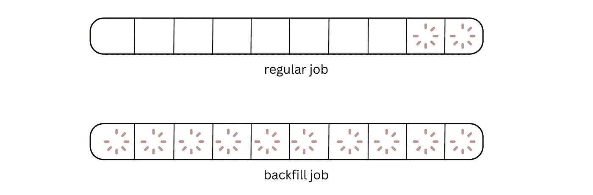
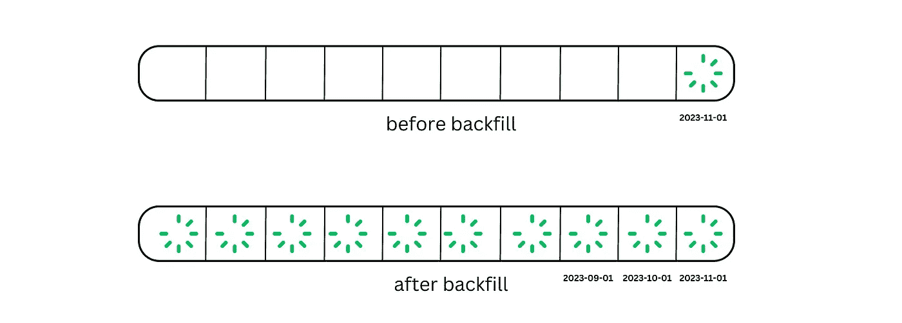
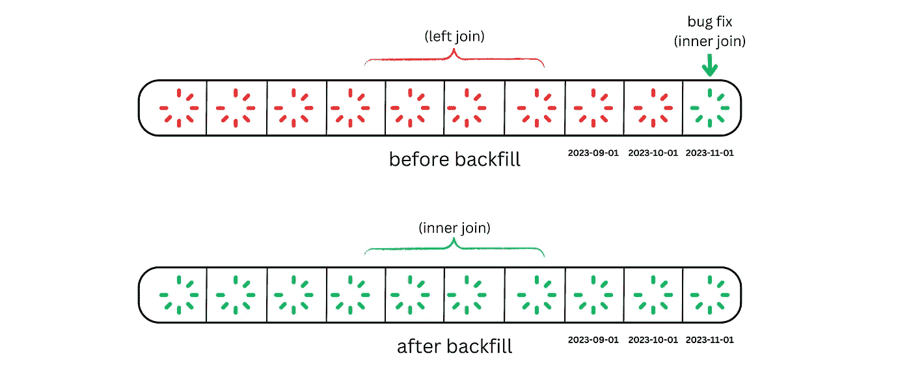
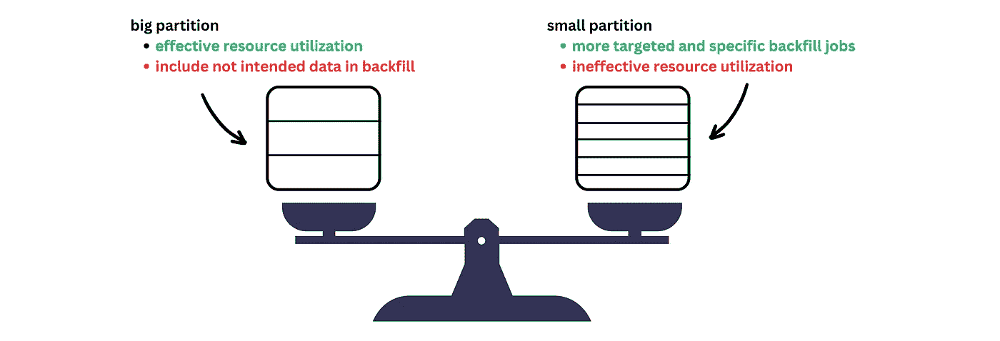
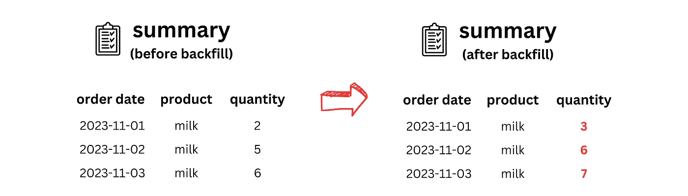

# 解密数据回填

> 原文：[`towardsdatascience.com/demystify-data-backfilling-cf1713d7f7a3`](https://towardsdatascience.com/demystify-data-backfilling-cf1713d7f7a3)

## 让我们谈谈数据工程师的噩梦

[](https://medium.com/@xiaoxugao?source=post_page-----cf1713d7f7a3--------------------------------)[](https://towardsdatascience.com/?source=post_page-----cf1713d7f7a3--------------------------------) [Xiaoxu Gao](https://medium.com/@xiaoxugao?source=post_page-----cf1713d7f7a3--------------------------------)

·发表于 [Towards Data Science](https://towardsdatascience.com/?source=post_page-----cf1713d7f7a3--------------------------------) ·10 分钟阅读·2023 年 11 月 20 日

--


作者创建

作为数据工程师，我们每天都会遇到独特的挑战。但如果有一项令人畏惧的任务，那一定是回填。回填不当意味着处理时间过长、数据污染以及高额的云账单。对了，这也意味着你需要另一个回填任务来修复它。

> 完成第一次成功的数据回填是数据工程师的一项重要经历。— Dagster

回填任务需要一系列数据工程技能才能有效完成，例如验证结果的领域知识、运行回填任务的工具专长以及优化流程的数据库扎实理解。当这些元素交织在一个任务中时，可能会出现问题。

在本文中，我们将深入探讨数据回填的概念、其必要性以及高效实施的方法。无论你是回填新手还是经常对这类任务感到恐慌的人，这篇文章都会让你平静下来，帮助你重拾信心。

## 什么是回填？

回填是将过去缺失的数据填充到之前不存在的新表中，或用新记录替换旧数据的过程。它通常不是一个定期任务，仅在数据管道增量更新表时才需要。



常规任务与回填任务的区别（作者创建）

例如，一个表按`date`列分区。一个常规的每日任务只更新最新的 2 个分区。相比之下，一个回填任务可以更新表中最初的所有分区。如果常规任务每次都更新整个表，那么回填任务就不必要了，因为历史数据会通过常规任务自然更新。

## 那么，我们什么时候需要回填呢？

通常，有一些常见的场景。让我们看看你是否觉得这些场景熟悉。

+   **创建新表并希望填补缺失的历史数据**

你刚刚开发了一个新的表来分析每月的电子商务销售业绩。数据管道只选择发生在给定月份的交易。在部署数据管道时，它仅为当前月份生成报告。要生成历史月度报告，需要一个回填作业。回填作业中更新的分区数量取决于业务需求和源表中的数据可用性。



使用回填作业开发新表（由作者创建）

+   **修复数据管道中的错误并希望更新整个历史数据**

哎呀，你发现了联接逻辑中的错误。它应该是左联接而不是内联接。你迅速修复了这个问题，以确保数据质量，但过去的数据呢？它仍在使用左联接。这里的回填作业是纠正历史数据。



使用回填作业修复错误（由作者创建）

+   **数据管道停机并希望追赶**

数据管道可能会经历几天的停机，从而导致数据缺口。一旦管道恢复，它需要赶上其计划的运行。幸运的是，大多数现代数据编排工具提供自动追赶功能，因此相比其他情况，需要的人工干预较少。


使用回填作业追赶缺失的数据（由作者创建）

*你有其他场景吗？欢迎在评论中与我们分享。*

从图表中可以看出，回填是一个耗时的工作，因为它涉及许多分区。为了防止不必要的复杂性，最佳做法是首先询问团队和利益相关者关于回填数据的预期用途以及是否确实需要回填。回填的时间范围是什么？利益相关者是否能从回填中获得长期收益？随着公司的增长，表格也会增长。**最终，我们可能会达到回填整个表格变得不可行的地步，需要决定在哪里截断。**

另一个需要考虑的重要问题是我们是否有权限修改历史数据。在某些情况下，修改像财务数据这样的历史数据对公司可能意义重大，特别是当这些数据经过审计时。更新历史记录前理解业务影响至关重要，因为没有人愿意涉及法律问题。

## 表分区

现在，让我们看看回填的技术方面。如果不提及表分区，就无法讨论回填。分区是增量表更新的一种方法。分区列将表划分为一组分区。回填作业会一个接一个地更新这些分区。分区也是一种并行单元，允许多个回填作业同时执行。

每个分区的大小与分区数量之间存在权衡。更多的分区会导致数据更为细粒度地划分，回填作业会更加有针对性和具体。然而，通常建议不要创建过小的分区（例如，小于 1G），因为这样可能无法有效利用资源。想象一下比较打开一个 1GB 的文件和打开 10 个分别为 100MB 的文件——前者通常更高效。另一方面，过大的分区可能导致回填作业时间过长，因为这可能涉及到超出范围的数据。



大分区和小分区之间的权衡（由作者创建）

每个数据仓库根据元数据的访问方式和资源的最佳利用情况有不同的推荐分区大小。此外，还需要考虑哪种粒度对表最有意义。例如，一种常见的分区策略是在`date`列上进行分区，其中我们期望数据在各天之间均匀分布。然而，如果每一天的数据量很小，那么另一种方法可以是按月份或年份进行分区。

## 回填策略

如前所述，回填作业需要数据工程技能的综合运用。成功的回填作业的大部分关键因素实际上是在作业本身开始之前就已经确定了。

**将数据回填纳入初始表设计讨论**

早期涉及回填讨论是一种良好的实践，因为这可能会影响表的设计，例如前面提到的分区策略。特别是当常规作业并不每次都更新整个表时，必须有一个回填计划，以便在需要时更新历史数据。

对于某些表，例如小型维度表，每次进行全表刷新可能是一个更为理想的选择，以避免需要回填。另一方面，对于具有一致线性增长的事实表，增量表更新更为可取，因为我们不希望云账单或服务器成本随着数据增长而线性增长。

**使数据管道具有幂等性**

幂等性指的是多次运行相同操作而不改变结果。这是每个数据工程师应该了解的基本数据管道设计原则。在代码更改之前，使用相同输入重新运行相同的 Airflow 任务应始终产生相同的输出。你不希望看到任何重复或不同的输出。因此，对于增量表更新，使用 `replace` 而非 `append` 模式以避免重复。此外，在转换逻辑中使用 Airflow 变量如 `data_interval_end`，而不是像 `current_date()` 这样的时间敏感函数，因为 `current_date()` 的输出会根据作业的执行时间而不同。

幂等性是成功回填的关键前提，它确保数据只根据预期的变化进行更改，而不受其他因素影响。在这个例子中，数据框中的 `date` 列始终表示预期的计划时间，而不是与任务的实际执行时间相关联。

```py
def transform_data(data_interval_end):
    # do not use date.today()
    return pd.DataFrame(data={'date': [data_interval_end], 'quantity': [10]})

transform_task = PythonOperator(
    task_id='transform_data',
    python_callable=transform_data,
    op_args=[{{ data_interval_end}}],  
    provide_context=False,
    dag=dag,
)
```

**对回填范围做出明智决策并执行**

如果范围选择不当，回填作业可能会非常繁重。一个分区所花费的时间和金钱在回填作业中会被放大。你可以利用历史运行来提前估算成本和时间。如果估算超出预算，那么首先了解用例。这是为了进行一次性的分析吗？那么考虑在现有表上创建一个临时视图。范围对于用例来说是否太大？那么将分区大小减少到更可管理的水平。如果仍然太多，那么可能需要考虑使用更高效或更具成本效益的技术。

另一个非常重要的点是评估下游影响。在回填源表时，可能需要将回填扩展到下游表。我知道揭示所有隐藏连接可能很具挑战性。但如果这是你团队面临的重大挑战，考虑利用数据血缘工具系统性地识别所有下游依赖关系。

一旦范围定义好，就该采取行动了。幸运的是，许多数据工具原生支持回填。在 [Airflow](https://airflow.apache.org/docs/apache-airflow/stable/cli-and-env-variables-ref.html#backfill) 中，你可以通过 Airflow UI 重新运行任务，也可以使用命令 `airflow dags backfill`。在 [dbt](https://docs.getdbt.com/docs/build/incremental-models#how-do-i-rebuild-an-incremental-model) 中，你可以使用命令 `dbt run --full-refresh` 或传递自定义变量，例如 `dbt run -s my_model --vars '{"start":"2023-11-01"}'`。像 [Dagster](https://docs.dagster.io/concepts/partitions-schedules-sensors/backfills) 和 [Mage](https://docs.mage.ai/orchestration/backfills/overview) 等其他工具也有自己运行回填作业的方法。

对于模式更改要小心。对于兼容的更改，如添加新列，许多数据工具会在回填作业中为第一个分区之前的记录填充空值。对于不兼容的更改，如删除列或更改数据类型，你需要重新创建整个表。

**使用 DDL 或 DML 回填表格**

好消息是，有替代方法可以回填表格，从而无需执行许多耗时的 Airflow 运行。实际上，我们往往只希望回填特定的列，而不是所有列。因此，针对无关列进行计算是资源的低效使用。

一个捷径是使用 DDL 或 DML 更新表格。例如，在`quantity`的变换从`quantity = amount * price`改为`quantity = amount * price * exchange_rate`的情况下。我们可以简单地使用`UPDATE`语句回填表格：

```py
UPDATE my_table
SET quantity = amount * price * exchange_rate
WHERE date >= '2023-11-01'
```

在大多数情况下，这比在 Airflow 中运行回填作业更高效。对于不兼容的模式更改，如果重新创建整个表非常昂贵，可以考虑使用`DDL`删除列或更改数据类型。

**并行回填作业**

另一个优化技巧是将回填作业并行化。如果 10 个 Airflow 回填作业更新 10 个分区，它们可以在这些配置到位的情况下并行运行：

```py
depend_on_past = False
max_active_runs = X # The maximum number of active DAG runs allowed for the DAG.
max_active_tasks = X # The total number of tasks that can run at the same time for a given DAG run.
concurrency = X # The maximum number of task instances allowed to run concurrently across all active DAG runs for a given DAG.
max_active_tis_per_dag = X # The maximum number of times that the same task can run concurrently across all DAG runs.
```

这种方法允许同时更新多个分区，消除了顺序等待的需要。然而，我们需要确保数据仓库支持并发写入并检查其并发级别。此外，分区之间不应有任何依赖关系，例如今天的分区不能基于昨天的分区进行计算。

**常规运行中的回填**

有时我们也希望在正常运行中自动“回填”表格。这是什么意思？例如，当常规批处理包含一些迟到的记录，需要对历史数据进行回溯更新时，就会发生这种情况。由于这种情况非常频繁，因此应将其纳入常规运行中，而不是手动触发它。

一个例子是统计电子商务中的累计总购买订单。现在，假设一种情况，客户在 11 月 1 日下了订单，但由于系统延迟，订单信息直到 11 月 3 日才被处理。当 11 月 3 日收到订单信息时，应该更新 11 月 1 日和 11 月 2 日的数据。


延迟订单的交易数据（由作者创建）



回填前后的汇总表（由作者创建）

在这种情况下，“内部回填”是由输入数据的更新触发的，而不是由转换逻辑触发的。根据记录的延迟情况，作业可能会更新多个分区。延迟越大，需要调整的分区就越多。因此，监控性能至关重要，可能需要实施另一种流程以防止常规作业过载。

```py
# pseudo code
earliest_order_date = find_earliest_date_in_batch(new_batch)
partitions_to_be_updated = f"select * from summary where date >={earliest_order_date}"
# can be heavy
updated_partitions = update_historical_data(partitions_to_be_updated, new_batch)
update_table(updated_partitions)
```

## 回填后

哇，到目前为止有很多阅读内容。我很高兴你能看到这里。触发回填作业并不是过程的结束。我们必须积极监控性能，因为问题可能在过程中任何时候出现。逐个分区回填表的一个关键好处是，如果过程中出现问题，你可以灵活地从失败的分区恢复，而不是从头开始。

沟通是任何数据变更的关键。确保利益相关者参与过程。考虑在作业完成后创建脚本，自动发送通知并请求对回填表的所有用户进行验证。

## 结论

就是这样了！希望你喜欢，并以某种方式获得启发。回填作业是具有挑战性的，但它不应该是一个黑箱或让你感到害怕的东西。下次，不必在按下按钮前深呼吸并祈祷：))

对于已经熟悉回填的人。我希望你仍然从这篇文章中获得了一些见解。如果你有额外的技巧或窍门，请随时分享——我们很想听到你的声音！干杯！

## 参考

[](https://dagster.io/blog/backfills-in-ml?source=post_page-----cf1713d7f7a3--------------------------------) [## 数据与机器学习中的回填：入门 | Dagster 博客]

### 从糟糕的回填中恢复对任何数据工程师来说都是一个痛苦的经历。

[dagster.io](https://dagster.io/blog/backfills-in-ml?source=post_page-----cf1713d7f7a3--------------------------------)
