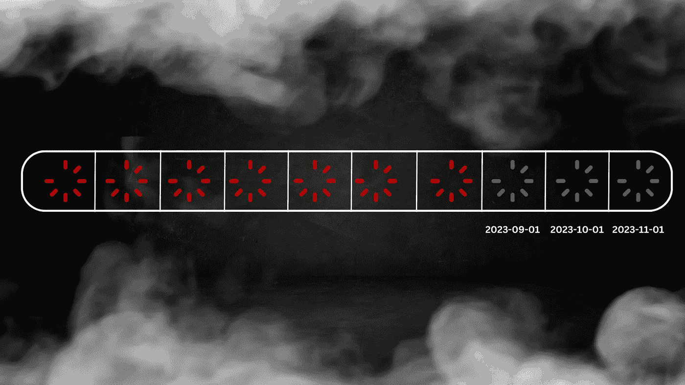

# 揭开数据回填的神秘面纱

> 原文：[`towardsdatascience.com/demystify-data-backfilling-cf1713d7f7a3?source=collection_archive---------3-----------------------#2023-11-20`](https://towardsdatascience.com/demystify-data-backfilling-cf1713d7f7a3?source=collection_archive---------3-----------------------#2023-11-20)

## 让我们谈谈数据工程师的噩梦

 [Xiaoxu Gao](https://medium.com/@xiaoxugao?source=post_page-----cf1713d7f7a3--------------------------------)

·

[关注](https://medium.com/m/signin?actionUrl=https%3A%2F%2Fmedium.com%2F_%2Fsubscribe%2Fuser%2F2adc5a07e772&operation=register&redirect=https%3A%2F%2Ftowardsdatascience.com%2Fdemystify-data-backfilling-cf1713d7f7a3&user=Xiaoxu+Gao&userId=2adc5a07e772&source=post_page-2adc5a07e772----cf1713d7f7a3---------------------post_header-----------) 发表在 [Towards Data Science](https://towardsdatascience.com/?source=post_page-----cf1713d7f7a3--------------------------------) · 10 分钟阅读 · 2023 年 11 月 20 日 

--

由作者创建

作为数据工程师，我们每天都会遇到独特的挑战。但如果有一项令人生畏的任务，那必然是回填。一个有缺陷的回填意味着过长的处理时间、数据污染和巨额的云计算费用。而且，没错，这也意味着你还需要再进行一次回填作业来修复它。

> 完成你的第一次成功数据回填是数据工程的一个重要历程。 — Dagster

回填任务需要一系列数据工程技能才能有效完成，比如验证结果的领域知识、运行回填作业的工具专业知识，以及优化过程的数据库扎实理解。当所有这些元素交织在一个任务中时，事情可能会出错。

在本文中，我们将探讨数据回填的概念、其必要性以及高效的实施方法。无论您是回填的新手还是经常对此类任务感到恐慌的人，本文都将平复您的心绪，并帮助您重拾信心。

## 什么是回填？

回填是在新表中填充过去缺失的数据的过程，这些表之前不存在，或者替换旧表中...
