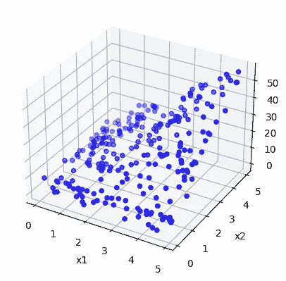
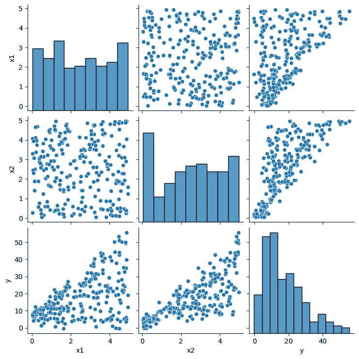
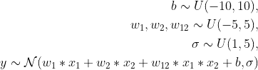
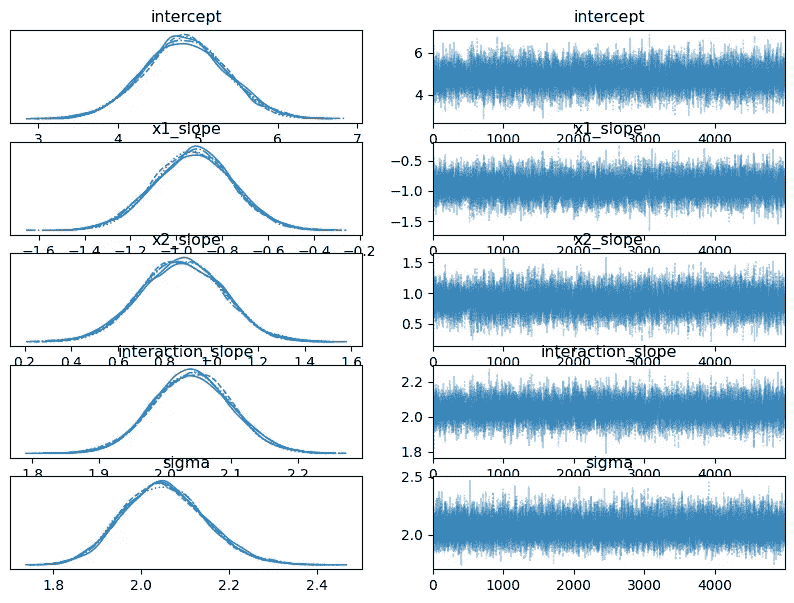
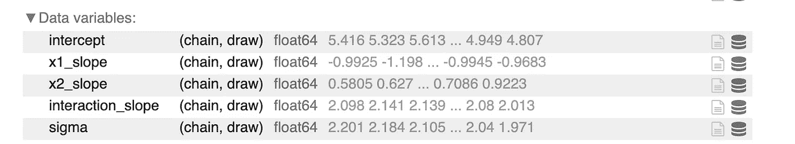
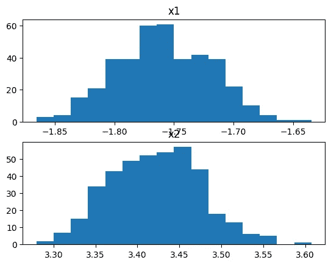

# **揭示贝叶斯模型的奥秘：通过 SHAP 值揭示可解释性**

> 原文：[`towardsdatascience.com/demystifying-bayesian-models-unveiling-explanability-through-shap-values-8405f618f4e0?source=collection_archive---------14-----------------------#2023-05-12`](https://towardsdatascience.com/demystifying-bayesian-models-unveiling-explanability-through-shap-values-8405f618f4e0?source=collection_archive---------14-----------------------#2023-05-12)

## **通过一个引人入胜的玩具示例探索 PyMC 的见解与 SHAP 框架**

[](https://medium.com/@vanillaxiangshuyang?source=post_page-----8405f618f4e0--------------------------------)[](https://towardsdatascience.com/?source=post_page-----8405f618f4e0--------------------------------) [Shuyang Xiang](https://medium.com/@vanillaxiangshuyang?source=post_page-----8405f618f4e0--------------------------------)

·

[关注](https://medium.com/m/signin?actionUrl=https%3A%2F%2Fmedium.com%2F_%2Fsubscribe%2Fuser%2F9b74bc8c860d&operation=register&redirect=https%3A%2F%2Ftowardsdatascience.com%2Fdemystifying-bayesian-models-unveiling-explanability-through-shap-values-8405f618f4e0&user=Shuyang+Xiang&userId=9b74bc8c860d&source=post_page-9b74bc8c860d----8405f618f4e0---------------------post_header-----------) 发表在 [Towards Data Science](https://towardsdatascience.com/?source=post_page-----8405f618f4e0--------------------------------) · 6 分钟阅读 · 2023 年 5 月 12 日 [](https://medium.com/m/signin?actionUrl=https%3A%2F%2Fmedium.com%2F_%2Fvote%2Ftowards-data-science%2F8405f618f4e0&operation=register&redirect=https%3A%2F%2Ftowardsdatascience.com%2Fdemystifying-bayesian-models-unveiling-explanability-through-shap-values-8405f618f4e0&user=Shuyang+Xiang&userId=9b74bc8c860d&source=-----8405f618f4e0---------------------clap_footer-----------)

--

[](https://medium.com/m/signin?actionUrl=https%3A%2F%2Fmedium.com%2F_%2Fbookmark%2Fp%2F8405f618f4e0&operation=register&redirect=https%3A%2F%2Ftowardsdatascience.com%2Fdemystifying-bayesian-models-unveiling-explanability-through-shap-values-8405f618f4e0&source=-----8405f618f4e0---------------------bookmark_footer-----------)

# **贝叶斯模型与可解释性之间的差距**

SHAP 值（SHapley Additive exPlanations）是一种基于博弈论的方法，用于提高机器学习模型的透明度和可解释性。然而，这种方法以及其他机器学习可解释性框架，鲜有应用于贝叶斯模型，而贝叶斯模型提供了捕捉参数估计不确定性的后验分布，而不是经典机器学习模型使用的点估计。

虽然贝叶斯模型提供了一个灵活的框架来整合先验知识、调整数据限制和进行预测，但遗憾的是，使用 SHAP 对其进行解释是困难的。SHAP 将模型视为一个游戏，将每个特征视为该游戏中的一个玩家，但贝叶斯模型不是一个游戏。它更像是一个包含来自后验分布的参数的游戏集合。当模型不仅仅是一个游戏时，我们该如何解释它？

本文尝试通过玩具示例使用 SHAP 框架解释贝叶斯模型。该模型建立在 PyMC 上，PyMC 是一个用于 Python 的概率编程库，允许用户通过简单的 Python API 构建贝叶斯模型，并使用马尔可夫链蒙特卡罗方法对其进行拟合。

主要思想是将 SHAP 应用于从贝叶斯网络生成的确定性模型的集合。对于每个特征，我们将从生成的确定性模型中获得一个 SHAP 值样本。可解释性将由所有获得的 SHAP 值样本提供。我们将通过一个简单的示例来说明这种方法。

所有实现都可以在这个[笔记本](https://colab.research.google.com/drive/1BXZoicPYSY8ljNlh46WAYrrDBVRdoyqw#scrollTo=6Bk2sYdgKWMS)中找到。

# 使用 PyMC 进行贝叶斯建模

## 数据集

考虑以下由作者创建的数据集，其中包含 250 个点：变量 y 依赖于 x1 和 x2，两个变量都在 0 到 5 之间变化。下图说明了数据集：



图片作者提供：数据集

让我们使用配对图快速探索数据。从中我们可以观察到以下几点：

1.  变量 x1 和 x2 不相关。

1.  两个变量在某种程度上都对输出 y 有贡献。也就是说，单一变量不足以获得 y。



图片作者提供：数据的配对图

## 使用 PyMC 进行建模

让我们使用 PyMC 构建一个贝叶斯模型。在不深入讨论任何统计学书籍中可以找到的细节的情况下，我们只需回顾一下贝叶斯机器学习模型的训练过程涉及根据观察到的数据和先验知识使用[贝叶斯规则](https://en.wikipedia.org/wiki/Bayes%27_theorem)来更新模型的参数。

我们将模型的结构定义如下：



图片作者提供：模型结构

在定义了先验和似然之后，我们将使用 PyMC 标准采样算法 NUTS，该算法旨在自动调整其参数，例如步长和 leapfrog 步数，以实现对目标分布的有效探索。它通过树探索重复模拟点在参数空间中的轨迹，并确定是否接受或拒绝样本。此类迭代在达到最大迭代次数或达到收敛水平时停止。

你可以在下面的代码中看到，我们设置了先验，定义了似然，然后使用 PyMC 运行了采样算法。

让我们使用 PyMC 构建一个贝叶斯模型。贝叶斯机器学习模型训练涉及基于观察数据和先验知识更新模型参数，使用[贝叶斯规则](https://en.wikipedia.org/wiki/Bayes%27_theorem)。我们不会在这里详细介绍，因为你可以在任何统计学书籍中找到。

我们可以定义如下的模型结构：


作者提供的图像：模型结构

对于上述定义的先验和似然，我们将使用 PyMC 标准采样算法 NUTS。该算法旨在自动调整其参数，如步长和跳跃步数，以实现对目标分布的高效探索。它重复进行树形探索，以模拟点在参数空间中的轨迹，并决定是否接受或拒绝样本。迭代在达到最大迭代次数或实现收敛水平时停止。

在下面的代码中，我们设置先验，定义似然，然后使用 PyMC 运行采样算法。

```py
with pm.Model() as model:

    # Set priors.
    intercept=pm.Uniform(name="intercept",lower=-10, upper=10)
    x1_slope=pm.Uniform(name="x1_slope",lower=-5, upper=5)
    x2_slope=pm.Uniform(name="x2_slope",lower=-5, upper=5)
    interaction_slope=pm.Uniform(name="interaction_slope",lower=-5, upper=5)
    sigma=pm.Uniform(name="sigma", lower=1, upper=5)

    # Set likelhood.
    likelihood = pm.Normal(name="y", mu=intercept + x1_slope*x1+x2_slope*x2+interaction_slope*x1*x2, \
                           sigma=sigma, observed=y)
    # Configure sampler.
    trace = pm.sample(5000, chains=5, tune=1000, target_accept=0.87, random_seed=SEED)
```

下面的踪迹图展示了模型中参数的后验分布。



作者提供的图像：模型的后验

# 使用 SHAP 解释模型

我们现在希望在上述模型上实现 SHAP。注意，对于给定的输入（x1, x2），模型的输出 y 是条件概率。因此，通过从获得的后验中绘制一个样本，我们可以获得一个确定性的模型及其所有特征的 SHAP 值。或者，如果我们绘制一个参数样本的集合，我们将得到一个确定性模型的集合，因此，所有特征的 SHAP 值样本。

可以使用以下代码获得后验分布，我们每条链绘制 200 个样本：

```py
with model: 
    idata = pm.sample_prior_predictive(samples=200, random_seed=SEED)
    idata.extend(pm.sample(200, tune=2000, random_seed=SEED)here
```

以下是后验数据变量的表格：



作者提供的图像：后验样本

接下来，我们为每个绘制的模型参数样本计算一对 SHAP 值。下面的代码对参数进行循环，为每个参数样本定义一个模型，并计算感兴趣的 x_test=(2,3)的 SHAP 值。

```py
background=np.hstack((x1.reshape((250,1)),x2.reshape((250,1))))
shap_values_list=[]
x_test=np.array([2,3]).reshape((-1,2))
for i in range(len(pos_intercept)): 
  model=SimpleModel(intercept=pos_intercept[i],
                    x1_slope=pos_x1_slope[i], 
                    x2_slope=pos_x2_slope[i], 
                    interaction_slope=pos_interaction_slope[i],
                    sigma=pos_sigma[i])
  explainer = shap.Explainer(model.predict, background)
  shap_values = explainer(x_test)
  shap_values_list.append(shap_values.values)
```

输入的二维 SHAP 值的结果集如下所示：



作者提供的图像：SHAP 值样本

从上面的图表中，我们可以推断出以下内容：

1.  两个维度的 SHAP 值大致形成一个正态分布。

1.  第一个维度对模型有正贡献（中位数为-1.75），而第二个维度有负贡献（中位数为 3.45）。不过，第二个维度的贡献绝对值更大。

# 结论

本文探讨了 SHAP 值的使用，这是一种基于博弈论的方法，用于提高机器学习模型的透明度和可解释性，应用于贝叶斯模型。通过一个玩具示例演示了 SHAP 如何应用于贝叶斯网络。

请注意，SHAP 是模型无关的。因此，随着其实现方式的变化，未来可能可以直接将 SHAP 应用于贝叶斯模型本身。
