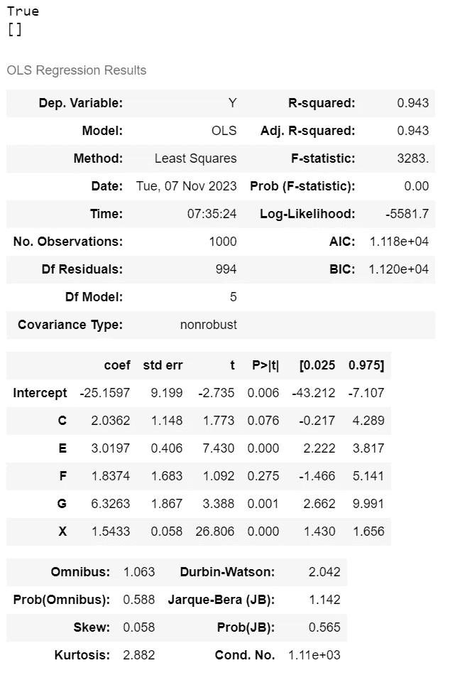

# 揭示依赖关系及其在因果推断和因果验证中的重要性

> 原文：[`towardsdatascience.com/demystifying-dependence-and-why-it-is-important-in-causal-inference-and-causal-validation-4263b18d5f04`](https://towardsdatascience.com/demystifying-dependence-and-why-it-is-important-in-causal-inference-and-causal-validation-4263b18d5f04)

## 一步步了解依赖关系的概念及如何使用 Python 应用于验证有向无环图

[](https://grahamharrison-86487.medium.com/?source=post_page-----4263b18d5f04--------------------------------)[](https://towardsdatascience.com/?source=post_page-----4263b18d5f04--------------------------------) [Graham Harrison](https://grahamharrison-86487.medium.com/?source=post_page-----4263b18d5f04--------------------------------)

·发表于 [Towards Data Science](https://towardsdatascience.com/?source=post_page-----4263b18d5f04--------------------------------) ·阅读时间 16 分钟·2023 年 11 月 11 日

--


照片由 [Ana Municio](https://unsplash.com/@lamunix?utm_content=creditCopyText&utm_medium=referral&utm_source=unsplash) 提供，来源于 [Unsplash](https://unsplash.com/photos/gray-and-brown-stones-on-gray-ground-PbzntH58GLQ?utm_content=creditCopyText&utm_medium=referral&utm_source=unsplash)

# 介绍

因果推断是数据科学的一个新兴分支，关注事件和结果之间的因果关系，它具有显著提升机器学习为组织创造的价值的潜力。

例如，传统的机器学习算法可以预测哪些贷款客户可能违约，从而实现对客户的主动干预。然而，尽管这个算法有助于减少贷款违约，但它并不了解违约发生的原因，而了解违约原因能够解决根本问题。在这种情况下，主动干预可能不再必要，因为导致违约的因素已经被彻底解决。

这就是因果推断的承诺，它具有为能够利用这一潜力的组织带来显著影响和成果的潜力。

有多种不同的方法，但最常见的方法通常是通过增加“有向无环图”来开始，这种图能够封装和可视化数据中的因果关系，然后使用因果推断技术提出“如果如何”的问题。

## 问题

封装数据中因果关系的有向无环图（DAG）通常由数据科学家和领域专家一起手动（或半手动）构建。因此，DAG 可能是错误的，这将使任何因果计算无效，导致错误的结论和可能的错误决策。

## 机会

存在一系列用于“因果验证”的技术（验证 DAG 是否与数据一致的过程），如果这些技术有效，它们可以最小化或消除 DAG 中的错误，从而确保计算和结论是无误的。

## 前进的道路

随机变量之间的统计学依赖概念可以用来确定 DAG 中存在的关系是否也存在于数据中；如果存在，则 DAG 更有可能是正确的，如果不存在，则更可能是错误的。

# 入门

我们需要一个示例 DAG 来解决问题，这个 DAG 具有足够的节点和链接，以便深入探索因果验证……


本文中将使用的示例 DAG — 作者图片

DAG 中的每个节点要么对其他节点产生因果影响，要么其他节点对其产生因果影响，箭头的方向表示因果影响的方向。例如，“B”的一个原因是“C”，而“C”的一个原因是“F”。

示例 DAG 是虚构的，因此节点的字母/名称并不重要，不过“X”意图代表“处理”，而“Y”代表“效果”，所有其他节点对 X 对 Y 的真实效果在实际例子中会产生一些因果影响，从而掩盖 X 对 Y 的真实效果。

请注意，浅蓝色节点没有输入（在因果术语中称为外生），而深蓝色节点有一个或多个输入（在术语中称为内生）。

为了开始，我们还需要一些与 DAG 匹配的数据。下面的数据集完全是合成的，由作者生成。它完全封装并匹配 DAG 所建议的结构，并且没有错误或故障关系……


与 DAG 相关的合成虚构数据集 — 作者图片

我们开始之前还需要一种扩展 pandas `DataFrame` 和 `Series` 类以添加自定义方法的方式，以便我们编写的代码既简洁又易于理解。

这里有一个我之前文章的链接，提供了一个关于如何扩展数据框以及为什么这样做很有用的端到端教程……

[](/how-to-extend-pandas-dataframes-with-custom-methods-to-supercharge-code-functionality-readability-f4ae983ad715?source=post_page-----4263b18d5f04--------------------------------) ## 如何通过自定义方法扩展 Pandas DataFrames 以增强代码功能性和可读性

### 一个逐步指南，介绍如何通过自定义方法扩展 pandas DataFrames，包括实施的完整示例 …

[towardsdatascience.com

# 理解依赖性

依赖性的一个定义如下 …

> 两个随机变量之间的依赖性意味着一个变量的发生或值会影响另一个变量的发生或值。如果一个变量的发生或值提供了关于另一个变量的发生或值的信息，则这两个变量被认为是相关的。

为了深入了解这一点，让我们再看一下我们的示例 DAG，并考虑影响节点 Y 的因果因素 …


突出显示影响 Y 的因果因素的 DAG — 作者提供的图片

在这个可视化中，我们可以看到节点 Y 是由 5 个不同因素造成的（因此也依赖于这些因素） — C、E、F、G 和 X。

现在让我们再看一下 DAG 所表示的数据 …


df_causal DataFrame 中前 5 行数据的回顾 — 作者提供的图片

这个合成数据集是作者为方便本文创建的，所以我知道节点 Y 与这些依赖因素之间的关系如下 …

**Y = 3C + 3E + 2F + 2.5G + 1.5X + ε**

（注：ε 代表误差项）

… 这一点可以通过选择一行（在这种情况下，我选择了第 3 行）并将该公式应用于数据来测试和验证 …

```py
Y = -422.1827393983049, error term = 48.75941612372628
```

现在我们可以看到 Y 如何以及为何依赖于 C、E、F、G 和 X。如果这些依赖变量中的一个值发生变化，Y 的值也会变化。我们还可以从 DAG 中看到 Y 不应依赖（例如）节点 D，因为 D 和 Y 之间没有连接。

“Y 依赖于 C、E、F、G 和 X” 的表述可以用数学公式表示如下 …


作者提供的图片

… 以及“Y 与 D 独立” 的表述如下 …


作者提供的图片

⫫ 符号被称为“双向交叉符号”，但 ⫫̸ 符号没有一个普遍接受的名称，所以我个人习惯称之为“斜杠双向交叉符号”。

一些文章和文本使用单向交叉符号（⊥ 和 ⊥̸）代替双向交叉符号，但双向交叉符号更为常见，因此这是我在本文及相关 Python 代码中采用的标准。

回顾一下，两个随机变量之间的统计依赖意味着“一个变量的发生或数值影响另一个变量的发生或数值”，我们现在知道这在 DAG 中是如何可视化的，如何用数学公式表示（例如**Y = 3C + 3E + 2F + 2.5G + 1.5X + ε**），以及如何用斜杠双向箭头符号表示（例如 Y ⫫̸ C、E、F、G、X）。

# 从依赖关系到因果验证

因果推断通常从一组数据开始，然后用 DAG 扩充这些数据。虽然有些新兴技术可以从数据中反向工程生成 DAG，但它们并不准确或一致，因此开发 DAG 的最常见方法是询问领域专家他们认为的因果关系，然后验证或测试该 DAG 是否符合数据，并在验证失败时进行必要的修正。

DAG 已经提出 Y 依赖于 C、E、F、G 和 X，如果这种依赖在数据中存在，那么可以确信指向节点 Y 的因果链接是有效和正确的，并且可以用如下数学符号表示……


图片由作者提供

这个看起来吓人的公式其实非常容易理解。第一个斜杠双向箭头符号的“G”下标表示“在图中”（即 DAG），而第二个“D”下标表示“在数据中”（注意，我见过一些文献中使用“P”下标，但“D”对我来说更有意义，因此我采用了“D”）。

具备这些知识后，整个公式可以被解读为“如果图中的 Y 依赖于 C、E、F、G 和 X，那么 Y 在数据中也应该依赖于 C、E、F、G 和 X”。

因此，我们只需要一个 Python 机制来检测数据中的依赖关系。然后可以使用该机制检查 DAG 中具有传入连接的每个节点，如果在数据中检测到的依赖关系与 DAG 中的匹配，我们可以合理地确信没有虚假的连接（因果链接），并且 DAG 在这方面是数据的有效表示。

# 观察数据中的依赖关系

让我们开始可视化数据中 C、E、F、G 和 X 与我们关注的节点 Y 之间的关系……


图片由作者提供

右侧的图表将 Y 绘制在 x 轴上，将 C、E、F、G 和 X 分别绘制在 y 轴上。如果 Y 依赖于这些其他变量，那么改变其中一个变量的值应该会改变 Y 的值。这意味着应该存在一个正或负的系数，并且这些线应该表现出明显的斜率（向上或向下）。

由于存在明确的斜率，我们可以看到𝑌⫫̸ 𝐶,𝐸,𝐹,𝐺,𝑋是正确的，即 Y 在数据中依赖于 C、E、F、G 和 X**。

但是，如果没有依赖关系，那么改变变量的值对 Y 的影响很小或没有影响，系数应该接近零，且直线应该没有斜率，即应为平坦的。

通过将 Y 和 D 之间的关系添加到图表中可以证明这一点，记住在 DAG 中从 D 到 Y 没有因果联系，因此数据中 Y 和 D 之间也不应该有关系……


作者提供的图像

这正是我们期望的结果。C、E、F、G 和 X 都有明显的斜率，并且具有负或正的系数，清楚地表明如果这些变量的值发生变化，Y 的值也会发生变化，因此 Y 依赖于这些变量。

然而 D 的斜率平坦，系数非常小（仅为-0.029），因此改变 D 的值对 Y 的值几乎没有影响，因此因果关系𝑌⫫𝐷（Y 与 D 无关）在数据中存在。

# 在 Python 中实现数据中的依赖关系

检测数据中依赖关系的提议方法使用了来自 statsmodels.formula.api 库的 ols 类，以执行普通最小二乘（OLS）回归。

可以将 ols 类拟合到数据集中，然后提取和解释数据中存在的系数或斜率。以下是操作方法……


作者提供的图像

总结中的关键数据是中间的表格，该表格对变量 C、E、F、G 和 X 与 Y 之间的关系进行了一些分析。例如，ols 分析提出了以下内容——

𝑌=2.03𝐶+3.02𝐸+1.84𝐹+6.33𝐺+1.54𝑋−25.2

这与我用来创建数据集的公式相距不远，公式是……

𝑌=3𝐶+3𝐸+2𝐹+2.5𝐺+1.5𝑋+ε

最大的差异在于节点 G，但出于验证目的，系数的大小并不重要，只要系数存在且斜率不是平坦的即可。

除了`coef`列外，另一个值得关注的项目是`P>|t|`或 p 值列，其工作方式如下……

1.  零假设是变量（例如 E）与因变量（例如 Y）之间没有关系。

1.  如果 p 值大于 alpha（通常设定为 0.05），则拒绝零假设，即存在关系，即存在依赖性。

例如，E、G 和 X 的 p 值都低于 0.05，因此可以拒绝零假设并假定存在依赖关系。

那么 C 和 F 呢？C 的 p 值为 0.076，略高于 alpha，而 F 的值为 0.275，明显高于我们选择的 alpha（0.05）。

我们可以简单地增加 alpha，直到我们得出所有变量都是依赖的结论，但这种方法从长远来看效果不好，因为它会开始得出不存在的依赖结论。

当我进行最初开发时，我几乎在这一点上放弃了，认为 ols 不能作为检测我的 DAG 和数据中依赖关系的可靠方法，但随后我重新审视了 ols 分析。

对所有 5 个变量可以观察到系数，但 p 值仅在 5 个中的 3 个上具有决定性。我随后转而使用`coef`，但在后续的过程中，我发现 p 值有效而`coef`无效的情况。

在经历了许多令人沮丧的小时和大量的反复试验后，我建立了一种方法，它结合了两个值，并且展现出高度的准确性，经严格测试对比了大量不同的数据和 DAG。

这是我用来检测依赖关系的方法…

```py
VALIDATION SUCCESS: Y is dependent on C in the data
VALIDATION SUCCESS: Y is dependent on E in the data
VALIDATION SUCCESS: Y is dependent on F in the data
VALIDATION SUCCESS: Y is dependent on G in the data
VALIDATION SUCCESS: Y is dependent on X in the data
```

我通过反复试验采用的测试方法如下…

如果 p 值大于 0.05 且系数小于或等于 1.0，则假定没有依赖关系，否则假定存在依赖关系。

这种方法并不遵循统计方法，仅仅考虑 p 值，但大量测试表明它非常可靠。

# 优化 Python 代码

上述方法的一个缺点是公式嵌入在代码中，即在`ols_formula = "Y ~ C + E + F + G + X"`以及`dependent_variable`和`variables`的声明中，这会在实际示例中导致代码重复。

如果能找到一种方法来扩展`DataFrame`类，以便能在任何数据集上通用地进行依赖性测试，那将会更好。

幸运的是，通过使用一种称为“猴子补丁”的技术，向`DataFrame`类添加自定义方法非常简单。如果你想要逐步教程，请查看我的教程文章…

[](/how-to-extend-pandas-dataframes-with-custom-methods-to-supercharge-code-functionality-readability-f4ae983ad715?source=post_page-----4263b18d5f04--------------------------------) ## 如何扩展 Pandas DataFrames 以增强代码功能性和可读性

### 一步步扩展 pandas DataFrames 的自定义方法的指南，包括实现的完整示例…

[towardsdatascience.com

这是优化后的代码，它能够在任何数据集上执行任何依赖性测试…

一旦`DataFrame`类扩展了`dependence`方法，测试任何依赖性测试将变得非常简单。

例如，我们可以尝试𝑌⫫̸𝐶,𝐸,𝐹,𝐺,𝑋，这应该验证为`True`且没有错误…



作者提供的图片

我们可以尝试𝑌⫫̸𝐶,𝐸,𝐹,𝐺,𝑋,𝐷，这应该验证为`False`，表示"D"是一个错误，因为 Y 不依赖于它…


作者提供的图片

这些测试都通过了，并且在我尝试过的所有 DAG 和数据集中成功率非常高，以验证这种方法的准确性。

# 汇总所有内容

总结来说，上述相对较小的代码库实现了令人印象深刻的结果，即能够对任何数据集进行任何依赖性测试，以指示该测试是否通过，并在测试失败时具体突出显示错误。

但这还不够。让我们假设在咨询我们的领域专家时，他们产生的 DAG 包含一个错误，而这些专家假设节点 D 到节点 Y 之间存在因果链（或依赖关系）。

拟议的 DAG 现在看起来是这样的 …


作者提供的图片

凭借我们的新能力，我们可以轻松地对节点 Y 进行 DAG 测试，方法如下 …

… 正如我们在上面的结果中看到的，节点“D”将被准确识别为“错误”。因此，我们已经识别出一个“虚假边”，即在 DAG 中存在但在数据中不存在的链，这告诉我们 DAG 必须进行调整，以移除那个虚假边以确保准确性。

因此，以下条件必须成立 …

1.  从一个拟议的 DAG 开始。

1.  遍历所有节点。

1.  对所有输入连接执行依赖性测试。

1.  收集所有错误的列表。

积累的错误列表将立即指示所有虚假边/连接/依赖关系，这些都必须从拟议的 DAG 中移除，以生成一个没有所有虚假边的新 DAG（即在 DAG 中存在但数据中不存在的依赖关系）。

实现这一点的代码如下 …

# 测试完整算法以检测 DAG 中的虚假边

使用这几行代码，现在可以测试任何 DAG（由一组边表示）与任何数据（由 pandas `DataFrame`表示）以查看 DAG 中是否存在数据中不存在的“虚假”边。

让我们从测试 DAG 正确表示数据中所有因果链的情况开始（记住`df_causal`正确表示 DAG，因为它是作者合成创建的准确表示）…

```py
A ⫫̸ D
B ⫫̸ A, C
C ⫫̸ D, F
E ⫫̸ C
X ⫫̸ A, B, E, F, G
Y ⫫̸ C, E, F, G, X
[]
```

在 DAG 与数据匹配的情况下没有检测到错误。

现在，让我们在 DAG 中添加一个不存在的因果链 D => Y，并重新运行代码 …


作者提供的图片

```py
A ⫫̸ D
B ⫫̸ A, C
C ⫫̸ D, F
E ⫫̸ C
X ⫫̸ A, B, E, F, G
Y ⫫̸ C, D, E, F, G, X
[('D', 'Y')]
```

“虚假”边在 DAG 中被正确识别！但是当 DAG 中存在多个在数据中不存在的虚假因果关系时，我们的算法还会有效吗？

为了测试这一点，在 DAG 中添加一个第二个不存在的因果链 A => E …


作者提供的图片

```py
A ⫫̸ D
B ⫫̸ A, C
C ⫫̸ D, F
E ⫫̸ A, C
X ⫫̸ A, B, E, F, G
Y ⫫̸ C, D, E, F, G, X
[('A', 'E'), ('D', 'Y')]
```

这个测试也通过了。如果向 DAG 中添加两个在数据中不存在的虚假因果关系，它们都能被正确检测到并识别为错误。

# 对算法进行破坏性测试

这些有希望的结果引发了一个问题：“那么，这种方法到底有多准确？”即在 DAG 中可以继续添加多少虚假因果关系而不被正确检测到。

为了回答这些问题，作者设计了一个具有挑战性的测试，首先识别 DAG 中每一个可能存在但实际上不存在的有效因果链接。对于这个特定的 DAG，所有可能链接的完整集合如下……


作者提供的图片

随后，使用测试工具随机选择任何 3 个可能缺失的链接，同时重复测试不同的集合，以确定验证算法的准确性。

结果令人震惊。这里提出的简单算法能够以 100% 的准确率检测任何 3 个虚假链接的组合（使用示例 DAG 和数据）。即便将测试改为选择任何 12 个可能的虚假链接，一样可以达到 90% 的准确率！

# 附录部分：分开与组合依赖测试

在整篇文章中，通过查看所有的“父”节点来建立给定节点的依赖集合，然后创建一个依赖声明，例如……


作者提供的图片

你可能会想知道相同的测试集是否等效……


作者提供的图片

作者面临的挑战之一是假设这些单独的测试等同于检测虚假边的单个整体测试，但测试中的试错过程得出了明确结论，即情况并非如此。

在寻找虚假边 Y => D 时，实现 𝑌⫫̸𝐶,𝐸,𝐹,𝐺,𝑋,𝐷 测试是 100% 可靠的，但单独测试 𝑌⫫̸𝐷 不起作用，这通过执行多轮自动化测试来比较这两种方法的准确性得到了证明。

假设是因为封装这些变量之间关系的公式是**𝑌 = 3𝐶 + 3𝐸 + 2𝐹 + 2.5𝐺 + 1.5𝑋 + ε**，实现依赖的 OLS 测试需要考虑所有变量在一起，这也验证了因果推断中的另一个真理……

> **从数据中逆向工程一个 DAG 是非常困难甚至可能不可能，但当进行“初步尝试”并接近目标时，任务变得可实现**

本节的要点是：在测试依赖关系时，考虑每个节点的所有输入关系，因为如果单独测试，它根本不起作用。

# 连接并保持联系……

如果你喜欢这篇文章，你可以通过成为 Medium 会员，每月仅需 5 美元，即可无限访问更多内容，点击[我的推荐链接](https://grahamharrison-86487.medium.com/membership)（如果你通过此链接注册，我将获得费用的一部分，且对你没有额外费用）。

[](https://grahamharrison-86487.medium.com/membership?source=post_page-----4263b18d5f04--------------------------------) [## 通过我的推荐链接加入 Medium - Graham Harrison

### 作为 Medium 会员，你的会员费用的一部分将会流向你阅读的作者，你可以全面访问所有故事…

grahamharrison-86487.medium.com](https://grahamharrison-86487.medium.com/membership?source=post_page-----4263b18d5f04--------------------------------)

… 或者通过 … 连接

[订阅我的免费电子邮件，以便在我发布新故事时及时获取](https://grahamharrison-86487.medium.com/subscribe)。

[快速浏览我的上一篇文章](https://grahamharrison-86487.medium.com/)。

[下载我的免费战略数据驱动决策框架](https://relentless-originator-3199.ck.page/5f4857fd12)。

访问我的数据科学网站 — [数据博客](https://www.the-data-blog.co.uk/)。
