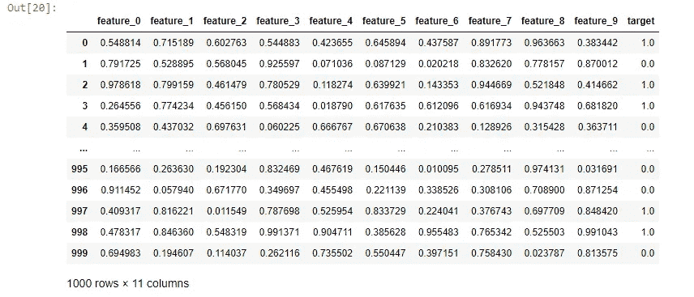
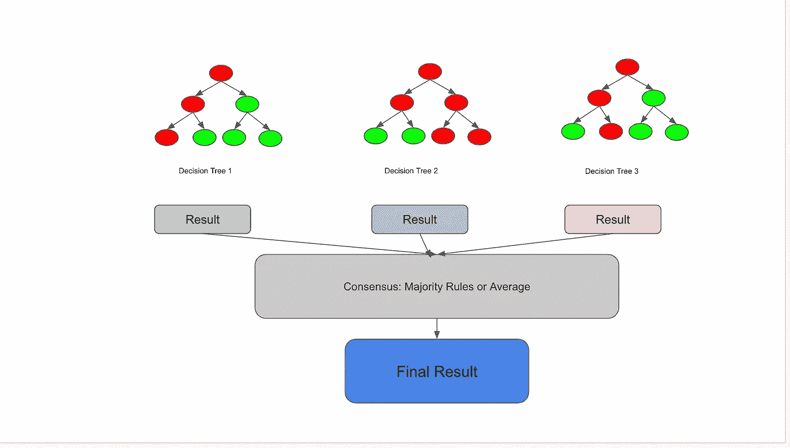
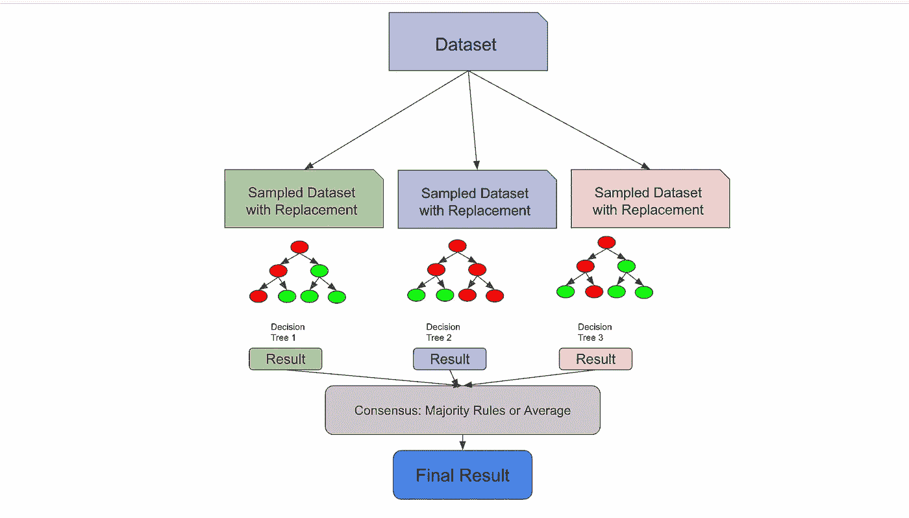
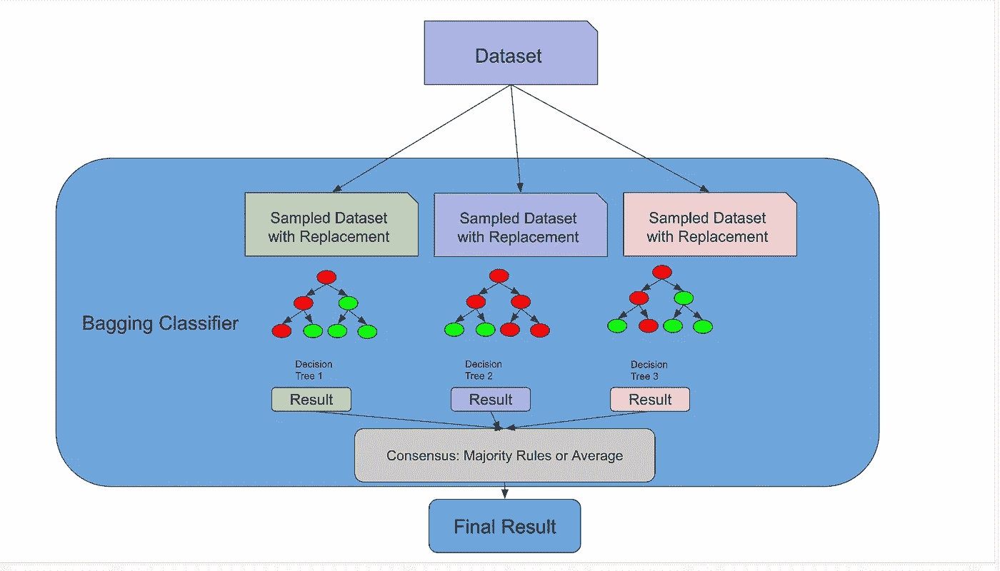
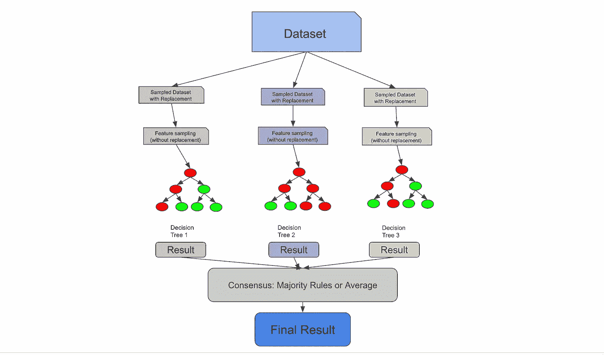
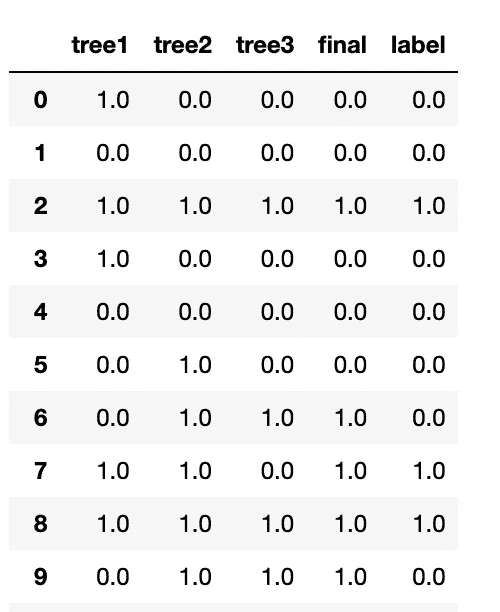
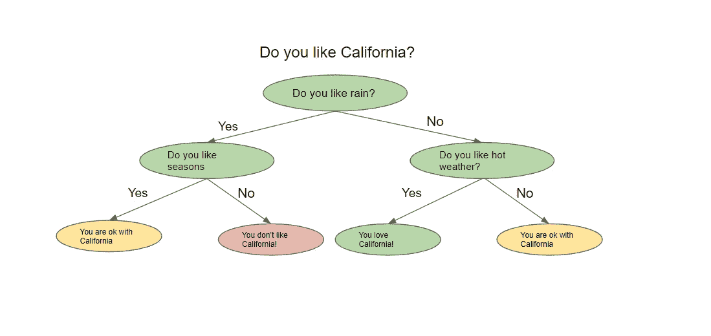
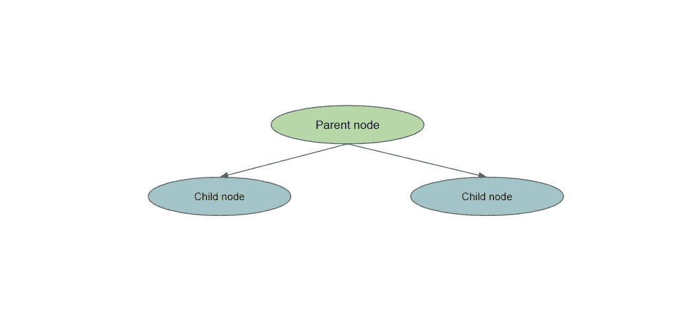
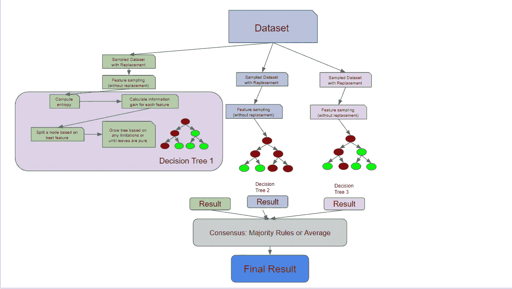

# 解密随机森林

> 原文：[`towardsdatascience.com/demystifying-the-random-forest-8a46f4fd416f?source=collection_archive---------7-----------------------#2023-02-07`](https://towardsdatascience.com/demystifying-the-random-forest-8a46f4fd416f?source=collection_archive---------7-----------------------#2023-02-07)

## 解构并理解这个美妙的算法

[](https://medium.com/@siddarth.ramesh?source=post_page-----8a46f4fd416f--------------------------------)[](https://towardsdatascience.com/?source=post_page-----8a46f4fd416f--------------------------------) [Siddarth Ramesh](https://medium.com/@siddarth.ramesh?source=post_page-----8a46f4fd416f--------------------------------)

·

[关注](https://medium.com/m/signin?actionUrl=https%3A%2F%2Fmedium.com%2F_%2Fsubscribe%2Fuser%2Fcf4e627f4995&operation=register&redirect=https%3A%2F%2Ftowardsdatascience.com%2Fdemystifying-the-random-forest-8a46f4fd416f&user=Siddarth+Ramesh&userId=cf4e627f4995&source=post_page-cf4e627f4995----8a46f4fd416f---------------------post_header-----------) 发表在[Towards Data Science](https://towardsdatascience.com/?source=post_page-----8a46f4fd416f--------------------------------) ·15 分钟阅读·2023 年 2 月 7 日[](https://medium.com/m/signin?actionUrl=https%3A%2F%2Fmedium.com%2F_%2Fvote%2Ftowards-data-science%2F8a46f4fd416f&operation=register&redirect=https%3A%2F%2Ftowardsdatascience.com%2Fdemystifying-the-random-forest-8a46f4fd416f&user=Siddarth+Ramesh&userId=cf4e627f4995&source=-----8a46f4fd416f---------------------clap_footer-----------)

--

[](https://medium.com/m/signin?actionUrl=https%3A%2F%2Fmedium.com%2F_%2Fbookmark%2Fp%2F8a46f4fd416f&operation=register&redirect=https%3A%2F%2Ftowardsdatascience.com%2Fdemystifying-the-random-forest-8a46f4fd416f&source=-----8a46f4fd416f---------------------bookmark_footer-----------)

照片由[Inggrid Koe](https://unsplash.com/@inggridkoe?utm_source=unsplash&utm_medium=referral&utm_content=creditCopyText)拍摄，发布在[Unsplash](https://unsplash.com/photos/kbKEuU-YEIw?utm_source=unsplash&utm_medium=referral&utm_content=creditCopyText)

在经典的机器学习中，随机森林一直是一种万灵药式的模型。

这个模型有几个优点：

+   相比许多其他算法，需要更少的数据预处理，这使得设置更加简单

+   作为分类模型或回归模型均可使用

+   不容易过拟合

+   可以轻松计算特征重要性

在这篇文章中，我想更好地理解构成随机森林的组件。为了实现这一点，我将随机森林分解为其最基本的组件，并解释每个计算层级的情况。最后，我们将更深入地了解随机森林的工作原理以及如何更直观地处理它们。我们将使用的示例将重点放在**分类**上，但许多原则也适用于回归场景。

## 运行随机森林

我们先来调用一个经典的随机森林模式。这是最高水平的，在 python 训练随机森林的时候，很多人都会这样做。



模拟数据。图片由作者提供

如果我想运行一个随机森林来预测我的`target`列，我只需要做以下操作

```py
from sklearn.ensemble import RandomForestClassifier
from sklearn.model_selection import train_test_split

X_train, X_test, y_train, y_test = train_test_split(df.drop('target', axis=1), df['target'], test_size=0.2, random_state=0)

# Train and score Random Forest 
simple_rf_model = RandomForestClassifier(n_estimators=100, random_state=0)
simple_rf_model.fit(X_train, y_train)
print(f"accuracy: {simple_rf_model.score(X_test, y_test)}")

# accuracy: 0.93
```

运行随机森林分类器非常简单。我只定义了`n_estimators`参数，并将`random_state`设置为 0。我可以告诉你，从个人经验来看，很多人只会看到那个`.93`，感到高兴，并在实际应用中部署它。但我们今天不会这样做。

让我们重新审视一下这条无害的线

```py
simple_rf_model = RandomForestClassifier(n_estimators=100, random_state=0)
```

随机种子是大多数数据科学模型的一个特性，确保别人可以复现你的工作。我们不会太担心这个参数。

让我们深入看看`n_estimators`。如果我们看看`scikit-learn` [文档](https://scikit-learn.org/stable/modules/generated/sklearn.ensemble.RandomForestClassifier.html)，定义如下：

> 森林中树的数量。

## 调查决策树的数量

此时，让我们更具体地定义一下随机森林。**随机森林**是一个由许多**决策树**共识的**集成**模型。这个定义可能还不完整，但我们会再回来讨论。



许多决策树相互交流并达成共识。图片由作者提供

这可能会让你觉得，如果你将它分解成以下的东西，你可能会得到一个随机森林：

```py
# Create decision trees
tree1 = DecisionTreeClassifier().fit(X_train, y_train)
tree2 = DecisionTreeClassifier().fit(X_train, y_train)
tree3 = DecisionTreeClassifier().fit(X_train, y_train)

# predict each decision tree on X_test
predictions_1 = tree1.predict(X_test)
predictions_2 = tree2.predict(X_test)
predictions_3 = tree3.predict(X_test)
print(predictions_1, predictions_2, predictions_3)

# take the majority rules
final_prediction = np.array([np.round((predictions_1[i] + predictions_2[i] + predictions_3[i])/3) for i in range(len(predictions_1))])
print(final_prediction)
```

在上面的例子中，我们在`X_train`上训练了 3 棵决策树，这意味着`n_estimators = 3`。在训练了这 3 棵树之后，我们对同样的测试集上的每棵树进行预测，最后取出其中 2 棵树的预测结果。

这种解释有点有道理，但这看起来不完全正确。如果所有的决策树都是在同样的数据上训练的，它们不会大部分达成相同的结论吗，从而抵消了集成的优势？

## 解密带替换的抽样

让我们在之前的定义中加上一个词：随机森林是一个由许多***不相关的***决策树**共识**的**集成**模型。

决策树可以变得不相关，有两种方式：

1.  你有足够大的数据集大小，可以对每个决策树抽样数据的唯一部分。这并不那么流行，通常需要大量的数据。

1.  你可以利用一种叫做**带放回抽样**的技术。带放回抽样意味着从总体中抽取的样本在下一个样本抽取之前会被放回总体。

为了说明带放回抽样的概念，假设我有 5 颗珠子，颜色有 3 种，因此我的总体如下：

`blue, blue, red, green, red`

如果我想抽取一些珠子，我通常会抽出几颗，也许会得到：

`blue, red`

这是因为一旦我捡起了红色的珠子，我就没有把它放回到原来的珠子堆里。

但是，如果我在进行带放回抽样，我实际上可以两次抽取任何一颗珠子。因为红色的珠子被放回了我的堆里，所以我有可能再次抽到它。

`red, red`

在随机森林中，默认情况下是构建约 2/3 原始总体大小的样本。如果我的原始训练数据是 1000 行，那么我输入到树中的训练数据样本可能会有大约 670 行。也就是说，尝试不同的抽样比例将是构建随机森林时调节的一个很好的参数。

以下代码，与之前的代码片段不同，更接近于`n_estimators = 3`的随机森林。

```py
import numpy as np
import pandas as pd
from sklearn.tree import DecisionTreeClassifier
from sklearn.model_selection import train_test_split

# Take 3 samples with replacement from X_train for each tree
df_sample1 = df.sample(frac=.67, replace=True)
df_sample2 = df.sample(frac=.67, replace=True)
df_sample3 = df.sample(frac=.67, replace=True)

X_train_sample1, X_test_sample1, y_train_sample1, y_test_sample1 = train_test_split(df_sample1.drop('target', axis=1), df_sample1['target'], test_size=0.2)
X_train_sample2, X_test_sample2, y_train_sample2, y_test_sample2 = train_test_split(df_sample2.drop('target', axis=1), df_sample2['target'], test_size=0.2)
X_train_sample3, X_test_sample3, y_train_sample3, y_test_sample3 = train_test_split(df_sample3.drop('target', axis=1), df_sample3['target'], test_size=0.2)

# Create the decision trees
tree1 = DecisionTreeClassifier().fit(X_train_sample1, y_train_sample1)
tree2 = DecisionTreeClassifier().fit(X_train_sample2, y_train_sample2)
tree3 = DecisionTreeClassifier().fit(X_train_sample3, y_train_sample3)

# predict each decision tree on X_test
predictions_1 = tree1.predict(X_test)
predictions_2 = tree2.predict(X_test)
predictions_3 = tree3.predict(X_test)
df = pd.DataFrame([predictions_1, predictions_2, predictions_3]).T
df.columns = ["tree1", "tree2", "tree3"]

# take the majority rules 
final_prediction = np.array([np.round((predictions_1[i] + predictions_2[i] + predictions_3[i])/3) for i in range(len(predictions_1))])
preds = pd.DataFrame([predictions_1, predictions_2, predictions_3, final_prediction, y_test]).T.head(20)
preds.columns = ["tree1", "tree2", "tree3", "final", "label"]
preds
```



我们进行带放回抽样，将这些样本输入到树中，生成结果，并达成共识。图片由作者提供。

## Bagging 分类器



之前的架构实际上是一个 Bagging 分类器。图片由作者提供。

我们将在此引入一种*新的*算法，称为**Bootstrap Aggregation**，也称为 Bagging，但请放心，这将与随机森林相关联。我们引入这个新概念的原因是因为正如我们在下图中看到的，直到现在我们所做的一切实际上就是`BaggingClassifier`所做的！

在下面的代码中，`BaggingClassifier`有一个叫做`bootstrap`的参数，它实际上执行了我们刚刚手动完成的带放回抽样步骤。这个参数在`sklearn`的随机森林实现中也存在。如果 bootstrapping 为 false，我们将使用整个总体来训练每个分类器。

```py
import numpy as np
from sklearn.tree import DecisionTreeClassifier
from sklearn.ensemble import BaggingClassifier

# Number of trees to use in the ensemble
n_estimators = 3

# Initialize the bagging classifier
bag_clf = BaggingClassifier(
    DecisionTreeClassifier(), n_estimators=n_estimators, bootstrap=True)

# Fit the bagging classifier on the training data
bag_clf.fit(X_train, y_train)

# Make predictions on the test data
y_pred = bag_clf.predict(X_test)
pd.DataFrame([y_pred, y_test]).T
```

`BaggingClassifiers`非常棒，因为你可以将它们与非决策树的估计器一起使用！你可以插入许多算法，Bagging 将其转化为一个集成解决方案。随机森林算法实际上*扩展*了 Bagging 算法（如果`bootstrapping = true`），因为它部分利用了 Bagging 来形成不相关的决策树。

但是，即使`bootstrapping = false`，随机森林也会进一步*确保*树之间没有相关性——特征抽样。

## 解密特征抽样

特征抽样意味着不仅对行进行抽样，还对列进行抽样。与行不同，随机森林的列是*不带放回*抽样的，这意味着我们不会有重复的列训练一棵树。

采样特征的方法有很多种。你可以指定一个固定的特征最大数量进行采样，取特征总数的平方根，或者尝试使用对数。这些方法各有利弊，具体取决于你的数据和使用场景。



Bagging 扩展了特征采样。图片由作者提供。

下面的代码片段使用`sqrt`技术采样列，采样行，训练 3 棵决策树，并使用多数规则进行预测。我们首先进行有放回采样，然后采样列，训练我们的单独决策树，让树在测试数据上进行预测，然后采用多数规则的共识。

```py
import numpy as np
import pandas as pd
import math
from sklearn.tree import DecisionTreeClassifier
from sklearn.model_selection import train_test_split

# take 3 samples from X_train for each tree
df_sample1 = df.sample(frac=.67, replace=True)
df_sample2 = df.sample(frac=.67, replace=True)
df_sample3 = df.sample(frac=.67, replace=True)

# split off train set
X_train_sample1, y_train_sample1 = df_sample1.drop('target', axis=1), df_sample1['target']
X_train_sample2, y_train_sample2 = df_sample2.drop('target', axis=1), df_sample2['target']
X_train_sample3, y_train_sample3 = df_sample3.drop('target', axis=1), df_sample3['target']

# get sampled features for train and test using sqrt, note how replace=False now
num_features = len(X_train.columns)
X_train_sample1 = X_train_sample1.sample(n=int(math.sqrt(num_features)), replace=False, axis = 1)
X_train_sample2 = X_train_sample2.sample(n=int(math.sqrt(num_features)), replace=False, axis = 1)
X_train_sample3 = X_train_sample3.sample(n=int(math.sqrt(num_features)), replace=False, axis = 1)

# create the decision trees, this time we are sampling columns
tree1 = DecisionTreeClassifier().fit(X_train_sample1, y_train_sample1)
tree2 = DecisionTreeClassifier().fit(X_train_sample2, y_train_sample2)
tree3 = DecisionTreeClassifier().fit(X_train_sample3, y_train_sample3)

# predict each decision tree on X_test
predictions_1 = tree1.predict(X_test[X_train_sample1.columns])
predictions_2 = tree2.predict(X_test[X_train_sample2.columns])
predictions_3 = tree3.predict(X_test[X_train_sample3.columns])
preds = pd.DataFrame([predictions_1, predictions_2, predictions_3]).T
preds.columns = ["tree1", "tree2", "tree3"]

# take the majority rules 
final_prediction = np.array([np.round((predictions_1[i] + predictions_2[i] + predictions_3[i])/3) for i in range(len(predictions_1))])
preds = pd.DataFrame([predictions_1, predictions_2, predictions_3, final_prediction, y_test]).T.head(20)
preds.columns = ["tree1", "tree2", "tree3", "final", "label"]
```

当我运行这段代码时，我发现我的决策树开始预测不同的结果，这表明我们已经去除了树之间的许多相关性。



我的树不再总是彼此一致！图片由作者提供。

## 决策树基础

到目前为止，我们已经拆解了数据如何被输入到众多决策树中。在之前的代码示例中，我们使用了`DecisionTreeClassifier()`来训练决策树，但为了完全理解随机森林，我们需要进一步拆解决策树。

决策树，顾名思义，看起来像一棵倒立的树。从高层次来看，该算法试图通过提问将数据分裂成不同的节点。下图展示了决策树的样子。



示例树。图片由作者提供

决策树根据前一个问题的答案提出一系列问题。每个问题可能有多个答案，我们将其可视化为**节点的分裂**。前一个问题的答案将决定树接下来会提出什么问题。在提出一系列问题后，最终你会得到答案。

但你如何知道你的答案是准确的，或者你问了正确的问题？你实际上可以通过几种不同的方式评估你的决策树，我们当然也会详细解析这些方法。

## 熵与信息增益

在这一点上，我们需要讨论一个新的术语——**熵**。从高层次来看，熵是一种衡量节点中*杂质*或*随机性*水平的方法。顺便提一下，还有一种叫做**基尼杂质**的流行方法来测量节点的杂质，但由于它与熵的概念重叠，我们在这篇文章中不会拆解这个方法，尽管它的计算方式略有不同。一般来说，熵或基尼杂质越高，节点中的方差越大，我们的目标是减少这种不确定性。

决策树试图通过将它们提问的节点分裂成更小、更均匀的节点来最小化熵。熵的实际公式是


为了分解熵，我们回到弹珠的例子：

假设我有 10 个弹珠，其中 5 个是蓝色的，5 个是绿色的。我数据集的熵为 1.0，计算熵的代码如下：

```py
from collections import Counter
from math import log2

# my predictor classes are 0 or 1\. 0 is a blue marble, 1 is a green marble.
data = [0, 0, 0, 1, 1, 1, 1, 0, 1, 0]
# get length of labels
len_labels = len(data)
def calculate_entropy(data, len_labels):
    # we do a count of each class
    counts = Counter(labels)
    # we calculate the fractions, the output should be [.5, .5] for this example
    probs = [count / num_labels for count in counts.values()]
    # the actual entropy calculation 
    return - sum(p * log2(p) for p in probs)

calculate_entropy(labels, num_labels)
```

如果`data`完全被绿色弹珠填充，那么熵将为 0，而熵将随着接近 50%分裂而增加。

每次我们减少熵时，我们就获得了一些关于数据集的信息，因为我们减少了随机性。**信息增益**告诉我们哪个特征相对最好地减少了熵。计算信息增益的方法是：

`entropy(parent) — [weighted_average_of_entropy(children)]`

在这种情况下，父节点是原始节点，子节点是分裂节点后的结果。



分裂一个节点。图片来源：作者

要计算信息增益，我们执行以下操作：

+   计算父节点的熵

+   将父节点分裂为子节点

+   为每个子节点创建`weight`。这是通过`number_of_samples_in_child_node / number_of_samples_in_parent_node`来测量的

+   计算每个子节点的熵

+   通过计算`weight*entropy_of_child1 + weight*entropy_of_child2`来创建`[weighted_average_of_entropy(children)]`

+   从父节点的熵中减去加权熵

下面的代码实现了父节点被分裂成两个子节点的简单信息增益

```py
def information_gain(left_labels, right_labels, parent_entropy):
    """Calculate the information gain of a split"""
    # calculate the weight of the left node
    proportion_left_node = float(len(left_labels)) / (len(left_labels) + len(right_labels))
    #calculate the weight of the right node
    proportion_right_node = 1 - proportion_left_node
    # compute the weighted average of the child node
    weighted_average_of_child_nodes = ((proportion_left_node * entropy(left_labels)) + (proportion_right_node * entropy(right_labels)))
    # return the parent node entropy - the weighted entropy of child nodes
    return parent_entropy - weighted_average_of_child_nodes
```

## 解构决策树

了解这些概念后，我们准备实现一个小的决策树！

没有任何指导下，决策树将不断分裂节点，直到所有最终的叶节点都是纯净的。控制树复杂度的想法称为**剪枝**，我们可以在树完全构建后剪枝，或者在生长阶段之前用某些参数进行预剪枝。预剪枝树复杂度的一些方法是控制分裂次数，限制**最大深度**（从根节点到叶节点的最长距离），或设置信息增益。

下面的代码将所有这些概念结合在一起

+   从一个包含目标变量的数据集开始

+   计算原始数据集（根节点）的熵（或基尼不纯度）

+   查看每个特征并计算信息增益

+   选择信息增益最佳的特征，即导致熵减少最多的特征

+   继续生长，直到满足我们的停止条件——在这种情况下是我们的最大深度限制和熵为 0 的节点。

```py
import pandas as pd
import numpy as np
from math import log2

def entropy(data, target_col):
    # calculate the entropy of the entire dataset
    values, counts = np.unique(data[target_col], return_counts=True)
    entropy = np.sum([-count/len(data) * log2(count/len(data)) for count in counts])
    return entropy

def compute_information_gain(data, feature, target_col):
    parent_entropy = entropy(data, target_col)
    # calculate the information gain for splitting on a given feature
    split_values = np.unique(data[feature])
    # initialize at 0
    weighted_child_entropy = 0
    # compute the weighted entropy, remember that this is related to the number of points in the new node
    for value in split_values:
        sub_data = data[data[feature] == value]
        node_weight = len(sub_data)/len(data)
        weighted_child_entropy += node_weight * entropy(sub_data, target_col)
    # same calculation as before, we just subtract the weighted entropy from the parent node entropy 
    return parent_entropy - weighted_child_entropy

def grow_tree(data, features, target_col, depth=0, max_depth=3):
    # we set a max depth of 3 to "pre-prune" or limit the tree complexity
    if depth >= max_depth or len(np.unique(data[target_col])) == 1:
        # stop growing the tree if maximum depth is reached or all labels are the same. All labels being the same means the entropy is 0
        return np.unique(data[target_col])[0]
    # we compute the best feature (or best question to ask) based on information gain
    node = {}
    gains = [compute_information_gain(data, feature, target_col) for feature in features]
    best_feature = features[np.argmax(gains)]

    for value in np.unique(data[best_feature]):
        sub_data = data[data[best_feature] == value]
        node[value] = grow_tree(sub_data, features, target_col, depth+1, max_depth)

    return node

# simulate some data and make a dataframe, note how we have a target
data = {
    'A': [1, 2, 1, 2, 1, 2, 1, 2],
    'B': [3, 3, 4, 4, 3, 3, 4, 4],
    'C': [5, 5, 5, 5, 6, 6, 6, 6],
    'target': [0, 0, 0, 1, 1, 1, 1, 0]
}
df = pd.DataFrame(data)

# define our features and label
features = ["A", "B", "C"]
target_col = "target"

# grow the tree
tree = grow_tree(df, features, target_col, max_depth=3)
print(tree)
```

在这棵树上进行预测意味着用你的新数据遍历已生长的树，直到到达叶节点。最终的叶节点就是预测结果。

## 关于随机森林的一些有趣事项

在上一节中，我们讨论了单棵决策树如何做出决策。下面的图像将这些概念与我们之前讨论的关于随机森林采样的概念联系起来。



随机森林架构与解构决策树。图像来源：作者

由于决策树实际上检查了每个特征的信息增益，你可以在随机森林中计算**特征重要性**。特征重要性的计算通常被视为*所有*树中杂质的平均减少。随机森林不像逻辑回归那样易于解释，因此特征重要性为我们提供了有关树如何生长的一些洞察。

最后，你可以通过几种方式来测试训练好的随机森林。你可以采用经典的机器学习方法，使用测试集来衡量模型对未见数据的泛化能力。然而，这通常需要额外的计算。随机森林具有一种独特的属性，称为**袋外误差**或**OOB 误差**。还记得我们如何只对数据集的一部分进行采样来构建每棵树吗？实际上，你可以使用剩余的样本在*训练时*进行验证，这仅仅因为算法的集成性质才成为可能。这意味着我们可以一次性了解模型对未见数据的泛化能力。

## 结论和最终思考

总结我们所学到的：

+   随机森林实际上是由多个不相关的**决策树**组成的集成，它们进行预测并达成共识。对于回归问题，这个共识是得分的平均值，对于分类问题则是多数规则。

+   随机森林通过利用**袋装**和**特征采样**来减轻相关性。通过利用这两种技术，个体决策树在观察数据集的特定维度，并基于不同因素做出预测。

+   决策树通过在产生最高**信息增益**的特征上进行数据分裂来生长。信息增益是通过最大发生的杂质减少来度量的。杂质通常通过**熵**或**基尼杂质**来度量。

+   随机森林通过**特征重要性**实现了有限的可解释性，特征重要性是对特征的平均信息增益的度量。

+   随机森林还具有在训练时进行交叉验证的能力，这是一种独特的技术，称为**OOB**误差。这是由于算法在上游采样数据的方式所使然。

```py
from sklearn.ensemble import RandomForestClassifier
from sklearn.model_selection import train_test_split

X_train, X_test, y_train, y_test = train_test_split(df.drop('target', axis=1), df['target'], test_size=0.2, random_state=0)

# Train and score Random Forest 
simple_rf_model = RandomForestClassifier(n_estimators=100, random_state=0)
simple_rf_model.fit(X_train, y_train)
print(f"accuracy: {simple_rf_model.score(X_test, y_test)}")

# accuracy: 0.93
```

在查看训练随机森林的原始代码时，我对这些少数代码行中发生的各种计算和评估感到惊讶。为了防止过拟合、在树和森林层面进行评估并实现一定程度的可解释性，考虑了多种因素——而且由于各种框架的存在，设置起来非常简单。

我希望下次你训练一个随机森林模型时，能够查看一下有关随机森林的`[scikit-learn](https://scikit-learn.org/stable/modules/generated/sklearn.ensemble.RandomForestClassifier.html)` [文档页面](https://scikit-learn.org/stable/modules/generated/sklearn.ensemble.RandomForestClassifier.html)，更好地理解你所拥有的所有选项。虽然有一些直观的默认设置，但应该清楚你可以做多少不同的调整，以及这些技术有多少可以扩展到其他模型中。

我在写这篇文章时非常开心，并且个人对这个美妙算法的工作原理学到了很多。我希望你也能有所收获！
