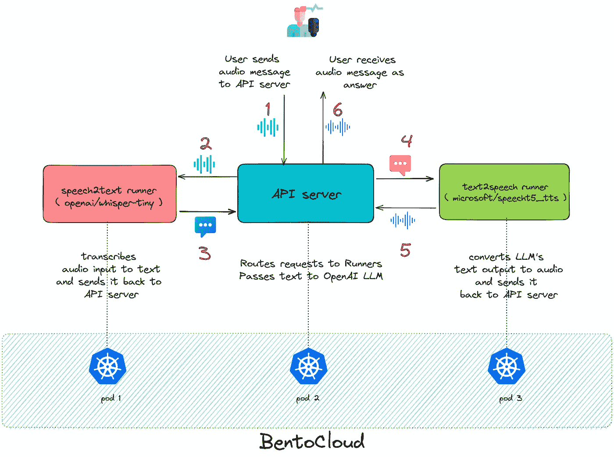
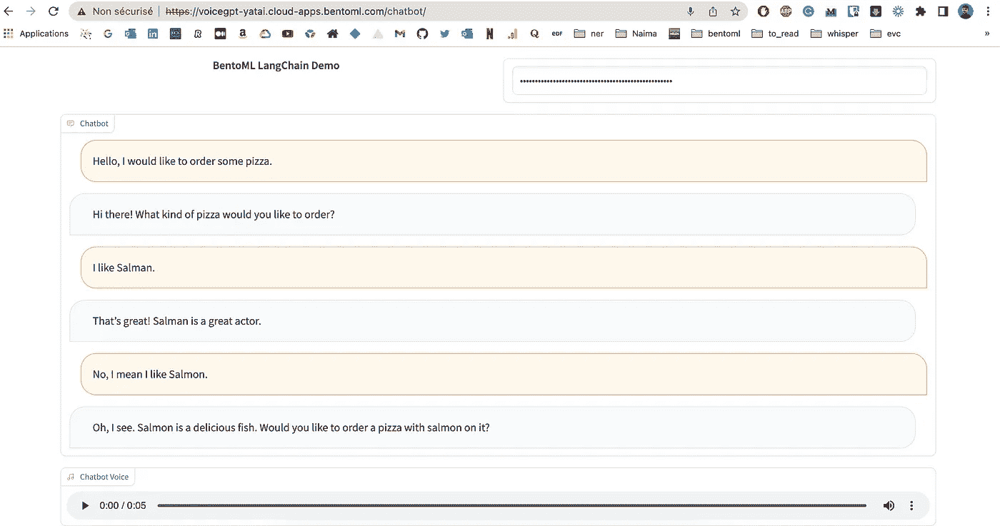
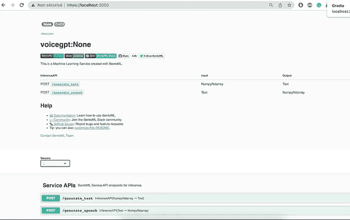
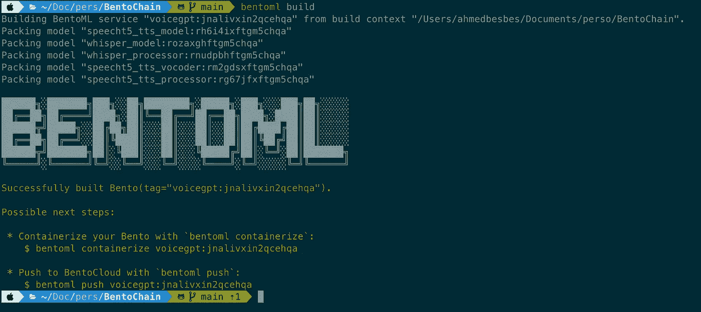
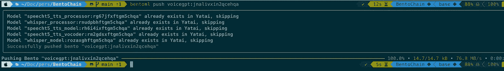
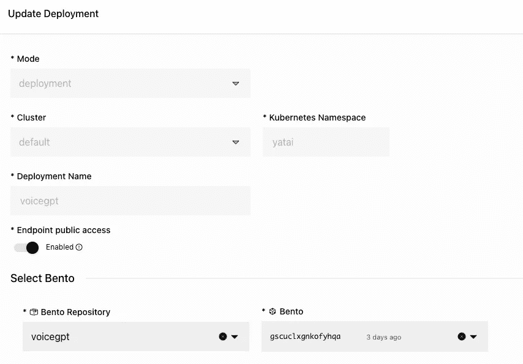
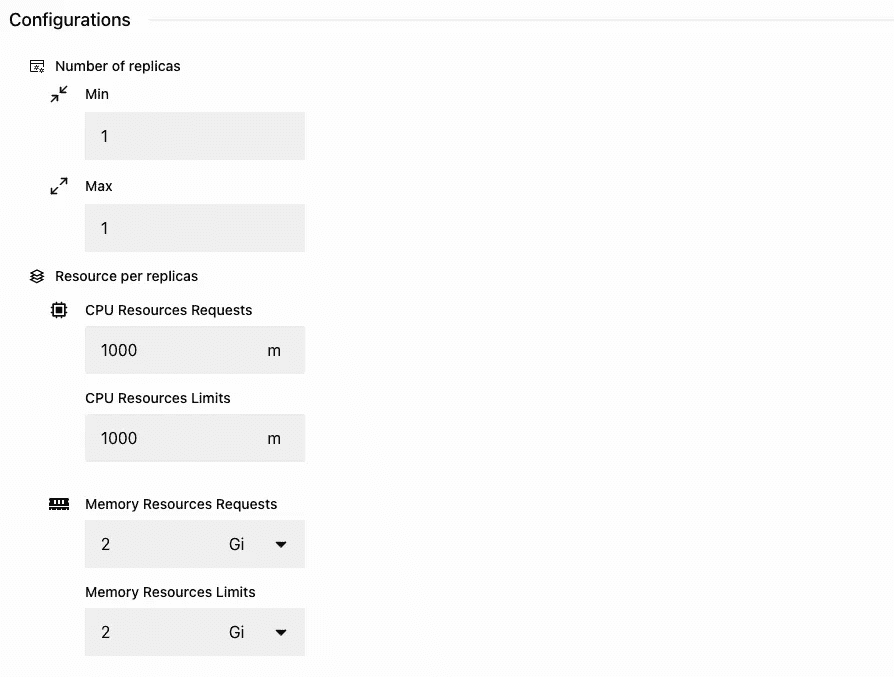
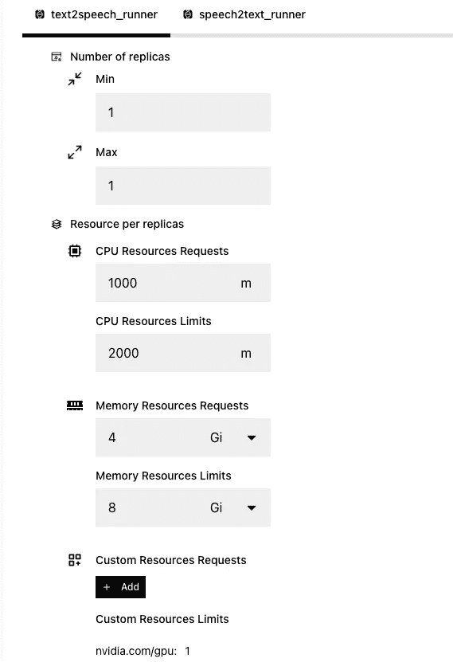
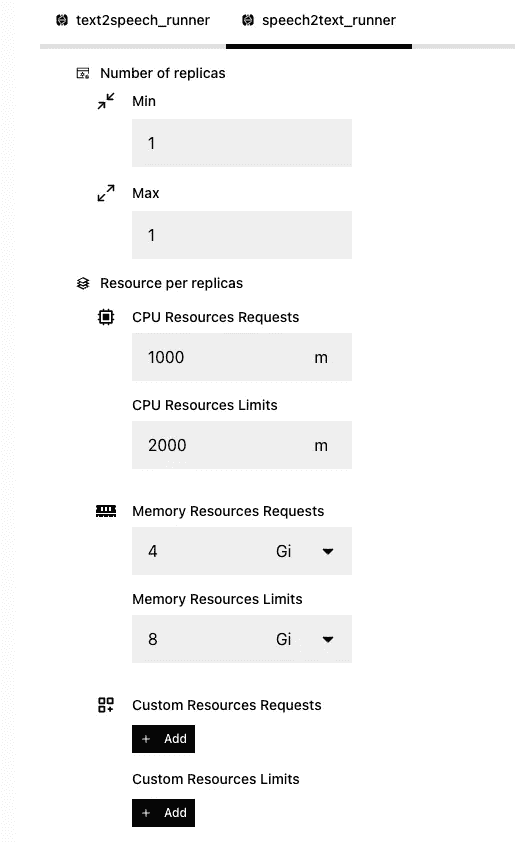

# 学习如何使用 Langchain 和 BentoML 构建和部署一个语音聊天机器人

> 原文：[`towardsdatascience.com/deploy-a-voice-based-chatbot-with-bentoml-langchain-and-gradio-7f25af3e45df`](https://towardsdatascience.com/deploy-a-voice-based-chatbot-with-bentoml-langchain-and-gradio-7f25af3e45df)

## BentoML 对机器学习工程师就像乐高积木

[](https://ahmedbesbes.medium.com/?source=post_page-----7f25af3e45df--------------------------------)[](https://towardsdatascience.com/?source=post_page-----7f25af3e45df--------------------------------) [Ahmed Besbes](https://ahmedbesbes.medium.com/?source=post_page-----7f25af3e45df--------------------------------)

·发表于[Towards Data Science](https://towardsdatascience.com/?source=post_page-----7f25af3e45df--------------------------------) ·阅读时长 11 分钟·2023 年 5 月 2 日

--


[Jason Leung](https://unsplash.com/@ninjason?utm_source=medium&utm_medium=referral)的照片，来自[Unsplash](https://unsplash.com/?utm_source=medium&utm_medium=referral)

在这篇文章中，我们将指导你如何构建一个基于语音的 ChatGPT 克隆，依赖于 OpenAI API 并使用维基百科作为额外的数据源。

要构建和部署这个应用程序，我们将使用[BentoML](https://github.com/bentoml/BentoML)：一个用于模型服务和部署的 Python 框架。

BentoML 不仅帮助你构建连接到第三方专有 API 的服务，还通过将这些服务与其他开源模型结合起来，超级增强了这些服务，形成复杂且强大的推理图。

实际上，我们将要构建的应用程序将包含**语音转文本**和**文本转语音**任务，这些任务将由来自 HuggingFace [hub](https://huggingface.co/)的不同模型处理，LLM 任务将由[**LangChain**](https://langchain.readthedocs.io/)管理。

在本地测试项目后，我们将把它推送到 BentoCloud，这个平台简化了版本控制、跟踪和将机器学习服务部署到云端的过程。

> ***在本文结束时，你应该对使用 BentoML 构建和部署多模型服务有全面的了解。你还将学习到一些特定的功能，使模型工业化变得更容易。***

不再赘言，让我们来看看 🔍。

# 演示

这是应用程序的一分钟演示。

作者的视频 — 快速演示

# 为什么选择 BentoML？🍱

随着越来越多的开源机器学习模型解决各种任务，软件应用程序将逐渐成为一种集成了预训练模型、自我训练模型或通过 API 访问模型的人工智能应用程序。

鉴于许多 SOTA 模型很大并且需要强大的硬件和分布式部署，将所有内容放入一台机器中并不是一个实际的解决方案，尤其是当应用程序结合了至少 2 或 3 个模型时。

> ***→ BentoML 是一个框架，通过让用户编写简单的 Python 代码来解决这个问题，同时将模型部署为分布式微服务。***

我已经玩弄和实验了 BentoML 一段时间，它绝对是我部署机器学习模型和服务的首选解决方案。凭借其自己的分发格式 *bento*，这个库使得将所有与 ML 相关的内容打包到一个地方变得非常简单：源代码和依赖项、API 定义、模型权重、Docker 镜像等。

部署变得更加容易，因为它依赖于将上述 bento 推送到云端。

在本教程中，我们将首先原型化应用程序，构建本地的 bento，并将其推送到 BentoCloud 进行部署。

你可以通过自我管理一个部署平台（查看 [Yatai](https://github.com/bentoml/Yatai) 项目了解更多细节）或使用名为 [bentoctl](https://github.com/bentoml/bentoctl) 的部署工具，将你的 bento 部署到各种云服务中。

> 如果你想了解更多关于 BentoML 和不同部署策略的信息，可以查看我之前的帖子 *⏬*

[## BentoML 如何帮助你服务和扩展机器学习模型的 10 种方式](https://towardsdatascience.com/10-ways-bentoml-can-help-you-serve-and-scale-machine-learning-models-4060f1e59d0d?source=post_page-----7f25af3e45df--------------------------------)

### 从 Jupyter 笔记本迁移到生产其实并不是那么困难

[## 快速在 AWS EC2 上使用 BentoML 部署机器学习 API](https://levelup.gitconnected.com/quickly-deploy-a-machine-learning-api-on-aws-ec2-using-bentoml-dbb13bc09d51?source=post_page-----7f25af3e45df--------------------------------)

### 用例：一个端到端的服务来总结 YouTube 视频 🎥

[## 如何将 PyTorch 模型部署为生产就绪的 API？](https://levelup.gitconnected.com/how-to-deploy-pytorch-models-as-production-ready-apis-f61136fd0244?source=post_page-----7f25af3e45df--------------------------------)

### 一个结合了 PyTorch Lightning 和 BentoML 的端到端用例 🚀

[## 如何将 PyTorch 模型部署为生产就绪的 API？](https://towardsdatascience.com/how-to-deploy-pytorch-models-as-production-ready-apis-f61136fd0244?source=post_page-----7f25af3e45df--------------------------------)

# 代码 💻

本项目的代码可以在 [Github](https://github.com/ahmedbesbes/BentoChain) 上找到。你可以克隆它并在本地运行应用程序，或构建一个自包含的 bento 以便后续部署。

# 依赖项

我们将使用 [transformers](https://github.com/huggingface/transformers) 和其他几个处理音频数据的库，以及流行的 [LangChain](https://langchain.readthedocs.io/) 包来轻松集成大型语言模型（LLMs）。

我们将使用 [poetry](https://python-poetry.org/) 来管理项目的依赖。

```py
git clone git@github.com:ahmedbesbes/BentoChain.git
cd BentoChain/
poetry install 
```

安装包后，你需要生成 SSL 密钥和证书。这将建立一个 HTTPS 连接，现代浏览器需要此连接以允许使用麦克风。

```py
mkdir ssl
cd ssl
openssl req -x509 -newkey rsa:4096 -keyout key.pem -out cert.pem -sha256 -days 365 -nodes
```

# 下载模型并保存

该项目假设没有训练。我们将从 HuggingFace 的 hub 下载模型权重，并将其保存为 BentoML 模型。

将模型保存为 BentoML 工件有助于将它们纳入 bento 归档中，以便它们不会构成外部依赖。

在精确确定所需模型后，你可以通过初始化模型先将其下载到本地。

```py
import logging
import bentoml
from transformers import (
    SpeechT5Processor,
    SpeechT5ForTextToSpeech,
    SpeechT5HifiGan,
    WhisperForConditionalGeneration,
    WhisperProcessor,
)

logging.basicConfig(level=logging.WARN)

if __name__ == "__main__":
    t5_processor = SpeechT5Processor.from_pretrained("microsoft/speecht5_tts")
    t5_model = SpeechT5ForTextToSpeech.from_pretrained("microsoft/speecht5_tts")
    t5_vocoder = SpeechT5HifiGan.from_pretrained("microsoft/speecht5_hifigan")

    whisper_processor = WhisperProcessor.from_pretrained("openai/whisper-tiny")
    whisper_model = WhisperForConditionalGeneration.from_pretrained(
        "openai/whisper-tiny"
    )
    whisper_model.config.forced_decoder_ids = None
```

然后，你可以通过调用`bentoml.transformers.save_model`函数将其保存为 BentoML 模型：

```py
 saved_t5_processor = bentoml.transformers.save_model(
        "speecht5_tts_processor", t5_processor
    )
    print(f"Saved: {saved_t5_processor}")

    saved_t5_model = bentoml.transformers.save_model(
        "speecht5_tts_model",
        t5_model,
        signatures={"generate_speech": {"batchable": False}},
    )
    print(f"Saved: {saved_t5_model}")

    saved_t5_vocoder = bentoml.transformers.save_model(
        "speecht5_tts_vocoder", t5_vocoder
    )
    print(f"Saved: {saved_t5_vocoder}")

    saved_whisper_processor = bentoml.transformers.save_model(
        "whisper_processor",
        whisper_processor,
    )
    print(f"Saved: {saved_whisper_processor}")

    saved_whisper_model = bentoml.transformers.save_model(
        "whisper_model",
        whisper_model,
    )
    print(f"Saved: {saved_whisper_model}")
```

完整代码在`train.py`脚本中，并应运行一次：

```py
poetry shell
python train.py
```


保存模型 ✅ — 作者截图

# 应用架构概述

在详细说明之前，让我们首先澄清数据工作流程，以了解应用的工作方式：

+   用户通过 HTTP POST 请求向 API 服务器发送音频消息

+   API 服务器将音频消息重定向到 speech2text 运行器，该运行器将其转录为文本并将其返回

+   API 服务器将转录的文本消息作为输入，通过 LangChain 代理传递，生成响应，然后将其发送到 text2speech 运行器

+   text2speech 运行器从输入文本生成音频片段，并将其返回给 API 服务器，后者再将其发送回用户

以下图表总结了这些步骤。



应用架构 ✅ — 作者图片

# 为什么我们使用两个运行器？

BentoML 的有趣之处在于，当部署到 BentoCloud（或任何自我管理的平台）时，运行器和 API 服务器可以在三个不同的 Kubernetes pod 上分别部署。

这提供了 3 个主要好处：

+   **关注分离**：运行器专注于计算，并与网页服务解耦

+   **定制化**：每个运行器可以根据其执行的任务具有特定的硬件配置：例如，text2speech 运行器的配置将包括 GPU，而 speech2text 运行器则不需要

+   **自动扩展**：运行器还会根据资源使用情况独立自动扩展

> *想了解更多关于 BentoML 运行器的信息，请查看这个* [*页面*](https://docs.bentoml.org/en/latest/concepts/runner.html)*。*

现在我们对应用有了整体了解，让我们关注每个运行器：

# 语音转文本运行器 🎤 → 📝

这个运行器将依赖 OpenAI 的 Whisper 模型将音频转录为文本。具体来说，它将使用 **tiny** [模型](https://huggingface.co/openai/whisper-tiny)。

这个模型将接收一个输入特征的张量，并生成一个转录结果。

代码非常直接：它只定义了一个`**SpeechToTextRunnable**`类，该类继承自`**bentoml.Runnable**`，实例化了模型和处理器，并定义了推理方法。

```py
import torch
import bentoml

s2t_processor_ref = bentoml.models.get("whisper_processor:latest")
s2t_model_ref = bentoml.models.get("whisper_model:latest")

class Speech2TextRunnable(bentoml.Runnable):
    SUPPORTED_RESOURCES = ("nvidia.com/gpu", "cpu")
    SUPPORTS_CPU_MULTI_THREADING = True

    def __init__(self):
        self.device = torch.device("cuda" if torch.cuda.is_available() else "cpu")
        self.processor = bentoml.transformers.load_model(s2t_processor_ref)
        self.model = bentoml.transformers.load_model(s2t_model_ref)
        self.model.to(self.device)

    @bentoml.Runnable.method(batchable=False)
    def transcribe_audio(self, tensor):
        if tensor is not None:
            predicted_ids = self.model.generate(tensor.to(self.device))
            transcriptions = self.processor.batch_decode(
                predicted_ids, skip_special_tokens=True
            )
            transcription = transcriptions[0]
            return transcription 
```

# 一个文本到语音的运行器 📝 → 🎤

这个运行器执行完全相反的任务：它接受文本作为输入，并生成一个由 NumPy 数组表示的语音。

注意，当设备可用时，必须将其声明为 `**Text2SpeechRunnable**` 类的属性，以支持 GPU 加速。

```py
import bentoml
import torch
from datasets import load_dataset

t2s_processor_ref = bentoml.models.get("speecht5_tts_processor:latest")
t2s_model_ref = bentoml.models.get("speecht5_tts_model:latest")
t2s_vocoder_ref = bentoml.models.get("speecht5_tts_vocoder:latest")

class Text2SpeechRunnable(bentoml.Runnable):
    SUPPORTED_RESOURCES = ("nvidia.com/gpu", "cpu")
    SUPPORTS_CPU_MULTI_THREADING = True

    def __init__(self):
        self.device = torch.device("cuda" if torch.cuda.is_available() else "cpu")
        self.processor = bentoml.transformers.load_model(t2s_processor_ref)
        self.model = bentoml.transformers.load_model(t2s_model_ref)
        self.vocoder = bentoml.transformers.load_model(t2s_vocoder_ref)
        self.embeddings_dataset = load_dataset(
            "Matthijs/cmu-arctic-xvectors",
            split="validation",
        )
        self.speaker_embeddings = torch.tensor(
            self.embeddings_dataset[7306]["xvector"]
        ).unsqueeze(0)
        self.model.to(self.device)
        self.vocoder.to(self.device)

    @bentoml.Runnable.method(batchable=False)
    def generate_speech(self, inp: str):
        inputs = self.processor(text=inp, return_tensors="pt")
        speech = self.model.generate_speech(
            inputs["input_ids"].to(self.device),
            self.speaker_embeddings.to(self.device),
            vocoder=self.vocoder,
        )
        return speech.cpu().numpy()
```

# 一个 BentoML 服务

在本节中，我们将创建一个服务，定义在 bento 部署时可以访问的 API 路由。

我们首先开始初始化我们定义的两个前一个运行器：

```py
import bentoml
import gradio as gr
from chatbot import create_block, ChatWrapper
from fastapi import FastAPI
from speech2text_runner import s2t_processor_ref, s2t_model_ref, Speech2TextRunnable
from text2speech_runner import (
    t2s_processor_ref,
    t2s_model_ref,
    t2s_vocoder_ref,
    Text2SpeechRunnable,
)

speech2text_runner = bentoml.Runner(
    Speech2TextRunnable,
    name="speech2text_runner",
    models=[s2t_processor_ref, s2t_model_ref],
)
text2speech_runner = bentoml.Runner(
    Text2SpeechRunnable,
    name="text2speech_runner",
    models=[t2s_processor_ref, t2s_model_ref, t2s_vocoder_ref],
)
```

然后，我们创建一个依赖于这些路由的 Service 对象：

```py
svc = bentoml.Service(
    "voicegpt",
    runners=[
        text2speech_runner,
        speech2text_runner,
    ],
)
```

一旦服务创建完成，我们将定义两个 API 路由：

+   **generate_text:** 这个路由将接受一个数组作为输入，并通过调用 speech2text_runner 生成文本

```py
@svc.api(input=bentoml.io.NumpyNdarray(), output=bentoml.io.Text())
def generate_text(tensor):
    text = speech2text_runner.transcribe_audio.run(tensor)
    return text
```

+   **generate_speech:** 这个路由将接受一个文本作为输入，并通过调用 text2speech_runner 生成一个数组作为输出

```py
 @svc.api(input=bentoml.io.Text(), output=bentoml.io.NumpyNdarray())
def generate_speech(inp: str):
    return text2speech_runner.generate_speech.run(inp)
```

# ChatWrapper 实用程序类

我们还没有完成服务源代码。

在本节中，我们将把 FastAPI 应用挂载为“/chatbot”路径上的 HTTP 端点。

这个应用将提供一个 Gradio 聊天机器人界面，该界面将与之前定义的两个 API 路由进行交互：`**generate_text**` 和 `**generate_speech**`。

```py
chat = ChatWrapper(generate_speech, generate_text)
app = FastAPI()
app = gr.mount_gradio_app(app, create_block(chat), path="/chatbot")
svc.mount_asgi_app(app, "/")
```

“chat”变量是一个对象，它获取用户的音频输入，将其转录为文本，传递给 LangChain，提取响应，并返回一堆更新应用界面和状态的数据。

chat 对象是一个可调用的对象，它期望以下参数：

+   **api_key**: OpenAI API 密钥

+   **audio_path**: 当使用麦克风录制音频文件时的临时文件位置

+   **text_message**: 代替音频文件发送的文本消息

+   **history**: 一个包含问题及其对应响应的元组（（“Hello”, “hi”），（“How are you?”, “Fine, thank you. What about you?”））

+   **chain**: 一个来自 LangChain 的 ConversationChain 对象

在以下代码片段中，ChatWrapper __call__ 方法首先检查输入数据。如果是音频格式，它会使用 generate_text 方法进行转录，否则保持原样。

然后，它会检查 OpenAI 密钥是否正确加载。如果没有，它会打印出“Please paste your Open AI key.”的消息，并附上音频转录。

如果密钥正确加载，LangChain 代理将运行，并输出一条消息，然后将其传递给 generate_speech 方法以生成输出音频。

```py
class ChatWrapper:
    def __init__(self, generate_speech, generate_text):
        self.lock = Lock()
        self.generate_speech = generate_speech
        self.generate_text = generate_text
        self.s2t_processor_ref = bentoml.models.get("whisper_processor:latest")
        self.processor = bentoml.transformers.load_model(self.s2t_processor_ref)

    def __call__(
        self,
        api_key: str,
        audio_path: str,
        text_message: str,
        history: Optional[Tuple[str, str]],
        chain: Optional[ConversationChain],
    ):
        """Execute the chat functionality."""
        self.lock.acquire()
        try:
            if audio_path is None and text_message is not None:
                transcription = text_message
            elif audio_path is not None and text_message in [None, ""]:
                audio_dataset = Dataset.from_dict({"audio": [audio_path]}).cast_column(
                    "audio",
                    Audio(sampling_rate=16000),
                )
                sample = audio_dataset[0]["audio"]

                if sample is not None:
                    input_features = self.processor(
                        sample["array"],
                        sampling_rate=sample["sampling_rate"],
                        return_tensors="pt",
                    ).input_features

                    transcription = self.generate_text(input_features)
                else:
                    transcription = None
                    speech = None

            if transcription is not None:
                history = history or []
                # If chain is None, that is because no API key was provided.
                if chain is None:
                    response = "Please paste your Open AI key."
                    history.append((transcription, response))
                    speech = (PLAYBACK_SAMPLE_RATE, self.generate_speech(response))
                    return history, history, speech, None, None
                # Set OpenAI key
                import openai

                openai.api_key = api_key
                # Run chain and append input.
                output = chain.run(input=transcription)
                speech = (PLAYBACK_SAMPLE_RATE, self.generate_speech(output))
                history.append((transcription, output))

        except Exception as e:
            raise e
        finally:
            self.lock.release()
        return history, history, speech, None, None
```

# Gradio 用户界面

还记得我们之前看到的 create_block 函数吗？这个函数接受一个 ChatWrapper 实例作为输入并生成用户界面。

```py
chat = ChatWrapper(generate_speech, generate_text)
app = FastAPI()
app = gr.mount_gradio_app(app, create_block(chat), path="/chatbot")
svc.mount_asgi_app(app, "/")
```


应用的 UI — 用户截图

让我们将 UI 拆解开来，以准确理解数据的流动方式。

**openai_api_key_textbox:** 这个文本框期待您在其中粘贴您的 OpenAI 密钥。

```py
with block:
    with gr.Row():
        gr.Markdown("<h3><center>BentoML LangChain Demo</center></h3>")

        openai_api_key_textbox = gr.Textbox(
            placeholder="Paste your OpenAI API key (sk-...)",
            show_label=False,
            lines=1,
            type="password",
        )
```

当用户粘贴其密钥并提交时，该密钥会传递给执行的 set_openai_api_key 函数。然后，这个函数返回加载的链，并将其传递到应用的状态中。这样，链对象就不为 None，并且可以在传递给聊天对象时使用。

```py
def set_openai_api_key(api_key: str):
    if api_key:
        os.environ["OPENAI_API_KEY"] = api_key
        chain = load_chain()
        os.environ["OPENAI_API_KEY"] = ""
        return chain

agent_state = gr.State()

openai_api_key_textbox.change(
  set_openai_api_key,
  inputs=[openai_api_key_textbox],
  outputs=[agent_state],
  show_progress=False,
)
```

这里是其他 UI 组件：

+   **chatbot:** 显示聊天机器人输出，展示用户提交的消息和回应。

+   **audio:** 一个播放用户录制的音频片段的小部件

+   **state**：应用的全局状态

+   **audio_message:** 用户提交的音频

+   **text_message**：用户提交的文本

那么，当用户从麦克风录制音频时会发生什么？（发送文本时也是如此）

聊天对象会使用来自 UI 的输入列表 [openai_api_key_textbox, audio_message, text_message, state, agent_state] 执行，并输出一个输出列表，该列表更新以下组件 [chatbot, state, audio, audio_message, text_message]

```py
audio_message.change(
    chat,
    inputs=[
        openai_api_key_textbox,
        audio_message,
        text_message,
        state,
        agent_state,
    ],
    outputs=[chatbot, state, audio, audio_message, text_message],
    show_progress=False,
)
```

简而言之，这允许显示用户的问题和机器人的回答，以及聊天记录和最后响应的音频。



作者截图

# 在本地提供应用

要在本地运行应用程序，请执行以下命令：

```py
poetry shell 
bentoml serve service:svc --reload --ssl-certfile ssl/cert.pem --ssl-keyfile ssl/key.pem
```

这将启动一个 SwaggerUI，您可以在其中尝试两个端点。

这也在“/chatbot”路径上提供 Gradio 应用。



用户截图

# 部署到 BentoCloud

在部署到 BentoCloud 之前，我们首先需要构建 bento：

```py
bentoml build
```



作者截图

然后，我们需要使用以下命令推送它。

```py
bentoml push voicegpt:jnalivxin2qcehqa
```

这将同时将我们的 **bento** 和底层的 **models** 上传到云端。



作者截图

现在，简单的部分：登录 BentoCloud，前往部署选项卡，然后点击创建。

选择一个部署名称，启用公共访问并选择合适的 bento 标签版本。



现在，定义 API 服务器配置：



API 服务器配置 — 作者截图

并为每个运行器设置配置。



Runners 配置 — 作者截图

当一切准备就绪时，点击提交按钮并等待部署。

当 bento 被标记为正在运行时，您会看到一个公共 URL，用于提供聊天机器人服务（不要忘记添加 HTTPS）

# 结论

这个项目是一个机会，参与到围绕 LLM 的持续热潮中，并从零开始构建一个不仅调用 LangChain，还结合其他模型的应用。

当然，我展示的工作流程中不同步骤还有改进的空间：我只是希望这篇文章能为你开始构建更高级的机器人提供一个良好的开端。

# 新加入 Medium？你可以以每月 $5 订阅，解锁各种主题（技术、设计、创业……）的无限文章。你可以通过点击我的推荐[链接](https://ahmedbesbes.medium.com/membership)来支持我。

[](https://ahmedbesbes.medium.com/membership?source=post_page-----7f25af3e45df--------------------------------) [## 通过我的推荐链接加入 Medium - Ahmed Besbes

### 阅读 Ahmed Besbes 的每个故事（以及 Medium 上其他数千位作者的文章）。你的会员费直接支持……

ahmedbesbes.medium.com](https://ahmedbesbes.medium.com/membership?source=post_page-----7f25af3e45df--------------------------------)
