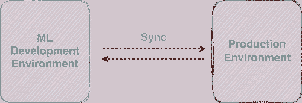
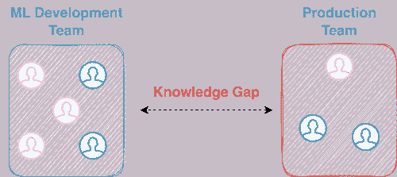
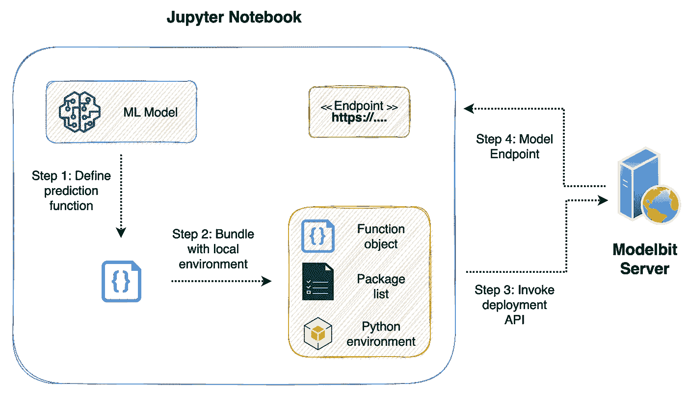
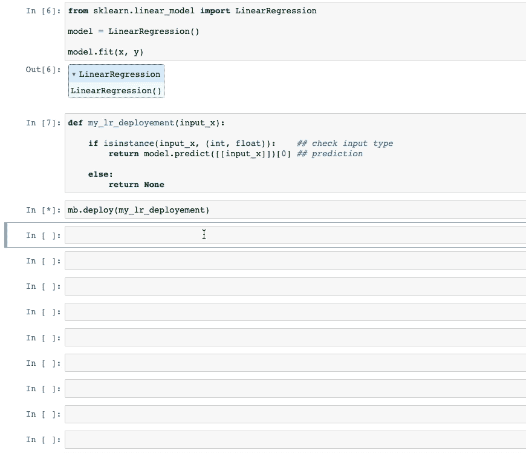
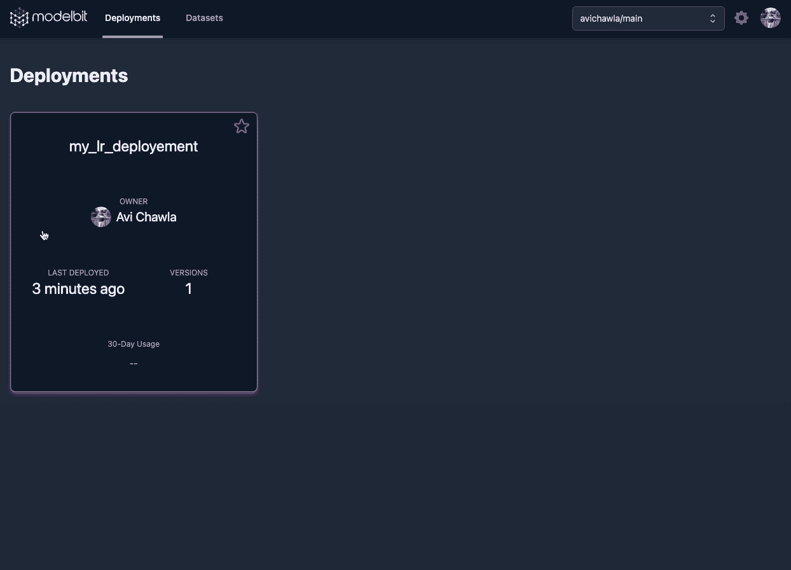

# 直接从你的 Jupyter Notebook 部署机器学习模型

> 原文：[`towardsdatascience.com/deploy-machine-learning-models-right-from-your-jupyter-notebook-3241d47408cd?source=collection_archive---------2-----------------------#2023-03-28`](https://towardsdatascience.com/deploy-machine-learning-models-right-from-your-jupyter-notebook-3241d47408cd?source=collection_archive---------2-----------------------#2023-03-28)

## 一行代码部署机器学习模型

[](https://medium.com/@avi_chawla?source=post_page-----3241d47408cd--------------------------------)[](https://towardsdatascience.com/?source=post_page-----3241d47408cd--------------------------------) [Avi Chawla](https://medium.com/@avi_chawla?source=post_page-----3241d47408cd--------------------------------)

·

[关注](https://medium.com/m/signin?actionUrl=https%3A%2F%2Fmedium.com%2F_%2Fsubscribe%2Fuser%2F5d33decdf4c4&operation=register&redirect=https%3A%2F%2Ftowardsdatascience.com%2Fdeploy-machine-learning-models-right-from-your-jupyter-notebook-3241d47408cd&user=Avi+Chawla&userId=5d33decdf4c4&source=post_page-5d33decdf4c4----3241d47408cd---------------------post_header-----------) 发表在 [Towards Data Science](https://towardsdatascience.com/?source=post_page-----3241d47408cd--------------------------------) ·7 分钟阅读·2023 年 3 月 28 日

--

[](https://medium.com/m/signin?actionUrl=https%3A%2F%2Fmedium.com%2F_%2Fbookmark%2Fp%2F3241d47408cd&operation=register&redirect=https%3A%2F%2Ftowardsdatascience.com%2Fdeploy-machine-learning-models-right-from-your-jupyter-notebook-3241d47408cd&source=-----3241d47408cd---------------------bookmark_footer-----------)

图片由 [Roman Synkevych 🇺🇦](https://unsplash.com/ko/@synkevych?utm_source=medium&utm_medium=referral) 提供，来源于 [Unsplash](https://unsplash.com/?utm_source=medium&utm_medium=referral)

在这场 AI 革命中，规模化构建智能系统最近引起了无数组织的极大关注。

虽然大量时间和精力被积极投入到训练大型机器学习模型中，但将这些模型投入生产并维护它们是一个独立的任务。

在某些情况下，这可能甚至需要专业化的团队。

尽管越来越多的组织使用人工智能（AI）来服务终端客户，但这些模型的顺利部署仍然有些繁琐，但在确保按承诺提供服务方面至关重要。

但你是否曾想过为什么部署是一个具有挑战性的过程？如果是的话，让我来帮助你。

在这篇博客中，我将详细概述为什么 ML 部署通常是一个繁琐的过程。

此外，我还将分享如何使用[Modelbit](https://www.modelbit.com/) API 从 jupyter notebook 简化这个过程并部署模型。

让我们开始 🚀！

# 什么是部署？

首先，部署是将训练好的机器学习模型集成到生产环境中的过程。

部署是机器学习产品开发生命周期的最后阶段。这时模型已经经过训练、验证和测试，最终准备好提供给终端用户。

你可以在这里阅读我之前关于机器学习部署的文章：

[](/deploying-machine-learning-models-with-heroku-4dec1df87f71?source=post_page-----3241d47408cd--------------------------------) ## 使用 Heroku 部署机器学习模型

### 不仅要训练，还要部署：逐步指南

[towardsdatascience.com

# ML 模型部署的痛点

## #1) 一致性挑战

在几乎所有的 ML 用例中，使用的算法通常从未从头开始编写。相反，人们会使用 PyTorch、Sklearn 等库提供的开源实现。

为了确保生产环境中的可重复性，生产环境应与模型训练时的环境保持一致。



开发和生产环境（图像由作者提供）

这涉及到安装类似版本的库、软件依赖、操作系统配置等多个方面。

实现这种一致性有时可能具有挑战性。

事实上，在我撰写上述的 Heroku 博客时，我遇到了许多错误和挑战，在尝试将机器学习模型部署到 Heroku 时，整体过程有些繁琐且耗时，这也是我在博客中讨论的内容。

## #2) 基础设施挑战

ML 模型通常需要像 GPU 这样的专用处理器进行训练。

根据复杂程度，推断阶段，即部署后的阶段，可能还需要专门的基础设施。

设置这些专门的基础设施对于数据团队来说通常是一个挑战。

## #3) 专业知识不足（或知识差距）

ML 工程师可能没有部署经验。他们可能在软件工程、DevOps 和基础设施管理等领域缺乏必要的专业知识。

这可能使他们在生产环境中有效部署和扩展模型变得困难。

在这种情况下，组织会招聘专业人才。

然而，专门招聘用于部署的工程师可能对 ML 算法和技术没有深入了解。



开发和生产团队（作者提供的图片）

这使得他们难以理解代码并进行必要的优化，从而导致扩展、性能和可靠性问题，并最终影响模型在生产环境中的有效性。

# 从 Jupyter Notebook 部署 ML 模型

上述痛点在某种程度上突显了数据科学家需要具备必要的部署专业知识。

现在，数据科学家大部分时间都在 Jupyter notebook 中工作。

因此，为了简化部署过程并将其与 Jupyter 集成以创建模型端点，我将使用 [Modelbit](https://www.modelbit.com/) API。

## 工作流

在构建应用程序之前，最好突出显示过程工作流，以便可以在任何项目中复制。

下面的图片描绘了部署过程中的步骤的高层次图示概览。



部署工作流（作者提供的图片）

首先，在 Jupyter notebook 中，我们将训练一个机器学习模型。

接下来，我们将创建一个预测函数，该函数将接受输入作为参数并返回模型的预测。

之后，我们将收集所使用的包列表及其版本，以及我们训练模型所用的 Python 版本。这些信息以及函数对象将被发送用于部署。

最后，我们将检索模型端点。

让我们来看一下下面的步骤。

**重申一下，我们将从 Jupyter notebook 中完成所有操作。**

## 第一步：训练机器学习模型

首先，我们将训练一个我们打算部署的机器学习模型。为了简化起见，我们考虑一个在以下虚拟数据集上训练的线性回归模型：


虚拟数据集（作者提供的图片）

接下来，我们将使用 [scikit-learn](https://scikit-learn.org/stable/index.html) 训练一个线性回归模型：

```py
## my_notebook.ipynb

from sklearn.linear_model import LinearRegression
model = LinearRegression()
model.fit(x, y)
```

我们得到以下回归图：


回归拟合（作者提供的图片）

## 第二步：设置 Modelbit

## #2.1) 安装 Modelbit

首先，通过 `pip` 安装 Modelbit 包：

```py
## my_notebook.ipynb

!pip install modelbit
```

## #2.2) 登录 Modelbit

要使用 Modelbit 部署模型，请在 [这里](https://app.modelbit.com/signup) 创建您的帐户。接下来，从 Jupyter 登录到 Modelbit：

```py
## my_notebook.ipynb

import modelbit
mb = modelbit.login()
```

完成！

现在，我们可以开始将我们的模型推向部署。

## 第三步：部署模型

要使用 Modelbit 部署模型，我们应该设置一个 Python 函数，以确保部署和部署后的推理顺利进行。

实质上，这个函数将包含在运行时执行的代码，并负责返回预测结果。

我们应该在这个方法中根据模型的需要指定输入参数。另外，你可以随意命名它。

我们来创建一个`my_lr_deployement()`方法。

```py
## my_notebook.ipynb

def my_lr_deployement(input_x):

    if isinstance(input_x, (int, float)):    ## check input type
        return model.predict([[input_x]])[0] ## prediction

    else:
        return None
```

**注意：** 函数的每个依赖项（在这个例子中是`model`）都会被序列化并与函数一起自动发送到生产环境。因此，你可以在此方法中自由引用任何内容。

要部署，请运行以下命令：

```py
## my_notebook.ipynb

mb.deploy(my_lr_deployement)
```

就这样！模型已成功部署。下方展示了演示：



部署演示（作者提供的图片）

一旦你的模型成功部署，它将出现在你的 Modelbit 仪表盘中。



部署仪表盘（作者提供的图片）

如上所示，Modelbit 提供了一个 API 端点。我们可以用它进行推断。

```py
## my_notebook.ipynb

!curl -s -XPOST "https://avichawla.app.modelbit.com/v1/my_lr_deployement/latest" 
 -d '{"data":[[1,input_x]]}' | json_pp
```

在上述请求中，`data` 是一个列表的列表。

列表中的第一个数字（`1`）是输入 ID。`ID` 可以是你喜欢使用的任何标识符。紧随 ID 的数字是函数参数。

例如，对于我们的`my_lr_deployement(input_x)`方法，数据列表的列表如下：

```py
# Format: [id, input_x]

[[1,3],
 [2,5],
 [3,9]]
```

让我们用上述输入调用 API：

```py
## my_notebook.ipynb

!curl -s -XPOST "https://avichawla.app.modelbit.com/v1/my_lr_deployement/latest" 
 -d '{"data":[[1,3], [2,5], [3,9]]}' | json_pp
```

端点会以 JSON 格式响应：

```py
{
   "data" : [
      [
         1,               # Input ID
         12.41            # Output
      ],
      [
         2,               # Input ID
         19.33            # Output
      ],
      [
         3,               # Input ID
         33.16            # Output
      ]
   ]
}
```

调用已部署的模型不仅限于`curl`。我们还可以使用 Python 中的`requests`库：

```py
## my_notebook.ipynb

import json, requests

requests.post("https://avichawla.app.modelbit.com/v1/my_lr_deployement/latest",
              headers={"Content-Type":"application/json"},
              data=json.dumps({"data":[[1,3], [2,5], [3,9]]})).json()
```

输出是一个 Python 字典：

```py
{'data': [[1, 12.41], # [Input ID, Output]
          [2, 19.33], # [Input ID, Output]
          [3, 33.16]] # [Input ID, Output]
}
```

## 自定义环境

有时我们可能希望在部署模型时指定使用的库的特定版本。

我们可以将这些作为参数传递给`md.deploy()`方法调用：

```py
## my_notebook.ipynb

mb.deploy(my_lr_deployement, 
          python_packages=["scikit-learn==1.1.2", "pandas==1.5.0"])
```

我们还可以部署到特定版本的 Python：

```py
## my_notebook.ipynb

mb.deploy(my_lr_deployement, 
          python_version = "3.9")
```

# 结论

总结一下，在这篇文章中，我们学习了如何通过 Jupyter notebook 使用 Modelbit API 部署机器学习模型。

更具体地说，我首先演示了一个简单线性回归模型的训练，然后将 Modelbit API 集成到 Jupyter notebook 中以部署该模型。

感谢阅读！
