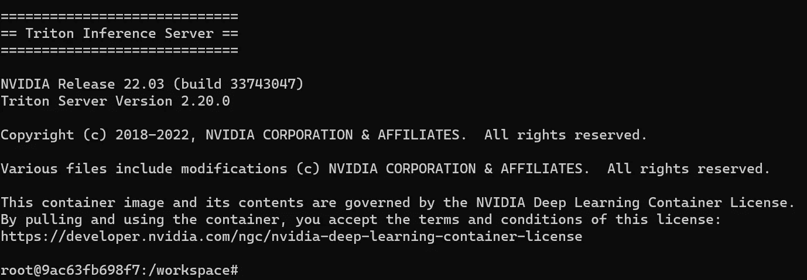
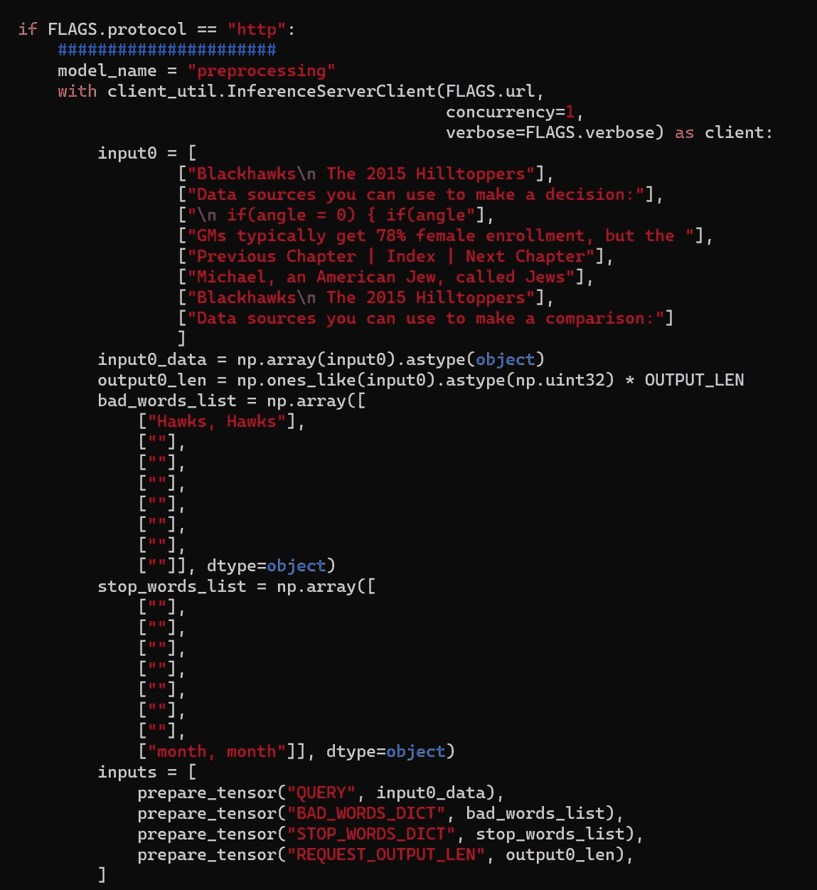

# 使用 Triton 部署本地 GPT 服务器

> 原文：[`towardsdatascience.com/deploy-your-local-gpt-server-with-triton-a825d528aa5d?source=collection_archive---------3-----------------------#2023-04-14`](https://towardsdatascience.com/deploy-your-local-gpt-server-with-triton-a825d528aa5d?source=collection_archive---------3-----------------------#2023-04-14)

## 如何在本地服务器上运行大型语言模型

[](https://medium.com/@bnjmn_marie?source=post_page-----a825d528aa5d--------------------------------)[](https://towardsdatascience.com/?source=post_page-----a825d528aa5d--------------------------------) [Benjamin Marie](https://medium.com/@bnjmn_marie?source=post_page-----a825d528aa5d--------------------------------)

·

[查看](https://medium.com/m/signin?actionUrl=https%3A%2F%2Fmedium.com%2F_%2Fsubscribe%2Fuser%2Fad2a414578b3&operation=register&redirect=https%3A%2F%2Ftowardsdatascience.com%2Fdeploy-your-local-gpt-server-with-triton-a825d528aa5d&user=Benjamin+Marie&userId=ad2a414578b3&source=post_page-ad2a414578b3----a825d528aa5d---------------------post_header-----------) 发表在[Towards Data Science](https://towardsdatascience.com/?source=post_page-----a825d528aa5d--------------------------------) ·8 分钟阅读·2023 年 4 月 14 日[](https://medium.com/m/signin?actionUrl=https%3A%2F%2Fmedium.com%2F_%2Fvote%2Ftowards-data-science%2Fa825d528aa5d&operation=register&redirect=https%3A%2F%2Ftowardsdatascience.com%2Fdeploy-your-local-gpt-server-with-triton-a825d528aa5d&user=Benjamin+Marie&userId=ad2a414578b3&source=-----a825d528aa5d---------------------clap_footer-----------)

--

[](https://medium.com/m/signin?actionUrl=https%3A%2F%2Fmedium.com%2F_%2Fbookmark%2Fp%2Fa825d528aa5d&operation=register&redirect=https%3A%2F%2Ftowardsdatascience.com%2Fdeploy-your-local-gpt-server-with-triton-a825d528aa5d&source=-----a825d528aa5d---------------------bookmark_footer-----------)

图片来自[Pixabay](https://pixabay.com/photos/nvidia-graphic-card-bitcoin-gpu-5264921/)

使用 OpenAI GPT 模型仅通过 OpenAI API 是可能的。换句话说，你必须与 OpenAI 分享数据才能使用其 GPT 模型。

数据机密性是许多企业的核心，也是大多数个人的优先事项。在互联网上向私人公司发送或接收高度私人数据通常不是一种选择。

出于这些原因，你可能会对在本地运行自己的 GPT 模型以处理个人或业务数据感兴趣。

幸运的是，有许多开源替代品可供选择，虽然它们尚不如 GPT-4，但能够与 GPT-3 竞争。

例如，EleutherAI 提供了几个 GPT 模型：GPT-J、GPT-Neo 和 GPT-NeoX。它们都有详细的文档，开源，并且在允许商业使用的许可证下。

这些模型也很大。最小的 GPT-J 在压缩后占用近 10 GB 的磁盘空间（60 亿个参数）。在某些机器上，加载这些模型可能需要很长时间。理想情况下，我们需要一个本地服务器来保持模型在后台完全加载并随时准备使用。

其中一种方法是使用专用框架（如 nVidia Triton）在本地服务器上运行 GPT ([BSD-3 Clause 许可证](https://github.com/triton-inference-server/server/blob/main/LICENSE))。*注意：所谓“服务器”并不是指物理机器。Triton 只是一个可以安装在任何机器上的框架。*

使用 FasterTransformer ([Apache 2.0 许可证](https://github.com/NVIDIA/FasterTransformer/blob/main/LICENSE)) 后端的 Triton 在整个提示处理过程中管理 CPU 和 GPU 的负载。一旦 Triton 托管了你的 GPT 模型，你的每一个提示都会由 FastTransformer 根据你的硬件配置以最佳方式进行预处理和后处理。

在本文中，我将向你展示如何使用 Triton Inference Server 为你的应用程序提供 GPT-J 模型。我选择 GPT-J 是因为它是最小的 GPT 模型之一，性能良好且可用于商业用途 ([Apache 2.0 许可证](https://huggingface.co/EleutherAI/gpt-j-6b))。

# 需求

## 硬件

你需要至少一张支持 CUDA 11 或更高版本的 GPU。我们将运行一个大型模型 GPT-J，因此你的 GPU 应该至少有 12 GB 的 VRAM。

设置 Triton 服务器和处理模型也需要相当大的硬盘空间。你应该至少有 50 GB 的可用空间。

## 操作系统

你需要一个 UNIX 操作系统，最好是 Ubuntu 或 Debian。如果你使用其他 UNIX 操作系统也可以，但你需要将所有下载和安装软件包的命令调整为适合你操作系统的包管理器。

我在 WSL2 的 Ubuntu 20.04 上运行了本教程中呈现的所有命令。*注意：我遇到了一些 WSL2 的问题，我会进行说明，但如果你运行的是原生 Ubuntu，可能不会遇到这些问题。*

对于一些命令，你需要“sudo”权限。

## 依赖项

FasterTransformer 需要 [CMAKE](https://cmake.org/install/) 进行编译。

还有其他依赖项，但在必要时，我会在本教程中提供安装指南。

# 为 Triton 设置 Docker 容器

我们将使用 nVidia 已经准备好的 Docker 镜像。它提供在“fastertransformer_backend”的特定分支中。

所以首先我们需要克隆这个仓库并获取这个分支。

```py
git clone https://github.com/triton-inference-server/fastertransformer_backend.git
cd fastertransformer_backend && git checkout -b t5_gptj_blog remotes/origin/dev/t5_gptj_blog
```

如果你没有 Docker，请跳到本文末尾，你将找到一个简短的安装教程。

以下命令用于构建 Triton 服务器的 Docker 镜像。

```py
docker build --rm  --build-arg TRITON_VERSION=22.03 -t triton_with_ft:22.03 -f docker/Dockerfile .
cd ../
```

它应该顺利运行。*注意：在我的情况下，我遇到了几个缺失或未正确安装的 GPG 密钥的问题。如果你有类似的问题，请在评论中留言。我很乐意帮助你！*

然后，我们可以运行 docker 镜像：

```py
docker run -it --rm --gpus=all --shm-size=4G  -v $(pwd):/ft_workspace -p 8888:8888 triton_with_ft:22.03 bash
```

如果成功，你将看到类似这样的内容：



作者提供的图像

*注意：如果你看到错误“docker: Error response from daemon: could not select device driver “” with capabilities: [[gpu]].”，这可能意味着你没有安装 nVidia 容器。我在文章末尾提供了安装说明。*

**不要离开或关闭此容器：所有剩余的步骤必须在其中完成。**

# 为 FasterTransformer 准备 GPT-J

接下来的步骤准备 GPT-J 模型。

我们需要获取并配置 FasterTransformer。*注意：你需要 CMAKE 来完成这一步。*

```py
git clone https://github.com/NVIDIA/FasterTransformer.git

mkdir -p FasterTransformer/build && cd FasterTransformer/build
git submodule init && git submodule update
cmake -DSM=xx -DCMAKE_BUILD_TYPE=Release -DBUILD_PYT=ON -DBUILD_MULTI_GPU=ON ..
#I put -j8 below because my CPU has 8 cores.
#Since this compilation can take some time, I recommend that you change this number to the number of cores your CPU has.
make -j8
```

喝杯咖啡可能需要一点时间 ☕。

FasterTransformer 用于在 Triton 服务器内部运行模型。它可以管理输入/输出的预处理和后处理。

现在，我们可以获取 GPT-J：

```py
cd ../../
mkdir models
wget https://the-eye.eu/public/AI/GPT-J-6B/step_383500_slim.tar.zstd
tar -axf step_383500_slim.tar.zstd -C ./models/ 
```

此命令首先下载模型，然后提取它。

如果你的互联网速度不高，可能需要一点时间喝两杯咖啡 ☕☕或者打个盹。下载内容大约为 10 GB。

下一步是将模型权重转换为 FasterTransformer 格式。

```py
cd models
pip install nvidia-cuda-nvcc
python3 ../FasterTransformer/examples/pytorch/gptj/utils/gptj_ckpt_convert.py --output-dir ./gptj6b_ckpt/ --ckpt-dir ./step_383500/ --n-inference-gpus 1
```

我将“1”设置为“ — n-inference-gpus”，因为我只有 1 个 GPU，但如果你有更多，你可以设置更高的数字。*注意：我添加了“nvidia-cuda-nvcc”，因为在我的环境中需要它。你的环境中可能已经安装了。如果你遇到其他名为“ptxas”的库的问题，请留言，我会回答。*

如果你在运行之前的命令时遇到关于“jax”或“jaxlib”的错误，以下命令对我有帮助：

```py
pip install --upgrade "jax[cuda11_local]" -f https://storage.googleapis.com/jax-releases/jax_cuda_releases.html
```

# 优化

在启动服务器之前，还建议运行内核自动调优。它会在所有低级算法中找到最适合 GPT-J 架构和你的机器硬件的算法。`gpt_gemm`会完成这项工作：

```py
./FasterTransformer/build/bin/gpt_gemm 8 1 32 12 128 6144 51200 1 2
```

它应该生成一个名为“gemm_config.in”的文件。

# FasterTransformer 配置

现在，我们要配置服务器以运行 GPT-J。找到并打开以下文件：

*fastertransformer_backend/all_models/gptj/fastertransformer/config.pbtxt*

设置你 GPU 的数量的参数。*注意：它必须与转换 GPT-J 权重时用“n-inference-gpus”指示的数量相同。*

```py
parameters {
  key: "tensor_para_size"
  value: {
    string_value: "1"
  }
}
```

然后，指明 GPT-J 的位置：

```py
parameters {
  key: "model_checkpoint_path"
  value: {
    string_value: "./models/gptj6b_ckpt/1-gpu/"
  }
}
```

# 运行 Triton 服务器

启动 Triton 服务器，请运行以下命令：*注意：更改“CUDA_VISIBLE_DEVICES”以设置你的 GPU 的 ID，例如，如果你有两个 GPU 想要使用，可以设置为“0,1”。*

```py
CUDA_VISIBLE_DEVICES=0 /opt/tritonserver/bin/tritonserver  --model-repository=./triton-model-store/mygptj/ &
```

如果一切正常，你将看到终端中显示服务器等待加载 1 个由 FasterTransformer 加载的模型。

还需要创建一个客户端来查询服务器。例如，可以是你的应用程序，它将利用 GPT-J 模型。

nVidia 提供了一个客户端示例：

*fastertransformer_backend/tools/end_to_end_test.py*

这个脚本可能看起来很复杂，但它只是准备所有参数和批处理你的提示，然后将一切发送到负责其他所有操作的服务器。

修改变量*input0*以包含你的提示。它的位置如下：



作者提供的图片

最后，你可以运行这个脚本来提示你的 Triton 服务器。你应该能很快得到响应，因为模型已经完全加载并优化过。

就这样！你现在拥有了开始在应用程序中利用本地 GPT 模型所需的一切。

# 结论

本文中解释的步骤也适用于 FasterTransformer 支持的所有其他模型（除了你需要调整的特定部分）。你可以在[此处查看列表](https://github.com/NVIDIA/FasterTransformer#support-matrix)。如果你想使用的模型不在列表中，它可能也能正常工作，或者你可能需要修改一些我提供的命令。

如果你有多个 GPU 可用，你可以直接将相同的步骤应用于 GPT-Neo* 模型。你只需修改“*config.pbtxt*”以适应这些模型。*注意：nVidia 可能已经准备好了这些配置文件，因此在创建自己的配置文件之前，请查看* [*FasterTransformer 仓库*](https://github.com/NVIDIA/FasterTransformer) *。*

如果你想使用 T5 而不是 GPT 模型，你可以查看[nVidia 编写的教程](https://developer.nvidia.com/blog/deploying-gpt-j-and-t5-with-fastertransformer-and-triton-inference-server/#entry-content-comments)。*注意：nVidia 的教程已经过时，你需要修改一些命令。*

成功安装和运行 Triton 推理服务器只需遵循这些步骤，但非常依赖于你的机器配置。如果遇到任何问题，请随时留言，我会尽力帮助。

# 安装缺失依赖项的进一步说明

安装 Docker（Ubuntu）：

```py
sudo apt-get update
sudo apt-get install ca-certificates curl gnupg

#Add the official GPG key
sudo mkdir -m 0755 -p /etc/apt/keyrings
curl -fsSL https://download.docker.com/linux/ubuntu/gpg | sudo gpg --dearmor -o /etc/apt/keyrings/docker.gpg

#Set up the repository
echo "deb [arch="$(dpkg --print-architecture)" signed-by=/etc/apt/keyrings/docker.gpg] https://download.docker.com/linux/ubuntu  "$(. /etc/os-release && echo "$VERSION_CODENAME")" stable" |  sudo tee /etc/apt/sources.list.d/docker.list > /dev/null

#Update again
sudo apt-get update

#Then we can finally install docker
sudo apt-get install docker-ce docker-ce-cli containerd.io docker-buildx-plugin docker-compose-plugin

#Optional: If you run Ubuntu under WSL2, you may need to start Docker manually
sudo service docker start

#If everything is properly installed, this should work
sudo docker run hello-world
```

安装 nvidia-container-toolkit（Ubuntu）：

```py
#Add the repository
distribution=$(. /etc/os-release;echo $ID$VERSION_ID) \
      && curl -fsSL https://nvidia.github.io/libnvidia-container/gpgkey | sudo gpg --dearmor -o /usr/share/keyrings/nvidia-container-toolkit-keyring.gpg \
      && curl -s -L https://nvidia.github.io/libnvidia-container/$distribution/libnvidia-container.list | \
            sed 's#deb https://#deb [signed-by=/usr/share/keyrings/nvidia-container-toolkit-keyring.gpg] https://#g' | \
            sudo tee /etc/apt/sources.list.d/nvidia-container-toolkit.list

#Get and install the nvidia container toolkit
sudo apt-get update
sudo apt-get install -y nvidia-container-toolkit

#Restart docker
sudo systemctl restart docker

#or run "sudo service docker start" if you use WSL2
```
