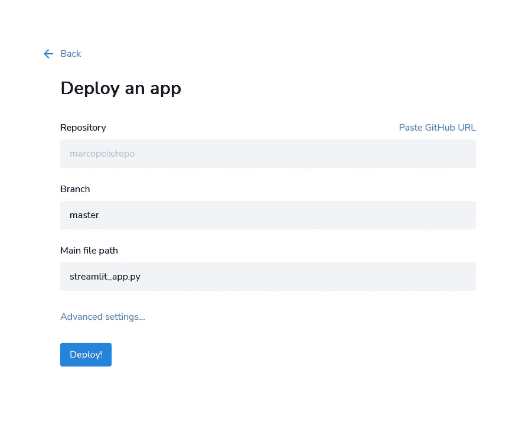

# 使用 Streamlit 部署您的时间序列预测模型

> 原文：[`towardsdatascience.com/deploy-your-time-series-forecasting-model-with-streamlit-c3ce5a7edf19`](https://towardsdatascience.com/deploy-your-time-series-forecasting-model-with-streamlit-c3ce5a7edf19)

## 一份关于使用 Python 构建 Web 应用程序以部署预测模型的实用指南

[](https://medium.com/@marcopeixeiro?source=post_page-----c3ce5a7edf19--------------------------------)[](https://towardsdatascience.com/?source=post_page-----c3ce5a7edf19--------------------------------) [Marco Peixeiro](https://medium.com/@marcopeixeiro?source=post_page-----c3ce5a7edf19--------------------------------)

·发布于[数据科学之路](https://towardsdatascience.com/?source=post_page-----c3ce5a7edf19--------------------------------) ·13 分钟阅读·2023 年 4 月 25 日

--


图片由[SpaceX](https://unsplash.com/@spacex?utm_source=medium&utm_medium=referral)提供，[Unsplash](https://unsplash.com/?utm_source=medium&utm_medium=referral)上获取

作为数据科学家，我们经常处于实验阶段。我们在笔记本中工作，开发脚本以评估模型，然后就停在那里。

然而，我们的工作永远不会真正完成，直到模型被部署。这个关键步骤带来了新的挑战，因为我们必须考虑错误处理和构建与模型互动的接口。

这就是[Streamlit](https://streamlit.io/)的用武之地：它是一个 Python 库，允许我们快速构建数据应用程序，因为我们只需使用 Python 来进行建模部分和构建用户界面。

尽管 Streamlit 是一个很好的原型工具，可以快速部署模型，但它可能无法支持高流量的全面数据应用程序。你应该将其视为为模型添加互动性并与他人分享数据科学工作的方式。

在这篇文章中，我们将探讨使用 Streamlit 部署时间序列模型的部分内容。完整项目是一个多页面应用程序，我们可以在其中探索和预测数据，但在这篇文章中，我们只关注预测功能。

你可以访问[完成的应用程序](https://marcopeix-streamlit-population-canada-main-4rr347.streamlit.app/)并试用它。此外，完整的源代码可在[GitHub](https://github.com/marcopeix/streamlit-population-canada)上获取。

> **通过我的** [**免费时间序列备忘单**](https://www.datasciencewithmarco.com/pl/2147608294) **在 Python 中学习最新的时间序列分析技术！获取统计和深度学习技术的实现，全部使用 Python 和 TensorFlow！**

让我们开始吧！

# 目标

该应用程序的目标是预测加拿大季度人口。数据集取自加拿大统计局，涵盖了 1991 年第三季度到 2023 年第一季度。原始数据可以在[这里](https://www150.statcan.gc.ca/t1/tbl1/en/cv.action?pid=1710000901)找到。

以下是数据集的一个样本。


应用程序中使用的数据集样本。对于每个位置，我们有季度人口估算。图像由作者提供。

使用这个数据集，我们可以获取整个国家的总人口信息，也可以获取每个省份和地区的人口信息。这意味着我们可以在多个目标之间进行选择，在构建应用程序时必须牢记这一点。

# 项目结构

由于我们正在构建一个将部署到生产环境的应用程序，因此项目的结构非常重要。以下是我们为此项目使用的结构。

```py
streamlit-population-canada
├── data
│   └── quarterly_canada_population.csv
├── pages
│   └── forecast.py
├── main.py
├── README.md
└── requirements.txt
```

在我们的项目文件夹中，我们有一个数据文件夹，其中包含包含季度人口估算的 CSV 文件。请注意，我们将从 GitHub URL 读取数据，以避免处理相对和绝对文件路径的问题。

然后，因为我们正在构建一个多页面应用程序，我们有一个`pages`文件夹，其中包含构建界面和输出预测的脚本，即`forecast.py`。

应用程序的主要入口点由文件`main.py`控制，但我们不会涉及它，因为它与预测无关。

最终，文件`requirements.txt`列出了应用程序正常运行所需的所有依赖项。

# 应用程序图

在深入代码之前，我们必须首先确定应用程序的高层次工作方式，以了解每个功能的作用。


应用程序图。图像由作者提供。

从上图中，我们可以看到数据需要被读取并在脚本中提供。

然后，我们添加了一个选项，供用户选择目标和时间范围。我们将这些信息发送到一个函数，该函数将测试不同的模型，并仅使用最佳模型生成预测。

然后，返回预测结果，以便我们可以绘制预测图。同时，我们返回评估指标，以便我们可以可视化它并确定使用了哪个模型。

在有了正确的项目结构和整体构建思路之后，我们现在可以深入代码，开始构建我们的应用程序。

# 读取数据

第一步自然是读取数据。现在，由于这是多页面应用程序的一部分，我们实际上在`main.py`中读取数据，并在`pages/forecast.py`中提供数据。

我们首先定义一个读取数据的函数。注意我们从 URL 读取，这样在部署应用程序时可以避免文件路径的问题。现在，这只是标准代码，用于在笔记本中读取数据。

```py
import streamlit as st
import pandas as pd
import numpy as np

@st.cache_data
def read_data():
    URL = "https://raw.githubusercontent.com/marcopeix/streamlit-population-canada/master/data/quarterly_canada_population.csv"
    df = pd.read_csv(URL, index_col=0, dtype={'Quarter': str, 
                                          'Canada': np.int32,
                                          'Newfoundland and Labrador': np.int32,
                                          'Prince Edward Island': np.int32,
                                          'Nova Scotia': np.int32,
                                          'New Brunswick': np.int32,
                                          'Quebec': np.int32,
                                          'Ontario': np.int32,
                                          'Manitoba': np.int32,
                                          'Saskatchewan': np.int32,
                                          'Alberta': np.int32,
                                          'British Columbia': np.int32,
                                          'Yukon': np.int32,
                                          'Northwest Territories': np.int32,
                                          'Nunavut': np.int32})

    return df 
```

同时注意装饰器`@st.cache_data`的使用。它告诉 Streamlit 如果参数不变就缓存此函数的结果。这样，用户每次更改输入时，我们就不必重新运行函数。这使得应用程序运行得更快。

然后，我们将数据存储在会话状态中。这是一种在 Streamlit 的多个页面之间存储和持久化数据的方法。这样，我们可以在`main.py`中读取数据，并在`pages/forecast.py`中访问这些数据。

```py
df = read_data()

if df not in st.session_state:
    st.session_state['df'] = df
```

它本质上充当一个字典，我们可以在其中存储我们希望从不同页面访问的重要值。

这样，在`pages/forecast.py`中，我们可以通过

```py
df = st.session_state['df'] 
```

即使我们在另一个文件中，我们也不必重复读取数据的函数，我们可以通过会话状态直接访问它。

# 构建界面

现在我们可以访问数据了，让我们构建界面以允许用户选择目标和预测期。

首先，让我们允许用户选择一个目标。在我们的数据集中，目标对应于一个位置，无论是整个国家、省份还是地区。如果你还记得上面显示的数据集示例，可能的目标列表就是数据集中的列名。

所以，让我们创建两个列，以便用户可以在同一行上选择目标和预测期。

```py
import streamlit as st

st.title('Forecast the Quarterly Population in Canada')

col1, col2 = st.columns(2)
```

然后，在第一个列中，我们将创建一个下拉列表，其中包含数据集中所有可能的目标。

```py
target = col1.selectbox('Select your target', df.columns)
```

在上面的代码块中，第一个参数是输入的标签，然后我们传递可能值的列表。默认情况下，列表中的第一个值将被选中。

然后，为了设置预测期，让我们使用滑块。在这里，我将预测期限制在未来 1 到 16 个季度之间，但你可以随意调整这些数字。

```py
horizon = col2.slider('Choose the horizon', min_value=1, max_value=16, value=1, step=1)
```

如你所见，上面的代码非常直观：我们传入输入元素的标签，指定最小值、最大值、默认值，以及增量步骤。

目前，界面看起来是这样的：


迄今为止的应用程序界面。图片由作者提供。

很棒！

现在，让我们添加一个按钮，这样只有当用户设置了目标和预测期后，我们才运行函数以返回预测结果。否则，Streamlit 会在每次检测到变化时运行整个脚本。

```py
forecast_btn = st.button('Forecast')
```

然后我们得到这个：


和以前一样，不过添加了一个按钮。图片由作者提供。

好了，界面已经完成，现在让我们编写逻辑来选择最佳模型并生成预测结果。

# 生成预测

一旦用户设置了目标和预测期，我们希望测试不同的模型，以便根据目标和预测期获得最佳的预测结果。

然后，绘制预测结果并显示评估指标以证明模型选择是有用的。这是我们在本节中实现的功能。

## 模型选择过程

对于这个应用程序，我们将测试三种不同的模型：

1.  [自回归模型](https://www.datasciencewithmarco.com/blog/time-series-forecasting-with-autoregressive-processes)

1.  双重指数平滑

1.  [Theta 模型](https://www.datasciencewithmarco.com/blog/theta-model-for-time-series-forecasting)

详细介绍每个模型会太长，因此如果您想详细了解每个模型，我已链接到其他文章。

现在，对于每个模型，我们将在训练集上训练它，并在测试集上进行评估。测试集将包含数据的最后 32 个时间步长，其余部分将用于训练。

此外，我们将进行滚动预测，例如模拟使用新数据更新模型并进行新预测的过程。这意味着如果时间范围设置为 2 个时间步长，那么模型将一次预测 2 个未来时间步长，直到预测完所有测试集，如下所示。


可视化滚动预测。模型在初始训练集上进行训练并进行预测。然后，更新训练集，模型进行另一组预测，直到覆盖整个测试集。图片由作者提供。

所有这些逻辑都转化为下面的代码块。

```py
@st.cache_data
def rolling_predictions(df, train_len, horizon, window, method):

    TOTAL_LEN = len(df)

    if method == 'ar':
        best_lags = ar_select_order(df[:train_len], maxlag=8, glob=True).ar_lags
        pred_AR = []

        for i in range(train_len, TOTAL_LEN, window):
            ar_model = AutoReg(df[:i], lags=best_lags)
            res = ar_model.fit()
            predictions = res.predict(i, i + window -1)
            oos_pred = predictions[-window:]
            pred_AR.extend(oos_pred)

        return pred_AR[:horizon]

    elif method == 'holt':
        pred_holt = []

        for i in range(train_len, TOTAL_LEN, window):
            des = Holt(df[:i], initialization_method='estimated').fit()
            predictions = des.forecast(window)
            pred_holt.extend(predictions)

        return pred_holt[:horizon]

    elif method == 'theta':
        pred_theta = []

        for i in range(train_len, TOTAL_LEN, window):
            tm = ThetaModel(endog=df[:i], deseasonalize=False)
            res = tm.fit()
            preds = res.forecast(window)
            pred_theta.extend(preds)

        return pred_theta[:horizon]
```

在上面的代码块中，我们简单地对每个模型进行训练，使用初始训练集，并通过更新训练集并进行预测，直到我们对整个测试集有预测结果。

## 评估指标

为了选择最佳模型，我们使用对称平均绝对百分比误差或 sMAPE。原因是 MAPE 倾向于偏向 *低估* 的模型。sMAPE 修复了这个问题，其定义为：


sMAPE 的公式。图片由作者提供。

因此，让我们定义一个计算 sMAPE 的函数：

```py
def smape(actual, predicted):

    if not all([isinstance(actual, np.ndarray), isinstance(predicted, np.ndarray)]):
        actual, predicted = np.array(actual), np.array(predicted)

    return round(np.mean(np.abs(predicted - actual) / ((np.abs(predicted) + np.abs(actual))/2))*100, 2)
```

## 选择最佳模型

让我们开始编写运行模型选择过程的函数。它接受数据集、目标和时间范围，我们首先定义训练集和测试集。

```py
@st.cache_data
def test_and_predict(df, col_name, horizon):
    df = df.reset_index()
    model_list = ['ar', 'holt', 'theta']
    train = df[col_name][:-32]
    test = df[['Quarter', col_name]][-32:]
    total_len = len(df)

    train_len = len(train)
    test_len = len(test)
```

接着，我们使用我们的 `rolling_predictions` 函数在测试集上生成预测。

```py
pred_AR = rolling_predictions(df[col_name], train_len, test_len, horizon, 'ar')
pred_holt = rolling_predictions(df[col_name], train_len, test_len, horizon, 'holt')
pred_theta = rolling_predictions(df[col_name], train_len, test_len, horizon, 'theta')

test['pred_AR'] = pred_AR
test['pred_holt'] = pred_holt
test['pred_theta'] = pred_theta
```

现在，我们已经拥有整个测试集的所有预测结果，我们可以使用 sMAPE 来评估每个模型。

```py
smapes = []

smapes.append(smape(test[col_name], test['pred_AR']))
smapes.append(smape(test[col_name], test['pred_holt']))    
smapes.append(smape(test[col_name], test['pred_theta'])) 
```

然后，最佳模型就是获得最低 sMAPE 的模型。

```py
best_model = model_list[np.argmin(smapes)]
```

然后，我们可以简单地使用最佳模型来获取预测结果。

## 进行预测

根据哪个模型获得了最低的 sMAPE，我们将对其进行全面数据集训练，以生成样本外预测并实际预测未来。

这可以通过简单的 if 语句完成。

```py
if best_model == 'ar':
    best_lags = ar_select_order(train, maxlag=8, glob=True).ar_lags
    ar_model = AutoReg(df[col_name], lags=best_lags)
    res = ar_model.fit()
    predictions = res.predict(total_len, total_len + horizon - 1)

    return predictions, smapes

elif best_model == 'holt':
    des = Holt(df[col_name], initialization_method='estimated').fit()
    predictions = des.forecast(horizon)

    return predictions, smapes

elif best_model == 'theta':
    tm = ThetaModel(endog=df[col_name], deseasonalize=False)
    res = tm.fit()
    predictions = res.forecast(horizon)
```

然后，我们的 `test_and_predict` 函数将返回每个模型的预测结果和 sMAPE。这样，我们可以可视化每个模型的预测和评估指标。

完整的函数如下所示。

```py
@st.cache_data
def test_and_predict(df, col_name, horizon):
    df = df.reset_index()
    model_list = ['ar', 'holt', 'theta']
    train = df[col_name][:-32]
    test = df[['Quarter', col_name]][-32:]
    total_len = len(df)

    train_len = len(train)
    test_len = len(test)

    pred_AR = rolling_predictions(df[col_name], train_len, test_len, horizon, 'ar')
    pred_holt = rolling_predictions(df[col_name], train_len, test_len, horizon, 'holt')
    pred_theta = rolling_predictions(df[col_name], train_len, test_len, horizon, 'theta')

    test['pred_AR'] = pred_AR
    test['pred_holt'] = pred_holt
    test['pred_theta'] = pred_theta

    smapes = []

    smapes.append(smape(test[col_name], test['pred_AR']))
    smapes.append(smape(test[col_name], test['pred_holt']))    
    smapes.append(smape(test[col_name], test['pred_theta']))    

    best_model = model_list[np.argmin(smapes)]

    if best_model == 'ar':
        best_lags = ar_select_order(train, maxlag=8, glob=True).ar_lags
        ar_model = AutoReg(df[col_name], lags=best_lags)
        res = ar_model.fit()
        predictions = res.predict(total_len, total_len + horizon - 1)

        return predictions, smapes

    elif best_model == 'holt':
        des = Holt(df[col_name], initialization_method='estimated').fit()
        predictions = des.forecast(horizon)

        return predictions, smapes

    elif best_model == 'theta':
        tm = ThetaModel(endog=df[col_name], deseasonalize=False)
        res = tm.fit()
        predictions = res.forecast(horizon)

        return predictions, smapes 
```

# 点击按钮时获取预测

我们已经有了界面，并且有了测试和生成预测的所有逻辑。现在，我们只需要将它们连接起来。

我们可以通过 if 语句检测按钮是否被点击，因为 Streamlit 在按钮被点击时返回 `True`。

```py
if forecast_btn:
    preds, smapes = test_and_predict(df, target, horizon)
```

请注意，在上面的代码块中，`target` 和 `horizon` 是本文中早些时候定义的变量，它们分别捕获了用户通过下拉菜单和滑块设置的信息。

然后，在 if 语句内部，我们生成两个图：一个用于预测，另一个用于评估指标。

在 Streamlit 中绘图就像在 Jupyter notebook 中使用 `matplotlib` 一样。我们只是使用 `pyplot` 方法渲染图表。

```py
tab1, tab2 = st.tabs(['Predictions', 'Model evaluation'])
pred_fig, pred_ax = plt.subplots()
pred_ax.plot(df[target])
pred_ax.plot(preds, label='Forecast')
pred_ax.set_xlabel('Time')
pred_ax.set_ylabel('Population')
pred_ax.legend(loc=2)
pred_ax.set_xticks(np.arange(2, len(df) + len(preds), 8))
pred_ax.set_xticklabels(np.arange(1992, 2024 + floor(len(preds)/4), 2))
pred_fig.autofmt_xdate()
tab1.pyplot(pred_fig)
```

上面代码块的结果如下：


显示最佳模型的预测结果。图片由作者提供。

如你所见，用户选择了加拿大作为目标，并选择了 16 个季度的预测期。点击按钮后，图表被渲染出来。

然后，让我们绘制一个条形图，以查看哪个模型在测试过程中表现最佳。

```py
eval_fig, eval_ax = plt.subplots()

x = ['AR', 'DES', 'Theta']
y = smapes

eval_ax.bar(x, y, width=0.4)
eval_ax.set_xlabel('Models')
eval_ax.set_ylabel('sMAPE')
eval_ax.set_ylim(0, max(smapes)+0.1)

for index, value in enumerate(y):
    plt.text(x=index, y=value + 0.015, s=str(round(value,2)), ha='center')

tab2.pyplot(eval_fig)
```

这给出如下结果：


显示每个模型的 sMAPE。在这里，AR 模型在测试中实现了最低的 sMAPE，用于预测未来 16 个季度的加拿大人口。图片由作者提供。

从上图中，我们看到 AR 模型是最佳模型，因为它实现了最低的 sMAPE，特别是在预测未来 16 个季度的加拿大季度人口时。因此，AR 模型被用来进行我们在上图中看到的超出样本的预测。

太棒了，一切在本地机器上都运作良好，现在让我们实际部署它，并与全世界分享吧！

# 部署到生产环境

部署 Streamlit 应用程序最简单（且免费的）方式是使用 [Streamlit Community Cloud](https://streamlit.io/cloud)。

要部署一个应用程序，你需要：

+   一个用于托管应用程序源代码的 GitHub 帐户

+   一个 Streamlit Community Cloud 帐户（免费）

+   一个 `requirements.txt` 文件来列出依赖项

## 列出依赖项

部署 Streamlit 应用程序最困难的部分实际上是列出依赖项，特别是如果你在 Windows 机器上使用 Anaconda（像我一样）。

如果你使用的是 Linux，那么 `pip freeze > requirements.txt` 就非常简单。

在撰写时，Streamlit 的文档表明他们支持可以通过 Anaconda 生成的 `environment.yml` 文件，但我发现这会破坏部署过程。所以，你需要使用 .txt 文件。

使用 Anaconda，运行 `conda list -e > requirements.txt`。然而，你的文件将无法正确格式化，并且会有很多错误，需要你手动修复。

解决这个问题的一个简单方法是去除脚本开头未实际导入的所有包。在我们的案例中，这些包是：

+   pandas

+   numpy

+   matplotlib

+   statsmodels

文件中的其他内容可以删除。

同时，删除`streamlit`依赖项非常重要，因为这会破坏部署过程。你可以查看你的文件应该是什么样子的[这里](https://github.com/marcopeix/streamlit-population-canada/blob/master/requirements.txt)。

## 上线生产

一旦列出了依赖项，请确保所有代码都在 GitHub 仓库中。

然后，在你的 Streamlit Community Cloud 账户中，点击“新应用”。


Streamlit Community Cloud 界面。图片由作者提供。

然后，只需指定仓库的 URL、分支（应为 master）和主文件路径。通常，项目根目录下有一个主 Python 脚本。



部署 Streamlit 应用程序的表单。图片由作者提供。

然后，只需点击“部署”，就完成了！你将获得一个链接，可以用来与大家分享你的应用！

如果你想查看最终的完整结果，可以在[这里](https://marcopeix-streamlit-population-canada-main-4rr347.streamlit.app/)查看应用！

# 结论

使用 Streamlit 部署模型直观且简单。仅使用 Python，我们创建了一个交互式 Web 界面，可以缓存数据、读取用户输入、运行模型并生成未来的预测！

我希望这篇文章能激励你进一步探究 Streamlit，并制作你自己的小应用！

如果你想掌握时间序列预测，那么查看我的课程：[Python 中的应用时间序列预测](https://www.datasciencewithmarco.com/offers/zTAs2hi6/checkout?coupon_code=ATSFP10)。这是唯一一个在 15 个指导项目中实现统计学、深度学习和最先进模型的课程。

干杯 🍻

# 支持我

喜欢我的工作吗？通过[买杯咖啡](http://buymeacoffee.com/dswm)来支持我，这是鼓励我的一种简单方式，而我可以享受一杯咖啡！如果你愿意，只需点击下面的按钮 👇


