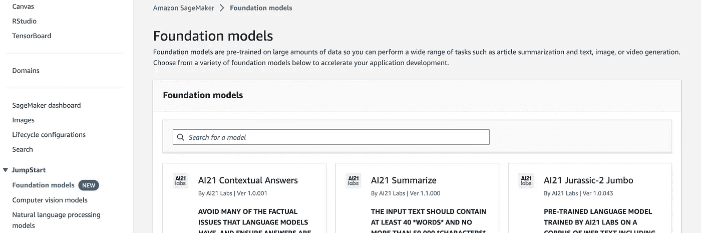
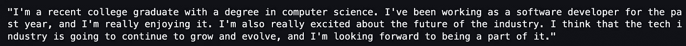
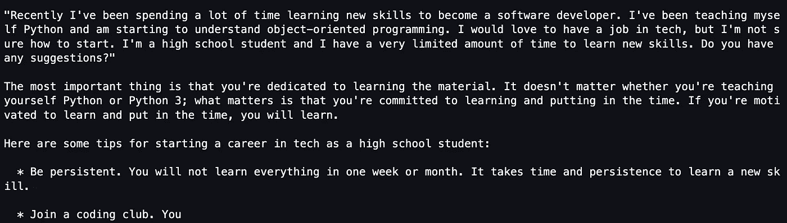
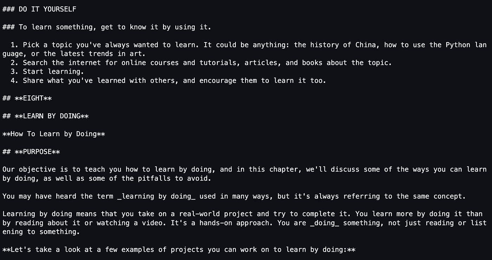
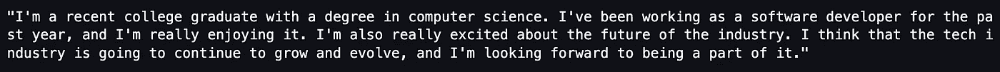
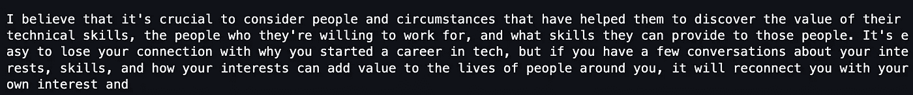

# 在 Amazon SageMaker 上部署 Cohere 语言模型

> 原文：[`towardsdatascience.com/deploying-cohere-language-models-on-amazon-sagemaker-23a3f79639b1`](https://towardsdatascience.com/deploying-cohere-language-models-on-amazon-sagemaker-23a3f79639b1)

## 在 AWS 上扩展和托管 LLMs

[](https://ram-vegiraju.medium.com/?source=post_page-----23a3f79639b1--------------------------------)[](https://towardsdatascience.com/?source=post_page-----23a3f79639b1--------------------------------) [Ram Vegiraju](https://ram-vegiraju.medium.com/?source=post_page-----23a3f79639b1--------------------------------)

·发布于 [Towards Data Science](https://towardsdatascience.com/?source=post_page-----23a3f79639b1--------------------------------) ·阅读时间 7 分钟·2023 年 5 月 18 日

--


图片来自 [Unsplash](https://unsplash.com/photos/EgwhIBec0Ck) 由 [Sigmund](https://unsplash.com/@sigmund) 提供

大型语言模型（LLMs）和生成型人工智能正在加速各行各业的机器学习增长。LLMs 使机器学习的范围达到了惊人的高度，但也带来了新的一系列挑战。

大型语言模型（LLMs）的规模在机器学习生命周期的训练和托管部分都带来了困难的问题。尤其是在 LLMs 的托管方面，有许多挑战需要考虑。我们如何将模型适配到单个 GPU 上进行推理？我们如何在不妨碍准确性的情况下应用模型压缩和分割技术？我们如何提高这些 LLMs 的推理延迟和吞吐量？

要解决这些问题，需要高级机器学习工程技术，我们必须在一个可以在容器和硬件层面应用压缩和并行化技术的平台上协调模型托管。有像 [DJL Serving](https://github.com/deepjavalibrary/djl-serving/tree/master) 这样的解决方案提供 [适配于 LLM 托管的容器](https://aws.amazon.com/blogs/machine-learning/deploy-bloom-176b-and-opt-30b-on-amazon-sagemaker-with-large-model-inference-deep-learning-containers-and-deepspeed/)，但我们在本文中不会探讨这些。

在本文中，我们将探讨[SageMaker JumpStart 基础模型](https://aws.amazon.com/sagemaker/jumpstart/getting-started/?sagemaker-jumpstart-cards.sort-by=item.additionalFields.priority&sagemaker-jumpstart-cards.sort-order=asc&awsf.sagemaker-jumpstart-filter-product-type=*all&awsf.sagemaker-jumpstart-filter-text=*all&awsf.sagemaker-jumpstart-filter-vision=*all&awsf.sagemaker-jumpstart-filter-tabular=*all&awsf.sagemaker-jumpstart-filter-audio-tasks=*all&awsf.sagemaker-jumpstart-filter-multimodal=*all&awsf.sagemaker-jumpstart-filter-RL=*all)。使用基础模型时，我们无需担心容器或模型并行化和压缩技术，而是主要关注直接部署预训练模型和选择硬件。特别是本文中，我们将探讨一个名为[Cohere](https://cohere.com/)的热门 LLM 提供商，以及如何在 SageMaker 上托管其流行的语言模型进行推理。

**注意**：对于新接触 AWS 的用户，如果你想跟随教程，确保在以下[链接](https://aws.amazon.com/console/)上创建一个账户。本文还假设你对 SageMaker 部署有一定的了解，我建议你参考这篇[文章](https://aws.amazon.com/blogs/machine-learning/part-2-model-hosting-patterns-in-amazon-sagemaker-getting-started-with-deploying-real-time-models-on-sagemaker/)以更深入地理解部署/推理。特别是对于 SageMaker JumpStart，我建议参考这篇[博客](https://awstip.com/automl-beyond-with-sagemaker-jumpstart-9962ffc4bcd1)。

## 什么是 SageMaker JumpStart？什么是基础模型？

SageMaker JumpStart 本质上是 SageMaker 的模型库。在这里有各种不同的预训练模型，这些模型已经容器化并可以通过 SageMaker Python SDK 部署。主要的价值在于，客户无需担心调整或配置容器来托管特定模型，这些繁重的工作已经处理好了。

针对大型语言模型（LLMs），JumpStart 基础模型推出了来自各种提供商的热门语言模型，如 Stability AI 和 Cohere。在 SageMaker 控制台上，你可以查看所有可用的基础模型的完整列表。



SageMaker JumpStart 基础模型（作者截图）

这些基础模型也可以通过[AWS MarketPlace](https://aws.amazon.com/marketplace)访问，你可以订阅那些默认情况下可能无法访问的特定模型。在我们将使用的 Cohere Medium 模型的情况下，这应该可以通过 JumpStart 无需任何订阅即可访问，但如果遇到任何问题，你可以通过以下[链接](https://aws.amazon.com/marketplace/pp/prodview-6dmzzso5vu5my)申请访问。

## Cohere Medium 语言模型部署

在这个示例中，我们将特别探讨如何通过 SageMaker JumpStart 部署 Cohere 的 GPT Medium 语言模型。在开始之前，我们需要安装 [cohere-sagemaker](https://github.com/cohere-ai/cohere-sagemaker/tree/main) SDK。这个 SDK 进一步简化了部署过程，因为它在通常的 SageMaker 推理构造（SageMaker 模型、SageMaker 端点配置和 SageMaker 端点）之上构建了一个包装器。

```py
!pip install cohere-sagemaker --quiet
```

从这个 SDK 中，我们导入了 [Client](https://github.com/cohere-ai/cohere-sagemaker/blob/main/cohere_sagemaker/client.py) 对象，它将帮助我们创建端点并进行推理。

```py
from cohere_sagemaker import Client
import boto3
```

如果我们访问 Marketplace 链接，会看到这个模型通过 Model Package 提供。因此，下一步我们提供 Cohere Medium 模型的 Model Package ARN。请注意，这个特定模型目前仅在 US-East-1 和 EU-West-1 区域可用。

```py
# Currently us-east-1 and eu-west-1 only supported
model_package_map = {
    "us-east-1": "arn:aws:sagemaker:us-east-1:865070037744:model-package/cohere-gpt-medium-v1-5-15e34931a06235b7bac32dca396a970a",
    "eu-west-1": "arn:aws:sagemaker:eu-west-1:985815980388:model-package/cohere-gpt-medium-v1-5-15e34931a06235b7bac32dca396a970a",
}

region = boto3.Session().region_name
if region not in model_package_map.keys():
    raise Exception(f"Current boto3 session region {region} is not supported.")

model_package_arn = model_package_map[region]
```

现在我们有了模型包，我们可以实例化我们的 Client 对象并创建端点。使用 JumpStart，我们需要提供模型包详细信息、实例类型和数量，以及端点名称。

```py
# instantiate client
co = Client(region_name=region)
co.create_endpoint(arn=model_package_arn, endpoint_name="cohere-gpt-medium", 
instance_type="ml.g5.xlarge", n_instances=1)
```

对于像 Cohere 这样的语言模型，我们推荐主要使用基于 GPU 的实例类型，例如 g5 系列、p3/p2 系列和 g4dn 实例类。这些实例都有足够的计算和内存来处理这些模型的大小。有关进一步的指导，您还可以参考 MarketPlace 对您选择的特定模型所建议的实例。

接下来，我们使用 [generate](https://docs.cohere.com/reference/generate) API 调用进行样例推理，该调用将为我们提供的提示创建文本。这个 generate API 调用作为 Cohere 对 [invoke_endpoint](https://boto3.amazonaws.com/v1/documentation/api/latest/reference/services/sagemaker-runtime/client/invoke_endpoint.html) API 调用的封装，后者通常用于 SageMaker 端点。

```py
prompt = "Write a LinkedIn post about starting a career in tech:"

# API Call
response = co.generate(prompt=prompt, max_tokens=100, temperature=0, return_likelihoods='GENERATION')
print(response.generations[0].text)
```



样例推理（作者截图）

## 参数调整

要深入了解可以调整的不同 LLM 参数，我会参考 Cohere 的官方文章 [这里](https://txt.cohere.com/llm-parameters-best-outputs-language-ai/)。我们主要关注于调整在 generate API 调用中看到的两个不同参数。

1.  **max_tokens**：正如词语所示，最大 token 数量是我们 LLM 可以生成的 token 数量限制。LLM 定义的 token 可能有所不同，可以是字符、词、短语或更多。Cohere 使用字节对编码来定义他们的 tokens。要完全理解他们的模型如何定义 token，请参考以下[文档](https://docs.cohere.com/docs/tokens?ref=txt.cohere.com&__hstc=14363112.43b26d84fbf6221bc6cd1a688e60c028.1684346313808.1684346313808.1684346313808.1&__hssc=14363112.2.1684346313808&__hsfp=4188686977)。实际上，我们可以在此参数上进行迭代，以找到一个最佳值，因为我们不希望一个太小的值，因为它不能很好地回答我们的提示，也不希望一个太大的值，以至于响应没有多大意义。Cohere 的生成模型支持最多 2048 个 tokens。

1.  **温度**：温度参数帮助控制模型的“创造力”。例如，当生成一个词时，会有一个词的列表，其中每个词有不同的概率用于下一个词。当温度参数较低时，模型倾向于选择概率最高的词。当我们增加温度时，响应往往会有较大的多样性，因为模型开始选择概率较低的词。对于这个模型，该参数的范围是 0 到 5。

首先，我们可以探索在`max_token`大小上的迭代。我们创建一个包含 5 个任意 token 大小的数组，并在保持温度不变的情况下循环进行推断。

```py
token_range = [100, 200, 300, 400, 500]

for token in token_range:
    response = co.generate(prompt=prompt, max_tokens=token, temperature=0.9, return_likelihoods='GENERATION')
    print("-----------------------------------")
    print(response.generations[0].text)
    print("-----------------------------------")
```

正如预期的那样，我们可以看到每个响应的长度差异。



Token Size 200（作者截图）



Token Size 300（作者截图）

我们还可以通过遍历 0 到 5 之间的值来测试温度参数。

```py
for i in range(5):
    response = co.generate(prompt=prompt, max_tokens=100, temperature=i, return_likelihoods='GENERATION')
    print("-----------------------------------")
    print(response.generations[0].text)
    print("-----------------------------------")
```

我们可以看到，在值为 1 时，我们获得了一个非常现实的输出，大部分情况下是有意义的。



温度 1（作者截图）

在温度为 5 时，我们看到的输出虽然有一定的意义，但由于词汇选择，偏离主题极为严重。



温度 5（作者截图）

如果你想测试这些参数的所有不同组合以找到最佳配置，你也可以运行以下代码块。

```py
import itertools

# Create array of all combinations of both params
temperature = [0,1,2,3,4,5]
params = [token_range, temperature]
param_combos = list(itertools.product(*params))

for param in param_combos:
    response = co.generate(prompt=prompt, max_tokens=param[0], 
    temperature=param[1], return_likelihoods='GENERATION')
```

## 额外资源与结论

[](https://github.com/RamVegiraju/SageMaker-Deployment/blob/master/LLM-Hosting/JumpStart/cohere-medium.ipynb?source=post_page-----23a3f79639b1--------------------------------) [## SageMaker-Deployment/cohere-medium.ipynb at master · RamVegiraju/SageMaker-Deployment

### 你现在无法执行该操作。你在另一个标签或窗口中登录了。你在另一个标签或窗口中注销了…

github.com](https://github.com/RamVegiraju/SageMaker-Deployment/blob/master/LLM-Hosting/JumpStart/cohere-medium.ipynb?source=post_page-----23a3f79639b1--------------------------------)

整个示例的代码可以在上面的链接中找到（请继续关注更多 LLM 和 JumpStart 示例）。借助 SageMaker JumpStart 的基础模型，可以轻松通过 API 调用来托管 LLM，而无需处理容器化和模型服务的繁琐工作。希望这篇文章对 LLM 与 Amazon SageMaker 的介绍有所帮助，随时欢迎留下反馈或提问。

*如果你喜欢这篇文章，请随时通过* [*LinkedIn*](https://www.linkedin.com/in/ram-vegiraju-81272b162/) *与我联系，并订阅我的 Medium* [*Newsletter*](https://ram-vegiraju.medium.com/subscribe)*。如果你是 Medium 的新用户，可以使用我的* [*Membership Referral*](https://ram-vegiraju.medium.com/membership)*进行注册。*
