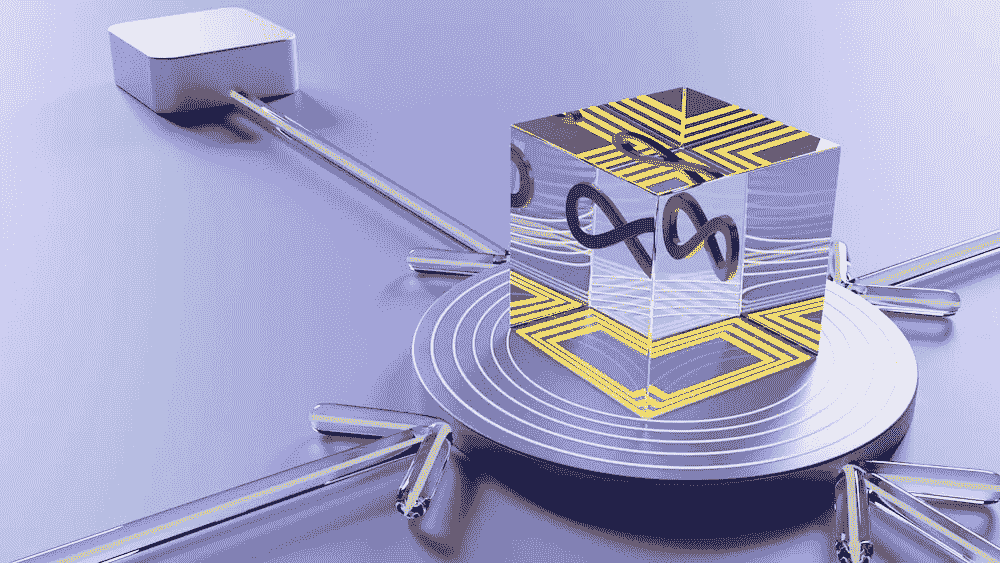
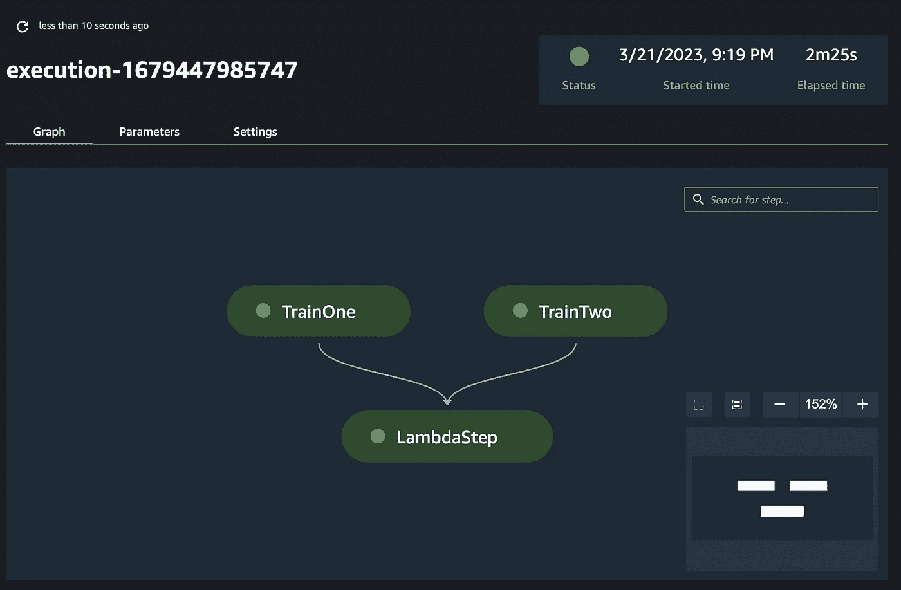
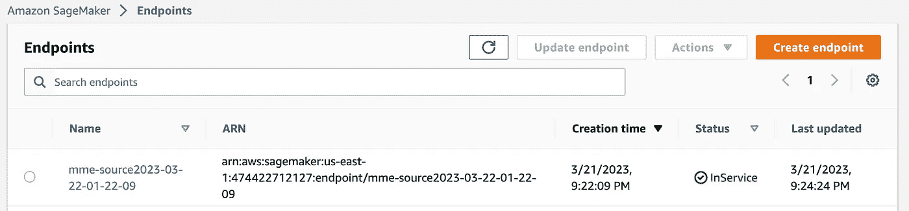

# 使用 SageMaker Pipelines 部署多个模型

> 原文：[`towardsdatascience.com/deploying-multiple-models-with-sagemaker-pipelines-fb7363094c50`](https://towardsdatascience.com/deploying-multiple-models-with-sagemaker-pipelines-fb7363094c50)

## 应用 MLOps 最佳实践于高级服务选项

[](https://ram-vegiraju.medium.com/?source=post_page-----fb7363094c50--------------------------------)[](https://towardsdatascience.com/?source=post_page-----fb7363094c50--------------------------------) [Ram Vegiraju](https://ram-vegiraju.medium.com/?source=post_page-----fb7363094c50--------------------------------)

·发表于 [Towards Data Science](https://towardsdatascience.com/?source=post_page-----fb7363094c50--------------------------------) ·8 分钟阅读·2023 年 3 月 23 日

--



图片来源于 [Unsplash](https://unsplash.com/photos/f7uCQxhucw4) 由 [Growtika](https://unsplash.com/@growtika) 提供

MLOps 是将你的机器学习工作流投入生产的关键实践。通过 MLOps，你可以建立适用于 ML 生命周期的工作流。这使得集中维护资源、更新/跟踪模型变得更容易，并且随着你的 ML 实验规模的扩大，整个过程变得更加简化。

[Amazon SageMaker](https://aws.amazon.com/sagemaker/) 生态系统中的一个关键 MLOps 工具是 [SageMaker Pipelines](https://aws.amazon.com/sagemaker/pipelines/)。通过 SageMaker Pipelines，你可以定义由不同的 ML **步骤** 组成的工作流。你还可以通过定义 **参数** 来结构化这些工作流，并将这些参数作为变量注入到你的管道中。有关 SageMaker Pipelines 的更一般介绍，请参考 相关文章。

定义管道本身并不复杂，但有一些高级用例需要额外的配置。具体来说，假设你正在训练多个模型，这些模型在你的机器学习用例中用于推理。在 SageMaker 中，有一个被称为 [多模型端点](https://docs.aws.amazon.com/sagemaker/latest/dg/multi-model-endpoints.html)（MME）的托管选项，你可以在单个端点上托管多个模型并调用目标模型。然而，目前在 SageMaker Pipelines 中没有原生支持定义或部署 MME。在这篇博客文章中，我们将探讨如何利用 [Pipelines Lambda 步骤](https://docs.aws.amazon.com/sagemaker/latest/dg/build-and-manage-steps.html#step-type-lambda) 以自定义方式部署多模型端点，同时遵循 MLOps 最佳实践。

**注意**：如果你是 AWS 的新手，请确保在以下[链接](https://aws.amazon.com/console/)上注册一个账户，以便跟随操作。本文还假设你对 SageMaker 部署有中级了解，我建议参考这篇[文章](https://aws.amazon.com/blogs/machine-learning/part-2-model-hosting-patterns-in-amazon-sagemaker-getting-started-with-deploying-real-time-models-on-sagemaker/)以深入理解部署/推理。特别是，对于 SageMaker 多模型终端，我建议参考以下[博客](https://aws.amazon.com/blogs/machine-learning/part-3-model-hosting-patterns-in-amazon-sagemaker-run-and-optimize-multi-model-inference-with-amazon-sagemaker-multi-model-endpoints/)。

## 设置

在这个例子中，我们将在[SageMaker Studio](https://aws.amazon.com/sagemaker/studio/)中工作，这里我们可以访问 SageMaker 管道和其他 SageMaker 组件的可视化界面。为了开发，我们将利用一个带有数据科学内核的 Studio Notebook 实例，在一个 ml.t3.medium 实例上。要开始，我们首先需要导入在 SageMaker 管道中将要使用的不同步骤所需的库。

```py
import os
import boto3
import re
import time
import json
from sagemaker import get_execution_role, session
import pandas as pd

from time import gmtime, strftime
import sagemaker
from sagemaker.model import Model
from sagemaker.image_uris import retrieve
from sagemaker.workflow.pipeline_context import PipelineSession
from sagemaker.workflow.model_step import ModelStep
from sagemaker.inputs import TrainingInput
from sagemaker.workflow.steps import TrainingStep
from sagemaker.workflow.parameters import ParameterString
from sagemaker.estimator import Estimator

# Custom Lambda Step
from sagemaker.workflow.lambda_step import (
    LambdaStep,
    LambdaOutput,
    LambdaOutputTypeEnum,
)
from sagemaker.lambda_helper import Lambda
from sagemaker.workflow.pipeline import Pipeline
```

接下来，我们创建一个[管道会话](https://sagemaker.readthedocs.io/en/stable/workflows/pipelines/sagemaker.workflow.pipelines.html#pipeline-context)，这个管道会话确保在管道实际执行之前，没有任何训练作业会在笔记本中实际执行。

```py
pipeline_session = PipelineSession()
```

在这个例子中，我们将利用[Abalone 数据集](https://archive.ics.uci.edu/ml/datasets/abalone)（CC BY 4.0）并在其上运行[SageMaker XGBoost 算法](https://aws.plainenglish.io/end-to-end-example-of-sagemaker-xgboost-eb9eae8a5207)来进行回归模型。你可以从公开可用的 Amazon 数据集中下载该数据集。

```py
!aws s3 cp s3://sagemaker-sample-files/datasets/tabular/uci_abalone/train_csv/abalone_dataset1_train.csv .
!aws s3 cp abalone_dataset1_train.csv s3://{default_bucket}/xgboost-regression/train.csv
training_path = 's3://{}/xgboost-regression/train.csv'.format(default_bucket)
```

然后我们可以[参数化](https://docs.aws.amazon.com/sagemaker/latest/dg/build-and-manage-parameters.html)我们的管道，通过定义训练数据集和实例类型的默认值。

```py
training_input_param = ParameterString(
    name = "training_input",
    default_value=training_path,
)

training_instance_param = ParameterString(
    name = "training_instance",
    default_value = "ml.c5.xlarge")
```

然后我们还会检索[AWS 提供的容器](https://aws.plainenglish.io/how-to-retrieve-amazon-sagemaker-deep-learning-images-ff4a5866299e)，这是我们将用于训练和推理的 XGBoost 容器。

```py
model_path = f's3://{default_bucket}/{s3_prefix}/xgb_model'

image_uri = sagemaker.image_uris.retrieve(
    framework="xgboost",
    region=region,
    version="1.0-1",
    py_version="py3",
    instance_type=training_instance_param,
)

image_uri
```

## 训练设置

在我们管道的训练部分，我们将配置 SageMaker XGBoost 算法以适应我们的回归 Abalone 数据集。

```py
xgb_train_one = Estimator(
    image_uri=image_uri,
    instance_type=training_instance_param,
    instance_count=1,
    output_path=model_path,
    sagemaker_session=pipeline_session,
    role=role
)

xgb_train_one.set_hyperparameters(
    objective="reg:linear",
    num_round=40,
    max_depth=4,
    eta=0.1,
    gamma=3,
    min_child_weight=5,
    subsample=0.6,
    silent=0,
)
```

对于我们的第二个估算器，我们将更改超参数来调整模型训练，这样我们就在我们的多模型终端后面有两个独立的模型。

```py
xgb_train_two = Estimator(
    image_uri=image_uri,
    instance_type=training_instance_param,
    instance_count=1,
    output_path=model_path,
    sagemaker_session=pipeline_session,
    role=role
)

#adjusting hyperparams
xgb_train_two.set_hyperparameters(
    objective="reg:linear",
    num_round=50,
    max_depth=5,
    eta=0.2,
    gamma=4,
    min_child_weight=6,
    subsample=0.7,
    silent=0,
)
```

然后我们配置两个估算器的训练输入，以指向我们为 S3 训练数据集定义的参数。

```py
train_args_one = xgb_train_one.fit(
    inputs={
        "train": TrainingInput(
            s3_data=training_input_param,
            content_type="text/csv",
        )
    }
)

train_args_two = xgb_train_two.fit(
    inputs={
        "train": TrainingInput(
            s3_data=training_input_param,
            content_type="text/csv",
        )
    }
)
```

然后我们定义两个独立的训练步骤，这些步骤将通过我们的管道并行执行。

```py
step_train_one = TrainingStep(
    name="TrainOne",
    step_args=train_args_one,
)

step_train_two = TrainingStep(
    name = "TrainTwo",
    step_args= train_args_two
)
```

## Lambda 步骤

[Lambda 步骤](https://aws.amazon.com/blogs/machine-learning/use-a-sagemaker-pipeline-lambda-step-for-lightweight-model-deployments/) 本质上允许你在管道中插入 Lambda 函数。每个 SageMaker 训练作业都会生成一个包含训练模型工件的 model.tar.gz 文件。这里我们将利用 Lambda 步骤来检索训练好的模型工件，并将其部署到 SageMaker 多模型端点。

在此之前，我们需要给予 Lambda 函数适当的权限来使用 SageMaker。我们可以使用以下现有 [脚本](https://github.com/aws/amazon-sagemaker-examples/blob/main/sagemaker-pipelines/tabular/lambda-step/iam_helper.py) 来为 Lambda 函数创建一个 IAM 角色。

```py
import boto3
import json

iam = boto3.client("iam")

def create_lambda_role(role_name):
    try:
        response = iam.create_role(
            RoleName=role_name,
            AssumeRolePolicyDocument=json.dumps(
                {
                    "Version": "2012-10-17",
                    "Statement": [
                        {
                            "Effect": "Allow",
                            "Principal": {"Service": "lambda.amazonaws.com"},
                            "Action": "sts:AssumeRole",
                        }
                    ],
                }
            ),
            Description="Role for Lambda to call SageMaker functions",
        )

        role_arn = response["Role"]["Arn"]

        response = iam.attach_role_policy(
            RoleName=role_name,
            PolicyArn="arn:aws:iam::aws:policy/service-role/AWSLambdaBasicExecutionRole",
        )

        response = iam.attach_role_policy(
            PolicyArn="arn:aws:iam::aws:policy/AmazonSageMakerFullAccess", RoleName=role_name
        )

        return role_arn

    except iam.exceptions.EntityAlreadyExistsException:
        print(f"Using ARN from existing role: {role_name}")
        response = iam.get_role(RoleName=role_name)
        return response["Role"]["Arn"]
```

```py
from iam_helper import create_lambda_role

lambda_role = create_lambda_role("lambda-deployment-role")
```

在定义了 Lambda 角色后，我们可以创建一个 Lambda 函数，为我们完成一些任务：

+   将每个训练作业的 model.tar.gz 文件放入包含两个 tarball 的中央 S3 位置。对于**MME 他们期望所有模型 tarball 都在一个单一的 S3 路径中**。

+   使用 boto3 客户端与 SageMaker 一起创建 SageMaker 模型、端点配置和端点。

我们可以利用以下辅助函数来完成第一个任务，将训练作业工件复制到包含两个模型 tarball 的中央 S3 位置。

```py
sm_client = boto3.client("sagemaker")
s3 = boto3.resource('s3')

def extract_bucket_key(model_data):
    """
    Extracts the bucket and key from the model data tarballs that we are passing in
    """
    bucket = model_data.split('/', 3)[2]
    key = model_data.split('/', 3)[-1]
    return [bucket, key]

def create_mme_dir(model_data_dir):
    """
    Takes in a list of lists with the different trained models, 
    creates a central S3 bucket/key location with all model artifacts for MME.
    """
    bucket_name = model_data_dir[0][0]
    for i, model_data in enumerate(model_data_dir):
        copy_source = {
              'Bucket': bucket_name,
              'Key': model_data[1]
            }
        bucket = s3.Bucket(bucket_name)
        destination_key = 'xgboost-mme-pipelines/model-{}.tar.gz'.format(i)
        bucket.copy(copy_source, destination_key)
    mme_s3_path = 's3://{}/xgboost-mme-pipelines/'.format(bucket_name)
    return mme_s3_path
```

我们的 Lambda 函数的下一步是创建实时端点所需的 SageMaker 实体：

+   [SageMaker 模型](https://boto3.amazonaws.com/v1/documentation/api/latest/reference/services/sagemaker/client/create_model.html)：包含模型数据和容器镜像，同时定义了多模型与单模型端点。

+   [SageMaker 端点配置](https://boto3.amazonaws.com/v1/documentation/api/latest/reference/services/sagemaker/client/create_endpoint_config.html)：定义了端点背后的硬件、实例类型和数量。

+   [SageMaker 端点](https://boto3.amazonaws.com/v1/documentation/api/latest/reference/services/sagemaker/client/create_endpoint.html)：可以调用进行推理的 REST 端点，对于 MME，你还需要指定要进行推理的模型。

```py
 model_name = 'mme-source' + strftime("%Y-%m-%d-%H-%M-%S", gmtime())
    create_model_response = sm_client.create_model(
        ModelName=model_name,
        Containers=[
            {
                "Image": image_uri,
                "Mode": "MultiModel",
                "ModelDataUrl": model_url
            }
        ],
        #to-do parameterize this
        ExecutionRoleArn='arn:aws:iam::474422712127:role/sagemaker-role-BYOC',
    )
    print("Model Arn: " + create_model_response["ModelArn"])

    #Step 2: EPC Creation
    xgboost_epc_name = "mme-source" + strftime("%Y-%m-%d-%H-%M-%S", gmtime())
    endpoint_config_response = sm_client.create_endpoint_config(
        EndpointConfigName=xgboost_epc_name,
        ProductionVariants=[
            {
                "VariantName": "xgbvariant",
                "ModelName": model_name,
                "InstanceType": "ml.c5.large",
                "InitialInstanceCount": 1
            },
        ],
    )
    print("Endpoint Configuration Arn: " + endpoint_config_response["EndpointConfigArn"])

    #Step 3: EP Creation
    endpoint_name = "mme-source" + strftime("%Y-%m-%d-%H-%M-%S", gmtime())
    create_endpoint_response = sm_client.create_endpoint(
        EndpointName=endpoint_name,
        EndpointConfigName=xgboost_epc_name,
    )
    print("Endpoint Arn: " + create_endpoint_response["EndpointArn"])
```

一旦我们能够开始创建端点，我们会通过 Lambda 函数返回成功消息。

```py
return {
        "statusCode": 200,
        "body": json.dumps("Created Endpoint!"),
        "endpoint_name": endpoint_name
    }
```

然后我们以管道所需的 Lambda 步骤格式定义此 Lambda 函数。

```py
# Lambda helper class can be used to create the Lambda function
func = Lambda(
    function_name=function_name,
    execution_role_arn=lambda_role,
    script="code/lambda_helper.py",
    handler="lambda_helper.lambda_handler",
)
```

我们还定义了 Lambda 函数返回的输出参数。

```py
output_param_1 = LambdaOutput(output_name="statusCode", output_type=LambdaOutputTypeEnum.String)
output_param_2 = LambdaOutput(output_name="body", output_type=LambdaOutputTypeEnum.String)
output_param_3 = LambdaOutput(output_name="endpoint_name", output_type=LambdaOutputTypeEnum.String) 
```

然后我们定义输入，使用在之前的笔记本中定义的两个不同训练模型工件。

```py
step_deploy_lambda = LambdaStep(
    name="LambdaStep",
    lambda_func=func,
    inputs={
        "model_artifacts_one": step_train_one.properties.ModelArtifacts.S3ModelArtifacts,
        "model_artifacts_two": step_train_two.properties.ModelArtifacts.S3ModelArtifacts
    },
    outputs=[output_param_1, output_param_2, output_param_3],
)
```

## 管道执行与示例推理

现在我们已配置好不同的步骤，可以将它们组合成一个单一的管道。我们指向我们定义的三个不同步骤及其参数。请注意，根据你的用例，你还可以定义比我们这里更多的参数。

```py
pipeline = Pipeline(
    name="mme-pipeline",
    steps=[step_train_one, step_train_two, step_deploy_lambda],
    parameters= [training_input_param, training_instance_param]
)
```

我们现在可以使用以下命令执行管道。

```py
pipeline.upsert(role_arn=role)
execution = pipeline.start()
execution.wait()
```

执行后，我们注意到在 Pipelines 标签的 Studio UI 中，为你的 Pipeline 创建了一个有向无环图（DAG）以显示你的工作流。



MME DAG（作者截图）

几分钟后，你还应该在 SageMaker 控制台中看到已创建的端点。



端点创建完成（作者截图）

我们可以通过一个示例推断来测试这个端点，以确保它正常工作。

```py
import boto3
smr = boto3.client('sagemaker-runtime') #client for inference

#specify the tarball you are invoking in the TargetModel param
resp = smr.invoke_endpoint(EndpointName=endpoint_name, Body=b'.345,0.224414,.131102,0.042329,.279923,-0.110329,-0.099358,0.0', 
                           ContentType='text/csv', TargetModel = 'model-0.tar.gz')

print(resp['Body'].read())
```

## 附加资源与总结

[](https://github.com/RamVegiraju/sagemaker-pipelines-examples?source=post_page-----fb7363094c50--------------------------------) [## GitHub - RamVegiraju/sagemaker-pipelines-examples: SageMaker Pipelines 示例库

### 此时你无法执行该操作。你在另一个标签页或窗口中登录了。你在另一个标签页中退出了…

github.com](https://github.com/RamVegiraju/sagemaker-pipelines-examples?source=post_page-----fb7363094c50--------------------------------)

整个示例的代码可以在上面的链接中找到（敬请关注更多 Pipelines 示例）。这个示例将高级托管选项与 MLOPs 最佳实践结合起来。在你扩展 ML 实验时，利用 MLOPs 工具至关重要，因为它有助于简化和参数化你的工作，使团队更容易协作和跟踪。我希望这篇文章对在 MME 中使用 Pipelines 进行特定托管用例提供了一个良好的概述。像往常一样，任何反馈都很受欢迎，感谢阅读！

*如果你喜欢这篇文章，可以随时通过* [*LinkedIn*](https://www.linkedin.com/in/ram-vegiraju-81272b162/) *与我联系，并订阅我的 Medium* [*Newsletter*](https://ram-vegiraju.medium.com/subscribe)*。如果你是 Medium 新手，可以使用我的* [*会员推荐链接*](https://ram-vegiraju.medium.com/membership)*进行注册。*
