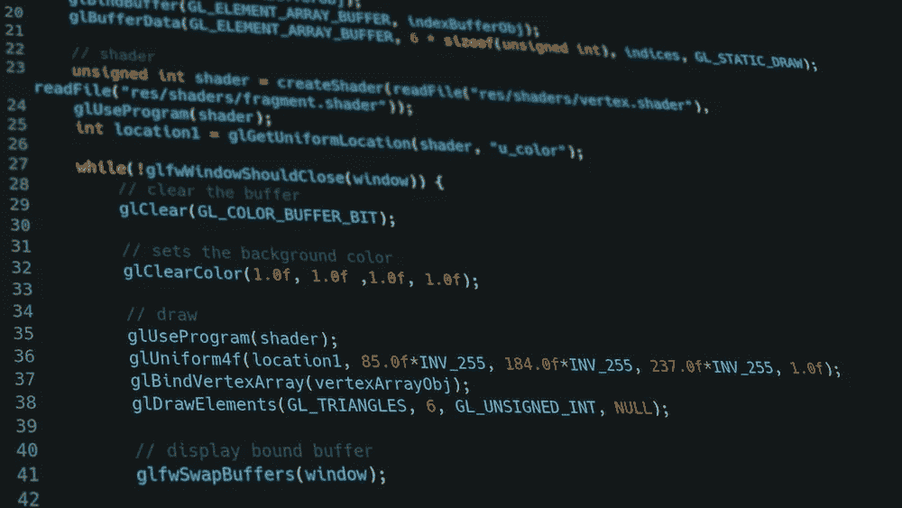
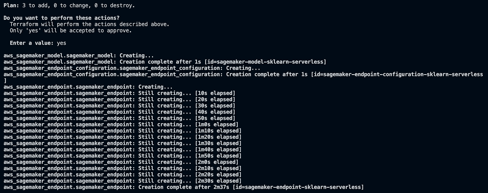
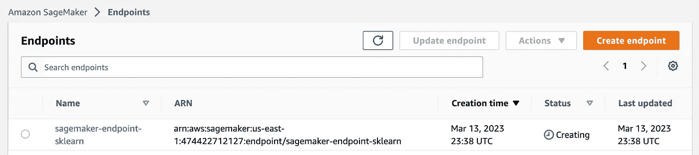

# 使用 Terraform 部署 SageMaker 端点

> 原文：[`towardsdatascience.com/deploying-sagemaker-endpoints-with-terraform-3b09fb3e1d59`](https://towardsdatascience.com/deploying-sagemaker-endpoints-with-terraform-3b09fb3e1d59)

## 使用 Terraform 进行基础设施即代码

[](https://ram-vegiraju.medium.com/?source=post_page-----3b09fb3e1d59--------------------------------)[](https://towardsdatascience.com/?source=post_page-----3b09fb3e1d59--------------------------------) [Ram Vegiraju](https://ram-vegiraju.medium.com/?source=post_page-----3b09fb3e1d59--------------------------------)

·发表于[Towards Data Science](https://towardsdatascience.com/?source=post_page-----3b09fb3e1d59--------------------------------) ·阅读时间 7 分钟·2023 年 3 月 14 日

--



图片来自[Unsplash](https://unsplash.com/photos/KNZHyTpre18)，作者为[Krishna Pandey](https://unsplash.com/@krishna2803)

基础设施即代码（IaC）是优化和将你的资源和基础设施推向生产的重要概念。IaC 是一个古老的 DevOps/软件实践，具有几个关键好处：资源通过代码集中维护，从而优化了将架构推向生产所需的速度和协作。

像许多其他最佳软件实践一样，这也适用于你的机器学习工具和基础设施。在今天的文章中，我们将探讨如何利用一种被称为[Terraform](https://www.terraform.io/)的 IaC 工具，在 SageMaker 端点上部署一个预训练的 SKLearn 模型进行推断。我们将探索如何创建一个可重复使用的模板，你可以根据需要更新你的资源/硬件。使用 Terraform，我们可以从将独立的笔记本和散落的 Python 文件集中到一个模板文件中来进行管理。

使用 SageMaker 进行基础设施即代码的另一种选择是 CloudFormation。如果这是你用例的首选工具，你可以参考这篇文章。请注意，**Terraform 是云服务提供商无关的**，它跨越了不同的云服务提供商，而 CloudFormation 专门用于 AWS 服务。

**注意**：如果你是 AWS 新手，确保你在以下[链接](https://aws.amazon.com/console/)注册一个账户，以便进行操作。同时，确保安装了[AWS CLI](https://aws.amazon.com/cli/)以便与示例配合使用。本文假设你对 Terraform 有基本了解，如果需要入门指南，请查看这个[指南](https://registry.terraform.io/providers/hashicorp/aws/latest/docs)，并参考以下[安装说明](https://developer.hashicorp.com/terraform/tutorials/aws-get-started/install-cli)。本文还假设你对 SageMaker 部署有中级了解，我建议你阅读这篇文章以深入理解部署/推断，我们将在本文中使用相同的模型并将其映射到 Terraform。

## 设置

如前所述，我们不会真正关注模型训练和构建的理论。我们将快速在内置的[波士顿住房数据集](https://www.cs.toronto.edu/~delve/data/boston/bostonDetail.html)上训练一个示例 SKLearn 模型，该数据集由包提供。

```py
import pandas as pd
import numpy as np
from sklearn.linear_model import LinearRegression
from sklearn.model_selection import train_test_split, cross_val_score
from sklearn.metrics import mean_squared_error
from sklearn import datasets
from sklearn.model_selection import train_test_split
from sklearn import metrics
import joblib

#Load data
boston = datasets.load_boston()
df = pd.DataFrame(boston.data, columns = boston.feature_names)
df['MEDV'] = boston.target 

#Split Model
X = df.drop(['MEDV'], axis = 1) 
y = df['MEDV']
X_train, X_test, y_train, y_test = train_test_split(X, y, test_size = .2, random_state = 42)

#Model Creation
lm = LinearRegression()
lm.fit(X_train,y_train)

with open('model.joblib', 'wb') as f:
    joblib.dump(lm,f)

with open('model.joblib', 'rb') as f:
    predictor = joblib.load(f)

print("Testing following input: ")
print(X_test[0:1])
sampInput = [[0.09178, 0.0, 4.05, 0.0, 0.51, 6.416, 84.1, 2.6463, 5.0, 296.0, 16.6, 395.5, 9.04]]
print(type(sampInput))
print(predictor.predict(sampInput))
```

在这里，我们快速验证本地模型是否按预期进行推断。脚本还会生成**序列化模型工件**，我们将把它提供给 SageMaker 进行部署。接下来，我们创建一个[自定义推断脚本](https://aws.plainenglish.io/adding-custom-inference-scripts-to-amazon-sagemaker-2208c3332510)，该脚本基本上作为处理 SageMaker 端点的预处理/后处理的入口点脚本。

```py
import joblib
import os
import json

"""
Deserialize fitted model
"""
def model_fn(model_dir):
    model = joblib.load(os.path.join(model_dir, "model.joblib"))
    return model

"""
input_fn
    request_body: The body of the request sent to the model.
    request_content_type: (string) specifies the format/variable type of the request
"""
def input_fn(request_body, request_content_type):
    if request_content_type == 'application/json':
        request_body = json.loads(request_body)
        inpVar = request_body['Input']
        return inpVar
    else:
        raise ValueError("This model only supports application/json input")

"""
predict_fn
    input_data: returned array from input_fn above
    model (sklearn model) returned model loaded from model_fn above
"""
def predict_fn(input_data, model):
    return model.predict(input_data)

"""
output_fn
    prediction: the returned value from predict_fn above
    content_type: the content type the endpoint expects to be returned. Ex: JSON, string
"""

def output_fn(prediction, content_type):
    res = int(prediction[0])
    respJSON = {'Output': res}
    return respJSON
```

接下来，我们将脚本和模型工件打包成 SageMaker 兼容的 tarball 格式。然后，我们将这个模型 tarball 上传到 S3 存储桶，因为这是 SageMaker 使用的所有工件的主要存储选项。

```py
import boto3
import json
import os
import joblib
import pickle
import tarfile
import sagemaker
from sagemaker.estimator import Estimator
import time
from time import gmtime, strftime
import subprocess

#Setup
client = boto3.client(service_name="sagemaker")
runtime = boto3.client(service_name="sagemaker-runtime")
boto_session = boto3.session.Session()
s3 = boto_session.resource('s3')
region = boto_session.region_name
print(region)
sagemaker_session = sagemaker.Session()
role = "Replace with your SageMaker IAM Role"

#Build tar file with model data + inference code
bashCommand = "tar -cvpzf model.tar.gz model.joblib inference.py"
process = subprocess.Popen(bashCommand.split(), stdout=subprocess.PIPE)
output, error = process.communicate()

#Bucket for model artifacts
default_bucket = sagemaker_session.default_bucket()
print(default_bucket)

#Upload tar.gz to bucket
model_artifacts = f"s3://{default_bucket}/model.tar.gz"
response = s3.meta.client.upload_file('model.tar.gz', default_bucket, 'model.tar.gz')
```

## Terraform 变量

在我们的模板文件（.tf）中，我们首先定义一种称为[Terraform 变量](https://developer.hashicorp.com/terraform/language/values)的东西。具体来说，通过[输入变量](https://developer.hashicorp.com/terraform/language/values/variables)，你可以传递类似于函数/方法定义的参数的值。任何你不想硬编码的值，但也想赋予默认值的，可以以变量的格式指定。我们将为实时 SageMaker 端点定义的变量如下。

+   **SageMaker IAM 角色 ARN**：这是与 SageMaker 服务关联的角色，附加所有你将与服务进行的操作所需的策略。请注意，你也可以在 Terraform 中定义并引用角色。

+   **容器**：AWS 提供的[深度学习容器](https://aws.plainenglish.io/how-to-retrieve-amazon-sagemaker-deep-learning-images-ff4a5866299e)或你自己构建的自定义容器来托管你的模型。

+   **模型数据**：我们上传到 S3 的预训练模型工件，这也可以是从 SageMaker 训练作业中产生的训练工件。

+   **实例类型**：你实时端点背后的硬件。如果你愿意，也可以将实例数量设为变量。

对于每个变量，你可以定义：类型、默认值和描述。

```py
variable "sm-iam-role" {
    type = string
    default = "Add your SageMaker IAM Role ARN here"
    description = "The IAM Role for SageMaker Endpoint Deployment"
}

variable "container-image" {
    type = string
    default = "683313688378.dkr.ecr.us-east-1.amazonaws.com/sagemaker-scikit-learn:0.23-1-cpu-py3"
    description = "The container you are utilizing for your SageMaker Model"
}

variable "model-data" {
    type = string
    default = "s3://sagemaker-us-east-1-474422712127/model.tar.gz"
    description = "The pre-trained model data/artifacts, replace this with your training job."
}

variable "instance-type" {
    type = string
    default = "ml.m5.xlarge"
    description = "The instance behind the SageMaker Real-Time Endpoint"
}
```

尽管我们在本文中不会深入探讨，但你也可以在 SageMaker 中为不同的托管选项定义变量。例如，在无服务器推理中，你可以将内存大小和并发性定义为两个你想设置的变量。

```py
variable "memory-size" {
    type = number
    default = 4096
    description = "Memory size behind your Serverless Endpoint"
}

variable "concurrency" {
    type = number
    default = 2
    description = "Concurrent requests for Serverless Endpoint"
}
```

## Terraform 资源与部署

最基本的 Terraform 构建块是[资源](https://developer.hashicorp.com/terraform/language/resources)。在资源块中，你实际上定义了一个**基础设施对象**。对于我们的用例，我们具体有三个 SageMaker 构建块：SageMaker 模型、SageMaker 端点配置和 SageMaker 端点。这些构建块彼此相连，最终帮助我们创建所需的端点。

我们可以参考 Terraform 文档中的[SageMaker 模型](https://registry.terraform.io/providers/hashicorp/aws/latest/docs/resources/sagemaker_model)以开始。首先，我们定义资源本身，其中包含两个组件：资源的 Terraform 名称以及你定义的用于在模板中稍后引用的名称。另一个关键部分是我们如何使用 Terraform 关键字**var**来引用变量值。

```py
# SageMaker Model Object
resource "aws_sagemaker_model" "sagemaker_model" {
  name = "sagemaker-model-sklearn"
  execution_role_arn = var.sm-iam-role
```

接下来，对于我们的 SageMaker 模型，我们定义之前定义的容器和模型数据，并引用这些特定变量。

```py
primary_container {
    image = var.container-image
    mode = "SingleModel"
    model_data_url = var.model-data 
    environment = {
      "SAGEMAKER_PROGRAM" = "inference.py"
      "SAGEMAKER_SUBMIT_DIRECTORY" = var.model-data
    }
  }
```

可选地，在 SageMaker 中，你还可以为特定对象提供一个你定义的[标签](https://docs.aws.amazon.com/sagemaker/latest/APIReference/API_Tag.html)。

```py
tags = {
    Name = "sagemaker-model-terraform"
  }
```

我们对[端点配置](https://registry.terraform.io/providers/hashicorp/aws/latest/docs/resources/sagemaker_endpoint_configuration)采用类似的格式，在这里我们实际上定义了我们的硬件。

```py
# Create SageMaker endpoint configuration
resource "aws_sagemaker_endpoint_configuration" "sagemaker_endpoint_configuration" {
  name = "sagemaker-endpoint-configuration-sklearn"

  production_variants {
    initial_instance_count = 1
    instance_type = var.instance-type
    model_name = aws_sagemaker_model.sagemaker_model.name
    variant_name = "AllTraffic"
  }

  tags = {
    Name = "sagemaker-endpoint-configuration-terraform"
  }
}
```

然后我们在[端点](https://registry.terraform.io/providers/hashicorp/aws/latest/docs/resources/sagemaker_endpoint)创建中引用这个对象。

```py
# Create SageMaker Real-Time Endpoint
resource "aws_sagemaker_endpoint" "sagemaker_endpoint" {
  name = "sagemaker-endpoint-sklearn"
  endpoint_config_name = aws_sagemaker_endpoint_configuration.sagemaker_endpoint_configuration.name

  tags = {
    Name = "sagemaker-endpoint-terraform"
  }

}
```

在我们可以部署模板以配置资源之前，请确保你已经通过以下命令配置了 AWS CLI。

```py
aws configure
```

然后我们可以通过以下命令初始化我们的 Terraform 项目。

```py
terraform init
```

对于部署，我们可以运行另一个 Terraform CLI 命令。

```py
terraform apply
```



资源创建（作者截图）

在端点创建过程中，你也可以通过 SageMaker 控制台验证这一点。



端点创建 SM 控制台（作者截图）

## 额外资源与结论

[](https://github.com/RamVegiraju/IaC-SageMaker-Deployment/tree/master/Terraform?source=post_page-----3b09fb3e1d59--------------------------------) [## IaC-SageMaker-Deployment/Terraform at master · RamVegiraju/IaC-SageMaker-Deployment

### 你目前无法执行该操作。你在另一个标签页或窗口中已登录。你在另一个标签页或窗口中已登出…

github.com](https://github.com/RamVegiraju/IaC-SageMaker-Deployment/tree/master/Terraform?source=post_page-----3b09fb3e1d59--------------------------------)

示例的整个代码可以在上述代码库中找到。希望这篇文章能为大家提供一个关于 Terraform 的总体介绍，以及与 SageMaker 推理的使用情况。基础设施即代码（Infrastructure as Code）是一项在 MLOps 世界中扩展到生产环境时不可忽视的关键实践。

*如果你喜欢这篇文章，可以通过* [*LinkedIn*](https://www.linkedin.com/in/ram-vegiraju-81272b162/) *与我联系，并订阅我的 Medium* [*Newsletter*](https://ram-vegiraju.medium.com/subscribe)*。如果你是 Medium 的新用户，可以通过我的* [*会员推荐链接*](https://ram-vegiraju.medium.com/membership)*进行注册。*
