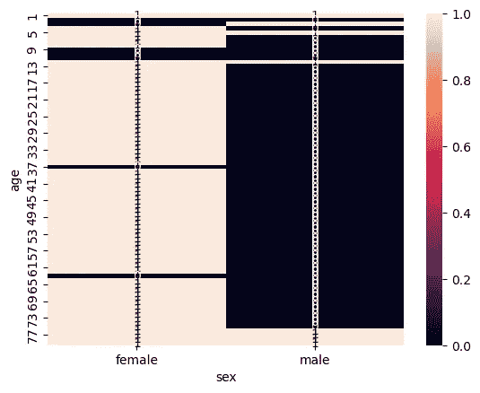
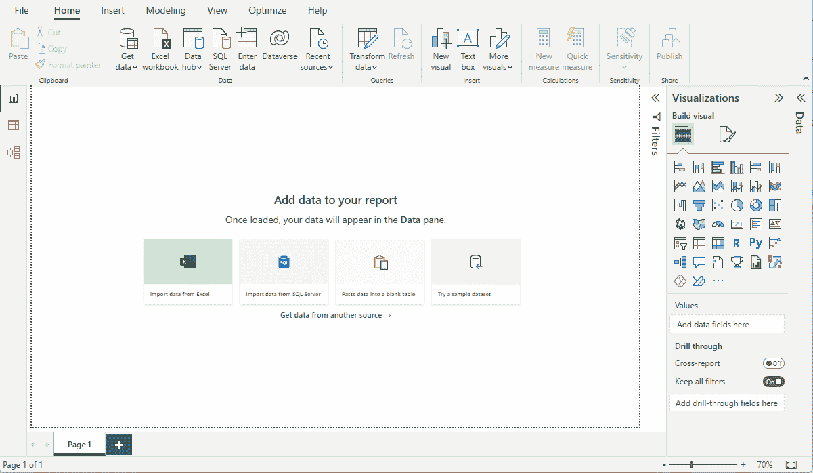
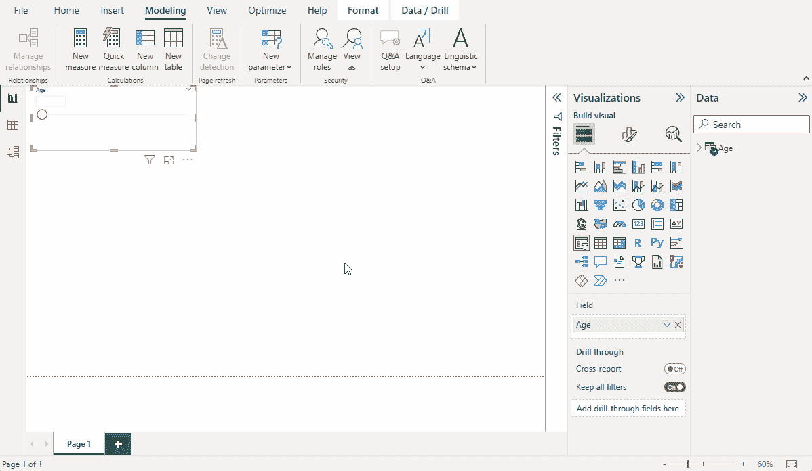
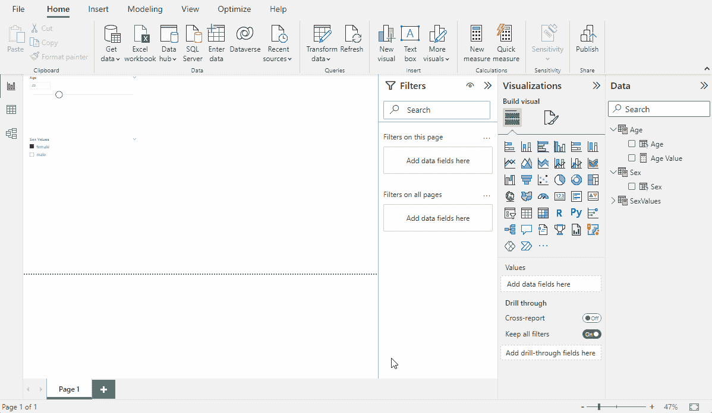
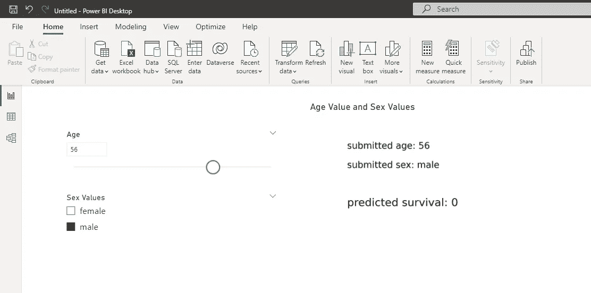
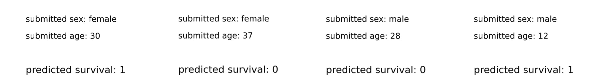

# 在 Power BI 中与 sklearn 机器学习模型互动

> 原文：[`towardsdatascience.com/deploying-sklearn-models-in-power-bi-d982f2d21ec`](https://towardsdatascience.com/deploying-sklearn-models-in-power-bi-d982f2d21ec)

[](https://newmarrk.medium.com/?source=post_page-----d982f2d21ec--------------------------------)[](https://towardsdatascience.com/?source=post_page-----d982f2d21ec--------------------------------) [Mark Graus](https://newmarrk.medium.com/?source=post_page-----d982f2d21ec--------------------------------)

·发布于[Towards Data Science](https://towardsdatascience.com/?source=post_page-----d982f2d21ec--------------------------------) ·9 分钟阅读·2023 年 5 月 24 日

--

在某些情况下，我们希望拥有一个可以操作的监督学习模型。虽然任何数据科学家都可以很容易地在 Jupyter notebook 中构建一个 SKLearn 模型并进行操作，但当你希望其他利益相关者与模型互动时，你需要创建一个前端。这可以通过一个简单的 Flask webapp 来完成，提供一个网络界面，供用户向 sklearn 模型或管道输入数据以查看预测输出。然而，这篇文章将重点介绍如何在 Power BI 中使用 Python 可视化与模型互动。

这篇文章将包括两个主要部分：

+   构建 SKLearn 模型 / 构建管道

+   构建 Power BI 接口

代码非常简单，你可以从这篇文章中复制你需要的部分，但它也可以在[我的 Github](https://github.com/marrk/sklearn-in-powerbi)上找到。要使用它，你需要做两件事。运行 Python Notebook 中的代码以序列化管道，并在 Power BI 文件中修改管道路径。

# 1\. 构建模型

在这个例子中，我们将使用 Titanic 数据集并构建一个简单的预测模型。这个模型将是一个分类模型，使用一个分类特征（‘sex’）和一个数值特征（‘age’）作为预测变量。为了演示这种方法，我们将使用 RandomForestClassifier 作为分类模型。这是因为 Random Forest 分类器在 Power BI 中的实现比例如在 MQuery 或 DAX 中编码的逻辑回归要复杂一些。此外，由于这篇文章并不是为了构建最好的模型，我会相当依赖于[scikit-learn 文档的部分内容](https://scikit-learn.org/stable/auto_examples/compose/plot_column_transformer_mixed_types.html)，而且不会过多关注性能。

我们创建的代码做了几件事。首先，它加载并预处理 Titanic 数据集。如前所述，我们仅使用“性别”和“年龄”特征，但这些特征仍需处理。分类变量“性别”必须转换为虚拟变量或进行独热编码（即将一列重新编码为一组列），以便任何 sklearn 模型能够处理它。对于数值特征“年龄”，我们进行标准的 MinMaxScaling，因为它的范围大约是 0 到 80，而“性别”的范围是 0 到 1。一旦完成所有这些步骤，我们删除所有缺失值的观察数据，进行训练/测试拆分，然后构建和序列化管道。

```py
#Imports

from sklearn.datasets import fetch_openml
from sklearn.pipeline import Pipeline
from sklearn.compose import ColumnTransformer
from sklearn.preprocessing import OneHotEncoder

#Load the dataset
X,y = fetch_openml("titanic", version = 1, as_frame=True, return_X_y=True)

#Create the OneHotEncoding for the categorical variable 'sex'

categorical_feature = ["sex"]
categorical_transformer = Pipeline(
    steps = [
        ("encoder",OneHotEncoder(drop="first"))
    ])
preprocessor = ColumnTransformer(
    transformers = [
        ("categorical", categorical_transformer, categorical_feature)
    ])

#Creating the Pipeline, with preprocessing and the Random Forest Classifier
clf = Pipeline(
    steps = [
        ("preprocessor", preprocessor), 
        ("classifier", RandomForestClassifier())
    ]
)

#Select only age and sex as predictors
X = X[["age","sex"]]

#Drop rows with missing values
X = X.dropna()

#Keep only observations corresponding to rows without missing values
y = y[X.index]

#Create Train/Test Split
X_train, X_test, y_train, y_test = train_test_split(X, y, random_state=1)

#Fit the Pipeline
clf.fit(X_train, y_train)

#Score the Pipeline
y_pred = clf.predict(X_test)
print(classification_report(y_test, y_pred))
```

上述代码创建了一个得分不太高但足够满足本帖目的的模型。

```py
 precision    recall  f1-score   support

           0       0.85      0.84      0.85       159
           1       0.76      0.77      0.76       103

    accuracy                           0.81       262
   macro avg       0.80      0.80      0.80       262
weighted avg       0.81      0.81      0.81       262
```

后续对我们有帮助的是检查模型的预测。为此，我们创建一个包含年龄和性别的笛卡尔积的 DataFrame（即所有可能的“年龄”/“性别”组合）。我们利用这个 DataFrame 从管道中计算预测，然后将这些预测绘制成热图。实现这一功能的代码如下。

```py
from pandas import DataFrame

# Create a DataFrame with all possible ages
ages = DataFrame({'age':range(1,80,1)})

# Create a DataFrame with all possible sexes
sexes = DataFrame({'sex':["male","female"]})    

# Create a DataFrame with all possible combinations. 
combinations = ages.merge(sexes, how='cross')

# Predict survival for combinations
combiations["predicted_survival"] = clf.predict(combinations)

# Plot the Heatmap
sns.heatmap(pd.pivot_table(results, values="predicted_survival", index=["age"],columns=["sex"]), annot=True)
```

相应的热图如下所示，它显示了例如 13–33 岁的女性的预测结果是生存（1）。而年龄恰好为 37 岁的女性被预测为不生存。对于男性，预测大多是不生存，除非年龄为 12 岁及一些更年轻的年龄。此信息在调试 Power BI 报告时将非常有用。



热图展示了不同年龄（垂直）和性别（水平）组合的模型预测。白色方块代表生存的预测，黑色方块代表去世的预测。总体上，我们看到女性乘客的生存预测概率较高。

现在完成了这些，我们可以序列化模型，以便将其嵌入到 Power BI 报告中。

```py
from joblib import dump
dump(clf, "randomforest.joblib")
```

# 2\. Power BI 界面

创建 Power BI 界面包括两个步骤。第一步是创建控件以将数据输入模型。第二步是创建可视化，将控件中的输入数据传递到模型中并显示预测结果。

## 2a. 控件

使用 Power BI 时需要了解几个重要概念。首先是参数，即包含值的变量。这些参数可以通过切片器控制，它们的值可以通过 Power BI 中的可视化元素访问，在我们的案例中是 Python 可视化。



添加年龄切片器的过程

对于参数来说，至关重要的是我们保持与进入管道的数据相同的结构和值。因此，在我们的情况下，我们需要一个用于年龄的控制（一个从 0 到 80 的数值变量）和一个用于性别的控制（一个具有“男性”和“女性”两个值的分类变量）。创建“年龄”参数和切片器非常简单。在功能区的“建模”部分，我们使用“新建参数”按钮，在下拉菜单中选择“数值”选项，并指定我们希望能够输入的值。我们确保勾选“添加切片器”复选框，完成后，第一个控制项和对应的参数就可用了。

对于“性别”，这会稍微繁琐一些。首先需要创建一个包含所有可能值的表格。最优雅的方式是通过 DAX 完成。通过点击功能区“建模”部分的“新建表格”按钮，并输入以下文本来实现。这条查询创建了一个名为“SexValues”的新表格，其中包含一个名为“性别值”的字符串列，列值为“男性”和“女性”。这些将用于创建参数。

```py
SexValues = DATATABLE("Sex Values",String,{{"male"},{"female"}})
```



通过在功能区“建模”部分的“新建参数”按钮下拉菜单中的“字段”选项来创建新的参数。在这个参数的配置中，我们从我们制作的表格（SexValues）中选择“性别值”字段。确保在对话框中开启了“添加切片器”。按下确定后，切片器将被添加到您的 Power BI 报告中，但还需要一些额外的设置。选择切片器，并使用界面中显示视觉属性的部分。在指示字段的下拉菜单中，点击向下的箭头，选择“显示所选字段的值”。完成后，所有控制项都准备好了，所有参数都已配置，我们可以开始输入 Python 可视化。

## 2b. 创建可视化



现在所有数据都已经到位，接下来是创建 Python 可视化。为此，创建一个 Python 可视化。使用‘Py’按钮创建可视化，并选择参数（‘性别’和‘年龄值’）作为输入。对于 Python 可视化，来自参数的信息会以 pandas.DataFrame 的形式提供，其中包含一行，参数名称（‘年龄值’和‘性别值’）作为列名。代码会经过若干步骤来使用这些信息。首先，我们导入所有必要的库，包括 joblib、相关的 sklearn 库、pandas 和用于可视化的 matplotlib。完成后，加载序列化的管道，参数数据集被修改以对应于用于训练模型的数据集。之后，管道用于根据参数值预测生存情况，预测结果及其参数值会在 matplotlib 可视化中打印出来。

```py
# The following code to create a dataframe and remove duplicated rows is always executed and acts as a preamble for your script: 

# dataset = pandas.DataFrame(Sex Values, Age Value)
# dataset = dataset.drop_duplicates()

# Paste or type your script code here:

# Imports
from joblib import load
from sklearn.pipeline import Pipeline
from sklearn.compose import ColumnTransformer
from sklearn.preprocessing import OneHotEncoder
import pandas as pd
import matplotlib.pyplot as plt 

# Loading the serialized Pipeline - Make sure to point it to where you serialized the pipeline
clf = load(r"\randomforest.joblib")

# Rename the dataset with the Parameter names to match the original column names. 
dataset = dataset.rename(columns={"Age Value":"age", "Sex Values":"sex"})

# Make the predictions
dataset["PredictedSurvival"] = clf.predict(dataset)

# Output the predictions
fig = plt.figure()
ax = fig.add_subplot()
ax.axis([0, 1, 0, 1])
plt.grid(False)
plt.axis('off')
ax.text(0, 0.8, "submitted age: " + str(dataset.iloc[0,0]), fontsize=25)
ax.text(0, 0.6, "submitted sex: " + str(dataset.iloc[0,1]), fontsize=25)
ax.text(0, 0.2, "predicted survival: " + str(dataset.iloc[0,2]), fontsize=30)
plt.show()
```

一旦一切完成，你可以稍微移动一下元素，让它看起来更好，或者如果有时间的话，可以改变整个报告的设计以及 Python 可视化。但呐呐呐，如果你现在玩弄切片器，你会看到预测被更新。



为了验证模型是否按预期工作，我们可以检查构建模型后记住的值，以确认 Power BI 可视化是否确实与我们从数据中预期的结果相符。确实，提交之前找到的值显示，生存预测的变化符合预期。



来自 Power BI 中模型的预测

# 结论

这是一个相当简单的、人工的用例，目的是构建一个 sklearn 模型并在 Power BI 中与该模型互动。对于这个用例来说，这有点过于复杂，因为预计算所有年龄和性别组合的预测结果，并将其加载到 Power BI 中，会更容易、更快捷且更灵活。可惜的是，这种方法只适用于有限数量的特征，而这里描述的方法原则上可以扩展到具有更多特征的模型。

这种方法的一个负面方面是，接口的性能相当低，这可能是因为每次参数值发生变化时，整个管道都必须重新反序列化、加载并重新预测。

我非常希望了解这种方法是否对任何人有用。你能想到哪些用例？如果你有任何问题、想法或建议，我非常乐意听取并一起思考！
