# 在 GCP 无服务器架构上部署 TFLite 模型

> 原文：[`towardsdatascience.com/deploying-tflite-model-on-gcp-serverless-b4cd84f86de1`](https://towardsdatascience.com/deploying-tflite-model-on-gcp-serverless-b4cd84f86de1)

## 如何以无服务器的方式部署量化模型

[](https://vishal-ai.medium.com/?source=post_page-----b4cd84f86de1--------------------------------)[](https://towardsdatascience.com/?source=post_page-----b4cd84f86de1--------------------------------) [Vishal Rajput](https://vishal-ai.medium.com/?source=post_page-----b4cd84f86de1--------------------------------)

·发布于 [Towards Data Science](https://towardsdatascience.com/?source=post_page-----b4cd84f86de1--------------------------------) ·阅读时长 11 分钟·2023 年 7 月 21 日

--

模型部署是一个棘手的问题；由于云平台和其他 AI 相关库的不断变化，几乎每周都有更新，因此向后兼容性和找到正确的部署方法是一个巨大的挑战。在今天的博客文章中，我们将探讨如何以**无服务器**的方式在**Google Cloud Platform**上部署**tflite 模型**。

本博客文章的结构如下：

+   理解无服务器架构和其他部署方式

+   什么是量化和 TFLite？

+   使用 GCP Cloud Run API 部署 TFLite 模型


图片来源: [`pixabay.com/photos/man-pier-silhouette-sunrise-fog-8091933/`](https://pixabay.com/photos/man-pier-silhouette-sunrise-fog-8091933/)

# 理解无服务器架构和其他部署方式

> **首先让我们了解什么是无服务器架构，因为无服务器并不意味着没有服务器。**

一个 AI 模型，或任何应用程序，实际上可以通过多种不同的方式进行部署，主要有三大类。

**无服务器架构：** 在这种情况下，模型存储在云容器注册表中，只有在用户发出请求时才会运行。当请求发出时，会自动启动一个服务器实例来处理用户请求，并在一段时间后关闭。从启动、配置、扩展到关闭，这一切都由 Google Cloud 平台提供的 Cloud Run API 处理。在其他云平台中，我们有 AWS Lambda 和 Azure Functions 作为替代方案。

**无服务器架构**有其自身的优缺点。

+   最大的优势在于**节省成本**，如果你没有大量的用户基础，大部分时间服务器处于闲置状态，你的钱只是白白花费了。另一个优势是我们不需要考虑**扩展**基础设施，根据服务器的负载，它可以自动复制实例的数量并处理流量。

+   在缺点方面，有三点需要考虑。首先是**小负载限制**，这意味着它不能用于运行更大的模型。其次，服务器在 15 分钟空闲后会自动关闭，因此当我们在很长时间后发出请求时，第一次请求比后续请求花费的时间要长，这个问题被称为**冷启动问题**。最后，目前还没有**适当的 GPU 基于实例**可用于无服务器计算。

**服务器实例：** 在这种模式中，服务器始终处于运行状态，即使没有人请求我们的应用，你也总是需要支付费用。对于用户基础较大的应用来说，保持服务器持续运行是很重要的。在这种策略下，我们可以以多种方式部署应用，其中一种方式是启动一个单一的服务器实例，并在流量增加时手动扩展。实际上，这些服务器是借助**Kubernetes** **集群**启动的，这些集群定义了扩展基础设施的规则，并为我们进行流量管理。

+   最大的优势在于我们可以使用最大规模的模型和应用，并精确控制我们的资源，从基于 GPU 的实例到常规实例。但正确管理和扩展这些服务器实例是一项相当大的任务，通常需要大量的调整。这些对于**基于 GPU 的实例**来说可能非常昂贵，因为许多 AI 模型需要 GPU 以实现更快的推理。

理解 Kubernetes 和 Docker 的两个极好的资源：

[](https://medium.com/aiguys/docker-for-dummies-8e8edc8af0ea?source=post_page-----b4cd84f86de1--------------------------------) [## Docker 入门… 🐳 🧠💡

### 🚀 和我一起在 15 分钟内将一个 hello-world 节点应用程序 Docker 化。

medium.com](https://medium.com/aiguys/docker-for-dummies-8e8edc8af0ea?source=post_page-----b4cd84f86de1--------------------------------) [](https://medium.com/aiguys/kubernetes-101-introduction-to-container-orchestration-b88e60c04ed2?source=post_page-----b4cd84f86de1--------------------------------) [## Kubernetes 101：容器编排介绍 🎵 🐳

### 如果你正在阅读这篇文章，你很可能对容器化、镜像等概念非常熟悉……

medium.com](https://medium.com/aiguys/kubernetes-101-introduction-to-container-orchestration-b88e60c04ed2?source=post_page-----b4cd84f86de1--------------------------------)

**边缘部署：** 当我们需要在没有互联网的地方获得最快响应时，我们选择边缘部署。这种部署类型适用于**IoT 设备**和其他没有大内存或互联网连接的小型设备。例如，如果我们希望在无人机上使用 AI，我们希望 AI 模块部署在无人机本身上，而不是某个云服务器上。

+   由于设备的硬件限制，这种部署类型只能处理非常小的负载。在这种部署模式下，没有成本，因为一切都在本地运行。使模型小到足以适应 IoT 设备是相当具有挑战性的，并且需要完全不同的策略。

部署策略有很多内容；在一个博客中几乎不可能覆盖所有内容。这里有另一个很好的博客提供了整个 MLOPS 策略的概述。

[](https://medium.com/aiguys/mlops-deploying-and-managing-models-at-scale-9a51f8fc0406?source=post_page-----b4cd84f86de1--------------------------------) [## MLOps：大规模管理 AI 模型

### 模型构建很出色，但如果我们不能部署这些模型，它们就会变得无用。与深度学习不同，找到……

medium.com](https://medium.com/aiguys/mlops-deploying-and-managing-models-at-scale-9a51f8fc0406?source=post_page-----b4cd84f86de1--------------------------------)

# 什么是量化和 TFLite？

**量化**是一种模型压缩技术，在这种技术中，我们将权重转换为较低的精度，以**减小模型的大小**，从而使模型在推断时更小、更快。量化可以显著提高**速度**，并且通常用于边缘部署。在无服务器模式下部署量化模型可以大大节省成本，因为这使得 AI 模型小到足以在无服务器模式下使用。

**注意：** 人们常常认为需要 GPU 实例来服务 AI 模型，因为他们用 GPU 实例训练了这些模型，但这并不正确。大多数 AI 应用程序通过 CPU 实例和适当的部署策略可以服务甚至十亿用户。

量化是压缩模型大小的众多方法之一，还有很多其他方法，如剪枝、权重共享等。

这里有一篇文章详细介绍了所有的**模型压缩技术**：

[](https://medium.com/aiguys/reducing-deep-learning-size-16bed87cccff?source=post_page-----b4cd84f86de1--------------------------------) [## 深度学习模型压缩

### 随着每年模型变得越来越复杂和庞大。很多在研究实验室开发的 AI 模型从未……

medium.com](https://medium.com/aiguys/reducing-deep-learning-size-16bed87cccff?source=post_page-----b4cd84f86de1--------------------------------)

## 什么是 TFLite

根据 TensorFlow 网站，“TensorFlow Lite 是一套工具，通过帮助开发者在移动设备、嵌入式设备和边缘设备上运行模型，实现设备上的机器学习。”

量化 AI 模型的方法有很多；主要分为 **训练后量化和量化感知训练** 两类。在前者中，我们通常先训练模型。训练完成后，对模型权重应用量化，而在后者中，量化在训练过程中就已经激活。通常，量化感知训练的效果优于训练后量化。

让我们直接跳到量化代码部分。我们在这个博客中使用的是训练后量化的图像分割模型。下图显示了我们 AI 管道的架构。

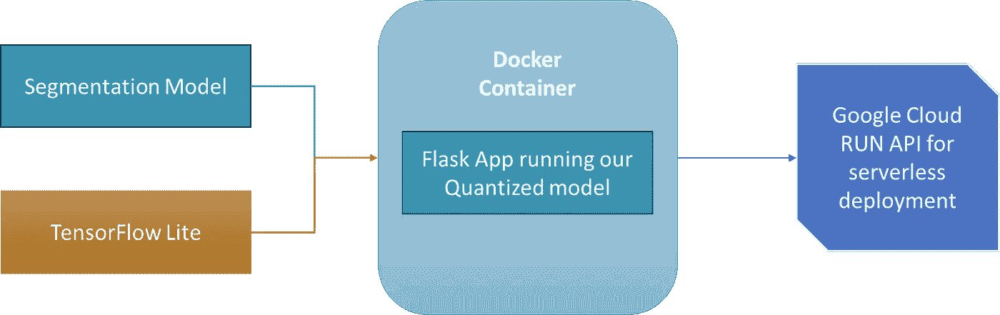

AI 管道架构（图片来源：作者所有）

我在这里做出以下假设：

+   您已经有一个以 .hdf5 或 .h5 格式保存的图像分割模型。

如果不是，请参阅 Keras 官方网站的教程：[`keras.io/examples/vision/oxford_pets_image_segmentation/`](https://keras.io/examples/vision/oxford_pets_image_segmentation/)

+   您有一个名为 ***train_input_img_paths*** 的变量，用于存储所有训练图像的路径。您可以再次参阅 Keras 官方示例链接的第 1 步。

+   如果您有自己的自定义数据加载器，请修改 ***represetative_dataset()*** 方法。

```py
import tensorflow as tf

## Load your tensorflow model
model = tf.keras.models.load_model("your_model.hdf5") 

# Convert the model to the TensorFlow Lite format with float16 quantization
def representative_dataset():
    for j in range(0, len(train_input_img_paths) // batch_size):
        x_train, _ = train_gen.__getitem__(j)
        yield [x_train.astype(np.float32)]

converter = tf.lite.TFLiteConverter.from_keras_model(model)
converter.optimizations = [tf.lite.Optimize.DEFAULT]
converter.representative_dataset = representative_dataset
converter.target_spec.supported_types = [tf.float16]

tflite_quant_model = converter.convert()

# Save the quantized model to file
with open('post_training_quantization/model_quantized_float16.tflite', 'wb') as f:
    f.write(tflite_quant_model)
```

现在，我们准备使用 Google Cloud Run API 以无服务器的方式部署我们的 TFLite 模型。

# 使用 GCP Cloud Run API 部署 TFLite 模型

我们需要这些资源和文件来部署我们的模型并进行预测。

+   Dockerfile

+   app.py

+   client.py

+   requirements.txt

+   量化模型

首先，我们来理解部署的流程。

无服务器部署流程从 **容器化** 应用程序 app.py（我们在这里使用 Docker）开始，然后 **将 Docker 镜像推送到容器注册表**（在我们这里是 Google 容器注册表）；我们需要容器注册表来确保我们镜像的版本控制、可用性和安全性。接着，将其配置并部署到无服务器平台（Google Cloud Run API），然后让平台处理我们的函数的执行和扩展。

无服务器模式的部署将基础设施管理抽象化，并提供自动扩展，使我们能够有更多时间专注于开发和部署应用程序代码。

**Dockerfile**

```py
FROM python:3.9-slim

# Set the working directory inside the Docker image
WORKDIR /app

# Copy the requirements.txt file to the working directory
COPY requirements.txt ./requirements.txt

# Install the required Python packages specified in requirements.txt
RUN pip install -r requirements.txt

# Copy the pre-trained model file from your local machine to the Docker image
COPY model_quantized_float16.tflite ./post_training_quantization/model_quantized_float16.tflite

# Copy the entire content of the current directory to the working directory inside the Docker image
COPY . .

# Specify the command to run when the Docker container starts
CMD ["python", "app.py"]
```

总体而言，这个 Dockerfile 设置了运行 Flask 应用程序（`app.py`）所需的环境和依赖项。它确保在容器内可以使用所需的 Python 包和预训练模型文件。

**app.py**

```py
from flask import Flask, request, jsonify
from PIL import Image
import tensorflow as tf
import numpy as np
import io

app = Flask(__name__)

# Load the pre-trained TensorFlow Lite model
model = tf.lite.Interpreter(model_path="post_training_quantization/model_quantized_float16.tflite")
model.allocate_tensors()

@app.route('/predict', methods=['POST'])
def predict():
    """
    Endpoint for making predictions.
    Expects a POST request with an image file in the 'file' field.
    Returns a JSON response with the predicted result.
    """
    # Read the image file from the request
    data = request.files['file'].read()

    # Open and resize the image using Pillow (PIL)
    image = Image.open(io.BytesIO(data)).resize((128, 128))

    # Convert the image to a NumPy array
    image = np.array(image)  # RGB

    # Convert RGB to BGR (required by the model)
    image = image[:, :, ::-1]

    # Normalize the image by dividing by 255.0
    image = image / 255.0

    # Get input and output details of the TensorFlow Lite model
    input_details = model.get_input_details()
    output_details = model.get_output_details()

    # Expand dimensions of the image to match the input shape of the model
    image = np.expand_dims(image, axis=0).astype(input_details[0]['dtype'])

    # Set the input tensor of the model
    model.set_tensor(input_details[0]['index'], image)

    # Run the model inference
    model.invoke()

    # Get the output tensor of the model
    output_data = model.get_tensor(output_details[0]['index'])

    # Convert the output from a NumPy array to a Python list
    output_data_list = output_data.tolist()

    # Return the predicted result as a JSON response
    return jsonify({"result": output_data_list})

if __name__ == '__main__':
    # Run the Flask app on the specified host and port
    app.run(host='0.0.0.0', port=8080)
```

**client.py**

```py
import requests
import numpy as np
import matplotlib.pyplot as plt
import json
import time

# Use the URL of your deployed application
url = 'put_your_http_url_which_youll_get_after_successfull_deployment/predict'

# Open your image file in binary mode
with open('test_image.jpg', 'rb') as img_file:
    file_dict = {'file': img_file}

    start_time = time.time()  # Start measuring the time

    # Make a POST request to the server
    response = requests.post(url, files=file_dict)

    end_time = time.time()  # Stop measuring the time

# The response will contain the segmented image data and shape
response_dict = json.loads(response.text)

# Convert result list to numpy array. Adjust dtype according to your model's output.
segmented_image_array = np.array(response_dict['result'], dtype=np.float16)

elapsed_time = end_time - start_time
print(f"Request completed in {elapsed_time:.2f} seconds")

# Plot the image using matplotlib
plt.imshow(segmented_image_array.squeeze(), cmap='gray')  # use squeeze to remove single-dimensional entries from the shape of an array.
plt.show()
```

**注意：** 当我训练图像分割模型时，我使用了 BGR 格式（OpenCV 的默认模式）；如果您使用了 RGB，请从 app.py 中删除 ***第 30 行***。

此外，请在 client.py 的 ***第 8 行*** 中填入您在成功部署 Google Cloud RUN API 后获得的端点 URL。

最后，为了避免在部署过程中出现问题，请在 Dockerfile 和本地环境中使用相同版本的 Python。

**requirements.txt**

```py
flask==2.0.1
jinja2==3.0.1
tensorflow==2.10.1
Pillow
```

**量化模型**

最后，我们需要将 **model_quantized_float16.tflite** 保存在与 app.py 相同的文件夹中，因为我们将量化模型复制到 Docker 镜像中。

这是我收集所有资源后目录的样子：

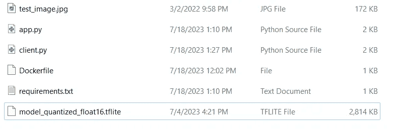

图像来源：属于作者

## 设置无服务器环境

1.  第一步是获取 gcloud CLI（命令行接口），我使用了 Windows，操作非常简单：[`cloud.google.com/sdk/docs/install`](https://cloud.google.com/sdk/docs/install)

2\. 使用标准 CLI 命令导航到你的文件夹

```py
cd path_to_folder
```

3\. 登录 gcloud CLI

```py
gcloud auth login
```

这会在浏览器中打开一个窗口，并要求授予一些权限，请允许。

4\. 在 gcloud 中设置项目，最好使用 GUI 界面。

这是创建 GCP 项目的链接：

[](https://developers.google.com/workspace/guides/create-project?source=post_page-----b4cd84f86de1--------------------------------) [## 创建 Google Cloud 项目 | Google Workspace | Google 开发者

### 使用 Google Workspace API 和构建 Google Workspace 插件或应用程序需要一个 Google Cloud 项目。这...

developers.google.com](https://developers.google.com/workspace/guides/create-project?source=post_page-----b4cd84f86de1--------------------------------) 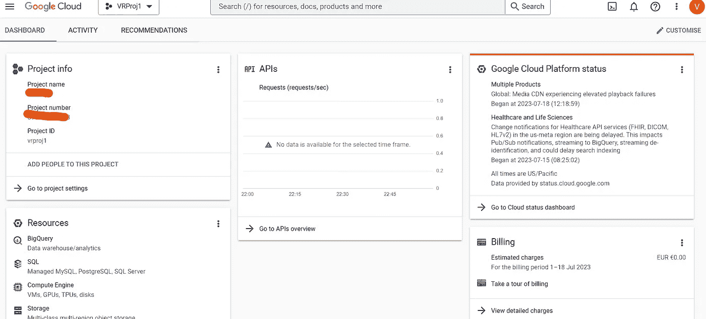

GCP 项目仪表板（图像来源：属于作者）

5\. 在 gcloud CLI 中设置项目 ID，你可以在仪表板中看到你的项目 ID。

```py
gcloud config set project PROJECT_ID
```

6\. 在 gcloud CLI 中构建容器。将 <PROJECT_ID> 替换为实际项目 ID。

```py
docker build -t gcr.io/<PROJECT_ID>/tflite-app .
```

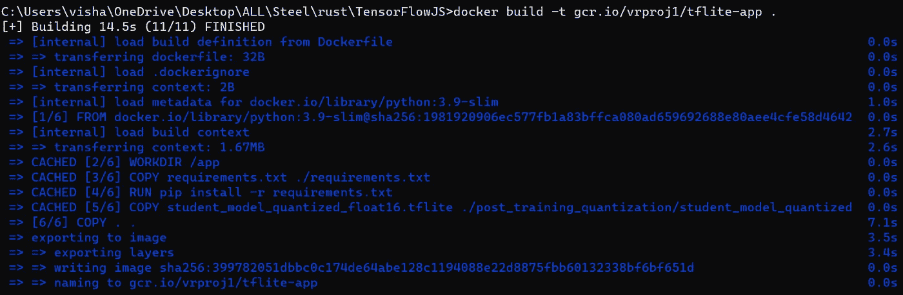

构建容器（图像来源：属于作者）

7\. 通过 gcloud CLI 将 Docker 镜像推送到容器注册表

```py
docker push gcr.io/<PROJECT_ID>/tflite-app
```

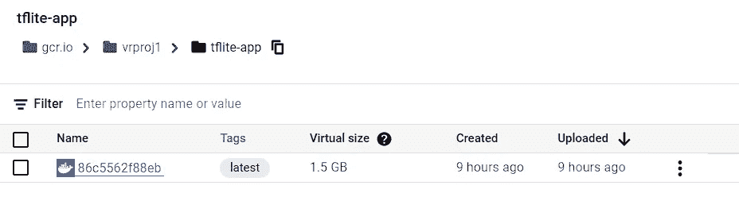

Google 容器注册表（图像来源：属于作者）

8\. 通过 gcloud CLI 部署 Cloud RUN API。这会要求选择服务器位置和一些其他的身份验证，允许所有这些操作。

```py
gcloud run deploy tflite-service --image gcr.io/<PROJECT_ID>/tflite-app --platform managed
```

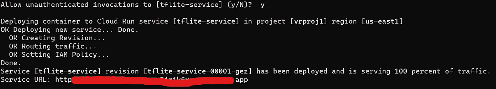

模型已部署（图像来源：属于作者）

如果一切顺利，你将在 gcloud CLI 中看到一个链接，你需要将其粘贴到 client.py 中。否则，请查看日志并尝试修复错误。

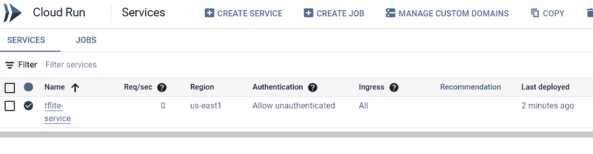

Cloud Run API 控制台（图像来源：属于作者）

**需要注意的关键点：**

几乎可以保证在这个部署过程中会出现一些问题；最大的问题是包的版本不匹配。

在 requirements.txt 和 Dockerfile 中使用与你训练模型和量化模型时完全相同的版本。记住 GCP 的 TF 和 Python 版本通常较旧，最好使用较旧的版本。

我在 Python 3.8.15 上训练了我的模型；其余的在 requirements.txt 中给出。日志中的错误通常不明确，因此请始终使用完全相同的版本；如果在 GCP 中找不到所需的版本，请为本地环境更改版本。

接下来，部署失败的最大原因是你没有激活所需的 API 或者你没有必要的权限和 IAM 角色。如果你第一次使用 GCP，最好使用拥有所有权限的账户作为所有者。

## 进行预测

只需在你的 gcloud CLI 或标准命令提示符下运行 `client.py`。

这是我的输出示例：

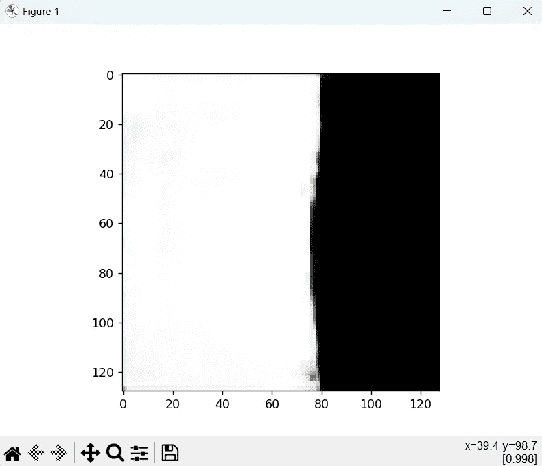

模型预测（图片来源：作者提供）

我在一些私人数据上训练了一个二分类图像分割模型。由于隐私原因，我不能透露我的模型或数据的详细信息。但所有提到的内容都应该适用于任何图像分割模型。

## 版本控制

最后，如果你需要从一开始就获得更多资源，或想要最小化冷启动问题，我们可以通过几个额外的步骤创建同样的新版本。

**前往你的 gcloud 控制台** **在 GUI > 搜索 cloud run API > 选择已部署的服务 > 点击编辑并部署新版本按钮**。你将看到以下选项，根据你的需求进行选择，保存它们，系统将自动为下一批请求设置模型的新版本。

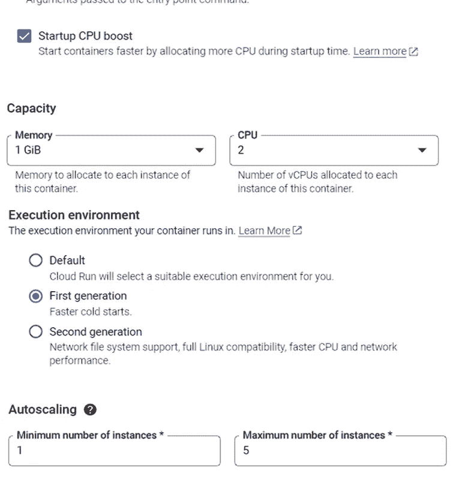

解决冷启动问题（图片来源：作者提供）

# 结论

+   选择正确的部署策略对节省成本至关重要。

+   我们可以使用量化技术使模型更快更小。

+   使用量化模型的无服务器部署是一种很好的策略，可以轻松处理许多请求而不使用昂贵的 GPU 实例。

+   无服务器架构消除了扩展的麻烦。

感谢你的时间和耐心，祝学习愉快 ❤。关注我，获取更多这样的精彩内容。

## **这是我的 MLOps 阅读清单，讨论了几个其他关键概念和策略：**


[Vishal Rajput](https://vishal-ai.medium.com/?source=post_page-----b4cd84f86de1--------------------------------)

## MLOps

[查看列表](https://vishal-ai.medium.com/list/mlops-ff7f2453a835?source=post_page-----b4cd84f86de1--------------------------------)10 个故事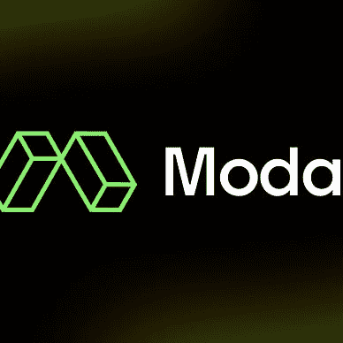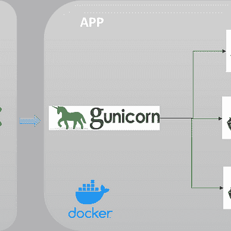
