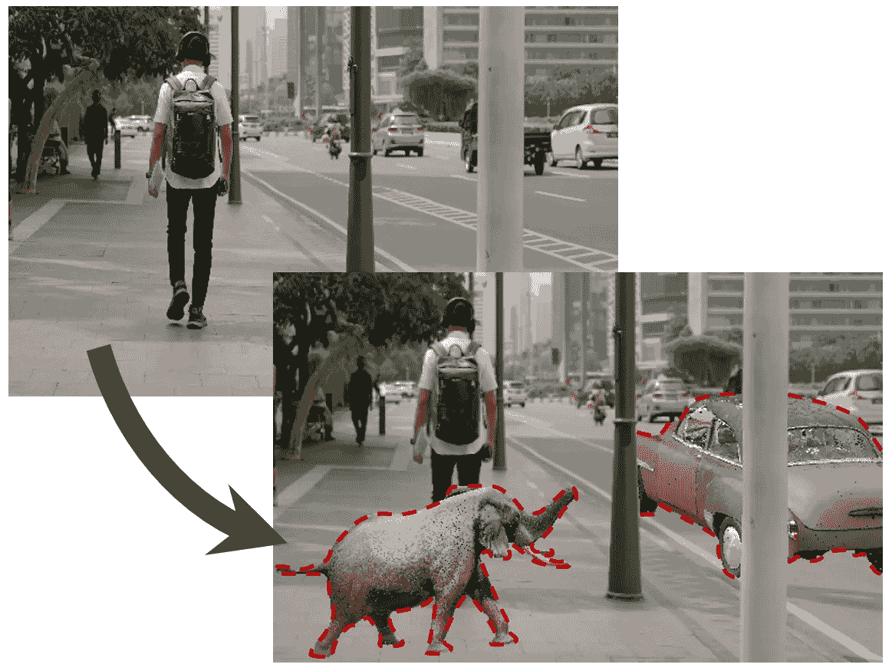
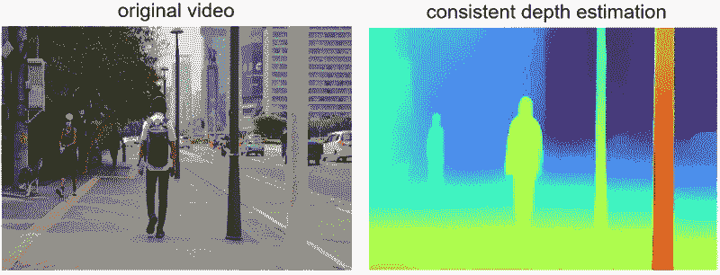
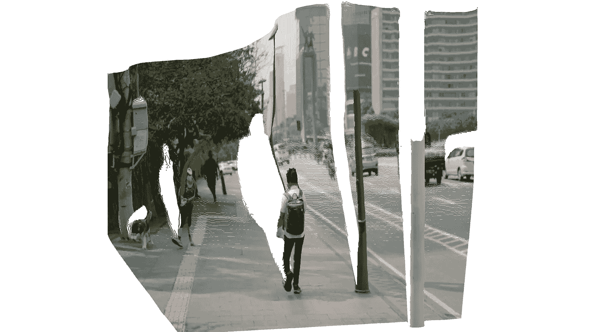
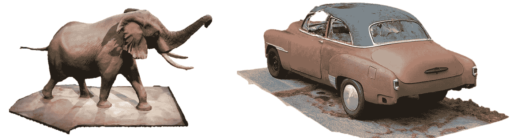
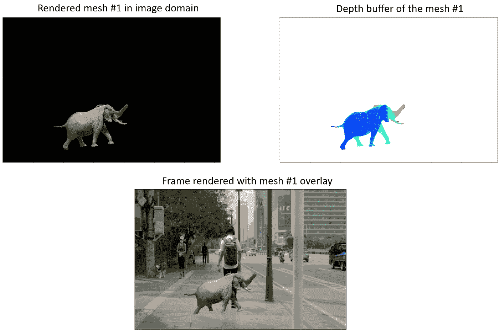
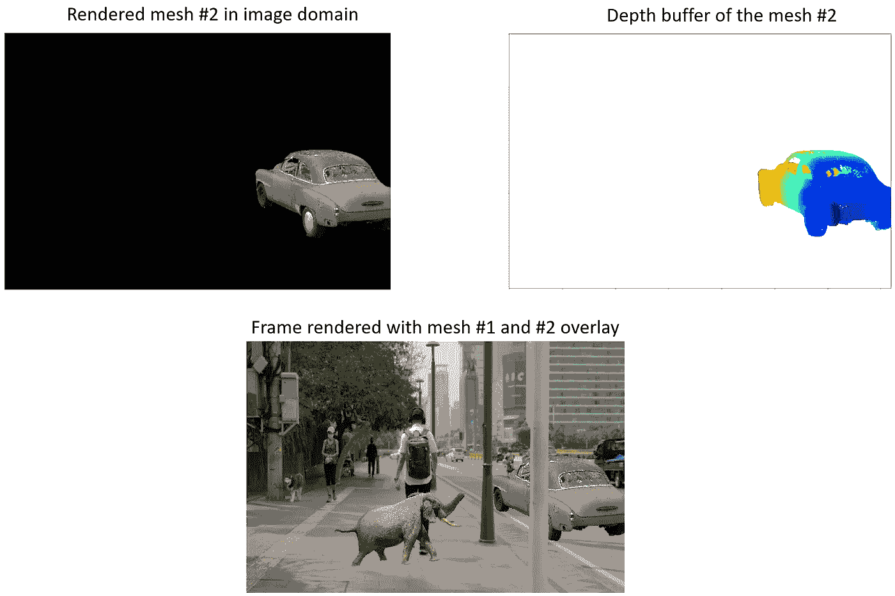
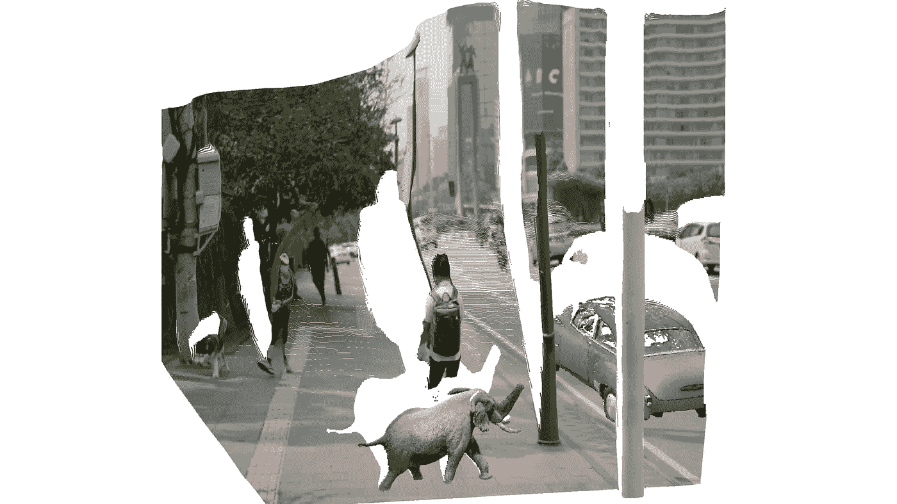
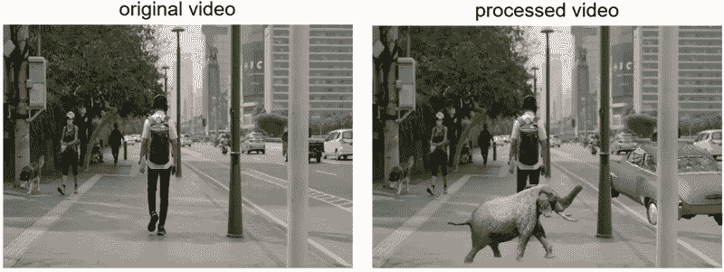

# 使用 Python 进行深度感知的对象插入视频

> 原文：[`towardsdatascience.com/depth-aware-object-insertion-in-videos-using-python-60eeee7d17b5?source=collection_archive---------6-----------------------#2023-08-29`](https://towardsdatascience.com/depth-aware-object-insertion-in-videos-using-python-60eeee7d17b5?source=collection_archive---------6-----------------------#2023-08-29)

## 使用 Python 进行深度感知的 3D 模型插入视频的指南

[](https://medium.com/@berkanzorlubas?source=post_page-----60eeee7d17b5--------------------------------)[](https://towardsdatascience.com/?source=post_page-----60eeee7d17b5--------------------------------) [Berkan Zorlubas](https://medium.com/@berkanzorlubas?source=post_page-----60eeee7d17b5--------------------------------)

·

[关注](https://medium.com/m/signin?actionUrl=https%3A%2F%2Fmedium.com%2F_%2Fsubscribe%2Fuser%2F7d74427941be&operation=register&redirect=https%3A%2F%2Ftowardsdatascience.com%2Fdepth-aware-object-insertion-in-videos-using-python-60eeee7d17b5&user=Berkan+Zorlubas&userId=7d74427941be&source=post_page-7d74427941be----60eeee7d17b5---------------------post_header-----------) 发表在 [Towards Data Science](https://towardsdatascience.com/?source=post_page-----60eeee7d17b5--------------------------------) ·9 分钟阅读·2023 年 8 月 29 日[](https://medium.com/m/signin?actionUrl=https%3A%2F%2Fmedium.com%2F_%2Fvote%2Ftowards-data-science%2F60eeee7d17b5&operation=register&redirect=https%3A%2F%2Ftowardsdatascience.com%2Fdepth-aware-object-insertion-in-videos-using-python-60eeee7d17b5&user=Berkan+Zorlubas&userId=7d74427941be&source=-----60eeee7d17b5---------------------clap_footer-----------)

--

[](https://medium.com/m/signin?actionUrl=https%3A%2F%2Fmedium.com%2F_%2Fbookmark%2Fp%2F60eeee7d17b5&operation=register&redirect=https%3A%2F%2Ftowardsdatascience.com%2Fdepth-aware-object-insertion-in-videos-using-python-60eeee7d17b5&source=-----60eeee7d17b5---------------------bookmark_footer-----------)

作者提供的图片

在计算机视觉领域，一致的深度和相机姿态估计为更高级的操作奠定了基础，例如在视频中插入深度感知对象。基于我之前探讨这些基本技术的[文章](https://medium.com/towards-data-science/creating-3d-videos-from-rgb-videos-491a09fa1e79)，本文将重点转向深度感知对象的插入。通过基于 Python 的计算方法，我将概述一种将对象添加到现有视频帧中的策略，以符合深度和相机方向数据。这种方法不仅提升了编辑视频内容的真实感，还有广泛的视频后期制作应用。

总结来说，该方法包括两个主要步骤：首先，估计视频中的一致深度和相机位置；其次，将网格对象叠加到视频帧上。为了使对象在视频的三维空间中看起来是静止的，它会沿着相反的方向移动以抵消相机的移动。这种反向移动确保对象在整个视频中看起来像是固定的。

*你可以在我的* [*GitHub*](https://github.com/berkanz/dynamic-video-depth) *页面查看我的代码，本文中将引用这些代码。*

# 步骤 1：生成相机姿态矩阵和视频的一致深度估计

在我之前的[文章](https://medium.com/towards-data-science/creating-3d-videos-from-rgb-videos-491a09fa1e79)中，我详细解释了如何估计视频的一致深度帧及其对应的相机姿态矩阵。

对于这篇文章，我选择了一段[视频](https://www.videvo.net/video/tracking-shot-following-a-person-walking-down-a-street-in-jakarta/1008167/)，视频内容是一个人在街上行走，特别选择了这一视频是因为其明显的相机运动轴线。这将有助于清楚地评估插入的对象是否在视频的三维空间中保持固定位置。

我按照我在之前的文章中解释的所有步骤获取了深度帧和估计的相机姿态矩阵。我们特别需要由 COLMAP 生成的“custom.matrices.txt”文件。

原始视频及其估计深度视频如下所示。



**（左）** 由[Videvo](https://www.videvo.net/video/tracking-shot-following-a-person-walking-down-a-street-in-jakarta/1008167/)提供的库存视频，从[www.videvo.net](http://www.videvo.net/)下载 | **（右）** 作者创建的估计深度视频

对应于第一帧的点云可视化如下。白色间隙表示由于前景对象的存在而被相机视角遮挡的阴影区域。



生成的视频第一帧的点云

# 步骤 2：选择你想插入的网格文件

现在，我们选择要插入到视频序列中的网格文件。各种平台，如[Sketchfab.com](https://sketchfab.com/)和[GrabCAD.com](http://grabcad.com)，提供了丰富的 3D 模型供选择。

对于我的演示视频，我选择了两个 3D 模型，相关链接在下图说明中提供：



**(左)** [3D 模型](https://sketchfab.com/3d-models/elephant-in-the-rotunda-26ee59c981964681bf9f4e5eae2a3a26)由 Abby Gancz 提供（CC BY 4.0），下载自[www.sketchfab.com](http://sketchfab.com) | **(右)** [3D 模型](https://sketchfab.com/3d-models/1952-chevrolet-free-raw-scan-de300880665f4e8b86cbd2a9a656265f)由 Renafox 提供（CC BY 4.0），下载自[www.sketchfab.com](http://sketchfab.com)

我使用了[CloudCompare](https://www.danielgm.net/cc/)，这是一个用于 3D 点云处理的开源工具，对 3D 模型进行了预处理。具体而言，我去除了对象的地面部分，以增强其在视频中的整合效果。虽然这一步是可选的，但如果你希望修改你的 3D 模型的某些方面，强烈推荐使用 CloudCompare。

处理完网格文件后，将其保存为.ply 或.obj 文件。（请注意，并非所有的 3D 模型文件扩展名都支持彩色网格，例如.stl）。

# 第 3 步：重新渲染带有深度感知物体插入的帧

我们现在来到了项目的核心部分：视频处理。在我的仓库中，提供了两个关键脚本——`video_processing_utils.py`和`depth_aware_object_insertion.py`。顾名思义，`video_processing_utils.py`包含了所有用于物体插入的必要功能，而`depth_aware_object_insertion.py`作为主要脚本，在循环中对每一帧视频执行这些功能。

下面是`depth_aware_object_insertion.py`主要部分的一个片段。在一个循环中，该循环运行的次数与输入视频中的帧数相同，我们从深度计算管道中加载批量信息，从中获取原始 RGB 帧及其深度估计。然后我们计算相机姿态矩阵的逆。接下来，我们将网格、深度和相机的内参输入名为`render_mesh_with_depth()`的函数中。

```py
for i in tqdm(range(batch_count)):

    batch = np.load(os.path.join(BATCH_DIRECTORY, file_names[i]))

    # ... (snipped for brevity)

    # transformation of the mesh with the inverse camera extrinsics
    frame_transformation = np.vstack(np.split(extrinsics_data[i],4))
    inverse_frame_transformation = np.empty((4, 4))
    inverse_frame_transformation[:3, :] = np.concatenate((np.linalg.inv(frame_transformation[:3,:3]),  
                                                          np.expand_dims(-1 * frame_transformation[:3,3],0).T), axi
    inverse_frame_transformation[3, :] = [0.00, 0.00, 0.00, 1.00]
    mesh.transform(inverse_frame_transformation)

    # ... (snipped for brevity)

    image = np.transpose(batch['img_1'], (2, 3, 1, 0))[:,:,:,0]    
    depth = np.transpose(batch['depth'], (2, 3, 1, 0))[:,:,0,0]

    # ... (snipped for brevity)

    # rendering the color and depth buffer of the transformed mesh in the image domain
    mesh_color_buffer, mesh_depth_buffer = render_mesh_with_depth(np.array(mesh.vertices), 
                                                                  np.array(mesh.vertex_colors), 
                                                                  np.array(mesh.triangles), 
                                                                  depth, intrinsics)

    # depth-aware overlaying of the mesh and the original image
    combined_frame, combined_depth = combine_frames(image, mesh_color_buffer, depth, mesh_depth_buffer) 

    # ... (snipped for brevity)
```

`render_mesh_with_depth`函数接受一个由顶点、顶点颜色和三角形表示的 3D 网格，并将其渲染到 2D 深度帧上。函数首先通过初始化深度和颜色缓冲区来保存渲染输出。然后，使用相机内参将 3D 网格顶点投影到 2D 帧上。函数使用扫描线渲染来循环遍历网格中的每个三角形，并将其光栅化到 2D 帧上的像素中。在此过程中，函数计算每个像素的重心坐标以插值深度和颜色值。然后，仅当像素的插值深度比深度缓冲区中的现有值更接近相机时，使用这些插值值更新深度和颜色缓冲区。最后，函数将色彩和深度缓冲区作为渲染输出返回，其中色彩缓冲区转换为适合图像显示的 uint8 格式。

```py
def render_mesh_with_depth(mesh_vertices, vertex_colors, triangles, depth_frame, intrinsic):
    vertex_colors = np.asarray(vertex_colors)

    # Initialize depth and color buffers
    buffer_width, buffer_height = depth_frame.shape[1], depth_frame.shape[0]
    mesh_depth_buffer = np.ones((buffer_height, buffer_width)) * np.inf

    # Project 3D vertices to 2D image coordinates
    vertices_homogeneous = np.hstack((mesh_vertices, np.ones((mesh_vertices.shape[0], 1))))
    camera_coords = vertices_homogeneous.T[:-1,:]
    projected_vertices = intrinsic @ camera_coords
    projected_vertices /= projected_vertices[2, :]
    projected_vertices = projected_vertices[:2, :].T.astype(int)
    depths = camera_coords[2, :]

    mesh_color_buffer = np.zeros((buffer_height, buffer_width, 3), dtype=np.float32)

    # Loop through each triangle to render it
    for triangle in triangles:
        # Get 2D points and depths for the triangle vertices
        points_2d = np.array([projected_vertices[v] for v in triangle])
        triangle_depths = [depths[v] for v in triangle]
        colors = np.array([vertex_colors[v] for v in triangle])

        # Sort the vertices by their y-coordinates for scanline rendering
        order = np.argsort(points_2d[:, 1])
        points_2d = points_2d[order]
        triangle_depths = np.array(triangle_depths)[order]
        colors = colors[order]

        y_mid = points_2d[1, 1]

        for y in range(points_2d[0, 1], points_2d[2, 1] + 1):
            if y < 0 or y >= buffer_height:
                continue

            # Determine start and end x-coordinates for the current scanline
            if y < y_mid:
                x_start = interpolate_values(y, points_2d[0, 1], points_2d[1, 1], points_2d[0, 0], points_2d[1, 0])
                x_end = interpolate_values(y, points_2d[0, 1], points_2d[2, 1], points_2d[0, 0], points_2d[2, 0])
            else:
                x_start = interpolate_values(y, points_2d[1, 1], points_2d[2, 1], points_2d[1, 0], points_2d[2, 0])
                x_end = interpolate_values(y, points_2d[0, 1], points_2d[2, 1], points_2d[0, 0], points_2d[2, 0])

            x_start, x_end = int(x_start), int(x_end)

            # Loop through each pixel in the scanline
            for x in range(x_start, x_end + 1):
                if x < 0 or x >= buffer_width:
                    continue

                # Compute barycentric coordinates for the pixel
                s, t, u = compute_barycentric_coords(points_2d, x, y)

                # Check if the pixel lies inside the triangle
                if s >= 0 and t >= 0 and u >= 0:
                    # Interpolate depth and color for the pixel
                    depth_interp = s * triangle_depths[0] + t * triangle_depths[1] + u * triangle_depths[2]
                    color_interp = s * colors[0] + t * colors[1] + u * colors[2]

                    # Update the pixel if it is closer to the camera
                    if depth_interp < mesh_depth_buffer[y, x]:
                        mesh_depth_buffer[y, x] = depth_interp
                        mesh_color_buffer[y, x] = color_interp

    # Convert float colors to uint8
    mesh_color_buffer = (mesh_color_buffer * 255).astype(np.uint8)

    return mesh_color_buffer, mesh_depth_buffer
```

转换后的网格的色彩和深度缓冲区与原始 RGB 图像及其估计的深度图一起输入到`combine_frames()`函数中。该函数旨在合并两组图像和深度帧。它使用深度信息来决定原始帧中哪些像素应该由渲染网格帧中的对应像素替换。具体来说，对于每个像素，函数检查渲染网格的深度值是否小于原始场景的深度值。如果是，认为该像素在渲染网格帧中更“接近”相机，并相应地替换色彩和深度帧中的像素值。函数返回合并后的色彩和深度帧，有效地根据深度信息将渲染网格叠加到原始场景中。

```py
# Combine the original and mesh-rendered frames based on depth information
def combine_frames(original_frame, rendered_mesh_img, original_depth_frame, mesh_depth_buffer):
    # Create a mask where the mesh is closer than the original depth
    mesh_mask = mesh_depth_buffer < original_depth_frame

    # Initialize combined frames
    combined_frame = original_frame.copy()
    combined_depth = original_depth_frame.copy()

    # Update the combined frames with mesh information where the mask is True
    combined_frame[mesh_mask] = rendered_mesh_img[mesh_mask]
    combined_depth[mesh_mask] = mesh_depth_buffer[mesh_mask]

    return combined_frame, combined_depth
```

这是第一个对象——大象的`mesh_color_buffer`、`mesh_depth_buffer`和`combined_frame`的视觉效果。由于大象对象在帧内没有被任何其他元素遮挡，因此完全可见。在不同的放置方式下，会发生遮挡。



**(左)** 大象网格的计算色缓冲区 | **(右)** 大象网格的计算深度缓冲区 | **(底部)** 组合帧

相应地，我将第二个网格——汽车，放置在路边的路缘。我还调整了它的初始方向，使其看起来像是被停放在那里。以下是该网格的`mesh_color_buffer`、`mesh_depth_buffer`和`combined_frame`的视觉效果。



**(左)** 小汽车网格的计算色缓冲区 | **(右)** 小汽车网格的计算深度缓冲区 | **(底部)** 组合帧

下面是插入了两个对象的点云可视化。由于新对象引入了新的遮挡区域，出现了更多的白色间隙。



插入对象后第一帧的生成点云

在计算了每个视频帧的叠加图像后，我们现在准备渲染我们的视频。

# **第 4 步：从处理过的帧渲染视频**

在`depth_aware_object_insertion.py`的最后一部分，我们仅需使用`render_video_from_frames`函数从插入了物体的帧渲染视频。你也可以在此步骤调整输出视频的帧率。代码如下：

```py
video_name = 'depth_aware_object_insertion_demo.mp4'
save_directory = "depth_aware_object_insertion_demo/"
frame_directory = "depth_aware_object_insertion_demo/"
image_extension = ".png"
fps = 15 

# rendering a video of the overlayed frames
render_video_from_frames(frame_directory, image_extension, save_directory, video_name, fps)
```

这是我的演示视频：



**（左）** 由 [Videvo](https://www.videvo.net/video/tracking-shot-following-a-person-walking-down-a-street-in-jakarta/1008167/) 提供的素材，从 [www.videvo.net](http://www.videvo.net/) 下载 | **（右）** 插入了两个物体的素材

*此动画的高分辨率版本已上传至* [*YouTube*](https://youtu.be/4euMXXLxLoQ)*。*

总体而言，物体完整性似乎得到了很好的保持；例如，在场景中，汽车物体被街灯杆有效地遮挡。尽管在整个视频中汽车的位置有轻微的抖动——很可能是由于相机姿态估计的不完美——但世界锁定机制在演示视频中通常表现如预期。

虽然视频中的物体插入概念并不新颖，已有如 After Effects 这样的工具提供基于特征跟踪的方法，但这些传统方法对于不熟悉视频编辑工具的人来说通常非常具有挑战性和成本高昂。这时，基于 Python 的算法就显得很有前景。利用机器学习和基本的编程构造，这些算法有潜力使高级视频编辑任务变得更加平易近人，即使是对这一领域经验有限的个人也能接触到。因此，随着技术的不断发展，我预期基于软件的方法将作为强有力的推动者，平衡竞争格局，开辟视频编辑中的创意表达新途径。

祝你有美好的一天！
