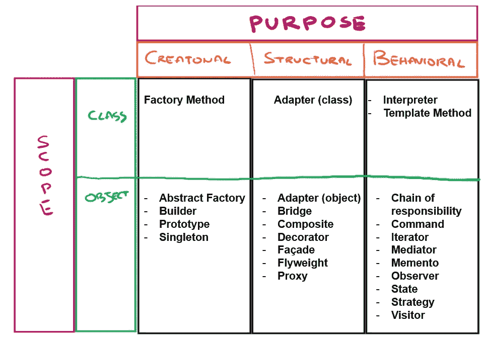
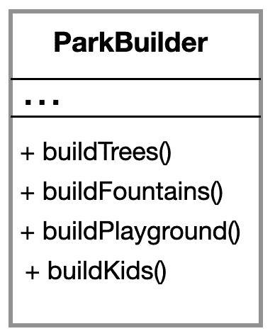

# 设计模式与 Python：构建器

> 原文：[`towardsdatascience.com/design-patterns-with-python-for-machine-learning-engineers-builder-45b8e749f134`](https://towardsdatascience.com/design-patterns-with-python-for-machine-learning-engineers-builder-45b8e749f134)


图片由 [Anton Maksimov 5642.su](https://unsplash.com/@juvnsky?utm_source=medium&utm_medium=referral) 提供，来自 [Unsplash](https://unsplash.com/?utm_source=medium&utm_medium=referral)

## 学习如何使用构建器设计模式来提升你的代码

[](https://medium.com/@marcellopoliti?source=post_page-----45b8e749f134--------------------------------)[](https://towardsdatascience.com/?source=post_page-----45b8e749f134--------------------------------) [Marcello Politi](https://medium.com/@marcellopoliti?source=post_page-----45b8e749f134--------------------------------)

·发表于 [Towards Data Science](https://towardsdatascience.com/?source=post_page-----45b8e749f134--------------------------------) ·阅读时间 6 分钟·2023 年 10 月 12 日

--

# 介绍

对于从事 AI 开发的人来说，一个重要的技能是编写干净、可重用的代码。因此，今天我将使用[Deepnote](https://deepnote.com/)介绍另一种设计模式。

无论你在深度学习、统计学或其他领域的水平如何，**如果你的代码不干净且不易于重用，你将永远无法开发出具有重大影响的东西**。这就是为什么我认为数据科学家拥有软件工程技能非常重要的原因。 [设计模式](https://en.wikipedia.org/wiki/Software_design_pattern)是所有编写代码的人都应该了解的东西。今天我们要讨论的是一个叫做构建器的模式。

## 什么是设计模式？

**设计模式只是一种对重复问题的通用设计解决方案**。与其一遍又一遍地解决同样的问题，不如想出一种每次遇到相同问题时都能使用的解决方案，而这些解决方案已经被找到！幸运的是，有人已经想到了让我们的生活更轻松的方法！:)

设计模式有多种类型。但主要有 3 种：

+   **创建型**：涉及创建对象的过程。

+   **结构型**：涉及类和对象的组成。

+   **行为型**：定义了类和对象如何交互。

    将责任分配给他们自己。



设计模式（作者提供的图片）

## 构建器设计模式

**构建器**是名为创建设计模式的一个部分，因为它精确地**简化了对象的创建**过程。想象一下你有一个类，它需要大量的参数才能实例化，或者对于 Python 用户来说，一个类的`__init__()`方法期望接收大量的输入参数。

**假设你有一个类来设计公园，也许是因为你正在为视频游戏创建环境**。**你可以以各种方式自定义公园**，添加和移除各种元素。你可以添加游戏、孩子们，或者创建一个满是动物的公园等等。


图像作者提供

但是在实现层面，我们如何处理所有这些类型的公园呢？**最直观的解决方案可能是创建一个基础的公园类，其他类然后扩展这个基础类**以包含各种特性。但在这种情况下，我们会得到四个子类，在实际项目中，我们会有**大量的子类**，这会使我们的代码变得不切实际。

**或者**我们可以创建一个类，公园类，并**使用一个巨大的构造函数，可以接收大量的输入参数。但问题是，在大多数情况下，输入参数将为空**，因为我们并不总是想要创建一个什么都有的公园，而且代码看起来也会有点丑。

**构建器采用的解决方案是将我们想要包含的各种特性创建在公园类中的不同方法中，称为构建器**，而不是将所有内容都放在构造函数中。这样我们可以根据需要一步一步地构建公园的各个部分。



ParkBuilder（图像作者提供）

## 让我们开始编写代码吧！

现在让我们看看如何在 Python 中实现这个设计模式。在这个例子中，我们想要构建不同类型的机器人，这些机器人有不同的配置。以下代码将由 5 个基本部分组成。

1.  **机器人类：**

+   首先，我们创建一个`Robot`类，表示我们想要构建的对象，包括其所有属性，如`head`、`arms`、`legs`、`torso`和`battery`。

```py
# Define the Robot class
class Robot:
    def __init__(self):
        self.head = None
        self.arms = None
        self.legs = None
        self.torso = None
        self.battery = None
```

**2\. 构建器接口：**

+   `RobotBuilder`接口是一个抽象类，它定义了一组用于构建`Robot`对象不同部分的方法。这些方法包括`reset`、`build_head`、`build_arms`、`build_legs`、`build_torso`、`build_battery`和`get_robo`。

```py
from abc import ABC, abstractmethod

class RobotBuilder(ABC):
    @abstractmethod
    def reset(self):
        pass

    @abstractmethod
    def build_head(self):
        pass

    @abstractmethod
    def build_arms(self):
        pass

    @abstractmethod
    def build_legs(self):
        pass

    @abstractmethod
    def build_torso(self):
        pass

    @abstractmethod
    def build_battery(self):
        pass

    @abstractmethod
    def get_robot(self):
        pass 
```

**3\. 具体构建器**：

+   现在我们有实现了抽象类`RobotBuilder`的构建器类，它们分别是`HumanoidRobotBuilder`和`DroneRobotBuilder`。这些构建器为机器人提供了不同的设置，使它们彼此区分开来。

+   记住，每个构建器保持一个正在构建的`Robot`实例。

```py
# Define a Concrete Builder for a Robot
class HumanoidRobotBuilder(RobotBuilder):
    def __init__(self):
        self.robot = Robot()
        self.reset()

    def reset(self):
        self.robot = Robot()

    def build_head(self):
        self.robot.head = "Humanoid Head"

    def build_arms(self):
        self.robot.arms = "Humanoid Arms"

    def build_legs(self):
        self.robot.legs = "Humanoid Legs"

    def build_torso(self):
        self.robot.torso = "Humanoid Torso"

    def build_battery(self):
        self.robot.battery = "Humanoid Battery"

    def get_robot(self):
        return self.robot
```

```py
# Define a Concrete Builder for a Robot
class DroneRobotBuilder(RobotBuilder):
    def __init__(self):
        self.robot = Robot()
        self.reset()

    def reset(self):
        self.robot = Robot()

    def build_head(self):
        self.robot.head = "Drone Head"

    def build_arms(self):
        self.robot.arms = "No Arms"

    def build_legs(self):
        self.robot.legs = "No Legs"

    def build_torso(self):
        self.robot.torso = "Drone Torso"

    def build_battery(self):
        self.robot.battery = "Drone Battery"

    def get_robot(self):
        return self.robot
```

**4\. 机器人导演：**

+   名为`RobotDirector`的类负责使用其可用的特定构建器指导机器人的构建过程。

+   在这个类中，你会找到`set_builder`方法来激活你需要的构建器，以及`build_humanoid_robot`和`build_drone_robot`方法来创建不同类型的机器人。

+   导演的方法返回最终构造的机器人对象。

```py
# Define the RobotDirector class with methods to create different robots
class RobotDirector:
    def __init__(self):
        self.builder = None

    def set_builder(self, builder):
        self.builder = builder

    def build_humanoid_robot(self):
        self.builder.reset()
        self.builder.build_head()
        self.builder.build_arms()
        self.builder.build_legs()
        self.builder.build_torso()
        self.builder.build_battery()
        return self.builder.get_robot()

    def build_drone_robot(self):
        self.builder.reset()
        self.builder.build_head()
        self.builder.build_torso()
        self.builder.build_battery()
        return self.builder.get_robot() 
```

**5\. 客户端代码：**

+   让我们创建一个`RobotDirector`实例。

+   然后创建一个`HumanoidRobotBuilder`并将其设置为类人机器人的活动构建器。

+   我们还使用导演的`build_humanoid_robot`方法来创建一个类人机器人。

+   现在我们可以创建一个`DroneRobotBuilder`并将其设置为无人机机器人的活动构建器。

+   现在我们需要使用导演的`build_drone_robot`方法来创建一个无人机机器人。

+   最后，我们打印出这两种机器人的组件。

```py
# Client code
if __name__ == "__main__":
    director = RobotDirector()

    humanoid_builder = HumanoidRobotBuilder()
    director.set_builder(humanoid_builder)
    humanoid_robot = director.build_humanoid_robot()

    drone_builder = DroneRobotBuilder()
    director.set_builder(drone_builder)
    drone_robot = director.build_drone_robot()

    print("Humanoid Robot Components:")
    print(f"Head: {humanoid_robot.head}")
    print(f"Arms: {humanoid_robot.arms}")
    print(f"Legs: {humanoid_robot.legs}")
    print(f"Torso: {humanoid_robot.torso}")
    print(f"Battery: {humanoid_robot.battery}")

    print("\nDrone Robot Components:")
    print(f"Head: {drone_robot.head}")
    print(f"Arms: {drone_robot.arms}")
    print(f"Legs: {drone_robot.legs}")
    print(f"Torso: {drone_robot.torso}")
    print(f"Battery: {drone_robot.battery}")
```

就这样！😊

# 最后的想法

**建造者模式将复杂对象的构造与其表示解耦。** 正如我们在这个例子中所见，**RobotDirector 负责协调构造过程，但并不清楚创建不同类型机器人的具体步骤。** 具体的构建器，我们在这里称之为 HumanoidRobotBuilder 和 DroneRobotBuilder，为构建特定机器人配置提供逐步实现。

**这个模式允许灵活性和可扩展性**，使得创建具有可变属性的复杂对象成为可能，同时保持客户端代码简洁易用。所有这些使我们能够以清晰且一致的方式构建复杂的对象。

如果你对这篇文章感兴趣，可以在 Medium 上关注我！😁

💼 [Linkedin](https://www.linkedin.com/in/marcello-politi/) ️| 🐦 [Twitter](https://twitter.com/_March08_) | [💻](https://emojiterra.com/laptop-computer/) [网站](https://marcello-politi.super.site/)

你可能对我之前的一些文章也感兴趣：

+   机器学习工程师的 Python 设计模式：观察者

+   机器学习工程师的 Python 设计模式：抽象工厂
