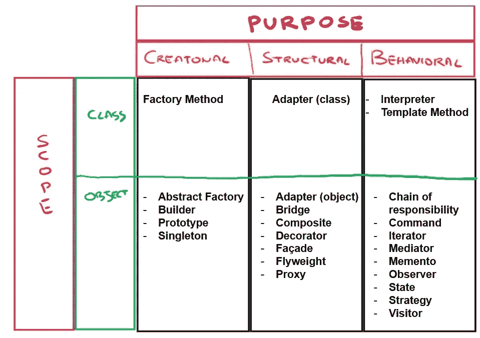
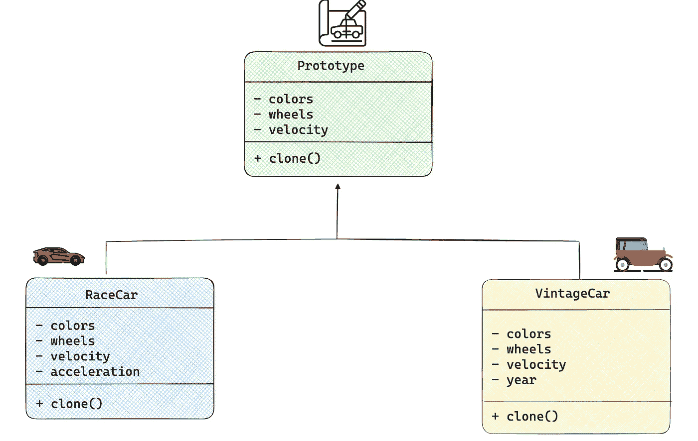

# 《Python 机器学习工程师的设计模式：原型》

> 原文：[`towardsdatascience.com/design-patterns-with-python-for-machine-learning-engineers-prototype-fcc1358a862d`](https://towardsdatascience.com/design-patterns-with-python-for-machine-learning-engineers-prototype-fcc1358a862d)


图片来源：[Robert Katzki](https://unsplash.com/@ro_ka?utm_source=medium&utm_medium=referral)在[Unsplash](https://unsplash.com/?utm_source=medium&utm_medium=referral)

## 学习如何使用原型设计模式来增强你的代码

[](https://medium.com/@marcellopoliti?source=post_page-----fcc1358a862d--------------------------------)[](https://towardsdatascience.com/?source=post_page-----fcc1358a862d--------------------------------) [Marcello Politi](https://medium.com/@marcellopoliti?source=post_page-----fcc1358a862d--------------------------------)

·发表于 [Towards Data Science](https://towardsdatascience.com/?source=post_page-----fcc1358a862d--------------------------------) ·6 min 阅读·2023 年 12 月 5 日

--

## 介绍

这不是我第一次写关于设计模式的博客文章。在我最近的文章中，我收到了关于这个话题的积极反馈，因为显然**在 Python 世界中使用设计模式并不常见**。我认为人们应该学习这些模式，以增强和改进他们的代码。此外，今天的 AI 软件严重依赖 Python，所以我认为这些教程对所有从事 AI 的人都有用。我将在[Deepnote](https://deepnote.com/)上运行我的代码：这是一个基于云的笔记本，非常适合协作数据科学项目。

## 什么是设计模式？

设计模式为那些在软件设计中经常出现的问题提供了明确的解决方案。这些模式提供可重用的解决方案，避免了一次次重复解决同一问题，加快了整个开发过程。

设计模式本质上提供了一个经过验证的、稳健的蓝图，以最佳方式解决特定问题，使我们的工作更轻松。

设计模式有多种类型，通常分为三大类：

1.  **创建型模式**：这些模式关注于对象的创建，提供对象创建机制，同时保持系统的灵活性和高效性。

1.  **结构型模式**：这些模式围绕类和对象的组成展开，处理不同组件之间的关系以形成更大的结构。

1.  **行为模式**：这一类别管理类和对象如何交互，概述了它们之间的责任分配。它定义了在软件系统内进行通信和协作的协议。



设计模式（图片来源：作者）

## 问题

当我们在使用 Python 处理大型项目时，我们通常**采用面向对象的编程方法**来使代码更具可读性。通常，我们**最终会有很多类和大量的对象。**

有时发生的情况是**我们想要创建一个对象的精确副本**。你怎么做？以**简单的方式**，你可以实例化另一个相同类的对象，然后**复制你想克隆的对象的每个内部字段**。但这个过程很慢且乏味。

此外，还可能存在另一个问题**。有时你不能轻易实例化一个对象，因为调用一个类的构造函数可能是昂贵的**。例如，假设在构造函数中你运行一个需要支付费用的外部服务的 API 请求。

我们如何解决这个问题？嗯……通过设计模式，特别是使用一种创建型模式：*原型模式*。

## 原型设计模式

首先，我们**需要创建一个包含 clone() 抽象方法的抽象类（或接口）**。我们创建的所有类都必须实现此接口，并定义如何克隆该类本身的对象。这样，**克隆的职责不在于类，而在于对象本身。**



原型设计模式

我现在将**使用 Python 的 ABC 库创建一个抽象类**。

以下类将定义一个带有一些属性的车辆原型。

```py
from abc import ABC, abstractmethod
import time

# Class Creation
class Prototype(ABC):
    # Constructor:
    def __init__(self):
        # Mocking an expensive call
        time.sleep(2)
        # Base attributes
        self.color = None
        self.wheels = None
        self.velocity = None

    # Clone Method:
    @abstractmethod
    def clone(self):
        pass 
```

现在我们可以创建一些实现此接口的类，为此，它们必须实现 clone() 抽象方法。**在 Python 中，为了创建副本，我们可以使用 deepcopy()** 或 copy 库中的浅拷贝（shallow copy()）方法。

具体来说，浅拷贝复制对非基本字段的引用，而深拷贝生成具有相同数据的新实例。

现在让我们定义一个具体的类。**我将让构造函数休眠 2 秒钟，以模拟如介绍中所述的构造函数的昂贵调用。**

```py
import copy
import time

class RaceCar(Prototype):
    def __init__(self, color, wheels, velocity, attack):
        super().__init__()
        # Mock expensive call
        time.sleep(2)
        self.color = color
        self.wheels = wheels
        self.velocity = velocity
        # Subclass-specific Attribute
        self.acceleration = True

    # Overwriting Cloning Method:
    def clone(self):
        return copy.deepcopy(self) 
```

每次我想实例化一个 RaceCar 对象时都需要 2 秒，因为有 sleep 方法。我们可以监控这个。

```py
import time

start = time.time()
print('Starting to create a race car.')
race_car = RaceCar("red", 4, 40)
print('Finished creating a race car', )
end = time.time()

#will take 2 seconds
print('Time to complete: ' , end-start)
```

很好！我们创建了一辆赛车，这并不难。现在**我想要制作 5 个副本**，因为我的目的是开发一个有很多汽车的视频游戏。我们可以简单地在 for 循环中做同样的事。

```py
cars = []

start = time.time()
print('Start instantiating clones', )
for i in range(5):
    race_car = RaceCar("red", 4, 40)
    cars.append(race_car)    
end = time.time()
print('Time to complete: ', end-start)
```

**如果你运行这段代码，它将花费 2s*5 即总共 10s！** 😵‍💫

如果我们改用 clone 方法呢？我们来试试吧。

```py
# now we create clones by using propotypes
cars = []

start = time.time()
print('Instantiating first car', )
race_car = RaceCar("red", 4, 40)

for i in range(5):
    race_car = race_car.clone()
    cars.appen(race_car)
end = time.time()
print('Time to complete: ', end-start)
```

这段代码只需 2 秒钟运行，这就是实例化第一辆车所需的时间。**其他汽车的创建将不会花费时间。** 太棒了！

## 机器学习示例

这个模型如何在机器学习脚本中使用？假设你实例化了一个预定义的 PyTorch 类模型，如下所示。

```py
import copy
import torch
import torch.nn as nn

class NeuralNetwork(nn.Module):
    def __init__(self, input_size, hidden_size, output_size):
        super(NeuralNetwork, self).__init__()
        self.layer1 = nn.Linear(input_size, hidden_size)
        self.activation = nn.ReLU()
        self.layer2 = nn.Linear(hidden_size, output_size)

    def forward(self, x):
        x = self.layer1(x)
        x = self.activation(x)
        x = self.layer2(x)
        return x

    def clone(self):
        return copy.deepcopy(self)
```

一旦定义了类，你就可以创建你的模型对象。

```py
# Base neural network configuration
base_model = NeuralNetwork(input_size=10, hidden_size=64, output_size=1)
```

现在，你可能想要对你的模型进行一些变化，也许你只对修改一两个参数感兴趣。你可以创建第一个模型的克隆，并手动更改这些参数。

```py
 # Clone the base model to create variations
model_variation_1 = base_model.clone()
model_variation_1.activation = nn.Tanh()

model_variation_2 = base_model.clone()
model_variation_2.hidden_size = 128

# Display summaries of the models
print("Base Model Summary:")
print(base_model)

print("\nModel Variation 1 Summary:")
print(model_variation_1)

print("\nModel Variation 2 Summary:")
print(model_variation_2)
```

完成了，很简单吧？😁

# 最后的想法

在这篇文章中，我解释了为什么你应该在 Python 中采用设计模式。设计模式不仅仅是你可以在少数编程语言中使用的东西（例如 Java），它是一种解决常见问题的理论方案。实例化许多具有相同属性的对象可能会很慢且昂贵，这就是为什么通过在接口中指定克隆方法，我们可以缓解这个问题并创建我们需要的任意数量的克隆。

作为一个提示，**提升你作为 AI 工程师的技能的方式就是提升你作为软件工程师的技能！**

如果你对这篇文章感兴趣，请在 Medium 上关注我！😁

💼 [Linkedin](https://www.linkedin.com/in/marcello-politi/) ️| 🐦 [Twitter](https://twitter.com/_March08_) | [💻](https://emojiterra.com/laptop-computer/) [网站](https://marcello-politi.super.site/)

你可能会对我过去关于设计模式的一些文章感兴趣：

+   机器学习工程师的 Python 设计模式：观察者

+   机器学习工程师的 Python 设计模式：抽象工厂

+   [机器学习工程师的 Python 设计模式：建造者](https://medium.com/@marcellopoliti/design-patterns-with-python-for-machine-learning-engineers-builder-45b8e749f134)
