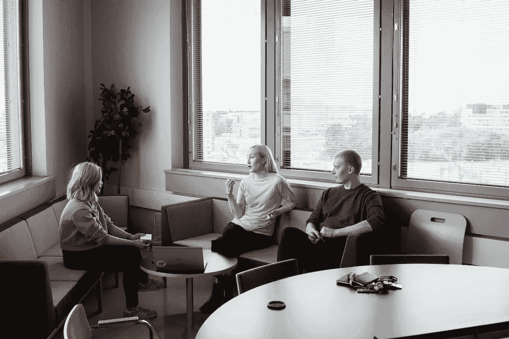
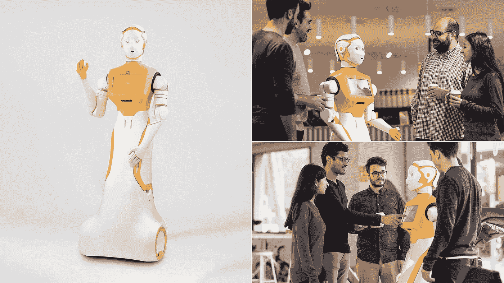
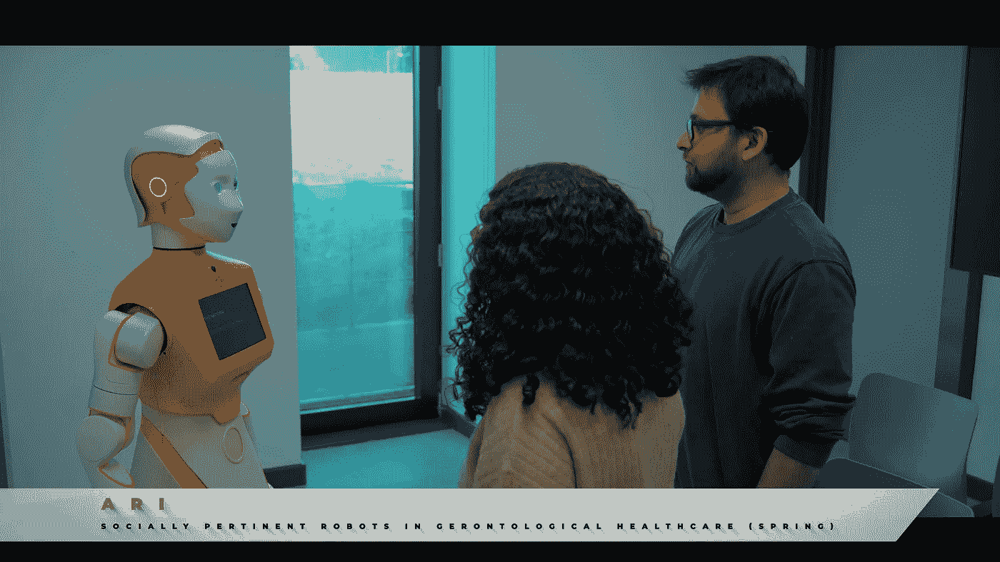
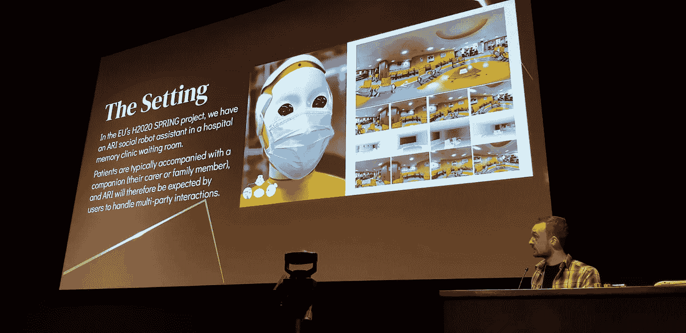

# 设计多方交互的对话代理

> 原文：[`towardsdatascience.com/designing-conversational-agents-for-multi-party-interactions-523b05ea8834?source=collection_archive---------15-----------------------#2023-04-06`](https://towardsdatascience.com/designing-conversational-agents-for-multi-party-interactions-523b05ea8834?source=collection_archive---------15-----------------------#2023-04-06)

## 多一个人如何影响对话？

[](https://addlesee.medium.com/?source=post_page-----523b05ea8834--------------------------------)[](https://towardsdatascience.com/?source=post_page-----523b05ea8834--------------------------------) [Angus Addlesee](https://addlesee.medium.com/?source=post_page-----523b05ea8834--------------------------------)

·

[关注](https://medium.com/m/signin?actionUrl=https%3A%2F%2Fmedium.com%2F_%2Fsubscribe%2Fuser%2F7f06284203ea&operation=register&redirect=https%3A%2F%2Ftowardsdatascience.com%2Fdesigning-conversational-agents-for-multi-party-interactions-523b05ea8834&user=Angus+Addlesee&userId=7f06284203ea&source=post_page-7f06284203ea----523b05ea8834---------------------post_header-----------) 发表在 [Towards Data Science](https://towardsdatascience.com/?source=post_page-----523b05ea8834--------------------------------) ·10 分钟阅读·2023 年 4 月 6 日[](https://medium.com/m/signin?actionUrl=https%3A%2F%2Fmedium.com%2F_%2Fvote%2Ftowards-data-science%2F523b05ea8834&operation=register&redirect=https%3A%2F%2Ftowardsdatascience.com%2Fdesigning-conversational-agents-for-multi-party-interactions-523b05ea8834&user=Angus+Addlesee&userId=7f06284203ea&source=-----523b05ea8834---------------------clap_footer-----------)

--

[](https://medium.com/m/signin?actionUrl=https%3A%2F%2Fmedium.com%2F_%2Fbookmark%2Fp%2F523b05ea8834&operation=register&redirect=https%3A%2F%2Ftowardsdatascience.com%2Fdesigning-conversational-agents-for-multi-party-interactions-523b05ea8834&source=-----523b05ea8834---------------------bookmark_footer-----------)

> *这是对在* [*IWSDS 2023*](https://sites.google.com/view/iwsds2023/home)*上发表的一篇论文的缩写。* [*我*](http://addlesee.co.uk/) *与赫瑞瓦特大学的* [*SPRING*](https://spring-h2020.eu/) *团队共同撰写了这篇论文，详细信息如下。如果您想引用本文中讨论的内容，请引用标题为“*[*面向社交机器人多方任务对话的数据收集*](https://drive.google.com/file/d/1gUsMOlYHDzreB17CYNFxDOu-dWCtBQ4M/view)*s”的论文：*

```py
**Harvard**:
Addlesee, A., Sieińska, W., Gunson, N., Garcia, D.H., Dondrup, C., Lemon, O., 2023\. Data Collection for Multi-party Task-based Dialogue in Social Robotics. Proceedings of the 13th International Workshop on Spoken Dialogue Systems Technology (IWSDS).**BibTeX**:
@inproceedings{addlesee2023data,
  title={Data Collection for Multi-party Task-based Dialogue in Social Robotics},
  author={Addlesee, Angus and Siei{\'n}ska, Weronika and Gunson, Nancie and Garcia, Daniel Hern{\'a}ndez and Dondrup, Christian and Lemon, Oliver},
  journal={Proceedings of the 13th International Workshop on Spoken Dialogue Systems Technology (IWSDS)},
  year={2023}
}
```

考虑与对话代理的互动，也许是你手机上的 Siri、家中的 Amazon Alexa，或者网站上的虚拟客户服务代理。这些互动是‘双方面的’，即它们只涉及一个人（你自己）和一个代理。这对于所有语音助手和基于聊天的代理来说都是典型的。

> *对话代理被设计用于一对一的互动。*


这两张照片展示了双方（对话式）互动。一张是有一个电话语音助手而不是一个人（左 [source](https://unsplash.com/photos/tugh5n8r8JQ)），另一张是（右 [source](https://unsplash.com/photos/_4qmlxHbX6I)）。

我们是社交动物，人们自然能够处理与不止一个其他人的对话。考虑与几个朋友一起喝咖啡、家庭晚餐对话，甚至是全体团队的工作会议。这些被称为‘多方’对话，而如今的对话代理并不为这种互动类型设计。

> *对话代理是否需要在多方设置中工作？多方对话是否带来了新的挑战？我们需要采取什么下一步措施来推进？我将在本文中回答这三个问题。*



多方互动。考虑这些对话与上述的双方对话有什么不同（左 [source](https://unsplash.com/photos/WY5kuE0R4-k)），（右 [source](https://unsplash.com/photos/34GZCgaVksk)）。

# 多方设置中的对话代理

如今的系统被设计用于处理双方互动，当然这是因为通常情况下我们就是这样与它们互动的。Siri 不会被动地听你与朋友的对话并在需要时插话——它会在激活时听取你的单一请求。Google Assistant 和 Alexa 也非常相似，监听它们的唤醒词和一个发言。可以说，这些语音助手在家庭环境中可能会从多方理解中受益，但这并不紧迫。

> *对话代理正在被嵌入到虚拟代理和公共场所如博物馆、机场、购物中心和医院的社交机器人中等……人们与家人、朋友和看护者一起去这些地方——所以这些代理必须能够处理多方互动。*

我将在本文中使用许多示例来说明观点，因此最好设定一下背景。让我们想象在医院记忆诊所候诊室中的一个机器人助手。这个机器人叫做 ARI，患者带着伴侣来进行预约。这个配对可能需要指引、咖啡、医院信息或只是一些娱乐。这正好是 EU [SPRING](https://spring-h2020.eu/) 项目的背景，所有示例都将符合这个背景。



多方设置中的 ARI 机器人。版权 [PAL Robotics](https://pal-robotics.com/)

# 多方对话真的如此不同吗？

考虑到上述医院环境，我们的互动中只有一个额外的人。所以，机器人不仅要与患者互动，还必须同时与患者和陪伴者互动。这会改变对话吗？剧透：会的，变化很大！

## 说话人识别

在两人对话中，代理不需要识别说话者。这是微不足道的，因为说话者是对话中唯一的其他人。Alexa 有一个很棒的功能，只有在它识别到我的声音时才允许我购买物品——但这不是我所说的说话人识别。这是否标记为说话者 1、说话者 2 还是说话者 xyz 都无关紧要——对话代理的回应将是一样的。

然而，识别说话者对于理解多方对话至关重要。让我们假设患者和陪伴者想与机器人玩一个测验。机器人问“德国的首都是什么？”然后是以下互动：

```py
1) I think it is Berlin.
2) Or Munich.
3) Yes, Munich.
```

没有说话者识别，我们无法确定这两个人是否达成了一致。有多个选项，让我们看看其中两个（P = 患者，C = 陪伴者）：

```py
1) P: I think it is Berlin.
2) P: Or Munich.
3) C: Yes, Munich.
```

在这个 PPC 案例中，患者和陪伴者已经达成一致，答案是慕尼黑。然后机器人可以告诉他们答案是错误的，告知他们正确答案，并继续下一个问题。或者：

```py
1) P: I think it is Berlin.
2) C: Or Munich.
3) C: Yes, Munich.
```

在这个 PCC 案例中，患者提出了正确答案，而陪伴者则建议了第二个错误选项。陪伴者随后再次确认他们的确定性，但重要的是，患者**没有**同意。如果机器人在这种情况下将慕尼黑作为最终答案，患者会非常沮丧，因为他们提出了正确答案却被忽视了。

希望这个例子很清楚。在 PPC（或 PCP）案例中，一致意见已经达成，继续测验是正确的行动。在 PCC 案例中，机器人应该保持沉默，等待患者的回应。

> *对话代理只有在识别到说话者时才能知道哪个行动是正确的。这在两人对话中并不成立。*

## 收件人识别

与说话人识别类似，弄清楚谁在被说话者讲述在两人对话中也很简单。说话者显然是在对第二个人/代理讲话。然而，这在多方对话中并非如此。说话者可能在对一个个体、另一个个体或两者同时讲话。为了说明这一点，请考虑（其中 R = 机器人，P = 患者）：

```py
1) P: What is my appointment about?
2) R: For your privacy, I don't know that, sorry.
3) P: What's my appointment about?
4) R: For your privacy, I don't know that, sorry.
5) P: Stop!
```

在这个例子中，病人在第 1 回合时最初向机器人提问。机器人随后作出了正确的回应。然而，在第 3 回合时，病人转向他们的伴侣并重复了相同的问题。由于机器人没有地址识别能力，它再次做出了相同的回应，这让病人感到沮丧。



在赫瑞瓦特大学测试的用于 SPRING 的 ARI 机器人

## 回应选择或生成

决定虚拟代理应该如何回应用户是很困难的，这对二人对话和多方对话都是如此（不同于最后两个任务）。在多方环境中尤为具有挑战性，因为你的代理必须决定向谁发言。例如，机器人的回应会因其面对的是个人还是所有人而有所不同。我将再次说明这一点：

```py
1) P: I would like a coffee.
2) C: and I desperately need the toilet.
3) R: ???
```

机器人可能会决定首先向病人发言，因为他们在伴侣之前请求了帮助。然而，由于紧急情况，机器人也可能决定优先考虑伴侣。接下来机器人说什么取决于它决定向谁发言。

> *上述三个任务（说话人识别、收件人识别和回应选择/生成）在文献中统称为“谁对谁说了什么？”。这是当前研究的重点。在我们的论文中，我们强调了多方代理的另外两个重要任务。*

## 对话状态跟踪

在对话的上下文中理解每个用户发言的要点是很重要的。对话状态跟踪（DST）正是要做到这一点，并面临如 DSTC 和 MultiWoZ 这样的挑战。许多研究机构和公司为此任务分配了资源，但所有的数据集都是二人对话的。再次强调，DST 在多方环境中有所不同。

当前的 DST 模型可以输出用户请求特定信息、确认某事、提供信息等……但它们不能检测到同意或确定请求是否已被满足，因为这在二人对话中不会发生。例如：

```py
1) P: Where is the lift
2) P: It is to the left of the reception
```

这种情况在二人对话中永远不会发生。一个人问一个问题然后立刻自己回答是不合逻辑的。然而，发言 2 可能由伴侣说出，机器人必须跟踪伴侣向病人提供了信息。

## 目标跟踪

最后，在多方环境中跟踪人们的目标也更加困难。类似于 DST 的差异，人们可以回答彼此的目标，而这种情况在二人对话中不会发生。代理必须能够确定用户目标是否被*准确*满足，以免重复刚刚回答者所说的内容。然而，如果回答者的回答是不正确的，机器人仍然需要回应，因为目标尚未完成。

另一个主要的目标跟踪差异是我们人类非常擅长的——确定人们是否有共同的目标。如果两个人进咖啡馆点咖啡，咖啡师的互动方式会根据这是否是两个人分别点咖啡还是两个人一起点咖啡而有所不同。


两个人点咖啡 ([来源](https://unsplash.com/photos/f7zm5TDOi4g))

在上图中，这两个人可能是分开点餐或一起点餐。在后一种情况下，咖啡师可能会说“你们一起付款吗？”，但如果这两个人互不相识，这会显得很奇怪。

人们可以非常明确地表明共同目标（例如，“我们想要……”，“我儿子需要……”，或“我也是”）。但我们假设当人们接续彼此的句子（分裂话语）时，目标是共享的。例如：

```py
1) P: Whaere is the cafe?
2) C: because we are very hungry.
```

从上述两个话语中，我们可以推测这两个人有共同的目标。这在双人互动中不会发生。

> *我希望我已经说服了你们，多方互动与双人互动有很大的不同，它们包含了许多额外的挑战，如果我们要在公共空间中拥有自然互动的代理，必须解决这些问题。*

# 我们如何进展？

由于该领域的大多数研究集中在双人互动上，适合的数据非常有限，且没有具有 DST 或目标跟踪注释的数据。为了在多方环境中训练系统执行上述任务，我们必须收集数据。我们——SPRING 项目——正在医院记忆诊所中使用 ARI 机器人收集多方对话。



我在[论文](https://drive.google.com/file/d/1gUsMOlYHDzreB17CYNFxDOu-dWCtBQ4M/view)中展示了我们在洛杉矶[IWSDS 2023](https://sites.google.com/view/iwsds2023/home)会议上使用的 ARI 机器人用于数据收集的情况。

访问医院记忆诊所的患者及其陪同者会被提供带有不同目标的角色扮演场景。为了收集具有上述各种挑战的对话，我们设计了六种条件。我写这篇文章时，第三轮数据收集正在进行中！

我在[论文](https://drive.google.com/file/d/1gUsMOlYHDzreB17CYNFxDOu-dWCtBQ4M/view)中提供了更多细节，但六种条件如下：

## 有帮助的陪同者

患者有一个目标，但陪同者只是被告知要协助患者。他们必须与机器人互动以完成这些目标（例如，获取咖啡，了解咖啡馆何时关门等）。 

这个条件是我们期望的典型互动方式。患者可能需要某些东西，但陪同者自己没有目标。

## 共享目标

如上节的目标跟踪部分所讨论的，有时人们有共同的目标。在这种情况下，病人和陪同者会被分配相同的目标，例如，他们都可能想吃午餐。这与“有帮助的陪同者”条件仅有些微不同，但初步观察表明在这种条件下会出现更多的分裂性话语。

## 不情愿的病人

访问医院的人可能会因为过于害羞（或甚至过于担忧）而不直接与机器人对话。在这种情况下，病人有一个目标，但他们不会直接与机器人交谈。因此，陪同者必须作为病人和机器人之间的中介，以完成病人的目标。

## 不同的目标

人们并不总是有相同的目标。例如，病人可能想要一杯咖啡，而陪同者则需要使用洗手间。在这种情况下，病人和陪同者会被分配不同的目标。

## 缺失信息

如前所述，机器人由于隐私原因不能总是回答问题。例如，机器人不能从伦理上透露病人为什么来医院。此外，机器人不能对病人进行面部识别以确认身份。在这种情况下，陪同者会得到一些机器人无法知道的缺失信息。陪同者必须向机器人提供这些信息，以实现病人的目标。由于这很难解释，这里举个例子：

```py
1) P: Where is my appointment?
2) R: Sorry, I don't have access to that information.
3) C: It's with Dr Smith
4) R: Dr Smith is in room 17.
```

如你所见，病人的目标是找到他们的预约地点。陪同者被提供了有关预约医生的额外信息。

## 不一致：

最后，多方互动可能涉及分歧。如果机器人提供了咖啡机的位置，陪同者可能会不同意。在这种情况下，病人会有一个目标，而陪同者则拥有与机器人信息相矛盾的额外信息。机器人应该能够识别冲突，重新提供正确的信息，并向参与者保证信息是正确的。

你可以在[这里](https://drive.google.com/file/d/1gUsMOlYHDzreB17CYNFxDOu-dWCtBQ4M/view)找到带有引文的完整论文，你可以通过[Medium](https://medium.com/@addlesee)、[Twitter](https://twitter.com/Addlesee_AI)或[LinkedIn](https://www.linkedin.com/in/angusaddlesee/)联系[我](http://addlesee.co.uk/)。
