# 使用 AI 和计算机视觉检测癌症增长

> 原文：[`towardsdatascience.com/detecting-cancer-growth-using-ai-and-computer-vision-c88e985f450e`](https://towardsdatascience.com/detecting-cancer-growth-using-ai-and-computer-vision-c88e985f450e)

## AI 为社会带来的好处：医学影像中的应用

 [Sarang Gupta](https://medium.com/@saranggupta94?source=post_page-----c88e985f450e--------------------------------)

·发表于 [Towards Data Science](https://towardsdatascience.com/?source=post_page-----c88e985f450e--------------------------------) ·9 分钟阅读·2023 年 6 月 15 日

--

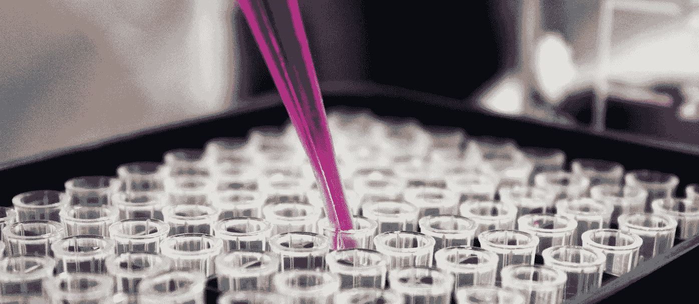

封面图片来自 [unsplash.com](https://unsplash.com/photos/pwcKF7L4-no)

# 介绍

乳腺癌是女性中最致命的癌症之一。根据[世界卫生组织 (WHO)](https://www.who.int/news-room/fact-sheets/detail/breast-cancer)，仅在 2020 年，全球就诊断出约 230 万例侵袭性乳腺癌，导致 68.5 万人死亡。

尽管发展中国家占所有乳腺癌病例的一半，但它们占乳腺癌死亡人数的 62%。乳腺癌在诊断后至少存活 5 年的几率从高收入国家的[90% 到印度的 66% 和南非的 40%](https://www.who.int/news-room/fact-sheets/detail/breast-cancer)。

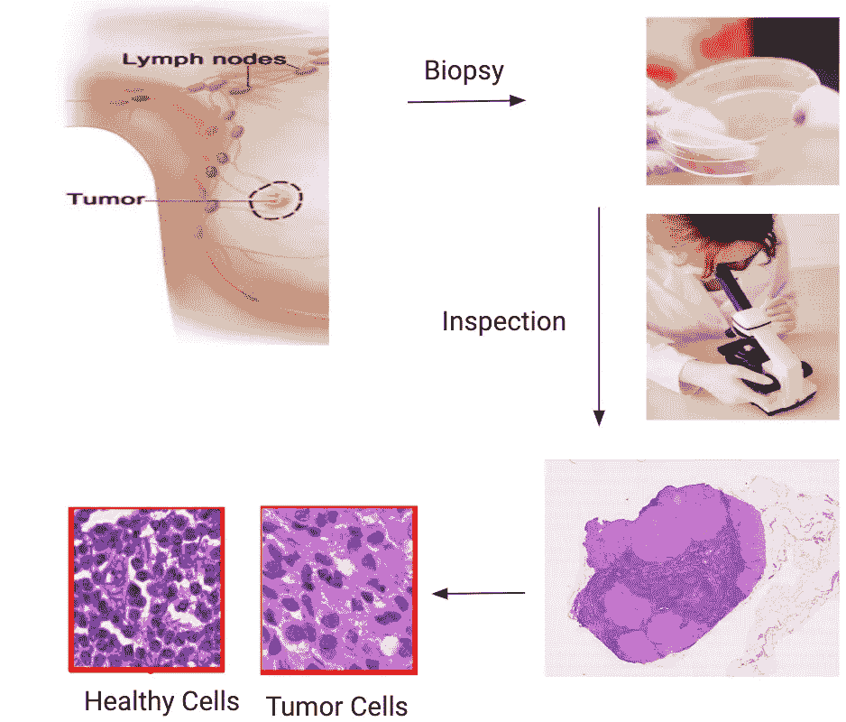

图 1：病理学家进行乳腺癌转移检测的各个步骤 | 左上：来自 [Camelyon17 challenge](https://camelyon17.grand-challenge.org/Background/) 的图像 | 右上：来自 [unsplash.com](https://unsplash.com/photos/tGYrlchfObE?utm_source=unsplash&utm_medium=referral&utm_content=creditShareLink) 的图像 | 中央：来自 [unsplash.com](https://unsplash.com/photos/bHNUueWud9c) 的图像 | 左下和右下：作者提供的图像

确定癌症处于哪个阶段的一个关键步骤是通过显微镜检查邻近乳腺的淋巴结，以了解癌症是否[转移](https://en.wikipedia.org/wiki/Metastasis)（医学术语，意为扩散到身体的其他部位）。这个步骤不仅敏感、耗时且劳动密集，还需要高技能的医学病理学家。它影响与治疗相关的决策，包括放疗、化疗和可能的更多淋巴结切除。

随着 AI 和计算机视觉技术的发展，特别是卷积神经网络（CNNs）的进步，我们已经能够提高在图像识别、目标检测和分割等各种计算机视觉任务中的准确性。这些进步在解决一些最具挑战性的医疗问题方面非常有帮助，尤其是在医疗设施有限的地区。

基于此，本文将介绍一个利用最先进的 CNNs 和计算机视觉技术的框架，帮助检测淋巴结中的转移。一个成功的解决方案有望减轻病理学工作的负担，同时减少诊断中的主观性。

# 方法论和方法

给定一张[全切片图像](https://www.ncbi.nlm.nih.gov/pmc/articles/PMC7522141/)的淋巴结切片，我们的目标是生成一个*掩模*，标识切片中潜在的癌变区域（肿瘤细胞）。图 2 展示了一个例子，图中显示了切片上的组织图像以及一个掩模，其中黄色区域表示组织中癌变的区域。

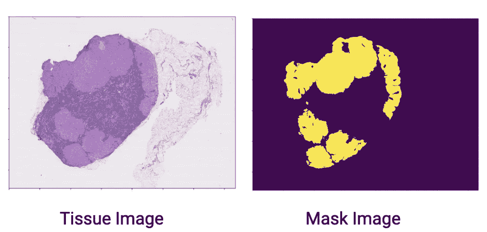

图 2：左：数据集中的 WSI | 右：二值掩模，黄色区域表示癌变区域 — 图片由作者提供

[图像分割](https://en.wikipedia.org/wiki/Image_segmentation)是经典的计算机视觉任务之一，其目标是训练神经网络输出图像的像素级掩模（类似于图 2 中的掩模）。有多种深度学习技术可用于图像分割，这些技术在[这篇](https://arxiv.org/pdf/1907.06119.pdf)论文中有详细描述。谷歌的[TensorFlow](https://www.tensorflow.org/)也提供了一个很好的[教程](https://arxiv.org/pdf/1907.06119.pdf)，使用编码器-解码器方法进行图像分割。

我们将把这个问题视为一个[二分类](https://en.wikipedia.org/wiki/Binary_classification#:~:text=Binary%20classification%20is%20the%20task,basis%20of%20a%20classification%20rule.)问题，而不是使用常用于图像分割问题的编码器-解码器方法，其中每个自定义定义的区域都通过神经网络分类为健康或肿瘤区域。这些全切片图像的单独区域可以拼接在一起形成所需的掩模。

我们将使用标准的 ML 过程来构建 CV 模型：

**数据收集 → 预处理 → 训练-测试拆分 → 模型选择 → 微调与训练 → 评估**

# 数据收集与预处理

数据集来源于 [CAMELYON16 Challenge](https://camelyon16.grand-challenge.org/Data/)，根据 [挑战网站](https://camelyon16.grand-challenge.org/Data/) *包含了来自* [*Radboud University Medical Center*](https://www.radboudumc.nl/en/patient-care) *(荷兰奈梅亨) 和* [*University Medical Center Utrecht*](https://www.umcutrecht.nl/en/)*（荷兰乌特勒支）的 400 张全切片图像（WSI）。*

> 整张幻灯片图像以多分辨率金字塔结构存储，每个图像文件包含多个下采样版本的原始图像。金字塔中的每个图像都以一系列瓷砖的形式存储，以便快速检索图像的子区域（参见图 3 以获取说明）。

有关全切片成像的更多信息，请参见 [这里](https://www.mbfbioscience.com/whole-slide-imaging)。

幻灯片的真实标签提供为 WSI 二进制掩模，指示幻灯片中含有肿瘤细胞的区域（参见上图 2 作为示例）。

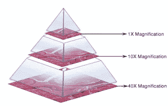

图 3：全切片图像（WSI）中不同放大级别的说明。图像来源于 [`camelyon16.grand-challenge.org/Data/`](https://camelyon16.grand-challenge.org/Data/)

我们数据集中 WSIs 有 8 个缩放级别，允许我们将图像从 1x 放大到 40x。级别 0 被认为是最高分辨率（40x），级别 7 是最低分辨率（1x）。

由于其庞大的尺寸（我们数据集中每个 WSI 的大小都超过 2GB），标准的图像工具无法将其读取并压缩到系统 RAM 中。我们使用了 [OpenSlide](https://openslide.org/) 库在 Python 中的实现来高效地读取数据集中的图像，并提供了跨不同缩放级别导航的接口。

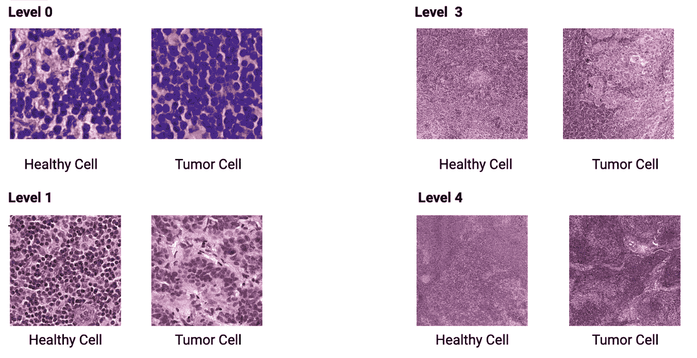

图 4 - 作者提供的图像

在包含 400 张 WSI 的整个数据集上训练 CNN 计算开销非常大（想象一下在 2 x 400 = 800GB 数据集上训练）。我们使用了 [Google Collab](https://colab.research.google.com/) 的免费版，但 GPU 支持有限。因此，我们从数据集中随机抽取了 22 张 WSI。起初，22 张图像可能看起来像是一个较小的数据集，难以准确训练卷积神经网络，但正如我之前提到的，我们从这些庞大的 WSI 中提取小补丁，并将每个补丁视为可以用于训练我们模型的独立图像，如图 5 所示。

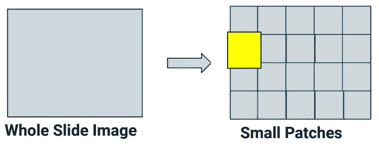

图 5：每个 WSI 进一步拆分为更小的补丁以增强数据集 — 作者提供的图像

在最高的缩放级别（级别 0 = 40 倍缩放）下，每张图像的尺寸大约为 62000 x 54000 像素——提取 299 x 299 大小的补丁将从每个 WSI 中提供约 35,000 张单独的图像。我们从每个缩放级别提取补丁。随着缩放级别的增加，分辨率降低，我们可以从 WSI 中提取的补丁数量也减少。在级别 7 时，我们每张图像只能提取少于 200 个补丁。

此外，每个 WSI 有很多空白区域，其中没有组织细胞。为了保持数据的准确性，我们避免了组织细胞不足 30%的补丁，这些是通过对灰色区域的密集计算得到的。

数据集被**平衡**为大约包含相同数量的健康和肿瘤细胞的补丁。在这个最终数据集上进行了**80–20 的训练-测试分割**。

# 模型训练

我们构建了**多个 CNN 模型**，这些模型在使用前一节中描述的机制生成的图像补丁上进行了训练。

## 目标函数

我们的主要优化目标是[sensitivity and recall](https://developers.google.com/machine-learning/crash-course/classification/precision-and-recall#:~:text=Recall%20attempts%20to%20answer%20the,has%20a%20recall%20of%201.0.)，但我们也密切监控[接收器工作特征曲线（ROC）的曲线下面积（AUC）](https://www.analyticsvidhya.com/blog/2020/06/auc-roc-curve-machine-learning/#:~:text=The%20Area%20Under%20the%20Curve,the%20positive%20and%20negative%20classes.)，以确保我们不会产生过多的假阳性。

在癌症检测的背景下，最重要的是最小化假阴性的数量，即模型错误地将癌症样本分类为非癌症样本的实例。假阴性的数量过高可能会延迟真正患有癌症患者的诊断和治疗。灵敏度（或召回率）衡量的是实际阳性样本被正确识别的比例，通过优化高召回率，我们旨在正确识别尽可能多的实际阳性病例。

然而，单纯关注灵敏度可能导致模型将大多数样本预测为阳性，从而增加假阳性的数量（将非癌症样本错误分类为癌症样本）。这是不理想的，因为它可能导致不必要的医疗干预，并引起患者的不必要焦虑。这就是监控 AUC-ROC 变得极其重要的地方。

## 模型构建

我们从构建**基线**模型开始，该模型是一个非常简单的架构，由 2 个 [卷积层](https://www.databricks.com/glossary/convolutional-layer) 和 [最大池化](https://medium.com/codex/what-is-max-polling-in-cnn-is-it-useful-to-use-6f2d6ff44c6) 以及 [dropout 正则化](https://machinelearningmastery.com/dropout-for-regularizing-deep-neural-networks/) 组成。为了改进基线，我们在我们的数据集上微调了先进的图像识别模型，如 [VGG16](https://arxiv.org/abs/1409.1556) 和 [Inception v3](https://www.mathworks.com/help/deeplearning/ref/inceptionv3.html)。

由于我们有不同缩放级别的图像，我们**训练了多个模型**，每个模型使用来自一个缩放级别的图像，以查看在特定缩放级别查看图像是否能提升网络性能。由于在较低缩放级别提取的补丁数量有限——这些缩放级别的 3、4、5 张图像被合并为一个训练集。针对 0、1 和 2 缩放级别的图像分别构建了单独的模型。

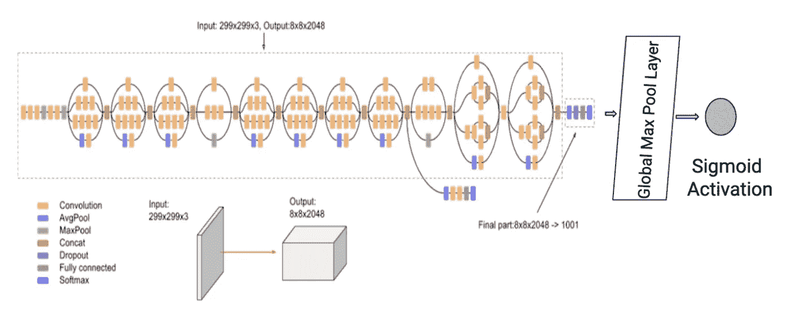

图 6：标准 Inception v3 模型附加了全局最大池化层和 Sigmoid 激活。Inception v3 图像来源：[`cloud.google.com/tpu/docs/inception-v3-advanced`](https://cloud.google.com/tpu/docs/inception-v3-advanced)

有趣的是，表现最佳的模型是预训练的 Inception v3 模型，使用了 [ImageNet](http://www.image-net.org/) 权重，并添加了一个 [全局最大池化](https://machinelearningmastery.com/pooling-layers-for-convolutional-neural-networks/) 层（见图 6）。[Sigmoid 激活](https://en.wikipedia.org/wiki/Sigmoid_function) 函数将任何范围的实数压缩到 0 和 1 之间。这在我们的场景中特别有用，因为我们希望将预测映射到两个类别（0 和 1）的概率上。

## 模型配置

我们进行了交叉验证，以确定模型的最佳超参数。下面展示了我们增强版 ImageNet v3 的最终配置，包括所用的优化器、学习率、rho、训练轮次和批量大小。通过使用类别权重，我们增强了模型对少数类（肿瘤病例）的关注，提高了其正确识别和诊断癌症病例的能力，这是在这个关键健康背景下的基本要求。

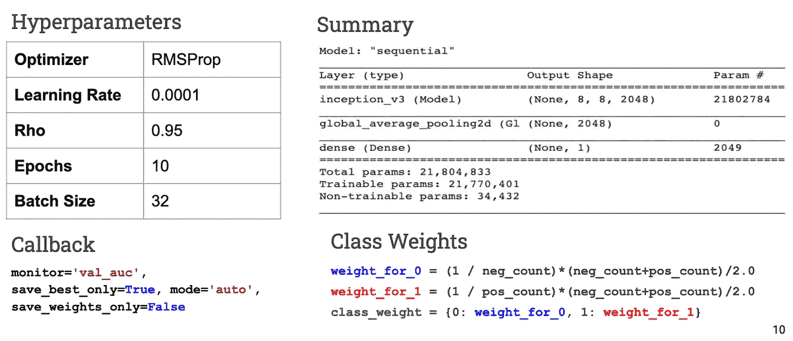

图 7：模型配置和超参数——图像由作者提供

## 模型评估

我们查看了不同超参数的训练运行的损失、AUC 和召回率，并在不同缩放级别上取样了图像补丁。

如前所述，在 3、4、5 个缩放级别下的图像被合并为一个训练集，并为 0、1 和 2 个缩放级别的图像建立了不同的模型。下面的图表显示了不同缩放级别在验证集上的表现。根据修改后的 Imagenet v3，缩放级别 1 的 AUC 和召回率表现最佳。

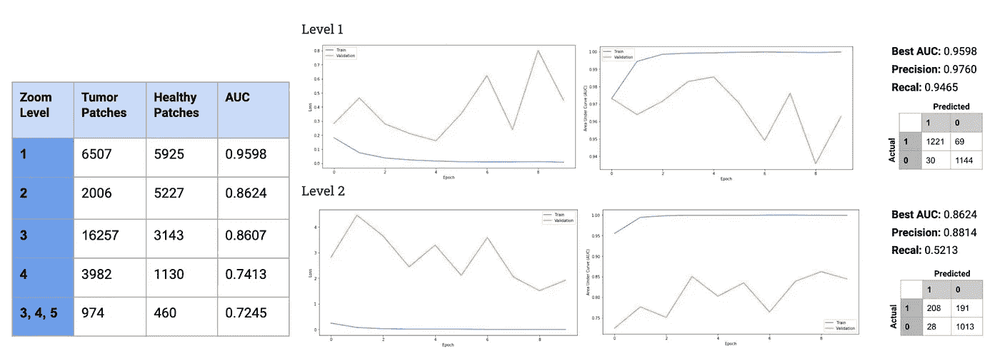

图 8：最终微调模型的配置和性能 — 作者提供的图片

# 推理

一旦模型经过微调，我们可以使用它为任何新的全切片图像生成“掩模”。为此，我们首先需要从感兴趣的缩放级别（第 1 级或第 2 级）生成 299 x 299 分辨率（标准 Imagenet v3 架构的输入大小）的图像块。

这些单独的图像随后会通过经过微调的模型进行分类，判断每张图像是否包含肿瘤细胞或非肿瘤细胞。然后将这些图像拼接在一起以生成掩模。

这里展示了我们测试集中的两个全切片图像的输出结果和实际掩模。正如你所见，我们模型输出的掩模与实际掩模相当相似。

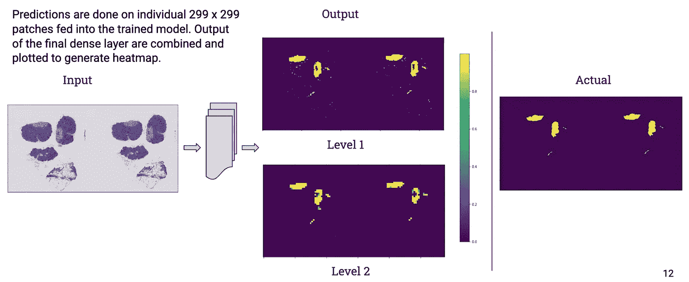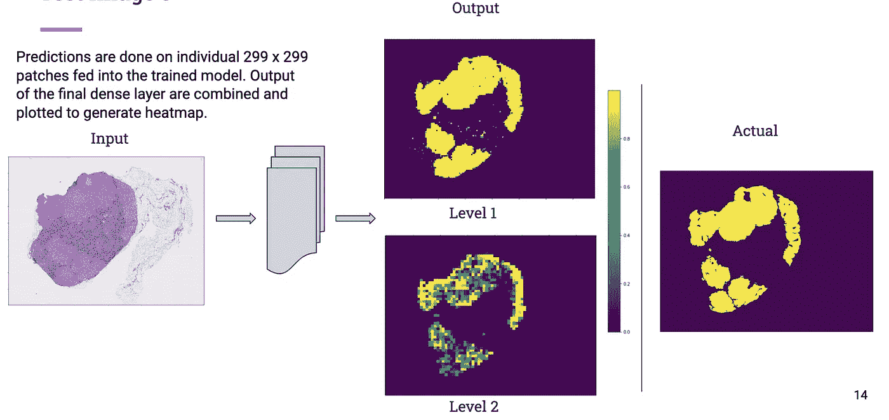

图 9：模型在测试集中的几张图像上的结果 — 作者提供的图片

# 总结

在这篇文章中，我们探讨了计算机视觉模型如何通过微调来检测 gigapixel 病理图像中的癌症转移。下面的图像总结了模型训练的工作流程和分类新图像的推理过程。

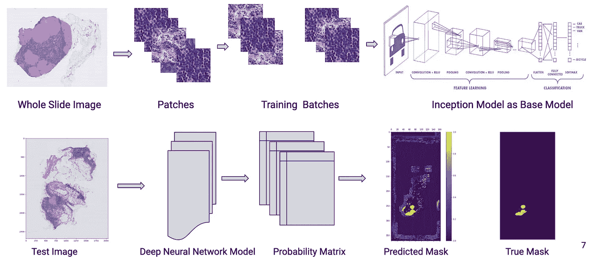

图 9：训练和推理工作流程的总结 — 作者提供的图片

将该模型整合到现有的病理学家工作流程中，可以作为辅助工具，特别是在资源有限的机构中具有很高的临床相关性，也可以作为及时诊断潜在疾病的第一道防线。

需要进一步工作来评估对实际临床工作流程和患者结果的影响。尽管如此，我们对经过细致验证的深度学习技术与精心设计的临床工具的积极前景保持乐观，这些技术和工具有可能提升全球病理诊断的精准度和可及性。

*请查看我在 Github 上的源代码：* [*https://github.com/saranggupta94/detecting_cancer_metastasis*](https://github.com/saranggupta94/detecting_cancer_metastasis/tree/master)*.*

*你可以在这里找到 CAMELYON 竞赛的最终结果：* [*https://jamanetwork.com/journals/jama/article-abstract/2665774*](https://jamanetwork.com/journals/jama/article-abstract/2665774)

*如果你对合作项目感兴趣或想要联系我，可以随时通过* [*LinkedIn*](https://www.linkedin.com/in/sarang-gupta/) *与我联系，或者发邮件至 saranggupta94@gmail.com。*

*感谢* [*Niti Jain*](https://www.linkedin.com/in/niti--jain/) *对本文的贡献。*
