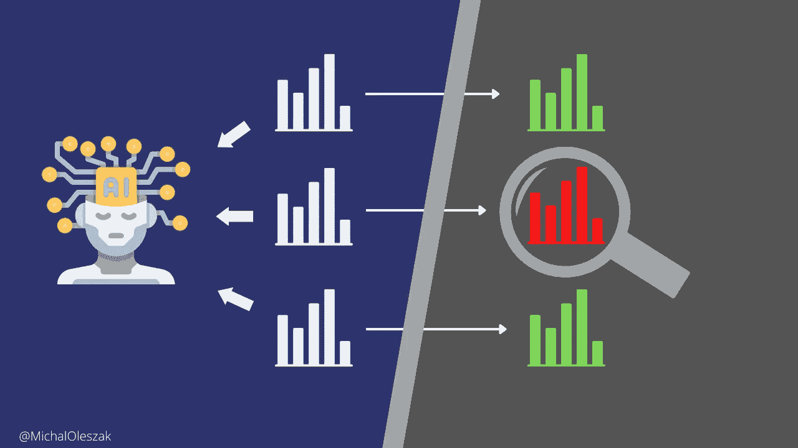

# 检测协变量漂移：多变量方法指南

> 原文：[`towardsdatascience.com/detecting-covariate-shift-a-guide-to-the-multivariate-approach-c099bd1891b9?source=collection_archive---------6-----------------------#2023-01-17`](https://towardsdatascience.com/detecting-covariate-shift-a-guide-to-the-multivariate-approach-c099bd1891b9?source=collection_archive---------6-----------------------#2023-01-17)

## MLOps

## 传统的 PCA 可以在生产数据分布发生变化时提醒你

 [Michał Oleszak](https://michaloleszak.medium.com/?source=post_page-----c099bd1891b9--------------------------------)

·

[关注](https://medium.com/m/signin?actionUrl=https%3A%2F%2Fmedium.com%2F_%2Fsubscribe%2Fuser%2Fc58320fab2a8&operation=register&redirect=https%3A%2F%2Ftowardsdatascience.com%2Fdetecting-covariate-shift-a-guide-to-the-multivariate-approach-c099bd1891b9&user=Micha%C5%82+Oleszak&userId=c58320fab2a8&source=post_page-c58320fab2a8----c099bd1891b9---------------------post_header-----------) 发表在 [Towards Data Science](https://towardsdatascience.com/?source=post_page-----c099bd1891b9--------------------------------) ·16 分钟阅读·2023 年 1 月 17 日

--

任何机器学习模型的**最终目的**是为其拥有者带来价值。通常，这种价值体现在算法比人类做事更好或更快（或两者兼备）。开发和部署模型的投资成本往往很高。为了偿还这些成本，模型需要在生产中提供足够长时间的价值。这可能会受到协变量偏移的阻碍，这是一种使生产中的模型随着时间推移而退化的现象。让我们深入探讨如何检测它，以及为什么流行的简单方法通常不够有效。

# 引入协变量偏移

[协变量偏移](https://medium.com/towards-data-science/dont-let-your-model-s-quality-drift-away-53d2f7899c09)是指在生产中，模型的输入特征分布与模型在训练和验证过程中看到的分布发生变化的情况。

> 协变量偏移是训练数据和生产数据之间模型输入分布的变化。

在大多数应用中，协变量偏移发生通常只是时间问题。如果你在建模你的……
