# 使用 Python 检测实际数据中的幂律

> 原文：[`towardsdatascience.com/detecting-power-laws-in-real-world-data-with-python-b464190fade6`](https://towardsdatascience.com/detecting-power-laws-in-real-world-data-with-python-b464190fade6)

## 详细解析基于最大似然的方法，并附示例代码

[](https://shawhin.medium.com/?source=post_page-----b464190fade6--------------------------------)[](https://towardsdatascience.com/?source=post_page-----b464190fade6--------------------------------) [Shaw Talebi](https://shawhin.medium.com/?source=post_page-----b464190fade6--------------------------------)

·发表在[Towards Data Science](https://towardsdatascience.com/?source=post_page-----b464190fade6--------------------------------) ·10 分钟阅读·2023 年 11 月 24 日

--


图片由[Luke Chesser](https://unsplash.com/@lukechesser?utm_source=medium&utm_medium=referral)拍摄，来源于[Unsplash](https://unsplash.com/?utm_source=medium&utm_medium=referral)

这是关于幂律和厚尾的系列文章中的第二篇。在上一篇文章中，我提供了对幂律的[初学者友好介绍](https://medium.com/towards-data-science/pareto-power-laws-and-fat-tails-0355a187ee6a)，并提出了我们在分析这些幂律时标准统计工具存在的 3 个问题。虽然意识到这些问题可以帮助我们避免它们，但在实际操作中，如何判断某些数据遵循什么分布并不总是清楚。在这篇文章中，我将描述如何客观地从实际数据中检测幂律，并分享一个社会媒体数据的具体例子。

*注意：如果你对幂律分布或厚尾等术语不熟悉，请参考本系列的* [*第一篇文章*](https://medium.com/towards-data-science/pareto-power-laws-and-fat-tails-0355a187ee6a) *作为入门指南。*

# 幂律打破统计学基础

在[上一篇文章](https://medium.com/towards-data-science/pareto-power-laws-and-fat-tails-0355a187ee6a)中，我们重点讨论了两种分布：高斯分布和幂律分布。我们发现这些分布具有截然相反的统计属性。即，**幂律由稀有事件驱动，而高斯分布则不是**。

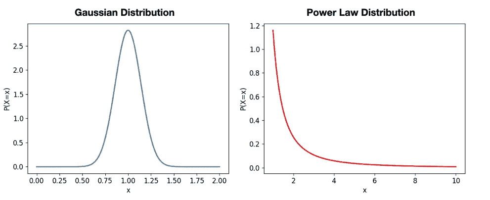

示例高斯分布和幂律分布。图片由作者提供

这种稀有事件驱动的特性引发了 3 个问题 ，这些问题影响了我们许多喜欢的统计工具（例如均值、标准差、回归等）在分析幂律时的应用。总结是，如果数据呈现高斯型，可以使用回归和计算期望值等常见方法而无需担忧。然而，如果数据更**类似于幂律**，**这些技术可能会给出不正确和误导性的结果**。

我们还看到了第三种（更顽皮的）分布，它可能既类似于高斯分布，又类似于幂律（尽管它们具有相反的特性），称为**对数正态分布**。

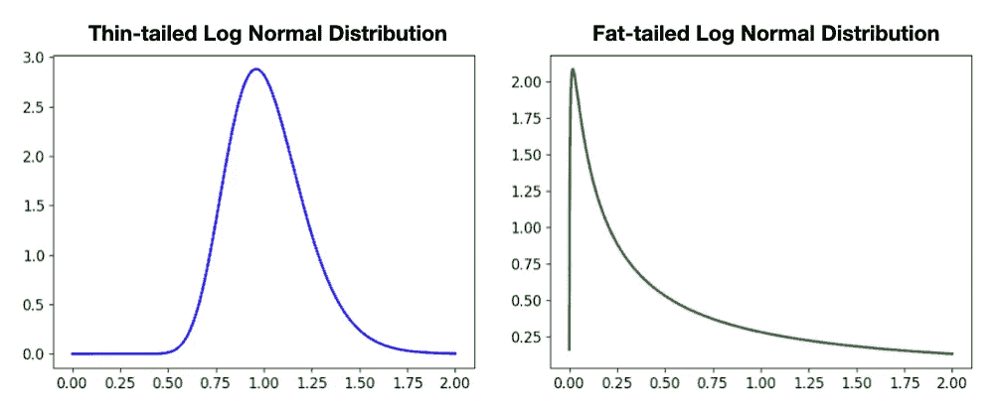

（顽皮的）对数正态分布看起来既类似于高斯分布又类似于幂律。图像由作者提供。

这种模糊性给从业者在决定*最佳*分析方法时带来了挑战。为了帮助克服这些挑战，确定数据是否适合幂律、对数正态分布或其他类型的分布可能是有利的。

# **对数-对数方法**

一种流行的将幂律拟合到现实世界数据中的方法是我称之为“对数-对数方法”[1]。这个想法来自于**对幂律概率密度函数（PDF）取对数**，如下所推导。

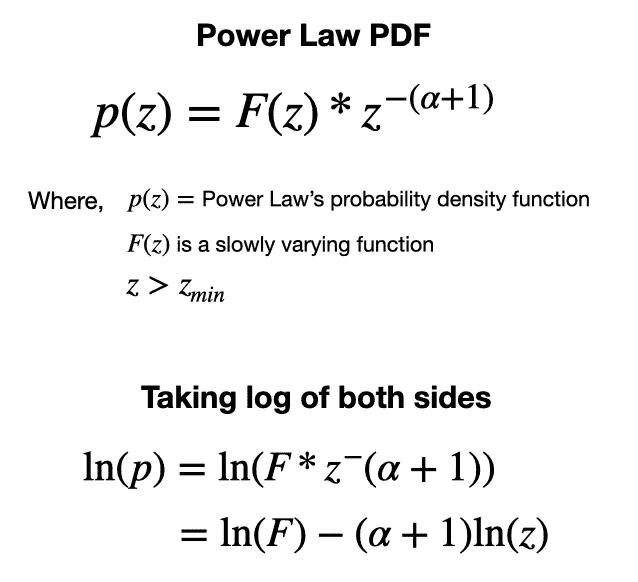

对幂律概率分布函数取对数[2]。图像由作者提供。

上述推导将幂律的 PDF 定义转化为线性方程，如下图所示。

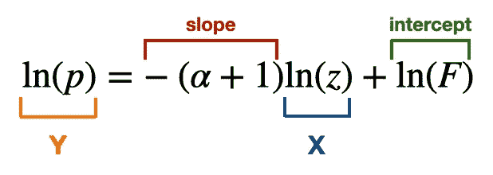

突出显示对数（PDF）的线性形式。图像由作者提供。

这意味着**遵循幂律的数据的直方图将遵循一条直线**。在实践中，这看起来是为某些数据生成直方图并将其绘制在对数-对数图上[1]。人们可能会更进一步，进行线性回归以估计分布的α值（这里，α = -m+1）。

然而，这种方法存在显著的局限性。这些局限性在参考文献[1]中进行了描述，并在下文中总结。

+   斜率（因此α）估计会受到系统误差的影响。

+   回归误差可能很难估计。

+   即使分布不遵循幂律，拟合效果也可能看起来很好。

+   拟合可能不符合概率分布的基本条件，例如归一化。

# **最大似然方法**

虽然对数-对数方法简单易行，但其局限性使得它不够理想。相反，我们可以转向更具数学依据的方法，即**最大似然**，这是一种广泛使用的统计**方法，用于推断给定数据的*最佳*模型参数**。

最大似然包含两个关键步骤。**步骤 1**：获得似然函数。**步骤 2**：最大化与模型参数相关的似然。

## **步骤 1：编写似然函数**

**似然**是一种特殊类型的概率。简单来说，它**量化了在特定模型下我们的数据的概率**。我们可以将其表示为所有观测数据的联合概率 [3]。在 Pareto 分布的情况下，我们可以这样写。

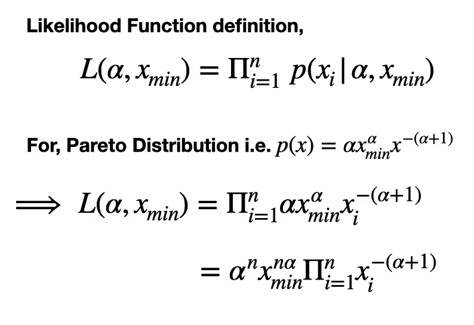

Pareto 分布的似然函数（即一种特殊类型的幂律） [4]。***注意****：在处理似然函数时，观测值（即 x_i）是固定的，而模型参数是变化的。* 作者提供的图像。

为了让最大化似然稍微容易一点，通常使用对数似然（它们由相同的α值最大化）。

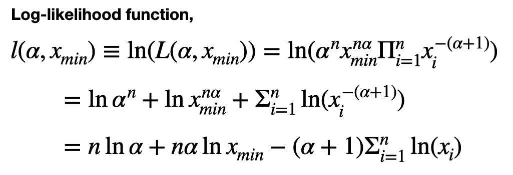

对数似然推导 [4]。作者提供的图像。

## **步骤 2：最大化似然**

拥有（对数）似然函数后，我们现在可以将确定最佳参数选择的任务框定为优化问题。为了根据我们的数据找到最佳的α值，这归结为将关于α的*l(α)*的导数设置为零，然后求解α。以下是推导过程。

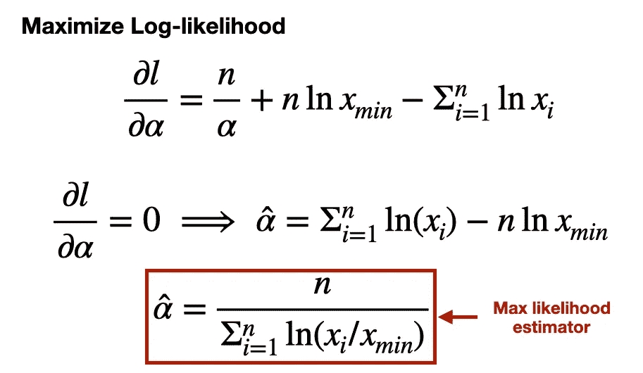

最大似然估计器的推导 [4]。作者提供的图像。

这为我们提供了所谓的**最大似然估计器**来估计α值。有了它，我们可以插入观测值 x 来估计 Pareto 分布的α值。

理论基础确定后，让我们看看这在应用于实际数据（来自我的社交媒体账户）时的效果。

# **示例代码：拟合社交媒体数据中的幂律**

一个存在胖尾数据的领域是社交媒体。例如，一小部分创作者获得了大部分关注，少数 Medium 博客获得了大多数阅读，等等。

在这里，我们将使用[*powerlaw*](https://pypi.org/project/powerlaw/) Python 库来确定来自我各种社交媒体渠道（即 Medium、YouTube、LinkedIn）的数据是否*确实*遵循幂律分布。这些示例的数据和代码可以在[GitHub 存储库](https://github.com/ShawhinT/YouTube-Blog/tree/main/power-laws/2-detecting-powerlaws)中找到。

[](https://github.com/ShawhinT/YouTube-Blog/tree/main/power-laws/2-detecting-powerlaws?source=post_page-----b464190fade6--------------------------------) [## YouTube-Blog/power-laws/2-detecting-powerlaws at main · ShawhinT/YouTube-Blog

### 代码以补充 YouTube 视频和 Medium 上的博客帖子。 - YouTube-Blog/power-laws/2-detecting-powerlaws at main ·…

github.com](https://github.com/ShawhinT/YouTube-Blog/tree/main/power-laws/2-detecting-powerlaws?source=post_page-----b464190fade6--------------------------------)

## **人工数据**

在将基于最大似然的方法应用于现实世界中的混乱数据之前，让我们看看将该技术应用于分别由 Pareto 和对数正态分布*真正*生成的人工数据时会发生什么。这将有助于我们在将该方法应用于我们不知道“真实”基础分布类别的数据之前建立期望。

首先，我们导入一些有用的库。

```py
import numpy as np
import matplotlib.pyplot as plt
import powerlaw
import pandas as pd

np.random.seed(0)
```

接下来，让我们从 Pareto 和对数正态分布中生成数据。

```py
# power law data
a = 2
x_min = 1
n = 1_000
x = np.linspace(0, n, n+1)
s_pareto = (np.random.pareto(a, len(x)) + 1) * x_min

# log normal data
m = 10
s = 1
s_lognormal = np.random.lognormal(m, s, len(x)) * s * np.sqrt(2*np.pi)
```

为了了解这些数据的样子，绘制直方图是有帮助的。在这里，我绘制了每个样本的原始值直方图和原始值的对数。这种后者的分布使得视觉上更容易区分幂律和对数正态数据。

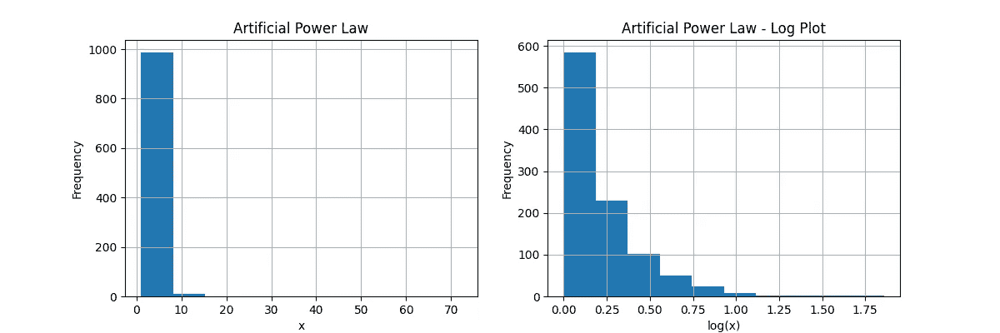

幂律分布数据的直方图。图片由作者提供。

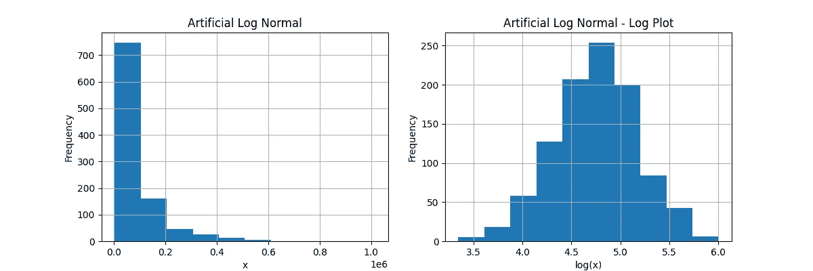

对数正态分布数据的直方图。图片由作者提供。

从上述直方图可以看出，原始值的分布在这两种分布中看起来 qualitatively 相似。然而，我们可以看到**对数分布中的明显差异**。即，对数幂律分布高度偏斜且不以均值为中心，而对数对数正态分布则类似于高斯分布。

现在，我们可以使用*powerlaw*库来拟合每个样本的幂律并估计α和 x_min 的值。这是我们的幂律样本的效果。

```py
# fit power to power law data
results = powerlaw.Fit(s_pareto)

# printing results
print("alpha = " + str(results.power_law.alpha)) # note: powerlaw lib's alpha definition is different than standard i.e. a_powerlawlib = a_standard + 1
print("x_min = " + str(results.power_law.xmin))
print('p = ' + str(compute_power_law_p_val(results)))

# Calculating best minimal value for power law fit
# alpha = 2.9331912195958676
# x_min = 1.2703447024073973
# p = 0.999
```

拟合在估计真实参数值（即 a=3，x_min=1）方面做得相当不错，如上面打印的 alpha 和 x_min 值所示。上述 p 值量化了拟合的质量。较高的 p 值意味着更好的拟合（*有关此值的更多信息，请参见参考文献[1]的第 4.1 节*）。

我们可以对对数正态分布做类似的操作。

```py
# fit power to log normal data
results = powerlaw.Fit(s_lognormal)
print("alpha = " + str(results.power_law.alpha)) # note: powerlaw lib's alpha definition is different than standard i.e. a_powerlawlib = a_standard + 1
print("x_min = " + str(results.power_law.xmin))
print('p = ' + str(compute_power_law_p_val(results)))

# Calculating best minimal value for power law fit
# alpha = 2.5508694755027337
# x_min = 76574.4701482522
# p = 0.999
```

我们可以看到对数正态样本也很好地符合幂律分布（p=0.999）。然而，请注意，x_min 值在尾部较远。虽然这对某些应用场景可能有帮助，但它并没有告诉我们哪个分布最适合样本中的所有数据。

为了克服这个问题，我们可以手动将 x_min 值设置为样本最小值，并重新进行拟合。

```py
# fixing xmin so that fit must include all data
results = powerlaw.Fit(s_lognormal, xmin=np.min(s_lognormal))
print("alpha = " + str(results.power_law.alpha))
print("x_min = " + str(results.power_law.xmin))

# alpha = 1.3087955873576855
# x_min = 2201.318351239509
```

.Fit()方法还会自动生成对数正态分布的估计值。

```py
print("mu = " + str(results.lognormal.mu))
print("sigma = " + str(results.lognormal.sigma))

# mu = 10.933481999687547
# sigma = 0.9834599169175509
```

估计的对数正态参数值接近实际值（mu=10，sigma=1），所以拟合再次做得很好！

然而，通过固定 x_min，我们丢失了质量指标 p（*由于某种原因，当提供 x_min 时，该方法不会生成值*）。所以这引出了一个问题，*我应该选择哪个分布参数？幂律还是对数正态？*

为了回答这个问题，我们可以通过**对数似然比（R）**将幂律拟合与其他候选分布进行比较。正值的 R 表示幂律拟合效果更好，而负值的 R 则表示替代分布更好。此外，每次比较都会给出一个显著性值（p）。这在下面的代码块中进行了演示。

```py
distribution_list = ['lognormal', 'exponential', 'truncated_power_law', \
      'stretched_exponential', 'lognormal_positive']

for distribution in distribution_list:
    R, p = results.distribution_compare('power_law', distribution)
    print("power law vs " + distribution + 
          ": R = " + str(np.round(R,3)) + 
          ", p = " + str(np.round(p,3)))

# power law vs lognormal: R = -776.987, p = 0.0
# power law vs exponential: R = -737.24, p = 0.0
# power law vs truncated_power_law: R = -419.958, p = 0.0
# power law vs stretched_exponential: R = -737.289, p = 0.0
# power law vs lognormal_positive: R = -776.987, p = 0.0
```

如上所示，当包含对数正态样本中的所有数据时，每个替代分布都优于幂律。此外，基于似然比，对数正态分布和对数正态分布（正值）拟合效果最佳。

## 现实世界的数据

现在我们已经将*powerlaw*库应用于我们知道真实情况的数据，让我们尝试将其应用于未知基础分布的数据。

我们将遵循类似于之前的过程，但使用现实世界的数据。在这里，我们将分析以下数据：过去一年中我在**Medium**个人资料上的月度关注者增长、我所有**YouTube**视频的收益，以及我**LinkedIn**帖子上的每日印象。

我们将开始绘制直方图。

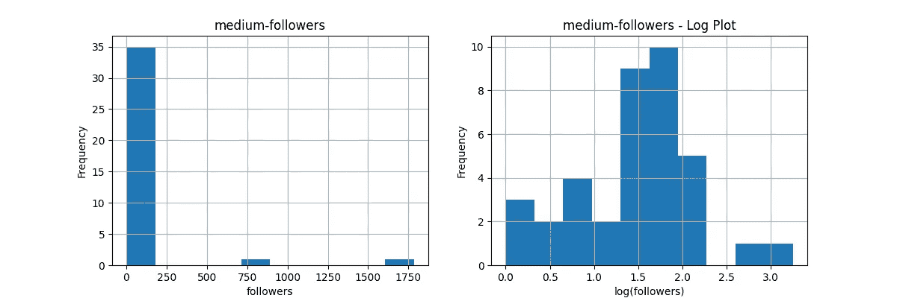

Medium 关注者增长的直方图。图片由作者提供。

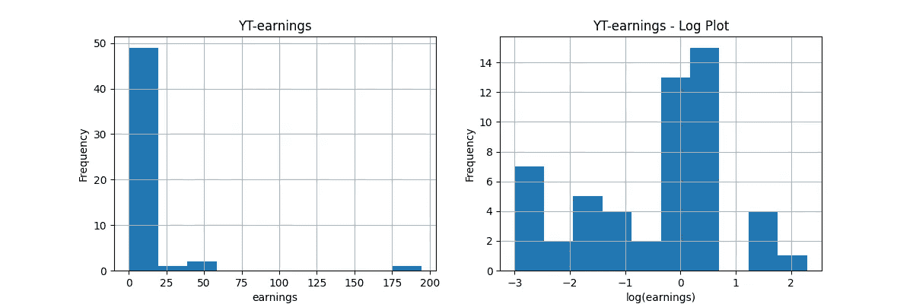

YouTube 视频收益的直方图。图片由作者提供。

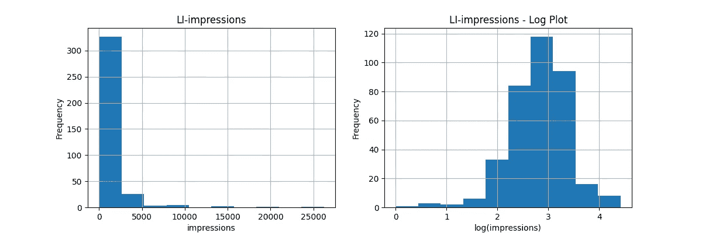

LinkedIn 每日印象的直方图。图片由作者提供。

从这些图中有两点引起了我的注意。**第一**，所有三个图形看起来都更像对数正态分布的直方图，而不是我们之前看到的幂律直方图。**第二**，Medium 和 YouTube 的分布稀疏，这意味着它们可能没有足够的数据来得出强有力的结论。

接下来，我们将对所有三个分布应用幂律拟合，同时将 x_min 设置为每个样本中的最小值。结果如下所示。

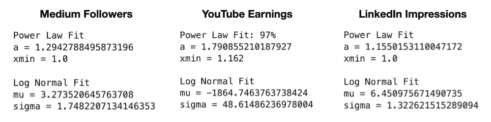

幂律和对数正态分布参数估计的经验数据。图片由作者提供。

为了确定哪种分布最佳，我们可以再次对幂律拟合与一些替代分布进行逐一比较。结果如下所示。

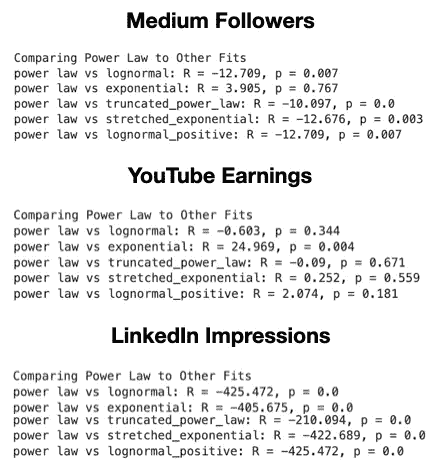

幂律和替代分布的拟合比较。图片由作者提供。

使用显著性阈值 p<0.1，我们可以得出以下结论：Medium 关注者和 LinkedIn 印象最适合对数正态分布，而幂律最能代表 YouTube 收益。

当然，由于 Medium 关注者和 YouTube 收益的数据有限（N<100），我们应该对这些数据得出的任何结论保持谨慎态度。

# 结论

许多标准统计工具在应用于遵循幂律分布的数据时会出现问题。因此，检测经验数据中的幂律可以帮助实践者避免错误分析和误导性结论。

然而，幂律是更一般现象**胖尾**的极端情况。在本系列的下一篇文章中，我们将进一步深入研究，并通过四个便捷的启发式方法对任何给定的数据集进行胖尾度量。

**👉 更多关于幂律与胖尾**: 简介 | 量化胖尾

[](/4-ways-to-quantify-fat-tails-with-python-10ce62c0ada1?source=post_page-----b464190fade6--------------------------------) ## 4 种用 Python 量化胖尾的方法

### 直觉与示例代码

towardsdatascience.com

# 资源

**连接**: [我的网站](https://shawhintalebi.com/) | [预约通话](https://calendly.com/shawhintalebi) | [问我任何问题](https://shawhintalebi.com/contact/)

**社交媒体**: [YouTube 🎥](https://www.youtube.com/channel/UCa9gErQ9AE5jT2DZLjXBIdA) | [LinkedIn](https://www.linkedin.com/in/shawhintalebi/) | [Twitter](https://twitter.com/ShawhinT)

**支持**: [请我喝咖啡](https://www.buymeacoffee.com/shawhint) ☕️

[](https://shawhin.medium.com/subscribe?source=post_page-----b464190fade6--------------------------------) [## 免费获取我写的每个新故事

### 免费获取我写的每个新故事。附言：我不会将你的邮箱分享给任何人。注册后，你将创建一个…

shawhin.medium.com](https://shawhin.medium.com/subscribe?source=post_page-----b464190fade6--------------------------------)

[1] arXiv:0706.1062 [physics.data-an]

[2] arXiv:2001.10488 [stat.OT]

[3] [`en.wikipedia.org/wiki/Likelihood_function`](https://en.wikipedia.org/wiki/Likelihood_function)

[4] [`en.wikipedia.org/wiki/Pareto_distribution`](https://en.wikipedia.org/wiki/Pareto_distribution)
