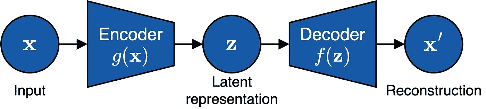
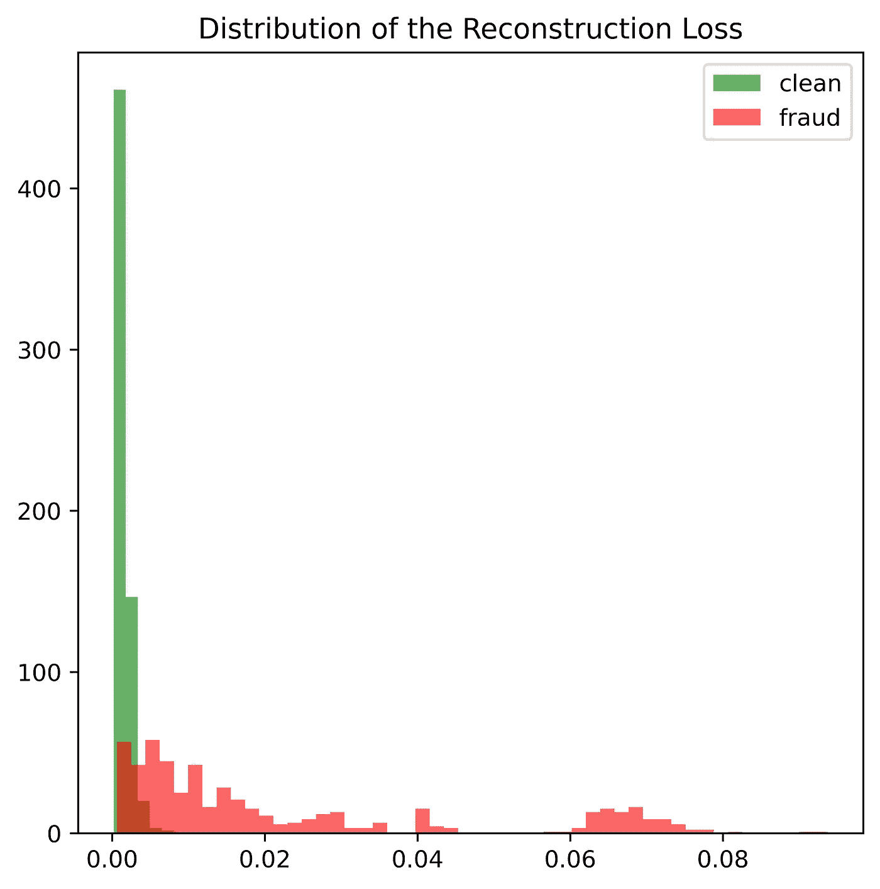
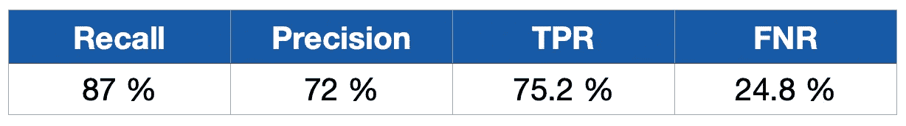
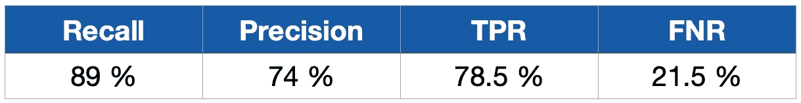

# 使用自编码器检测信用卡欺诈

> 原文：[`towardsdatascience.com/detection-of-credit-card-fraud-with-an-autoencoder-9275854efd48`](https://towardsdatascience.com/detection-of-credit-card-fraud-with-an-autoencoder-9275854efd48)

## 实现异常检测器的指南

[](https://tinztwinspro.medium.com/?source=post_page-----9275854efd48--------------------------------)[](https://towardsdatascience.com/?source=post_page-----9275854efd48--------------------------------) [Janik and Patrick Tinz](https://tinztwinspro.medium.com/?source=post_page-----9275854efd48--------------------------------)

·发表于 [Towards Data Science](https://towardsdatascience.com/?source=post_page-----9275854efd48--------------------------------) ·10 分钟阅读·2023 年 6 月 1 日

--


由 [Christiann Koepke](https://unsplash.com/@christiannkoepke?utm_source=medium&utm_medium=referral) 提供的照片，来源于 [Unsplash](https://unsplash.com/?utm_source=medium&utm_medium=referral)

你想知道如何使用 Python 和 TensorFlow 创建一个**异常检测器**吗？那么这篇文章适合你。信用卡公司使用异常检测器来检测欺诈交易。识别欺诈交易很重要，以便客户不必为他们没有购买的东西付钱。

每天都有大量的信用卡交易，但只有极少数交易是欺诈性的。欺诈交易就是异常。文章展示了一个自编码器模型的实现，用于检测这些欺诈交易。首先，我们定义异常并介绍不同类型的异常。然后我们描述用于信用卡欺诈检测的异常检测器的实现。让我们开始吧！

# 异常检测概述

异常检测算法识别在获取的数据集中出现的新颖和意外的结构。文献中有很多异常的定义。我们为我们的用例推导了一个定义。

## 异常定义

Chandola 等人 [1] 将异常描述为数据中不符合正常行为定义的模式。另一个广泛使用的定义来自 Hawkins。Hawkins [2] 将离群点描述为一个偏离其他观测值的程度，以至于怀疑它是由其他机制生成的。关于所呈现的定义，需要注意两个重要方面（参见 [3]）：

1.  异常的分布与数据的一般分布有很大偏离。

1.  大多数数据是正常的观测值，而异常只是其中的一小部分。

**我们定义异常如下：**

> 异常是与数据大多数分布显著不同的观察或一系列观察。

## 异常类型

我们基本上可以区分三种类型的异常。

+   **点异常**或**点异常**是指观察值与其他数据显著偏离[3]，并且仅持续很短的时间[4]。欺诈交易可能导致点异常。

+   **集体异常**是指一组观察值相较于其他数据而言是异常的。单个观察值可能表现为异常或正常，只有在群体中出现时才会显得异常[4]。只有在个体观察值相关的数据中，你才能检测到集体异常。

+   **上下文异常**描述的是在特定上下文中显得异常的观察或多个观察[3]。这些异常在全球范围内考虑时，位于该变量有效值的范围内[4]。

在本文中，我们开发了一个只能检测点异常的自编码器模型。还有更高级的自编码器模型，如 GRU 或 LSTM 自编码器，它们在数据中包含时间组件。

## 异常检测

异常检测方法的输出有两个选项：

1.  **异常评分：** 观察值与期望值的偏差。

1.  **二进制标签：** 正常或异常观察（标签：0 或 1）。

一些算法直接以二进制标签作为输出，而其他算法则根据异常评分计算标签，超过某个阈值。因此，你可以根据异常评分推导标签。[4]

以下是异常评分的函数（参见 [3]）：


函数：异常评分（作者提供的公式）

在方程中，*γ* 表示异常评分，***x_t*** 是时间 *t* 的观察值。*n* 是观察值的数量，*p* 是变量/特征的数量。你可以通过定义阈值 *δ ∈ R* 将异常评分转换为二进制标签（正常或异常）。


公式：二进制标签（作者提供的公式）

方程式显示你可以根据阈值 *δ* 调整二进制标签。本文中的实现使用二进制标签（0：无欺诈，1：欺诈）。

# 自编码器概念

在本节中，我们探讨自编码器的理论。自编码器是人工神经网络，通常用于异常检测。它们属于半监督方法，因为你只用数据的正常状态来训练它们。自编码器模型试图有效地压缩输入（编码），并最终重建这一压缩（解码），以便重建尽可能接近输入数据。压缩层称为潜在表示。

因此，网络由两个部分组成（参见 [5]，第 499 页）：

+   编码器函数 ***z*** *= g(****x****)* 和

+   解码器函数 ***x′*** *= f (****z****)*

下图展示了自编码器的一般结构。



自编码器的工作原理（作者提供的图像）

此外，学习一个精确的重建并没有多大用处，因为我们主要想要近似数据中的相关结构。编码中的压缩迫使自编码器学习数据中的有用特征。自编码器使用输入和输出之间的差异作为重建误差。在训练过程中，我们旨在最小化此误差。您可以使用不同的误差度量作为误差函数，例如均方误差 (MSE)：


公式：均方误差 (MSE)（公式由作者提供）

公式展示了观察值 ***x_t*** 的重建误差 (MSE) 的计算。误差函数的选择和自编码器的结构取决于具体的应用。例如，编码器和解码器可以由简单的前馈层、LSTM/GRU 层或卷积神经网络 (CNN) 层组成。

# 信用卡欺诈检测实现

我们使用了来自 Kaggle 的 [信用卡欺诈检测](https://www.kaggle.com/datasets/mlg-ulb/creditcardfraud?resource=download) 数据集（根据 [数据库内容许可协议 (DbCL) v1.0](https://opendatacommons.org/licenses/dbcl/1-0/) 许可）。该数据集包含了 2013 年 9 月来自欧洲信用卡客户的匿名信用卡交易数据。数据使用 PCA 进行了匿名处理。让我们开始数据准备工作。

## 数据准备

首先，我们读取数据并输出前五个数据点。

```py
df = pd.read_csv('creditcard.csv')
df.head()
```

我们看到有 28 列匿名数据，而有两列未被匿名化。时间和金额列未被匿名化。还有一个类别列（0: 正常交易或 1: 欺诈交易）。总共有 31 列数据。

接下来，我们检查数据集是否包含缺失值。

```py
df.isnull().sum().max() # Output: 0
```

该数据集没有缺失值。这很好。

接下来，我们对两个类别（正常交易和欺诈交易）的分布感兴趣。为此，我们计算各自类别在总数据中的百分比份额。

```py
print('No Frauds', round(df['Class'].value_counts()[0]/len(df) * 100,2), '% of the dataset')
print('Frauds', round(df['Class'].value_counts()[1]/len(df) * 100,2), '% of the dataset')

# Output: 
# No Frauds 99.83 % of the dataset
# Frauds 0.17 % of the dataset
```

我们看到欺诈交易的比例很小。在监督学习方法中，数据不平衡是危险的，因为这些方法是基于标签进行学习的。然而，在我们的使用案例中，我们采用了半监督的方法。训练仅使用正常交易的数据。因此，对于自编码器方法来说，不需要对数据进行平衡。

接下来，我们通过对特征 Amount 进行对数转换，将其转换为正态分布的对数等价物。这种转换改善了自动编码器的训练。我们还移除了 Time 特征。我们将数据分为训练数据、验证数据和测试数据。然后，我们从训练数据中移除欺诈交易，因为我们只用正常交易来训练自动编码器。

然后，我们使用来自[sklearn 库](https://scikit-learn.org/stable/modules/generated/sklearn.preprocessing.MinMaxScaler.html)的`MinMaxScaler`对数据进行缩放。我们在训练数据上训练缩放器，然后用这个缩放器转换训练、验证和测试数据。重要的是，只在训练数据上调整缩放器，否则验证或测试数据的信息会流入训练中。现在我们的数据已经准备好进行建模了。

## 建模

在本节中，我们使用 TensorFlow 实现了自动编码器模型。以下清单展示了自动编码器的实现：

```py
class AnomalyDetector(Model):
    def __init__(self, n_features):
        super(AnomalyDetector, self).__init__()
        self.encoder = tf.keras.Sequential([
            layers.Dense(16, activation="elu"),
            layers.Dense(8, activation="elu"),
            layers.Dense(4, activation="elu"),
            layers.Dense(2, activation="elu"),
            layers.ActivityRegularization(l1=1e-3)])

        self.decoder = tf.keras.Sequential([
            layers.Dense(2, activation="elu"),
            layers.Dense(4, activation="elu"),
            layers.Dense(8, activation="elu"),
            layers.Dense(16, activation="elu"),
            layers.Dense(n_features, activation="elu")])

    def call(self, x):
        encoded = self.encoder(x)
        decoded = self.decoder(encoded)
        return decoded
```

代码展示了编码器和解码器的实现。编码器将数据压缩成两个特征。然后，自动编码器根据这两个特征执行解码。在这种情况下，自动编码器尝试重构输入。自动编码器的目标是尽可能准确地重构输入。我们使用 ELU 作为激活函数，因为它在我们的测试中表现最佳。现在我们可以训练我们的模型了。

```py
autoencoder = AnomalyDetector(n_features)
opt = tf.keras.optimizers.Adam(learning_rate=0.001)
autoencoder.compile(optimizer=opt, loss="mean_squared_error")
earlystopper = EarlyStopping(monitor='val_loss', patience=5, verbose=1, restore_best_weights=True)

history = autoencoder.fit(
        normal_train_data_transformed, 
        normal_train_data_transformed, 
        epochs=100, 
        batch_size=128,
        validation_data=(normal_val_data_transformed, normal_val_data_transformed),
        callbacks=[earlystopper],
        shuffle=True)
```

首先，我们用特征数量初始化我们的模型。然后我们定义我们的优化器并设置学习率。在我们的情况下，我们使用优化器 Adam。最后，我们用优化器和损失函数编译我们的模型。在我们的情况下，我们使用 MSE 作为损失函数。我们还定义了一个早停机制，通过在验证损失在连续五个 epoch 内没有变化时停止训练。

```py
test_data_predictions = autoencoder.predict(X_test_transformed)   # predict reconstruction
mse = np.mean(np.power(X_test_transformed - test_data_predictions, 2), axis=1)   # calculates MSE between test data and reconstruction
```

一旦自动编码器经过训练和验证，我们可以在测试数据上尝试模型。自动编码器尝试尽可能准确地重构测试数据的输入。自动编码器能很好地重构正常交易。另一方面，它必须对欺诈交易进行差的重构。我们可以使用 MSE 计算输入和重构之间的误差。欺诈交易会产生较大的 MSE，而正常交易会产生较小的 MSE。

## 评估

在上一节中，我们训练了我们的模型。现在是时候评估模型了。首先，我们查看均方误差（MSE，重构误差）的分布。



重构损失的分布（图片来自作者）

图表显示，欺诈交易的 MSE（x 轴）高于正常交易。然而，一些欺诈交易的 MSE 与正常交易相似。

在接下来的内容中，您可以看到一些指标：



评估指标自动编码器模型（图片来自作者）

在异常检测中，召回率是一个重要的指标。我们的模型实现了 87%的召回率。这对于异常检测模型来说是一个很好的值。此外，模型的精确度为 72%，这对于这样的模型也很不错。真正的正例率（TPR）为 75.2%，这意味着我们的模型以 75%的准确率检测到欺诈交易。另一方面，我们的模型未能检测到 25%的欺诈交易（假阴性率（FNR））。

进一步优化的目标必须是最小化假阴性率。然而，我们必须记住，我们在训练模型时从未见过欺诈！在这方面，它的表现还算不错。然而，我们仍然可以尝试稍微改进模型。

使用我们的 FNR，我们可以看到网络无法完美地进行泛化。为了提高模型的性能，我们可以使用不同的自编码器模型，例如，每层的神经元数量不同，或者使用三或四个神经元的潜在表示。我们进行了一些测试并变化了神经元的数量。结果，以下模型取得了更好的效果。

```py
class AnomalyDetector(Model):
    def __init__(self, n_features):
        super(AnomalyDetector, self).__init__()
        self.encoder = tf.keras.Sequential([
            layers.Dense(32, activation="elu"),
            layers.Dense(16, activation="elu"),
            layers.Dense(8, activation="elu"),
            layers.Dense(4, activation="elu"),
            layers.ActivityRegularization(l1=1e-3)])

        self.decoder = tf.keras.Sequential([
            layers.Dense(4, activation="elu"),
            layers.Dense(8, activation="elu"),
            layers.Dense(16, activation="elu"),
            layers.Dense(32, activation="elu"),
            layers.Dense(n_features, activation="relu")])

    def call(self, x):
        encoded = self.encoder(x)
        decoded = self.decoder(encoded)
        return decoded
```

我们将潜在层的神经元增加到四个。编码器的第一层有 32 个神经元，解码器的最后一层有 32 个神经元。输出层使用 ReLU 激活函数。这些变化在测试数据上导致了更好的结果。你可以在下面看到这些结果。



评估指标改进的自编码器（图片由作者提供）

我们通过调整将召回率和精确度提高了 2 个百分点。此外，我们的 TPR 从之前的 75.2%提高到 78.5%。新模型的 FNR 为 21.5%。这意味着检测到的欺诈交易更多。

结果表明，尝试不同的模型配置以获得最佳模型是至关重要的。在我们的用例中，更大的自编码器导致了更好的结果。然而，这并不总是如此。重要的是实施一个适合用例的模型。

实施自编码器模型在测试标签很少时特别有用。自编码器仅需要正常数据而不是异常数据进行训练。所提出的方法特别适用于异常发生较少且仅有极少数标签的用例。

# 结论

在这篇文章中，我们展示了一个用于信用卡欺诈的异常检测器的实现。首先，我们介绍了异常检测的基础知识，然后是自编码器的直觉。自编码器压缩输入并尽可能重建它。此外，自编码器仅需要正常交易进行训练。然后，我们用 Tensorflow 实现了一个自编码器。评估结果表明，自编码器表现良好。

👉🏽 [**加入我们的每周免费 Magic AI 通讯，获取最新的 AI 更新！**](https://magicai.tinztwins.de)

👉🏽 [**你可以在我们的数字产品页面找到所有免费的资源！**](https://shop.tinztwins.de/)

[**免费订阅**](https://tinztwinspro.medium.com/subscribe) **以便在我们发布新故事时得到通知：**

[## 订阅我们的邮件，随时获取 Janik 和 Patrick Tinz 发布的内容。](https://tinztwinspro.medium.com/subscribe?source=post_page-----9275854efd48--------------------------------)

### 订阅邮件，随时获取 Janik 和 Patrick Tinz 发布的内容。通过注册，你将创建一个 Medium 账户，如果你还没有的话…

[tinztwinspro.medium.com](https://tinztwinspro.medium.com/subscribe?source=post_page-----9275854efd48--------------------------------)

了解更多关于我们的信息，请访问我们的 [关于页面](https://medium.com/@tinztwinspro/about)。不要忘记关注我们 [X](https://twitter.com/tinztwins)。非常感谢阅读。如果你喜欢这篇文章，请随意分享。**祝你有美好的一天！**

使用 [我们的链接](https://tinztwinspro.medium.com/membership) 注册 Medium 会员，阅读无限制的 Medium 故事。

# 参考文献

+   [1] Varun Chandola, Arindam Banerjee 和 Vipin Kumar. “异常检测：综述”。发表于：ACM 计算调查（CSUR）41.3 (2009), 第 1–58 页。

+   [2] Douglas M Hawkins. 《离群点识别》。第 11 卷，Springer，1980。

+   [3] Mohammad Braei 和 Sebastian Wagner. “单变量时间序列中的异常检测：前沿综述”。发表于：arXiv 预印本 arXiv:2004.00433 (2020)。

+   [4] Andrew A Cook, Göksel Mısırlı 和 Zhong Fan. “物联网时间序列数据的异常检测：综述”。发表于：IEEE 物联网期刊 7.7 (2019), 第 6481–6494 页。

+   [5] Ian Goodfellow, Yoshua Bengio 和 Aaron Courville. 《深度学习》。MIT 出版社，2016。
