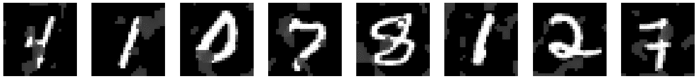
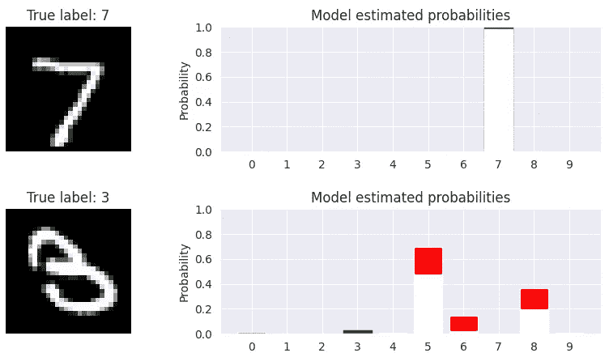
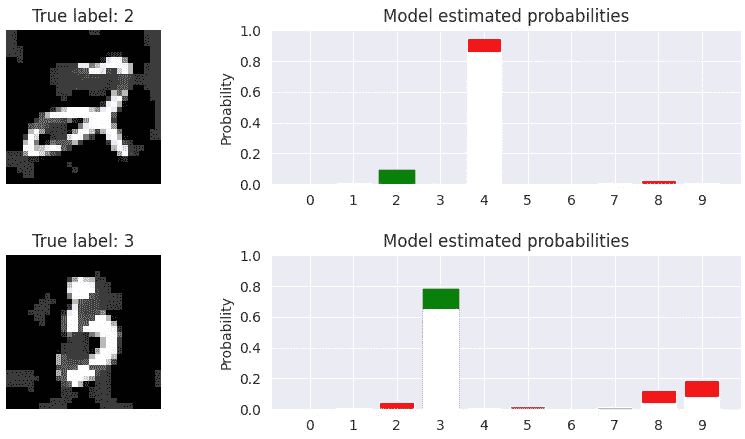

# 确定性与概率性深度学习

> 原文：[`towardsdatascience.com/deterministic-vs-probabilistic-deep-learning-5325769dc758`](https://towardsdatascience.com/deterministic-vs-probabilistic-deep-learning-5325769dc758)

## 概率性深度学习

[](https://medium.com/@luisroque?source=post_page-----5325769dc758--------------------------------)[](https://towardsdatascience.com/?source=post_page-----5325769dc758--------------------------------) [路易斯·罗克](https://medium.com/@luisroque?source=post_page-----5325769dc758--------------------------------)

·发表于 [数据科学之路](https://towardsdatascience.com/?source=post_page-----5325769dc758--------------------------------) ·9 分钟阅读·2023 年 1 月 11 日

--

# 介绍

本文属于“概率性深度学习”系列。该系列每周覆盖概率性深度学习的方法。主要目标是扩展深度学习模型以量化不确定性，即了解它们所不知道的内容。

本文涵盖了确定性与概率性深度学习之间的主要区别。确定性深度学习模型旨在优化标量值损失函数，而概率性深度学习模型则旨在优化概率目标函数。确定性模型为每个输入提供一个单一预测，而概率性模型则提供对其预测不确定性的概率性描述，并具备从模型生成新样本的能力。

目前已发布的文章：

1.  [TensorFlow Probability 简介：分布对象](https://medium.com/towards-data-science/gentle-introduction-to-tensorflow-probability-distribution-objects-1bb6165abee1)

1.  [TensorFlow Probability 简介：可训练参数](https://medium.com/towards-data-science/gentle-introduction-to-tensorflow-probability-trainable-parameters-5098ea4fed15)

1.  从头开始的最大似然估计（TensorFlow Probability）

1.  从头开始的概率性线性回归（TensorFlow）

1.  [概率性与确定性回归在 TensorFlow 中的比较](https://medium.com/towards-data-science/probabilistic-vs-deterministic-regression-with-tensorflow-85ef791beeef)

1.  [频率派与贝叶斯统计（Tensorflow）](https://medium.com/towards-data-science/frequentist-vs-bayesian-statistics-with-tensorflow-fbba2c6c9ae5)

1.  确定性与概率性深度学习


图 1：今天的座右铭：我们对事物总是充满不确定性；我们的模型为什么应该有所不同？ ([source](https://unsplash.com/photos/Vkp9wg-VAsQ))

我们使用 TensorFlow 和 TensorFlow Probability 开发我们的模型。TensorFlow Probability 是一个建立在 TensorFlow 之上的 Python 库。我们将从 TensorFlow Probability 中找到的基本对象开始，并了解如何操作它们。在接下来的几周中，我们将逐步增加复杂性，并将我们的概率模型与现代硬件（例如 GPU）上的深度学习相结合。

和往常一样，代码可以在我的 [GitHub](https://github.com/luisroque/probabilistic_deep_learning_with_TFP) 上找到。

# 确定性与概率深度学习

深度学习已经成为广泛机器学习任务（如图像和语音识别、自然语言处理和强化学习）的主导方法。深度学习的一个关键特性是能够从大量数据中学习复杂的非线性函数。然而，传统的深度学习模型是确定性的，意味着它们在给定相同输入时会做出相同的预测。

确定性深度学习模型，例如前馈神经网络，旨在优化标量值的损失函数，如均方误差或交叉熵。训练后的模型为每个输入生成一个单一的预测，但不提供关于预测不确定性的任何信息。相比之下，概率深度学习模型，如变分自编码器（VAEs）和生成对抗网络（GANs），旨在优化概率目标函数，如数据的负对数似然或近似后验分布。这些模型提供了对其预测不确定性的概率特征。

概率深度学习模型的主要优势之一是能够从模型中生成新样本。例如，VAE 可以用来生成与训练数据相似的新图像，而 GAN 可以用来生成与训练数据不同的新图像。此外，概率深度学习模型通常用于无监督学习，其目标是学习数据的紧凑表示而无需任何标签。

# 数据与方法

在本文中，我们使用 MNIST 数据集及其被破坏的对应数据集来评估我们的方法。MNIST 数据集的破坏版本通过在原始图像上叠加灰色斑点，增加了额外的复杂性，使手写数字分类更具挑战性。

我们的目标是构建一个卷积神经网络（CNN），有效地将手写数字的图像分类为 10 个不同的类别。为此，我们使用前述数据集，以提供对确定性和概率 CNN 性能的全面评估。

```py
def load_data(name):
    data_dir = os.path.join('data', name)
    x_train = 1 - np.load(os.path.join(data_dir, 'x_train.npy')) / 255.
    x_train = x_train.astype(np.float32)
    y_train = np.load(os.path.join(data_dir, 'y_train.npy'))
    y_train_oh = tf.keras.utils.to_categorical(y_train)
    x_test  = 1 - np.load(os.path.join(data_dir, 'x_test.npy')) / 255.
    x_test = x_test.astype(np.float32)
    y_test  = np.load(os.path.join(data_dir, 'y_test.npy'))
    y_test_oh = tf.keras.utils.to_categorical(y_test)

    return (x_train, y_train, y_train_oh), (x_test, y_test, y_test_oh)

def inspect_images(data, num_images):
    fig, ax = plt.subplots(nrows=1, ncols=num_images, figsize=(2*num_images, 2))
    for i in range(num_images):
        ax[i].imshow(data[i, :, :], cmap='gray')
        ax[i].axis('off')
    plt.show()

(x_train, y_train), (x_test, y_test) = tf.keras.datasets.mnist.load_data()

inspect_images(data=x_train, num_images=8)
```


图 2：来自 MNIST 数据集的随机示例。

```py
def read_prefetch(dataset):
    x = []
    y = []
    for x_, y_ in dataset:
        x.append(x_)
        y.append(y_)
    x = np.asarray(x)
    y = np.asarray(y)
    return x, y

x_c_train, y_c_train = read_prefetch(xy_c_train)
x_c_test, y_c_test = read_prefetch(xy_c_test)

inspect_images(data=x_c_train, num_images=8)
```



图 3：来自损坏版本的 MNIST 数据集的随机示例。

# 确定性架构

我们首先正式介绍确定性模型，它是一个由多个关键架构组件组成的卷积神经网络（CNN）分类器。具体来说，这个模型包括：

+   一个卷积层，其中卷积操作由一组 8 个滤波器进行，滤波器的大小为 5x5，采用‘VALID’填充，输出通过一个修正线性单元（ReLU）激活函数。

+   一个最大池化层，其中在大小为 6x6 的非重叠窗口内取最大值，减少特征图的空间维度。

+   一个 flatten 层，将池化后的特征图压缩成一个单一的向量，使得最终的全连接层可以进行完全连接的计算。

+   一个全连接层，也称为全连接层，有 10 个单元，并应用 softmax 激活函数以获得类别标签的最终概率分布。

这个 CNN 分类器架构旨在高效提取辨别特征并对高维图像数据进行分类。

```py
def get_det_model(input_shape, loss, optimizer, metrics):

    model = Sequential([
        Conv2D(input_shape=input_shape,
              filters=8,
              kernel_size=(5,5),
              activation='relu',
              padding='valid'),
        MaxPooling2D(pool_size=(6,6)),
        Flatten(),
        Dense(10, activation='softmax')
    ])

    model.compile(loss=loss, optimizer=optimizer, metrics=metrics)
    return model

tf.random.set_seed(0)
deterministic_model = get_det_model(
    input_shape=(28, 28, 1), 
    loss=SparseCategoricalCrossentropy(), 
    optimizer=RMSprop(), 
    metrics=['accuracy']
)

deterministic_model.summary()

_________________________________________________________________
Model: "sequential"
_________________________________________________________________
 Layer (type)                Output Shape              Param #   
=================================================================
 conv2d (Conv2D)             (None, 24, 24, 8)         208       

 max_pooling2d (MaxPooling2D  (None, 4, 4, 8)          0         
 )                                                               

 flatten (Flatten)           (None, 128)               0         

 dense (Dense)               (None, 10)                1290      

=================================================================
Total params: 1,498
Trainable params: 1,498
Non-trainable params: 0
_________________________________________________________________
```

我们已经实现了上述讨论的架构，因此现在我们准备开始训练过程。

```py
deterministic_model.fit(x_train, y_train, epochs=5)

Epoch 1/5
1875/1875 [==============================] - 8s 4ms/step - loss: 2.1986 - accuracy: 0.8423
Epoch 2/5
1875/1875 [==============================] - 7s 4ms/step - loss: 0.2248 - accuracy: 0.9470
Epoch 3/5
1875/1875 [==============================] - 7s 4ms/step - loss: 0.1678 - accuracy: 0.9563
Epoch 4/5
1875/1875 [==============================] - 7s 4ms/step - loss: 0.1428 - accuracy: 0.9626
Epoch 5/5
1875/1875 [==============================] - 7s 4ms/step - loss: 0.1336 - accuracy: 0.9641
```

最后，我们可以在两个数据集上检查准确性。

```py
print('Accuracy on MNIST test set: ',
      str(deterministic_model.evaluate(x_test, y_test, verbose=False)[1]))
print('Accuracy on corrupted MNIST test set: ',
      str(deterministic_model.evaluate(x_c_test, y_c_test, verbose=False)[1]))

Accuracy on MNIST test set:  0.9659000039100647
Accuracy on corrupted MNIST test set:  0.902400016784668
```

# 概率架构

与之前讨论的确定性模型相比，我们的概率模型引入了一种新的输出分布对象的方法，即 One-Hot 分类分布。这使得可以对图像标签的随机不确定性进行建模，从而更全面地表征模型的预测。

One-Hot 分类分布是一种离散概率分布，作用于 one-hot 位向量，其中事件维度等于 K，即类别数量。它在数学上等同于分类分布，分类分布是一种离散概率分布，作用于正整数，其关键区别在于分类分布具有空事件维度，而 One-Hot 分类分布的事件维度等于 K。

我们提出的概率卷积神经网络（CNN）架构包括：

+   一个卷积层，其中卷积操作由一组 8 个滤波器进行，滤波器的大小为 5x5，采用‘VALID’填充，输出通过一个修正线性单元（ReLU）激活函数。

+   一个最大池化层，其中在大小为 6x6 的非重叠窗口内取最大值，减少特征图的空间维度。

+   一个 flatten 层，将池化后的特征图压缩成一个单一的向量，使得最终的全连接层可以进行完全连接的计算。

+   一个密集层，也称为全连接层，具有参数化随后的概率层所需的单元数量。

+   一个 OneHotCategorical 分布层，其事件形状为 10，对应于 10 个类别。

这一新颖的架构，结合了 One-Hot Categorical 输出分布，使得能够对图像标签上的随机不确定性进行建模，并允许对模型预测进行更全面的表征。

```py
def nll(y_true, y_pred):
    return -y_pred.log_prob(y_true)

def get_probabilistic_model(input_shape, loss, optimizer, metrics):

    model = Sequential([
        Conv2D(input_shape=input_shape,
              filters=8,
              kernel_size=(5,5),
              activation='relu',
              padding='valid'),
        MaxPooling2D(pool_size=(6,6)),
        Flatten(),
        Dense(10),
        tfpl.OneHotCategorical(event_size=10,
                              convert_to_tensor_fn=tfd.Distribution.mode)
    ])

    model.compile(loss=loss, optimizer=optimizer, metrics=metrics)
    return model

tf.random.set_seed(0)
probabilistic_model = get_probabilistic_model(
    input_shape=(28, 28, 1), 
    loss=nll, 
    optimizer=RMSprop(), 
    metrics=['accuracy'])
probabilistic_model.summary()

_________________________________________________________________
Model: "sequential_1"
_________________________________________________________________
 Layer (type)                Output Shape              Param #   
=================================================================
 conv2d_1 (Conv2D)           (None, 24, 24, 8)         208       

 max_pooling2d_1 (MaxPooling  (None, 4, 4, 8)          0         
 2D)                                                             

 flatten_1 (Flatten)         (None, 128)               0         

 dense_1 (Dense)             (None, 10)                1290      

 one_hot_categorical (OneHot  ((None, 10),             0         
 Categorical)                 (None, 10))                        

=================================================================
Total params: 1,498
Trainable params: 1,498
Non-trainable params: 0
_________________________________________________________________
```

我们的模型实现完成了。请花一点时间将上述实现与我们之前进行的实现（实现相应的确定性架构）进行比较。如果您对我们为概率模型版本定义的特定组件（例如损失函数）有任何疑问，请参考本系列早期的文章。我们现在可以开始训练过程。

```py
probabilistic_model.fit(x_train, tf.keras.utils.to_categorical(y_train), epochs=5)

Epoch 1/5
1875/1875 [==============================] - 9s 5ms/step - loss: 2.0467 - accuracy: 0.8283
Epoch 2/5
1875/1875 [==============================] - 8s 5ms/step - loss: 0.1950 - accuracy: 0.9458
Epoch 3/5
1875/1875 [==============================] - 9s 5ms/step - loss: 0.1545 - accuracy: 0.9574
Epoch 4/5
1875/1875 [==============================] - 8s 4ms/step - loss: 0.1381 - accuracy: 0.9611
Epoch 5/5
1875/1875 [==============================] - 8s 4ms/step - loss: 0.1332 - accuracy: 0.9635
```

最后，我们可以检查这个版本模型的准确性。请注意，概率模型的测试准确性与确定性模型相同。这是因为两者的模型架构是等效的，唯一的区别是概率模型返回一个分布对象。

```py
print('Accuracy on MNIST test set: ',
      str(probabilistic_model.evaluate(x_test, tf.keras.utils.to_categorical(y_test), verbose=False)[1]))
print('Accuracy on corrupted MNIST test set: ',
      str(probabilistic_model.evaluate(x_c_test, tf.keras.utils.to_categorical(y_c_test), verbose=False)[1]))

Accuracy on MNIST test set:  0.9641000032424927
Accuracy on corrupted MNIST test set:  0.8906999826431274
```

# 结果与讨论

准确率是评估模型性能的重要指标。然而，它有时较为浅显，因为它未提供有关预测不确定性的信息。

在本节中，我们超越预测标签，提供了对预测不确定性的可视化表示。为此，我们对模型的预测分布进行采样，并计算结果样本的百分位数。

```py
def plot_model_prediction(image, true_label, model):
    predicted_probabilities = model(image[np.newaxis, :])
    fig, (ax1, ax2) = plt.subplots(nrows=1, ncols=2, figsize=(10, 2),
                                   gridspec_kw={'width_ratios': [2, 4]})

    # Show the image and the true label
    ax1.imshow(image[..., 0], cmap='gray')
    ax1.axis('off')
    ax1.set_title('True label: {}'.format(str(true_label)))

    # Show a 95% prediction interval of model predicted probabilities
    probs = np.zeros((10, 10))
    for i in range(10):
        probs[i] = np.array(np.mean(tf.squeeze(predicted_probabilities.sample(100)).numpy(), axis=0))
    pct_2p5 = np.percentile(probs, 2.5, axis=0)
    pct_97p5 = np.percentile(probs, 97.5, axis=0)

    bar = ax2.bar(np.arange(10), pct_97p5, color='red')
    bar[int(true_label)].set_color('green')
    ax2.bar(np.arange(10), pct_2p5-0.02, color='white', linewidth=1, edgecolor='white')
    ax2.set_xticks(np.arange(10))
    ax2.set_ylim([0, 1])
    ax2.set_ylabel('Probability')
    ax2.set_title('Model estimated probabilities')
    plt.show()
```

模型对第一张图像是 7 的预测非常有信心，这是正确的。对于第二张图像，模型遇到困难，为许多不同类别分配了非零概率。

```py
for i in [0, 18]:
    plot_model_prediction(x_test[i], np.squeeze(y_test[i]), probabilistic_model)
```



图 4：概率模型对 MNIST 数据集的预测。

再次，该模型对第一张图像的预测非常有信心。尽管有些污点，但这个数字仍然容易识别。第二个数字则显著更难识别。模型仍然能够很好地预测正确的数字，并展示了对这个选择的不确定性。

```py
for i in [0, 17]:
    plot_model_prediction(x_c_test[i], np.squeeze(y_c_test[i]), probabilistic_model)
```



图 5：概率模型对 MNIST 数据集损坏版本的预测。

# 结论

在本文中，我们讨论了确定性和概率深度学习模型之间的关键差异，重点介绍了这些模型在图像分类任务中的应用。通过分析 CNN 在 MNIST 数据集及其损坏版本上的表现，我们展示了概率深度学习模型可以实现与确定性模型相似的准确度水平，并提供了对其预测不确定性的概率描述。

概率深度学习模型的主要优势之一是能够从模型中生成新样本。这在图像合成或数据增强等任务中非常有用，目标是从给定的数据集中创建新的、真实的图像。此外，概率深度学习模型还可以用于无监督学习，其目标是学习数据的紧凑表示而无需任何标签。

保持联系: [LinkedIn](https://www.linkedin.com/in/luisbrasroque/)

# 参考资料和材料

[1] — [Coursera: 深度学习专业化](https://www.coursera.org/specializations/deep-learning)

[2] — [Coursera: TensorFlow 2 深度学习](https://www.coursera.org/specializations/tensorflow2-deeplearning) 专业化

[3] — [TensorFlow 概率指南与教程](https://www.tensorflow.org/probability/overview)

[4] — [TensorFlow 博客中的 TensorFlow 概率文章](https://blog.tensorflow.org/search?label=TensorFlow+Probability&max-results=20)
