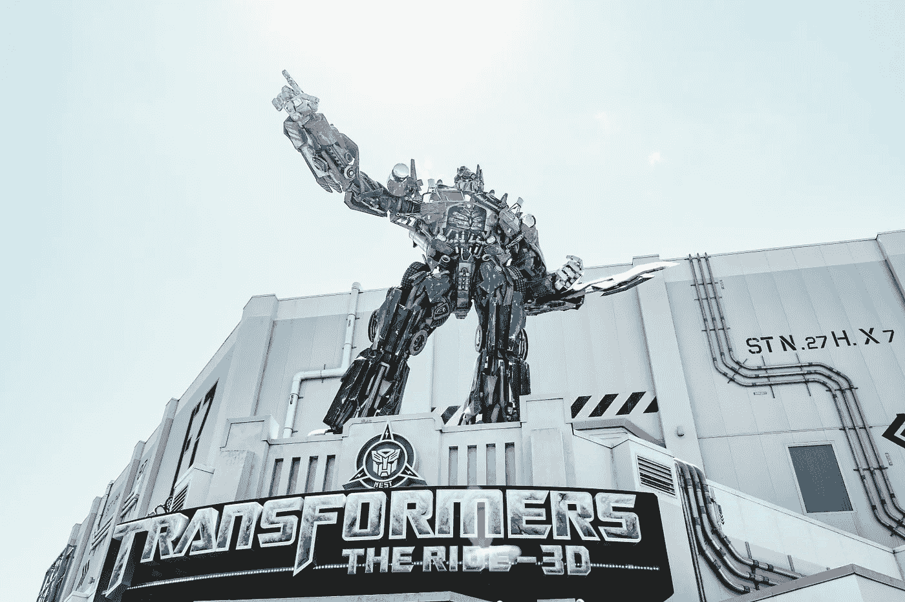

# DETR（用于物体检测的 Transformers）

> 原文：[`towardsdatascience.com/detr-transformers-for-object-detection-a8b3327b737a?source=collection_archive---------4-----------------------#2023-10-07`](https://towardsdatascience.com/detr-transformers-for-object-detection-a8b3327b737a?source=collection_archive---------4-----------------------#2023-10-07)

## 对论文《基于 Transformers 的端到端检测》的**深度剖析**和清晰解释

 [François Porcher](https://medium.com/@francoisporcher?source=post_page-----a8b3327b737a--------------------------------)

·

[关注](https://medium.com/m/signin?actionUrl=https%3A%2F%2Fmedium.com%2F_%2Fsubscribe%2Fuser%2F8e8e73046f53&operation=register&redirect=https%3A%2F%2Ftowardsdatascience.com%2Fdetr-transformers-for-object-detection-a8b3327b737a&user=Fran%C3%A7ois+Porcher&userId=8e8e73046f53&source=post_page-8e8e73046f53----a8b3327b737a---------------------post_header-----------) 发表在 [Towards Data Science](https://towardsdatascience.com/?source=post_page-----a8b3327b737a--------------------------------) · 8 分钟阅读 · 2023 年 10 月 7 日

--

由 [Aditya Vyas](https://unsplash.com/@aditya1702?utm_source=medium&utm_medium=referral) 在 [Unsplash](https://unsplash.com/?utm_source=medium&utm_medium=referral) 上拍摄的照片

注意：本文**深入**探讨了计算机视觉的复杂世界，特别关注了 Transformers 和注意力机制。建议了解论文中的关键概念 [“Attention is All You Need.”](https://arxiv.org/abs/1706.03762)

# 历史快照

**DETR**，即**DE**tection **TR**ansformer，在**2020 年由 Nicolas Carion 及其团队在 Facebook AI Research**首次提出，开创了物体检测的新潮流。

虽然目前并不具备 SOTA（最先进技术）的地位，DETR 对目标检测任务的创新重新定义已经对后续模型产生了显著影响，如 CO-DETR，它是当前在[LVIS](https://www.lvisdataset.org)上的**目标检测**和**实例分割**领域的最先进技术。

摆脱了传统的一对多问题场景，其中每个真实值对应着众多锚点候选，DETR 通过将目标检测视为**集合预测问题**，实现了预测与真实值之间的一对一对应，从而消除了某些后处理技术的需求。

# 目标检测概述
