# 在 Power BI 中开发和测试 RLS 规则

> 原文：[`towardsdatascience.com/develop-and-test-rls-rules-in-power-bi-9dc705945feb`](https://towardsdatascience.com/develop-and-test-rls-rules-in-power-bi-9dc705945feb)

## *通常，并非所有用户都应有权限访问报告中的所有数据。在这里，我将解释如何在 Power BI 中开发 RLS 规则以配置访问权限，并如何测试它们。*

[](https://medium.com/@salvatorecagliari?source=post_page-----9dc705945feb--------------------------------)[](https://towardsdatascience.com/?source=post_page-----9dc705945feb--------------------------------) [Salvatore Cagliari](https://medium.com/@salvatorecagliari?source=post_page-----9dc705945feb--------------------------------)

·发表于 [Towards Data Science](https://towardsdatascience.com/?source=post_page-----9dc705945feb--------------------------------) ·阅读时长 11 分钟·2023 年 6 月 19 日

--


图片来源：[FLY:D](https://unsplash.com/es/@flyd2069?utm_source=medium&utm_medium=referral) 在 [Unsplash](https://unsplash.com/?utm_source=medium&utm_medium=referral)

# 介绍

许多客户希望根据特定规则限制其报告中的数据访问。

数据访问被称为行级安全（简称 RLS）。

你可以在 Medium 上找到许多关于 Power BI 中 RLS 的文章。

我在下面的参考部分添加了其中的两个。

尽管所有文章都很好地解释了基础知识，但我总是缺少关于如何开发更复杂规则以及如何轻松测试它们的解释。

在本文中，我将一步步解释 RLS 的基础知识并逐步增加复杂性。

此外，我还将向你展示如何使用 DAX Studio 构建查询来测试 RLS 规则，然后再将它们添加到数据模型中。

所以，我们开始吧。

# 场景

我使用的场景是，用户根据公司内的门店或门店的地理位置访问零售销售数据，包括两者的组合。

在 Contoso 数据模型中，我使用以下表：

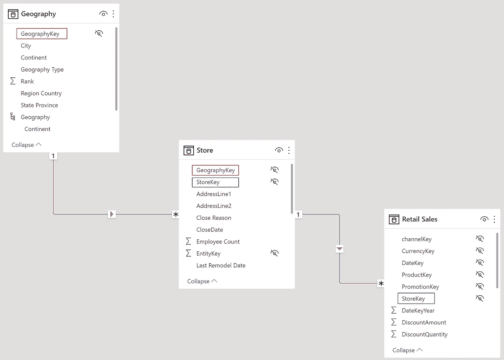

图 1 — 涉及的表（图由作者提供）

我创建了以下报告来测试我的结果：

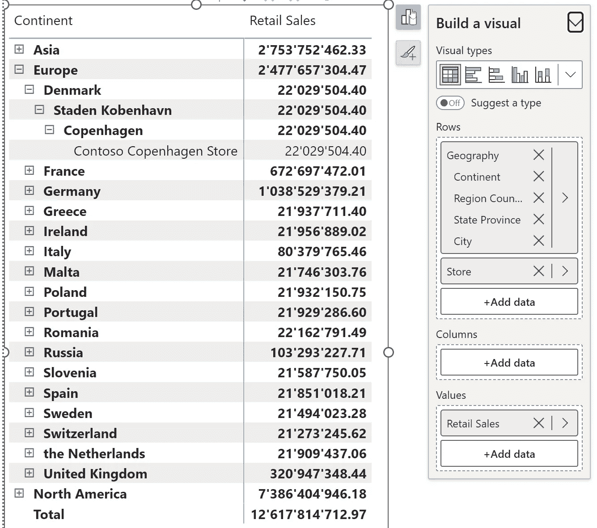

图 2 — 起始报告（图由作者提供）

# 创建简单规则

要创建 RLS 规则，你需要打开安全角色编辑器：

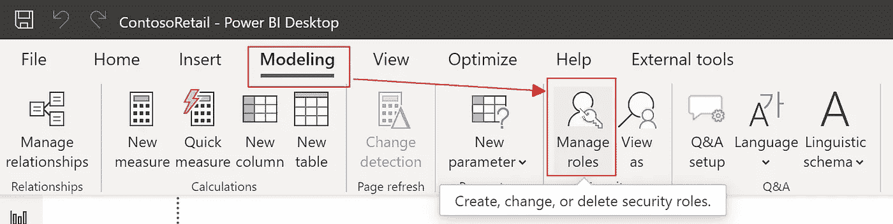

图 3 — 打开安全角色编辑器（图由作者提供）

接下来，你可以创建一个新角色并设置该角色的名称：

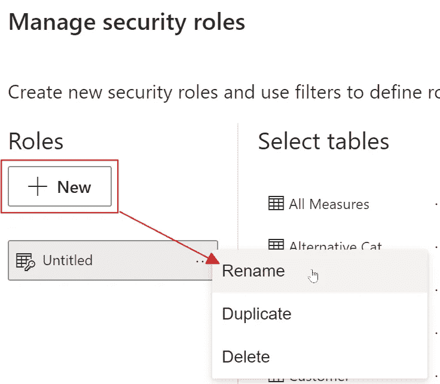

图 4 — 创建一个角色并重命名它（图示由作者提供）

在我的情况下，我将名称设置为“StorePermissions”。

现在，我可以开始添加一个表达式来控制对 Store 表的访问：

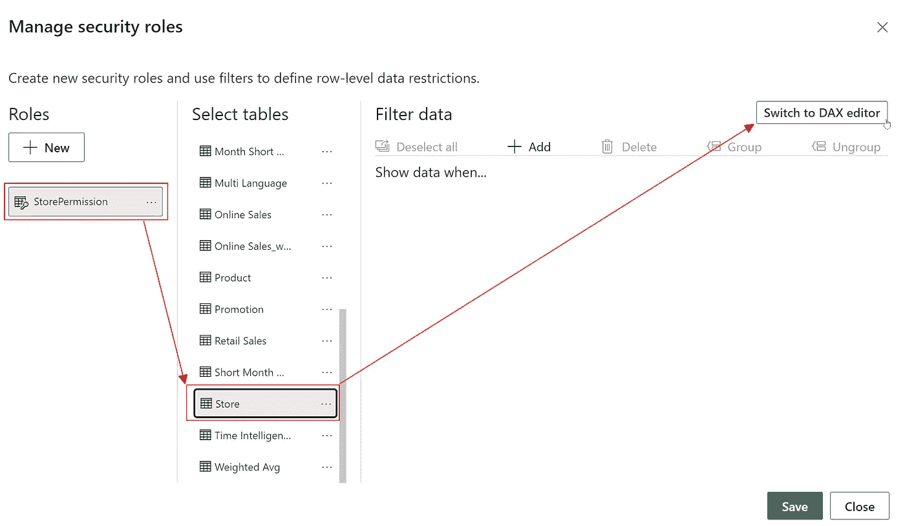

图 5 — 将 DAX 表达式添加到新角色（图示由作者提供）

我们已经有了一个新的、更简单的 RLS 规则编辑器几个月了。

在我的情况下，我想添加一个 DAX 表达式。所以，我点击“切换到 DAX 编辑器”按钮。

起初，我添加了最简单的表达式：`TRUE()`。

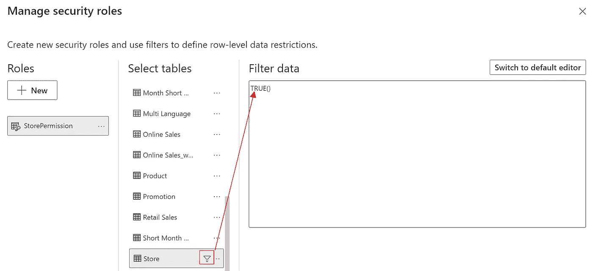

图 6 — 最简单的 RLS 规则（图示由作者提供）

要理解 RLS 规则，你必须知道访问是由 RLS 规则编辑器中表达式的输出控制的。

如果表达式的输出不是空的或 `FALSE()`，用户将获得访问权限。

原则上，RLS 规则编辑器中的任何表达式都会作为筛选器添加到任何查询中。

在我更详细地解释之前，让我们先看看这个第一个表达式的效果。

为了测试规则，我保存表达式并关闭编辑器。

现在我可以使用新规则查看报告：

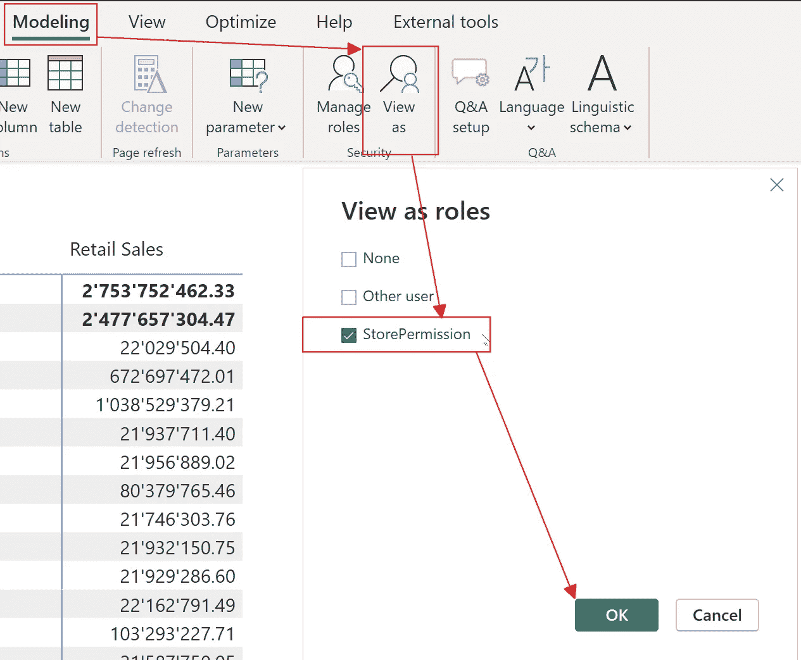

图 7 — 测试 RLS 规则（图示由作者提供）

在报告页面顶部，你会看到一个黄色横幅，显示你正在使用 StorePermission 规则查看报告。

由于 StorePermission 规则不限制访问，你不会看到任何区别。

让我们尝试一些不同的东西。

现在我将 RLS 规则中的表达式更改为 `FALSE()`。

当我测试规则时，我不会看到任何数据：

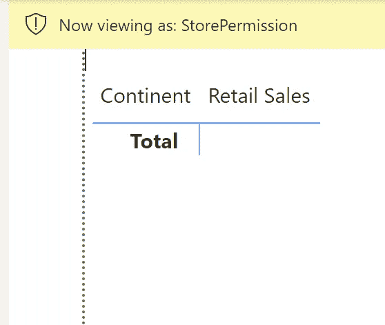

图 8 — 使用 `FALSE()` 测试规则（图示由作者提供）

这证明如果表达式不返回 `FALSE()`，数据是可以访问的。

# 测试查询

为了详细了解这种效果，让我展示一个 DAX 查询，以在没有任何限制的情况下获取结果：

```py
EVALUATE
  SUMMARIZECOLUMNS(
          Store[Store]
          ,"Retail_Sales", 'All Measures'[Retail Sales]
          )
ORDER BY Store[Store]
```

当我添加一个带有 `TRUE()` 的 RLS 规则，如上所示，查询变成类似于以下的查询：

```py
EVALUATE
  FILTER(
      SUMMARIZECOLUMNS(
            Store[Store]
            ,"Retail_Sales", 'All Measures'[Retail Sales]
            )
      ,TRUE()
      )
ORDER BY Store[Store]
```

我将查询封装在一个 [FILTER()](https://dax.guide/filter/) 函数中，并添加了 `TRUE()` 作为筛选表达式。

在接下来的示例中，我将使用 [CALCULATETABLE()](https://dax.guide/calculatetable/)，因为编写代码更高效灵活。

稍后会详细介绍这一点。

# 使其更复杂

接下来，我想限制对所有包含“Contoso T”字符串的门店的访问。

为此，我将规则编辑器中的表达式更改为以下内容：

```py
CONTAINSSTRING('Store'[Store], "Contoso T")
```

测试规则时，我得到了以下结果：

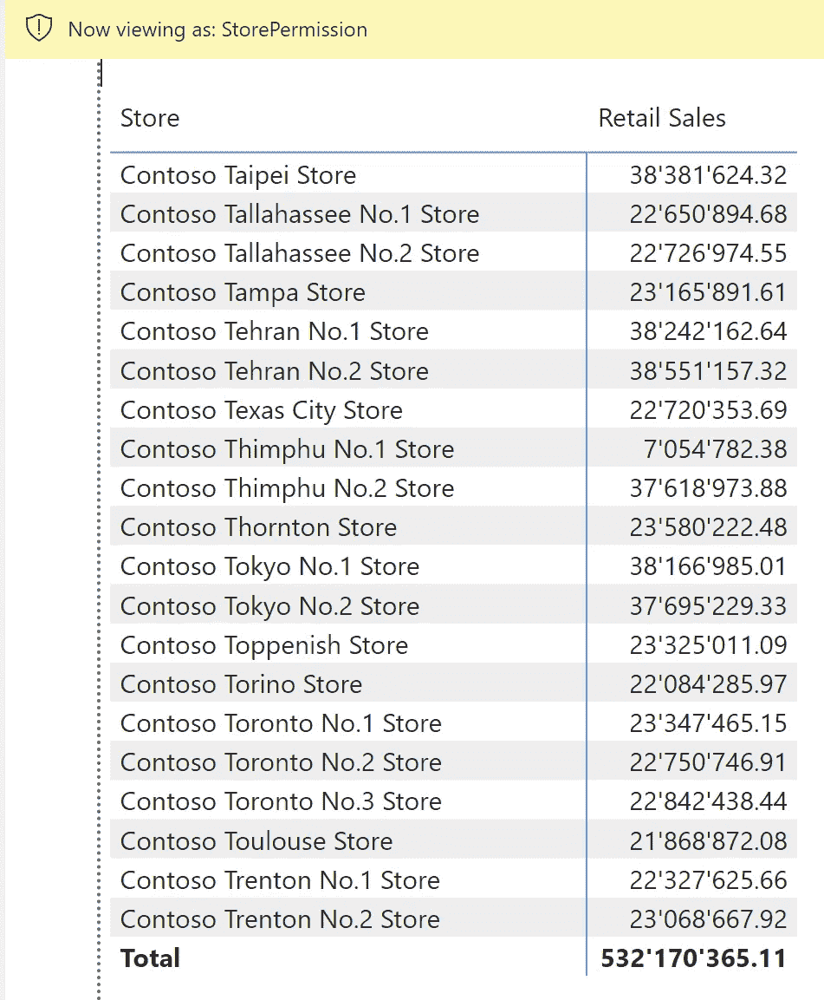

图 9 — 限制访问“Contoso T”门店的结果（图示由作者提供）

# 使用 DAX 查询测试规则

测试这种规则的结果将是很好的。

在这种情况下，我使用以下 DAX Studio 查询来检查结果：

```py
EVALUATE
  CALCULATETABLE(
    SUMMARIZECOLUMNS(
          Store[Store]
          ,"Retail_Sales", 'All Measures'[Retail Sales]
          )
    CONTAINSSTRING('Store'[Store], "Contoso T") = TRUE()
    )
ORDER BY Store[Store]
```

内部部分，使用 `SUMMARIZECOLUMNS()`，生成输出表。

在这种情况下，我只对门店列表感兴趣。

然后，我用 CALCULATETABLE() 将 SUMMARIZECOLUMNS() 包装起来，以向查询添加过滤器。

在这种情况下，我添加了来自 RLS 规则的表达式，包括一个“= TRUE()”检查。

结果如下：

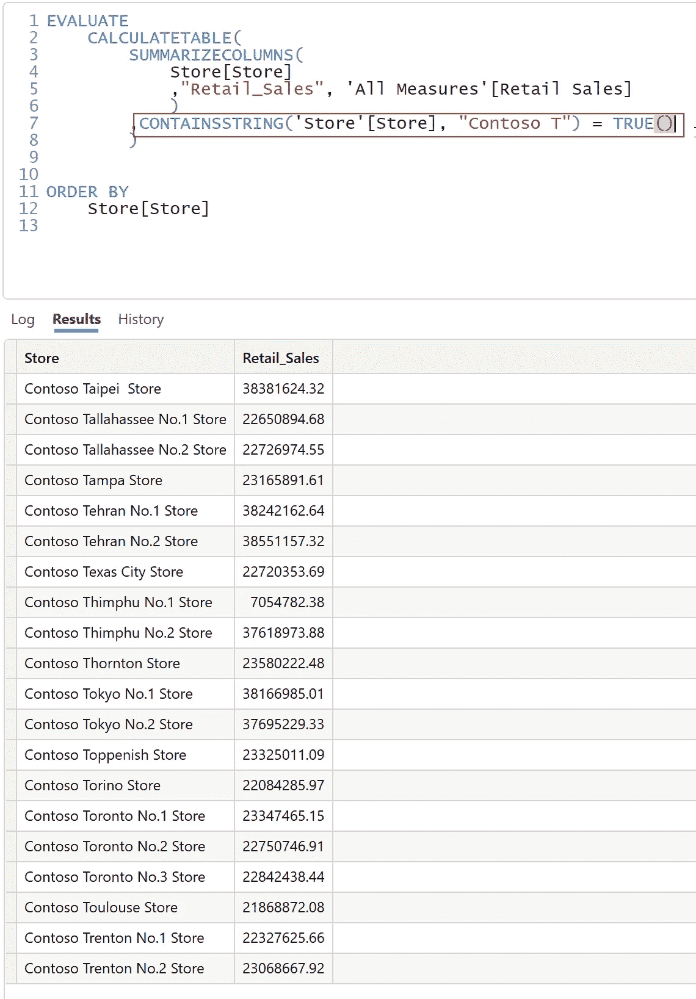

图 10 — 检查查询的结果（作者提供的图）

那么在后台发生了什么呢？

让我们看看存储引擎查询：

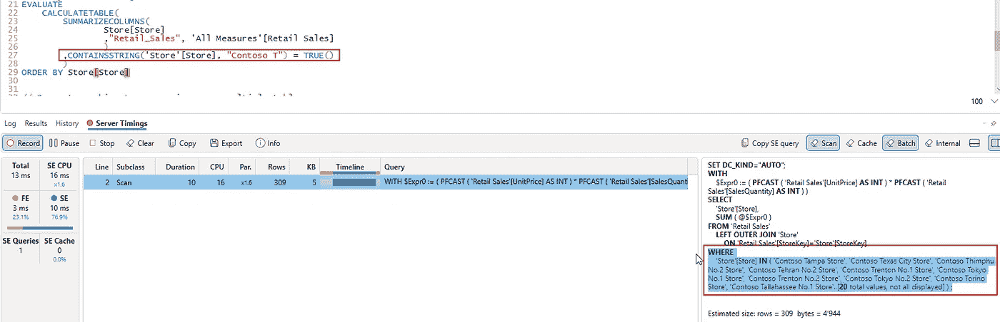

图 11 — 检查查询的结果（作者提供的图）

那么，当我将 RLS 规则应用到这个查询时会发生什么呢？

我可以通过 DAX Studio 轻松应用 RLS 规则：

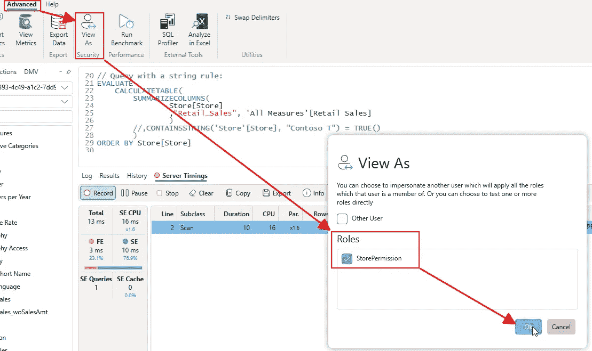

图 12 — 激活 RLS 规则（作者提供的图）

存储引擎查询如下：

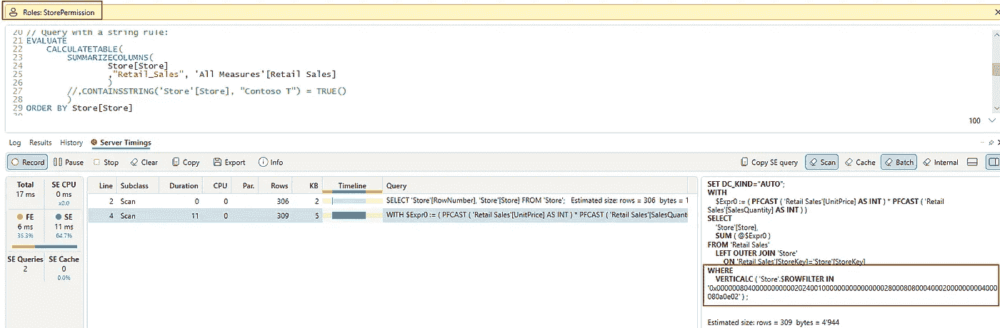

图 13 — 带有 RLS 规则的查询分析

第一个查询（第 2 行）检索所有商店的列表。

第二个查询在 WHERE 子句中包含 RLS 规则。

结果不是匹配的商店列表（根据过滤器），而是包含 RLS 规则的神秘行。

你可以看到存储引擎（SE）查询的结果仍然包含 309 行，如上所述，这些行的数量是所有商店 + 3 行。

我们有 3 行差异的提示在 SE 查询下方的文本中：估算大小：行数 = 309

实际返回的行数可能确实是 306。

但这个分析表明 RLS 规则是在存储引擎**之后**应用的，因为查询结果仅包含 21 行：所有以“Contoso T”开头的商店。

这很重要，因为计算最终结果的公式引擎（FE）在存储引擎之后是单线程的，只能使用一个 CPU 核心。

而 SE 是多线程的，可以使用多个 CPU 核心。

因此，我们必须避免在 RLS 规则中编写低效的代码。

# 组合规则

接下来，我想组合两个表达式：

1.  仅包括以“Contoso T”开头的商店

1.  仅包括欧洲的商店

为了实现这一点，我使用简单编辑器向地理表中添加第二个表达式：

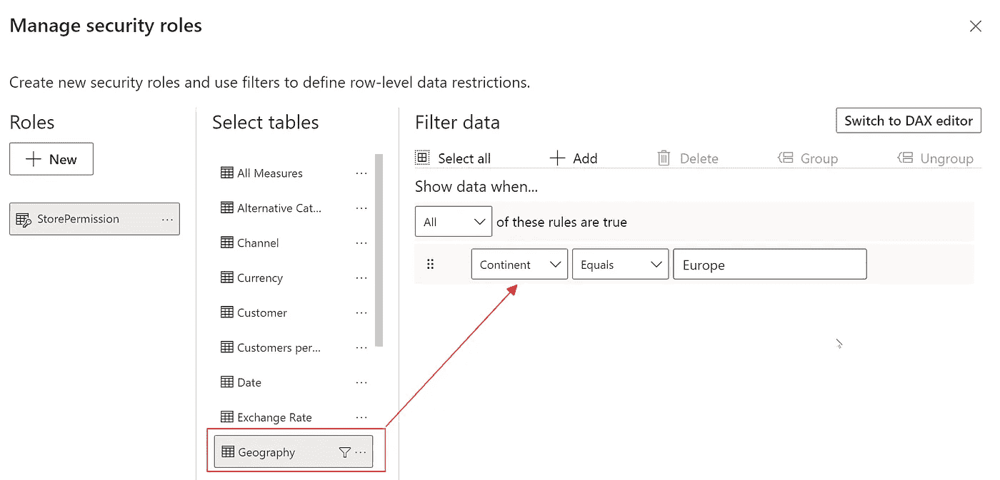

图 14 — 向地理表添加表达式（作者提供的图）

当我切换到 DAX 编辑器时，我得到以下表达式：

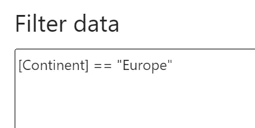

图 15 — 来自简单编辑器的 DAX 表达式（作者提供的图）

注意使用了[严格等于](https://dax.guide/op/strictly-equal-to/)运算符。

更改为[简单等于](https://dax.guide/op/equal-to/)运算符可能是必要的。

测试规则时的结果是：

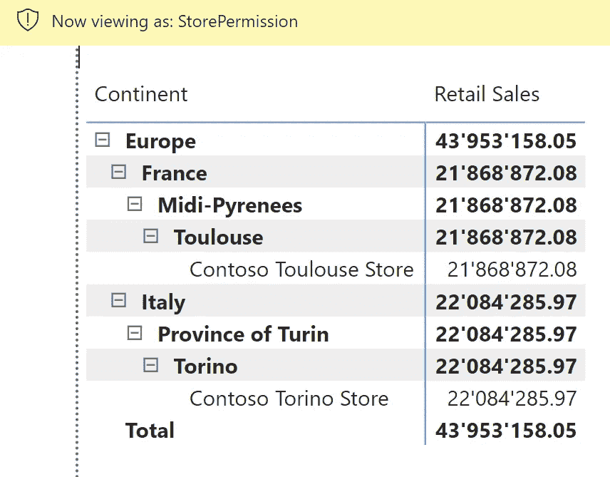

图 16 — 组合规则的结果（作者提供的图）

这个规则的 DAX 查询将如下所示：

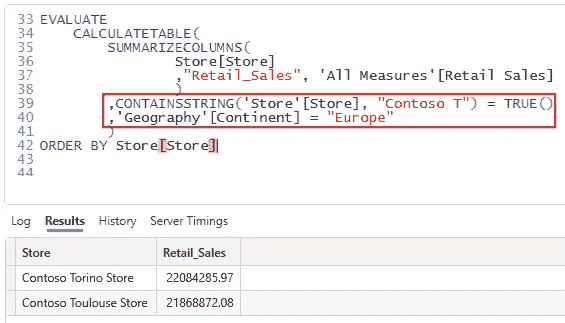

图 17 — 转换为 DAX 查询及结果（作者提供的图）

现在，让我们给 RLS 规则增加另一层复杂性：

我想限制访问那些：

+   商店的名称以“Contoso T”开头，并且位于欧洲

    或

+   商店的名称以“Contoso S”开头，并且位于北美

这次，我从 DAX 查询开始。这是开发和测试表达式的更简单方法。

我将第一个查询用过滤表达式括起来。

由于我需要过滤两个表（Store 和 Geography），我必须使用 [FILTER()](https://dax.guide/filter/) 和 [RELATED()](https://dax.guide/related/)：

```py
EVALUATE
  CALCULATETABLE(
    ADDCOLUMNS(
      SUMMARIZECOLUMNS(Store[Store], 'Geography'[Continent])
            ,"Retail_Sales", 'All Measures'[Retail Sales]
            )
    ,FILTER(Store
        ,OR(CONTAINSSTRING('Store'[Store], "Contoso T") && RELATED(Geography[Continent]) = "Europe"
          ,CONTAINSSTRING('Store'[Store], "Contoso S") && RELATED(Geography[Continent]) = "North America")
        )
    )
ORDER BY [Retail Sales] DESC, 'Geography'[Continent], Store[Store]
```

我需要 RELATED() 函数，因为我使用 FILTER() 遍历 Store 表，并且需要 Geography 表中的 Continent 列。

由于 Geography 表在关系的一侧，我可以使用 RELATED() 获取 Continent 列。

这是结果：

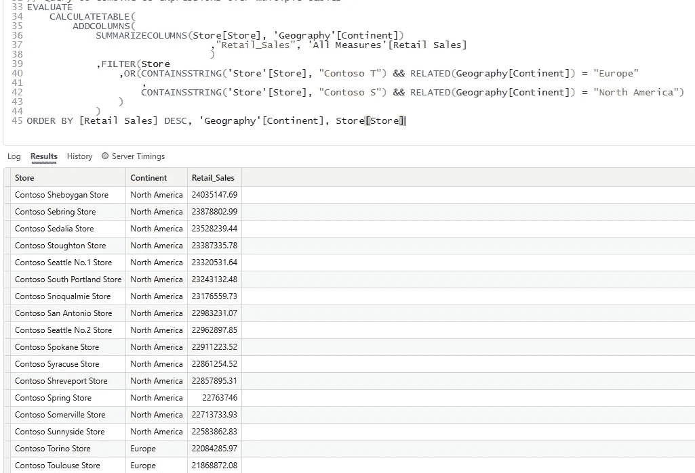

图 18 — 组合规则的查询（作者绘图）

接下来，我们必须将此过滤器转换为 RLS 规则。

对于 RLS 规则，我们可以移除 FILTER() 函数，因为 RLS 规则本身作为过滤器工作。

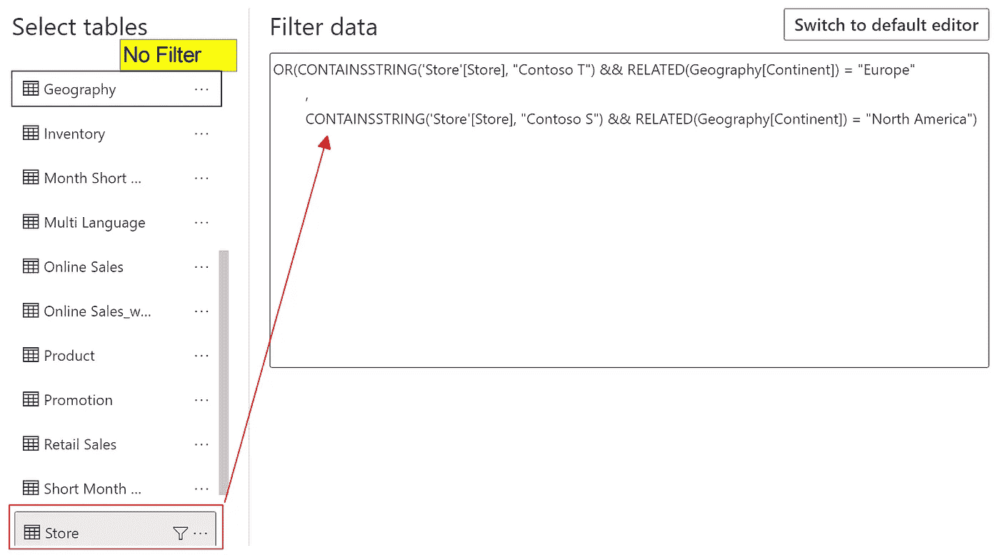

图 19 — 转换为一个 RLS 规则（作者绘图）

请注意，我从“Geography”表中移除了表达式。

当我在 Power BI 中测试此规则时，得到的结果与 DAX 查询的结果一致：

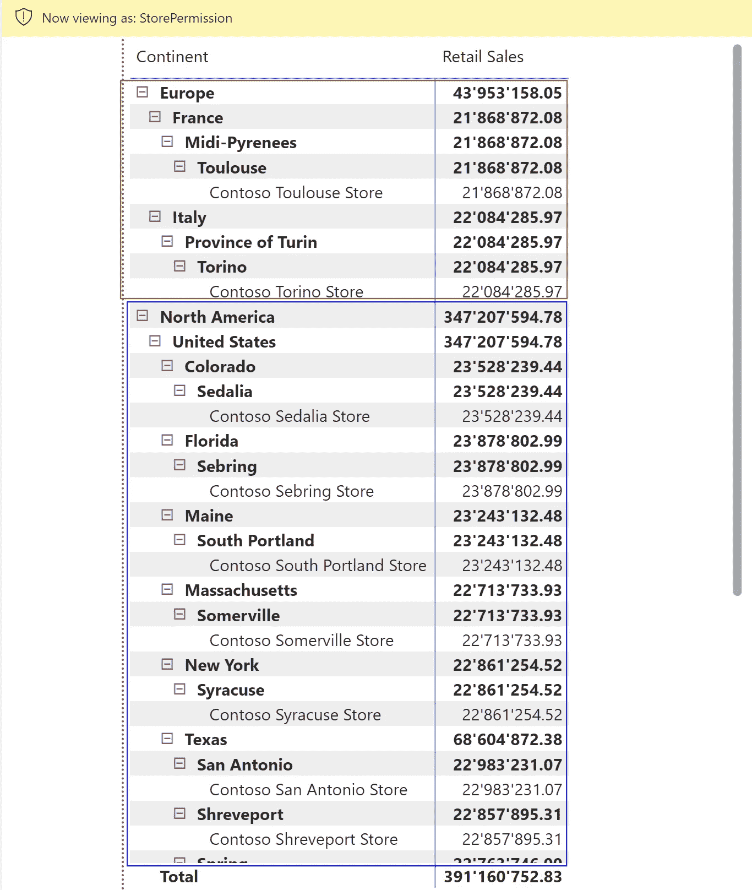

图 20 — 测试组合 RLS 规则（作者绘图）

为了测试 RLS 规则，例如，当你只想获取过滤后的商店列表时，你可以写一个简单的查询，仅使用 FILTER() 函数：

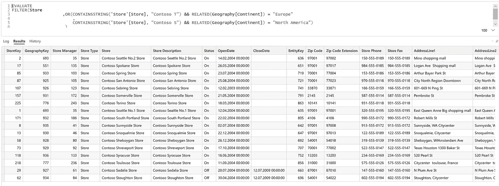

图 21 — 仅执行 FILTER()（作者绘图）

# 基于用户登录配置访问

到现在为止，我们查看了静态 RLS 规则。

但大多数情况下，我们需要基于用户登录的规则。

为了实现这一点，我们需要一个表来映射用户与用户需要访问的行。

例如，像这样的表：

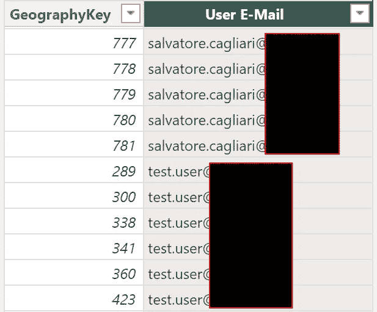

图 22 — 分配地理位置的用户列表（作者绘图）

在将表添加到数据模型后，我们需要在新表和“Geography”表之间添加一个关系：


图 23 — 扩展的数据模型（作者绘图）

新的“Geography Access”表和“Geography”表之间的关系必须正确配置。

添加关系后，Power BI 将其配置为 1:n 关系，其中“Geography”表在一侧，过滤器从“Geography”表流向“Geography Access”。

但我们希望根据“Geography Access”上的 RLS 规则（过滤器）来过滤“Geography”表。

因此，我们必须将交叉过滤方向更改为双向：

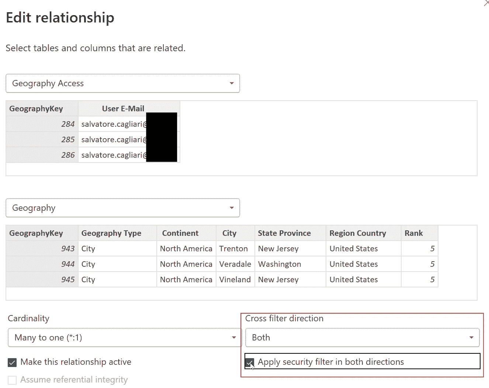

图 24 — 关系设置（作者绘图）

此外，我们**必须**设置“在两个方向上应用安全筛选器”标志，因为 Power BI 在应用 RLS 规则时会忽略交叉筛选方向设置。

现在我们可以添加 RLS 规则：

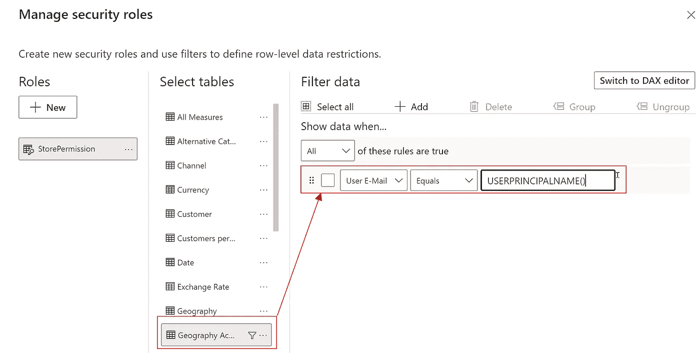

图 25 — 配置 RLS 规则（作者提供的图）

记得在添加此规则之前，移除 Store 表上的任何筛选表达式。

测试 RLS 规则时，我得到了这个结果：

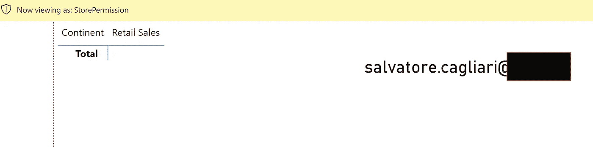

图 26 — 空结果（作者提供的图）

为了了解发生了什么，让我们回到 RLS 规则编辑器并将规则视图更改为 DAX：

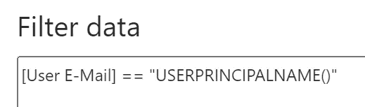

图 27 — 错误的 RLS 规则（作者提供的图）

简单的 RLS 规则编辑器无法识别 DAX 函数，并将其作为文本添加到筛选器中。

我们必须将表达式更改为如下：

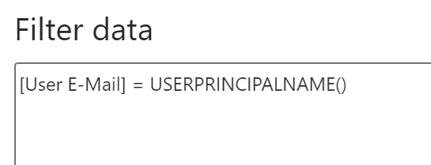

图 28 — 正确的 DAX 规则（作者提供的图）

现在结果如预期：

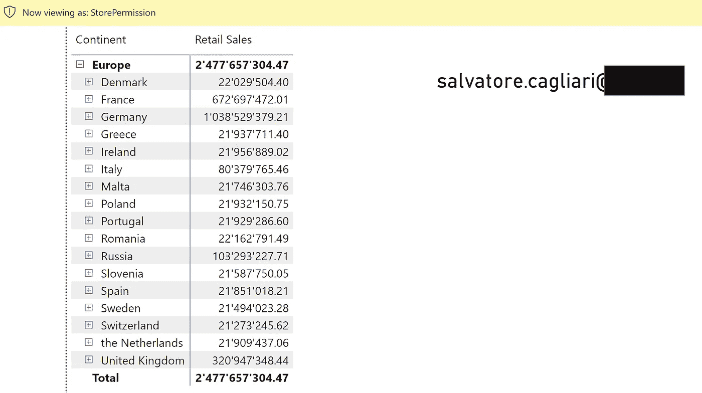

图 29 — 使用我的用户和正确的 RLS 表达式测试 RLS 规则（作者提供的图）

报告页面左上角的卡片包含一个带有 [USERPRINCIPALNAME()](https://dax.guide/userprincipalname/) 函数的度量，以确保在测试期间正确的用户处于活动状态。

我甚至可以使用另一个用户测试 RLS 规则：

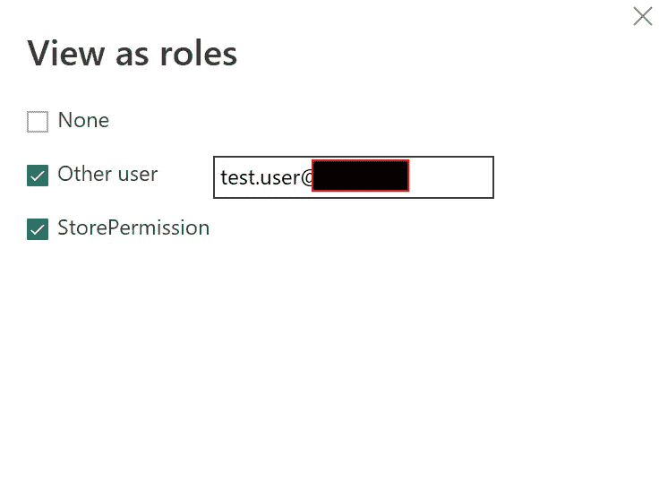

图 30 — 使用另一个用户测试 RLS 规则（作者提供的图）

有趣的是，这个用户不需要实际存在。它只需要包含在“地理位置访问”列表中。

这是测试结果：

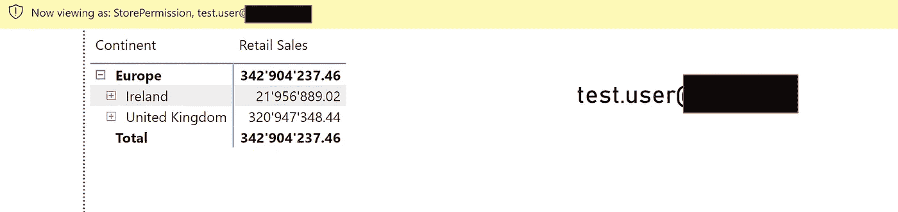

图 31 — 使用测试用户的测试结果（作者提供的图）

在顶部的黄色线中，你可以看到测试期间的活动用户。

# 结论

我向你展示了如何创建基础 RLS 规则以及如何测试它们。

然后我增加了更多的复杂性，并分析了 RLS 规则对底层存储引擎的影响。

我们已经看到公式引擎处理了部分 RLS 规则。因此，我们必须在 RLS 规则中编写高效的代码。

在将 RLS 规则实施到数据模型之前，了解如何测试它们非常重要。

通过理解规则如何应用于数据模型，可以更容易地理解错误结果。

最后，我向模型中添加了动态基于用户的 RLS 规则。

在 DAX 查询中测试这些规则更加困难，因为你必须知道每个用户可以访问哪些数据，以编写正确的测试查询来验证结果。

我希望我能给你一些关于简化使用 Power BI 中 RLS 功能的提示。


图片由 [Andrew George](https://unsplash.com/@andrewjoegeorge?utm_source=medium&utm_medium=referral) 提供，来源于 [Unsplash](https://unsplash.com/?utm_source=medium&utm_medium=referral)

# 参考文献

你可以在这篇文章中找到 Power BI 中的安全功能列表：

[](/4-2-security-features-in-power-bi-4c5a21968e53?source=post_page-----9dc705945feb--------------------------------) ## Power BI 中的 4 + 2 安全功能

### 在我关于这个主题的第一篇文章发布一年后，这里是关于 Power BI 中新安全功能的更新

[towardsdatascience.com

你可以在 Power BI（现在是 Fabric）社区页面找到关于 Power BI 中行级安全的简单解释：[Row-level security (RLS) with Power BI — Power BI | Microsoft Learn](https://learn.microsoft.com/en-us/power-bi/enterprise/service-admin-rls)。

我推荐这篇由 [Nikola Ilic](https://medium.com/u/64005b7daa38?source=post_page-----9dc705945feb--------------------------------) 撰写的文章，在其中你可以找到关于 RLS 的起点：

[](/the-ultimate-guide-to-row-level-and-object-level-security-in-power-bi-3a98f5422bad?source=post_page-----9dc705945feb--------------------------------) ## Power BI 中行级和对象级安全的终极指南

### “谁在报告中看到了什么？” 是 Power BI 中的关键安全问题之一。学习两种可能的实现方法…

[towardsdatascience.com

另一个关于 Power BI 中行级安全的良好入门文章由 [Elias Nordlinder](https://medium.com/u/23dedceb9914?source=post_page-----9dc705945feb--------------------------------) 撰写：

[](https://elias-nordlinder.medium.com/how-to-implement-row-level-security-in-power-bi-part-i-dc2da88d0b6e?source=post_page-----9dc705945feb--------------------------------) [## 如何在 Power BI 中实施行级安全（第 I 部分）

### 行级安全（Row-Level Security）是一种根据不同角色对数据进行不同筛选的方法。这可能是静态实现的…

[elias-nordlinder.medium.com](https://elias-nordlinder.medium.com/how-to-implement-row-level-security-in-power-bi-part-i-dc2da88d0b6e?source=post_page-----9dc705945feb--------------------------------)

访问我的故事列表以获取更多信息 [关于 FILTER() 函数](https://medium.com/towards-data-science/how-to-use-filter-in-dax-the-correct-way-eb621b49527a) 以及如何 [用 DAX Studio 分析 DAX 查询](https://medium.com/towards-data-science/how-to-get-performance-data-from-power-bi-with-dax-studio-b7f11b9dd9f9)。

我使用了 Contoso 示例数据集，像我之前的文章中一样。你可以从微软 [这里](https://www.microsoft.com/en-us/download/details.aspx?id=18279) 免费下载 ContosoRetailDW 数据集。

Contoso 数据可以根据 MIT 许可证自由使用，详细信息请见 [这里](https://github.com/microsoft/Power-BI-Embedded-Contoso-Sales-Demo)。

[](https://medium.com/@salvatorecagliari/subscribe?source=post_page-----9dc705945feb--------------------------------) [## 订阅以便每次 Salvatore Cagliari 发布新文章时收到电子邮件。

### 每当**Salvatore Cagliari**发布内容时，你将收到一封电子邮件。通过注册，你将创建一个 Medium 账户，如果你还没有的话…

[medium.com](https://medium.com/@salvatorecagliari/subscribe?source=post_page-----9dc705945feb--------------------------------)
