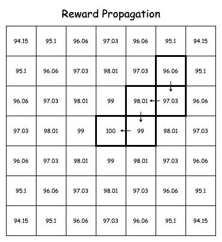

# 开发你的第一个 AI 代理：深度 Q 学习

> 原文：[`towardsdatascience.com/develop-your-first-ai-agent-deep-q-learning-375876ee2472?source=collection_archive---------0-----------------------#2023-12-15`](https://towardsdatascience.com/develop-your-first-ai-agent-deep-q-learning-375876ee2472?source=collection_archive---------0-----------------------#2023-12-15)

## 深入人工智能世界——从零开始构建深度强化学习环境。

[](https://medium.com/@heston.cv?source=post_page-----375876ee2472--------------------------------)[](https://towardsdatascience.com/?source=post_page-----375876ee2472--------------------------------) [赫斯顿·沃恩](https://medium.com/@heston.cv?source=post_page-----375876ee2472--------------------------------)

·

[关注](https://medium.com/m/signin?actionUrl=https%3A%2F%2Fmedium.com%2F_%2Fsubscribe%2Fuser%2F72a0dba7a030&operation=register&redirect=https%3A%2F%2Ftowardsdatascience.com%2Fdevelop-your-first-ai-agent-deep-q-learning-375876ee2472&user=Heston+Vaughan&userId=72a0dba7a030&source=post_page-72a0dba7a030----375876ee2472---------------------post_header-----------) 发布于 [Towards Data Science](https://towardsdatascience.com/?source=post_page-----375876ee2472--------------------------------) ·61 分钟阅读·2023 年 12 月 15 日[](https://medium.com/m/signin?actionUrl=https%3A%2F%2Fmedium.com%2F_%2Fvote%2Ftowards-data-science%2F375876ee2472&operation=register&redirect=https%3A%2F%2Ftowardsdatascience.com%2Fdevelop-your-first-ai-agent-deep-q-learning-375876ee2472&user=Heston+Vaughan&userId=72a0dba7a030&source=-----375876ee2472---------------------clap_footer-----------)

--

[](https://medium.com/m/signin?actionUrl=https%3A%2F%2Fmedium.com%2F_%2Fbookmark%2Fp%2F375876ee2472&operation=register&redirect=https%3A%2F%2Ftowardsdatascience.com%2Fdevelop-your-first-ai-agent-deep-q-learning-375876ee2472&source=-----375876ee2472---------------------bookmark_footer-----------)

构建你自己的深度强化学习环境——图片作者

## **目录**

> *如果你已经掌握了强化学习和深度 Q 学习的概念，可以直接跳到逐步教程。在那里，你将获得所有构建深度强化学习环境所需的资源和代码，包括环境、代理和训练协议。*

**简介**

为什么选择强化学习？

你将获得的内容

什么是强化学习?

深度 Q 学习

**逐步教程**

1\. 初步设置

2\. 大致概况

3\. 环境：初步基础

4\. 实现代理：神经架构和策略

5\. 影响环境：完成

6\. 从经验中学习：经验重放

7\. 定义代理的学习过程：调整神经网络

8\. 执行训练循环：将一切整合

9\. 总结

10\. 附录：优化状态表示

## 为什么选择强化学习？

最近，像 ChatGPT、Bard、Midjourney、Stable Diffusion 等先进 AI 系统的广泛采用，引发了对人工智能、机器学习和神经网络领域的兴趣，但由于实施这些系统的技术性特质，这种兴趣往往未能得到满足。

对于那些希望开始人工智能之旅（或继续当前进程）的人来说，使用深度 Q 学习构建一个强化学习 gym 是一个很好的起点，因为它不需要高级知识来实现，可以轻松扩展以解决复杂问题，并且可以立即直观地理解人工智能如何变得“智能”。

## 你将获得的知识

假设你对 Python 有基本了解，在这次深度强化学习的介绍结束时，不使用高级强化学习框架，你将开发自己的 gym，以训练代理解决一个简单问题——从起点移动到目标！

虽然不太光鲜，但你将亲身体验到构建环境、定义奖励结构和基本神经架构、调整环境参数以观察不同学习行为，以及在决策中找到探索与利用之间平衡等主题。

然后你将拥有所有必要的工具来实现自己更复杂的环境和系统，并为深入探讨神经网络和强化学习中的高级优化策略做好充分准备。


图片由作者使用[Gymnasium](https://gymnasium.farama.org/)的 LunarLander-v2 环境制作

你还将获得有效利用预构建工具如[OpenAI Gym](https://www.gymlibrary.dev/)的信心和理解，因为系统的每个组件都是从头开始实现并解密的。这使得你能够将这些强大的资源无缝集成到自己的 AI 项目中。

## 什么是强化学习？

强化学习（RL）是机器学习（ML）的一个子领域，专注于代理（做出决策的实体）如何在环境中采取行动以完成目标。

其实现包括：

+   游戏

+   自动驾驶车辆

+   机器人技术

+   金融（算法交易）

+   自然语言处理

+   以及更多内容..

强化学习的理念基于行为心理学的基本原则，其中动物或人类从其行为的结果中学习。如果某个行动导致了良好的结果，则代理会获得奖励；如果没有，则会受到惩罚或不给予奖励。

在继续之前，了解一些常用术语非常重要：

+   **环境**：这是世界——代理操作的地方。它设定了代理必须遵循的规则、边界和奖励。

+   **代理**：环境中的决策者。代理根据对所处状态的理解来采取行动。

+   **状态**：代理在环境中的当前情况的详细快照，包括用于决策的相关度量或感官信息。

+   **行动**：代理与环境交互的具体措施，如移动、收集物品或发起互动。

+   **奖励**：环境根据代理的行为给予的反馈，可以是正面的、负面的或中性的，引导学习过程。

+   **状态/行动空间**：代理可能遇到的所有可能状态和它在环境中可以采取的所有行动的组合。这定义了代理必须学习导航的决策和情况的范围。

本质上，在程序的每一步（回合），代理从环境中接收一个状态，选择一个行动，获得奖励或惩罚，环境被更新或回合结束。每一步后收到的信息会被保存为“经验”以供后续训练使用。

举个更具体的例子，假设你在下棋。棋盘是***环境***，你是***代理***。每一步（或回合）你查看棋盘的***状态***，并从行动空间中选择，即所有可能的移动，然后挑选未来***奖励***最高的***行动***。完成移动后，你评估这个行动是否良好，并学习以便下次表现得更好。

这可能一开始看起来信息量很大，但随着你自己逐步建立，这些术语会变得非常自然。

## 深度 Q 学习

Q 学习是一种用于机器学习的算法，其中“Q”代表“质量”，即代理可以采取的行动的价值。它通过创建一个 Q 值表来工作，该表包含行动及其相关的质量，用于估算在给定状态下采取某个行动的预期未来奖励。

代理会获得环境的状态，检查表格以查看是否以前遇到过，然后选择奖励值最高的行动。


Q 学习的顺序流程：从状态评估到奖励和 Q 表更新。—— 作者提供的图像

然而，Q-Learning 有一些缺点。每个状态和动作对必须被探索才能获得良好的结果。如果状态和动作空间（所有可能状态和动作的集合）过大，那么将它们全部存储在表中是不现实的。

这就是深度 Q-Learning（DQL）的作用，它是 Q-Learning 的一种进化形式。DQL 利用深度神经网络（NN）来近似 Q 值函数，而不是将其保存到表中。这使得处理具有高维状态空间的环境成为可能，比如来自相机的图像输入，这对于传统的 Q-Learning 来说是不切实际的。


深度 Q-Learning 是 Q-Learning 和深度神经网络的交集 — 作者提供的图像

神经网络可以在类似的状态和动作上进行泛化，即使它没有在具体情况上进行过训练，也能选择出合适的动作，从而消除对大型表格的需求。

*神经网络如何做到这一点超出了本教程的范围。幸运的是，实施深度 Q-Learning 并不需要深刻的理解。*

# 构建强化学习 Gym

## 1\. 初始设置

在开始编写我们的 AI 代理之前，建议您对 Python 中的面向对象编程（OOP）原则有扎实的理解。

如果您尚未安装 Python，以下是 [Bhargav Bachina](https://medium.com/@bhargavbachina) 提供的简单教程，可以帮助您入门。我将使用的版本是 3.11.6。

[](https://medium.com/bb-tutorials-and-thoughts/how-to-install-and-getting-started-with-python-acf369e4cf80?source=post_page-----375876ee2472--------------------------------) [## 如何安装和开始使用 Python

### 初学者指南，适合任何想要开始学习 Python 的人

medium.com](https://medium.com/bb-tutorials-and-thoughts/how-to-install-and-getting-started-with-python-acf369e4cf80?source=post_page-----375876ee2472--------------------------------)

您唯一需要的依赖是 [TensorFlow](https://www.tensorflow.org/)，这是 Google 提供的开源机器学习库，我们将用来构建和训练我们的神经网络。可以通过终端中的 pip 安装。我的版本是 2.14.0。

```py
pip install tensorflow
```

或者如果这样做不行：

```py
pip3 install tensorflow
```

您还需要 [NumPy](https://numpy.org/) 包，但这应该已经包含在 TensorFlow 中。如果遇到问题，可以使用 `pip install numpy`。

还建议您为每个类创建一个新文件（例如，environment.py）。这样可以避免被信息量淹没，并简化故障排除。

供您参考，这里是包含完整代码的 GitHub 仓库：[`github.com/HestonCV/rl-gym-from-scratch`](https://github.com/HestonCV/rl-gym-from-scratch)。请随意克隆、浏览，并将其作为参考！

## 2\. 全局视角

为了真正理解这些概念，而不仅仅是复制代码，了解我们将要构建的不同部分及其如何结合起来至关重要。这样，每个部分都能在更大的图景中找到位置。

以下是一个包含 5000 个回合的训练循环的代码。一个回合本质上是代理与环境之间的一个完整的互动过程，从开始到结束。

*这一点在目前不需要实现或完全理解。当我们构建每一部分时，如果你想了解特定类或方法的使用方式，请回到这里。*

```py
from environment import Environment
from agent import Agent
from experience_replay import ExperienceReplay
import time

if __name__ == '__main__':

    grid_size = 5

    environment = Environment(grid_size=grid_size, render_on=True)
    agent = Agent(grid_size=grid_size, epsilon=1, epsilon_decay=0.998, epsilon_end=0.01)
    # agent.load(f'models/model_{grid_size}.h5')

    experience_replay = ExperienceReplay(capacity=10000, batch_size=32)

    # Number of episodes to run before training stops
    episodes = 5000
    # Max number of steps in each episode
    max_steps = 200

    for episode in range(episodes):

        # Get the initial state of the environment and set done to False
        state = environment.reset()

        # Loop until the episode finishes
        for step in range(max_steps):
            print('Episode:', episode)
            print('Step:', step)
            print('Epsilon:', agent.epsilon)

            # Get the action choice from the agents policy
            action = agent.get_action(state)

            # Take a step in the environment and save the experience
            reward, next_state, done = environment.step(action)
            experience_replay.add_experience(state, action, reward, next_state, done)

            # If the experience replay has enough memory to provide a sample, train the agent
            if experience_replay.can_provide_sample():
                experiences = experience_replay.sample_batch()
                agent.learn(experiences)

            # Set the state to the next_state
            state = next_state

            if done:
                break
            # time.sleep(0.5)

        agent.save(f'models/model_{grid_size}.h5')
```

每个内循环被视为一步。


通过代理-环境互动进行的训练过程——图片由作者提供

在每一步：

+   状态从环境中获取。

+   代理根据这个状态选择一个动作。

+   环境受到操作，返回奖励，采取动作后的结果状态，以及回合是否结束。

+   初始的`state`、`action`、`reward`、`next_state`和`done`随后被保存到`experience_replay`中，作为一种长期记忆（经验）。

+   然后，代理在这些经验的随机样本上进行训练。

在每个回合结束时，或者按你的需要，模型权重会被保存到模型文件夹中。这些权重可以在后续加载，以避免每次都从头训练。然后，环境在下一个回合开始时被重置。

这个基本结构几乎足以创建一个智能代理来解决各种问题！

正如引言中所述，我们对代理的问题相当简单：从网格中的初始位置到达指定的目标位置。

## 3\. 环境：初步基础

开发这个系统的最明显起点是环境。

要拥有一个功能齐全的 RL 训练环境，环境需要做几件事：

+   维护世界的当前状态。

+   跟踪目标和代理。

+   允许代理对世界进行修改。

+   返回模型可以理解的状态形式。

+   以我们能够理解的方式进行渲染，以观察代理。

这里将是代理度过其整个生命周期的地方。我们将环境定义为一个简单的方阵/二维数组，或在 Python 中的列表列表。

该环境将具有离散的状态空间，这意味着代理可能遇到的状态是不同且可计数的。每个状态都是环境中的一个单独、特定的条件或场景，不同于连续状态空间，其中状态可以以无限、流动的方式变化——想象一下国际象棋与控制汽车。

*DQL 专门设计用于离散动作空间（有限数量的动作）——这将是我们关注的重点。其他方法用于连续动作空间。*

在网格中，空白区域将由 0 表示，智能体将由 1 表示，目标将由 -1 表示。环境的大小可以是您希望的任何大小，但随着环境的增大，所有可能状态的集合（状态空间）会呈指数增长。这可能会显著延长训练时间。

渲染后的网格将类似于以下内容：

```py
[0, 1, 0, 0, 0]
[0, 0, 0, 0, 0]
[0, 0, 0, 0, 0]
[0, 0, 0, -1, 0]
[0, 0, 0, 0, 0]
```

**构造** `**Environment**` **类和** `**reset**` **方法** 我们将首先实现 `Environment` 类以及初始化环境的方法。目前，它将接受一个整数`grid_size`，但我们很快会扩展这一点。

```py
import numpy as np

class Environment:
    def __init__(self, grid_size):
        self.grid_size = grid_size
        self.grid = []

    def reset(self):
        # Initialize the empty grid as a 2d list of 0s
        self.grid = np.zeros((self.grid_size, self.grid_size))
```

当创建一个新实例时，`Environment` 会保存 `grid_size` 并初始化一个空网格。

`reset` 方法使用 `np.zeros((self.grid_size, self.grid_size))` 填充网格，该方法接受一个形状的元组，并输出一个由零组成的二维 NumPy 数组。

NumPy 数组是一种类似网格的数据结构，行为类似于 Python 中的列表，但它使我们能够高效地存储和操作数值数据。它允许矢量化操作，这意味着操作会自动应用于数组中的所有元素，而无需显式循环。

这使得对大型数据集的计算比标准的 Python 列表要快得多且更高效。不仅如此，它还是我们的智能体神经网络架构所期望的数据结构！

为什么叫做 reset？嗯，这个方法将被调用以重置环境，并最终返回网格的初始状态。

**添加智能体和目标**

接下来，我们将构造将智能体和目标添加到网格中的方法。

```py
import random

def add_agent(self):
    # Choose a random location
    location = (random.randint(0, self.grid_size - 1), random.randint(0, self.grid_size - 1))

    # Agent is represented by a 1
    self.grid[location[0]][location[1]] = 1

    return location

def add_goal(self):
    # Choose a random location
    location = (random.randint(0, self.grid_size - 1), random.randint(0, self.grid_size - 1))

    # Get a random location until it is not occupied
    while self.grid[location[0]][location[1]] == 1:
        location = (random.randint(0, self.grid_size - 1), random.randint(0, self.grid_size - 1))

    # Goal is represented by a -1
    self.grid[location[0]][location[1]] = -1

    return location
```

智能体和目标的位置将由元组 (x, y) 表示。这两个方法都会在网格边界内选择随机值并返回位置。主要区别在于，`add_goal` 确保不会选择已被智能体占据的位置。

我们将智能体和目标放置在随机起始位置，以在每个回合中引入变化，这有助于智能体从不同的起点学习如何在环境中导航，而不是记住一条路径。

最后，我们将添加一个方法来在控制台中渲染世界，以便我们能够看到智能体与环境之间的互动。

```py
def render(self):
        # Convert to a list of ints to improve formatting
        grid = self.grid.astype(int).tolist()

        for row in grid:
            print(row)
        print('') # To add some space between renders for each step
```

`render` 做三件事：将 `self.grid` 的元素转换为整数类型，将其转换为 Python 列表，并打印每一行。

我们不直接打印 NumPy 数组的每一行的唯一原因就是这样做的效果不够美观。

**把一切结合起来..**

```py
import numpy as np
import random

class Environment:
    def __init__(self, grid_size):
        self.grid_size = grid_size
        self.grid = []

    def reset(self):
        # Initialize the empty grid as a 2d array of 0s
        self.grid = np.zeros((self.grid_size, self.grid_size))

    def add_agent(self):
        # Choose a random location
        location = (random.randint(0, self.grid_size - 1), random.randint(0, self.grid_size - 1))

        # Agent is represented by a 1
        self.grid[location[0]][location[1]] = 1

        return location

    def add_goal(self):
        # Choose a random location
        location = (random.randint(0, self.grid_size - 1), random.randint(0, self.grid_size - 1))

        # Get a random location until it is not occupied
        while self.grid[location[0]][location[1]] == 1:
            location = (random.randint(0, self.grid_size - 1), random.randint(0, self.grid_size - 1))

        # Goal is represented by a -1
        self.grid[location[0]][location[1]] = -1

        return location

    def render(self):
        # Convert to a list of ints to improve formatting
        grid = self.grid.astype(int).tolist()

        for row in grid:
            print(row)
        print('') # To add some space between renders for each step

# Test Environment
env = Environment(5)
env.reset()
agent_location = env.add_agent()
goal_location = env.add_goal()
env.render()

print(f'Agent Location: {agent_location}')
print(f'Goal Location: {goal_location}')
```

```py
>>>
[0, 0, 0, 0, 0]
[0, 0, -1, 0, 0]
[0, 0, 0, 0, 0]
[0, 0, 0, 1, 0]
[0, 0, 0, 0, 0]

Agent Location: (3, 3)
Goal Location: (1, 2)
```

*在查看位置时，可能会感觉有些错误，但它们应该从左上角到右下角读取为（行，列）。另外，记住坐标是从零开始索引的。*

好的，那么环境已经定义好了。接下来是什么呢？

**扩展** `**reset**`

让我们编辑`reset`方法以处理代理和目标的放置。顺便说一下，也让我们自动化渲染。

```py
class Environment:
    def __init__(self, grid_size, render_on=False):
        self.grid_size = grid_size
        self.grid = []
        # Make sure to add the new attributes
        self.render_on = render_on
        self.agent_location = None
        self.goal_location = None

    def reset(self):
        # Initialize the empty grid as a 2d array of 0s
        self.grid = np.zeros((self.grid_size, self.grid_size))

        # Add the agent and the goal to the grid
        self.agent_location = self.add_agent()
        self.goal_location = self.add_goal()

        if self.render_on:
            self.render()
```

现在，当调用`reset`时，代理和目标会被添加到网格中，它们的初始位置会被保存，如果`render_on`设置为 true，它将渲染网格。

```py
...

# Test Environment
env = Environment(5, render_on=True)
env.reset()

# Now to access agent and goal location you can use Environment's attributes
print(f'Agent Location: {env.agent_location}')
print(f'Goal Location: {env.goal_location}')
```

```py
>>>
[0, 0, 0, 0, 0]
[0, 0, 0, 0, 0]
[0, 0, 0, 0, 0]
[0, 0, 0, 0, -1]
[1, 0, 0, 0, 0]

Agent Location: (4, 0)
Goal Location: (3, 4)
```

**定义环境的状态**

我们现在将实现的最后一个方法是`get_state`。乍一看，状态可能仅仅是网格本身，但这种方法的问题在于这并不是神经网络所期望的。

神经网络通常需要一维输入，而不是当前网格所表示的二维形状。我们可以通过使用 NumPy 的内置`flatten`方法将网格展平来解决这个问题。这将把每一行放入同一个数组中。

```py
def get_state(self):
    # Flatten the grid from 2d to 1d
    state = self.grid.flatten()
    return state
```

这将转换为：

```py
[0, 0, 0, 0, 0]
[0, 0, 0, 1, 0]
[0, 0, 0, 0, 0]
[0, 0, 0, 0, -1]
[0, 0, 0, 0, 0]
```

转换为：

```py
[0, 0, 0, 0, 0, 0, 0, 0, 1, 0, 0, 0, 0, 0, 0, 0, 0, 0, 0, -1, 0, 0, 0, 0, 0]
```

正如你所看到的，哪一个单元格是哪个并不是一目了然，但这对深度神经网络来说不会是问题。

现在我们可以更新`reset`以在`grid`填充之后返回状态。其他内容将保持不变。

```py
def reset(self):
    ...

    # Return the initial state of the grid
    return self.get_state()
```

**到目前为止的完整代码..**

```py
import random

class Environment:
    def __init__(self, grid_size, render_on=False):
        self.grid_size = grid_size
        self.grid = []
        self.render_on = render_on
        self.agent_location = None
        self.goal_location = None

    def reset(self):
        # Initialize the empty grid as a 2d array of 0s
        self.grid = np.zeros((self.grid_size, self.grid_size))

        # Add the agent and the goal to the grid
        self.agent_location = self.add_agent()
        self.goal_location = self.add_goal()

        if self.render_on:
            self.render()

        # Return the initial state of the grid
        return self.get_state()

    def add_agent(self):
        # Choose a random location
        location = (random.randint(0, self.grid_size - 1), random.randint(0, self.grid_size - 1))

        # Agent is represented by a 1
        self.grid[location[0]][location[1]] = 1

        return location

    def add_goal(self):
        # Choose a random location
        location = (random.randint(0, self.grid_size - 1), random.randint(0, self.grid_size - 1))

        # Get a random location until it is not occupied
        while self.grid[location[0]][location[1]] == 1:
            location = (random.randint(0, self.grid_size - 1), random.randint(0, self.grid_size - 1))

        # Goal is represented by a -1
        self.grid[location[0]][location[1]] = -1

        return location

    def render(self):
        # Convert to a list of ints to improve formatting
        grid = self.grid.astype(int).tolist()

        for row in grid:
            print(row)
        print('') # To add some space between renders for each step

    def get_state(self):
        # Flatten the grid from 2d to 1d
        state = self.grid.flatten()
        return state
```

你现在已经成功实现了环境的基础！虽然，如果你没有注意到，我们还不能与其互动。代理被卡在了原地。

我们将在`Agent`类编写完成后回到这个问题，以提供更好的上下文。

## 4. 实现代理神经网络架构和策略

如前所述，代理是接收其环境状态的实体，在这种情况下是世界网格的平面版本，并根据动作空间做出采取何种动作的决定。

*需要重申的是，动作空间是所有可能动作的集合，在这种情况下，代理可以向上、向下、向左和向右移动，因此动作空间的大小为 4。*

*状态空间是所有可能状态的集合。根据环境和代理的视角，这可能是一个巨大的数字。在我们的例子中，如果世界是一个 5x5 的网格，则有 600 个可能的状态；但如果世界是一个 25x25 的网格，则有 390,000 个状态，这会大大增加训练时间。*

为了让代理有效地学习完成目标，它需要一些条件：

+   神经网络用于在 DQL 的情况下近似 Q 值（对一个动作的未来奖励的估计总量）。

+   策略或策略是代理选择动作时遵循的规则。

+   环境中的奖励信号告诉代理它的表现如何。

+   能够基于过去的经验进行训练。

可以实现两种不同的策略：

+   **贪婪策略**：选择当前状态下 Q 值最高的动作。

+   **Epsilon-Greedy 策略**：选择当前状态下 Q 值最高的动作，但有一个小的概率，即 epsilon（通常表示为ϵ），选择一个随机动作。如果 epsilon = 0.02，那么这个动作有 2%的概率是随机的。

我们将实现**Epsilon-Greedy 策略**。

为什么随机动作有助于代理学习？探索。

当代理开始时，它可能学习到一条次优路径，并继续选择这条路径而不改变或学习新路径。

从一个较大的 epsilon 值开始，并逐渐减少它，可以让代理在更新 Q 值之前彻底 *探索* 环境，然后再 *利用* 学到的策略。我们随着时间减少 epsilon 的量称为 epsilon 衰减，稍后会更清楚。

就像我们对环境做的那样，我们将用一个类来表示代理。

现在，在实现策略之前，我们需要一种获取 Q 值的方法。这时我们代理的大脑——或神经网络——就派上用场了。

**神经网络**

在这里不扯太远，神经网络只是一个巨大的函数。值进入后，传递到每一层并进行转换，最后输出一些不同的值。仅此而已。真正的魔力在于训练开始时。

这个想法是给神经网络大量标记的数据，比如，“这是一个输入，应该输出什么”。它在每一步训练中慢慢调整神经元之间的值，试图尽可能接近给定的输出，发现数据中的模式，并希望帮助我们预测网络从未见过的输入。


状态通过神经网络转化为 Q 值 — 作者图片

**代理类和定义神经网络结构** 目前我们将使用 TensorFlow 定义神经网络结构，并专注于数据的“前向传播”。

```py
from tensorflow.keras.layers import Dense
from tensorflow.keras.models import Sequential

class Agent:
    def __init__(self, grid_size):
        self.grid_size = grid_size
        self.model = self.build_model()

    def build_model(self):
        # Create a sequential model with 3 layers
        model = Sequential([
            # Input layer expects a flattened grid, hence the input shape is grid_size squared
            Dense(128, activation='relu', input_shape=(self.grid_size**2,)),
            Dense(64, activation='relu'),
            # Output layer with 4 units for the possible actions (up, down, left, right)
            Dense(4, activation='linear')
        ])

        model.compile(optimizer='adam', loss='mse')

        return model
```

*再说一次，如果你对神经网络不太熟悉，不要被这一部分困扰。虽然我们在模型中使用了 ‘relu’ 和 ‘linear’ 等激活函数，但对激活函数的详细探讨超出了本文的范围。*

*你需要知道的只是模型将状态作为输入，值在模型的每一层中被转换，四个对应于每个动作的 Q 值被输出。*

在构建代理的神经网络时，我们从一个输入层开始，该层处理网格的状态，以 `grid_size²` 大小的一维数组表示。这是因为我们已经将网格展平以简化输入。该层本身就是我们的输入，因此在架构中无需定义，因为它不接受任何输入。

接下来，我们有两个隐藏层。这些是我们看不到的值，但随着模型的学习，它们对于更接近 Q 值函数的近似非常重要：

1.  第一个隐藏层有 128 个神经元，`Dense(128, activation='relu')`，并以展平的网格作为输入。

1.  第二个隐藏层包含 64 个神经元，`Dense(64, activation='relu')`，进一步处理信息。

最后，输出层 `Dense(4, activation='linear')` 包含 4 个神经元，对应于四种可能的动作（上、下、左、右）。该层输出 Q 值——每个动作未来奖励的估计。

通常，你需要解决的问题越复杂，你需要的隐藏层和神经元就越多。对于我们的简单用例，两个隐藏层应该足够了。

神经元和层可以并且应该进行实验，以找到速度和结果之间的平衡——每一层都增加了网络捕捉和学习数据细微差别的能力。像状态空间一样，神经网络越大，训练就越慢。

**贪婪策略** 使用这个神经网络，我们现在可以得到一个 Q 值预测，虽然还不是很理想，但已经可以做出决策了。

```py
import numpy as np   

def get_action(self, state):
    # Add an extra dimension to the state to create a batch with one instance
    state = np.expand_dims(state, axis=0)

    # Use the model to predict the Q-values (action values) for the given state
    q_values = self.model.predict(state, verbose=0)

    # Select and return the action with the highest Q-value
    action = np.argmax(q_values[0]) # Take the action from the first (and only) entry

    return action
```

TensorFlow 神经网络架构要求输入状态为批量数据。这在你有大量输入并希望获得完整批次的输出时非常有用，但当你只有一个输入需要预测时可能会有些混淆。

```py
state = np.expand_dims(state, axis=0)
```

我们可以通过使用 NumPy 的 `expand_dims` 方法并指定 `axis=0` 来解决这个问题。这会简单地将其转换为一个单一输入的批量。例如，一个 5x5 网格的状态：

```py
[0, 0, 0, 1, 0, 0, 0, 0, 0, 0, 0, 0, 0, 0, 0, 0, 0, 0, 0, -1, 0, 0, 0, 0, 0]
```

变为：

```py
[[0, 0, 0, 1, 0, 0, 0, 0, 0, 0, 0, 0, 0, 0, 0, 0, 0, 0, 0, -1, 0, 0, 0, 0, 0]]
```

在训练模型时，你通常会使用 32 或更多大小的批量。它看起来像这样：

```py
[[0, 0, 0, 1, 0, 0, 0, 0, 0, 0, 0, 0, 0, 0, 0, 0, 0, 0, 0, -1, 0, 0, 0, 0, 0],
 [0, 0, 0, 0, 1, 0, 0, 0, 0, 0, 0, -1, 0, 0, 0, 0, 0, 0, 0, 0, 0, 0, 0, 0, 0],
 [0, -1, 0, 0, 0, 0, 0, 0, 0, 0, 0, 0, 0, 0, 0, 0, 0, 0, 0, 1, 0, 0, 0, 0, 0],
 ...
 [0, 0, 0, 0, 0, 0, 0, 0, 1, -1, 0, 0, 0, 0, 0, 0, 0, 0, 0, 0, 0, 0, 0, 0, 0]]
```

现在我们已经以正确的格式准备好了模型的输入，我们可以预测每个动作的 Q 值并选择最高的一个。

```py
...

# Use the model to predict the Q-values (action values) for the given state
q_values = self.model.predict(state, verbose=0)

# Select and return the action with the highest Q-value
action = np.argmax(q_values[0]) # Take the action from the first (and only) entry

...
```

我们只需将状态传递给模型，它就会输出一批预测。记住，因为我们提供给网络的是一个批量的单一数据，它将返回一个批量的单一数据。此外，`verbose=0` 确保在每次调用 predict 函数时控制台不会出现常规调试消息。

最后，我们使用 `np.argmax` 在批量中的第一个且唯一的条目上选择并返回具有最高值的动作的索引。

在我们的例子中，索引 0、1、2 和 3 将分别映射到上、下、左和右。

贪婪策略总是选择根据当前 Q 值具有最高奖励的动作，但这可能不会总是导致最佳的长期结果。

**Epsilon-贪婪策略** 我们已经实现了贪婪策略，但我们想要的是 Epsilon-贪婪策略。这将随机性引入代理的选择中，以便 *探索* 状态空间。

重申一下，epsilon 是选择随机动作的概率。我们还希望有一种方法随着代理的学习逐渐降低这一概率，以便 *利用* 所学策略。如前所述，这称为 epsilon 衰减。

epsilon 衰减值应设置为小于 1 的十进制数，用于在代理每一步之后逐渐减少 epsilon 值。

通常，epsilon 会从 1 开始，而 epsilon 衰减值将接近 1，比如 0.998。在训练过程中的每一步，你将 epsilon 乘以 epsilon 衰减值。

为了说明这一点，下面是 epsilon 在训练过程中的变化情况。

```py
Initialize Values:
epsilon = 1
epsilon_decay = 0.998

-----------------

Step 1:
epsilon = 1

epsilon = 1 * 0.998 = 0.998

-----------------

Step 2:
epsilon = 0.998

epsilon = 0.998 * 0.998 = 0.996

-----------------

Step 3:
epsilon = 0.996

epsilon = 0.996 * 0.998 = 0.994

-----------------

Step 4:
epsilon = 0.994

epsilon = 0.994 * 0.998 = 0.992

-----------------

...

-----------------

Step 1000:
epsilon = 1 * (0.998)¹⁰⁰⁰ = 0.135

-----------------

...and so on
```

正如你所看到的，epsilon 随着每一步慢慢接近零。到第 1000 步时，随机动作被选择的概率为 13.5%。epsilon 衰减是一个需要根据状态空间进行调整的值。状态空间较大时，可能需要更多探索或更高的 epsilon 衰减。


epsilon 在步骤中的衰减 — 图片由作者提供

即使代理已经训练得很好，保持一个较小的 epsilon 值也是有益的。我们应该定义一个停止点，在该点 epsilon 不再降低，即 epsilon 结束。根据用例和任务的复杂性，这可以是 0.1、0.01，甚至 0.001。

在上图中，你会注意到 epsilon 在 0.1 时停止减少，这是预定义的 epsilon 结束值。

让我们更新我们的 Agent 类以包含 epsilon。

```py
import numpy as np

class Agent:
    def __init__(self, grid_size, epsilon=1, epsilon_decay=0.998, epsilon_end=0.01):
        self.grid_size = grid_size
        self.epsilon = epsilon
        self.epsilon_decay = epsilon_decay
        self.epsilon_end = epsilon_end
        ...

    ...

    def get_action(self, state):

        # rand() returns a random value between 0 and 1
        if np.random.rand() <= self.epsilon:
            # Exploration: random action
            action = np.random.randint(0, 4)
        else:
            # Add an extra dimension to the state to create a batch with one instance
            state = np.expand_dims(state, axis=0)

            # Use the model to predict the Q-values (action values) for the given state
            q_values = self.model.predict(state, verbose=0)

            # Select and return the action with the highest Q-value
            action = np.argmax(q_values[0]) # Take the action from the first (and only) entry

        # Decay the epsilon value to reduce the exploration over time
        if self.epsilon > self.epsilon_end:
            self.epsilon *= self.epsilon_decay

        return action
```

我们将`epsilon`、`epsilon_decay`和`epsilon_end`的默认值分别设为 1、0.998 和 0.01。

*记住 epsilon 及其相关值是超参数，用于控制学习过程。它们可以并且应该被实验以达到最佳结果。*

方法`get_action`已更新以包含 epsilon。如果`np.random.rand`生成的随机值小于或等于 epsilon，则选择一个随机动作。否则，过程与之前相同。

最后，如果`epsilon`没有达到`epsilon_end`，我们通过将其乘以`epsilon_decay`来更新它，如`self.epsilon *= self.epsilon_decay`。

`**代理**` **到目前为止：**

```py
from tensorflow.keras.layers import Dense
from tensorflow.keras.models import Sequential
import numpy as np

class Agent:
    def __init__(self, grid_size, epsilon=1, epsilon_decay=0.998, epsilon_end=0.01):
        self.grid_size = grid_size
        self.epsilon = epsilon
        self.epsilon_decay = epsilon_decay
        self.epsilon_end = epsilon_end
        self.model = self.build_model()

    def build_model(self):
        # Create a sequential model with 3 layers
        model = Sequential([
            # Input layer expects a flattened grid, hence the input shape is grid_size squared
            Dense(128, activation='relu', input_shape=(self.grid_size**2,)),
            Dense(64, activation='relu'),
            # Output layer with 4 units for the possible actions (up, down, left, right)
            Dense(4, activation='linear')
        ])

        model.compile(optimizer='adam', loss='mse')

        return model

    def get_action(self, state):

        # rand() returns a random value between 0 and 1
        if np.random.rand() <= self.epsilon:
            # Exploration: random action
            action = np.random.randint(0, 4)
        else:
            # Add an extra dimension to the state to create a batch with one instance
            state = np.expand_dims(state, axis=0)

            # Use the model to predict the Q-values (action values) for the given state
            q_values = self.model.predict(state, verbose=0)

            # Select and return the action with the highest Q-value
            action = np.argmax(q_values[0]) # Take the action from the first (and only) entry

        # Decay the epsilon value to reduce the exploration over time
        if self.epsilon > self.epsilon_end:
            self.epsilon *= self.epsilon_decay

        return action
```

我们已经有效地实现了 Epsilon-Greedy 策略，我们几乎准备好让代理开始学习了！

## 5\. 影响环境：完成

`环境`目前有重置网格、添加代理和目标、提供当前状态以及将网格打印到控制台的方法。

为了使环境完整，我们需要不仅允许代理影响环境，还需要以奖励的形式提供反馈。

**定义奖励结构**：制定一个好的奖励结构是强化学习的主要挑战。你的问题可能完全在模型的能力范围内，但如果奖励结构设置不正确，模型可能永远无法学习。

奖励的目标是鼓励特定的行为。在我们的例子中，我们希望引导代理到达由-1 定义的目标单元。

类似于网络中的层和神经元，以及 epsilon 及其相关值，定义奖励结构也有许多正确（和错误）的方法。

奖励结构的两种主要类型：

+   **稀疏**：当奖励仅在少数状态中给予时。

+   **密集**：当奖励在状态空间中很常见时。

对于稀疏奖励，代理几乎没有反馈来指导它。这就像是每一步都给一个固定的惩罚，如果代理到达目标则提供一个大奖励。

代理确实可以学习达到目标，但根据状态空间的大小，这可能需要更长的时间，并且可能会陷入次优策略。

这与稠密奖励结构相对，稠密奖励结构允许代理更快地训练并表现得更可预测。

稠密奖励结构要么

+   有多个目标。

+   在整个过程中提供提示。

代理有更多的机会学习期望的行为。

例如，假设你在训练一个代理使用身体行走，而你给予的唯一奖励是它达到一个目标。代理可能会通过缓慢移动或在地面上滚动来学习如何到达那里，或者甚至根本没有学习到。

相反，如果你奖励代理朝目标前进、保持站立、迈出一步并保持直立，你将获得更自然和有趣的步态，同时改善学习效果。

**允许代理对环境产生影响** 为了获得奖励，你必须允许代理与其环境互动。让我们重新审视一下`Environment`类，以定义这种互动。

```py
...

def move_agent(self, action):
    # Map agent action to the correct movement
    moves = {
        0: (-1, 0), # Up
        1: (1, 0),  # Down
        2: (0, -1), # Left
        3: (0, 1)   # Right
    }

    previous_location = self.agent_location

    # Determine the new location after applying the action
    move = moves[action]
    new_location = (previous_location[0] + move[0], previous_location[1] + move[1])

    # Check for a valid move
    if self.is_valid_location(new_location):
        # Remove agent from old location
        self.grid[previous_location[0]][previous_location[1]] = 0

        # Add agent to new location
        self.grid[new_location[0]][new_location[1]] = 1

        # Update agent's location
        self.agent_location = new_location

def is_valid_location(self, location):
    # Check if the location is within the boundaries of the grid
    if (0 <= location[0] < self.grid_size) and (0 <= location[1] < self.grid_size):
        return True
    else:
        return False
```

上述代码首先定义了与每个动作值相关的坐标变化。如果选择动作 0，则坐标变化为（-1, 0）。

*记住，在这种情况下，坐标被解释为（行，列）。如果行减少 1，则代理上移一个单元格；如果列减少 1，则代理左移一个单元格。*

然后根据移动计算新位置。如果新位置有效，则更新`agent_location`。否则，`agent_location`保持不变。

此外，`is_valid_location` 只是检查新位置是否在网格边界内。

这相当简单，但我们还缺少什么？反馈！

**提供反馈** 环境需要提供适当的奖励，并确定一集是否完成。

让我们首先加入`done`标志以指示一集是否结束。

```py
...

def move_agent(self, action):
    ...
    done = False  # The episode is not done by default

    # Check for a valid move
    if self.is_valid_location(new_location):
        # Remove agent from old location
        self.grid[previous_location[0]][previous_location[1]] = 0

        # Add agent to new location
        self.grid[new_location[0]][new_location[1]] = 1

        # Update agent's location
        self.agent_location = new_location

        # Check if the new location is the reward location
        if self.agent_location == self.goal_location:
            # Episode is complete
            done = True

    return done

...
```

我们将`done`默认设置为 false。如果新的`agent_location`与`goal_location`相同，则将`done`设置为 true。最后，我们返回这个值。

我们已经为奖励结构做好了准备。首先，我将展示稀疏奖励结构的实现。这对于大约 5x5 的网格是足够的，但我们将更新它以适应更大的环境。

**稀疏奖励** 实现稀疏奖励非常简单。我们主要需要在到达目标时给予奖励。

我们还可以为每一步未到达目标的情况给予小的负奖励，并为撞击边界的情况给予更大的奖励。这将鼓励我们的代理优先选择最短路径。

```py
...

def move_agent(self, action):
    ...
    done = False # The episode is not done by default
    reward = 0   # Initialize reward

    # Check for a valid move
    if self.is_valid_location(new_location):
        # Remove agent from old location
        self.grid[previous_location[0]][previous_location[1]] = 0

        # Add agent to new location
        self.grid[new_location[0]][new_location[1]] = 1

        # Update agent's location
        self.agent_location = new_location

        # Check if the new location is the reward location
        if self.agent_location == self.goal_location:
            # Reward for getting the goal
            reward = 100

            # Episode is complete
            done = True
        else:
            # Small punishment for valid move that did not get the goal
            reward = -1
    else:
        # Slightly larger punishment for an invalid move
        reward = -3

    return reward, done

...
```

确保初始化`reward`以便在 if 块之后可以访问。此外，仔细检查每种情况：有效移动和达成目标、有效移动和未达成目标、以及无效移动。

**稠密奖励** 实施稠密奖励系统仍然相当简单，只是需要更频繁地提供反馈。

让代理逐步朝目标移动的好方法是什么？

第一个方法是返回曼哈顿距离的负值。曼哈顿距离是行方向的距离加上列方向的距离，而不是直线距离。以下是代码示例：

```py
reward = -(np.abs(self.goal_location[0] - new_location[0]) + \
           np.abs(self.goal_location[1] - new_location[1]))
```

所以，行方向的步数加上列方向的步数，并取其负值。

另一种方法是根据代理移动的方向提供奖励：如果它远离目标，则提供负奖励；如果它朝目标移动，则提供正奖励。

我们可以通过将新的曼哈顿距离从之前的曼哈顿距离中减去来计算。这将是 1 或-1，因为代理每步只能移动一个单元格。

在我们的情况下，选择第二个选项最为合适。这应该提供更好的结果，因为它基于每一步提供即时反馈，而不是更一般的奖励。

这个选项的代码：

```py
...

def move_agent(self, action):
    ...
        if self.agent_location == self.goal_location:
            ...
        else:
            # Calculate the distance before the move
            previous_distance = np.abs(self.goal_location[0] - previous_location[0]) + \
                                np.abs(self.goal_location[1] - previous_location[1])

            # Calculate the distance after the move
            new_distance = np.abs(self.goal_location[0] - new_location[0]) + \
                           np.abs(self.goal_location[1] - new_location[1])

            # If new_location is closer to the goal, reward = 1, if further, reward = -1
            reward = (previous_distance - new_distance)
    ...
```

如你所见，如果代理没有达到目标，我们计算`previous_distance`、`new_distance`，然后将`reward`定义为这两者的差值。

根据表现情况，可能需要对其进行缩放，或对系统中的任何奖励进行缩放。如果需要更高，可以通过简单地乘以一个数字（例如 0.01、2、100）来实现。它们的比例需要有效地引导代理到目标。例如，为接近目标提供 1 的奖励，为目标本身提供 0.1 的奖励是不太合理的。

奖励是成比例的。如果你以相同的因子缩放每个正奖励和负奖励，通常不会对训练产生影响，除非是非常大或非常小的值。

总结来说，如果代理离目标还有 10 步，而它移动到一个离目标 11 步的地方，则`reward`将是-1。

**这是更新后的** `**move_agent**`**。**

```py
def move_agent(self, action):
    # Map agent action to the correct movement
    moves = {
        0: (-1, 0), # Up
        1: (1, 0),  # Down
        2: (0, -1), # Left
        3: (0, 1)   # Right
    }

    previous_location = self.agent_location

    # Determine the new location after applying the action
    move = moves[action]
    new_location = (previous_location[0] + move[0], previous_location[1] + move[1])

    done = False # The episode is not done by default
    reward = 0   # Initialize reward

    # Check for a valid move
    if self.is_valid_location(new_location):
        # Remove agent from old location
        self.grid[previous_location[0]][previous_location[1]] = 0

        # Add agent to new location
        self.grid[new_location[0]][new_location[1]] = 1

        # Update agent's location
        self.agent_location = new_location

        # Check if the new location is the reward location
        if self.agent_location == self.goal_location:
            # Reward for getting the goal
            reward = 100

            # Episode is complete
            done = True
        else:
            # Calculate the distance before the move
            previous_distance = np.abs(self.goal_location[0] - previous_location[0]) + \
                                np.abs(self.goal_location[1] - previous_location[1])

            # Calculate the distance after the move
            new_distance = np.abs(self.goal_location[0] - new_location[0]) + \
                           np.abs(self.goal_location[1] - new_location[1])

            # If new_location is closer to the goal, reward = 1, if further, reward = -1
            reward = (previous_distance - new_distance)
    else:
        # Slightly larger punishment for an invalid move
        reward = -3

    return reward, done
```

实现目标和尝试无效移动的奖励应保持一致。

**步骤惩罚** 还有一件事我们遗漏了。

代理当前没有因达到目标所需时间而受到惩罚。我们实现的奖励结构有许多净中性循环。它可能在两个位置之间来回移动而不积累任何惩罚。我们可以通过每步扣除一个小值来解决这个问题，使得远离目标的惩罚大于接近目标的奖励。这个说明应该会让情况更清楚。


奖励路径有和没有步骤惩罚 — 作者插图

想象代理从最左边的节点开始，并必须做出决策。如果没有步骤惩罚，它可以选择前进，然后返回任意次数，其总奖励将在最终移动到目标之前为 1。

所以从数学上讲，循环 1000 次然后再到达目标和直接到达目标是一样有效的。

试着想象在两种情况下循环，看惩罚是如何累积的（或者没有累积）。

让我们来实现它。

```py
...

# If new_location is closer to the goal, reward = 0.9, if further, reward = -1.1
reward = (previous_distance - new_distance) - 0.1

...
```

就这样。代理现在应该受到激励去选择最短路径，防止循环行为。

**好的，但重点是什么？** 此时你可能会认为定义奖励系统并训练一个任务可以用更简单的算法完成是浪费时间。

你说得对。

我们这样做的原因是为了学习如何指导代理实现其目标。在这种情况下可能看起来很简单，但如果代理的环境中包含要拾取的物品、要战斗的敌人、要穿越的障碍物等等呢？

或者一个在现实世界中需要协调数十个传感器和电机以导航复杂和多变环境的机器人？

使用传统编程设计一个系统来完成这些任务将会非常困难，并且肯定不会像使用 RL 和良好的奖励结构那样自然或通用，以鼓励代理学习最佳策略。

强化学习在定义完成任务所需的精确步骤序列由于环境的复杂性和可变性而困难或不可能的应用中最为有用。你需要 RL 工作的唯一条件是能够定义什么是有用的行为，以及应该避免什么行为。

**最终的环境方法——**`**step**`**。** 现在我们可以定义代理和环境之间交互的核心，因为`Environment`的每个组件都到位了。

幸运的是，这非常简单。

```py
def step(self, action):
    # Apply the action to the environment, record the observations
    reward, done = self.move_agent(action)
    next_state = self.get_state()

    # Render the grid at each step
    if self.render_on:
        self.render()

    return reward, next_state, done
```

`step`首先在环境中移动代理并记录`reward`和`done`。然后它获取此交互之后的状态，`next_state`。然后如果`render_on`设置为 true，则会渲染网格。

最后，`step`返回记录的值，`reward`、`next_state`和`done`。

这些将是构建我们代理将从中学习的经验的重要组成部分。

恭喜！你已经正式完成了你的 DRL 健身环境的构建。

**下面是完成的**`**Environment**`**类。**

```py
import random
import numpy as np

class Environment:
    def __init__(self, grid_size, render_on=False):
        self.grid_size = grid_size
        self.render_on = render_on
        self.grid = []
        self.agent_location = None
        self.goal_location = None

    def reset(self):
        # Initialize the empty grid as a 2d array of 0s
        self.grid = np.zeros((self.grid_size, self.grid_size))

        # Add the agent and the goal to the grid
        self.agent_location = self.add_agent()
        self.goal_location = self.add_goal()

        # Render the initial grid
        if self.render_on:
            self.render()

        # Return the initial state
        return self.get_state()

    def add_agent(self):
        # Choose a random location
        location = (random.randint(0, self.grid_size - 1), random.randint(0, self.grid_size - 1))

        # Agent is represented by a 1
        self.grid[location[0]][location[1]] = 1
        return location

    def add_goal(self):
        # Choose a random location
        location = (random.randint(0, self.grid_size - 1), random.randint(0, self.grid_size - 1))

        # Get a random location until it is not occupied
        while self.grid[location[0]][location[1]] == 1:
            location = (random.randint(0, self.grid_size - 1), random.randint(0, self.grid_size - 1))

        # Goal is represented by a -1
        self.grid[location[0]][location[1]] = -1

        return location

    def move_agent(self, action):
        # Map agent action to the correct movement
        moves = {
            0: (-1, 0), # Up
            1: (1, 0),  # Down
            2: (0, -1), # Left
            3: (0, 1)   # Right
        }

        previous_location = self.agent_location

        # Determine the new location after applying the action
        move = moves[action]
        new_location = (previous_location[0] + move[0], previous_location[1] + move[1])

        done = False  # The episode is not done by default
        reward = 0   # Initialize reward

        # Check for a valid move
        if self.is_valid_location(new_location):
            # Remove agent from old location
            self.grid[previous_location[0]][previous_location[1]] = 0

            # Add agent to new location
            self.grid[new_location[0]][new_location[1]] = 1

            # Update agent's location
            self.agent_location = new_location

            # Check if the new location is the reward location
            if self.agent_location == self.goal_location:
                # Reward for getting the goal
                reward = 100

                # Episode is complete
                done = True
            else:
                # Calculate the distance before the move
                previous_distance = np.abs(self.goal_location[0] - previous_location[0]) + \
                                    np.abs(self.goal_location[1] - previous_location[1])

                # Calculate the distance after the move
                new_distance = np.abs(self.goal_location[0] - new_location[0]) + \
                               np.abs(self.goal_location[1] - new_location[1])

                # If new_location is closer to the goal, reward = 0.9, if further, reward = -1.1
                reward = (previous_distance - new_distance) - 0.1
        else:
            # Slightly larger punishment for an invalid move
            reward = -3

        return reward, done

    def is_valid_location(self, location):
        # Check if the location is within the boundaries of the grid
        if (0 <= location[0] < self.grid_size) and (0 <= location[1] < self.grid_size):
            return True
        else:
            return False

    def get_state(self):
        # Flatten the grid from 2d to 1d
        state = self.grid.flatten()
        return state

    def render(self):
        # Convert to a list of ints to improve formatting
        grid = self.grid.astype(int).tolist()
        for row in grid:
            print(row)
        print('') # To add some space between renders for each step

    def step(self, action):
        # Apply the action to the environment, record the observations
        reward, done = self.move_agent(action)
        next_state = self.get_state()

        # Render the grid at each step
        if self.render_on:
            self.render()

        return reward, next_state, done
```

到目前为止我们已经讨论了很多内容。返回到全局视图并使用你的新知识重新评估每部分的互动可能会很有益，然后再继续前进。

## 6. 从经验中学习：经验回放

代理的模型和策略，以及环境的奖励结构和采取步骤的机制都已经完成，但我们需要某种方式来记住过去，以便代理能够从中学习。

这可以通过保存经验来实现。

每个经验都包括几项内容：

+   **状态**：在采取行动之前的状态。

+   **行动**：在这个状态下采取了什么行动。

+   **奖励**：代理根据其行动从环境中获得的正面或负面反馈。

+   **下一状态**：紧跟动作之后的状态，使代理能够不仅仅基于当前状态的结果行动，而是基于多个状态的提前信息。

+   **完成**：表示一个经验的结束，让代理知道任务是否已完成。它在每一步可以是 true 或 false。

*这些术语你应该不陌生，但再看一遍也无妨！*

每个经验都与代理的一个步骤相关联。这将提供训练所需的全部上下文。

**`ExperienceReplay` 类**

为了跟踪并在需要时提供这些经验，我们将定义最后一个类，`ExperienceReplay`。

```py
from collections import deque, namedtuple

class ExperienceReplay:
    def __init__(self, capacity, batch_size):
        # Memory stores the experiences in a deque, so if capacity is exceeded it removes
        # the oldest item efficiently
        self.memory = deque(maxlen=capacity)

        # Batch size specifices the amount of experiences that will be sampled at once
        self.batch_size = batch_size

        # Experience is a namedtuple that stores the relevant information for training
        self.Experience = namedtuple('Experience', ['state', 'action', 'reward', 'next_state', 'done'])
```

该类将接受 `capacity`，一个定义我们一次保存的最大经验数量的整数值，以及 `batch_size`，一个决定我们每次为训练采样多少经验的整数值。

**批处理经验** 如果你还记得，`Agent` 类中的神经网络接受输入批次。虽然我们只用一个大小为一的批次进行预测，但这对于训练来说效率极低。通常，批次大小为 32 或更大的情况更为常见。

批处理输入进行训练有两个作用：

+   提高了效率，因为它允许并行处理多个数据点，减少计算开销，并更好地利用 GPU 或 CPU 资源。

+   帮助模型更一致地学习，因为它一次学习来自多种示例的内容，这可以提高其处理新数据的能力。

**内存** `memory` 将是一个双端队列（deque）。这允许我们将新经验添加到前面，并且当达到由 `capacity` 定义的最大长度时，双端队列将删除它们，而不需要像 Python 列表那样移动每个元素。这在 `capacity` 设置为 10,000 或更多时可以大大提高速度。

**经验** 每个经验将被定义为一个 `namedtuple`。虽然许多其他数据结构也可以，但这将提高可读性，因为我们在训练时按需提取每一部分。

`**add_experience**` **和** `**sample_batch**` **实现** 添加新经验和采样批次是相当直接的。

```py
import random

def add_experience(self, state, action, reward, next_state, done):
    # Create a new experience and store it in memory
    experience = self.Experience(state, action, reward, next_state, done)
    self.memory.append(experience)

def sample_batch(self):
    # Batch will be a random sample of experiences from memory of size batch_size
    batch = random.sample(self.memory, self.batch_size)
    return batch
```

方法 `add_experience` 创建一个 `namedtuple`，包含经验的每一部分：`state`、`action`、`reward`、`next_state` 和 `done`，并将其附加到 `memory` 中。

`sample_batch` 同样简单。它从 `memory` 中获取并返回一个大小为 `batch_size` 的随机样本。


经验回放用于存储代理的经验以便批量处理和学习 — 图像来源于作者

**最后一个方法** — `**can_provide_sample**` 最终，能够检查 `memory` 是否包含足够的经验以提供完整的样本，将在尝试获取训练批次之前非常有用。

```py
def can_provide_sample(self):
    # Determines if the length of memory has exceeded batch_size
    return len(self.memory) >= self.batch_size
```

**完成** `**ExperienceReplay**` **类…**

```py
import random
from collections import deque, namedtuple

class ExperienceReplay:
    def __init__(self, capacity, batch_size):
        # Memory stores the experiences in a deque, so if capacity is exceeded it removes
        # the oldest item efficiently
        self.memory = deque(maxlen=capacity)

        # Batch size specifices the amount of experiences that will be sampled at once
        self.batch_size = batch_size

        # Experience is a namedtuple that stores the relevant information for training
        self.Experience = namedtuple('Experience', ['state', 'action', 'reward', 'next_state', 'done'])

    def add_experience(self, state, action, reward, next_state, done):
        # Create a new experience and store it in memory
        experience = self.Experience(state, action, reward, next_state, done)
        self.memory.append(experience)

    def sample_batch(self):
        # Batch will be a random sample of experiences from memory of size batch_size
        batch = random.sample(self.memory, self.batch_size)
        return batch

    def can_provide_sample(self):
        # Determines if the length of memory has exceeded batch_size
        return len(self.memory) >= self.batch_size
```

在保存每个经验和从中抽样的机制到位后，我们可以返回到`Agent`类，以最终启用学习。

## 7\. 定义代理的学习过程：调整神经网络

训练神经网络的目标是使其产生的 Q 值准确地代表每个选择将提供的未来奖励。

本质上，我们希望网络学习预测每个决策的价值，不仅考虑即时奖励，还要考虑可能带来的未来奖励。

**纳入未来奖励** 为实现这一点，我们将后续状态的 Q 值纳入训练过程。

当代理采取行动并移动到新状态时，我们查看这个新状态中的 Q 值，以帮助确定先前行动的价值。换句话说，潜在的未来奖励会影响当前选择的感知价值。

**`**learn**` 方法**

```py
import numpy as np

def learn(self, experiences):
    states = np.array([experience.state for experience in experiences])
    actions = np.array([experience.action for experience in experiences])
    rewards = np.array([experience.reward for experience in experiences])
    next_states = np.array([experience.next_state for experience in experiences])
    dones = np.array([experience.done for experience in experiences])

    # Predict the Q-values (action values) for the given state batch
    current_q_values = self.model.predict(states, verbose=0)

    # Predict the Q-values for the next_state batch
    next_q_values = self.model.predict(next_states, verbose=0)
    ...
```

使用提供的批量数据`experiences`，我们将通过列表推导和之前在`ExperienceReplay`中定义的`namedtuple`值提取每一部分。然后我们将每个部分转换为 NumPy 数组，以提高效率并与模型的预期一致，如前所述。

最后，我们使用模型预测在当前状态下采取行动的 Q 值以及紧接着的状态。

在继续`learn`方法之前，我需要解释一下折扣因子的概念。

**折扣未来奖励——gamma 的作用** 直观地说，我们知道在其他条件相同的情况下，立即奖励通常会被优先考虑。（你希望今天还是下周拿到工资？）

从数学上表示这一点可能显得不太直观。考虑到未来，我们不希望它与现在同等重要（加权）。折扣未来的程度，即每个决策的影响降低程度，由 gamma（通常用希腊字母γ表示）定义。

Gamma 可以进行调整，较高的值鼓励规划，较低的值则鼓励更短视的行为。我们将使用默认值 0.99。

*折扣因子通常在 0 和 1 之间。大于 1 的折扣因子会优先考虑未来而非现在，这会引入不稳定的行为，实际应用很少。*

**实现 gamma 和定义目标 Q 值** 记住，在训练神经网络的背景下，这一过程依赖于两个关键要素：我们提供的输入数据和我们希望网络学习预测的对应输出。

我们需要向网络提供一些目标 Q 值，这些 Q 值是基于环境在特定状态和行动下给予的奖励，以及下一个状态中最佳行动的折扣（由 gamma 折扣）预测奖励更新的。

我知道这可能很难理解，但通过实现和示例会更好地解释。

```py
import numpy as np
...

class Agent:
    def __init__(self, grid_size, epsilon=1, epsilon_decay=0.995, epsilon_end=0.01, gamma=0.99):
        ...
        self.gamma = gamma
        ...
    ...

    def learn(self, experiences):
        ...

        # Initialize the target Q-values as the current Q-values
        target_q_values = current_q_values.copy()

        # Loop through each experience in the batch
        for i in range(len(experiences)):
            if dones[i]:
                # If the episode is done, there is no next Q-value
                # [i, actions[i]] is the numpy equivalent of [i][actions[i]]
                target_q_values[i, actions[i]] = rewards[i]
            else:
                # The updated Q-value is the reward plus the discounted max Q-value for the next state
                # [i, actions[i]] is the numpy equivalent of [i][actions[i]]
                target_q_values[i, actions[i]] = rewards[i] + self.gamma * np.max(next_q_values[i])
        ...
```

我们已经定义了类属性`gamma`，其默认值为 0.99。

然后，在获取我们上面实现的`state`和`next_state`的预测后，我们将`target_q_values`初始化为当前的 Q 值。这些将在以下循环中更新。

**更新** `**target_q_values**` 我们遍历批次中的每个`experience`，有两种情况来更新这些值：

+   如果回合已`done`，则该动作的`target_q_value`仅仅是给定的奖励，因为没有相关的`next_q_value`。

+   否则，回合尚未`done`，该动作的`target_q_value`变为给定的奖励，加上`next_q_values`中预测的下一个动作的折扣 Q 值。

如果`done`为真，则更新：

```py
target_q_values[i, actions[i]] = rewards[i]
```

如果`done`为假，则更新：

```py
target_q_values[i, actions[i]] = rewards[i] + self.gamma * np.max(next_q_values[i])
```

这里的语法`target_q_values[i, actions[i]]`可能看起来令人困惑，但它本质上是第 i 个经验的 Q 值，对于动作`actions[i]`。

```py
 Experience in batch   Reward from environment
                v                    v
target_q_values[i, actions[i]] = rewards[i]
                       ^
           Index of the action chosen
```

*这相当于 NumPy 中的* `*[i][actions[i]]*` *在 Python 列表中。记住每个动作是一个索引（0 到 3）。*

**如何** `**target_q_values**` **被更新**

为了更清楚地说明这一点，我将展示`target_q_values`如何更紧密地与实际奖励对齐，随着训练的进行。记住我们在处理一个批次。这将是一个简单的三个样本的批次。

另外，确保你理解`experiences`中的条目是独立的。这意味着这不是一个步骤序列，而是从一组独立经验中随机抽取的样本。

假设`actions`、`rewards`、`dones`、`current_q_values`和`next_q_values`的值如下。

```py
gamma = 0.99
actions = [1, 2, 2]  # (down, left, left)
rewards = [1, -1, 100] # Rewards given by the environment for the action
dones = [False, False, True] # Indicating whether the episode is complete

current_q_values = [
    [2, 5, -2, -3],  # In this state, action 2 (index 1) is best so far
    [1, 3, 4, -1],   # Here, action 3 (index 2) is currently favored
    [-3, 2, 6, 1]    # Action 3 (index 2) has the highest Q-value in this state
]

next_q_values = [
    [1, 4, -1, -2],  # Future Q-values after taking each action from the first state
    [2, 2, 5, 0],    # Future Q-values from the second state
    [-2, 3, 7, 2]    # Future Q-values from the third state
]
```

然后我们将`current_q_values`复制到`target_q_values`中进行更新。

```py
target_q_values = current_q_values
```

然后，对于批次中的每个经验，我们可以展示相关的值。

*这不是代码，而只是每个阶段值的示例。如果你迷失了，确保回到初始值查看每个值的来源。*

**条目 1**

```py
i = 0 # This is the first entry in the batch (first loop)

# First entries of associated values
actions[i] = 1
rewards[i] = 1
dones[i] = False
target_q_values[i] = [2, 5, -2, -3]
next_q_values[i] = [1, 4, -1, -2]
```

因为这个经验的`dones[i]`为假，我们需要考虑`next_q_values`并应用`gamma`（0.99）。

```py
target_q_values[i, actions[i]] = rewards[i] + 0.99 * max(next_q_values[i])
```

为什么获取`next_q_values[i]`的最大值？因为那将是下一个选择的动作，我们需要估计的奖励（Q 值）。

然后我们在索引对应于`actions[i]`的`target_q_values`中，将其更新为该状态/动作对的奖励加上下一个状态/动作对的折扣奖励。

这是该经验在更新后的目标值。

```py
# Updated target_q_values[i]
target_q_values[i] = [2, 4.96, -2, -3]
                ^          ^
              i = 0    action[i] = 1
```

如你所见，对于当前状态，选择 1（向下）现在更具吸引力，因为值更高且这种行为已经被强化。

*自己计算这些可能有助于真正弄清楚。*

**条目 2**

```py
i = 1 # This is the second entry in the batch

# Second entries of associated values
actions[i] = 2
rewards[i] = -1
dones[i] = False
target_q_values[i] = [1, 3, 4, -1]
next_q_values[i] = [2, 2, 5, 0]
```

`dones[i]`在这里也是假的，因此我们需要考虑`next_q_values`。

```py
target_q_values[i, actions[i]] = rewards[i] + 0.99 * max(next_q_values[i])
```

再次，在索引`actions[i]`处更新第 i 个经验的`target_q_values`。

```py
# Updated target_q_values[i]
target_q_values[i] = [1, 3, 3.95, -1]
                ^             ^
              i = 1      action[i] = 2
```

选择 2（向左）现在不再那么理想，因为 Q 值较低且这种行为被抑制。

**条目 3**

最后的条目在这一批中。

```py
i = 2 # This is the third and final entry in the batch

# Second entries of associated values
actions[i] = 2
rewards[i] = 100
dones[i] = True
target_q_values[i] = [-3, 2, 6, 1]
next_q_values[i] = [-2, 3, 7, 2]
```

这个条目的`dones[i]`为真，表示这一轮已完成，不会再采取进一步的行动。这意味着我们在更新时不考虑`next_q_values`。

```py
target_q_values[i, actions[i]] = rewards[i]
```

注意我们只是将`target_q_values[i, action[i]]`设置为`rewards[i]`的值，因为不会再有更多的行动 — 没有未来需要考虑。

```py
# Updated target_q_values[i]
target_q_values[i] = [-3, 2, 100, 1]
                ^             ^
              i = 2       action[i] = 2
```

在这种及类似状态中选择 2（左）现在会更具吸引力。

这是目标在智能体左侧的状态，因此当选择那个行动时，给予了全部奖励。

尽管它可能看起来相当令人困惑，但这个想法只是为了制作准确表示环境给予的奖励的更新 Q 值，以便提供给神经网络。这就是神经网络需要近似的内容。

尝试反向思考。由于到达目标的奖励相当可观，它将在状态中创建传播效应，最终到达智能体实现目标的状态。这就是 gamma 在考虑下一个状态及其在状态空间中奖励值向后传播的作用的力量。



奖励在状态空间中的波及效应 — 作者提供的图片

上面是 Q 值和折扣因子的简化版本，仅考虑目标的奖励，而不考虑增量奖励或惩罚。

选择网格中的任何一个单元格，并移动到质量最高的相邻单元格。你会发现它总是提供到达目标的最佳路径。

*这一效果不是立竿见影的。它需要智能体探索状态和行动空间，逐渐学习和调整策略，建立对不同行动如何导致不同奖励的理解。*

如果奖励结构经过精心设计，这将慢慢引导我们的智能体采取更有利的行动。

**拟合神经网络** 对于`learn`方法，最后需要做的是将智能体的神经网络与`states`及其相关的`target_q_values`配对。TensorFlow 将处理权重的更新，使其更准确地预测类似状态下的这些值。

```py
...

def learn(self, experiences):
    states = np.array([experience.state for experience in experiences])
    actions = np.array([experience.action for experience in experiences])
    rewards = np.array([experience.reward for experience in experiences])
    next_states = np.array([experience.next_state for experience in experiences])
    dones = np.array([experience.done for experience in experiences])

    # Predict the Q-values (action values) for the given state batch
    current_q_values = self.model.predict(states, verbose=0)

    # Predict the Q-values for the next_state batch
    next_q_values = self.model.predict(next_states, verbose=0)

    # Initialize the target Q-values as the current Q-values
    target_q_values = current_q_values.copy()

    # Loop through each experience in the batch
    for i in range(len(experiences)):
        if dones[i]:
            # If the episode is done, there is no next Q-value
            target_q_values[i, actions[i]] = rewards[i]
        else:
            # The updated Q-value is the reward plus the discounted max Q-value for the next state
            # [i, actions[i]] is the numpy equivalent of [i][actions[i]]
            target_q_values[i, actions[i]] = rewards[i] + self.gamma * np.max(next_q_values[i])

    # Train the model
    self.model.fit(states, target_q_values, epochs=1, verbose=0)
```

唯一的新部分是`self.model.fit(states, target_q_values, epochs=1, verbose=0)`。`fit`有两个主要参数：输入数据和我们想要的目标值。在这种情况下，我们的输入是一批`states`，目标值是每个状态的更新 Q 值。

`epochs=1`只是设置你希望网络尝试拟合数据的次数。一个就足够了，因为我们希望它能够很好地泛化，而不是拟合到这个特定的批次。`verbose=0`只是告诉 TensorFlow 不要打印类似进度条的调试信息。

`Agent`类现在具备了从经验中学习的能力，但它还需要两个简单的方法 — `save`和`load`。

**保存和加载训练好的模型** 保存和加载模型可以防止我们每次需要时都进行完全的重训练。我们可以使用只需一个参数`file_path`的简单 TensorFlow 方法。

```py
from tensorflow.keras.models import load_model

def load(self, file_path):
    self.model = load_model(file_path)

def save(self, file_path):
    self.model.save(file_path)
```

创建一个名为 models 的目录，或者其他你喜欢的名字，然后你可以在设定的间隔保存训练好的模型。这些文件以.h5 结尾。所以每当你想要保存模型时，只需调用`agent.save('models/model_name.h5')`。加载模型时也是如此。

**完整** `**Agent**` **类**

```py
from tensorflow.keras.layers import Dense
from tensorflow.keras.models import Sequential, load_model
import numpy as np

class Agent:
    def __init__(self, grid_size, epsilon=1, epsilon_decay=0.998, epsilon_end=0.01, gamma=0.99):
        self.grid_size = grid_size
        self.epsilon = epsilon
        self.epsilon_decay = epsilon_decay
        self.epsilon_end = epsilon_end
        self.gamma = gamma

    def build_model(self):
        # Create a sequential model with 3 layers
        model = Sequential([
            # Input layer expects a flattened grid, hence the input shape is grid_size squared
            Dense(128, activation='relu', input_shape=(self.grid_size**2,)),
            Dense(64, activation='relu'),
            # Output layer with 4 units for the possible actions (up, down, left, right)
            Dense(4, activation='linear')
        ])

        model.compile(optimizer='adam', loss='mse')

        return model

    def get_action(self, state):

        # rand() returns a random value between 0 and 1
        if np.random.rand() <= self.epsilon:
            # Exploration: random action
            action = np.random.randint(0, 4)
        else:
            # Add an extra dimension to the state to create a batch with one instance
            state = np.expand_dims(state, axis=0)

            # Use the model to predict the Q-values (action values) for the given state
            q_values = self.model.predict(state, verbose=0)

            # Select and return the action with the highest Q-value
            action = np.argmax(q_values[0]) # Take the action from the first (and only) entry

        # Decay the epsilon value to reduce the exploration over time
        if self.epsilon > self.epsilon_end:
            self.epsilon *= self.epsilon_decay

        return action

    def learn(self, experiences):
        states = np.array([experience.state for experience in experiences])
        actions = np.array([experience.action for experience in experiences])
        rewards = np.array([experience.reward for experience in experiences])
        next_states = np.array([experience.next_state for experience in experiences])
        dones = np.array([experience.done for experience in experiences])

        # Predict the Q-values (action values) for the given state batch
        current_q_values = self.model.predict(states, verbose=0)

        # Predict the Q-values for the next_state batch
        next_q_values = self.model.predict(next_states, verbose=0)

        # Initialize the target Q-values as the current Q-values
        target_q_values = current_q_values.copy()

        # Loop through each experience in the batch
        for i in range(len(experiences)):
            if dones[i]:
                # If the episode is done, there is no next Q-value
                target_q_values[i, actions[i]] = rewards[i]
            else:
                # The updated Q-value is the reward plus the discounted max Q-value for the next state
                # [i, actions[i]] is the numpy equivalent of [i][actions[i]]
                target_q_values[i, actions[i]] = rewards[i] + self.gamma * np.max(next_q_values[i])

        # Train the model
        self.model.fit(states, target_q_values, epochs=1, verbose=0)

    def load(self, file_path):
        self.model = load_model(file_path)

    def save(self, file_path):
        self.model.save(file_path)
```

你的深度强化学习环境的每个类现在都完成了！你已经成功地编码了`Agent`、`Environment`和`ExperienceReplay`。剩下的唯一任务就是主训练循环。

## 8\. 执行训练循环：将所有部分整合在一起

我们已进入项目的最后阶段！我们编码的每一部分，`Agent`、`Environment`和`ExperienceReplay`，都需要某种交互方式。

这将是主要程序，其中每个回合都会运行，并且我们定义像`epsilon`这样的超参数。

虽然它相当简单，但我会在编码时将每一部分拆开，以便更加清晰。

**初始化每一部分** 首先，我们设置`grid_size`并使用我们创建的类来初始化每个实例。

```py
from environment import Environment
from agent import Agent
from experience_replay import ExperienceReplay

if __name__ == '__main__':

    grid_size = 5

    environment = Environment(grid_size=grid_size, render_on=True)
    agent = Agent(grid_size=grid_size, epsilon=1, epsilon_decay=0.998, epsilon_end=0.01)
    experience_replay = ExperienceReplay(capacity=10000, batch_size=32)
    ...
```

现在我们已经准备好主训练循环所需的每一部分。

**回合数和步骤限制** 接下来，我们将定义训练中要运行的回合数和每个回合允许的最大步骤数。

限制步骤数有助于确保我们的代理不会陷入循环，并鼓励较短的路径。我们会相当慷慨地为 5x5 设置最大值为 200。对于较大的环境，这个值需要增加。

```py
from environment import Environment
from agent import Agent
from experience_replay import ExperienceReplay

if __name__ == '__main__':

    grid_size = 5

    environment = Environment(grid_size=grid_size, render_on=True)
    agent = Agent(grid_size=grid_size, epsilon=1, epsilon_decay=0.998, epsilon_end=0.01)
    experience_replay = ExperienceReplay(capacity=10000, batch_size=32)

    # Number of episodes to run before training stops
    episodes = 5000
    # Max number of steps in each episode
    max_steps = 200
    ...
```

**回合循环** 在每个回合中，我们将重置`environment`并保存初始`state`。然后，我们执行每一步，直到`done`为真或达到`max_steps`。最后，我们保存模型。每一步的逻辑尚未完全实现。

```py
from environment import Environment
from agent import Agent
from experience_replay import ExperienceReplay

if __name__ == '__main__':

    grid_size = 5

    environment = Environment(grid_size=grid_size, render_on=True)
    agent = Agent(grid_size=grid_size, epsilon=1, epsilon_decay=0.998, epsilon_end=0.01)
    experience_replay = ExperienceReplay(capacity=10000, batch_size=32)

    # Number of episodes to run before training stops
    episodes = 5000
    # Max number of steps in each episode
    max_steps = 200

    for episode in range(episodes):
        # Get the initial state of the environment and set done to False
        state = environment.reset()

        # Loop until the episode finishes
        for step in range(max_steps):
            # Logic for each step
            ...
            if done:
                break

        agent.save(f'models/model_{grid_size}.h5')
```

注意，我们使用`grid_size`来命名模型，因为神经网络架构会因每个输入大小而异。尝试将 5x5 的模型加载到 10x10 的架构中将会导致错误。

**步骤逻辑** 最终，在步骤循环内部，我们将按照之前讨论的方式安排各部分之间的交互。

```py
from environment import Environment
from agent import Agent
from experience_replay import ExperienceReplay

if __name__ == '__main__':

    grid_size = 5

    environment = Environment(grid_size=grid_size, render_on=True)
    agent = Agent(grid_size=grid_size, epsilon=1, epsilon_decay=0.998, epsilon_end=0.01)
    experience_replay = ExperienceReplay(capacity=10000, batch_size=32)

    # Number of episodes to run before training stops
    episodes = 5000
    # Max number of steps in each episode
    max_steps = 200

    for episode in range(episodes):
        # Get the initial state of the environment and set done to False
        state = environment.reset()

        # Loop until the episode finishes
        for step in range(max_steps):
            print('Episode:', episode)
            print('Step:', step)
            print('Epsilon:', agent.epsilon)

            # Get the action choice from the agents policy
            action = agent.get_action(state)

            # Take a step in the environment and save the experience
            reward, next_state, done = environment.step(action)
            experience_replay.add_experience(state, action, reward, next_state, done)

            # If the experience replay has enough memory to provide a sample, train the agent
            if experience_replay.can_provide_sample():
                experiences = experience_replay.sample_batch()
                agent.learn(experiences)

            # Set the state to the next_state
            state = next_state

            if done:
                break

        agent.save(f'models/model_{grid_size}.h5')
```

对于每个回合的每一步，我们首先打印回合数和步骤数，以便获得关于训练进度的信息。此外，你可以打印`epsilon`以查看代理动作的随机性百分比。这也有帮助，因为如果你想要停止，可以在相同的`epsilon`值下重新启动代理。

在打印信息后，我们使用`agent`策略从这个`state`中获取`action`，在`environment`中执行一步，并记录返回的值。

然后我们将`state`、`action`、`reward`、`next_state`和`done`保存为经验。如果`experience_replay`有足够的内存，我们将对`agent`进行随机经验批次训练。

最后，我们将`state`设置为`next_state`，并检查这一回合是否`done`。

一旦你运行了至少一个回合，你将会有一个保存的模型，可以加载并继续之前的操作或评估性能。

初始化`agent`后，只需使用它的加载方法，类似于我们保存时的操作 — `agent.load(f’models/model_{grid_size}.h5')`

你还可以在每一步中添加一个小的延迟，当你使用时间评估模型时 — `time.sleep(0.5)`。这会让每一步暂停半秒钟。确保包括`import time`。

**完成训练循环**

```py
from environment import Environment
from agent import Agent
from experience_replay import ExperienceReplay
import time

if __name__ == '__main__':

    grid_size = 5

    environment = Environment(grid_size=grid_size, render_on=True)
    agent = Agent(grid_size=grid_size, epsilon=1, epsilon_decay=0.998, epsilon_end=0.01)
    # agent.load(f'models/model_{grid_size}.h5')

    experience_replay = ExperienceReplay(capacity=10000, batch_size=32)

    # Number of episodes to run before training stops
    episodes = 5000
    # Max number of steps in each episode
    max_steps = 200

    for episode in range(episodes):

        # Get the initial state of the environment and set done to False
        state = environment.reset()

        # Loop until the episode finishes
        for step in range(max_steps):
            print('Episode:', episode)
            print('Step:', step)
            print('Epsilon:', agent.epsilon)

            # Get the action choice from the agents policy
            action = agent.get_action(state)

            # Take a step in the environment and save the experience
            reward, next_state, done = environment.step(action)
            experience_replay.add_experience(state, action, reward, next_state, done)

            # If the experience replay has enough memory to provide a sample, train the agent
            if experience_replay.can_provide_sample():
                experiences = experience_replay.sample_batch()
                agent.learn(experiences)

            # Set the state to the next_state
            state = next_state

            if done:
                break

            # Optionally, pause for half a second to evaluate the model
            # time.sleep(0.5)

        agent.save(f'models/model_{grid_size}.h5')
```

当你需要`time.sleep`或`agent.load`时，只需取消注释它们即可。

**运行程序** 试运行一下！你应该能够成功训练智能体完成一个大约 8x8 的网格环境。如果网格大小远大于此，训练会变得困难。

尝试看看你可以让环境变得多大。你可以做一些事情，比如向神经网络添加层和神经元、更改`epsilon_decay`，或给予更多的训练时间。这样做可以巩固你对每个部分的理解。

*例如，你可能会注意到* `*epsilon*` *很快就达到了* `*epsilon_end*` *。如果你愿意，可以将* `*epsilon_decay*` *更改为 0.9998 或 0.99998。*

随着网格大小的增加，网络接收到的状态会呈指数增长。

我在最后添加了一个简短的附加部分，修复了这个问题，并演示了有许多方法可以为智能体表示环境。

## **9\. 总结**

恭喜你完成了对强化学习和深度 Q 学习世界的全面探索！

尽管总有更多内容可以覆盖，你仍然可以获得重要的见解和技能。

在本指南中，你：

+   介绍了强化学习的核心概念以及为什么它在人工智能中至关重要。

+   构建了一个简单的环境，为智能体互动和学习奠定了基础。

+   定义了用于深度 Q 学习的智能体神经网络架构，使你的智能体能够在比传统 Q 学习更复杂的环境中做出决策。

+   理解了探索在利用学习策略之前的重要性，并实现了 Epsilon-Greedy 策略。

+   实现了奖励系统以引导智能体达到目标，并学习了稀疏奖励和密集奖励之间的区别。

+   设计了经验回放机制，让智能体能够从过去的经验中学习。

+   获得了在拟合神经网络中的实际操作经验，这是一个关键过程，智能体根据环境反馈改进其性能。

+   将所有这些部分结合在一个训练循环中，观察智能体的学习过程并进行调整，以获得最佳性能。

到现在为止，你应该对强化学习和深度 Q 学习有了信心。通过从头构建一个 DRL 环境，你不仅在理论上建立了坚实的基础，而且在实际应用中也得到了锻炼。

这些知识使你能够处理更复杂的 RL 问题，并为进一步探索这个激动人心的 AI 领域铺平了道路。


Agar.io 风格的游戏，其中代理被鼓励相互吞噬以获胜——作者制作的 GIF

上面是一个受 Agar.io 启发的网格游戏，其中代理被鼓励通过相互吞噬来增大体积。在每一步，环境都会使用 Python 库[Matplotlib](https://matplotlib.org/)绘制在图上。围绕代理的框是它们的视野。这些作为环境中的状态以平铺网格的形式提供给它们，类似于我们在系统中所做的。

像这样的游戏以及其他许多应用，可以通过对你在这里制作的内容进行简单修改来实现。

但要记住，深度 Q 学习仅适用于离散的动作空间——即具有有限数量的不同动作的空间。对于连续的动作空间，如在基于物理的环境中，你需要探索 DRL 世界中的其他方法。

## 10. 附加：优化状态表示

不管你信不信，我们目前表示状态的方式并不是最优的。

实际上，这种方法非常低效。

对于 100x100 的网格，有 99,990,000 种可能的状态。考虑到输入的规模——10,000 个值，模型不仅需要非常大，还需要大量的训练数据。根据可用的计算资源，这可能需要几天或几周。

另一个缺点是灵活性。模型目前被固定在一个网格大小。如果你想使用不同大小的网格，你需要从头训练另一个模型。

我们需要一种表示状态的方法，这种方法能显著减少状态空间，并且适用于任何网格大小。

**更好的方法** 尽管有几种方法可以做到这一点，最简单且可能最有效的方法是使用相对于目标的距离。

而不是像这样表示 5x5 网格的状态：

```py
[0, 0, 0, 0, 0, 0, 0, 0, 1, 0, 0, 0, 0, 0, 0, 0, 0, 0, 0, -1, 0, 0, 0, 0, 0]
```

它可以用两个值来表示：

```py
[-2, -1]
```

使用这种方法可以将 100x100 网格的状态空间从 99,990,000 减少到 39,601！

不仅如此，它的泛化能力也更强。它只需学会当第一个值为负时，向下移动是正确的选择，而当第二个值为负时，向右移动是合适的选择，正值的情况则相反。

这使得模型只能探索状态空间的一部分。


以目标为中心的 25x25 代理决策热图——作者制作的 GIF

上图展示了在 25x25 网格上训练模型的学习进程。它展示了智能体在每个格子上的选择，颜色编码表示，目标位于中央。

起初，在探索阶段，智能体的策略完全不对。你可以看到它在目标上方时选择向上移动，在目标下方时选择向下移动，等等。

但在不到 10 集的情况下，它学会了一种策略，使其能够在最少的步骤内从任何格子到达目标。

这同样适用于目标位于任何位置的情况。


模型在不同目标位置应用的四个 25x25 热图 — 图片由作者提供

最后，它的学习能力非常强。


201x201 热图展示了 25x25 模型的决策，显示了泛化能力 — 图片由作者提供

这个模型只见过 25x25 的网格，但它可以在一个更大的环境中使用其策略——201x201。如此大的环境中有 1,632,200,400 种智能体与目标的排列组合！

让我们用这种彻底的改进来更新我们的代码。

**实现** 幸好，我们需要做的事情并不多就能使其工作。

首先需要更新`Environment`中的`get_state`。

```py
def get_state(self):
    # Calculate row distance and column distance
    relative_distance = (self.agent_location[0] - self.goal_location[0],
                         self.agent_location[1] - self.goal_location[1])

    # Unpack tuple into numpy array
    state = np.array([*relative_distance])
    return state
```

与网格的展平版本不同，我们计算目标的距离，并将其作为 NumPy 数组返回。`*`运算符仅仅是将元组解包成单独的组件。它的效果等同于这样做——`state = np.array([relative_distance[0], relative_distance[1])`。

同样，在`move_agent`中，我们可以将撞击边界的惩罚更新为与远离目标的惩罚相同。这样，当你更改网格大小时，智能体不会因移到原本训练区域之外而受到挫折。

```py
def move_agent(self, action):
    ...
    else:
        # Same punishment for an invalid move
        reward = -1.1

    return reward, done
```

**更新神经网络架构** 目前我们的 TensorFlow 模型如下所示。为了简洁起见，我省略了其他所有内容。

```py
class Agent:
    def __init__(self, grid_size, ...):
        self.grid_size = grid_size
        ...
        self.model = self.build_model()

    def build_model(self):
        # Create a sequential model with 3 layers
        model = Sequential([
            # Input layer expects a flattened grid, hence the input shape is grid_size squared
            Dense(128, activation='relu', input_shape=(self.grid_size**2,)),
            Dense(64, activation='relu'),
            # Output layer with 4 units for the possible actions (up, down, left, right)
            Dense(4, activation='linear')
        ])

        model.compile(optimizer='adam', loss='mse')

        return model
    ...
```

如果你还记得，我们的模型架构需要有一致的输入。在这种情况下，输入大小依赖于`grid_size`。

使用我们更新的状态表示方式，无论`grid_size`是什么，每个状态只会有两个值。我们可以更新模型以适应这一点。同时，我们可以完全移除`self.grid_size`，因为`Agent`类不再依赖于它。

```py
class Agent:
    def __init__(self, ...):
        ...
        self.model = self.build_model()

    def build_model(self):
        # Create a sequential model with 3 layers
        model = Sequential([
            # Input layer expects a flattened grid, hence the input shape is grid_size squared
            Dense(64, activation='relu', input_shape=(2,)),
            Dense(32, activation='relu'),
            # Output layer with 4 units for the possible actions (up, down, left, right)
            Dense(4, activation='linear')
        ])

        model.compile(optimizer='adam', loss='mse')

        return model
    ...
```

`input_shape`参数期望一个表示输入状态的元组。

`(2,)`表示一个具有两个值的一维数组。看起来像这样：

```py
[-2, 0]
```

而`(2,1)`，例如，一个二维数组，表示两行一列。看起来像这样：

```py
[[-2],
 [0]]
```

最后，我们将隐藏层中的神经元数量分别降低到 64 和 32。尽管这种简单的状态表示方式仍然可能有些过度，但运行速度应该足够快。

*当你开始训练时，尝试看看模型有效学习所需的最少神经元数量。如果愿意，你甚至可以尝试移除第二层。*

**修复主要训练循环** 训练循环需要很少的调整。让我们更新它以匹配我们的更改。

```py
from environment import Environment
from agent import Agent
from experience_replay import ExperienceReplay
import time

if __name__ == '__main__':

    grid_size = 5

    environment = Environment(grid_size=grid_size, render_on=True)
    agent = Agent(epsilon=1, epsilon_decay=0.998, epsilon_end=0.01)
    # agent.load(f'models/model.h5')

    experience_replay = ExperienceReplay(capacity=10000, batch_size=32)

    # Number of episodes to run before training stops
    episodes = 5000
    # Max number of steps in each episode
    max_steps = 200

    for episode in range(episodes):

        # Get the initial state of the environment and set done to False
        state = environment.reset()

        # Loop until the episode finishes
        for step in range(max_steps):
            print('Episode:', episode)
            print('Step:', step)
            print('Epsilon:', agent.epsilon)

            # Get the action choice from the agents policy
            action = agent.get_action(state)

            # Take a step in the environment and save the experience
            reward, next_state, done = environment.step(action)
            experience_replay.add_experience(state, action, reward, next_state, done)

            # If the experience replay has enough memory to provide a sample, train the agent
            if experience_replay.can_provide_sample():
                experiences = experience_replay.sample_batch()
                agent.learn(experiences)

            # Set the state to the next_state
            state = next_state

            if done:
                break

            # Optionally, pause for half a second to evaluate the model
            # time.sleep(0.5)

        agent.save(f'models/model.h5')
```

因为`agent`不再需要`grid_size`，我们可以移除它以防止任何错误。

我们也不再需要为每个`grid_size`给模型不同的名称，因为一个模型现在适用于任何大小。

如果你对`ExperienceReplay`感兴趣，它将保持不变。

*请注意，没有一种适合所有情况的状态表示。在某些情况下，像我们这样提供完整的网格，或者像我在第九部分中做的那样提供部分网格是有意义的。目标是找到简化状态空间和提供足够信息之间的平衡，以便代理能够学习。*

**超参数** 即使像我们这样简单的环境也需要调整超参数。记住，这些是我们可以更改的值，影响训练过程。

我们讨论的每一个都包括：

+   `epsilon`, `epsilon_decay`, `epsilon_end`（探索/利用）

+   `gamma`（折扣因子）

+   神经元数量和层数

+   `batch_size`, `capacity`（经验回放）

+   `max_steps`

还有很多其他的，但我们将讨论的还有一个对于学习至关重要。

**学习率** 学习率（LR）是神经网络模型的一个超参数。

它基本上告诉神经网络每次拟合数据时调整其权重——用于输入转换的值——的程度。

学习率的值通常范围从 1 到 0.0000001，其中最常见的值是 0.01、0.001 和 0.0001。


次优学习率可能永远无法收敛到最优策略——作者提供的图像

如果学习率过低，可能无法足够快地更新 Q 值以学习最优策略，这个过程称为收敛。如果你注意到学习似乎停滞不前，或者完全没有，这可能是学习率不够高的一个迹象。

*虽然这些关于学习率的图示大大简化了，但它们应该传达了基本的概念。*


次优学习率导致 Q 值持续指数增长——作者提供的图像

另一方面，学习率过高可能导致值“爆炸”或变得越来越大。模型的调整过大，导致它发散——或者随着时间推移变得更差。

**什么是完美的学习率？** 一根绳子有多长？

在许多情况下，你只需使用简单的试错法。确定学习率是否是问题的好方法是检查模型的输出。

这正是我在训练这个模型时遇到的问题。切换到简化的状态表示后，它拒绝学习。代理实际上在广泛测试每个超参数后继续移动到网格的右下角。

这让我感到不解，所以我决定查看`Agent` `get_action`方法中模型输出的 Q 值。

```py
Step 10
[[ 0.29763165 0.28393078 -0.01633328 -0.45749056]]

Step 50
[[ 7.173178 6.3558702 -0.48632553 -3.1968129 ]]

Step 100
[[ 33.015953 32.89661 33.11674 -14.883122]]

Step 200
[[573.52844 590.95685 592.3647 531.27576]]

...

Step 5000
[[37862352\. 34156752\. 35527612\. 37821140.]]
```

这是一个值爆炸的示例。

在 TensorFlow 中，我们用来调整权重的优化器 Adam，其默认学习率为 0.001。对于这种特定情况，这个值显然太高了。


平衡学习率，最终收敛到最佳策略——作者提供的图像

在测试了各种值之后，最佳点似乎是 0.00001。

让我们来实现这个。

```py
from tensorflow.keras.optimizers import Adam

def build_model(self):
    # Create a sequential model with 3 layers
    model = Sequential([
        # Input layer expects a flattened grid, hence the input shape is grid_size squared
        Dense(64, activation='relu', input_shape=(2,)),
        Dense(32, activation='relu'),
        # Output layer with 4 units for the possible actions (up, down, left, right)
        Dense(4, activation='linear')
    ])

    # Update learning rate
    optimizer = Adam(learning_rate=0.00001)

    # Compile the model with the custom optimizer
    model.compile(optimizer=optimizer, loss='mse')

    return model
```

随意调整这些设置，观察 Q 值的变化。同时，确保导入 Adam。

最后，你可以再次开始训练！

**热图代码** 如果你感兴趣，下面是绘制你自己热图的代码，正如之前所示。

```py
import matplotlib.pyplot as plt
import numpy as np
from tensorflow.keras.models import load_model

def generate_heatmap(episode, grid_size, model_path):
    # Load the model
    model = load_model(model_path)

    goal_location = (grid_size // 2, grid_size // 2)  # Center of the grid

    # Initialize an array to store the color intensities
    heatmap_data = np.zeros((grid_size, grid_size, 3))

    # Define colors for each action
    colors = {
        0: np.array([0, 0, 1]),  # Blue for up
        1: np.array([1, 0, 0]),  # Red for down
        2: np.array([0, 1, 0]),  # Green for left
        3: np.array([1, 1, 0])   # Yellow for right
    }

    # Calculate Q-values for each state and determine the color intensity
    for x in range(grid_size):
        for y in range(grid_size):
            relative_distance = (x - goal_location[0], y - goal_location[1])
            state = np.array([*relative_distance]).reshape(1, -1)
            q_values = model.predict(state)
            best_action = np.argmax(q_values)
            if (x, y) == goal_location:
                heatmap_data[x, y] = np.array([1, 1, 1])
            else:
                heatmap_data[x, y] = colors[best_action]

    # Plotting the heatmap
    plt.imshow(heatmap_data, interpolation='nearest')
    plt.xlabel(f'Episode: {episode}')
    plt.axis('off')
    plt.tight_layout(pad=0)
    plt.savefig(f'./figures/heatmap_{grid_size}_{episode}', bbox_inches='tight')
```

只需将其导入到你的训练循环中，并根据需要运行。

**下一步** 一旦你有效地训练了你的模型并尝试了各种超参数，我鼓励你真正把它做成你自己的。

扩展系统的一些想法：

+   在代理和目标之间添加障碍

+   创建一个更为多样的环境，可能包括随机生成的房间和通道

+   实现一个多代理合作/竞争系统——捉迷藏

+   创建一个受乒乓球启发的游戏

+   实现资源管理，如饥饿或能量系统，其中代理需要在前往目标的途中收集食物

这是一个超越我们简单网格系统的示例：


Flappy Bird 风格的游戏，代理必须避开管道才能生存——作者提供的 GIF

使用[Pygame](https://www.pygame.org/news)，一个流行的 Python 2D 游戏库，我构建了一个 Flappy Bird 克隆。然后，我在我们预构建的`Environment`类中定义了交互、约束和奖励结构。

我将状态表示为代理的当前速度和位置、与最近管道的距离，以及开口的位置。

对于`Agent`类，我只是将输入大小更新为`(4,)`，增加了神经网络的层数，并更新了网络以仅输出两个值——跳跃或不跳跃。

你可以在 GitHub [repo](https://github.com/HestonCV/rl-gym-from-scratch)的`flappy_bird`目录中找到并运行这些内容。确保`pip install pygame`。

这表明你所构建的系统适用于各种环境。你甚至可以让代理探索三维环境或执行更抽象的任务，如股票交易。

在扩展你的系统时，不要害怕在环境、状态表示和奖励系统上进行创新。就像代理一样，我们也通过探索学习得最好！

我希望从零开始构建 DRL 健身房让你领悟到了 AI 的美妙，并激励你深入探索。

*这篇文章的灵感来源于* [*《Python 从零开始的神经网络》*](https://nnfs.io/) *和* [*youtube 系列*](https://www.youtube.com/watch?v=Wo5dMEP_BbI&list=PLQVvvaa0QuDcjD5BAw2DxE6OF2tius3V3) *由 Harrison Kinsley (sentdex) 和 Daniel Kukieł 主讲。对话式风格和从零开始的代码实现真正巩固了我对神经网络的理解。*
