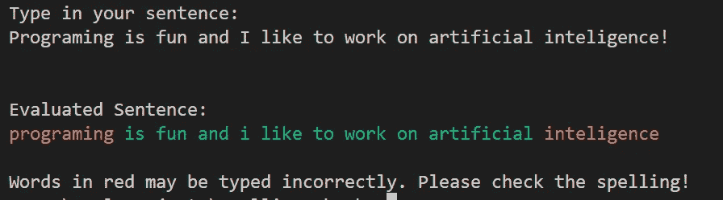

# 使用 Python 开发你自己的拼写检查工具包

> 原文：[`towardsdatascience.com/develop-your-own-spelling-check-toolkit-with-python-740bf84a865d`](https://towardsdatascience.com/develop-your-own-spelling-check-toolkit-with-python-740bf84a865d)

## 使用 Python 创建一个有效检查拼写的应用程序

[](https://bharath-k1297.medium.com/?source=post_page-----740bf84a865d--------------------------------)[](https://towardsdatascience.com/?source=post_page-----740bf84a865d--------------------------------) [Bharath K](https://bharath-k1297.medium.com/?source=post_page-----740bf84a865d--------------------------------)

·发表于 [Towards Data Science](https://towardsdatascience.com/?source=post_page-----740bf84a865d--------------------------------) ·7 分钟阅读·2023 年 1 月 11 日

--


图片由 [Olesia 🇺🇦 Buyar](https://unsplash.com/@olesichka?utm_source=medium&utm_medium=referral) 提供，来源于 [Unsplash](https://unsplash.com/?utm_source=medium&utm_medium=referral)

每当我开始撰写文章或其他工作相关内容时，我的主要关注点是将我的想法整理成文档或纸张。在这个过程中，我常常发现自己会遇到拼写错误或语法错误。

因此，建立你自己的拼写检查软件是一个绝妙的主意，尤其是当你遇到类似问题并希望优化工作时，而你专注的优先级是围绕生成和开发你的想法。

虽然已经有几个工具可以完成这个目的，但自己构建软件的好处在于你可以定制项目以进行额外改进。可以考虑的几种添加功能，如交互环境（使用 Tkinter 或其他类似库构建）、自然语言处理技术（如自动纠错）以及许多其他附加功能，都可以进一步增强项目。

同样重要的是要注意，虽然你可以对项目进行多种改进，但人工智能仍难以理解句子背后的真正语义。因此，幽默、讽刺或通用短语的陈述可能会被软件误解。我们将在未来的文章中讨论如何应对这些挑战。

我鼓励读者在继续阅读本文之前查看一个项目，该项目是如何使用 Python 构建语言过滤器的指南，链接如下。我们可以将本文和之前的工作整合起来，进一步升级项目，在此过程中可以屏蔽某些不适当的俚语，同时指出拼写错误。

[](/build-your-language-filter-with-python-d6502f9c224b?source=post_page-----740bf84a865d--------------------------------) ## 使用 Python 构建您的语言过滤器

### 如何在 Python 中构建语言过滤器的指南，适用于审查粗俗语言和其他不适当的内容

[towardsdatascience.com

# 开发拼写检查应用程序：


图片由 [Dariusz Sankowski](https://unsplash.com/es/@dariuszsankowski?utm_source=medium&utm_medium=referral) 提供，来源于 [Unsplash](https://unsplash.com/?utm_source=medium&utm_medium=referral)

在本文的这一部分，我们将构建应用程序，以便根据适当的颜色突出显示拼写，以指示它们是否正确（绿色突出显示正确单词，而红色表示可能的错误）。本文的每个子部分将涵盖项目的所有主要组件。

我们的主要目标是为用户开发适当的拼写检查软件。因此，我们不会将错误单词直接转换为最接近的建议单词，就像自动纠正项目那样。我们将在未来的文章中探讨这种任务！现在，让我们开始使用 Python 构建拼写检查应用程序。

## 导入核心库：

我们在此任务中将使用的核心库是*自然语言处理工具包（NLTK）*及其对应的词库，包含了一列常见的英语单词。请注意，如果开发者愿意，他们可以选择创建自己的词典，包含所有他们想要添加到词汇中的单词。然而，这个过程可能相当繁琐，但对于特定任务而言是值得的。

我们将用于该项目的其他库是 term color 和*正则表达式*模块。本文中提到的所有库都可以通过简单的`pip install`命令安装。正则表达式库帮助我们从特定句子中预处理不必要的内容，以便只关注输入的单词。另一方面，term color 库帮助通过分配适当的颜色来区分正确和错误的单词。

以下是开始项目所需导入的所有库的列表。

```py
# Importing the essential libraries for the required natural language processing task
import nltk
from nltk.corpus import words
from termcolor import colored
import re
```

## 预处理输入句子：

在本项目的这一部分，我们将重点关注从用户那里接受输入句子，以适当地对句子进行拼写测试。使用正则表达式替换命令，我们将用空格替换标点符号和其他特殊字符。我们采取以下步骤，以防止这些字符与单词一起包含。我们还可以将字符转换为小写，并准备评估句子。下面提供了执行以下操作的代码块。

```py
# Accepting the input sentence by the user
sentence = input("Type in your sentence: \n")

# Modifying the sentence for further processing
new_sentence = re.sub('[^A-Za-z0-9 ]+', '', sentence)
final_sentence = new_sentence.lower()
# print(final_sentence)

word_list = []
print("\n")
print("Evaluated Sentence: ")
```

## 为数据拼写检查创建顺序模式：

在本节中，我们将拆分句子并逐个验证每个单词的拼写。我们可以使用拆分命令根据空格拆分每个单词。请注意，由于我们在前面的步骤中已经预处理了句子，因此所有标点符号和特殊字符都被相应地移除。

下一步是检查句子中的每个单词是否存在于*nltk*单词包的列表中。没有在包中包含的单词将使用我们之前导入的 term color 库功能以红色打印。所有正确的单词将以绿色解释，句子将提供给用户。下面是计算以下过程的代码块。

```py
# Creating the loop for checking the spelling
for word in final_sentence.split():
    # print(word)
    if word not in words.words():
        print(colored(word, "red"), end = " ")

    else:
        word_list.append(word)
        print(colored(word, "green"), end = " ")

print("\n")
print(f"Words in red may be typed incorrectly. Please check the spelling!")
```

一旦我们完成了程序的编码，就可以通过命令提示符或交互式开发环境中的本地终端测试输出。

## 测试输出：



作者截图

一旦我们完成了项目的编码，就可以通过输入随机句子并实验程序的工作方式来测试输出。在大约 30 行代码中，我们可以发现我们成功地标记了可能拼写错误的单词为红色，同时所有拼写正确的单词标记为绿色。

该程序帮助推断特定句子或段落中的拼写错误，但我们可以进行一些改进，以使该项目更进一步。我们将在即将到来的部分中介绍一些好奇的开发人员可以探索的附加改进。

## 额外的改进：

在本节中，我们将查看我们可以添加的一些改进，以进一步改进该项目。开发人员可以开始着手下一步的一些值得注意的改进如下 —

1.  添加语言过滤器，如前一节所述，用于审查粗俗语言或其他不当俚语，使得该项目可以部署在有效的框架上。

1.  使用深度学习和自然语言处理来包含自动纠正技术和下一个单词预测。

1.  开发一个用户界面用于以下项目，而不是在命令终端或 IDE 的编译器中工作。我提供了一个 Python 中七个最佳 UI 图形工具的列表，以高效开发你的项目，并附有一些入门代码，你可以从下面的链接查看。

[](/7-best-ui-graphics-tools-for-python-developers-with-starter-codes-2e46c248b47c?source=post_page-----740bf84a865d--------------------------------) ## 7 个最佳 Python 开发者 UI 图形工具及入门代码

### 七款最佳 Python UI 图形工具，用于开发酷炫的用户界面技术

towardsdatascience.com

# 结论：


图片由 [Aaron Burden](https://unsplash.com/@aaronburden?utm_source=medium&utm_medium=referral) 提供，来源于 [Unsplash](https://unsplash.com/?utm_source=medium&utm_medium=referral)

> “只有一种拼写方式的思想，真是极其贫乏。”
> 
> ― **安德鲁·杰克逊**

打字或写作是大多数人生活中不可或缺的元素。在打字时，遇到各种拼写错误是常见的，从稍微长一点的错误到中等错误，再到最简单的拼写错误。虽然有许多工具可以指出这些错误，但能够构建自己的自定义拼写检查应用程序，并进一步升级为最适合自己需求的工具，极具满足感。

在这篇文章中，我们学习了如何用 Python 代码构建一个简单的拼写检查软件，大约 30 行代码。我们利用自然语言处理工具库简化了从典型词典中积累大部分合理英语单词的过程。我们使用正则表达式来简化数据，并使用 term color 库来相应地突出正确和错误的单词。

如果你希望在我的文章发布后立即收到通知，请查看以下 [链接](https://bharath-k1297.medium.com/subscribe) 订阅邮件推荐。如果你愿意支持我和其他作者，请订阅下面的链接。

[](https://bharath-k1297.medium.com/membership?source=post_page-----740bf84a865d--------------------------------) [## 使用我的推荐链接加入 Medium - Bharath K

### 阅读 Bharath K（以及 Medium 上其他成千上万的作家）的每一个故事。你的会员费直接支持…

bharath-k1297.medium.com](https://bharath-k1297.medium.com/membership?source=post_page-----740bf84a865d--------------------------------)

如果你对文章中提到的各种要点有任何疑问，请随时在评论区告诉我。我会尽快回复你。

查看一些与本文主题相关的其他文章，您可能会喜欢阅读！

[## Jupyter Notebooks 的终极替代方案](https://towardsdatascience.com/the-ultimate-replacements-to-jupyter-notebooks-51da534b559f?source=post_page-----740bf84a865d--------------------------------)

### 讨论了一个优于 Jupyter Notebooks 的优秀替代选项，用于解读数据科学项目

[## Jupyter Notebooks 的终极替代方案](https://towardsdatascience.com/the-ultimate-replacements-to-jupyter-notebooks-51da534b559f?source=post_page-----740bf84a865d--------------------------------) [## 7 篇最佳研究论文，助力深度学习项目入门](https://towardsdatascience.com/7-best-research-papers-to-read-to-get-started-with-deep-learning-projects-59e11f7b9c32?source=post_page-----740bf84a865d--------------------------------)

### 七篇经受时间考验的最佳研究论文，将帮助你创造出色的项目

[## 使用 Python 可视化 CPU、内存和 GPU 利用率](https://towardsdatascience.com/visualizing-cpu-memory-and-gpu-utilities-with-python-8028d859c2b0?source=post_page-----740bf84a865d--------------------------------)

### 分析 CPU、内存使用情况和 GPU 组件，以便监控你的 PC 和深度学习项目

[## 使用 Python 可视化 CPU、内存和 GPU 利用率](https://towardsdatascience.com/visualizing-cpu-memory-and-gpu-utilities-with-python-8028d859c2b0?source=post_page-----740bf84a865d--------------------------------)

感谢大家一直看到最后。希望大家喜欢这篇文章。祝大家有美好的一天！
