# 使用 NASA 的 Power API 创建气候 GPT

> 原文：[`towardsdatascience.com/developing-a-climate-gpt-using-nasas-power-api-37b3d9e2a664?source=collection_archive---------4-----------------------#2023-11-20`](https://towardsdatascience.com/developing-a-climate-gpt-using-nasas-power-api-37b3d9e2a664?source=collection_archive---------4-----------------------#2023-11-20)

[](https://medium.com/@astrobagel?source=post_page-----37b3d9e2a664--------------------------------)[](https://towardsdatascience.com/?source=post_page-----37b3d9e2a664--------------------------------) [Matthew Harris](https://medium.com/@astrobagel?source=post_page-----37b3d9e2a664--------------------------------)

·

[关注](https://medium.com/m/signin?actionUrl=https%3A%2F%2Fmedium.com%2F_%2Fsubscribe%2Fuser%2F4a2cd25b8ff9&operation=register&redirect=https%3A%2F%2Ftowardsdatascience.com%2Fdeveloping-a-climate-gpt-using-nasas-power-api-37b3d9e2a664&user=Matthew+Harris&userId=4a2cd25b8ff9&source=post_page-4a2cd25b8ff9----37b3d9e2a664---------------------post_header-----------) 发表在 [Towards Data Science](https://towardsdatascience.com/?source=post_page-----37b3d9e2a664--------------------------------) ·10 min read·2023 年 11 月 20 日[](https://medium.com/m/signin?actionUrl=https%3A%2F%2Fmedium.com%2F_%2Fvote%2Ftowards-data-science%2F37b3d9e2a664&operation=register&redirect=https%3A%2F%2Ftowardsdatascience.com%2Fdeveloping-a-climate-gpt-using-nasas-power-api-37b3d9e2a664&user=Matthew+Harris&userId=4a2cd25b8ff9&source=-----37b3d9e2a664---------------------clap_footer-----------)

--

[](https://medium.com/m/signin?actionUrl=https%3A%2F%2Fmedium.com%2F_%2Fbookmark%2Fp%2F37b3d9e2a664&operation=register&redirect=https%3A%2F%2Ftowardsdatascience.com%2Fdeveloping-a-climate-gpt-using-nasas-power-api-37b3d9e2a664&source=-----37b3d9e2a664---------------------bookmark_footer-----------)

图像由 ChatGPT 创建

TL;DR

*在本文中，我们探讨了 OpenAI 新推出的 GPTs 功能，它提供了一种无代码的方式，快速创建能够自动调用外部 API 以获取数据并生成代码以回答数据分析问题的 AI 代理。仅仅几个小时，我们就构建了一个能够基于 NASA Power API 的数据回答气候相关问题并执行数据分析任务的聊天机器人。OpenAI 创建的 GPT 用户体验非常出色，显著降低了创建最先进 AI 代理的门槛。不过，外部 API 调用配置可能会有些技术挑战，并且需要 API 提供 openapi.json 文件。此外，成本仍然未知，虽然在预览期间，GPTs 似乎对每天允许的交互次数有一些限制。然而，随着 OpenAI GPT 商店的即将推出，我们可能会看到这些 GPT AI 代理的爆炸式增长，即使现在它们已经提供了一些令人惊叹的功能。*

# 什么是 GPT？

[GPTs 最近由 OpenAI 推出](https://openai.com/blog/introducing-gpts)，提供了一种让非技术用户创建由强大的 [GPT-4](https://openai.com/research/gpt-4) 大型语言模型驱动的 AI 聊天代理的方式。虽然通过 [LangChain](https://www.langchain.com/) 和 [autogen](https://github.com/microsoft/autogen) 等第三方库已经可以实现大多数 GPTs 提供的功能，但 GPTs 提供了原生解决方案。随之而来的是一个光滑易用的界面和与 OpenAI 生态系统的紧密集成。重要的是，它们很快也将出现在新的 GPT 商店中，这提高了我们可能看到应用商店情况和 AI 代理爆炸性增长的可能性。或者也可能不是，这很难判断，但潜力无疑存在。

GPTs 具有一些非常强大的功能，特别是能够浏览网络、生成和运行代码，以及最强大的功能，能够与 API 进行通信以获取外部数据。最后这一点非常强大，因为它意味着基于任何使用 API 提供数据的数据存储创建 AI 代理应该是很容易的。

# 创建 GPT

GPTs 目前仅对 ChatGPT Plus 订阅用户开放。要创建一个，您需要访问 [chat.openai.com/create](https://chat.openai.com/create)，这将提示您提供有关您的 GPT 将做什么的一些细节以及您想使用的缩略图（可以使用 DALL-E-3 自动生成）。

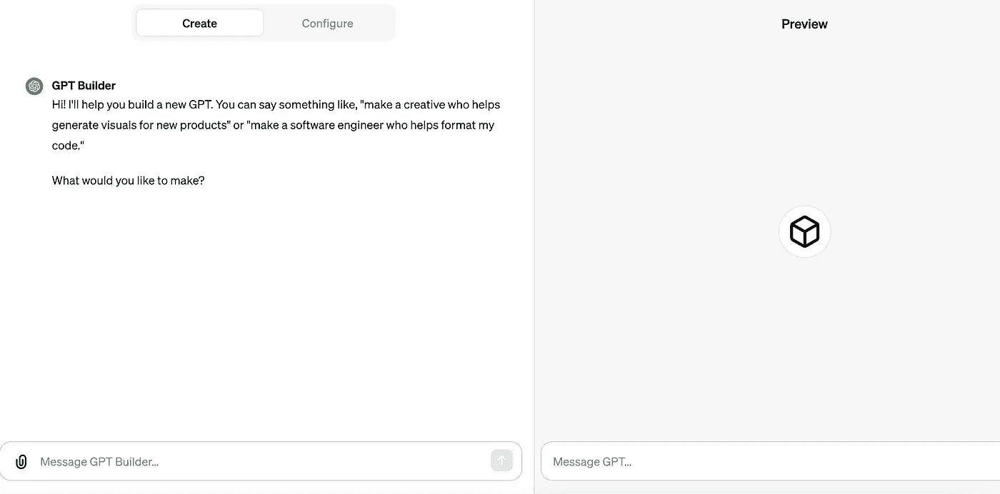

对于这次分析，我使用了提示“**创建一个气候指标聊天机器人，使用 NASA Power API 获取数据**”。这创建了一个具有以下系统提示的 GPT（在“配置”下的“说明”字段中）…

```py
The GPT is designed as a NASA Power API Bot, specialized in retrieving and 
interpreting climate data for various locations. Its primary role is to 
assist users in accessing and understanding climate-related information, 
specifically by interfacing with NASA's Power API. It should focus on 
providing accurate, up-to-date climate data such as temperature, 
precipitation, solar radiation, and other relevant environmental 
parameters.

To ensure accuracy and relevancy, the bot should avoid speculating on 
data outside its provided scope and not offer predictions or 
interpretations beyond what the API data supports. It should guide users in 
formulating requests for data and clarify when additional details are 
needed for a precise query.

In interactions, the bot should be factual and straightforward, 
emphasizing clarity in presenting data. It should offer guidance on how 
to interpret the data when necessary but maintain a neutral, informative 
tone without personalization or humor.

The bot should explicitly ask for clarification if a user's request is 
vague or lacks specific details needed to fetch the relevant data from 
the NASA Power API.
```

根据我提供的单句内容，这似乎非常合理。当然，这可以根据口味进行调整，正如下文所述，这也是指导聊天机器人关于 API 调用的一个好地方。

# 配置能力

GPT 可以配置各种功能。对于我们的分析，我们将停用生成图像的能力，并保持浏览网页以及使用代码解释器生成和运行代码的能力。对于生产环境的 GPT，我可能会停用网页访问，并确保所有必需的数据由指定的 API 提供，但对于我们的分析，我们将其保留，因为它对于获取经度和纬度来调用 NASA Power API 是很方便的。

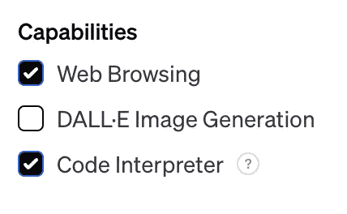

# 配置 API 访问

这是数据驱动 GPT 的核心，配置 API 集成。要做到这一点，您需要在您的 GPT 顶部点击‘配置’，然后向下滚动，点击‘创建操作’……

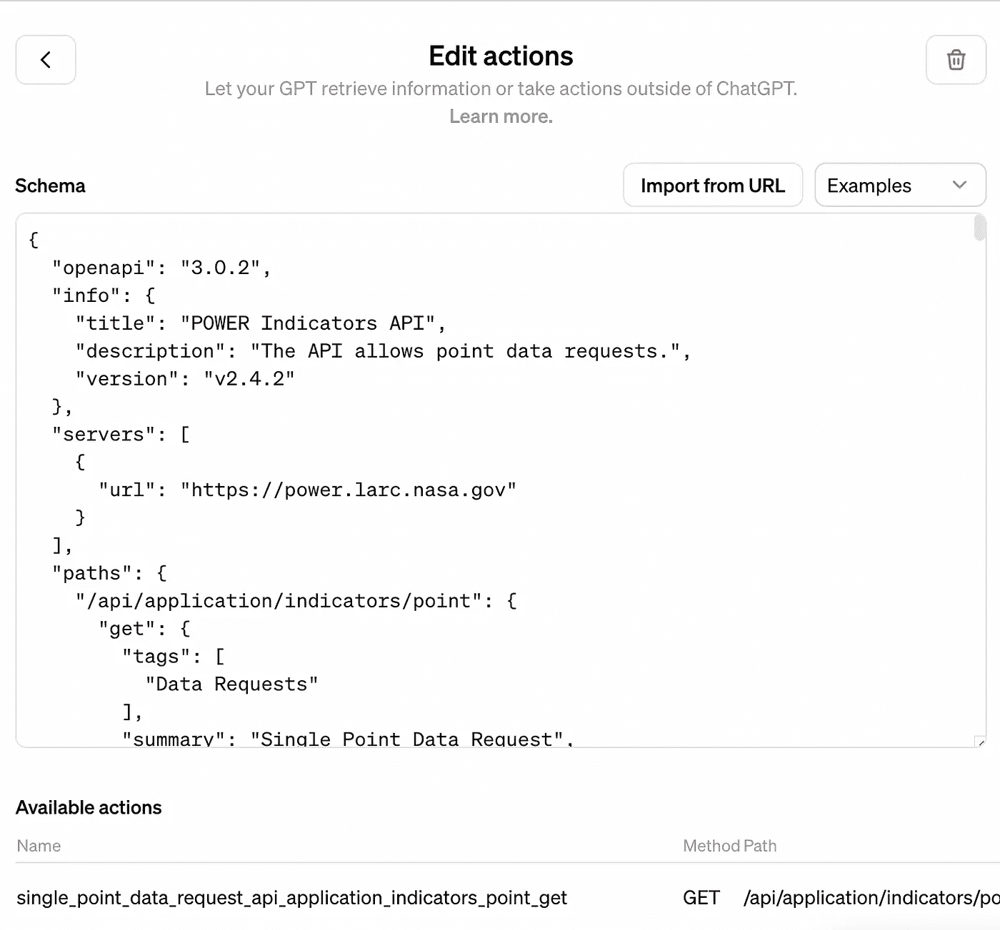

配置 GPT 以与 NASA 的 Power API 进行气候数据通信

这打开了一个部分，您可以通过提供或粘贴一个[openapi.json](https://swagger.io/specification/)（之前是 swagger）API 定义的链接来提供 API 的详细信息。

当然，这带来一个限制条件，即外部 API 需要有一个可用的 openapi.json 文件。尽管这在许多重要的 API 中非常普遍，但并非所有情况都如此。此外，默认的 openapi.json 通常需要进行一些调整才能使 GPT 正常工作。

# NASA Power API

对于这个分析，我们将使用[NASA 全球能源资源预测 (POWER)](https://power.larc.nasa.gov/docs/) API 获取气候指标。这个令人惊奇的项目结合了广泛的[数据和模型模拟](https://power.larc.nasa.gov/docs/methodology/)，为点位提供一组气候指标的 API。有几个 API 端点，对于这个分析，我们将使用[指标 API](https://power.larc.nasa.gov/docs/services/api/application/indicators/)，其中包含一个[openapi.json 规范](https://power.larc.nasa.gov/api/pages/?urls.primaryName=Indicators)，它被粘贴在 GPT 的操作配置窗格中。需要对其进行一些处理以 (i) 确保任何参数描述都在 300 字符以内；(ii) 添加一个‘servers’部分…

```py
"servers": [
  {
    "url": "https://power.larc.nasa.gov"
  }
],
```

当 GPT 用户界面中的所有异常都得到解决时，openapi.json 中指定的端点出现…

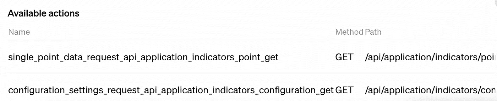

NASA Power API 指标端点，GPT 用户界面显示稍作调整的 openapi.json 规范

我本来会添加其他 API，比如[气候学](https://power.larc.nasa.gov/api/pages/?urls.primaryName=Climatology)，但 OpenAI 不支持具有相同端点域的多个操作，即我无法为 NASA 提供的每个 openapi.json 创建一个操作。我必须将它们合并成一个较大的 openapi.json 文件，这并不是非常困难，但我选择为这个分析保持简单，只使用指标端点。

# 调整系统提示

通过直接与 API 进行一些实验，我发现每次调用中并未提供“user”字段，导致 API 异常。为了解决这个问题，我将这一点添加到系统提示中…

```py
ALWAYS set 'user' API query parameter to be '<MY API ID>'
```

我创建了一个字母数字用户 ID 用于 API 调用。

# 测试我们的 GPT

在 GPT 编辑屏幕中，左侧窗格用于调整配置，右侧窗格用于预览。我发现预览提供了一些额外的调试信息，在发布的 GPT 中特别有用，尤其是用于调查 API 问题。

在询问“**东京的平均降雨量是多少**”时，我被要求确认使用 API…

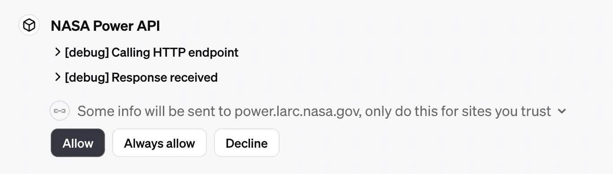

在第一次使用 API 操作时，GPT 所有者会被提示确认。

我选择了“始终”，然后 GPT 调用了 API。然而，它收到的响应表明需要一个年份范围…

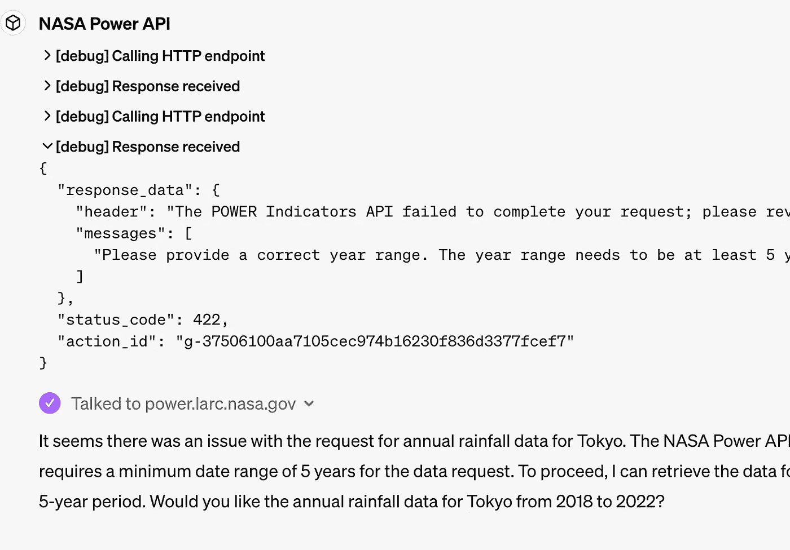

这相当酷，它已经建议使用 2018 年至 2022 年的解决方案，我通过回复“是”的方式接受了…

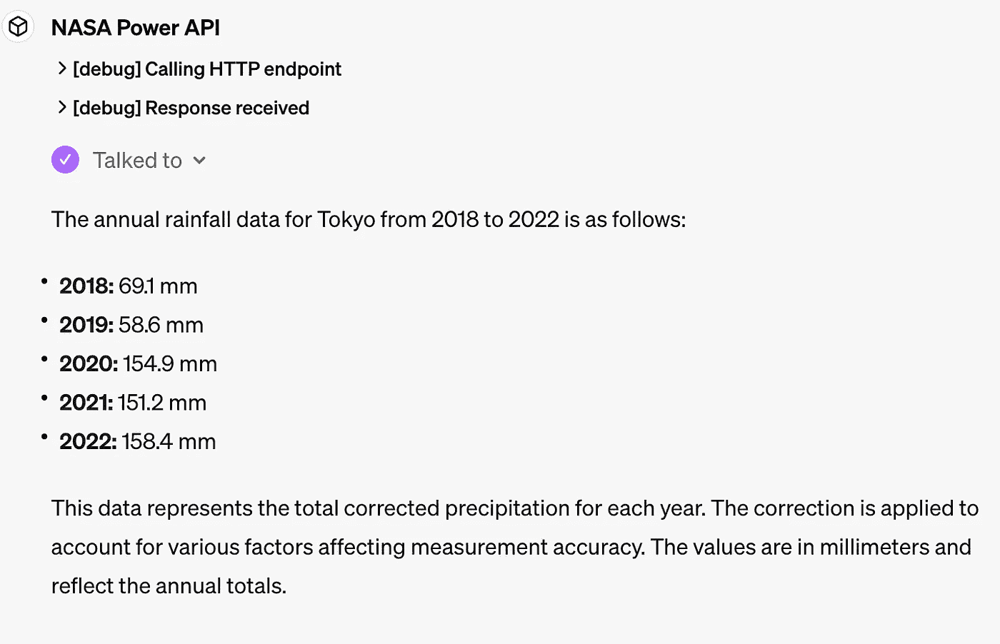

GPT 成功使用 NASA 的 Power API 获取并展示了东京的平均降雨量。

在[API 页面](https://power.larc.nasa.gov/api/pages/?urls.primaryName=Indicators)上使用“试一下”按钮，输入上述年份范围和东京的纬度/经度为 35.6895/139.6917，我得到了一个响应。因为我对变量名称不熟悉，所以我询问了 GPT…

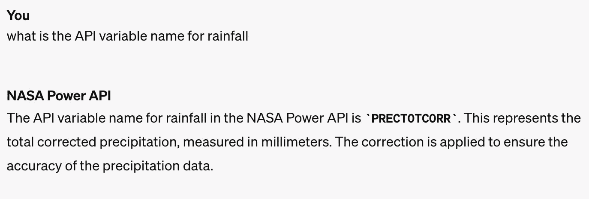

GPT 在展示 API 变量名称方面非常有帮助。

回到 API 响应，我们看到…

```py
 "PRECTOTCORR": {
    "1": 69.1,
    "2": 58.6,
    "3": 154.9,
    "4": 151.2,
    "5": 158.4,
    "6": 184.3,
    "7": 247.3,
    "8": 140.4,
    "9": 226.8,
    "10": 226.2,
    "11": 100.3,
    "12": 73.7
  },
```

嗯，所以底层的 API 数据实际上提供了每个月的数据，但 GPT 的响应只取了前 5 个，并呈现为年度平均值。

所以事情看起来*很*不错，但正如我们经常发现的那样，我们需要稍微调整 GPT，以避免产生幻觉。让我们在 GPT 配置的“说明”部分提供更多关于 API 的上下文信息…

```py
The API provides data averaged for the year range specified. If and data is 
returned with 12 elements, this is likely a list of monthly means.
```

再试一次，“**东京的平均降雨量是多少**”…

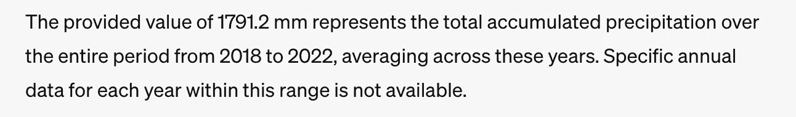

现在这是正确的。通过一点提示改进性能的好例子。

让我们请求它进行一些分析，“**请绘制月度平均值**”…

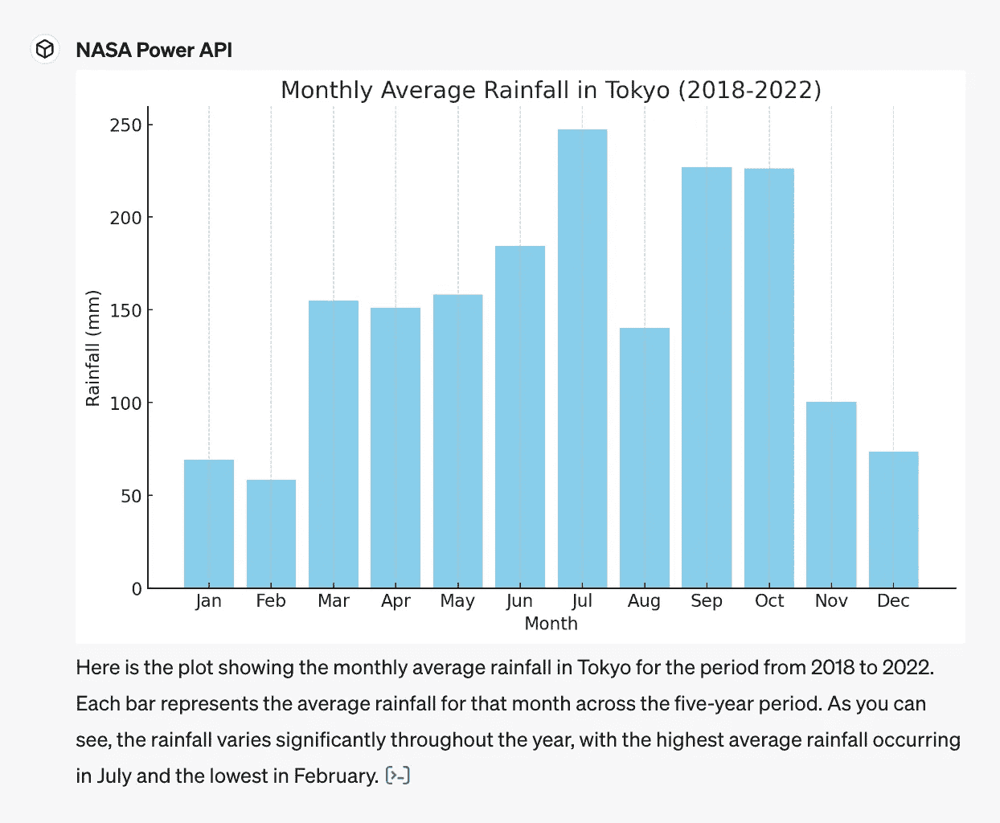

GPT 可以使用从 API 检索的数据运行代码，以提供基本数据分析。

这非常巧妙！上图中的值与直接从 API 检索到的值相符。在其响应的末尾，有一个链接，你可以查看它生成并运行的代码…

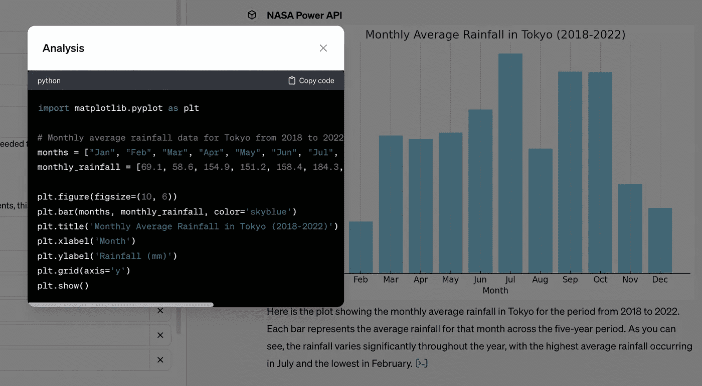

好了，现在让我们尝试一些更复杂的事情。首先我询问可用的变量是什么…

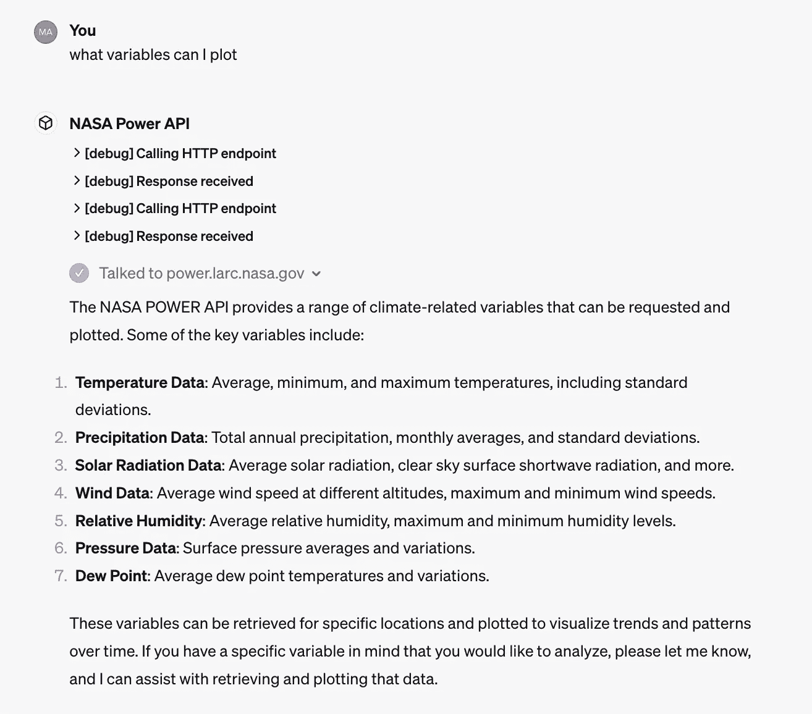

GPT 可以查询文档 API 终端点。

它自动访问了配置端点以获取元数据。利用这个，让我们问“**在过去 5 年中，南威尔士的尼思的相对湿度是否与太阳辐射相关？**”…

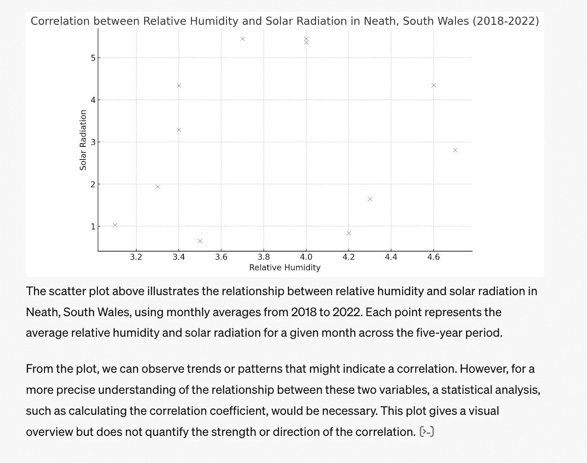

它查询了 API 以获取数据，然后生成代码来创建图表。相当惊人，但没有回答完整的问题，所以让我们坚持问“**请计算相关系数**”…

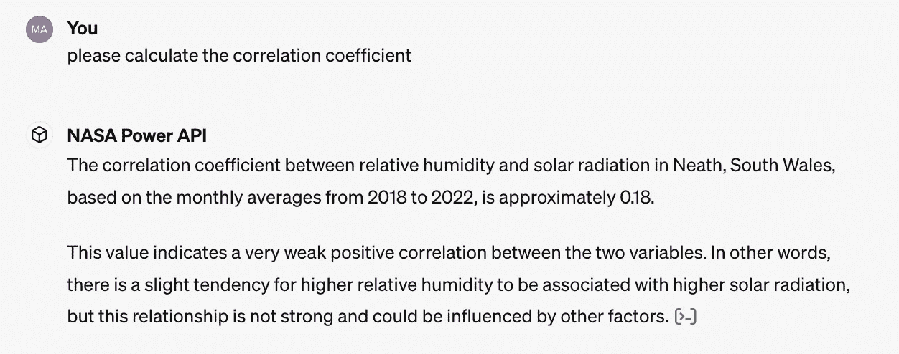

点击链接查看代码…

```py
import pandas as pd
import seaborn as sns

# Monthly data for relative humidity and solar radiation in Neath, South Wales from 2018 to 2022
months = ["Jan", "Feb", "Mar", "Apr", "May", "Jun", "Jul", "Aug", "Sep", "Oct", "Nov", "Dec"]
relative_humidity = [4.2, 4.3, 4.7, 4.6, 4.0, 4.0, 3.7, 3.4, 3.4, 3.3, 3.1, 3.5]  # Sampled values from MCWBR_DB or similar
solar_radiation = [0.84, 1.65, 2.81, 4.35, 5.36, 5.45, 5.45, 4.34, 3.29, 1.94, 1.03, 0.65]  # Sampled from RADIATION_AVG

# Creating a DataFrame
data = pd.DataFrame({'Month': months, 'Relative Humidity': relative_humidity, 'Solar Radiation': solar_radiation})

# Plotting
plt.figure(figsize=(10, 6))
sns.scatterplot(data=data, x='Relative Humidity', y='Solar Radiation')
plt.title('Correlation between Relative Humidity and Solar Radiation in Neath, South Wales (2018-2022)')
plt.xlabel('Relative Humidity')
plt.ylabel('Solar Radiation')
plt.grid(True)
plt.show()

# Calculating the correlation coefficient between relative humidity and solar radiation
correlation = data['Relative Humidity'].corr(data['Solar Radiation'])
correlation
```

这是合理的。

好的，那多地点比较怎么样？首先，我将这添加到指令（系统提示）中以确保清楚…

```py
Is asked about multiple locations call the API for each location to get data.
```

现在，让我们问“**在过去 5 年中，斯瓦尔巴比巴戈德威尔士更潮湿吗？**”…

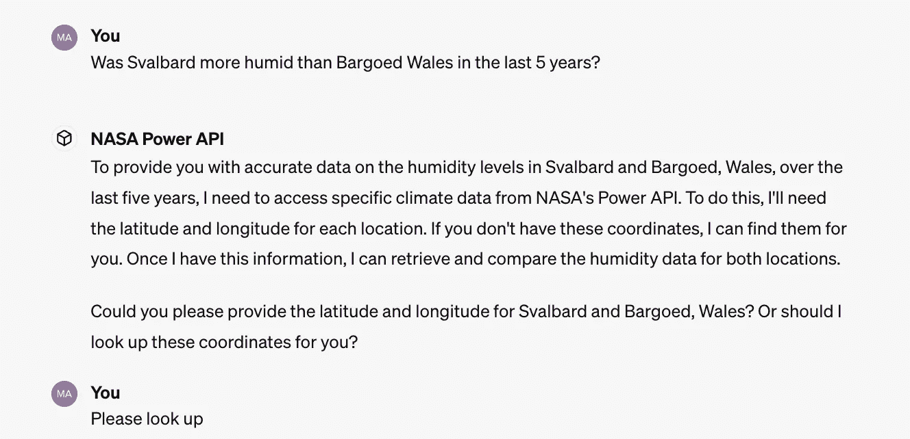

由于 API 需要经纬度，GPT 确认了这种方法。如果我们配置了地理编码 API 作为一个操作，这就不需要了，但目前使用中心坐标就足够了。

GPT 调用了两个位置的 API，提取数据，并进行比较…

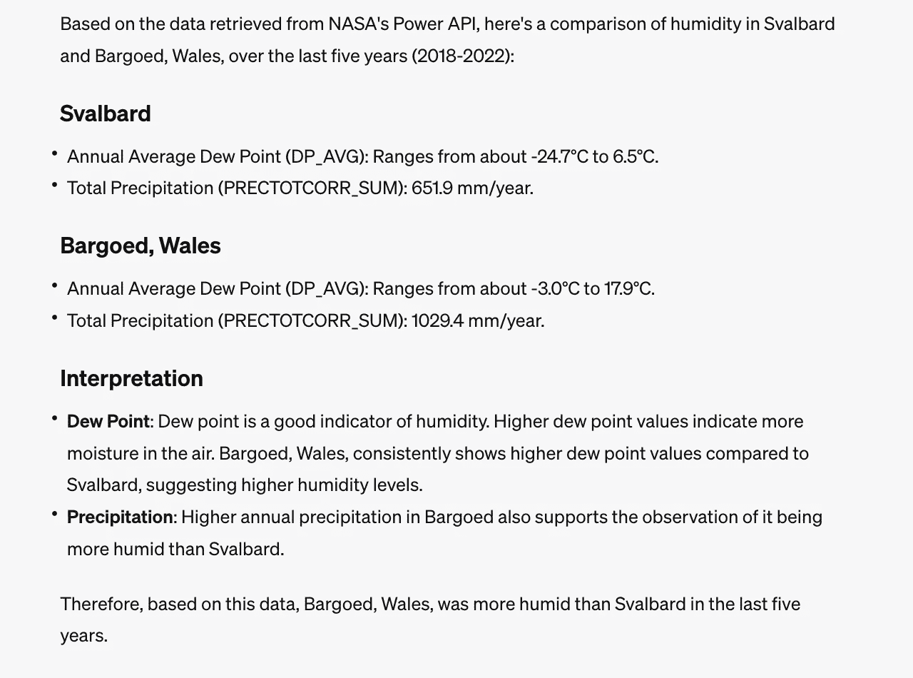

我在巴戈德长大，诚实地说，这里是个**非常**多雨的地方。直接调用 API，以上数值是正确的。

# 限制

在这次分析中出现了一些挑战。

首先，似乎每天允许的 GPT-4 交互次数有限。在测试了一两个小时后达到了这个限制，这似乎低于公布的[GPT-4 限制](https://platform.openai.com/account/limits)，所以这可能与 GPT 的预览性质有关。这将阻止任何生产部署，但希望在 GPT 商店推出时能解决这个问题。

性能有时也可能稍慢，但考虑到 GPT 在调用外部 API 并运行代码，也不是不合理的。用户体验非常好，清楚地向用户表明事情正在进行中。

成本是一个未知数，或者说，我们没有看到成本的显著影响，但会继续跟踪。GPT 生成代码并分析来自 API 的长响应，因此令牌成本可能会成为许多组织使用它们的障碍。

# 结论和未来工作

在这次分析中，我们仅使用了‘指标’NASA Power API 端点。使用所有的 NASA Power 端点并结合地理编码，创建一个真正全面的气候聊天机器人将不会太费力。

GPT 提供了一种低代码的方式来开发最先进的 AI 代理，这些代理能够自动与 API 接口并生成代码以执行数据分析。它们可能会改变游戏规则，我们仅用了几小时就能创建一个相当先进的气候聊天机器人，而无需写一行代码！

目前它们还远远不完美，配置用户体验非常好，但在一些领域，如 API 错误报告，用户往往不得不猜测。外部 API 设置需要技术知识，有些 API 可能缺少所需的 openapi.json，导致实现难度增加。成本也可能很高，但由于 GPTs 仍处于预览阶段，具体情况难以判断。与 *任何* LLM 应用一样，许多工作将是确保事实准确性，任何软件项目所需的典型设计和工程工作流程仍然适用。

GPTs 非常了不起，但还不是魔法……还没有。

# 参考文献

*对于* [NASA 全球能源资源预测 (POWER)](https://power.larc.nasa.gov/docs/)：*“这些数据来自 NASA Langley 研究中心（LaRC）POWER 项目，该项目由 NASA 地球科学/应用科学计划资助。”*
